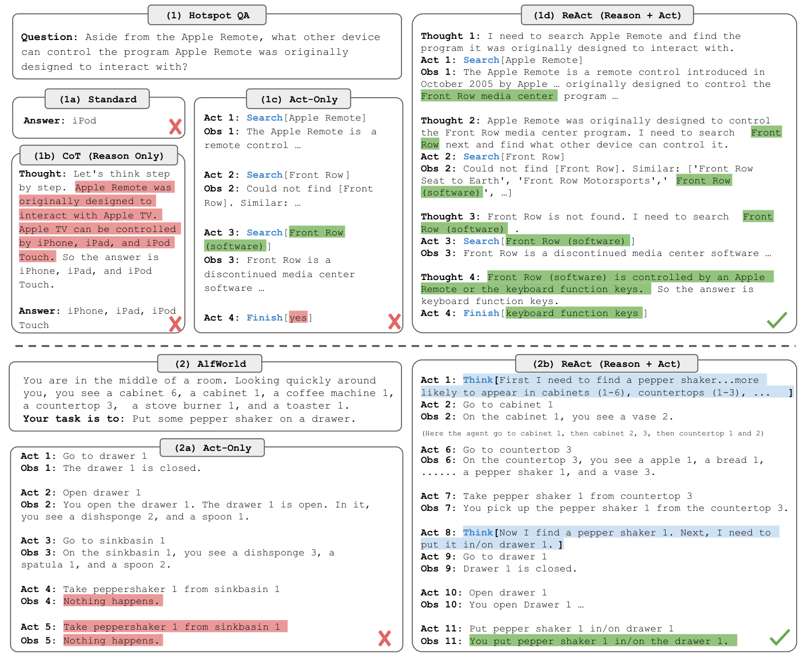
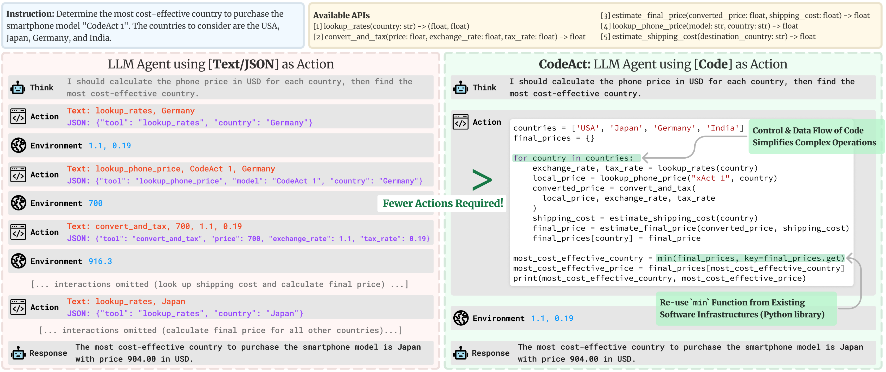

# 01 · 循环与协议：ReAct、function calling、MCP 与 CodeAct

> 本篇给出闭环的**协议**部分：模型如何把 action 表达出来，harness 如何把 observation 喂回去。四种方式（ReAct 文本、function calling、MCP、CodeAct）语义相同，差别在于「动作空间的形状」和「由谁来解析」。经典系统如何使用这些协议，见 `02`。

---

## 1. 不变量：Thought–Action–Observation

Yao et al. 2022 的 ReAct 把「只想」（CoT）和「只做」（Act）叠成一条交错轨迹。形式就是 [`00`](./00_definitions.md) 的 $\hat{\mathcal{A}}=\mathcal{A}\cup\mathcal{L}$：thought 更新 $c_t$，action 更新环境。



> 图：同一道多跳题。Standard 直接猜错；CoT 在内部编造 Apple TV；Act-only 会搜但不会在歧义处改写查询；ReAct 用 Thought 决定搜什么、从 Obs 里抽 Front Row，再改写成 `Search[Front Row (software)]`，最后 `Finish[keyboard function keys]`。下半是 ALFWorld：没有 Thought 就会对着空的 sinkbasin 死循环。（Yao et al. 2023, Fig 1；[arXiv:2210.03629](https://arxiv.org/abs/2210.03629)）

这张图应该当作协议说明书来读，而不是当作「prompt 技巧」来读：

1. **Thought 是给后续决策用的**，不是给用户看的注释。它把「我现在缺哪条事实 / 上一步 Obs 哪句有用 / 计划要不要改」写进 $c_{t+1}$。
2. **Action 必须能被 harness 解析**。ReAct 原文用的是 `Search[…]` / `Lookup[…]` / `Finish[…]` 这种文本约定——解析器是正则，失败了整步作废。
3. **Observation 必须写回**。没有 Obs，ReAct 就退化成 CoT；有 Obs 但模型看不见（只打日志），闭环是断的。
4. **失败也是 Obs**。Act-only 在 ALFWorld 里对着空位置反复 `take`，就是没有 Thought 来消化「这里没有」这条 Obs。

原论文的 action 是**领域相关的小集合**（Wikipedia 三个动词，ALFWorld 的导航动词）。今天的 coding agent 把 $\mathcal{A}$ 换成了 bash / 编辑器 / 浏览器，但交错结构没变。DeepSeek Harness 默认 driver 的类名就叫 `ReactLoopAgent`（[[deepseek-harness:packages/core/agent-loop/src/agent.ts#L64]]）。

---

## 2. 从文本协议到 function calling

ReAct 原文依靠 few-shot 示例把格式教给模型。这种做法在 2022 年可行，但在工程上有三个脆弱点：

| 脆点 | 后果 |
|---|---|
| 动作是自由文本 | `Search[Apple Remote]` 和 `search Apple Remote` 和 markdown 代码块混在一起，解析器要猜 |
| 参数没有类型 | 数字、路径、嵌套对象全靠模型「看起来像」 |
| 一次只能说一个 Action | 想并行搜两个实体，得再走一轮 generate |

2023 年起，模型 API 把 tool 收成一等输出通道，就是 **function calling**（OpenAI 先做，Anthropic / DeepSeek 等跟进，字段名略有差别，结构同构）。请求侧多一块 schema，响应侧多一块结构化 `tool_calls`：

```json
{
  "messages": [
    {"role": "user", "content": "这个测试为什么挂了？"}
  ],
  "tools": [
    {
      "type": "function",
      "function": {
        "name": "bash",
        "description": "Run a shell command in the workspace.",
        "parameters": {
          "type": "object",
          "properties": {
            "command": {"type": "string"},
            "timeout_ms": {"type": "integer"}
          },
          "required": ["command"]
        }
      }
    }
  ]
}
```

模型不再把 `bash` 写进 assistant 文本，而是返回：

```json
{
  "role": "assistant",
  "content": null,
  "tool_calls": [
    {
      "id": "call_01",
      "type": "function",
      "function": {
        "name": "bash",
        "arguments": "{\"command\":\"pytest tests/test_foo.py -q\"}"
      }
    }
  ]
}
```

此时 harness 的工作变成完全机械的流程：

```
校验 name ∈ 已登记集合
按 JSON Schema 解析 arguments          # 失败 → 当 observation 退回，不要崩
policy / 审批
execute
把结果写成 role=tool 的 message，带上 call_id
再 generate
```

和 ReAct 文本协议对比：thought 还在（现在常走独立的 reasoning 通道，或就写在 `content` 里），变的是 **action 从「需要解析的句子」变成「已经是对象的字段」**。闭环本身没变。

`arguments` 在线上几乎总是 **JSON 字符串**，不是已经 parse 好的对象——DeepSeek 的 session 事件就原样保存这个字符串（[[deepseek-harness:packages/core/session/src/types.ts#L275-L279]] 的 `tool/call.arguments`）。parse 失败是 tool 的 observation，不是 harness 的 crash。

---

## 3. 一次 step 里的并行 tool call

function calling 允许模型在**同一次** assistant message 中调用多条 tool。这里需要先把语义定义清楚，否则并行执行会把轨迹写乱：

```
step n:
  model 一次返回  [call_1, call_2, call_3]
  harness 可以并行 execute
  但写回 messages 的顺序 = 模型给出的顺序
  全部 result 齐了（或策略决定提前停），才进入 step n+1
```

两条约束：

1. **并行的是执行，不是因果。** `call_2` 不得假设 `call_1` 的副作用已经发生。模型如果需要「先 pytest 再根据失败读文件」，它应该在第一步只点 `bash`，等 observation 再点 `read_file`。
2. **写回顺序是模型序。** 即使 `call_3` 先跑完，log 里也按 `call_1, call_2, call_3` 排。否则 prefix 不再稳定，resume / replay / 任何 prefix cache 都会对不齐。

DeepSeek 的调度写在 [[deepseek-harness:packages/core/agent-loop/src/tool-calls.ts#L1-L11]]：exclusive call 当 barrier；可并行的走 bounded rolling pool；dispatch 可以 overlap，但 **policy、result、result context 保持 model-ordered**。某条 tool 可以声明「我结束整个 turn」（`concludesTurn`），那是协议上的早停，不是乱序。

错误也必须进入同一个顺序：

| 失败种类 | 应该变成什么 | 不该变成什么 |
|---|---|---|
| schema 对不上 / 未知 tool 名 | `tool/result` 里一条错误 observation | 抛给用户当 500 |
| 命令非 0、文件不存在 | 普通 observation（stderr + exit code） | 静默当成功 |
| sandbox 把写拒绝了 | 带 denial dialect 的 observation（EROFS / EACCES / EPERM） | 和「命令自己失败」混成一种 |
| sandbox runner 自己没起来 | 基础设施错误（`SANDBOX_UNAVAILABLE`），**命令没跑过** | 当成 pytest 挂了 |
| 用户取消 | 已启动的 call 要有 result（哪怕是 aborted），跳过的 call 也要补合成 result | log 里留下没有 result 的 `tool/call` |

最后一条是 replay 不变量：有 `tool/call` 就必须有配对的 `tool/result`。dsh 在 abort 时会给还没 dispatch 的 call 补合成错误结果（`tool-calls.ts:8-10`）。

---

## 4. MCP：tool 登记与调用协议

function calling 解决了「模型如何表达 action」，但没有解决「tool 从哪来」：早期每个产品自己把 schema 塞进请求，IDE、浏览器、数据库各写一套 adapter。

**Model Context Protocol (MCP)**（Anthropic, 2024）把这件事收成 client–server 协议：

```
MCP host (harness / IDE)
    │  JSON-RPC
    ├─► MCP server A   tools/list, tools/call     # 例如 git
    ├─► MCP server B   resources / prompts        # 例如内部文档
    └─► MCP server C
```

和 function calling 的关系：

- MCP 的 `tools/list` 产出的就是一条条 JSON Schema，harness 原样（或略作包装）塞进下一次 generate 的 `tools` 字段。
- 模型点名之后，harness 走 `tools/call`，把 server 返回的 content 写成 observation。
- **模型仍然不会说 MCP。** 它只看见普通 tool。协议发生在 harness 和 tool 进程之间。

所以 MCP 不是第五种 loop，而是 tool registry 的一种传输协议。DeepSeek 的 `ctx.tools.register()` 同时收 first-party `defineTool` 和「MCP 源来的 raw JSON-Schema `ToolDefinition`」——登记口是同一个，来源可以是进程外。

---

## 5. CodeAct：以代码为动作空间

JSON tool call 的表达力止于「一次调用一条预先登记的函数」。遇到多实体、带分支、要复用中间量的任务时，模型只能把控制流留在自己的多轮对话里——每一步都要付一次 generate。

Wang et al. 2024 的 **CodeAct** 换了一个动作空间：模型改为输出可执行代码（通常是 Python），环境是解释器。登记过的 API 变成代码里的普通函数；循环、分支、`min()` 这类语言设施都可以直接使用。



> 图：左边每个 `lookup_rates` / `convert_and_tax` 都是一次 Thought–Action–Obs；右边模型写一个 `for country in countries` 的脚本，控制流和数据流留在代码里，environment 一次跑完。「Fewer Actions Required」不是修辞，是少付的 generate 次数。（Wang et al. 2024, Fig 2；[arXiv:2402.01030](https://arxiv.org/abs/2402.01030)）

代价立刻变成 sandbox 的事：JSON tool 的副作用是 enumeration 过的；一段 Python 可以 `os.system`、可以写任意路径、可以开网络。**CodeAct 把轴 1 的表达力换成了轴 2 的隔离预算。** 没有解释器级隔离，就不要把代码当动作空间。

DeepSeek Harness 的 **Code mode**（产品页也叫 PTC）是同一想法的工程版：tools 通过 Code Mode SDK 暴露，模型用一份 TypeScript 程序组合多步，而不是每步回一次 JSON。[[deepseek-harness:packages/core/tools/src/code-mode.ts]] 把 native tool 和 `run_code` 子分发收成同一套 pre-execute / post-execute 序。Minimal mode 则反过来：只留持久 bash 和 `str_replace_editor`，用来给模型做「最小环境」基准——这是把动作空间收小，和 CodeAct 把动作空间放大，是同一根轴的两端。

---

## 6. 四种协议对照

| | 动作怎么写 | 谁解析 | 一次 generate 能做多复杂的事 | 对 isolation 的要求 |
|---|---|---|---|---|
| **ReAct 文本** | `Action: Search[…]` | harness 正则 / 有限状态 | 一个领域动词 | 低（API 调用） |
| **function calling** | `tool_calls[].function` | 模型解码器 + JSON Schema | 一条或并行几条已登记函数 | 取决于函数本身 |
| **MCP** | 同上（模型侧无差别） | harness ↔ MCP server | 同上；tool 集合运行时可变 | 在 server 进程一侧 |
| **CodeAct / Code mode** | 一段程序 | 解释器 | 任意控制流 + 复用已有库 | **高**（任意代码） |

选型不是谁取代谁：

- 给模型一个计算器、一个搜索，function calling 足够，也最好约束。
- tool 来自许多独立团队、要热插拔，用 MCP 运输，模型侧仍是 function calling。
- 任务是「对 200 个文件做同一类机械变换」或「先算再滤再画图」，CodeAct 能省掉很多轮交互。
- 评测模型本身而不是评测 tool 堆，用 Minimal 那种两工具环境。

不管选哪一种，harness 必须保证 [`00`](./00_definitions.md) 里那条不变量：**模型看见的每一条 observation，都能从 log 重建。** 协议只决定 bytes 长什么样。

---

下一篇：[02 · 经典工作](./02_classic_works.md) —— 看经典工作各自推进了「动作怎么表达」和「世界长什么样」中的哪一根轴。
