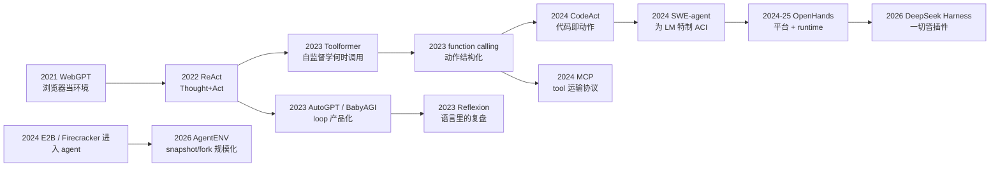
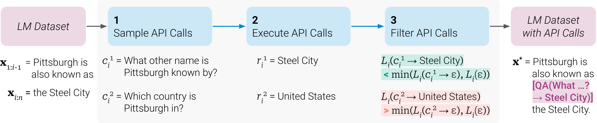
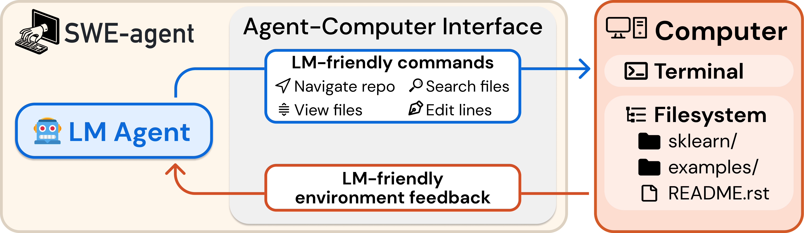

# 02 · 经典工作

> 本篇只收那些真正**改变了设计空间**的工作。AutoGPT 这一类产品名会出现，但只是把它当作「把 loop 从论文搬进 overnight 进程」的历史节点，不逐个评测分数。每一节会先说明它解决了哪根轴上的哪一个缺口，再说明它留下了什么问题。现代代码层面的对照放在 `03`/`04`。

---

## 1. 设计缺口

[`01`](./01_loop_and_tool_use.md) 里的闭环，其实在 2021 到 2022 年就已经能写出来了。后面五年的论文和开源项目，大多是在补下面这五个缺口中的某一个：

| 缺口 | 问题 | 代表性工作 |
|---|---|---|
| **A. 想和做是分开的** | 纯 CoT 会幻觉；纯 Act 不会改计划 | ReAct（已在 `01`） |
| **B. 模型不会自己决定「该不该用工具」** | few-shot 只能教一种任务 | Toolformer |
| **C. 动作空间对 LM 不友好** | 把 Linux shell 原样塞给模型，它会 cat 爆、edit 写坏 | SWE-agent 的 ACI |
| **D. 一次 JSON 调用表达力不够** | 多实体、带分支的任务被拆成几十轮 | CodeAct（已在 `01`）；OpenHands 默认走这条 |
| **E. 世界不是一条 API，是一台计算机** | 要持久 shell、浏览器、桌面、以及隔离 | WebGPT / Computer Use / OpenHands runtime |
| **F. loop 要能当产品跑过夜** | 内存、重试、人机插入、插件 | AutoGPT → 今天的 coding harness |

下面按缺口来讲，不按箭头逐个复述。

---

## 2. 缺口 B：何时调用工具 —— Toolformer

ReAct 假定读者已经知道这个任务该用 Wikipedia。生产环境里模型面对的情况是「有时候要算、有时候要搜、有时候什么都不用」。Schick et al. 2023 的 Toolformer，把「该不该调用」这个决策收进了语言模型自己手里，而且不需要依赖任务级别的标注。

它的做法是一套自监督的三步流程（论文 Fig 2）：先用很少的 API 示范，让模型在语料的某个位置采样出候选调用；然后真的执行这些调用；最后只保留那些能够降低后续 token 损失 $L_i$ 的调用，拿去做 finetune。

> 图：对句子 “Pittsburgh is also known as the Steel City”，候选 QA「Steel City 别称」被保留了下来，因为插入结果之后 $L_i$ 下降；而「Pittsburgh 在哪个国家」被过滤掉了，因为它对后面那几个 token 没有帮助。过滤标准是 perplexity，不是人类的赞同与否。（Schick et al. 2023, Fig 2；[arXiv:2302.04761](https://arxiv.org/abs/2302.04761)）

它在整个设计空间里的位置可以这样理解：它的动作仍然是**嵌在生成文本里的 API 调用**（`[QA(… → Steel City)]`），而不是后来的 `tool_calls` 字段；它教会模型的是**何时调用**，而不是如何编排多步闭环——Toolformer 的主任务始终是续写，调用只是为了写得更准确。今天的 function calling 模型已经把「何时调用」学进了指令微调，Toolformer 可以看作这条路径最早的论文形态；harness 不再自己做 perplexity 过滤，但「调用必须对后续有帮助」这个评测直觉仍然有效。

---

## 3. 缺口 C：为 LM 设计的计算机接口 —— SWE-agent

2024 年，SWE-bench 把「修复真实 GitHub issue」立成了一个标准题目。最早的一批系统把仓库检索一遍再一次性提交补丁，几乎不和环境做交互。SWE-agent（Yang et al., 2024）的主张不是要更大的模型，而是：

> LM 是一类新的终端用户。给人用的 Linux shell / IDE，对它并不友好。

他们把夹在模型和计算机之间的那一层命名为 **ACI**（Agent-Computer Interface）：也就是模型能用的命令集合，加上环境反馈的格式。论文里有一个很干净的消融实验：同一个基座模型、同一套 loop，只是把 ACI 换成「裸 shell」，SWE-bench Lite 的分数就少了 10.7 个百分点。

> 图：ACI 不是「又包一层 bash」。上行是面向 LM 设计的命令（按仓库导航、搜文件、按窗口看、按行编辑），下行是面向 LM 设计的反馈（每次只给模型消化得了的那一截）。Computer 仍然是 terminal 加 filesystem，但模型几乎不直接面对它们原始的界面。（Yang et al. 2024, Fig 1；[arXiv:2405.15793](https://arxiv.org/abs/2405.15793)）

论文沉淀下来的几条 ACI 设计规则，今天的 coding harness 几乎都还在遵循：

| 规则 | 为什么 |
|---|---|
| 文件查看器一次约 100 行，带滚动 | 整文件 `cat` 会淹没注意力；30 行又太碎（论文两端都测过、都会掉点） |
| edit 先过 linter，语法错就拒绝 | 否则模型会在一个已经坏掉的文件上继续推理 |
| 目录搜索只回「哪些文件命中」 | 带上下文的 `grep -r` 对当时的模型来说太吵 |
| 命令无输出时回一句「成功且无输出」 | 空 observation 会被模型理解成失败或者卡住 |

SWE-agent 的 loop 本身仍然是 ReAct（每一步一个 thought 加一个 action）。它真正改变的是 $\mathcal{A}$ 和 $o_t$ 的**形状**，而不是闭环本身。这正是 harness 应该做的事情：把环境的原始接口，收拾成模型不容易摔跤的那一套接口。

GPT-4 Turbo 配上这套 ACI，在完整的 SWE-bench 上曾经达到过 12.47%（相对当时非交互式 RAG 方案的 3.8%）。数字早已过时，但「接口设计比裸 shell 重要」这个结论并没有过时。

---

## 4. 缺口 D 与 E：平台化 —— OpenHands

CodeAct 解决了「一段 Python 胜过二十次 JSON」这个问题。下一步的工程问题变成了：解释器跑在哪里、浏览器怎么接入、社区怎么贡献另一种 agent、用户又怎么看见正在执行的 bash。

OpenHands（原名 OpenDevin；Wang et al., ICLR 2025）把这些都收进了一个**平台**里：

- **Agent 抽象**：社区可以插入自己的 agent。默认的 generalist 是 CodeActAgent——每一步要么和人说话，要么执行代码（bash / Python / 浏览器 DSL）。
- **AgentSkills**：裸 bash 之上的一层工具箱，降低为每个任务手写 tool 的成本。
- **Runtime**：动作并不在 host 上执行。论文 Fig 4/5 把 runtime 画成了一个独立的、可以重建的执行镜像——这是 environment sandbox 进入开源 coding agent 的主流形态。
- **UI**：轨迹、diff、终端都展示给用户看。harness 如果没有 surface，其实就只是一个库。

和 SWE-agent 的分工可以压缩成一句话：SWE-agent 证明的是 ACI 设计能够改变分数；OpenHands 证明的是**同一套 runtime 上可以换多种 agent，而且默认 agent 用代码当动作空间**。DeepSeek Harness 的 preset / plugin 机制，正是这条「平台化」路径在 2026 年的形态。

---

## 5. 缺口 E 的另外两端：浏览器和桌面

不是所有环境都是 git 仓库。

**WebGPT**（Nakano et al., 2021, [arXiv:2112.09332](https://arxiv.org/abs/2112.09332)）是早期「浏览器当环境」的代表：模型通过点搜索、点链接、引用段落来回答问题，动作是靠模仿学习加强化学习学出来的，而不是靠 prompting。ReAct 论文把自己的 Act-only 基线描述为「松散地类似 WebGPT」。WebGPT 证明了 observation 可以是一整张网页，但它还没有把 Thought 变成一等公民的动作。

**Computer Use**（Anthropic, 2024）把环境进一步推到了整张桌面：动作变成了鼠标、键盘、截图。$\mathcal{A}$ 从「有 schema 的函数」变成了「GUI 事件」，observation 也变成了像素或者 A11y tree。闭环结构仍然是 ReAct 式的，难点在于动作空间极大、往往不可逆，而且几乎必须和人的审批绑定在一起。它说明的道理是：当 ACI 无法被预先枚举出来（因为你根本不知道用户桌面上装了什么 App），harness 就不得不把「通用计算机」本身当成 environment，同时把 policy 做得更加严格。

这两端和 coding agent 共用同一套 loop，但并不共用 ACI。不应该把「会看屏幕」和「会修 issue」当成同一种 agent 来看待。

---

## 6. 缺口 F：loop 的产品化 —— 从 AutoGPT 到现代 harness

2023 年春天出现的 **AutoGPT** 和 **BabyAGI** 并没有带来新算法。它们做的事情是：把「再调一次模型」变成一个真正的进程，加上一个向量记忆、一个目标列表，让它在无人值守的情况下持续运转。公众第一次大规模看到 agent 会循环、会花钱、也会把磁盘写满。

它们留下的其实是一张问题清单，而不是一套架构：没有可靠的停止条件，loop 会空转；记忆是另一份向量库，经常和模型实际看到的 messages 对不上；tool 的执行几乎没有隔离；失败也无法复盘，因为没有一份 append-only 的 session log。

后续的工作大体可以看作在填这张清单。**Reflexion**（Shinn et al., 2023, [arXiv:2303.11366](https://arxiv.org/abs/2303.11366)）把「上一次为什么失败」写成一段语言，塞进下一回合的 $c_t$ 里——这是一种 verbal reinforcement，并不改变模型权重。它不属于 RL 章的内容，但它说明了一件事：harness 往 log 里注入的一段总结，本身就是一种记忆形式。

**AutoGen**（Wu et al., 2023, [arXiv:2308.08155](https://arxiv.org/abs/2308.08155)）把单个 loop 拆成了多个角色互相对话。多 agent 真正有用的时候，往往是因为角色对应着**不同的 tool 集合或者不同的权限**（比如「只读的审查者」和「能改文件的执行者」），而不是单纯多几个 persona 提示词。DeepSeek Harness 里对应的做法是 scoped 的 subagent / teams，而不是「再 new 一个 chatbot」。

今天的 Claude Code、Cursor agent、OpenHands、dsh，都是缺口 F 的产品化答案：有 log、有取消、有权限、有 compaction、有 UI。它们的差别在于插件边界画在哪里，这一点会在 `03` 里展开。

---

## 7. 对照表

分数跨 benchmark 是不可比的，这张表只是用来看「谁拧了哪根轴」：

| 工作 | 动作怎么说 | 环境 | 隔离 | 主要贡献 |
|---|---|---|---|---|
| WebGPT 2021 | 学出来的浏览器动作 | 搜索 + 页面 | 服务端浏览器 | 网页可以当 $o_t$ |
| ReAct 2022 | 文本 Thought / Action | Wikipedia / 文本游戏 | 几乎无 | 闭环的标准形态 |
| Toolformer 2023 | 文本内 API 调用 | 计算器 / 搜索 / 翻译 | API 沙箱 | 自监督决定何时调用 |
| AutoGPT 2023 | 文本 / 早期 function call | 本机 + 网 | 弱 | loop 进入公众视野 |
| Reflexion 2023 | ReAct + 语言复盘 | 同任务环境 | 同左 | 失败写成下轮上下文 |
| function calling 2023 | 结构化 `tool_calls` | 由 tool 决定 | 由 tool 决定 | 动作可校验 |
| CodeAct 2024 | Python 代码 | 解释器 | **必须有** | 控制流搬进动作 |
| SWE-agent 2024 | ReAct + ACI 命令 | Linux 仓库 | 容器 | 接口设计改变分数 |
| OpenHands 2024 | CodeAct 为主 | 容器 runtime + 浏览器 | 容器 | agent 平台 |
| MCP 2024 | 对模型仍是 function call | MCP server 背后 | server 进程 | tool 热插拔运输 |
| Computer Use 2024 | GUI 事件 | 桌面 | VM / 专用机 | 不可枚举的 ACI |
| DeepSeek Harness 2026 | function call + Code mode | 本机或 E2B | process 或远程 VM | 一切皆插件，见 `03` |
| AgentENV 2026 | （不实现 loop） | Firecracker 集群 | microVM + snapshot | 环境规模化，见 `04` |

最后两行是故意不成对的：dsh **没有**自己实现 Firecracker，AgentENV 也**没有**自己实现 agent loop。它们是在 E2B 形状的 HTTP API 上对接起来的。这也是本章选择这两份代码来讲、而不是再介绍一个「既有 loop 又有 VM」的一体机的原因。

---

下一篇：[03 · DeepSeek Harness：插件化 loop](./03_deepseek_harness.md) —— 把上表倒数第二行展开到 [[deepseek-harness:]] 的 package 和行号。
