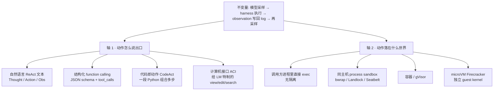

# Agent 系统

> 读这一章之前，只需要用过 chat / completions API、知道模型会一个个吐出 token 就够了。接下来会先说清楚 agent / tool / environment / harness / sandbox 这几个词各自指的是什么，再讲清楚「模型输出 → 外部执行 → 观察写回」这条循环具体是怎么运转的，最后落到两条可以对照源码来读的现代实现上。
>
> 核心概念一律保留英文（agent / harness / tool / environment / sandbox / trajectory / turn / step / ACI / MCP 等），不做生硬的中文转译。

这一章不会讲 agentic RL（也就是怎么把多轮工具交互收拾成可训练的 trajectory），也不会讲 agent serving（prefix cache、continuous batching、P-D 分离这些）。前者留给 post-training / RL 章，后者见 [推理服务：从单请求推理到 SLO-aware 集群](../serving/README.md)。这里只想把 **agent 本身**，以及它落地时最硬的那块 infra——**隔离执行环境**——讲清楚。

参考代码（都固定在上游的某个 commit，代码链接带 `#Lx-Ly`）：

- [[deepseek-harness:]] —— DeepSeek Harness（`dsh`），pin `99f6f02fe`。现代 agent harness：loop、session log、tool pipeline、process sandbox 全是插件。
- [[agentenv:]] —— AgentENV（`AENV`），pin `547c1a8a5`。分布式 Firecracker sandbox runtime，E2B 兼容 API；Kimi K3 用来跑大规模 agent environment。

论文 / 报告按阅读顺序大致会以这样的顺序出现：

- Yao et al., *ReAct*, ICLR 2023. [arXiv:2210.03629](https://arxiv.org/abs/2210.03629)
- Schick et al., *Toolformer*, NeurIPS 2023. [arXiv:2302.04761](https://arxiv.org/abs/2302.04761)
- Wang et al., *CodeAct*, ICML 2024. [arXiv:2402.01030](https://arxiv.org/abs/2402.01030)
- Yang et al., *SWE-agent*, NeurIPS 2024. [arXiv:2405.15793](https://arxiv.org/abs/2405.15793)
- Wang et al., *OpenHands*, ICLR 2025. [arXiv:2407.16741](https://arxiv.org/abs/2407.16741)
- Anthropic, *Model Context Protocol*, 2024. [modelcontextprotocol.io](https://modelcontextprotocol.io)
- Agache et al., *Firecracker*, NSDI 2020. [USENIX](https://www.usenix.org/conference/nsdi20/presentation/agache)
- DeepSeek, *DeepSeek Harness* developer preview, 2026. [deepseek.com/harness](https://deepseek.com/harness/en/)
- kvcache-ai, *AgentENV*, 2026. [github.com/kvcache-ai/AgentENV](https://github.com/kvcache-ai/AgentENV)

---

## 0. Agent 等于模型加 Harness

可以把 agent 理解成模型加上 harness 的组合：模型只负责决定「下一步该说什么、该调用什么」，harness 负责把这个决定变成一次可以恢复、可以审计、也可以拦截权限的回合，并把它放进 environment 里真正执行。sandbox 则是 environment 的隔离实现——同一套 loop，动作既可以落在本机的一个 process 里，也可以落在容器里，还可以落在一台 Firecracker microVM 里。

把这套关系拆成三个对象来看，后面每一篇都会挂在这张图上：

```
用户目标
   │
   ▼
┌──────────────────────────────────────────────────────────┐
│  harness                                                 │
│                                                          │
│   session log  ←── 拼 prompt / 投 tool schema            │
│        │                                                 │
│        ▼                                                 │
│      model  ──►  assistant message / tool calls          │
│        ▲                    │                            │
│        │                    ▼                            │
│        │           tool registry + policy gate           │
│        │                    │                            │
│        └──── observation ◄──┘                            │
└──────────────────────────────────────────────────────────┘
                          │
                          ▼  真正改世界
                 environment / sandbox
                 (fs · shell · browser · VM)
```

这三个对象的职责一旦混在一起，无论是读文献还是读代码都会变得很乱：

| 对象 | 做什么 | 不做什么 |
|---|---|---|
| **model** | 在给定 messages + tool schema 上采样：文本、reasoning、或结构化 tool call | 不执行工具、不持有文件系统、不决定权限 |
| **harness** | 驱动 loop、组装上下文、登记/调度工具、记 log、执法权限、恢复/fork session | 不替代模型的决策；不自己当操作系统 |
| **environment** | 接收 action，返回 observation；可以有状态、有副作用 | 不替模型想下一步；不替 harness 记对话历史 |

DeepSeek 官方把这个关系写成一句话，`Agent = Model + Harness`（[deepseek.com/harness](https://deepseek.com/harness/en/)）。SWE-agent 把 harness 里「给模型用的计算机接口」这一层单独命名为 **ACI**（Agent-Computer Interface）。AgentENV 则把 environment 做成了一个可以 snapshot、可以 fork 的 microVM 集群。这三件事其实是同一副骨架，只是各自站在不同的切面上。

---

## 1. 贯穿符号

后面反复出现的符号先列在这里，方便随时回查：

| 符号 | 名字 | 语义 |
|---|---|---|
| $o_t \in \mathcal{O}$ | observation | 环境在第 $t$ 步返回的、模型可见的反馈 |
| $a_t \in \mathcal{A}$ | action | 改变环境的动作（搜 Wikipedia、跑 bash、改文件……） |
| $\hat{a}_t \in \mathcal{L}$ | thought / reasoning trace | 语言空间里的内部动作，**不**改环境 |
| $c_t$ | context | $(o_1, a_1, \ldots, o_t)$，再加进 thoughts 就是模型实际看到的 prefix |
| $\pi(a_t \mid c_t)$ | policy | 在 LLM agent 里就是「一次 generate」 |
| tool | — | 一条模型可点名的、带 JSON schema 的外部能力 |
| trajectory | — | 一次任务从开始到结束的 event 序列 |
| turn / step | — | DeepSeek Harness 的两级时钟：turn = 一次被唤醒的工作；step = 一次 model request + 它点名的 tools |
| harness | — | 包住模型的 runtime：loop、log、tools、policy、UI |
| sandbox | — | 执行动作时的隔离边界；process 级或 microVM 级 |
| ACI | Agent-Computer Interface | 为 LM 特制的命令与反馈格式，不是给人用的 shell |

---

## 2. 这组文档怎么读

这一章一共五篇，可以按下面这张表安排阅读：

| 文件 | 内容 | 锚点 |
|---|---|---|
| `README.md`（本文） | 三个对象、阅读顺序、和仓库其他章的边界 | —— |
| [00 · 五个词：agent / tool / environment / harness / sandbox](./00_definitions.md) | **词汇表**：agent 相对 chat 多了什么；tool / skill / environment / harness / sandbox 各管一截 | ReAct 的 $\hat{\mathcal{A}}=\mathcal{A}\cup\mathcal{L}$ |
| [01 · 循环与协议：ReAct、function calling、MCP 与 CodeAct](./01_loop_and_tool_use.md) | **循环与协议**：Thought–Action–Observation；function calling；并行 tool call；MCP；CodeAct | ReAct Fig 1；CodeAct Fig 2 |
| [02 · 经典工作](./02_classic_works.md) | **经典工作**：按解决了哪根轴排列，而不是按年表堆砌 | Toolformer、SWE-agent、OpenHands、Computer Use |
| [03 · DeepSeek Harness：插件化 loop](./03_deepseek_harness.md) | **现代 harness 对照**：Cordis 插件、`ReactLoopAgent`、session log、tool pipeline | [[deepseek-harness:packages/core/agent-loop/src/agent.ts]] |
| [04 · Sandbox：process confine 与 microVM](./04_sandbox_and_agentenv.md) | **隔离与规模化环境**：process sandbox → microVM；AgentENV 的 snapshot / fork / overlaybd | [[agentenv:src/sandbox/backend.rs]]、[[agentenv:src/orchestrator/service.rs]] |

建议的阅读顺序是：本文先立起三个对象 → `00` 把词汇讲清楚 → `01` 把循环和协议讲清楚（后面所有系统都是这条循环的特化）→ `02` 看经典工作各自拧了哪根轴 → `03` 用 DeepSeek Harness 把 harness 落到可以 clone 的代码 → `04` 用 AgentENV 把 sandbox 落到可以 clone 的代码。

`03` 和 `04` 可以对照着读：dsh 的 [[deepseek-harness:packages/e2b/]] 把 fs / subprocess 指到一台远程 Linux sandbox；AgentENV 恰好提供 E2B 兼容 API。一边讲的是「谁在跑 loop」，另一边讲的是「动作落在哪台机器上」。

---

## 3. 两条演化轴

文献和开源项目的名字有很多——AutoGPT、SWE-agent、OpenHands、Claude Code、dsh，等等——但它们并不是互相独立的平行发明，背后其实可以归纳成两根轴。读任何一篇新工作，都可以先问这两个问题。



第一个问题是动作怎么说出口：模型是吐 `Action: Search[...]` 这种文本，还是吐 JSON 形式的 `tool_calls`，还是吐一段可执行代码，又或者是吐出「滚动文件查看器」这类 ACI 命令？第二个问题是动作落在什么世界：是和 harness 共用一个 UID 的 bash，还是被 Landlock 包住的 argv，还是一台可以 snapshot、可以 fork 的 microVM？

`01`/`02` 主要沿着轴 1 展开，`04` 沿着轴 2 展开，`03` 则是把两根轴都做成可替换 seam 的一份现代实现。

---

## 4. 和仓库其他章的边界

| 主题 | 在哪讲 | 本章只留一句 |
|---|---|---|
| 模型怎么 generate、KV / prefix cache、连续批推理 | [推理服务：从单请求推理到 SLO-aware 集群](../serving/README.md) | harness 每次 `llm/stream` 就是一次普通 completion；serving 优化不改变 loop 语义 |
| 多轮 tool 轨迹怎么变成 RL 样本（`loss_mask`、async rollout） | post-training / RL 章 | AgentENV 的 README 写它 power 了 Kimi K3 的 agentic RL——那是它的**客户**，不是它的定义 |
| 长上下文怎么切、CP 怎么通信 | [Context Parallelism (CP) —— Infra 视角深入](../parallel/04_cp/README.md) | compaction 是 harness 在 context 预算不够时改 log 的投影，不是并行策略 |
| 编码 agent 在 IDE 里怎么用 | 产品文档 | 本章把 Cursor / Claude Code / dsh 都看成同一类 harness，不评产品 |

---

下一篇是 [00 · 五个词：agent / tool / environment / harness / sandbox](./00_definitions.md)，会先把 agent 相对于一次普通 chat 多出来的那几个对象说清楚，再进入循环本身。
