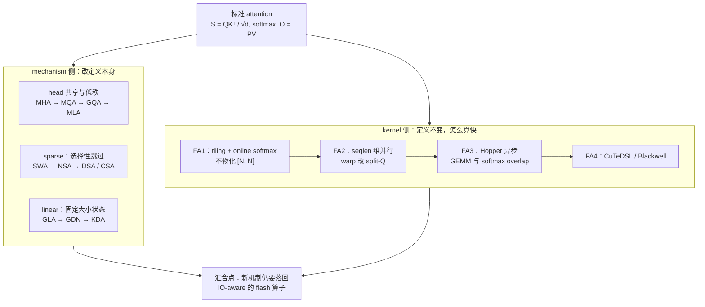

# Attention

Attention 是 transformer 里唯一随序列长度二次增长的一层：当上下文从几千推到几十万甚至上百万时，训练侧的计算量和推理侧的 KV cache 都首先在这一层上出问题。本章围绕这个矛盾回答两个问题：一是定义本身可以怎样改，才能让 $O(N^2)$ 的计算与 $O(N)$ 的 KV cache 撑住 1M context（mechanism 侧）；二是在定义给定的前提下，怎样在硬件上把它算得快、把中间量的显存压下去（kernel 侧）。硬件侧的前提——HBM 与 SRAM 的带宽差、roofline 的两道上界——在 [Roofline model：性能上界的两道天花板](../hpc/00_roofline_model.md) 已经建立；本章的结论则是下游章节的地基：[Context Parallelism](../parallel/04_cp/README.md) 把 FlashAttention 的块循环扩展成跨卡环形 P2P，[KV cache 与 PagedAttention](../serving/03_paged_attention_and_kv_cache.md) 则直接建立在机制侧对 cache 大小的讨论之上。

## 从哪开始读

第 [00](./00_attention_basics.md) 篇是基础铺垫：从「attention 在做什么」的直觉出发，把 scaled dot-product attention 的公式、multi-head、causal mask、prefill/decode 与 KV cache 逐个推一遍，最后算清复杂度账。对标准 attention 还不熟悉的读者先读它，之后两个子章里关于 shape、显存与 IO 的讨论就都有了依托。已经能随手写出 $S = QK^{\top}/\sqrt{d}$、行 softmax、$O = PV$，并且知道 decode 为什么 memory-bound 的读者可以直接跳过，按下面的阅读顺序进入子章。

此外还需要知道 GPU memory hierarchy 的层级（寄存器 / SRAM / HBM）与带宽量级差距，以及 arithmetic intensity 决定 kernel 是 memory-bound 还是 compute-bound；可对照 [Roofline model：性能上界的两道天花板](../hpc/00_roofline_model.md)。各篇依赖的其余定义（online softmax、recurrent state、门控参数化等）会在正文就地补齐。

## 本章的两条线索

两个子章对应两个不同层次的问题，它们的关系可以用一张图概括：

贯穿全章的主线是同一个 IO 视角，只是问法不同。机制侧问的是「改什么数学，才能少存、少读」：head 共享压缩每 token 的 cache 常数，sparse 保留全量 cache 但每步只读一小部分，linear 则把历史不可逆地压缩进固定大小的 recurrent state。kernel 侧问的是「同样的数学，怎么少搬数据」：标准 attention 的瓶颈不在算力而在 $[N, N]$ 中间矩阵的 HBM 往返，FlashAttention 用 tiling 加 online softmax 让中间量不落盘，此后三代演进（FA2 的并行度、FA3 的异步 overlap、FA4 的 CuTeDSL）改的都是「同一个算法如何映射到硬件」。两条线在 [05 · Flash Sparse Attention](./fa/05_flash_sparse_attention.md) 与 [06 · Flash Linear Attention](./fa/06_flash_linear_attention.md) 汇合——机制侧发明的 NSA、MoBA、chunkwise linear 等新定义，最终都要用同一套 IO-aware 思路实现成算子才有实际速度。

## 两个子目录

| 子目录 | 主题 | 状态 |
|---|---|---|
| [Attention 机制](./mechanisms/README.md) | attention 机制：MHA/MQA/GQA/MLA、位置编码与数值稳定、sparse（SWA → NSA → DSA/CSA）、linear（GLA → GDN → KDA）、门控与 hybrid | 成稿 |
| [FlashAttention](./fa/README.md) | FlashAttention 系列：IO-awareness / online softmax、FA2 并行、FA3 Hopper 异步、FA4 CuTe-DSL 与 API；稀疏（NSA/MoBA/DSA）与线性（`fla` chunkwise）的 flash 变体 | 成稿 |

## 阅读顺序

建议顺序：先读 [00](./00_attention_basics.md) 补齐标准 attention 的基础（已熟悉可跳过），再读 [Attention 机制](./mechanisms/README.md)，弄清定义本身如何变化、为什么要变；最后读 [FlashAttention](./fa/README.md)，看「在给定定义的前提下，attention 怎么算得快」。kernel 侧的稀疏、线性实现分别收在 [05 · Flash Sparse Attention](./fa/05_flash_sparse_attention.md) 和 [06 · Flash Linear Attention](./fa/06_flash_linear_attention.md) 两节，建议放在对应机制篇章之后对照阅读。

参考代码：[[flash-attention:]]（FA1–4）、[[fla:]]。

下一篇：[00 · Attention 基础：从 Q/K/V 到 KV cache](./00_attention_basics.md) —— 本章的地基铺垫。
