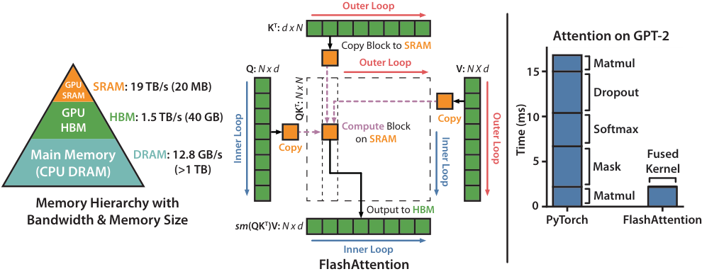

# 01 · IO-awareness、online softmax 与 tiling

> 上一篇建立了 FlashAttention 的整体图景：attention 是 memory-bound 的，FA 靠 tiling、online softmax、recomputation 三个不变量，把它变成不需要物化 $[N,N]$ 中间量的 fused kernel。本篇把这套算法核心——也就是三代实现共享的不变量——完整讲清楚，共四件事：标准 attention 的 IO 分析（为什么 memory-bound）、online softmax 的数值稳定推导（为什么可以流式分块计算）、tiling 之后的 forward 算法，以及 backward 的 recomputation 与 LSE。读完本篇之后，再看任何一份 FA kernel（Triton/CUDA/CuTeDSL），都只是同一套算法在不同硬件上的映射。
>
> 论文：FlashAttention [arXiv:2205.14135](https://arxiv.org/abs/2205.14135)。

---

## 1. 标准 attention 的 IO 分析

单 head，$Q, K, V \in \mathbb{R}^{N \times d}$：

$$
\begin{aligned}
S &= QK^{\top} / \sqrt{d} && [N, N] \\
P &= \mathrm{softmax}_{\mathrm{row}}(S) && [N, N] \\
O &= PV && [N, d]
\end{aligned}
$$

朴素实现的 HBM 流量（一个 head）：

| 步骤 | 读 HBM | 写 HBM |
|---|---|---|
| $S = QK^{\top}$ | $Q, K$: $2Nd$ | $S$: $N^2$ |
| $P = \mathrm{softmax}(S)$ | $S$: $N^2$ | $P$: $N^2$ |
| $O = PV$ | $P, V$: $N^2 + Nd$ | $O$: $Nd$ |
| 合计 | $\approx 3N^2 + 3Nd$ | $\approx 2N^2 + Nd$ |

当 $N \gg d$（长上下文），HBM 流量约为 $O(N^2)$，由 $S/P$ 这两个 $[N,N]$ 矩阵的读写主导。而计算量是 $O(N^2 d)$ FLOPs，集中在两个 matmul 上，可以被 Tensor Core 吸收。

再看 **arithmetic intensity**（FLOPs / byte）：matmul 部分很高，对 compute-bound 友好；但 softmax 是 element-wise 操作，每个 $S$ 元素只做几次 flop，却要在 HBM 上完成一次读和一次写，整体 intensity 因此被压低到带宽受限区。换句话说，GPU 的 Tensor Core 在等 HBM。这就是「attention 慢是 memory-bound 而非 compute-bound」的精确含义。

因此 FA 的目标不是减少 FLOPs（FA 计算的 FLOPs 和标准实现几乎一样，它是 *exact* attention），而是**把 $O(N^2)$ 的 HBM 流量降到 $O(N^2 d / M)$**（$M$ 是 SRAM 大小），做法是通过 tiling 让 $S/P$ 块只出现在 SRAM 里，永不落 HBM。



> 图：FlashAttention 论文的经典示意图。**左**：GPU 存储层次（SRAM ~19 TB/s 但极小、HBM ~1.5 TB/s、DRAM），以及 tiling 的做法 —— 外层在 KV block 上循环、把块载入 SRAM，片上做 online softmax，$S/P$ 从不落 HBM。**右**：相对 PyTorch 标准实现在 GPT-2 attention 上 ~7.6× 的加速。这张图完整呈现了「memory-bound → 用 tiling 砍掉 HBM 往返」的论证链条。（Dao et al. 2022, Fig 1；[arXiv:2205.14135](https://arxiv.org/abs/2205.14135)）

## 2. Online softmax

softmax 对一行 $S$ 的计算是

$$
P_{ij} = \frac{\exp(S_{ij})}{\sum_{j'} \exp(S_{ij'})}
$$

数值稳定的实现要先扫一遍全行求 $m = \max_{j'} S_{ij'}$，再以 $m$ 为基准求分母 $\sum_{j'} \exp(S_{ij'} - m)$。两遍扫描都依赖完整的一行，这和 tiling 直接冲突：块是逐块到来的，任何时刻手里只有一行的若干列。FA 借用 **online softmax**（Milakov & Gimelshein 2018）解决这个矛盾——不等到全行凑齐，每来一块就把它的贡献累加进 running 状态，所有块处理完时，结果恰好等于对整行做了一次性 softmax。

先按「一行」的视角来写（kernel 里一个 threadblock 同时处理一个 Q 块的所有行，每行独立维护同一套状态，所以实现里这些状态是向量而非标量，见第 3 节）。把一行的列切块，每块 $B_c$ 列，维护三个 running 状态：

- $m$：到目前为止见过的最大 logit（running row max）；
- $l$：到目前为止的未归一分母 $\sum_{\mathrm{seen}} \exp(s - m)$，**以当前 $m$ 为基准**；
- $O$：到目前为止的未归一分子 $\sum_{\mathrm{seen}} \exp(s - m)\, v$，同样以当前 $m$ 为基准。

注意 $l$ 和 $O$ 都不是裸的累加和，而是带着基准 $m$ 的。新块 $S^{(j)}$（对应 $K^{(j)}, V^{(j)}$）到来时，基准可能抬高，旧累加要先换算到新基准，再加上新块的贡献：

$$
\begin{aligned}
m_{\mathrm{new}} &= \max\!\left(m,\ \mathrm{rowmax}\!\left(S^{(j)}\right)\right) \\
\alpha &= \exp(m - m_{\mathrm{new}}) \\
p &= \exp\!\left(S^{(j)} - m_{\mathrm{new}}\right) \\
l &\leftarrow \alpha \cdot l + \mathrm{rowsum}(p) \\
O &\leftarrow \alpha \cdot O + p\, V^{(j)} \\
m &\leftarrow m_{\mathrm{new}}
\end{aligned}
$$

处理完所有块后做一次 $O \leftarrow O / l$，即得正确结果。

**为什么要乘 $\alpha$**：换基准只需要一次乘法。旧累加里的每一项是 $\exp(s - m_{\mathrm{old}})$，搬到新基准上就是

$$
\exp(s - m_{\mathrm{old}}) = \exp(s - m_{\mathrm{new}}) \cdot \exp(m_{\mathrm{old}} - m_{\mathrm{new}}) = \exp(s - m_{\mathrm{new}}) \cdot \alpha
$$

即基准每抬高一次，全部旧贡献统一乘一个折扣因子 $\alpha$，再加上新块按新基准算出的贡献。看一个具体的数：设当前 $m = 3$、$l = 10$，新块的 rowmax 是 $5$，则 $m_{\mathrm{new}} = 5$、$\alpha = e^{-2} \approx 0.135$，旧的 $l$ 先折成 $1.35$ 再加新块的 rowsum，$O$ 同理。由于 $m$ 单调不减，$\alpha \le 1$ 恒成立——旧贡献只会被等比缩小，不会被放大。整个累加对块的处理顺序不敏感（只要每块恰好处理一次），这正是 Ring Attention 能把它扩展成跨卡环形循环的原因。

**数值稳定性**：减 $m_{\mathrm{new}}$ 保证 $\exp$ 的指数不超过 0，永不上溢；$\alpha \le 1$ 也不会上溢。这和标准的 "subtract max" 技巧等价，只是 max 是流式逼近出来的。

### 实现简化：直接维护 LSE

Triton kernel 不单独存 $m$ 和 $l$，而是直接维护 **$\mathrm{lse} = m + \log(l)$**（log-sum-exp）。看 [[flash-attention:flash_attn/flash_attn_triton.py#L212-L252]]：

```python
# m_ij = 本块 rowmax 与历史 lse 取 max（lse 充当 running max 的上界）
m_ij = tl.maximum(tl.max(qk, 1) * softmax_scale, lse_i)   # :215
p    = tl.exp(qk * softmax_scale - m_ij[:, None])         # :216
l_ij = tl.sum(p, 1)                                       # :217
acc_o_scale = tl.exp(m_i - m_ij)                          # α，修正旧累加  :220
acc_o = acc_o * acc_o_scale[:, None]                      # :226
acc_o += tl.dot(p, v)                                     # 加新块贡献    :247
m_i = m_ij                                                # :250
l_i_new = tl.exp(lse_i - m_ij) + l_ij                     # :251
lse_i = m_ij + tl.log(l_i_new)                            # 更新 lse     :252
# 循环结束后一次性归一：
o_scale = tl.exp(m_i - lse_i)                             # = 1/l        :254
acc_o = acc_o * o_scale[:, None]                          # :258
```

`lse` 既是 backward 需要的统计量（见第 5 节），又省去了单独存 $l$ 的开销。注意整个循环里 `acc_o` 都没有除以 $l$，只在最后乘一次 `o_scale` $= \exp(m - \mathrm{lse}) = 1/l$。这个「延迟归一」是 FA2 削减 non-matmul FLOPs 的雏形（02 第 1 节会进一步展开为「连 $\alpha$ 修正都尽量延迟」）。

## 3. Tiling 后的 forward 算法

把 online softmax 套进 tiling：Q 的行切成 $[B_r, d]$ 块，KV 的列切成 $[B_c, d]$ 块。一个 kernel instance 处理一个 Q 块 $Q_i$，外层循环遍历 KV 块。伪代码：

```
# 一个 CTA：固定 Q_i ∈ [Br, d]，载入 SMEM/寄存器
m_i = -inf  (∈ [Br])           # running max
l_i = 0                        # running sum
O_i = 0     (∈ [Br, d])        # running 输出
for j in range(N / Bc):        # 外层：遍历所有 KV 块
    K_j, V_j = load(...)       # [Bc, d] → SMEM（这是唯一的 HBM 读流量）
    S_ij = (Q_i @ K_jᵀ) * scale          # [Br, Bc]  ← GEMM-I，停在寄存器，不落 HBM
    S_ij = apply_mask(S_ij, i, j)        # causal/sliding/varlen（见 02/04）
    m_new = max(m_i, rowmax(S_ij))
    P_ij  = exp(S_ij - m_new)            # [Br, Bc]
    α     = exp(m_i - m_new)
    l_i   = α * l_i + rowsum(P_ij)
    O_i   = α * O_i + P_ij @ V_j          # [Br, d]   ← GEMM-II
    m_i   = m_new
O_i = O_i / l_i                           # 一次性归一
LSE_i = m_i + log(l_i)                    # 存给 backward
write(O_i, LSE_i)                          # 唯一的 HBM 写流量（都是 O(N)）
```

要点：

- 两个 GEMM（$QK^{\top}$ 和 $PV$）的输出 $S_{ij}$、$O_i$ 全程停留在寄存器或 SMEM 中，从不写 HBM。HBM 上只发生两类流量：读 $Q, K, V$（$O(Nd)$），写 $O, \mathrm{LSE}$（$O(Nd)$）。HBM 流量因此从 $O(N^2)$ 降到 $O(Nd)$（更精确的表达式是 $O(N^2 d^2 / M)$，$M$ 为 SRAM 大小）。
- $S/P$ 的显存占用是 $O(B_r \cdot B_c)$ 的常数，与 $N$ 无关，整体显存因此是 $O(N)$（只剩 $O, \mathrm{LSE}$）。这就是长上下文能够运行的根本原因。
- 这是一个 fused kernel：GEMM-I、mask、softmax、GEMM-II 全部在一个 kernel 里完成，没有 kernel 启动开销，也没有中间结果落盘。

FA2 C++ 的 mainloop 与上面的流程一一对应（[[flash-attention:csrc/flash_attn/src/flash_fwd_kernel.h#L302-L410]]），它把循环拆成「需要 mask 的块」和「满块」两段（02 第 4 节），每块依次执行 `gemm`（$QK^{\top}$）、`softmax_rescale_o`（online softmax 加修正 $O$）、`gemm_rs`（$PV$）：

```cpp
FLASH_NAMESPACE::gemm<...>(acc_s, ...);                                  // :319  S=QKᵀ
mask.template apply_mask<...>(acc_s, ...);                               // 掩码
softmax.template softmax_rescale_o</*Is_first=*/.., /*Check_inf=*/..>(   // :342-344
    acc_s, acc_o, params.scale_softmax_log2);                           //  online softmax + α·O
FLASH_NAMESPACE::gemm_rs(acc_o, tOrP, tOrVt, ...);                       // :367  O += P·V
```

## 4. 用 `exp2` 替代 `exp`

GPU 的 SFU（special function unit）提供硬件 `exp2`（base-2 指数）指令，比 `expf` 快。FA 把 $\exp(x)$ 改写成 $\mathrm{exp2}(x \cdot \log_2 e)$，并把 $\log_2 e$ 预乘进 softmax_scale，这样循环里只剩一条 `exp2`。看 [[flash-attention:csrc/flash_attn/src/softmax.h#L66-L88]] 的 `scale_apply_exp2`：

```cpp
// max_scaled = max(mi) * scale  (scale 已含 log2e)
tensor(mi, ni) = exp2f(tensor(mi, ni) * scale - max_scaled);   // :86/:88
```

因此 C++ 代码里到处出现 `scale_softmax_log2`、`softmax_scale_log2`（而不是 `softmax_scale`），FA4 CuTeDSL 同理使用 `scale_log2` 加 `cute.math.exp2(...)`（[[flash-attention:flash_attn/cute/softmax.py#L168-L181]]）。读 kernel 时看到 `_log2` 后缀和 `exp2` 不必困惑，它们对应的就是这个微优化。`Softmax::softmax_rescale_o` 的 `Is_first` 模板参数是另一个优化：处理第一个 KV 块时不需要 $\alpha$ 修正（此时还没有旧累加），可以在编译期特化掉。

## 5. Backward：recomputation 与 LSE

attention 的 backward 需要计算 $dQ, dK, dV$。标准做法要用到 forward 的 $P$（shape $[N,N]$），但 FA 没有保存它（只保存了 $O(N)$ 大小的 $O, \mathrm{LSE}$）。FA 的选择是 recompute：backward 时用 $Q, K, V$ 重新计算 $S$，再用保存下来的 $\mathrm{LSE}$ 一步还原 $P$：

$$
P = \exp(S \cdot \mathrm{scale} - \mathrm{LSE})
$$

这就是 LSE 的核心用途：它把「row max 加 log row-sum」压缩成一个 $[N]$ 向量，使 backward 不必重做 online softmax 的 max/sum 归约，直接 $\exp(S - \mathrm{LSE})$ 就是正确的 $P$。

backward 的梯度公式（标准 attention 求导，FA 在 tiling 下流式完成）：

$$
\begin{aligned}
dV &= P^{\top} dO \\
dP &= dO V^{\top} \\
dS &= P \odot (dP - \mathrm{rowsum}(dO \odot O)) \\
dQ &= dS K \cdot \mathrm{scale} \\
dK &= dS^{\top} Q \cdot \mathrm{scale}
\end{aligned}
$$

其中第三行是 softmax 的 Jacobian：$\mathrm{rowsum}(dO \odot O)$ 对每行归约，是一个 $[N]$ 向量。

infra 层面的要点：

- **用算力换显存**：重算 $S$ 带来额外的 $O(N^2 d)$ FLOPs，但省下 $O(N^2)$ 的 $P$ 存储。因为 attention 本来就是 memory-bound，多算的这部分基本被带宽节省掩盖，整体仍然大幅加速。Triton 的 `_bwd_kernel` 在 [[flash-attention:flash_attn/flash_attn_triton.py#L510]] 处的 `p = tl.exp(qk * softmax_scale - lse_i[:, None])` 就是这一步重算。
- **backward 的循环方向与 forward 相反**：forward 固定 Q 块、循环 KV 块；backward 为了累加 $dK, dV$，通常固定 KV 块、循环 Q 块（一个 $[B_c, d]$ 的 K/V 块需要收集所有 attend 到它的 Q 的梯度贡献）。$dQ$ 因此是跨块累加的，需要原子加或额外的 reduce（FA2 的 `deterministic` 选项就是控制这个累加是否可复现，见 04）。
- **保存什么**：forward 的 `ctx.save_for_backward` 只保存 `q,k,v,out,softmax_lse,rng_state`（[[flash-attention:flash_attn/flash_attn_interface.py#L873]]），不包含 $P$。`rng_state` 用于在 backward 时重放 dropout 的同一组随机数，保证梯度是 exact 的。

## 6. 小结

| 不变量 | 作用 | 代码锚点 |
|---|---|---|
| **tiling** | $S/P$ 块停在 SRAM，HBM 流量 $O(N^2) \to O(Nd)$，显存 $O(N)$ | 所有 kernel 的「外层 KV-block 循环」 |
| **online softmax** | 无需全局 $S$ 就能流式算对，对块顺序不敏感 | [[flash-attention:csrc/flash_attn/src/softmax.h#L128]], `triton:212`, [[flash-attention:flash_attn/cute/softmax.py#L127]] |
| **recomputation + LSE** | backward 不存 $P$，用 $\mathrm{LSE}$ 一步重算 $P$，算力换显存 | `triton:510`, [[flash-attention:flash_attn/cute/interface.py#L873]] |

这三点在 FA1/2/3/4 里完全一致。接下来两篇讲的都是同一个问题：这套算法在 GPU 上如何摆放线程、内存与异步指令，才能把硬件跑满。

---

下一篇：[02 · FA2：并行度与 work partitioning](./02_fa2_parallelism.md) —— FA2 在不改算法的前提下，靠「延迟 rescale 削减非 matmul FLOPs、沿 seqlen 维并行、warp 从 split-K 改 split-Q」三项改进，把利用率从 FA1 的约 30% 提升到 A100 的 50–73%。
