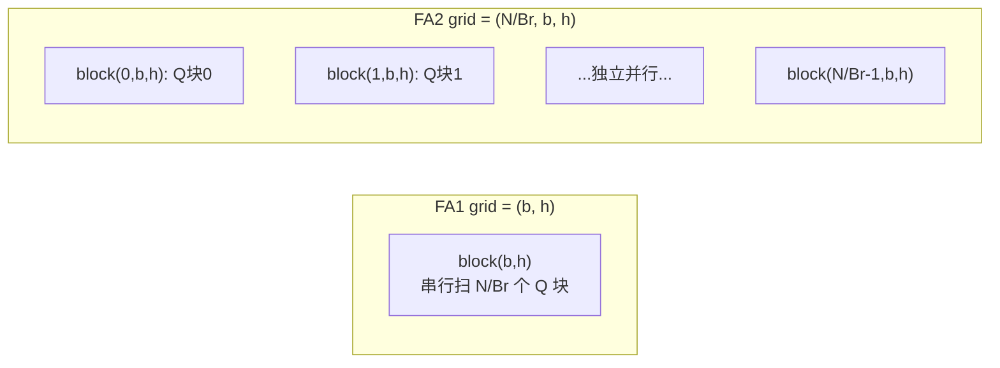

# 02 · FA2：并行度与 work partitioning

> FA1 证明了 tiling 加 online softmax 是可行的，但只跑到 A100 峰值的约 30%。FA2 完全不改动算法，靠三件事把利用率提升到 50–73%：在循环里少做非 matmul 的 element-wise 工作（延迟 rescale）；在 batch 乘 head 之外再沿 seqlen 维并行，让长序列和小 batch 也能填满 SM；把 warp 间的工作划分从 split-K 改成 split-Q，消除 warp 之间的 reduce 通信。本篇逐条对照 [[flash-attention:csrc/flash_attn/src/]] 的真实 C++ 代码。
>
> 论文：FlashAttention-2 [arXiv:2307.08691](https://arxiv.org/abs/2307.08691)。

---

## 0. FA1 跑不满的两个原因

两个先验事实决定了 FA2 的全部设计：

1. **Tensor Core 和 CUDA Core 的算力差一个数量级**。A100 上 FP16 matmul（Tensor Core）是 312 TFLOPS，而非 matmul 的 element-wise 运算（CUDA Core/SFU，如 `exp`、乘加修正）只有约 19 TFLOPS。FA 的 GEMM-I 和 GEMM-II 是 matmul，但 online softmax 的 $\mathrm{rowmax}$ / $\exp$ / $\alpha$ 修正 / $\mathrm{rowsum}$ 是非 matmul 运算。即使非 matmul FLOPs 只占总量的几个百分点，由于它慢 16 倍，也可能吃掉一半的执行时间。因此第一个优化方向是：循环内尽量少做非 matmul 运算。
2. **GPU 靠大量并发 threadblock 隐藏延迟**。如果一个 kernel 的 grid 只有 `batch×heads` 个 block，长上下文推理时 `batch=1`、`heads=32`，就只有 32 个 block，远少于 H100 的 132 个 SM，大量 SM 会空转。因此第二个优化方向是：增加并行维度。

## 1. 改进一：延迟 rescale

FA1 的内循环每步都做 $O_i = O_i / l_i \dots$ 式的归一化和完整的 $\alpha$ 修正。FA2 观察到：逐块的 $1/l$ 归一化可以全部推迟到循环结束之后，循环里只保留必须的 $\alpha$ 修正（而且 $\alpha$ 只乘到 $O$ 累加器上，不碰 $l$）。

对照 01 第 2 节的 LSE 写法（Triton `:226/:247/:258`）：整个循环中 `acc_o` 不除 `l`，只在最后乘一次 `o_scale = 1/l`。这把每块一次 $[B_r, d]$ 的除法挪到了循环外，全程只做一次。FA2 C++ 的 `Softmax::softmax_rescale_o`（[[flash-attention:csrc/flash_attn/src/softmax.h#L136-L162]]）进一步用模板把「第一个块」特化掉——`Is_first=true` 时没有旧累加，可以跳过 $\alpha$ 修正：

```cpp
template<bool Is_first, bool Check_inf=false, ...>
__forceinline__ __device__ void softmax_rescale_o(Tensor0 &acc_s, Tensor1 &acc_o, float softmax_scale_log2) {
    if (Is_first) {                                  // 第一个 KV 块：无需 α 修正
        reduce_max</*zero_init=*/true>(scores, row_max);
        scale_apply_exp2(scores, row_max, softmax_scale_log2);   // exp2，见 01 第 4 节
        reduce_sum</*zero_init=*/true>(scores, row_sum);
    } else {                                         // 后续块：算 α 并修正 O
        reduce_max</*zero_init=*/false>(scores, row_max);
        float scores_scale = exp2f((scores_max_prev(mi) - scores_max_cur) * softmax_scale_log2);  // :157  α
        // ... 用 scores_scale 修正 acc_o 与 row_sum ...
        scale_apply_exp2(scores, row_max, softmax_scale_log2);
    }
}
```

要点是：循环里现在只剩 `reduce_max / exp2 / reduce_sum` 和一次 $\alpha$ 乘加，归一化推迟到最后一次执行；`Check_inf` 同样是编译期特化（只有 causal/local 场景才可能把整行 mask 成 `-inf`，非 causal 场景不需要检查）。这些都是「把非 matmul 工作压到最少」的具体体现。

## 2. 改进二：沿 seqlen 维并行

FA1 的 grid 是 `(batch, heads)`：一个 block 处理「一个 (batch, head) 的整段序列」，内部串行扫过所有 Q 块。FA2 把 Q 的块维 `num_m_block` 提到 grid 里，让不同的 Q 块由不同的 block 并行处理。看 [[flash-attention:csrc/flash_attn/src/flash_fwd_launch_template.h#L63-L64]]：

```cpp
const int num_m_block = (params.seqlen_q + Kernel_traits::kBlockM - 1) / Kernel_traits::kBlockM;
dim3 grid(num_m_block, params.b, params.h);          // ← x 维是 Q 块数！
```

于是 `compute_attn_1rowblock(params, bidb, bidh, m_block)`（[[flash-attention:csrc/flash_attn/src/flash_fwd_kernel.h#L52]]）中每个 block 只负责一个 Q 行块，`m_block = blockIdx.x`。

这是 FA2 最重要的一处改动，原因在于：

- 并行度从 $b \cdot h$ 变成 $b \cdot h \cdot (N / B_r)$（$B_r$ 是 Q 块大小，见 01 第 3 节）。`b=1, h=32, N=8K, Br=128` 时，block 数从 32 个变成 `32·64 = 2048` 个，远超 SM 数量，占用率因此拉满。
- 这是 forward 的并行方式。**为什么可以沿 Q 维并行，而不能沿 KV 维并行**：每个 Q 块的 online softmax 是独立的（各自维护自己的 $(m, l, O)$），互不依赖；而沿 KV 并行会让多个 block 写同一个 Q 块的 $O$，需要跨 block 的 reduce（这正是 FA1 的 split-K 思路，较慢）。沿 Q 并行天然没有冲突。




> 图：FA2 在 batch 乘 head 之外再沿 seqlen 维并行。forward（左）每个 worker（threadblock）负责 attention 矩阵的一个行块；backward（右）每个 worker 负责一个列块。这就是把并行度从 $b \cdot h$ 提升到 $b \cdot h \cdot (N / B_r)$、填满 SM 的关键改动。（Dao 2023, FA2 Fig 2；[arXiv:2307.08691](https://arxiv.org/abs/2307.08691)）

> **例外：decode / split-KV**。当 `seqlen_q=1`（推理 decode）时，沿 Q 并行又退化成 $b \cdot h$ 个 block。此时 FA 走 split-KV 路径：把 KV 维切成 `num_splits` 段并行，每段算出 partial 的 $(O, \mathrm{LSE})$，再用一个 combine kernel 归并。看 [[flash-attention:csrc/flash_attn/src/flash_fwd_launch_template.h#L106-L107]] 的 `grid(num_m_block, num_splits, b*h)` 和 `flash_fwd_splitkv_combine_kernel`。这正是「沿 KV 并行需要额外 combine」的代价，只在并行度不够时才值得使用（04 第 6 节）。

## 3. 改进三：warp partitioning 从 split-K 改为 split-Q

一个 threadblock 通常有 4–8 个 warp，它们如何分摊一个 Q 块内的工作？这是 FA1 到 FA2 的另一处关键改动。

**FA1（split-K）**：把 K/V 沿 seqlen 切给不同 warp。每个 warp 计算 $Q_i K_{\mathrm{warp}}^{\top}$ 得到部分的 $S$，但 softmax 需要一行的全局 max 和 sum，于是每步都要跨 warp 通过 SMEM 做 reduce（同步加 SMEM 往返）。$PV$ 阶段也要把各 warp 的部分 $O$ 累加起来。warp 间通信频繁。

**FA2（split-Q / split-M）**：把 Q 的行切给不同 warp，K/V 对所有 warp 共享（都在 SMEM 中）。于是每个 warp 独占若干 Q 行，自己计算这些行的完整 softmax，warp 之间完全不需要 reduce 或通信，因为不同行的 softmax 互相独立。代价是每个 warp 都要读全部 K/V，但 K/V 在 SMEM 中，读取很便宜。

```
split-K (FA1):  warp0,1,2,3 各持一段 K → 每行 softmax 要跨 4 warp reduce  ✗ 通信
split-Q (FA2):  warp0 持 Q 行 0..31, warp1 持 32..63 ... K/V 共享 → 各自独立  ✓ 无通信
```

<p align="center">


</p>

> 图：warp 间 work partitioning。**左（FA1，split-K）**：K/V 切给不同 warp，每行 softmax 要跨 warp 经 SMEM reduce（图中 warp 都要写共享的中间结果）。**右（FA2，split-Q）**：Q 行切给不同 warp、K/V 共享，每个 warp 独立算完整行的 softmax，warp 间零 reduce。（Dao 2023, FA2 Fig 3；[arXiv:2307.08691](https://arxiv.org/abs/2307.08691)）

> 直觉上：softmax 沿「行（query）」方向归约。让每个 warp 拥有完整的行，归约就落在 warp 内部（warp shuffle，便宜）；让 warp 只拥有列的一部分，归约就要跨 warp（SMEM 加 barrier，昂贵）。FA2 选择了前者。这也是为什么 backward 反而是固定 KV 块、沿 Q 循环——不同的归约方向决定不同的并行与划分方式（01 第 5 节）。

## 4. causal 下的 block 裁剪与两段循环

causal mask 下，query 块 `m_block` 只能 attend 到 `key ≤ query` 的部分。FA2 据此只遍历必要的 KV 块，而不是算完整行再 mask 掉一半。`compute_attn_1rowblock` 计算 KV 块的范围（[[flash-attention:csrc/flash_attn/src/flash_fwd_kernel.h#L83-L87]]）：

```cpp
int n_block_max = cute::ceil_div(binfo.actual_seqlen_k, kBlockN);
if (Is_causal || Is_local) {
    n_block_max = std::min(n_block_max,
        cute::ceil_div((m_block + 1) * kBlockM + seqlen_k - seqlen_q + window_size_right, kBlockN));  // :87
}
// n_block_min 同理（local/sliding window 才 > 0）
```

效果是：靠前的 Q 块只算少数 KV 块，靠后的 Q 块算得多，causal 下平均省去一半的 KV 块循环（这也是 CP 中 causal 负载不均的来源，见 [01 · Ring Attention](../../parallel/04_cp/01_ring_attention.md)）。

更细一层的优化是把循环拆成两段（[[flash-attention:csrc/flash_attn/src/flash_fwd_kernel.h#L298-L410]]）：

```cpp
constexpr int n_masking_steps = (!Is_causal && !Is_local) ? 1 : ...;   // :298
for (int masking_step = 0; masking_step < n_masking_steps; ...) { ... } // :302  对角线附近：逐元素 mask
for (; n_block >= n_block_min; --n_block) { ... }                      // :378  完全在下三角内：免 mask
```

- **第一段（masking_steps）**：处理跨越 causal 对角线的少数 KV 块，需要逐元素 `apply_mask`。
- **第二段**：剩下的 KV 块全部落在下三角内（query 一定不小于 key），无需任何 mask 检查，内循环干净、无分支。

把「需要 mask 的块」隔离成边界上的少数几块，让主体循环零分支，这是把 element-wise 开销压到最低的又一个体现，与第 1 节一脉相承。`Mask` 类（[[flash-attention:csrc/flash_attn/src/flash_fwd_kernel.h#L288]]）同时承载 causal、local（sliding window）和 ALiBi（04 第 7 节）。

## 5. backward 的并行选择

backward 要同时产出 $dQ, dK, dV$，归约方向和 forward 相反：

- $dK_j, dV_j$ 需要收集所有 attend 到 KV 块 $j$ 的 query 的贡献，因此固定 KV 块、沿 Q 循环，$dK/dV$ 在块内累加，过程干净。
- $dQ_i$ 则被多个 KV 块写入，是跨块累加，需要 `atomicAdd` 到 HBM（或先攒在 SMEM）。这带来非确定性：浮点 atomic 加法的顺序不定，结果会逐 run 微小抖动。`deterministic` 选项（[[flash-attention:flash_attn/flash_attn_interface.py]] 的 `ctx.deterministic`）改用确定性的累加方案换取可复现性，代价是略慢。

## 6. 小结

| 改进 | 解决的问题 | 代码锚点 |
|---|---|---|
| 延迟 rescale + 模板特化 `Is_first/Check_inf` | 砍循环内非 matmul FLOPs（慢 16×） | [[flash-attention:csrc/flash_attn/src/softmax.h#L136-L162]] |
| grid 加 `num_m_block`（沿 seqlen 并行） | 长序列/小 batch 占用率不足 | [[flash-attention:csrc/flash_attn/src/flash_fwd_launch_template.h#L64]] |
| warp split-K → split-Q | warp 间 softmax reduce 通信 | `compute_attn_1rowblock` 的 warp 划分 |
| causal block 裁剪 + 两段循环 | 算无用的上三角 + 分支开销 | [[flash-attention:csrc/flash_attn/src/flash_fwd_kernel.h#L83,L298,L378]] |
| split-KV + combine（decode） | `seqlen_q=1` 时并行度不足 | `:106`, `splitkv_combine_kernel` |

FA2 把 Ampere 架构的潜力基本用尽了，但它没有用到 Hopper 的异步硬件——TMA、WGMMA、warp-group 级异步——所以在 H100 上反而拿不满。补上这一块就是 FA3。

---

下一篇：[03 · FA3：Hopper 上的异步化与 overlap](./03_fa3_hopper_async.md) —— FA3 在 Hopper 上把「搬数据」（TMA）和「算」（WGMMA）都异步化，用 producer-consumer warp-specialization 和 GEMM 与 softmax 的 ping-pong overlap，把 forward 推到 H100 的约 75% peak（约 740 TFLOPS），并引入 FP8。
