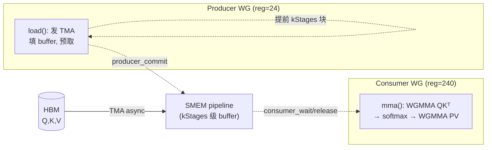
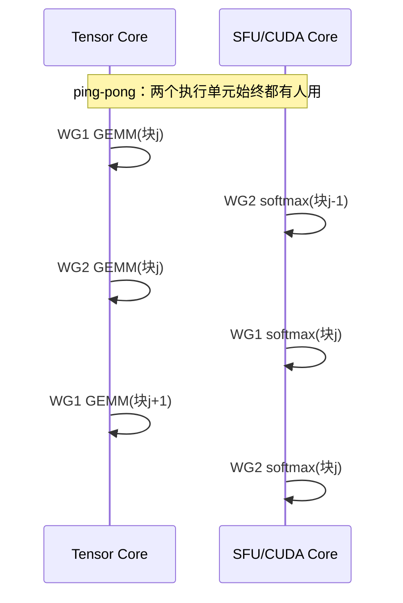

# 03 · FA3：Hopper 上的异步化与 overlap

> FA2 在 H100 上拿不满，因为它仍然是「同步」思路：load 完才算、算完才 load，Tensor Core 和访存单元互相等待。Hopper 提供了三类异步硬件——TMA（异步搬数据）、WGMMA（异步 warp-group matmul）、warp-group 级寄存器再分配——FA3 用它们把 attention 改造成生产者-消费者流水，并让 GEMM 和 softmax 互相 overlap。最终结果是 FP16 forward 达到约 75% peak（约 740 TFLOPS），FP8 达到约 1.2 PFLOPS。本篇对照 [[flash-attention:hopper/]] 的真实 CUTLASS C++ 代码。
>
> 论文：FlashAttention-3 [arXiv:2407.08608](https://arxiv.org/abs/2407.08608)。


---

## 0. Hopper 给了什么异步原语

| 原语 | 是什么 | 取代了什么 |
|---|---|---|
| **TMA**（Tensor Memory Accelerator） | 单条指令发起 HBM↔SMEM 的大块异步拷贝，地址计算/边界由硬件 descriptor 处理，发起线程不阻塞 | FA2 的 `cp.async` + 手写 index 计算 |
| **WGMMA**（`wgmma.mma_async`） | **warp-group**（4 warp=128 线程）协同的异步 matmul，可直接从 SMEM 读操作数，发起后不阻塞 | FA2 的 `mma`（warp 级、同步、操作数需先进寄存器） |
| **warpgroup register realloc** | `setmaxnreg`：让某些 warpgroup 让出寄存器、另一些拿更多 | 静态平均分配寄存器 |
| **named barrier** | 命名的 barrier，可让「部分线程」在其上同步，实现 warpgroup 间的精细 handshake | `__syncthreads()`（全 block） |

异步的意义在于：发起一个 TMA load 或 WGMMA 之后，发起方可以立刻去做别的事，硬件在后台完成这次操作。只要调度得当，搬数据、算 GEMM-I、算 softmax、算 GEMM-II 就可以在时间上重叠，而不是串行等待。FA3 的全部工程内容，就是设计这套重叠所需的 handshake。

## 1. Producer-Consumer warp-specialization

FA3 把一个 threadblock 的 warpgroup 分成两类角色，各自专职：

- **Producer**（1 个 warpgroup）：只负责用 TMA 把 Q/K/V 块从 HBM 搬进 SMEM，填满一个多级 pipeline buffer，不参与计算。
- **Consumer**（1–2 个 warpgroup）：只负责从 SMEM 取数、用 WGMMA 计算 $QK^{\top}$ 和 $PV$、做 online softmax，不直接访问 HBM。

代码里这个分工一目了然（[[flash-attention:hopper/flash_fwd_kernel_sm90.h#L308-L360]]）：

```cpp
int warp_group_idx = cutlass::canonical_warp_group_idx();
if (warp_group_idx == 0) {  // Producer
    cutlass::arch::warpgroup_reg_dealloc<LoadRegisterRequirement>();   // :309  让出寄存器（→24）
    ...
    mainloop.load(params.mainloop, pipeline_k, pipeline_v, pipeline_vt,
                  smem_pipe_write, shared_storage, ...);               // :356  纯 TMA 搬运
    mainloop.load_tail(...);                                           // :359
} else {  // Consumer
    cutlass::arch::warpgroup_reg_alloc<MmaRegisterRequirement>();      // :361  多拿寄存器（→240）
    ...
    mainloop.mma(params.mainloop, pipeline_k, pipeline_v, smem_pipe_read,
                 tOrO, softmax, ...);                                  // :421  WGMMA + softmax
    ...epilogue...
}
```

**寄存器再分配**是 warp-specialization 的关键配套机制（[[flash-attention:hopper/flash_fwd_kernel_sm90.h#L82-L83]]）：producer 只发 TMA、几乎不用寄存器，`warpgroup_reg_dealloc` 把它降到每线程 24 个；consumer 要保存 $O$ 累加器、softmax 状态和 WGMMA 操作数，`warpgroup_reg_alloc` 给到每线程 240 个。在 SM 固定的寄存器预算下，把寄存器从「不干活的 producer」挪给「干活的 consumer」，可以直接提高 consumer 的占用率和吞吐。

Producer 和 consumer 通过 pipeline 加 named barrier 握手：producer 把第 $j$ 块用 TMA 搬进 buffer 后执行 `producer_commit`；consumer 用 `consumer_wait` 等到数据就绪才开始计算，算完用 `consumer_release` 把 buffer 还给 producer，供其装入第 $j+k$ 块。`kStages` 级 buffer 让 producer 可以提前预取若干块，把 TMA 的延迟藏在 consumer 的计算后面。



## 2. GEMM 与 softmax 的 overlap

FA2 在一个块内是严格串行的：`WGMMA(QKᵀ)`、`softmax`（CUDA Core 上的 exp/max/sum）、`WGMMA(PV)` 依次执行。softmax 跑在较慢的 CUDA/SFU 单元上时，Tensor Core 空闲；反之亦然。FA3 要让这两类单元同时保持忙碌，具体分两个层次。

### 2.1 层次一：intra-warpgroup pipelining

在单个 consumer warpgroup 内部，把相邻迭代错开执行：第 $j$ 块的 softmax 与第 $j+1$ 块的 $QK^{\top}$ WGMMA 重叠。因为 WGMMA 是异步的，consumer 发起 $j+1$ 块的 $QK^{\top}$ 后不阻塞，立刻回头计算 $j$ 块的 softmax；等 softmax 算完，$j+1$ 的 $QK^{\top}$ 也差不多就绪。这样 Tensor Core（算 $j+1$ 块的 $QK^{\top}$）和 SFU（算 $j$ 块的 exp）就并行起来了。这要求把 online softmax 的依赖关系仔细拆开，`mainloop_fwd_sm90_tma_gmma_ws.hpp` 的 `mma()` 里交错出现的 `consumer_wait`、WGMMA、`softmax` 调用就是在做这件事。

### 2.2 层次二：ping-pong

当有 2 个 consumer warpgroup 时，FA3 让它们错相位运行：WG1 做 softmax（占用 SFU）时，WG2 做 GEMM（占用 Tensor Core）；下一拍角色互换。两个 warpgroup 像乒乓一样交替占用两类执行单元，使 SFU 和 Tensor Core 始终都有任务在执行。

实现机制是一对命名 barrier `WarpSchedulerWG1/WG2`（[[flash-attention:hopper/named_barrier.hpp#L50-L58]]），加上 `warp_scheduler_barrier_sync/arrive`（[[flash-attention:hopper/mainloop_fwd_sm90_tma_gmma_ws.hpp#L915-L948]]）：

```cpp
warp_scheduler_barrier_sync() {       // :915  等「轮到本 WG 进入 GEMM 段」
    cutlass::arch::NamedBarrier::sync(2 * NumThreadsPerWarpGroup,
        FwdNamedBarriers::WarpSchedulerWG1 - 1 + canonical_warp_group_idx_nosync());   // :917
}
warp_scheduler_barrier_arrive() {     // :922  通知「下一个 WG 可以进 GEMM 段了」
    int next_WG = ...;                // 算出对端 warpgroup
    cutlass::arch::NamedBarrier::arrive(2 * NumThreadsPerWarpGroup,
        FwdNamedBarriers::WarpSchedulerWG1 + next_WG);                                  // :929
}
```

两个 warpgroup 在这对 barrier 上交替执行 `sync` 和 `arrive`，强制它们的 GEMM 段不同时进入，于是一个算 GEMM 时另一个被推去算 softmax。是否启用 ping-pong 由 head_dim 和 warpgroup 数量决定（[[flash-attention:hopper/flash_fwd_kernel_sm90.h#L353]] 附近的编译期条件）。



> 直觉上：FA3 的核心不是「算得更少」，而是把 attention 内在的两类异构计算（matmul 与 element-wise）映射到两类异构硬件单元（Tensor Core 与 SFU），再用异步原语让它们在时间上重叠。这就是 roofline 上把利用率从约 35%（FA2 on Hopper）推到约 75% 的来源。

## 3. V 的处理与 GEMM-II 的操作数布局

一个工程细节：`PV` 这一步里，$P$ 是 consumer 刚算出来、位于寄存器中的 $[B_r, B_c]$（$B_r, B_c$ 是 Q/KV 的分块大小，定义见 [01](./01_io_awareness_online_softmax.md) 第 3 节），$V$ 在 SMEM 中。WGMMA 对操作数布局有要求，FA3 据此选择是否转置 V（`Transpose_V`）、用哪种 pipeline（`MainloopPipelineVt`，[[flash-attention:hopper/mainloop_fwd_sm90_tma_gmma_ws.hpp#L284-L288]]）。`LargeHeadDimV`（如 head_dim=256 或 MLA 的非对称 KV）会走不同的 mma 路径（[[flash-attention:hopper/flash_fwd_kernel_sm90.h#L420-L424]]）。这些都是「让 WGMMA 吃到正确 layout」的适配工作，不改动算法。

## 4. FP8 的两个准确性问题与解法

FA3 支持 FP8 forward（E4M3），算力翻倍（约 1.2 PFLOPS）。但 FP8 只有约 2–3 位尾数，直接拿它算 attention 会损失严重。FA3 用了两个手段：

1. **Block quantization（分块量化）**：不对整个张量使用一个 scale，而是每个 tile（甚至每行）一个 scale。$QK^{\top}$ 的输入 `q_descale/k_descale` 在 consumer 里乘回 softmax_scale（[[flash-attention:hopper/flash_fwd_kernel_sm90.h#L409-L414]]）：

```cpp
if constexpr (Is_FP8 && !Has_softcap) {
    float const q_descale = params.mainloop.ptr_q_descale[...];   // :412
    float const k_descale = params.mainloop.ptr_k_descale[...];   // :413
    softmax_scale_log2 *= q_descale * k_descale;                  // :414  把反量化折进 scale
}
```

2. **Incoherent processing（非相干处理）**：在量化之前给 $Q$、$K$ 各乘一个随机正交矩阵（实际使用 Hadamard 变换，复杂度 $O(d \log d)$）。由于 $(QM)(KM)^{\top} = Q M^{\top} M K^{\top} = QK^{\top}$（$M$ 正交），数学上结果不变，但 Hadamard 变换把异常大的值「摊平」到各个维度，压低了量化时的 outlier，让 FP8 的 per-tensor/per-block scale 更准确。这是从随机数值线性代数借来的技巧。

`Softmax<..., /*Max_offset=*/!Is_FP8 ? 0 : 8>`（[[flash-attention:hopper/flash_fwd_kernel_sm90.h#L416]]）里的 `Max_offset=8` 是 FP8 专用的：把 exp 的指数整体平移，匹配 E4M3 的动态范围。

## 5. softcap 的预乘技巧

很多模型（Gemma2 等）在 logits 上做 `softcap`：$s' = \mathrm{softcap} \cdot \tanh(s / \mathrm{softcap})$。FA3 不在循环里逐元素做除法，而是把 `softmax_scale / softcap` 和 `softcap · log₂e` 预乘成两个常数（[[flash-attention:hopper/mainloop_fwd_sm90_tma_gmma_ws.hpp#L543-L562]]）：

```cpp
// 把 softmax_scale / softcap_val 预乘进 scale，tanh 后再乘 softcap·log2e
... !Has_softcap ? float(args.softmax_scale * M_LOG2E)         // 无 softcap：scale·log2e
                 : float(args.softcap_val * M_LOG2E),          // 有 softcap：softcap·log2e  :559
... !Has_softcap ? 0.f : args.softmax_scale / args.softcap_val // :562
```

这和 01 第 4 节的 `exp2` 折叠是同一思想：把能预计算的常数全部折叠掉，循环里只留下最少的指令。

## 6. 小结

| 手段 | 硬件原语 | 代码锚点 |
|---|---|---|
| producer-consumer warp-spec | TMA + warpgroup reg realloc | [[flash-attention:hopper/flash_fwd_kernel_sm90.h#L308-L361]] |
| 多级 pipeline 预取 KV | TMA async + named barrier | `mainloop...:781`, `pipeline_k/v` |
| intra-warpgroup 流水（$\mathrm{softmax}_j \parallel QK^{\top}_{j+1}$） | WGMMA async | `mainloop...:mma()` |
| ping-pong（两 WG 交替占 TC/SFU） | named barrier `WarpSchedulerWG1/2` | `mainloop...:915-948`, [[flash-attention:hopper/named_barrier.hpp#L50]] |
| FP8 准确性 | block quant + Hadamard incoherent | [[flash-attention:hopper/flash_fwd_kernel_sm90.h#L409-L416]] |

算法依旧是 01 的 online softmax 加 tiling，没有任何改动。FA3 的全部工作量都在「调度」上——谁在什么时候使用哪个执行单元、数据如何异步流过 SMEM。这套 C++ 模板极难维护（每个 head_dim/dtype/mask 组合都要实例化），这正是 FA4 改用 CuTeDSL（Python）的动机。

---

下一篇：[04 · FA4（CuTeDSL）与工程接口](./04_fa4_cutedsl_and_api.md) —— FA4 把上面这套调度用 Python（CuTeDSL）写出来、JIT 成 PTX，并讲清 infra 现实：tile scheduler（persistent/CLC dynamic）、Python API、varlen/`cu_seqlens`、GQA packing、paged KV、kvcache split、autograd 接线。
