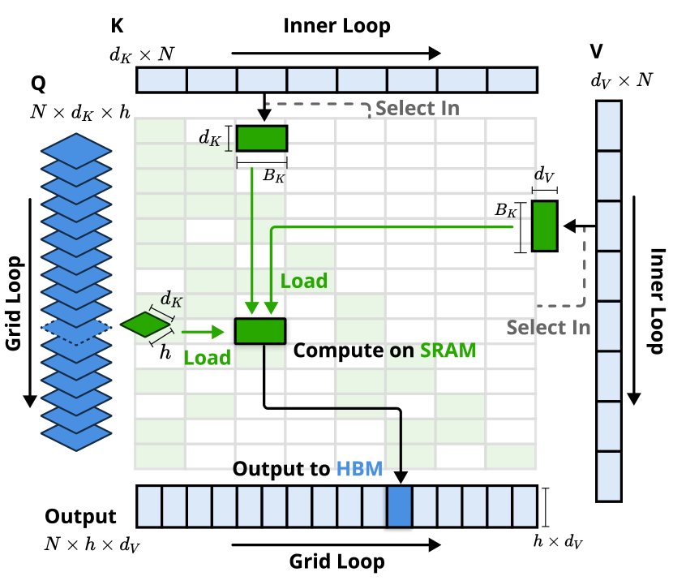
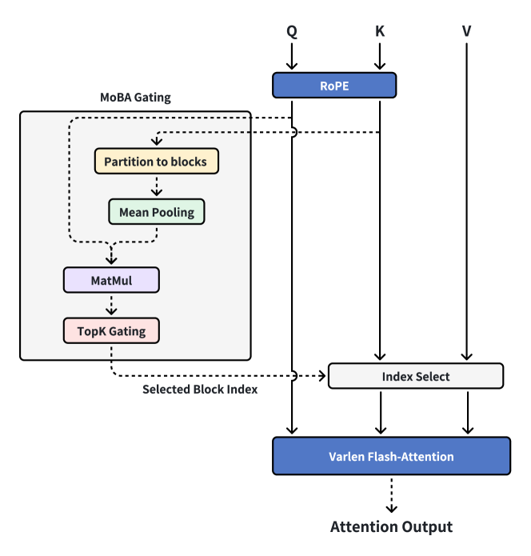

# 05 · Flash Sparse Attention

> 稀疏 attention 的选点机制属于机制侧的内容，本篇只讲选完之后 kernel 怎么算得快：同一套 tiling 与 online softmax，如何适配不规则 gather 的 KV 集合。阅读本篇需要 [01 · IO-awareness、online softmax 与 tiling](./01_io_awareness_online_softmax.md)（tiling、online softmax、LSE）与 [04 · FA4（CuTeDSL）与工程接口](./04_fa4_cutedsl_and_api.md) §4（`cu_seqlens` / varlen）作为前置；机制侧的数学见 [03 · sparse 路线（一）：静态稀疏与推理期动态稀疏](../mechanisms/03_sparse_static.md)–[`05`](../mechanisms/05_sparse_dsa_frontier.md)。
>
> 对照代码：上游固定版本 [[fla:]] 的 [[fla:fla/ops/nsa/]]、[[fla:fla/ops/moba/]]、[[fla:fla/ops/dsa/]]（commit `81091cc6`）；滑动窗口落在 [[flash-attention:]]。DSA 的生产 kernel **不在 `fla`**，见 §4。

---

## 0. 和 FlashAttention 差在哪

FA 的 KV 循环扫的是时间上连续的块：$K[j B_c : (j+1) B_c]$ 一次 TMA/cp.async 就能载入。稀疏 attention 的 KV 集合是 query 的函数——$S_t \subseteq \{1, \dots, t\}$，$|S_t| = k \ll t$。IO-aware 的目标从「不物化 $[N, N]$」扩展成两件事：

1. 仍然不物化 densified 的 $[N, N]$（online softmax 不变量不变）。
2. 每次 HBM 读要对齐硬件：连续、且被尽可能多的 query head 共享。否则「算力稀疏」不会变成「访存稀疏」——GQA 下每个 KV head 要服务一组 Q head，若组内各选各的，一次 gather 只能摊到 1 个 head 上，带宽上吃亏的还是那次不规则读。

由此，实现空间收敛为四条路线：

| 路 | 做法 | 代表 |
|---|---|---|
| **A. 改 mask，不改 gather** | 连续带状 / 块对角，FA 裁 `n_block_min/max` | sliding window、Llama 4 chunked |
| **B. 自定义 gather + online softmax** | 一个 CTA 固定一组 Q head，内层按选中块 gather | **NSA** |
| **C. 把稀疏 pattern 重排成 varlen FA** | 选完之后 pack 成若干短序列，两次现成 FA + LSE 归并 | **MoBA** |
| **D. token gather + 稠密 FA** | indexer 选出 $k$ 个 token，MQA 共享下 gather 一次 | **DSA**（生产 kernel 在 FlashMLA） |

A 几乎零成本；B 和 D 需要写新 kernel；C 是「一个 softmax kernel 都不要写」的极端。

## 1. 静态稀疏：sliding window

[`04`](./04_fa4_cutedsl_and_api.md) §7 的 `window_size=(left, right)` 就是这条路。kernel 用窗口裁剪 KV 循环的上下界（FA2：[[flash-attention:csrc/flash_attn/src/flash_fwd_kernel.h#L83-L87]]），不做 gather、不改 online softmax，只是少跑几个 KV tile。causal 加左窗口 $w$ 时，复杂度从 $O(N^2 d)$ 降到 $O(Nwd)$，而且读的还是连续地址。

NSA / CSA 的滑窗分支直接调用这条路径，不另写 kernel（§2 末尾）。这是 sparse flash 里最便宜、也最不「稀疏」的一档：pattern 在编译期已知，调度器和 FA 的密集情况完全一样。

## 2. NSA：沿 head 轴重新分块

机制在 [04 · sparse 路线（二）：可训练稀疏](../mechanisms/04_sparse_trainable.md)。`fla` 的实现是 [[fla:fla/ops/nsa/parallel.py]] 的 `parallel_nsa`（[[fla:fla/ops/nsa/parallel.py#L836]]），把三个分支拼起来。

### 2.1 GQA 与 `G ≥ 16` 的要求

[[fla:fla/ops/nsa/parallel.py#L899-L900]]

```python
    G = q.shape[2] // k.shape[2]
    assert G >= 16 and (G & (G - 1)) == 0, "Group size (HQ/H) must be a power of 2 and >= 16 in NSA"
```

$G$ 是 kernel 的 tile 维：一组 Q head 被当成 $[G, d]$ 一次载入，Triton 要求这一维是 2 的幂。论文配置里 $G=16$ 不是巧合——它同时满足「组内共享一份 block 列表」（Eq. 10）和「SRAM 里放得下一组 Q」两个条件。



> 图：NSA 的 Triton kernel（Yuan et al. 2025, Fig 3；[arXiv:2502.11089](https://arxiv.org/abs/2502.11089)）。FA 沿时间切 Q 块，但 NSA 下「同一时间块里的 query 可能要完全不相交的 KV 块」。**解法是沿 head 轴重新分块**：一个 GQA 组的全部 `G` 个 query 一次进 SRAM（绿），内层按 `I_t` 顺序 gather 连续 KV 块。Eq. 10 保证组内共享 `I_t`，每个选中块从 HBM 只读一次、被 `G` 个 head 摊薄。

### 2.2 编排：压缩、top-k、选择与滑窗

[[fla:fla/ops/nsa/parallel.py#L909-L957]]

```python
    k_cmp, v_cmp = mean_pooling(k, block_size, cu_seqlens_k), mean_pooling(v, block_size, cu_seqlens_k)
    ...
        o_cmp, lse_cmp = parallel_nsa_compression(...)
        if block_indices is None:
            block_indices = parallel_nsa_topk(
                q=q, k=k_cmp, lse=lse_cmp, ...
            )
    o = o_slc = ParallelNSAFunction.apply(q, k, v, block_indices, ...)
    if g_slc is not None:
        o = o_slc * g_slc.unsqueeze(-1)
    if o_cmp is not None:
        o = torch.addcmul(o, o_cmp, g_cmp.unsqueeze(-1))
    if window_size > 0:
        o_swa = flash_attn_func(q, k, v, causal=True, window_size=(window_size-1, 0))
        o = torch.addcmul(o, o_swa, g_swa.unsqueeze(-1))
```

对照论文 Eq. 5：$o^{*} = \sum_c g^c \cdot \mathrm{Attn}_c$。实现上有三个具体选择：

- **压缩分支用 mean-pool，不是论文的可学习 $\varphi$。** `fla` 是算子库而不是模型库，把 $\varphi$ 留给调用方；算子本身只保证「一块到一个 entry」的形状。`parallel_nsa_compression`（[[fla:fla/ops/nsa/compression.py#L30]]）就是一次对压缩 KV 的 dense attention，走 online softmax。
- **选择复用压缩分支的 LSE。** `parallel_nsa_topk` 若拿到 `lse_cmp` 就不再重算 max/sum，直接以 $\exp(s - \mathrm{lse})$ 作为块重要性——这是论文 Eq. 8–10 的 score-reuse。
- **滑窗是现成的 FA**，`window_size=(w-1, 0)` 即因果左窗口。门控用 `addcmul` 实现，三个分支始终都会计算（sigmoid 门，不是硬路由）。

### 2.3 top-k：bitonic merge

[[fla:fla/ops/nsa/parallel.py#L44|parallel_nsa_kernel_topk]] 每个 CTA 固定一个 `(token, KV-head)`，Q 组常驻 SRAM：

[[fla:fla/ops/nsa/parallel.py#L88-L148]]

```python
    b_q = tl.load(p_q, mask=m_q, other=0.0)
    b_q = (b_q * scale).to(b_q.dtype)
    ...
        b_s = tl.dot(b_q, b_k)
        ...
        # the 1st and the last 2 blocks are always selected, with normalized score set to 1.0
        b_p = tl.where((o_c == 0) | ((o_c == IC - 1) | (o_c == IC)), 1., exp(b_s - b_lse[:, None]))
        b_i, b_ip = tl.sum(b_p, 0), b_i
```

`b_p` 先按组内 head 求和（Eq. 10 的组一致性），再和历史 top-k 做 bitonic merge（[[fla:fla/ops/nsa/utils.py]] 的 `_bitonic_merge`）。**第 0 块（sink）和当前块、当前块的前一块被强制选中**——这个静态 prior 直接写进 kernel，而不是由调用方事后补齐。

### 2.4 选择分支：online softmax 扫 `I_t`

[[fla:fla/ops/nsa/parallel.py#L187|parallel_nsa_fwd_kernel]]：

[[fla:fla/ops/nsa/parallel.py#L245-L288]]

```python
    b_q = tl.load(p_q, mask=m_q, other=0.0)
    b_q = (b_q * scale).to(b_q.dtype)
    ...
    b_m = tl.full([G], float('-inf'), dtype=tl.float32)
    b_acc = tl.zeros([G], dtype=tl.float32)
    for i in range(NS):
        i_s = tl.load(block_indices + i).to(tl.int64) * BS
        if i_s <= Q_OFFSET + i_t and i_s >= 0:
            ...
            b_s = tl.dot(b_q, b_k)
            b_s = tl.where((Q_OFFSET + i_t >= (i_s + tl.arange(0, BS)))[None, :], b_s, float('-inf'))
            b_m, b_mp = tl.maximum(b_m, tl.max(b_s, 1)), b_m
            b_r = exp(b_mp - b_m)
            b_p = exp(b_s - b_m[:, None])
            b_acc = b_acc * b_r + tl.sum(b_p, 1)
            b_o = b_o * b_r[:, None] + tl.dot(b_p.to(b_q.dtype), b_v)
```

这就是 01 的 online softmax，只是外层循环的「下一个 KV 块」从 $j, j+1, j+2, \dots$ 换成了 `block_indices[0], block_indices[1], …`。因果 mask 仍按绝对位置切。`Q_OFFSET = TK − TQ` 是 decode 路径：query 是序列末尾的 `TQ` 个 token，KV 带 cache。

grid 是 `(TQ, ⌈V/BV⌉, B·H)`：每个 query token 乘每个 KV head 一个 CTA。论文说「Outer Loop on Grid」的理由就在这里——每个 query 的内层都是固定的 `n` 块，静态调度没有 tail effect。

backward（[[fla:fla/ops/nsa/parallel.py#L307|parallel_nsa_bwd_kernel_dq]] / `_dkv`）同样按 `block_indices` gather，用存下来的 LSE 重算 $P$，和 FA 的 recomputation 同构。

## 3. MoBA：两次 varlen FA + 一次 LSE mix

机制在 [04 · sparse 路线（二）：可训练稀疏](../mechanisms/04_sparse_trainable.md) §8。`fla` 的实现（[[fla:fla/ops/moba/parallel.py]]）一行 Triton 都没写。



> 图：MoBA 接到 FlashAttention 上的数据通路（Lu et al. 2025；[arXiv:2502.13189](https://arxiv.org/abs/2502.13189)）。左侧 gating 是普通 PyTorch（partition → mean pool → `Q @ K̄` → top-k）；右侧真正算 attention 的是一次 varlen FA。`fla` 比这张图多走了一步：本块自 attention 和跨块 MoBA 分成两次 FA，再用 LSE 归并——因为当前块必须因果，跨块可以非因果。

### 3.1 把稀疏 pattern pack 成 varlen

[[fla:fla/ops/moba/parallel.py#L28|prepare_moba_chunks]] 按 `chunk_size` 切 packed 序列，并丢掉每个 sample 的最后一块（它只会被本块自 attention 看见，不能当 MoBA target）。然后 `parallel_moba`（[[fla:fla/ops/moba/parallel.py#L296]]）：

```
k̄ = mean_pool(K, chunk)                         # [n_chunk, H, D]
gate = einsum("nhk, thk -> nht", k̄, q)          # 每 (chunk, head, token) 一个分数
gate.masked_fill_(未来块 | 跨 sample, −∞)
_, idx = topk(gate, k=topk-1, dim=0)            # 本块已由 self-attn 覆盖，少选 1
```

选中的 `(chunk, head, token)` 三元组被 scatter 成布尔 mask，再用 `nonzero` 抽出：

- `moba_q`：被路由到至少一块的 query，按「（目标块，head）」重新打包
- `moba_kv`：目标块的 K/V
- `moba_cu_seqlens_q / _k`：每一对（目标块，head）是一条 varlen 序列

`topk=1` 时退化为纯因果 self-attn（[[fla:fla/ops/moba/parallel.py#L354]]）。

### 3.2 两次 FA，LSE 在 log 域归并

[[fla:fla/ops/moba/parallel.py#L109|ParallelMoBAFunction.forward]]：

[[fla:fla/ops/moba/parallel.py#L128-L155]]

```python
        self_attn_out_sh, self_attn_lse_hs, _, _ = (
            _flash_attn_varlen_forward(
                q=q, k=k, v=v,
                cu_seqlens_q=self_attn_cu_seqlens,
                cu_seqlens_k=self_attn_cu_seqlens,
                ...,
                causal=True,
            )
        )
        moba_attn_out, moba_attn_lse_hs, _, _ = _flash_attn_varlen_forward(
            q=moba_q, k=moba_kv[:, 0], v=moba_kv[:, 1],
            cu_seqlens_q=moba_cu_seqlens_q,
            cu_seqlens_k=moba_cu_seqlens_k,
            max_seqlen_k=chunk_size,
            causal=False,
        )
```

本块必须是 `causal=True`（当前块含未来 token）；跨块已经在 gating 阶段丢掉了未来块，所以用 `causal=False`，`max_seqlen_k=chunk_size`。

两路输出不能直接相加——softmax 的分母不同。归并用的是 FA 存下来的 LSE，两路逐 token 对齐（[[fla:fla/ops/moba/parallel.py#L167-L205]]）：

$$
\begin{aligned}
m^* &= \max(\mathrm{lse}_{\mathrm{self}},\, \mathrm{lse}_{\mathrm{moba}}) \\
\mathrm{se} &= \exp(\mathrm{lse}_{\mathrm{self}} - m^*) + \exp(\mathrm{lse}_{\mathrm{moba}} - m^*) \\
\mathrm{lse}_{\mathrm{mix}} &= m^* + \log \mathrm{se} \\
o &= \exp(\mathrm{lse}_{\mathrm{self}} - \mathrm{lse}_{\mathrm{mix}}) \cdot o_{\mathrm{self}} + \exp(\mathrm{lse}_{\mathrm{moba}} - \mathrm{lse}_{\mathrm{mix}}) \cdot o_{\mathrm{moba}}
\end{aligned}
$$

这就是 01 的 online softmax 在「已经算完的两路 attention」上又做了一次。backward 把 `mixed_lse` 当作 FA 的 `softmax_lse` 回传给 `_flash_attn_varlen_backward`（[[fla:fla/ops/moba/parallel.py#L235]]），梯度自动按这个混合分母传播。

> **MoBA 的 kernel 创新为零。** 它证明了：只要选择粒度是块，并且愿意付一次 pack/unpack 的代价，FA 本身就是 sparse attention kernel。代价是 per-head 独立路由（不强制组一致），以及 decode 退化成 dense——单 token 没有「query 块」可以摊薄。

## 4. DSA：token 级选择 + MQA 共享

机制在 [05 · sparse 路线（三）：DSA 与 DeepSeek-V4 的 CSA/HCA](../mechanisms/05_sparse_dsa_frontier.md)。`fla` 只提供参考实现 [[fla:fla/ops/dsa/naive.py]]；生产路径是 DeepSeek 的 FlashMLA / DeepGEMM。

### 4.1 参考实现


> 图：DSA 的两段式结构（DeepSeek-AI 2025, Fig 2；[arXiv:2512.02556](https://arxiv.org/abs/2512.02556)）。绿色是新增的 indexer / selector；核心 attention 仍是共享 KV 的 MQA。kernel 也按这道缝拆开：indexer 是一次便宜的二次 GEMM，core 是一次 gather + 短 FA。

Lightning indexer（[[fla:fla/ops/dsa/naive.py#L15|naive_dsa_indexer]]）：

$$
I[t, s] = \sum_j w_{\mathrm{idx}}[t, j] \cdot \mathrm{ReLU}(\mathrm{scale} \cdot q_{\mathrm{idx}}[t, j] \cdot k_{\mathrm{idx}}[s])
$$

`k_idx: [B, T, DI]` 没有 head 维——单头共享，MQA 式。`topk` 默认 2048，短于 `topk` 的序列用 `-1` padding。`naive_dsa`（[[fla:fla/ops/dsa/naive.py#L98]]）把选中下标 scatter 成布尔 mask，再跑一次 masked softmax。选择跨所有 query head 共享（docstring: "The selection is shared across all query heads"）。

这份参考实现的作用是把公式固定下来供核对，完全不能当 kernel 用：indexer 物化了 $[H_I, T, T]$，核心 attention 物化了 $[H_Q, T, T]$。

### 4.2 生产 kernel

DSA 没有让 attention 整体次二次。它把开销拆成两部分：

```
indexer :  O(L² · h_I · d_I)     h_I 小、ReLU、FP8，仍然二次但很便宜
core    :  O(L · k · d)          k=2048，MQA-mode MLA，一次 gather + 一次短 FA
```

两个开源落点（DeepSeek-V3.2 技术报告 / 官方 repo）：

| 组件 | 仓库 | 做什么 |
|---|---|---|
| indexer logit（含 paged） | DeepGEMM [PR #200](https://github.com/deepseek-ai/DeepGEMM/pull/200) | FP8 GEMM 打 $q^I \cdot k^I$，输出喂 top-k |
| sparse core attention | FlashMLA [PR #98](https://github.com/deepseek-ai/FlashMLA/pull/98) | 按 indexer 下标 gather latent KV，跑 MQA-mode MLA；CUDA 实现 |

本仓库的 [[deepgemm:]] 是 GEMM 库本体，不含该 PR 的 indexer 路径；FlashMLA 也不在本地代码镜像中。读生产 kernel 需要去这两个上游。[[fla:fla/ops/dsa/README.md]] 把 NSA/MoBA/DSA/MSA 收成一张 2×2 表格，是目前最干净的 taxonomy，但代码只有 naive。

IO-aware 论点在这里换了一种说法：token 级 gather 本身是不规则的，但 MLA 的 MQA mode 下整个模型共用一份 latent KV，一次 gather 被所有 head 摊薄。NSA 用「块连续加组一致」达到共享；DSA 用「一份 KV 加所有 head」达到共享。contiguity 不是目的，**一个 KV entry 被多少 query 共享**才是（[Attention 机制](../mechanisms/README.md) §4）。

短 prefill 的特例：V3.2 在短序列上改走 masked MHA-mode 模拟 DSA——和 MLA 按阶段换算法是同一模式（[01 · 基础：MHA → MQA → GQA → MLA](../mechanisms/01_basics_head_sharing.md) §4.5）。kernel 侧就是「indexer 关掉、FA 开全」。

### 4.3 CSA / HCA

DeepSeek-V4 的 CSA 把 indexer 搬到压缩后的序列上（[05 · sparse 路线（三）：DSA 与 DeepSeek-V4 的 CSA/HCA](../mechanisms/05_sparse_dsa_frontier.md) §6），只改 indexer 的输入，不改 core。core attention 仍然是「gather + MQA FA」，多出来的是：

- 一道学出来的 token-level compressor（门控池化，不是 NSA 的 MLP `φ`）
- indexer 在 $L/m$ 长度上跑，二次项再缩一档
- 当前压缩块看不见块内其他 token，必须保留 $w=128$ 的 SWA 分支——又回到 §1 那条现成 FA 路径

HCA 把压缩比推到 $m'=128$ 后改回 dense。从 kernel 角度看，CSA/HCA 是 DSA 的调度参数，不是新的 softmax 算法。

## 5. 四条路线的对比

[[fla:fla/ops/dsa/README.md]] 的 2×2 加上 kernel 列：

| | **NSA** | **MoBA** | **DSA** | **MSA** |
|---|---|---|---|---|
| 粒度 | block + 压缩 | block | **token** | block（indexer 先打 token 再 max-pool） |
| 打分 | 复用压缩 softmax | mean-pool key | lightning indexer | 学出来的 indexer |
| 组一致 | **强制**（`G≥16`） | per-head | **MQA，全体共享** | per GQA group |
| 训练 | 原生 | 原生 / 适配 | KL 蒸馏 retrofit | 原生 + 在线 KL |
| decode | 稀疏 | **退回 dense** | 稀疏 | 稀疏 |
| **kernel** | 定制 Triton gather + online softmax；滑窗走 FA | **两次 varlen FA + LSE mix** | FlashMLA gather + MQA FA；`fla` 仅 naive | 尚未进 `fla` |
| 新 softmax kernel？ | 要 | **不要** | 要（生产在 FlashMLA） | 同 NSA 骨架 |

MSA（MiniMax Sparse Attention，[arXiv:2606.13392](https://arxiv.org/abs/2606.13392)）填上「block × learned indexer」那个空格：DSA 的打分器、NSA 的块选择。kernel 形态跟 NSA 选择分支一样，只是 `block_indices` 来自 indexer 而不是压缩 softmax。

### 和 FA 不变量的关系

三条 sparse 路线都不改动 01 的 online softmax。它们改的是「下一个 KV 块从哪来」：

```
FA / SWA     :  j = 0, 1, 2, …, N/Bc          连续
NSA slc      :  j ∈ I_t                        gather 连续块
MoBA         :  先 pack 成 varlen，再走 FA      连续（pack 之后）
DSA core     :  j ∈ topk(I_{t,·})              gather token（MQA 摊薄）
```

LSE 的作用也多了一档：FA 用它重算 backward；MoBA 用它合并两路已经算完的 softmax。NSA 三分支的门控发生在 softmax 之后（`addcmul`），不需要 LSE mix——每条分支自己归一，门是另一个 sigmoid。

## 6. 小结

| 不变量 | 密集 FA | Flash Sparse |
|---|---|---|
| 不物化 $[N, N]$ | tiling + online softmax | 同左，只是 KV 循环的下标变了 |
| 读要对齐 | 连续 KV tile | 块连续，或 token gather 但 KV 被很多 head 共享 |
| 静态 prior | causal / window | sink 块、当前块、SWA 分支，必须写进预算 |
| backward | 重算 $P$，存 LSE | NSA：按同一 $I_t$ gather 重算；MoBA：把 mixed LSE 交回 FA |

稀疏 flash 的全部工程判断，收敛为 [Attention 机制](../mechanisms/README.md) §4 那句话：**真正重要的不是 contiguity，而是一个 KV entry 被多少个 query 共享。**

下一篇：[06 · Flash Linear Attention](./06_flash_linear_attention.md) —— 同一套 IO-aware 思路换到 linear attention，对照 [[fla:]] 把 chunkwise kernel 逐行拆开。
