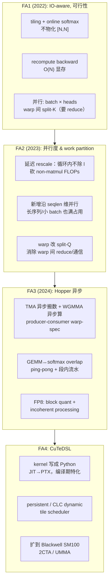

# FlashAttention

> 阅读本文需要会写标准 attention（$S = QK^{\top}$、softmax、$P = SV$；不熟悉可先读本章 [00 · Attention 基础](../00_attention_basics.md)），并了解 HBM 与 SRAM 的带宽差距（可对照 [00 · Roofline model：性能上界的两道天花板](../../hpc/00_roofline_model.md)）。
>
> FlashAttention 的主线可以概括为三个问题：为什么 attention 是 memory-bound；如何用 tiling 加 online softmax 把它改造成一个中间量不落盘的 fused kernel；以及如何在 GPU memory hierarchy 和 warp 层面把 MFU 尽量推高。本文从算法核心讲起，依次覆盖 FA2、FA3、FA4，全程对照 [[flash-attention:]]；online softmax 等关键定义会在正文显式给出。

参考代码（上游 FlashAttention 固定 commit，commit `fb02fc8`）。这个仓库同时存在三代实现，读代码时需要先认清版本边界：

| 代际 | 位置 | 语言/目标 | 状态 |
|---|---|---|---|
| **FA2** | [[flash-attention:csrc/flash_attn/src/]] | CUDA C++ + CUTLASS 2.x，SM80（Ampere）起 | 稳定，pip 主分发 |
| **FA3** | [[flash-attention:hopper/]] | CUDA C++ + CUTLASS 3.x（CuTe），SM90（Hopper）专用 | beta |
| **FA4** | [[flash-attention:flash_attn/cute/]] | **Python + CuTeDSL**（NVIDIA CUTLASS DSL，运行时 JIT 成 PTX/CUBIN），SM90/SM100 | 当前 active dev（package `flash-attn-4`）|
| Triton 参考 | [[flash-attention:flash_attn/flash_attn_triton.py]] | Triton（最易读） | 教学/AMD 后端 |
| Python 入口 | [[flash-attention:flash_attn/flash_attn_interface.py]] | `torch.autograd.Function` 包装 | FA2 接口层 |

论文：
- FA1：Dao et al., *FlashAttention: Fast and Memory-Efficient Exact Attention with IO-Awareness*, 2022. [arXiv:2205.14135](https://arxiv.org/abs/2205.14135)
- FA2：Dao, *FlashAttention-2: Faster Attention with Better Parallelism and Work Partitioning*, 2023. [arXiv:2307.08691](https://arxiv.org/abs/2307.08691)
- FA3：Shah et al., *FlashAttention-3: Fast and Accurate Attention with Asynchrony and Low-precision*, 2024. [arXiv:2407.08608](https://arxiv.org/abs/2407.08608)

---

## 0. 这组文档怎么读

| 文件 | 内容 | 对应代码 / 论文 |
|---|---|---|
| `README.md`（本文） | 为什么 attention 是 memory-bound、IO-aware 的核心论点、三代演进总览、一组贯穿全文的数字、和 CP/MoE/推理的关系 | FA1/2/3 论文 |
| [01 · IO-awareness、online softmax 与 tiling](./01_io_awareness_online_softmax.md) | **FA 的算法核心**：标准 attention 的 IO 分析、online softmax 数学推导（含数值稳定）、tiling、forward 算法、backward 的 recomputation、LSE 的作用 | FA1，[[flash-attention:flash_attn/flash_attn_triton.py]]，[[flash-attention:csrc/flash_attn/src/softmax.h]] |
| [02 · FA2：并行度与 work partitioning](./02_fa2_parallelism.md) | **FA2 的三项改进**：减少 non-matmul FLOPs（延迟 rescale）、沿 **seqlen 维并行**（不只 batch×head）、warp partitioning 从 split-K 改 split-Q、causal 下的 block 裁剪与负载 | FA2，[[flash-attention:csrc/flash_attn/src/flash_fwd_kernel.h]] |
| [03 · FA3：Hopper 上的异步化与 overlap](./03_fa3_hopper_async.md) | **FA3 的 Hopper 专用优化**：TMA / WGMMA 异步原语、producer-consumer warp-specialization、GEMM 与 softmax 的 ping-pong 及 intra-warpgroup overlap、FP8（block quant + incoherent processing） | FA3，[[flash-attention:hopper/flash_fwd_kernel_sm90.h]]，[[flash-attention:hopper/mainloop_fwd_sm90_tma_gmma_ws.hpp]]，[[flash-attention:hopper/named_barrier.hpp]] |
| [04 · FA4（CuTeDSL）与工程接口](./04_fa4_cutedsl_and_api.md) | **FA4 与工程接口**：CuTeDSL 把 kernel 写成 Python、tile scheduler（single/persistent/CLC dynamic）、Python API、varlen/`cu_seqlens`、GQA packing、paged KV / kvcache、softcap/sliding-window/ALiBi、autograd `Function` | [[flash-attention:flash_attn/cute/]]，[[flash-attention:flash_attn/flash_attn_interface.py]] |
| [05 · Flash Sparse Attention](./05_flash_sparse_attention.md) | **稀疏 FA**：滑动窗口是 mask 裁剪；NSA 沿 GQA 组 gather 加 online softmax；MoBA 两次 varlen FA 加 LSE mix；DSA 的生产路径在 FlashMLA | [[fla:fla/ops/nsa/]]、[[fla:fla/ops/moba/]]、[[fla:fla/ops/dsa/]]；FlashMLA / DeepGEMM |
| [06 · Flash Linear Attention](./06_flash_linear_attention.md) | **Flash Linear Attention**：chunkwise 的 `h`/`o` 拆解、`exp2`/`RCP_LN2`、`solve_tril` 与 WY、delta 的 `blockdim64`、`fused_recurrent`、KDA / FlashKDA | [[fla:]] commit `81091cc6` |
| [[atlas:docs/attention/fa/fa_lab.ipynb]] | 纯 torch 在 **Mac CPU** 手写 FlashAttention：online softmax 逐块累加 forward、LSE、recomputation backward，逐元素对齐 PyTorch SDPA，并量化「不物化 $[N, N]$ 矩阵」的显存差异 | —— |

建议顺序：本文先建立整体图景；01 讲清 online softmax 与 tiling，这是 FA 的算法不变量；02 说明同一个算法如何映射到 GPU 才能跑快；03 看 Hopper 上的异步化如何把 roofline 推到极限；04 落到接口与 varlen、GQA、paged 这些工程现实；05、06 看同一套 IO-aware 思路如何迁移到稀疏和线性 attention；最后做 lab，亲手实现 softmax FA 的 forward 与 backward。

---

## 1. 为什么 attention 是 memory-bound

标准 attention 对一个 head（seqlen $N$，head_dim $d$）做：

$$
\begin{aligned}
S &= QK^{\top} / \sqrt{d} && [N, N] \\
P &= \mathrm{softmax}(S) && [N, N] \\
O &= PV && [N, d]
\end{aligned}
$$

其中 softmax 沿行方向进行。

朴素实现（也是 2022 年前所有框架的实现）把 $S$ 和 $P$ 这两个 $[N, N]$ 矩阵完整物化到 HBM：写出 $S$、读回做 softmax、写出 $P$、再读回乘 $V$。这带来两个问题：

1. **显存开销是 $O(N^2)$**。`N=8K` 时单 head 的 `S` 就是 `8K×8K×2B = 128 MB`，乘上 batch 和 heads 会直接超出显存容量。这是长上下文做不大的直接原因。
2. **真正的瓶颈是 IO，不是算力**。算一下 arithmetic intensity：两个 matmul 贡献 $O(N^2 d)$ FLOPs，但 softmax 加上中间矩阵的 HBM 读写是 $O(N^2)$ 次访存。$QK^{\top}$ 和 $PV$ 的算力可以被 Tensor Core 吸收，而 softmax 是 element-wise 的低算术强度操作，整个 kernel 卡在 HBM 带宽上。GPU 的 FLOPs 与带宽之比逐代拉大（H100 BF16 约 990 TFLOPS，HBM 约 3.35 TB/s），element-wise 的 $O(N^2)$ 访存因此成为绝对瓶颈。

> FA1 的核心观察是：attention 慢不是因为算得多，而是因为反复把 $O(N^2)$ 的中间矩阵在 HBM 和片上之间来回搬运。解法不是减少计算，而是不做物化：把 $S, P$ 切成能放进 SRAM 的小块，在片上完成 softmax 和 $PV$、累加进输出，块用完即弃，$S, P$ 从不落 HBM。这就是 IO-aware、kernel fusion 与 tiling 的组合。

GPU memory hierarchy（这组文档反复用到的物理约束）：

```
寄存器/线程   ~256 KB/SM（最快）
SMEM/SRAM     ~228 KB/SM（H100），~19 TB/s 级，但容量极小
L2            ~50 MB
HBM           40–80 GB，~2–3.4 TB/s（慢，且是 O(N²) 流量的去处）
```


FA 把 attention 从「带宽受限、显存 $O(N^2)$」变成「显存 $O(N)$、接近 compute-bound」。代价是 backward 需要 recompute（用算力换显存，见 01 第 5 节），但因为本来就是 memory-bound，这笔交换非常划算。

## 2. 三代共享的三个算法不变量

不管是 FA1/2/3/4，还是 CUDA/Triton/CuTeDSL 实现，下面三件事是算法不变量，读任何一份 kernel 都能找到它们：

1. **Tiling**：$Q$ 切成 $[B_r, d]$ 的行块，$K, V$ 切成 $[B_c, d]$ 的列块。一个 kernel instance（CTA / threadblock）负责一个 Q 块，外层循环遍历所有 KV 块。
2. **Online softmax**：维护 running 的 $m$（row max）、$l$（row sum of exp）、$O$（加权 V 累加）。每处理一个 KV 块就更新这三个量，并用 $\exp(m_{\mathrm{old}} - m_{\mathrm{new}})$ 修正旧累加，使 softmax 无需全局的 $S$ 就能以流式方式算对（推导见 01 第 2 节）。
3. **Recomputation backward**：forward 只保存 $O$ 和 $\mathrm{LSE} = m + \log l$（$O(N)$ 大小），不保存 $[N, N]$ 的 $P$；backward 时用 $Q, K, V, O, \mathrm{LSE}$ 重算 $S, P$，用算力换显存。

代码里能一眼认出 online softmax 的地方：

- Triton：[[flash-attention:flash_attn/flash_attn_triton.py#L212-L252]] —— `m_ij`/`p`/`acc_o_scale = exp(m_i - m_ij)`/`lse_i` 的更新。
- FA2 C++：[[flash-attention:csrc/flash_attn/src/softmax.h#L128-L162]] —— `Softmax::softmax_rescale_o`，用 `exp2f` 而非 `expf`（见 01 第 4 节）。
- FA4 CuTeDSL：[[flash-attention:flash_attn/cute/softmax.py#L127-L181]] —— `Softmax.online_softmax` 返回 `row_scale` 给 `rescale_O`。

三代之间的差别不在算法，而在于「同一个算法如何映射到硬件」：FA1 证明可行，FA2 改进并行度与 work partitioning，FA3 用 Hopper 异步原语把 GEMM 和 softmax 重叠起来，FA4 用 CuTeDSL 把这套实现写成可维护的 Python，并扩展到 Blackwell。

## 3. 三代演进总览



性能锚点（论文与仓库给出的数字，看量级即可）：

| | FA2 (A100) | FA2 (H100) | FA3 (H100) |
|---|---|---|---|
| FP16 fwd 利用率 | ~50–73% peak | 受限于非异步 | **~75% peak（~740 TFLOPS）** |
| FP8 fwd | —— | —— | **~1.2 PFLOPS** |
| 关键手段 | seqlen 并行 + split-Q | （仍是 Ampere 思路） | TMA/WGMMA 异步 + overlap |

FA2 在 H100 上拿不满，正因为它没有利用 Hopper 的 TMA/WGMMA 异步能力，这正是 FA3 存在的理由（03 详述）。

## 4. 贯穿全文的示例配置

```
N = 8192            seqlen（Q=K=V 同长，非 varlen）
d = 128             head_dim
heads = 32, b = 2
dtype = bf16
Br = 128, Bc = 128  Q/KV 的 tile（典型；随 d 和 SM 调，见 04 heuristics）
```

- 标准实现：每 head 物化 $S = [8192, 8192]$ bf16，即 128 MB，乘上 `b·heads=64` 后是 8 GB 的中间矩阵，不可行。
- FA：片上只持有 $S_{\mathrm{block}} = [128, 128]$，即 32 KB（可以放进 SMEM），以及 running 状态 $m, l \in [128]$、$O_{\mathrm{block}} = [128, 128]$。HBM 上的 attention 中间量为零，只读 Q/K/V、写 O 和 LSE，显存复杂度 $O(N)$。
- KV 块循环次数为 $N / B_c = 64$ 次（causal 下平均减半，见 02 第 4 节）。
- 一个 CTA 负责一个 $[B_r, d]$ 的 Q 块；grid 为 $(N/B_r,\ \mathrm{heads},\ b)$（FA2 把 $N/B_r$ 放进 grid 是关键一步，见 02 第 2 节）。

## 5. FlashAttention 在整个系统里的位置

FA 解决的是「单卡上把一个 attention 算快、且不撑爆显存」的问题；它是上层一切长上下文与分布式 attention 的计算底座：

- **Context Parallelism**：Ring Attention 本质上是把 FA 的外层 KV-block 循环从单卡 SMEM 扩展成跨卡的环形 P2P，每一步的本地计算就是调用一次带正确 mask 的 FA。见 [CP](../../parallel/04_cp/README.md)。
- **推理 / serving**：decode 阶段是 `seqlen_q=1` 的极端 varlen 加 paged KV cache，FA 的 `flash_attn_with_kvcache` 和 split-KV 正是为此设计的（04 第 6 节）。SGLang/vLLM 的 attention backend 直接调用 FA 或其变体。
- **GQA/MQA**：KV head 远少于 Q head，FA 用 `pack_gqa` 把多个 Q head 打包进一次 KV 读取，节省 KV 带宽（04 第 5 节）。
- **训练**：FA 是 Megatron/TE 等框架的默认 attention kernel；它的 $O(N)$ 显存让 activation 不再随 $N^2$ 增长，这是长上下文预训练的前提。

---

参考代码（上游固定版本）：[[flash-attention:]] commit `fb02fc8`；稀疏与线性变体另对照 [[fla:]] commit `81091cc6`（v0.5.2）。机制本身如何演化见 [Attention 机制](../mechanisms/README.md)。

下一篇：[01 · IO-awareness、online softmax 与 tiling](./01_io_awareness_online_softmax.md) —— 完整推导 online softmax 的数值稳定公式、tiling、forward 的流式累加以及 recomputation backward，这是理解所有代际 FA 的算法地基。
