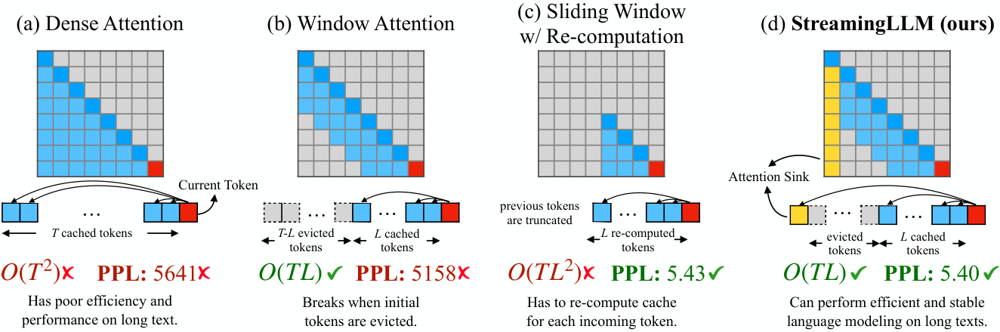
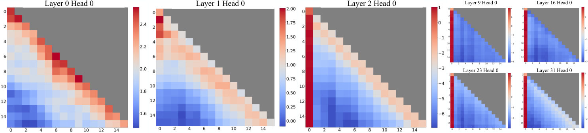

# 03 · sparse 路线（一）：静态稀疏与推理期动态稀疏

> 本篇是 sparse 路线的第一篇。阅读它需要 [`01`](./01_basics_head_sharing.md)（GQA 的 $g$ 与「一个 KV entry 被多少 query 共享」）和 [`02`](./02_position_and_stability.md) §5.5（softmax 分母恒为正）。本篇沿用的统一记号见 [Attention 机制](./README.md) §2。
>
> 本篇覆盖 sparse 路线中较早的两类工作：一类是 mask 只由位置决定的静态稀疏（sliding window、attention sink、local+global+random、层间交替），另一类是不改训练、只在推理时临时引入稀疏的方法（Quest、MInference、H2O）。读这一篇的目的是为理解 [`04`](./04_sparse_trainable.md) 打基础——只有先看清静态方案的天花板在哪里、推理期方案为什么会在 GQA 上遇到无法绕开的限制，才能明白后面「可训练稀疏」为什么是必要的。

---

## 1. sliding window：最朴素的稀疏

sliding window attention（SWA）的规则很简单：query $i$ 只 attend $[i-W, i]$ 这个窗口内的位置，超出窗口的一律不看。


> 图：Mistral 7B 论文的 SWA 图（Jiang et al. 2023, Fig 1；[arXiv:2310.06825](https://arxiv.org/abs/2310.06825)）。**右图是理解这个机制的关键**：单层 SWA 只看 `W` 个 token，但第 `k` 层的位置 `i` 会通过第 `k−1` 层看到 `[i−W, i]`，再通过第 `k−2` 层看到 `[i−2W, i]`，如此层层递推，信息就以每层 `W` 的速度向前传播。Mistral 一共 32 层、`W=4096`，理论感受野可以达到 **≈131K**。

Mistral 7B 的具体配置和收益是这样的：$W = 4096$；配合 **rolling buffer cache**，也就是一个固定大小 $W$ 的环形缓冲，timestep $i$ 的 K/V 存在槽位 $i \bmod W$ 里；32K 序列下 cache 内存降低 **8 倍**且质量无损；FlashAttention/xFormers 侧的相应改动还带来了 16K 长度下 **2 倍**的加速。

这里有一个值得记住的性质：SWA 是本章唯一一个**KV cache 总量存在上界**的静态方案。

```
SWA 的 KV cache 总元素 = 2·h_kv·d_h · 层数 · min(N, W)     ← 与 N 解耦（封顶在 W）
```

正因为这个性质，它在 [Attention 机制](./README.md) §7 的表里独占一行：不是 $O(1)$，但是 $O(W)$。

## 2. attention sink：头几个 token 为什么不能丢

如果只保留最近 $W$ 个 token（也就是纯滑窗、不做重算），perplexity 会直接**爆炸**。StreamingLLM（[arXiv:2309.17453](https://arxiv.org/abs/2309.17453)）找到了这背后的原因，而且原因完全来自 softmax 的代数性质，和内容无关。



> 图：StreamingLLM 的核心对照图（Xiao et al. 2023, Fig 1；[arXiv:2309.17453](https://arxiv.org/abs/2309.17453)）。注意 (b) 和 (d) 的**唯一差别就是保留了最前面 4 个 token 的 KV**，PPL 从 5158 变成 5.40——差三个数量级。

### 2.1 根因：softmax 分母恒为正

论文 Eq. 1 与那段解释（逐字）：

$$
\mathrm{softmax}(x)_i = \frac{e^{x_i}}{e^{x_1} + \sum_{j=2}^{N} e^{x_j}}, \qquad x_1 \gg x_j
$$

> "The nature of the SoftMax function **prevents all attended tokens from having zero values**. This requires aggregating some information from other tokens across all heads in all layers, **even if the current embedding has sufficient self-contained information for its prediction**. Consequently, the model tends to **dump unnecessary attention values to specific tokens**."

去掉初始 token 的 KV，会"remove a considerable portion of the denominator in the SoftMax function"，也就是砍掉了分母的一大部分，导致整个 score 分布偏离训练时见过的样子，模型因此崩溃。

**为什么恰好是最前面几个 token 起到了这个作用**（这是本节第二个关键论据）：

> "Due to the sequential nature of autoregressive language modeling, initial tokens are visible to all subsequent tokens, while later tokens are only visible to a limited set of subsequent tokens. As a result, **initial tokens are more easily trained to serve as attention sinks**."



> 图：attention sink 现象的直接证据（Xiao et al. 2023, Fig 2；[arXiv:2309.17453](https://arxiv.org/abs/2309.17453)）。前两层还是正常的局部模式，从第三层开始**所有 head 都把大量 attention 倒在第一个 token 上**，而这个 token 本身并不携带什么信息，只是充当 softmax 的「泄压阀」。这张图和上一张图放在一起就构成了完整的论证：图 2 说明现象确实存在，图 1 说明去掉它会导致崩溃。

### 2.2 位置比语义更重要

Table 1（Llama-2-13B, PG19）：

| Cache config | PPL |
|---|---|
| `0 + 1024`（纯 window） | **5158.07** |
| `4 + 1020` | **5.40** |
| `4×"\n" + 1020`（把前 4 个换成换行符） | **5.60** |

这张表说明了一件事：**把前 4 个 token 换成毫无语义的换行符，perplexity 基本能恢复**，也就是说起作用的是绝对位置，不是内容本身。Table 2 进一步显示 4 个 sink token 就足够：Llama-2-7B 的 PPL 在 `0+4096` 时是 3359.95，`1+4095` 时降到 11.88，`2+4094` 时 10.51，`4+4092` 时 9.59，`8+4088` 时 9.54，增益已经很小。

### 2.3 实现细节：cache 内位置编号

原文特别提醒："**positions are assigned within the cache, not in the original text**"。也就是说，如果 cache 里装着 token `[0,1,2,3,6,7,8]`，解码第 9 个 token 时用的位置是 `[0..7]`，**不是** `[0,1,2,3,6,7,8,9]`。

对 RoPE 而言，这意味着**key 必须在旋转之前缓存，每一步都要按 cache 内的位置重新旋转**。这和 [`02`](./02_position_and_stability.md) §4 里 Dynamic NTK 「必须缓存 pre-RoPE 的 kv」是同一个约束。

```python
def streaming_llm_cache(k_pre_rope, v, n_sink=4, window=1020):
    """k_pre_rope: [B, H, T, D]  未旋转的 key。返回 (k, v, positions)。"""
    k_s, v_s = k_pre_rope[:, :, :n_sink], v[:, :, :n_sink]              # sink：永久保留
    k_w, v_w = k_pre_rope[:, :, -window:], v[:, :, -window:]           # rolling window
    k_cat, v_cat = torch.cat([k_s, k_w], 2), torch.cat([v_s, v_w], 2)
    pos = torch.arange(k_cat.shape[2], device=k_cat.device)            # ← cache 内位置，不是原文位置
    return rope(k_cat, pos), v_cat, pos
```

其余的实测数字：相对 sliding-window-with-recomputation 有 `22.2 倍` 的加速；在 Llama-2/MPT/Falcon/Pythia 上可以跑到 4M token；如果**预训练时就加一个可学习的 sink token，之后只需要 1 个 sink 就够**（普通做法需要 4 个）。这条建议后来被 GPT-OSS 和 DeepSeek-V4 以 learned sink logit 的形式真正落地（[`02`](./02_position_and_stability.md) §5.5）。

## 3. pattern taxonomy：Longformer 与 BigBird

在「按内容动态选择」这一类方法出现之前，静态 pattern 的设计空间已经被 Longformer 和 BigBird 这两篇论文基本穷举过了。

**Longformer**（[arXiv:2004.05150](https://arxiv.org/abs/2004.05150)）三种可组合 pattern：

| pattern | 定义 | 论文取值 |
|---|---|---|
| **sliding window** | query $i$ attend $[i-w/2, i+w/2]$ | `w = 512`，"therefore using the same amount of computation as RoBERTa" |
| **dilated sliding window** | 窗口内留间隔 $d$ | 固定 $d$、$w$、$\ell$ 层 ⇒ 感受野 $\ell \cdot d \cdot w$ |
| **global attention** | 少数预选位置，且**对称** | `[CLS]` 用于分类；QA 时所有 question token |

global pattern 的对称性值得强调，原文写道："a token with a global attention attends to all tokens across the sequence, **and all tokens in the sequence attend to it**." 因为 global token 的数量与序列长度 $n$ 无关，总复杂度可以保持在 $O(n)$。

**BigBird**（[arXiv:2007.14062](https://arxiv.org/abs/2007.14062)）用的是 **local + global + random** 三者组合，背后的动机来自理论证明：这三种 pattern 组合起来，足以让稀疏 attention 成为序列函数的 universal approximator，并且是 Turing complete 的。HuggingFace 的默认配置是 `block_size=64`、`num_random_blocks=3`、window 3 个 block、2 个 global block。序列长度必须能被 block size 整除；如果序列长度低于 1024 token，官方建议直接用 `original_full`，因为稀疏化在这种规模下不划算。

```python
def bigbird_mask(T, block=64, n_random=3, n_window=3, n_global=2, seed=0):
    """local + global + random 的块级 mask。返回 [T, T] bool。"""
    nb = T // block
    g = torch.Generator().manual_seed(seed)
    blk = torch.zeros(nb, nb, dtype=torch.bool)
    idx = torch.arange(nb)
    for off in range(-(n_window // 2), n_window // 2 + 1):             # local band
        blk |= (idx[None, :] - idx[:, None] == off)
    blk[:, :n_global] = True                                            # global（列：人人都看它）
    blk[:n_global, :] = True                                            # global（行：它看人人）
    for i in range(nb):                                                 # random
        blk[i, torch.randperm(nb, generator=g)[:n_random]] = True
    return blk.repeat_interleave(block, 0).repeat_interleave(block, 1)
```

> **这一节的内容之所以重要，是因为后面所有「动态选择」方法都在这个 taxonomy 里保留了静态的骨架**：NSA 的 top-$n=16$ 里就**硬编码了 1 个 initial block 加 2 个 local block**；MoBA **强制选中当前块**；InfLLM-V2 把它写成了显式的并集 $I = I_{\mathrm{init}} \cup I_{\mathrm{local}} \cup I_{\mathrm{topk}}$。MoBA 论文更进一步**证明了 SWA 和 attention sink 都是自己的特例**（[`04`](./04_sparse_trainable.md) §7）。可以说，静态 prior 从来没有被真正淘汰，只是被吸收进了动态方法的预算里。

## 4. 层间交替

单层稀疏总会带来一定的信息损失。工业界给出的答案是：**让大部分层做稀疏、少数层保持全局**，靠这少数全局层兜住长程检索的能力——稀疏由此从算子层面的选择变成了架构层面的设计。

| Model | 比例 | local 形式 | window | 备注 |
|---|---|---|---|---|
| **Gemma 2** | **1:1**（every other layer） | SWA | **4096** | global 跨度 8192；2B/9B/27B 一致 |
| **Gemma 3** | **5:1**，**首层是 local** | SWA | **1024** | 128K 上下文，只有 ~17% 的层看长程 |
| **GPT-OSS** | **1:1** | banded window | **128**（极小） | per-head **learned sink** |
| **Llama 4** | 3:1 | **chunked**（块对角，**不是滑窗**） | chunk 8192 | 1/4 层是 **NoPE global** |
| Character.AI | ~1 global / 6 层 | —— | —— | + cross-layer KV sharing + MQA，报 ~20× cache 减少 |

Gemma 2 的原文是："We alternate between a local sliding window attention and global attention in **every other layer**." Gemma 3 的原文则是："**5:1 interleaving of local/global layers** … a pattern of 5 local layers for every global layer, **starting with a local layer as the first layer** of the model."

**Gemma 3 有两个很实用的消融结论**：Fig 3 显示 local:global 的比例对 perplexity 的影响 "minimal impact"；Fig 4 显示窗口大小 "can be reduced significantly without impacting perplexity"（Gemma 2 的 Table 10 给出了更直接的数字：window 取 4096/2048/1024 时 PPL 分别是 1.63/1.63/1.64，几乎没有差别）。也就是说，**质量对这两个旋钮都不敏感，而内存开销对它们却极其敏感**：在 32K 上下文下，全局层全用 global attention 的 cache 占到模型权重的 **60%**，而换成 1:3 + `sw=1024` 之后能降到 **不到 15%**。这几乎是「免费」拿到的 8 倍内存节省。

### Llama 4 的 chunked attention

⚠️ 一个流传很广的误解是把 Llama 4 的 local attention 当作 sliding window，值得单独澄清：它实际上是 chunked attention。官方 `llama-models` 参考实现如下：

```python
def create_chunked_attention_mask(seq_len, attention_chunk_size, device):
    block_pos = torch.abs(
        (torch.arange(seq_len).unsqueeze(0) // attention_chunk_size)
        - (torch.arange(seq_len).unsqueeze(1) // attention_chunk_size))
    token_pos = torch.arange(seq_len).unsqueeze(0) - torch.arange(seq_len).unsqueeze(1)
    mask = (block_pos == 0) & (token_pos <= 0)          # 必须同块 + causal
    return mask
```

`block_pos == 0` 意味着 query 和 key **必须落在同一个 chunk 里**，这实际上是一个**块对角 causal mask**：token `0..K` 之间互相可见，`K..2K` 之间互相可见，但**跨块完全不通**。而滑窗是每个 query 都有自己平移的窗口，两者的结构并不相同。

**这带来的后果是**：chunked attention **不能像堆叠 SWA 那样跨块传播信息**（§1 右图描述的那个机制在这里不成立），这正是 Llama 4 必须搭配 NoPE 全 attention 层的原因。它的 `attention_chunk_size` 取值是 8192。vLLM 把这两种模式分别建模成 `ChunkedLocalAttentionSpec` 和 `FullAttentionSpec`。

Meta 的 iRoPE 说法：

> "A key innovation in the Llama 4 architecture is the use of **interleaved attention layers without positional embeddings**. Additionally, we employ **inference time temperature scaling of attention** to enhance length generalization. We call this the **iRoPE** architecture, where '**i**' stands for '**interleaved**'."

具体的 config 是：`no_rope_layers: [1,1,1,0, 1,1,1,0, …]`（48 层，每 4 层里有 1 层是 NoPE）；`attn_temperature_tuning: true`、`attn_scale: 0.1`、`floor_scale: 8192`。这里 temperature scaling **只用在 NoPE 层**上，HF 的文档明确写道："applied in the NoPE layers, but **not** in the RoPE ones as these attend to shorter sub-sequences"。Scout 在预训练和后训练阶段都用 256K，官方声称支持到 10M。

```
Llama 4 的分工：
  RoPE + chunked local (8192)  →  短程精确顺序，cache 封顶、算力省
  NoPE + full global           →  跨全上下文检索，不会因超出训练长度而旋转角失配
```

## 5. 推理期动态稀疏及其局限

这一类方法不改训练，只在推理时按内容临时做选择，代表性的有三类：

**Quest**（[arXiv:2406.10774](https://arxiv.org/abs/2406.10774)，ICML 2024）做的是 query-aware page selection，用在 **decode** 阶段。它给每个 page 维护 key 的 channel-wise min $m_i$ 和 max $M_i$；给定 query $Q$，逐通道算出上界 $U_i = \max(Q_i m_i,\ Q_i M_i)$，那么 $\sum_i U_i$ 就是该 page 内最高 attention score 的**上界**。按这个上界选 top-$K$ page，就不容易漏掉真正重要的 token。

```python
def quest_page_scores(q, k, page=16):
    """q: [B,H,1,D] (decode)。k: [B,H,N,D]。返回每个 page 的上界打分 [B,H,N/page]。"""
    kp = k.unflatten(2, (-1, page))                    # [B,H,NP,page,D]
    m, M = kp.amin(3), kp.amax(3)                      # channel-wise min / max，每 page 各 D 维
    return torch.maximum(q.transpose(2, 3) * m, q.transpose(2, 3) * M).sum(-1)
```

算一下代价：page 大小为 $S$、上下文长度为 $N$，选 top-$K$ 时实际要读的 cache 比例是 $1/S + KS/N$；取 $S=16$、64K 上下文、top-4K，能拿到 **8 倍**的减少。

**MInference 1.0**（[arXiv:2407.02490](https://arxiv.org/abs/2407.02490)，NeurIPS 2024）走的是 training-free 路线，但**只加速 prefill**。它定义了三种 head 级 pattern：

| pattern | 结构 | 索引怎么来 |
|---|---|---|
| **A-shape** | global prefix + local 对角带（≈StreamingLLM） | 静态；参考配置 1024 global + 4096 local |
| **Vertical-Slash** | 少数特定列 + 斜线状对角 | **动态**：用最后 `last_q` 个 query 对全部 K 估计 |
| **Block-Sparse** | 散落但空间聚集的稠密块 | **动态**：Q/K 按 64 分块 mean-pool，块级打分 |

每个 head 归属哪种 pattern，由**离线**的 Kernel-Aware Sparse Pattern Search 决定，具体索引则在**线上**构建。这样能省下约 95% 的 attention FLOPs，在 A100 上 prefill 最高能加速 **10 倍**。

**H2O / SnapKV / SepLLM** 走的是另一条路，即 KV eviction：按累积的 attention 质量丢弃「不重要」的 token。

### 局限的三个原因

**原因一是阶段受限。** MInference 只能加速 prefill，Quest 只能加速 decode，两者互相覆盖不到对方。MoBA 在评测时也承认了这一点："MoBA is used for prefill only, while we switch to full attention during generation"。而 [Attention 机制](./README.md) §1 那个式子已经说明，真正花钱的地方是 decode，仅加速 prefill 解决不了核心问题。

**原因二更根本，是 GQA 下「算力稀疏不等于访存稀疏」这一点。** 这是 NSA 论文对 Quest 的核心批评，也是理解整条 sparse 路线走向的关键：

```
GQA，一组 g 个 query head 共享一份 KV。
每个 head 独立选自己的 top-k pages
  ⇒ 实际必须从 HBM 搬的字节 = 组内 g 个 head 选择集合的【并集】
  ⇒ 计算量降了 k/N，但访存量降得远少于 k/N
  ⇒ 而 decode 是 memory-bound（[README] §1）⇒ 加速远不如账面
```

NSA 给出的解法是 **Eq. 10**：把组内所有 head 的打分加起来，强制一整组共用一份 block 列表（[`04`](./04_sparse_trainable.md) §3）。DSA 的解法更极端：**用 MLA 的 MQA mode，让一个 latent 被所有 head 共享**，这样 per-query 的 token 级选择就自动满足访存稀疏了（[`05`](./05_sparse_dsa_frontier.md) §3）。

**原因三是 post-hoc 剪枝存在质量天花板。** NSA 引用的一个量化论据是：top-20% 的 attention 只覆盖了 **70%** 的 attention 质量（Chen et al. 2024b），所以 dense 预训练模型里的 retrieval head 经不起事后剪枝。NSA 还试过「先用 1000 步 full attention 冷启动、再切换到启发式 blockwise 选择」这种折中方案，结果仍然不如原生训练的 NSA。

NSA 的 LongBench 对照（所有 sparse baseline 都给 2560 个激活 token 以求公平）：

| 方法 | LongBench avg |
|---|---|
| **NSA**（原生训练） | **0.469** |
| Full Attention | 0.437 |
| Exact-Top | 0.423 |
| Quest | 0.392 |
| InfLLM | 0.383 |
| H2O | 0.303 |

值得注意的是，**NSA 甚至超过了 Full Attention 的表现**。这个反直觉的结果正是 [`04`](./04_sparse_trainable.md) 的起点：稀疏不只是用来省钱的手段，训练时带着稀疏约束本身，可能还是一种有益的归纳偏置。

## 6. 小结

| 类别 | 代表 | 每 token cache | 加速哪个阶段 | 天花板 |
|---|---|---|---|---|
| SWA | Mistral、Gemma local、GPT-OSS local | **封顶 $O(W)$** | 两个都 | 单层感受野只有 $W$，靠堆层传播（chunked 连这个都没有） |
| window + sink | StreamingLLM | 封顶 | decode（streaming） | 只能流式，不能真正检索长上下文 |
| local+global(+random) | Longformer、BigBird | $O(N)$ 但常数小 | 两个都 | pattern 与内容无关 |
| 层间交替 | Gemma 2/3、GPT-OSS、Llama 4 | 少数层随 $N$ 增长 | 两个都 | **实际最成功的静态方案**；全局层仍是 $O(N^2)$ |
| 推理期动态 | Quest、MInference、H2O | 全量 | 只有一个阶段 | 阶段受限 + GQA 访存不稀疏 + post-hoc 质量损失 |

**静态方案，尤其是层间交替这一类，在工业界非常成功且几乎是免费的**，Gemma 3、GPT-OSS、Llama 4 都靠它撑住了 128K 的上下文。它的上限在于「pattern 不看内容」。推理期动态方案想要看内容却又不改训练，结果被 GQA 的访存约束和 post-hoc 的质量天花板一起夹住，两头都没能做到最好。

**这两个约束合起来指向同一个结论**：要么让选择变成**块级且组内一致**（NSA/MoBA 的做法），要么让 KV entry 被**所有** head 共享（DSA 的做法），而且最好从一开始就**原生训练**，而不是事后打补丁。这正是下一篇要展开的内容。

---

下一篇：[04 · sparse 路线（二）：可训练稀疏](./04_sparse_trainable.md)。2025 年 2 月，NSA 和 MoBA 相隔三天出现，用两种完全不同的哲学回答了同一个问题：怎么让稀疏 attention 从训练第一步就存在。
