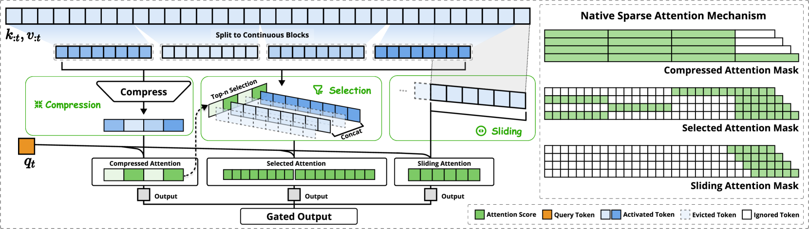
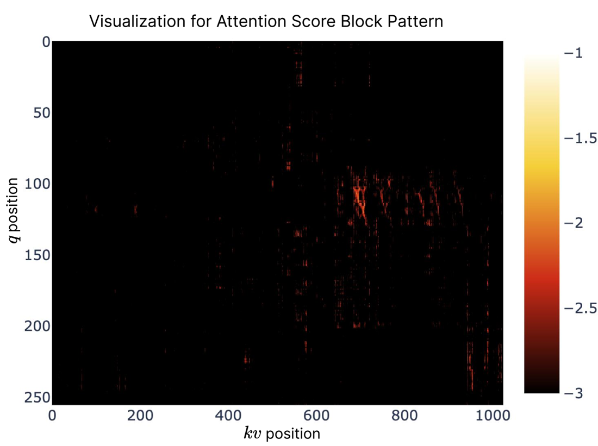
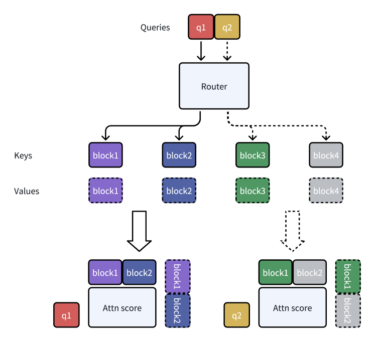
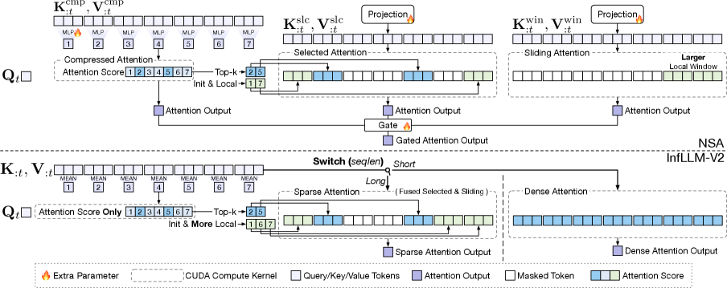

# 04 · sparse 路线（二）：可训练稀疏

> 本篇接续 [`03`](./03_sparse_static.md)——尤其是 §5 关于推理期方案局限的分析（阶段受限、GQA 下访存不稀疏）——并依赖 [`01`](./01_basics_head_sharing.md) §3 的 GQA 组结构。本篇统一记号见 [Attention 机制](./README.md) §2。
>
> 2025 年 2 月，两篇论文相隔**三天**先后出现：NSA（2 月 16 日，DeepSeek）和 MoBA（2 月 19 日，Moonshot）。它们回答的是同一个问题——**怎么让稀疏 attention 从预训练第一步就存在**——但走的是完全相反的哲学：NSA 选择加机制，包括压缩 MLP、三套独立 K/V、门控，然后原生预训练；MoBA 则一个参数都不加，靠 mean-pool、硬 top-k、MoE 式路由来实现，再做短序列到长序列的适配。
>
> 涉及的论文：NSA [arXiv:2502.11089](https://arxiv.org/abs/2502.11089)、MoBA [arXiv:2502.13189](https://arxiv.org/abs/2502.13189)、InfLLM-V2 [arXiv:2509.24663](https://arxiv.org/abs/2509.24663)。

---

## 1. NSA 的整体框架

NSA 的出发点是把 attention 的 KV 集合变成 query 的函数。先看基线 attention 的形式（Eq. 1–2）：

$$
o_t = \mathrm{Attn}(q_t, k_{:t}, v_{:t}) = \frac{\sum_{i \le t} \alpha_{t,i}\, v_i}{\sum_{j \le t} \alpha_{t,j}}, \qquad \alpha_{t,i} = \exp(q_t^{\top} k_i / \sqrt{d_k})
$$

NSA 的核心想法是把 $k_{:t}, v_{:t}$ 换成 **query 相关的重映射集合**（Eq. 3–4），然后用门控把三个分支的输出合成起来（Eq. 5，是全文的核心公式）：

$$
\tilde{K}_t^c = f_K^c(q_t, k_{:t}, v_{:t}), \qquad \tilde{V}_t^c = f_V^c(\dots)
$$

$$
o_t^{*} = \sum_{c \in \mathcal{C}} g_t^c \cdot \mathrm{Attn}(q_t, \tilde{K}_t^c, \tilde{V}_t^c), \qquad \mathcal{C} = \{ \mathrm{cmp}, \mathrm{slc}, \mathrm{win} \}
$$

稀疏预算（Eq. 6）维持 $N_t \ll t$：

$$
N_t = \sum_c |\tilde{K}_t^c|
$$



> 图：NSA 的核心架构图（Yuan et al. 2025, Fig 2；[arXiv:2502.11089](https://arxiv.org/abs/2502.11089)）。**左半边**：$k_{:t}, v_{:t}$ 被切成连续块，三条路各自处理——压缩分支把每块压成一个 entry；选择分支用 top-n 挑出若干原始块拼起来；滑窗分支取最近 $w$ 个 token。三个输出经 Gated Output 合并。**右半边**是三个 mask，一眼就能看出各自跳过了什么：压缩 mask 是「粗粒度但全覆盖」，选择 mask 是「细粒度但只有几块」，滑窗 mask 是「对角带」。三者正好互补，这就是 Eq. 5 的图形版本。

三个分支的分工可以这样概括：**压缩分支保证「哪儿都能看到一点」，选择分支保证「重要的地方看得清」，滑窗分支保证「近处看得全」。**

## 2. compression 分支

压缩分支把每个块压成一个学出来的摘要。先看 Eq. 7 给出的定义：

$$
\tilde{K}_t^{\mathrm{cmp}} = f_K^{\mathrm{cmp}}(k_{:t}) = \{ \varphi(k_{id+1 : id+l}) \mid 0 \le i \le \lfloor (t-l)/d \rfloor \}, \qquad \tilde{K}_t^{\mathrm{cmp}} \in \mathbb{R}^{d_k \times \lfloor (t-l)/d \rfloor}
$$

这里 $l$ 是压缩块长度，$d$ 是相邻块之间滑动的 stride。**可学习的部分是 $\varphi$**，原文的描述是"a learnable MLP with **intra-block position encoding** to map keys in a block to a single compressed key"。intra-block position encoding 是必需的：**没有它，$\varphi$ 对块内顺序就是 permutation-invariant 的**，分不清块里第 $j$ 个 key 和第 $k$ 个 key。另外，**$d < l$ 是刻意的设计**，也就是让块之间存在重叠，目的是"to mitigate information fragmentation"。$\tilde{V}_t^{\mathrm{cmp}}$ 则用另一套独立参数的 $\varphi$ 来计算。

论文没有给出 $\varphi$ 具体的深度、宽度或位置编码形式。下面的实现用「intra-block 加性位置权重 + 池化 + 线性映射」来复现，足以跑通形状与语义：

```python
def compress(x, l, stride, phi):
    """x: [B, T, H, D] -> [B, nb, H, D]，重叠块（stride < l）。"""
    nb = max(0, (x.shape[1] - l) // stride + 1)
    return torch.stack([phi(x[:, i * stride: i * stride + l]) for i in range(nb)], dim=1)

# phi: 论文说是 "learnable MLP with intra-block position encoding"
pe   = torch.randn(l, D) * 0.1          # intra-block position encoding，[l, D]
Wphi = torch.randn(D, D) / D ** 0.5
phi  = lambda blk: ((blk + pe[None, :, None, :]).mean(1)) @ Wphi.T      # [B, l, H, D] -> [B, H, D]
```

这里有一个容易漏掉的细节：**可见性掩码不能直接照抄标准 causal mask**。压缩 entry $i$ 概括的是 token $[i \cdot d,\ i \cdot d + l)$ 这一段，所以 query $t$ 只有在 $i \cdot d + l - 1 \le t$ 时才能看到它，否则会看到未来信息。

```python
t_idx  = torch.arange(T)
cmp_ok = ((torch.arange(nb) * stride + l - 1)[None, :] <= t_idx[:, None])   # [T, nb]
```

## 3. selection 分支

**这是 NSA 设计里最巧妙的一步。** 块重要性打分本来需要额外扫描一遍，但 NSA 直接从压缩分支已经算好的 softmax 里取出结果，不需要多花任何额外开销。

**第一步是复用压缩 attention 的分数**（Eq. 8）：

$$
p_t^{\mathrm{cmp}} = \mathrm{Softmax}(q_t^{\top} \tilde{K}_t^{\mathrm{cmp}}) \in \mathbb{R}^{\lfloor (t-l)/d \rfloor + 1}
$$

**第二步是把压缩块的分数重映射到选择块上**（Eq. 9）。设选择块大小为 $l'$：如果 $l' = l = d$，可以直接取 $p^{\mathrm{slc}} = p^{\mathrm{cmp}}$；否则在 $l \le l'$、$d \mid l$、$d \mid l'$ 都成立的整除条件下：

$$
p_t^{\mathrm{slc}}[j] = \sum_{m=0}^{l'/d - 1} \sum_{n=0}^{l/d - 1} p_t^{\mathrm{cmp}}[(l'/d) \cdot j - m - n]
$$

这个双重求和可以这样理解：外层 $m$ 遍历落在选择块 $j$ 内部的 $l'/d$ 个压缩块的**起点**；内层 $n$ 用来补偿「每个压缩块会横跨 $l/d$ 个 stride，因此会与好几个选择块的槽位重叠」这一事实。两者合起来，得到的结论是：**选择块的分数等于所有跨度与它相交的压缩块分数之和**。以论文自己的数字为例（$l=32, d=16, l'=64$），公式就是 $\sum_{m=0}^{3} \sum_{n=0}^{1} p^{\mathrm{cmp}}[4j - m - n]$，每个选择块对应 8 项。

**第三步是在 GQA 组内跨 head 聚合**（Eq. 10）：

$$
p_t^{\mathrm{slc}\prime} = \sum_{h=1}^{H} p_t^{\mathrm{slc},(h)}, \qquad H = \text{query heads in the group}
$$

原文给出的理由完全是从 infra 角度出发的，直接对应 [`03`](./03_sparse_static.md) §5 里的「原因二」：

> "For models employing GQA or MQA where key-value caches are shared across query heads, **consistent block selection across these heads has to be ensured to minimize KV cache loading during decoding**."

**第四步是取 top-$n$**（Eq. 11–12）：

$$
\mathcal{I}_t = \{ i \mid \mathrm{rank}(p_t^{\mathrm{slc}\prime}[i]) \le n \}, \qquad \tilde{K}_t^{\mathrm{slc}} = \mathrm{Cat}[ \{ k_{il'+1 : (i+1)l'} \mid i \in \mathcal{I}_t \} ] \in \mathbb{R}^{d_k \times n l'}
$$

下面是这四步的完整实现，每一步都在 `float64` 精度下跑过，Eq.10 的组一致性也做了显式断言：

```python
def nsa_select(p_cmp, l, stride, lp, n_sel, T, Hkv, G, cur_blk):
    """p_cmp: [B, T, Hq, nb] 压缩分支的 softmax 概率。返回 [B, T, Hkv, n_sel] 块索引。"""
    n_blk = math.ceil(T / lp)
    # --- Eq.9: 压缩块分数 -> 选择块分数
    p_slc = p_cmp.new_zeros(*p_cmp.shape[:-1], n_blk)
    for j in range(n_blk):
        acc = 0.0
        for m in range(lp // stride):
            for nn in range(l // stride):
                i = (lp // stride) * j - m - nn
                if 0 <= i < p_cmp.shape[-1]:
                    acc = acc + p_cmp[..., i]
        p_slc[..., j] = acc
    # --- Eq.10: 组内 G 个 query head 的分数相加 -> 每组一份列表
    B = p_slc.shape[0]
    scores = p_slc.view(B, T, Hkv, G, n_blk).sum(3)                       # [B, T, Hkv, n_blk]
    # --- 硬编码的静态 prior：1 个 initial block（sink）+ 2 个 local block
    BIG = 1e9
    scores[..., 0] = BIG
    for off in (0, 1):
        idx = (cur_blk - off).clamp(min=0)
        scores.scatter_(-1, idx[None, :, None, None].expand(B, T, Hkv, 1), BIG)
    scores = scores.masked_fill(                                          # 不看未来块
        (torch.arange(n_blk)[None, :] > cur_blk[:, None])[None, :, None, :], -BIG)
    # --- Eq.11: top-n
    return scores.topk(min(n_sel, n_blk), dim=-1).indices

# 实测（T=512, l=32, d=16, l'=64, Hkv=2, G=4）：
#   Eq.9  : 31 个压缩块 -> 8 个选择块，每块 (l'/d)*(l/d) = 4*2 = 8 项  ✓
#   Eq.10 : 组内全部 4 个 head 拿到完全相同的块列表                    ✓
```

> $n = 16$ 这个数字里藏着一个容易漏看的括号说明：论文写的是 "**including 1 fixed initial block and 2 local blocks**"。也就是说，**只有 13 块是真正靠动态打分选出来的**，另外 3 块是硬编码的、StreamingLLM 式的静态 prior（[`03`](./03_sparse_static.md) §2/§3）。上面代码里那两处 `scatter_` 调用就是在实现这一点。

## 4. sliding window 分支

$$
\tilde{K}_t^{\mathrm{win}} = k_{t-w : t}, \qquad \tilde{V}_t^{\mathrm{win}} = v_{t-w : t}
$$

这个分支存在的动机不是效率，而是**训练动力学**，原文写道：

> "local patterns typically **adapt faster and can dominate the learning process**, potentially preventing the model from effectively learning from compression and selection tokens."

也就是说，局部模式是最容易学的信号，如果不给它一个单独的通道，它会「抢占」压缩和选择分支本该获得的学习信号。专门给它开一条独立的路，另外两个分支才能真正学起来。

同一个逻辑还导致了另一个设计，也是后来被批评最多的一点：

> "To further prevent shortcut learning across attention branches with marginal computational overhead, we provide **independent keys and values for three branches**."

**三个分支各自拥有一套独立的 K/V 投影。** 这正是 InfLLM-V2 后来攻击的「参数膨胀」问题（见 §8）。

## 5. 门控：三个独立 sigmoid

论文在这一部分写得非常简略，全部规格只有一句话：

> "$g_t^c \in [0,1]$ is the gate score for corresponding strategy $c$, **derived from input features via an MLP and sigmoid activation**."

既没有给出编号公式，也没说明 MLP 的维度，更没说是 per-head 还是 per-token。目前所有复现都采用了这样的形式：

$$
[\, g_t^{\mathrm{cmp}},\ g_t^{\mathrm{slc}},\ g_t^{\mathrm{win}} \,] = \sigma( W_2 \cdot \mathrm{act}(W_1 h_t) ), \qquad W_1 \in \mathbb{R}^{d_{\mathrm{mid}} \times d}, \quad W_2 \in \mathbb{R}^{3 \times d_{\mathrm{mid}}}
$$

这里有一个结构性事实是 Eq. 5 直接蕴含的，需要特别留意：这是**三个独立的 sigmoid，而不是 3-way softmax**。三个门的取值不要求和为 1，所以 $o_t^{*}$ 是一个**未归一化**的加权和，模型可以独立地把任意一个分支拉到 0，也可以让三个门同时接近 1。

```python
gate = torch.sigmoid(torch.einsum('bthd,cd->bthc', q, Wg))          # [B,T,Hq,3]，三个独立 sigmoid
o = gate[..., 0:1] * o_cmp + gate[..., 1:2] * o_slc + gate[..., 2:3] * o_win

# 实测：三个门之和的范围是 [0.291, 2.821] —— 明显不是 1.0 ✓
```

## 6. hardware-aligned 与 natively trainable

NSA 标题里的两个关键词各有具体所指，本节分别说明。

### 6.1 hardware-aligned

**支柱一是 blockwise 而非 token-wise 的选择粒度。** 这背后有两条理由：

第一条理由是硬件层面的：GPU 对**连续块读**的吞吐远高于随机索引读，只有块级计算才能喂饱 Tensor Core，这和 FlashAttention 的立论基础完全一致（[01 · IO-awareness、online softmax 与 tiling](../fa/01_io_awareness_online_softmax.md)）。原文对 token 级方法（点名批评了 HashAttention）的评价是：散落的 per-token gather "prevent efficient adaptation of fast attention techniques like FlashAttention"。

第二条理由来自经验观察：**attention score 在空间上是连续的**，邻近的 key 往往重要性相似。



> 图：blockwise 粒度的经验依据（Yuan et al. 2025, Fig 8；[arXiv:2502.11089](https://arxiv.org/abs/2502.11089)）。这是在他们自己预训练的 27B dense 模型上画出的 attention 分布，可以看到**高分区域成块聚集，而不是随机散点**。如果分布是散点状的，块级选择就会大量浪费预算；正因为它成块聚集，$l'=64$ 的粒度几乎不损失召回率。这张图构成了 NSA 全部「hardware-aligned」论证的实证前提。

**支柱二是 GQA 组一致，也就是 Eq. 10**，这一条是直接针对 Quest 的批评。GQA 下如果每个 head 独立做选择，真正要搬运的字节数是组内所有 head 选择集合的**并集**——计算量看似稀疏了，但访存量并没有真正降下来，而 decode 恰恰是 memory-bound 的。强制一整组共用一个 $\mathcal{I}_t$，就能让**访存稀疏度等于计算稀疏度**。

### 6.2 natively trainable

NSA 的所有组件都是端到端可微的。论文列出的对比反例很有信息量：

| 反例 | 问题 |
|---|---|
| ClusterKV 的 k-means、MagicPIG 的 SimHash | **不可微的离散算子**，切断计算图 |
| SeerAttention 式 auxiliary-loss router | 额外算子开销；其 3B 消融（Fig 7）收敛更差 |
| Quest 式启发式打分（query × key chunk 的逐通道 min-max） | "suffers from **low recall**" |
| 1000 步 full attention 冷启动后切启发式 blockwise | 仍然输给原生 NSA |

这里有一个微妙的地方：top-$n$ 选择本身是**不可微**的，但梯度会通过压缩分支流向 $\varphi$，而 $\varphi$ 正是产生分数的那个模块。所以选择策略实际上是**间接**被学到的。这个「间接性」正是 NSA 与 DSA 之间的分水岭（[`05`](./05_sparse_dsa_frontier.md) §4）。

## 7. NSA 的配置、访存分析与实测

下面是 NSA 的具体配置，§4.1 与 §5 分别给出了一次，可以互相校验：

| 超参 | 值 |
|---|---|
| 压缩块长 $l$ | **32** |
| 压缩 stride $d$ | **16** |
| 选择块长 $l'$ | **64** |
| 选中块数 $n$ | **16**（含 1 initial + 2 local） |
| 滑窗 $w$ | **512** |

Backbone 是 27B total / 3B active、30 层、hidden 2560；GQA 用 **4 组 × 64 个 query head**（也就是每组 16 个 head）；$d_q = d_k = 192$、$d_v = 128$；MoE 是 72 个 routed expert + 2 个 shared expert、top-6；首层 MoE 换成了 SwiGLU MLP 以稳定训练。

> ⚠️ 论文里有一处**自相矛盾**：§1 说 "Pretraining … with **260B** tokens"，而 §4.1 又说 "pretrained on **270B** tokens of 8k-length texts"。这两处原文我都核对过，确实不一致。长上下文适配阶段是在 32k 长度上用 YaRN 续训，再做 SFT。

**decode 阶段的访存账是这样算的**：每一步最多需要读 $\lceil (t-l)/d \rceil$ 个压缩 token，加上 $n \cdot l'$ 个选中 token，再加上 $w$ 个邻居：

```python
for L in (8192, 16384, 32768, 65536):
    tok = (L - 32) // 16 + 1 + 16 * 64 + 512
    print(f"L={L:6d}: cmp {(L-32)//16+1:5d} + sel {16*64} + win 512 = {tok:5d}  ({L/tok:.1f}x)")
# L=  8192: cmp   511 + sel 1024 + win 512 =  2047  (4.0x)
# L= 16384: cmp  1023 + sel 1024 + win 512 =  2559  (6.4x)
# L= 32768: cmp  2047 + sel 1024 + win 512 =  3583  (9.1x)
# L= 65536: cmp  4095 + sel 1024 + win 512 =  5631  (11.6x)   ← 精确复现论文 Table 4
```

这个算术揭示了一件论文没有强调、但很关键的事实：**在长上下文下，NSA 的 decode 流量实际是由压缩分支（4095）主导的，而不是选择分支（1024）**。压缩分支是唯一一个仍会随 $L$ 线性增长的部分。**DeepSeek-V4 的 CSA 正是针对这一点做了改进**，做法是先压缩、再在压缩后的序列上做选择（[`05`](./05_sparse_dsa_frontier.md) §5）。

下面是 prefill/训练阶段的加速数据（相对 Triton FlashAttention-2，Fig 6）：

| Context | 8k | 16k | 32k | 64k |
|---|---|---|---|---|
| Forward | 2.1× | 3.8× | 6.3× | **9.0×** |
| Backward | 1.1× | 2.0× | 3.4× | **6.0×** |

Fig 1 里最亮眼的「11.6× / 9.0× / 6.0×」分别对应 64k 长度下 decode、forward、backward 三项的加速比。

质量方面，NSA 在 9 个通用 benchmark 中有 7 个超过了 full attention（平均分 0.456 对 0.443）；64k 长度下 NIAH 拿到满分；LongBench 的具体表格见 [`03`](./03_sparse_static.md) §5。经过 R1 蒸馏 SFT 之后，AIME24 上 NSA-R 达到 `0.121`@8k / `0.146`@16k，而 Full-Attention-R 只有 `0.046` / `0.092`。

### kernel 设计

NSA 的选择分支需要一个定制 kernel，完整拆解见 [05 · Flash Sparse Attention](../fa/05_flash_sparse_attention.md)。


> 图：NSA 的 Triton kernel 结构（Yuan et al. 2025, Fig 3；[arXiv:2502.11089](https://arxiv.org/abs/2502.11089)）。这里要解决的问题是：FlashAttention 通常载入**时间上连续**的 query 块，但在 NSA 下"queries within a block may require disjoint KV blocks"，也就是说同一块内的不同 query 可能需要完全不同的 KV 块。**解法是沿 head 轴而不是时间轴重新分块**：把一个 GQA 组的全部 $h$ 个 query 一次性载入 SRAM（图中绿色部分），内层循环再顺序走过 $\mathcal{I}_t$ 里的连续 KV 块。因为 Eq. 10 已经保证了组内共享同一个 $\mathcal{I}_t$，每个选中块**只需要从 HBM 取一次**，就能被 $h$（论文配置里是 16）个 head 共同摊薄成本，从而把 arithmetic intensity 提高了 $h$ 倍。

原文列出了三条特性：Group-Centric Data Loading、Shared KV Fetching（要求 $B_k \mid l'$）、Outer Loop on Grid（因为每个 query 的内层长度都固定是 $n$ 块，静态 grid 调度不会出现 tail effect）。压缩和滑窗分支不需要定制 kernel，可以直接跑现成的 FlashAttention-2。

## 8. MoBA

MoBA 把 MoE 的路由思路搬到了 attention 上：**query token 自主路由到与它相关的 KV block**，而且不增加任何参数。



> 图：MoBA 的直观示例（Lu et al. 2025, Fig 1a；[arXiv:2502.13189](https://arxiv.org/abs/2502.13189)）。`q1` 路由到 block1+block2，`q2` 也路由到两个块（图中是不同的具体选择），**每个 query 都独立做选择，就像 MoE 里每个 token 独立选 expert 一样**。和 NSA 对比一下：这里没有压缩分支、没有滑窗分支，Router 也是无参数的（只用 mean-pool 加点积）。

公式见 Eq. 2–6，块大小定义为 $B = N/n$：

$$
\mathrm{MoBA}(q, K, V) = \mathrm{Softmax}(q K[\mathcal{I}]^{\top})\, V[\mathcal{I}], \qquad \mathcal{I} = \bigcup_{g_i > 0} \mathcal{I}_i, \quad \mathcal{I}_i = [(i-1)B + 1,\ iB]
$$

$$
g_i = 1 \ \text{if}\ s_i \in \mathrm{Topk}(\{ s_j \}, k), \ \text{else}\ 0
$$

$$
s_i = \langle q, \text{mean-pool}(K[\mathcal{I}_i]) \rangle
$$

```python
def moba_gate(q, k, block_size, topk):
    """q, k: [B, T, H, D]。返回 valid mask [B, T, H, T]。"""
    B_, T, H, D = q.shape
    nblk = T // block_size
    kbar = k.view(B_, nblk, block_size, H, D).mean(2)                  # Eq.6 的 mean_pool
    s = torch.einsum('bthd,bnhd->bthn', q, kbar)
    tpos, cur = torch.arange(T, device=q.device), torch.arange(T, device=q.device) // block_size
    blk = torch.arange(nblk, device=q.device)
    s = s.masked_fill((blk[None, :] > cur[:, None])[None, :, None, :], float('-inf'))   # 不看未来块
    s_hist = s.masked_fill((blk[None, :] == cur[:, None])[None, :, None, :], float('-inf'))
    sel = s_hist.topk(min(topk, nblk), dim=-1).indices                                  # 历史块 top-k
    gmask = torch.zeros(B_, T, H, nblk, dtype=torch.bool, device=q.device)
    gmask.scatter_(-1, sel, True)
    gmask &= ~s_hist.isinf()                                            # 去掉 -inf 占位
    gmask.scatter_(-1, cur[None, :, None, None].expand(B_, T, H, 1), True)   # 强制选中当前块
    return gmask.repeat_interleave(block_size, -1) & \
        (torch.arange(T, device=q.device)[None, :] <= tpos[:, None])[None, :, None, :]
```

### 因果性处理

MoBA 的因果性靠两个显式装置保证。第一个装置是**不看未来块**：对 $\mathrm{pos}(q) < i \cdot B$ 的块，直接设 $s_i = -\infty,\ g_i = 0$。

第二个装置针对**当前块**，是比较微妙的一处：因为 $s_i$ 是对**整块**做 mean-pool 得到的，这里面包括了 query 之后的 token，所以如果路由到自己所在的块，就会泄漏未来信息。MoBA 的解决办法是**强制 $g_i = 1$**（也就是必须选中当前块），再在块内单独施加 causal mask 来阻止真正的信息泄漏。论文自己给出的类比很巧妙：

> "the current block attention in MoBA is akin to the role of **shared experts** in modern MoE architectures, where static routing rules are added when expert selection."

由此可以看出，**三家方法的静态 prior 在结构上其实是同一个东西**：MoBA 的强制当前块，约等于 NSA 的固定 local block，也约等于 MoE 里的 shared expert。

### NSA 与 MoBA 对照

| | **NSA** | **MoBA** |
|---|---|---|
| 块打分 | 复用压缩分支 softmax $p^{\mathrm{cmp}}$，经 Eq.9 重映射 | $q \cdot \text{mean-pool}(K[\mathcal{I}_i])$，现算 |
| 压缩分支 | 有，可学习 MLP $\varphi$ | **无** |
| 滑窗分支 | 有，专用，独立 K/V | **无** —— 当前块扮演这个角色 |
| 额外参数 | 3 套 K/V + $\varphi$ + gate MLP | **零**（"maintaining the same number of parameters without any addition or subtraction"） |
| 门 | 连续 sigmoid，三分支始终活跃 | 离散 MoE 式硬 top-k，$g_i \in \{0,1\}$ |
| head 一致性 | **强制组一致**（Eq.10） | **per-head 独立路由** |
| 池化 | 学出来的 $\varphi$ | 无参数 mean pool |
| kernel | 单个定制 Triton kernel | 两次 `flash_attn_varlen` + online softmax 归并 |

MoBA 论文还**证明了 SWA 和 attention sink 都是它的特例**：SWA 相当于「总是选最近若干块」的一种门，attention sink 相当于「总是选首块加最近块」的一种门。这是整条 taxonomy 一个很好的收束点（可以对照 [`03`](./03_sparse_static.md) §3 结尾的讨论）。

实测数字方面：在 scaling-law 套件（568M–2.1B、seqlen 8K、block 512、top-k 3）上，稀疏度是 `1 − 512·3/8192 = 81.25%`；32K 长度下达到 `95.31%`。拟合出的 LM loss（8K 长度）：MoBA 是 $2.625 \cdot C^{-0.063}$，Full attention 是 $2.622 \cdot C^{-0.063}$，几乎相同；trailing loss（32K，最后 2K）：MoBA 是 $1.546 \cdot C^{-0.108}$，Full attention 是 $1.464 \cdot C^{-0.097}$，MoBA 略差但仍在正常收敛。

**细粒度分块确实有用**：固定 75% 稀疏度不变，把 32K 切成 8/16/32/64/128 块并分别选 2/4/8/16/32 块，最粗和较细的配置之间会有大约 1e-2 的 loss 差异。

旗舰配置是 Llama-8B-1M-MoBA：block 4096、top-k 12，1M 长度下稀疏度 95.31%；**32 层里最后 3 层保持 full attention**；MoBA 训练激活了 100B tokens。结果是 RULER@128K 拿到 `0.7818`（对比 full 的 `0.7849`）；LongBench@32K 拿到 `0.4828`（对比 `0.4821`）。速度上，1M 长度 prefill 加速 **6.5 倍**，10M 长度加速 **16 倍**。

论文还提到了两个值得记住的 hybrid 策略：**stage hybrid**，即前 90% 的 token 用 MoBA、最后 10% 换成 full attention，切换处不会出现 loss spike；以及 **layer-wise hybrid**，即最后几层保持 full attention，原因是 SFT 阶段的 prompt-token loss masking 会给 MoBA 带来梯度稀疏问题。

> ⚠️ 有一个必须标注的 caveat：MoBA 在评测里是"**MoBA is used for prefill only, while we switch to full attention during generation**"，也就是只加速 prefill、生成阶段仍切回 full attention。相比 NSA 能同时加速 decode，这是一个重要的差异。部署侧的情况是："MoBA has already been deployed to support Kimi's long-context requests"，但 Kimi K2 这个**模型**本身用的其实是全 MLA（[`01`](./01_basics_head_sharing.md) §4.6）。**研究架构与最终出货模型之间的这种分离**，值得留意。

## 9. InfLLM-V2

InfLLM-V2 是对 NSA 最直接的公开批评。



> 图：InfLLM-V2 与 NSA 的并排对比（Xiao et al. 2025, Fig 2；[arXiv:2509.24663](https://arxiv.org/abs/2509.24663)）。**橙色火焰标记的是额外参数**——上半（NSA）有三处（三个分支各自的 projection 和压缩 MLP）加一个 Gate；下半（InfLLM-V2）一处都没有，`K_{:t}, V_{:t}` 直接复用 dense attention 的。另一个差别在最右：InfLLM-V2 有一个 **Switch(seqlen)**，短序列直接走 Dense Attention。

论文提出了三条批评：第一，NSA "introduces three sets of key-value parameters and three attention modules, **forcing the model to abruptly switch from a single-output attention to a multi-output attention architecture**"，这与「先短序列预训练、再长序列微调」的标准流程不匹配，会"destabilizes training, erases what the model has already learned"；第二，短序列上的开销依然显著；第三，块选择本身反而成了瓶颈，吃掉了本该拿到的稀疏收益。

InfLLM-V2 给出的答案是**零额外参数**：直接复用 dense attention 的 K/V，去掉独立的压缩分支输出，把 selected 和 sliding 两部分融进同一个模块。它的选择规则是三个索引集的并集（Eq. 3）：

$$
\mathcal{I}(i) = \mathcal{I}_{\mathrm{init}} \cup \mathcal{I}_{\mathrm{local}}(i) \cup \mathcal{I}_{\mathrm{topk}}(i)
$$

这实际上是**把 NSA 隐式塞在 top-$n$ 预算里的「1 initial + 2 local」，改写成了显式的并集**。相关性打分用的是 **overlapping semantic kernel**，即对 key 做 mean/kernel pooling，通过 KV 投影就能保持可微，所以不需要额外的 router；打分结果在组内跨 query head 聚合，并用 **log-sum-exp 近似**来避免 top-k 时的全量内存扫描。

具体配置来自 MiniCPM4 实际出货的 `config.json`（比论文的文字描述更可靠）：

```json
{"kernel_size": 32, "kernel_stride": 16, "init_blocks": 1,
 "block_size": 64, "window_size": 2048, "topk": 64,
 "use_nope": false, "dense_len": 8192}
```

可以看到 `kernel_size=32 / kernel_stride=16 / block_size=64` **与 NSA 的 $l=32, d=16, l'=64$ 完全一致**（论文也明确说 "Following NSA"）。差别在于：`window_size` 是 2048（NSA 是 512）、`topk` 是 64（NSA 是 16），以及新增了 **`dense_len = 8192`** 这一项——**长度低于 8192 token 时直接跑 dense attention**，这正是标题里 "switchable" 的含义。

最终结果是：速度比 dense 快 4 倍，同时保留了 98.1%（长上下文理解）和 99.7%（长 CoT）的性能；训练只用了约 5B 长文本 token。

## 10. 小结

本篇三家代表了两种不同的设计思路，以及它们各自的代价：

```
NSA  ── 加机制 + 原生预训练 ────────► 质量最好（甚至超 full attention），
        3 套 K/V + φ + gate            但要从头烧算力、参数膨胀、短序列有开销

MoBA ── 零参数 + 短→长适配 ────────► 可无缝切回 full attention、
        mean-pool + 硬 top-k           但 decode 不加速、per-head 路由不满足 GQA 访存稀疏

InfLLM-V2 ── 零参数 + dense/sparse 可切 ──► 直击 NSA 的两个工程痛点，
             显式 I_init ∪ I_local ∪ I_topk    但仍是块级启发式打分
```

这三种方法共同确立了两件后来被普遍继承下来的东西：**其一是块级、组一致的选择粒度**（DSA 后来会用 MQA 把这一点推到极限）；**其二是静态 prior（sink 加 local）必须显式保留在预算里**，不能完全靠动态选择替代。

而三者共同留下的未解问题是：**打分器要么是启发式的、拿不到梯度，要么是间接可微的、梯度需要绕道压缩分支**。DeepSeek 在 V3.2 里给出了第三个答案——**专门造一个独立优化的打分器**，并且干脆放弃了端到端训练。

---

下一篇：[05 · sparse 路线（三）：DSA 与 DeepSeek-V4 的 CSA/HCA](./05_sparse_dsa_frontier.md)。这一篇会讲 DSA 的 lightning indexer、两阶段 KL 蒸馏，以及 DeepSeek-V4「先压缩再选择」的设计。
