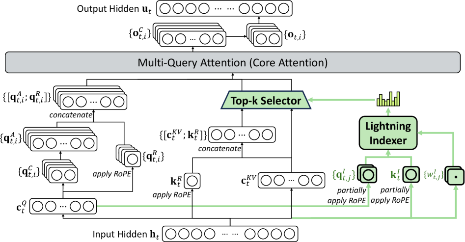
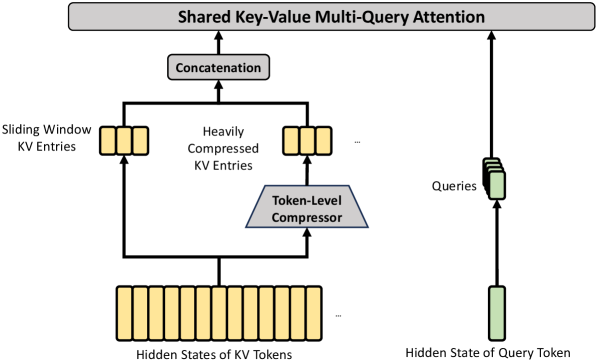

# 05 · sparse 路线（三）：DSA 与 DeepSeek-V4 的 CSA/HCA

> 本篇接续 [`04`](./04_sparse_trainable.md)（NSA 的三分支与 Eq.10 组一致性），并且几乎完全建立在 [`01`](./01_basics_head_sharing.md) §4.5 的 MLA MHA mode 与 MQA mode 之分上。本篇统一记号见 [Attention 机制](./README.md) §2。
>
> NSA 论证过「必须做成 blockwise 才能对齐硬件」，可是一年之后 DeepSeek 自己在出货模型里做了**token 级**的稀疏，而且速度照样不慢。这并不是自我否认，而是把 NSA 真正的洞察——**一个 KV entry 要被尽可能多的 query 共享**——推到了极限：在 MLA 的 MQA mode 下，一个 latent 本来就被**所有** head 共享，于是 token 级的选择自动就满足了访存稀疏，不需要再额外做组内聚合。
>
> 涉及的论文：DeepSeek-V3.2 [arXiv:2512.02556](https://arxiv.org/abs/2512.02556)（这是架构层面可引用的来源）、V3.2-Exp 技术报告（[GitHub PDF](https://github.com/deepseek-ai/DeepSeek-V3.2-Exp/blob/main/DeepSeek_V3_2.pdf)，只发布在 GitHub 上）、以及 DeepSeek-V4 [arXiv:2606.19348](https://arxiv.org/abs/2606.19348)。

---

## 1. 引用来源

先说清楚引用来源的问题：V3.2-**Exp** 本身没有 arXiv entry，它的技术报告只发布在 GitHub 上。架构层面可以引用的来源是 **[arXiv:2512.02556](https://arxiv.org/abs/2512.02556)**，其 §2.1 写道：

> "DeepSeek-V3.2 uses **exactly the same architecture** as DeepSeek-V3.2-Exp… the only architectural modification of DeepSeek-V3.2 is the introduction of **DeepSeek Sparse Attention (DSA)** through continued training."

所以本篇的处理方式是：架构相关内容引用 2512.02556，涉及 Exp 发布语境的内容引用 GitHub PDF。参考实现见 [HF `DeepSeek-V3.2-Exp/inference`](https://huggingface.co/deepseek-ai/DeepSeek-V3.2-Exp/tree/main/inference)。

## 2. DSA 的两个组件



> 图：DSA 在 MLA 之下的实例化（DeepSeek-AI 2025, Fig 2；[arXiv:2512.02556](https://arxiv.org/abs/2512.02556)）。左半边就是 [`01`](./01_basics_head_sharing.md) §4 讲过的原封不动的 MLA（`c_t^Q` → `q^C`/`q^R`，`c_t^KV` + `k_t^R`）。**绿色部分是全部的新东西**：`c_t^Q` 分出一路低秩 indexer query `q^I_{t,j}`，hidden state 分出一路**单头共享**的 indexer key `k^I_t` 和权重 `w^I_{t,j}`，两者算出 index score 送进 Top-k Selector，由 Selector 从 `{[c_t^KV; k_t^R]}` 里挑出 `k` 个交给核心 attention。注意最上面写的是 **Multi-Query Attention (Core Attention)**，不是 MHA。

### 2.1 组件一：lightning indexer

Eq. 1：

$$
I_{t,s} = \sum_{j=1}^{H^I} w^I_{t,j} \cdot \mathrm{ReLU}( q^I_{t,j} \cdot k^I_s )
$$

这里 $H^I$ 是 indexer 的 head 数；$q^I_{t,j} \in \mathbb{R}^{d^I}$ 与 $w^I_{t,j} \in \mathbb{R}$ 由 query 的 hidden state $h_t$ 导出；$k^I_s \in \mathbb{R}^{d^I}$ 则由前文 token 的 hidden state $h_s$ 导出。

这里有三个容易搞错的细节：

第一，**$k^I_s$ 没有 head 下标**，也就是说 indexer key 在所有 indexer head 之间是**共享**的，形式上是 MQA 式的。参考实现里写的是 `self.wk = Linear(self.dim, self.head_dim)`，投影到的是 `head_dim` 而不是 `n_heads * head_dim`。所以 indexer 每个 token 的 cache 是**一个** 128 维向量，而不是 64 个。

第二，打分**用的是 ReLU，而不是 softmax 或 exp**，论文给出的理由是："We choose ReLU as the activation function **for throughput consideration**." ReLU 让整个打分变成「ReLU 门控的点积加权和」的形式，可以干净地映射成一次 fused FP8 GEMM。需要注意的是，$I_{t,s} \geq 0$ 只有在 $w^I_{t,j} \geq 0$ 时才成立，而权重本身是自由的 `Linear(dim, n_heads)`，并没有被强制约束为非负。

第三是精度，用的是 **FP8**："Given that the lightning indexer has a small number of heads and can be implemented in FP8, its computational efficiency is remarkable." 代码里 indexer key cache 存成 `torch.float8_e4m3fn`，再配一个独立的 FP32 scale cache。

### 2.2 组件二：fine-grained token selection

Eq. 2：

$$
u_t = \mathrm{Attn}( h_t,\ \{ c_s \mid I_{t,s} \in \operatorname{Top-k}( I_{t,:} ) \} )
$$

**这里做的是 token 级选择，不是块级选择**，这正是它与 NSA 的核心分野。DeepSeek 自己的说法是 DSA "achieves fine-grained sparse attention **for the first time**"。

```python
def lightning_indexer(h, W, causal_mask):
    """h: [B, T, d]。返回 index scores I: [B, T, T]。
    注意 k^I 是单头共享的（MQA 式），这是 DSA 能做 token 级选择还不亏访存的关键。"""
    B, T, _ = h.shape
    qI = (h @ W['wq'].T).view(B, T, W['HI'], W['dI'])        # [B,T,H^I,d^I]  per-head
    kI = h @ W['wk'].T                                        # [B,T,d^I]      ← 无 head 维！
    wI = h @ W['ww'].T                                        # [B,T,H^I]
    I = torch.einsum('bthd,bsd->bths', qI, kI).relu()         # ReLU(q^I_{t,j} · k^I_s)
    I = torch.einsum('bths,bth->bts', I, wI)                  # Σ_j w_{t,j} · (·)
    return I.masked_fill(causal_mask, float('-inf'))

def dsa_select(I, topk):
    return I.topk(min(topk, I.shape[-1]), dim=-1).indices     # [B, T, k]  token 级索引

# 实测（H^I=4, d^I=16, T=96）：
#   kI shape = (1, 96, 16)  ⇒ 每 token 只缓存 d^I = 16 个数，而不是 H^I·d^I = 64  ✓
#   top-k 是 token 级：32 of 96  ⇒ 核心 attention 复杂度 O(L·k) 而非 O(L²)      ✓
```

### 2.3 配置

下表数据来自官方参考实现。

| 参数 | 值 |
|---|---|
| `index_n_heads` ($H^I$) | **64** |
| `index_head_dim` ($d^I$) | **128** |
| `index_topk` ($k$) | **2048** |
| indexer key cache dtype | `float8_e4m3fn` |
| indexer query 来源 | MLA 的 `q_lora_rank` latent（$c_t^Q$） |
| indexer 里的 RoPE | 施加于前 `qk_rope_head_dim = 64` 维 |
| key 归一化 | `LayerNorm(head_dim)` |
| scaling | `softmax_scale = head_dim^{-0.5}`；权重再乘 `n_heads^{-0.5}` |

> 这里说的「few heads」其实是相对**成本**而言的，不是相对数量：indexer 本身有 64 个 head、每个 128 维，但因为配上了**单个共享 key** 加 FP8，per-token 的 indexer FLOPs 和 cache 都比 MLA 小得多。
>
> ⚠️ repo 里明确记录了一个实现陷阱，值得写进脚注提醒读者：**indexer 的 RoPE 要用 non-interleaved 布局，而 MLA 的 RoPE 要用 interleaved 布局**（[`02`](./02_position_and_stability.md) §2）。2025-11-17 之前的 demo 代码把这两者搞混了，导致了**静默降质**。

## 3. MQA mode 与 token 级选择

DSA 为什么能在 token 级选择上也拿到加速？答案是它实例化在 **MLA 的 MQA mode** 上，原文写道：

> "each latent vector (the key-value entry of MLA) will be **shared across all query heads** of the query token."

这样做的理由直接回指了 NSA：

> "At the kernel level, **each key-value entry must be shared across multiple queries for computational efficiency** (Yuan et al., 2025)."

**这正是 NSA Eq.10 的极限形式。** 把三者放在一起对比就能看清这条脉络：

```
GQA + per-head 独立选择（Quest）
    → 要搬的字节 = 组内 g 个 head 选择的【并集】 → 计算稀疏，访存不稀疏 ✗

GQA + 组内分数求和强制一致（NSA Eq.10）
    → 一组共用一份块列表 → 访存稀疏 = 计算稀疏 ✓   代价：必须块级，粒度粗

MQA mode of MLA + per-query token 级选择（DSA）
    → 一个 latent 被【所有】head 共享 → 天然满足，无需任何聚合 ✓✓
    → 于是可以放开做 token 级，粒度最细
```

> [Attention 机制](./README.md) §4 提到的那句话——「真正重要的不是 contiguity，而是一个 KV entry 被多少 query 共享」——在这里得到了完整的论据支撑。NSA 的 blockwise 只是它在 GQA 约束下达到共享的**路径**，并不是目的本身。MLA 的 MQA mode 提供了另一条路径，而且更彻底，所以 DSA 才能放弃 blockwise。这也解释了为什么 DSA 只能长在 MLA 上：**GQA 模型做不到这一手**。

短序列还有一个特例处理："for short-sequence prefilling, we specially implement a **masked MHA mode** to simulate DSA, which can achieve higher efficiency under short-context conditions." 这其实又是 [`01`](./01_basics_head_sharing.md) §4.5 提到的「按阶段换算法」这个模式，只是这次多了一档选择。

## 4. 两阶段训练

DSA 训练用的基座是 DeepSeek-V3.1-Terminus（已经扩到 128K 长度）。

### 阶段一：dense warm-up

这一阶段保持 attention 完全稠密，**冻结除 indexer 之外的一切参数**。目标分布是这样构造出来的：把 query $t$ 的 main attention score 跨所有 head 求和，再沿序列维做 L1 归一化，得到 $p_{t,:} \in \mathbb{R}^t$。对应的损失是（Eq. 3）：

$$
L^I = \sum_t D_{\mathrm{KL}}( p_{t,:} \,\|\, \mathrm{Softmax}( I_{t,:} ) )
$$

`lr = 1e-3`，1000 步，每步 16 序列 × 128K = **2.1B tokens**。

### 阶段二：sparse training

这一阶段打开 top-$k$ 选择，并解冻全部参数。KL 散度只在选中集合 $S = \{ s \mid I_{t,s} \in \operatorname{Top-k} \}$ 上计算（Eq. 4）：

$$
L^I = \sum_t D_{\mathrm{KL}}( p_{t,S} \,\|\, \mathrm{Softmax}( I_{t,S} ) )
$$

`lr = 7.3e-6`，`k = 2048`，15000 步，每步 480 序列 × 128K = **943.7B tokens**。

```python
def indexer_kl_loss(I, attn_probs_all_heads, sel_idx=None):
    """I: [B,T,T] indexer logits。attn_probs_all_heads: [B,T,H,T] 主 attention 概率。
    sel_idx: [B,T,k] 阶段二的选中集合；None 表示阶段一（全序列）。"""
    p = attn_probs_all_heads.sum(2)                       # 跨 head 求和
    p = p / p.sum(-1, keepdim=True).clamp_min(1e-30)      # L1 归一化 -> 目标分布
    if sel_idx is not None:                               # 阶段二：只在选中集合上算
        p, I = p.gather(-1, sel_idx), I.gather(-1, sel_idx)
        p = p / p.sum(-1, keepdim=True).clamp_min(1e-30)
    logq = I.log_softmax(-1)
    return (p * (p.clamp_min(1e-30).log() - logq)).nan_to_num(0).sum(-1).mean()
```

### 梯度断开

这是整篇最有架构意味的一句话，值得直接引用原文：

> "we **detach the indexer input from the computational graph** for separate optimization. The training signal of the indexer is from **only $L^I$**, while the optimization of the main model is according to **only the language modeling loss**."

**DSA 并不是 NSA 意义上的端到端可微。** 它其实是两个**互相解耦的优化问题**，靠一个蒸馏目标粘合在一起：indexer 是一个模仿 dense attention 的 student，主模型**从来不向 router 传递梯度**。

对比一下 [`04`](./04_sparse_trainable.md) §6.2 里的 NSA：那里 top-$n$ 也是不可微的，但梯度会通过压缩分支流到 $\phi$，而 $\phi$ 正是产生分数的模块，所以选择策略是被 LM loss **间接**塑造的。DSA 则把这条间接路径也彻底切断了。

```
router 能否收到 LM loss 的梯度？
  NSA           ✓  间接（经压缩分支的 φ）
  SeerAttention ✗  auxiliary loss
  MoBA          ✗  无参数
  DSA           ✗  显式 detach，纯 KL 蒸馏
```

> 这个领域相当意外地从 NSA 的端到端论点上退了回来，却完整继承了 NSA 的硬件洞察。NSA 给出的论据是量化的（top-20% 只覆盖了 70% 的 attention 质量，dense 预训练出来的 retrieval head 经不起事后剪枝）；DSA 的反驳则是纯经验性的（KL 蒸馏加约 946B token 的适配就能打平质量），而且它换来了一个巨大的实际好处：**可以直接继承一个 frontier checkpoint，不需要从头预训练**。这两种论证其实都成立，只是回答的不是同一个问题。

两个阶段用的数据分布都"totally aligned"于 V3.1-Terminus 的 128K 长上下文扩展数据，这是刻意的设计，目的是让两个模型可以正面对比。

## 5. 成本与收益

先说复杂度：核心 attention 从 $O(L^2)$ 降到了 $O(Lk)$，$k \ll L$。**但 indexer 本身仍然是 $O(L^2)$**，只是"requires much less computation compared with MLA in DeepSeek-V3.1-Terminus"，也就是说计算量小很多但阶数没变。⚠️ 这里有一个边界不能含糊：**DSA 并没有让 attention 整体变成次二次复杂度**，它做的事情是把**贵的那一项**变成线性，剩下一个相对便宜的二次项。

成本曲线方面，Fig 3 按实际 H800 部署（每 GPU-hour \$2）画出了 per-token 成本随位置变化的曲线，并把 prefill 和 decode 分开展示。API 侧的直接体现是降价："API prices cut by 50%+, effective immediately"（2025-09-29），而 685B 的 MoE backbone 本身没有变化。

质量方面需要说清楚的是：这次的效果是**平权，而不是提升**——各项 benchmark 与 V3.1-Terminus 基本持平；ChatbotArena Elo 分数 "closely matched"；AA-LCR 上 reasoning mode 高出 **4 分**；Fiction.liveBench 上表现更稳定。整体定位是 **no regression**，也就是「不掉分地把成本降下来」。

kernel 已经开源：indexer logit kernel（含 paged 版本）在 DeepGEMM 的 PR #200 里；sparse attention kernel 在 FlashMLA 的 PR #98 里，并提供了 CUDA 实现。详见 [05 · Flash Sparse Attention](../fa/05_flash_sparse_attention.md) §4。

## 6. DeepSeek-V4：先压缩，再选择

DeepSeek-V4（[arXiv:2606.19348](https://arxiv.org/abs/2606.19348)）一共发布了两个模型：V4-Pro **1.6T total / 49B active**、V4-Flash **284B / 13B**，两者都支持 **1M** 上下文。这一代里**原来的 MLA 被替换成了两种 attention 逐层交替的结构**。

### 6.1 CSA（Compressed Sparse Attention）

CSA 的结构可以概括为「先压缩，再做 DSA」。


> 图：CSA 的核心结构（DeepSeek-AI 2026, Fig 3；[arXiv:2606.19348](https://arxiv.org/abs/2606.19348)）。和上面 DSA 那张图对比一下，差别一目了然：**多了一层 Token-Level Compressor**，而且**Lightning Indexer 是在压缩后的序列上工作的**（图中虚线框里的 Compressed Indexer Keys）。左侧那一路 Sliding Window KV Entries 是一个必需的补丁，原因是严格因果约束下 query 看不到自己所在压缩块里的其他 token。顶部仍然标注的是 **Shared Key-Value Multi-Query Attention**，说明 MQA 这条约束贯穿了 DSA 和 CSA 两代设计。

压缩用的不是 NSA 里的 MLP $\phi$，而是**学出来的门控池化**（Eq. 11–12）：对 $m$ 个连续 entry，用压缩权重加上可学习位置偏置做 row-wise softmax，再加权求和：

$$
c_i^{\mathrm{Comp}} = \sum \alpha \odot k, \qquad \alpha = \mathrm{Softmax}_{\mathrm{row}}( w + b )
$$

而且**压缩窗口是重叠的**（entry $i$ 会取用 $2m$ 个原始 entry，与 entry $i-1$ 的窗口有重叠），有效序列缩减率是 $1/m$，这和 NSA 里 $d < l$ 的设计是同一个反碎片化直觉。

接下来，indexer 跑在**已经压缩过的序列**上（Eq. 13–17），indexer query 走的是低秩投影 $c_t^{IQ} = h_t W^{IDQ}$，打分形式仍然是 ReLU：

$$
\begin{aligned}
I_{t,i} &= \sum_{j=1}^{H^I} w_{t,j} \cdot \mathrm{ReLU}( q^I_{t,j} \cdot k^{I,\mathrm{Comp}}_i ) \\
C_t^{\mathrm{SprsComp}} &= \{ c_i^{\mathrm{Comp}} \mid i \in \operatorname{Top-k}( I_{t,:} ) \}
\end{aligned}
$$

**这一步之所以关键**，是因为 [`04`](./04_sparse_trainable.md) §7 的算术已经说明：长上下文下 NSA 的 decode 流量被**压缩分支**主导（64k 长度时是 4095，远大于选择分支的 1024），原因是压缩分支是唯一一个仍随 $L$ 线性增长的部分。CSA 把压缩从「并行的一条分支」改成了「串行的前置步骤」，这样一来**indexer 只需要在长度为 $L/m$ 的序列上打分**，这一项的开销也就随之降下来了。

核心 attention 做的是 shared-KV MQA，作用在选中的压缩 entry 上，外加一个 **grouped output projection**（把 $n_h$ 个 head 分成 $n_g$ 组，先映射到中间维 $d_o$，再映射到最终维度），这是因为 $n_h$ 本身很大。

### 6.2 HCA（Heavily Compressed Attention）

HCA 的压缩率更高，但不做选择。



> 图：HCA（DeepSeek-AI 2026, Fig 4；[arXiv:2606.19348](https://arxiv.org/abs/2606.19348)）。和 CSA 那张图相比，**唯一的结构差别是中间少了整个 Lightning Indexer + Top-k Selector 虚线框**。这背后的逻辑很直接：压缩率取到 `m' = 128` 之后，压缩序列已经足够短，做稀疏选择省下的开销已经不值得再付出一个 indexer 的成本，所以干脆稠密地看全部压缩序列。同样保留了 Sliding Window 分支。

```
CSA:  m  = 4    重叠      + top-k 选择（Pro 1024 / Flash 512）
HCA:  m' = 128  不重叠    + 完全稠密（不选）
```

### 6.3 两者共享的补丁

CSA 和 HCA 共享几个补丁性的设计。第一是 **RMSNorm**，施加在 query 和压缩后的 KV entry 上，在进入核心 attention 之前完成。第二是 **partial RoPE 施加在最后 64 维**，并且*额外*对输出 $o_{t,i}$ 施加了一次位置 $-t$ 的 RoPE：因为 KV entry 同时充当 value，绝对位置会从 value 路径泄漏出去，反旋一次正好把它转回相对位置（[`02`](./02_position_and_stability.md) §3.3）。第三是 **新增了一路未压缩的 sliding-window 分支**（覆盖最近 `w_win` 个 token），理由很具体：严格因果约束下，**query 看不到自己所在压缩块里的其他 token**，这一路分支正好把这部分信息补回来。

此外还有第四点，**attention sink**（Eq. 27），用 per-head 可学习的 $l'_h$，同时引用了 OpenAI 2025 和 Xiao et al. 2024 的工作：

$$
a_{h,t,s} = \frac{\exp(l_{h,t,s})}{\sum_{s'} \exp(l_{h,t,s'}) + \exp(l'_h)}
$$

这相当于**GPT-OSS 的 learned sink 被 DeepSeek 直接采纳了**（[`02`](./02_position_and_stability.md) §5.5）。

### 6.4 配置

| | V4-Flash | V4-Pro |
|---|---|---|
| 层数 / hidden | 43 / 4096 | 61 / 7168 |
| 前两层 | 纯 sliding-window attention | HCA |
| 其余层 | CSA 与 HCA 交替 | CSA 与 HCA 交替 |
| CSA 压缩率 $m$ | 4 | 4 |
| CSA top-$k$ | **512** | **1024** |
| HCA 压缩率 $m'$ | **128** | **128** |
| indexer query head / head dim | 64 / 128 | 64 / 128 |
| core query head $n_h$ / head dim | 64 / 512 | 128 / 512 |
| query 压缩维 | 1024 | 1536 |
| output projection 组数 / 中间维 | 8 / 1024 | 16 / 1024 |
| sliding window `w_win` | **128** | **128** |

效率方面：RoPE 维用 BF16、其余部分用 FP8，KV cache 因此约减半；**indexer 更进一步用了 FP4**；top-$k$ 也比 V3.2 更小，用来照顾中短上下文的效率。相对 BF16 GQA-8 head-dim-128 的基线，1M 上下文下 KV cache 能降到 **约 2%**。

稀疏训练的课程安排是：序列长度依次从 4K 到 16K、64K，最后到 1M；**前 1T tokens 做稠密 attention 的 warm-up**；到 64K 阶段才引入稀疏；而在切到全稀疏训练之前，还会先做一小段 lightning indexer 的 warm-up。这套流程**和 V3.2 是同一套两阶段哲学，只是把它从 continued training 阶段挪进了预训练阶段**。

## 7. 路线回顾

```
NSA (2025-02)              块级选择 · 三分支【并行】· 每分支独立 K/V · 从头预训练 · GQA + Eq.10 组一致
      │
      │  放弃 end-to-end，换来「继承 frontier checkpoint」
      ▼
DSA (2025-09)              token 级选择 · 单 indexer · KL 蒸馏到 dense checkpoint · MQA-mode MLA
      │                    ↑ 三分支里只剩 selection；compression 消失、sliding window 暂时消失
      │  压缩从「并行一路」变成「串行前置」，共享一套 K/V
      ▼
CSA/HCA (2026-04)          先压缩(m=4) 再在压缩序列上 top-k · 外加 HCA(m'=128, 稠密) 逐层交替
                           · sliding window 分支回归 · GPT-OSS 式 learned sink · FP4 indexer
```

值得留意的是，NSA 里 compression 和 selection 这两个分支是**并行**的，各自拥有独立的 K/V；到了 CSA，它们变成了**串行**流水线，共用一套 K/V。而 NSA 的 sliding-window 分支在两代 DSA 系设计里都以「辅助分支」的形式存活了下来——因为它解决的是一个结构性问题（当前块内的可见性缺失），而不是一个可选的优化项。

## 8. 小结

| | NSA | DSA | CSA / HCA |
|---|---|---|---|
| 选择粒度 | block（$l'=64$） | **token** | compressed entry |
| 打分器 | 复用压缩分支 softmax | **lightning indexer**（ReLU, FP8, 单头 key） | 同 DSA 但在压缩序列上（FP4） |
| router 梯度 | 间接（经 $\phi$） | **显式 detach + KL 蒸馏** | 同 DSA |
| 共享约束 | GQA 组一致（Eq.10） | **MQA mode**（全 head 共享） | MQA mode |
| 训练 | 原生预训练 260/270B | 蒸馏 2.1B + 稀疏 943.7B | 1T dense warm-up 后转稀疏 |
| 稠密的那一半 | —— | —— | **HCA**（$m'=128$ 但不选） |
| 是否出货 | 27B 测试模型 | **V3.2，降价 50%+** | **V4-Pro/Flash，1M @ ≈2% KV cache** |

**走完这条路线之后，sparse attention 的形态基本上定型了**：一个便宜的、独立训练的打分器，加上一个把 KV entry 共享给所有 query 的核心 attention，再加上若干必须保留的静态 prior（sink、local window）。剩下的优化空间在打分器的精度上（FP8 到 FP4）、在复用上（比如 GLM-5.2 的 IndexShare：indexer 每 4 层跑一次、后 3 层复用它的 top-k 结果，1M 长度下 indexer 算子减少约 2.9 倍），以及在压缩率上。

**但这条路线始终没有解决一件事**：稀疏 attention 的 KV cache 仍然随 $L$ 线性增长，因为要留着供打分使用，而且它的表达力上限就是 full attention——本质上它只做信息选择，不改变上限。**另一条路线则彻底放弃了「保留全部历史」这个前提。**

---

下一篇：[06 · linear 路线（一）：kernel trick、RNN 等价与三种计算形式](./06_linear_foundation.md) —— 进入 linear 路线。从 kernel trick 和「linear attention 就是 RNN」讲起，依次介绍 parallel、recurrent、chunkwise 三种计算形式，这是后面四篇的基础。
