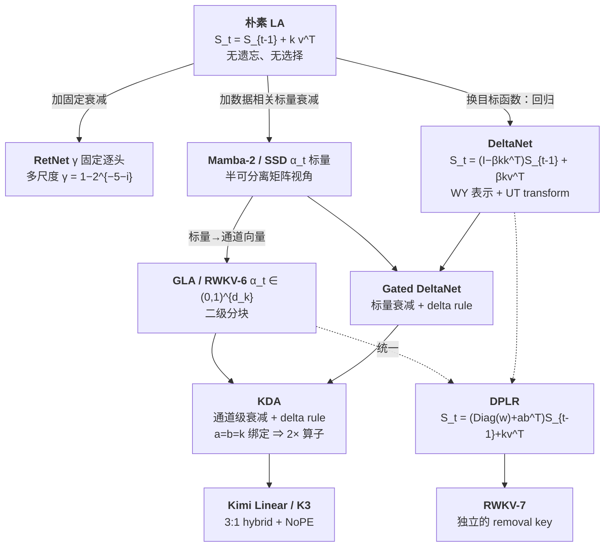

# 06 · linear 路线（一）：kernel trick、RNN 等价与三种计算形式

> 本篇是 linear attention 路线的第一篇，回答三个问题。第一，`softmax` 里的 `exp` 一旦换成可分解的核，$O(L^2)$ 的计算如何变成 $O(L)$，以及模型为什么自动变成一个 RNN。第二，parallel / recurrent / chunkwise 三种计算形式各自的公式与复杂度——其中 chunkwise 是后面所有实现采用的形态。第三，朴素 linear attention 为什么不如 softmax，从而为 [`07`](./07_linear_decay_gating.md) 和 [`08`](./08_linear_delta_rule.md) 中的每一项改进提供动机。
>
> **前置**：矩阵乘法结合律；会写 softmax attention。统一记号见 [Attention 机制](./README.md) §2（**本篇起全部使用列向量约定**，与原论文的行向量约定互为转置，注意事项见该节）。
>
> 论文：Katharopoulos et al., *Transformers are RNNs* [arXiv:2006.16236](https://arxiv.org/abs/2006.16236)（ICML 2020）；chunkwise 形式与 "flash linear attention" 一词出自 GLA [arXiv:2312.06635](https://arxiv.org/abs/2312.06635)。

---

## 1. kernel trick：唯一的约束是非负

把 attention 写成广义形式（原文 Eq. 3）：

$$
V'_i = \frac{\sum_j \mathrm{sim}(Q_i, K_j)\, V_j}{\sum_j \mathrm{sim}(Q_i, K_j)}
$$

当 $\mathrm{sim}(q, k) = \exp(q^{\top} k / \sqrt{D})$ 时就是 softmax attention。对 $\mathrm{sim}$ 的唯一约束是它非负（否则归一化会出问题），因此任何非负核 $k(x, y): \mathbb{R}^{2 \times F} \to \mathbb{R}_{+}$ 都是合法的。给定特征映射 $\phi$，取 $\mathrm{sim}(q, k) = \phi(q)^{\top} \phi(k)$（Eq. 4）：

$$
V'_i = \frac{\phi(Q_i)^{\top} \sum_j \phi(K_j) V_j^{\top}}{\phi(Q_i)^{\top} \sum_j \phi(K_j)}
$$

关键的一步只有一处（Eq. 5–6）：利用结合律重排计算顺序。

$$
\underbrace{(\phi(Q)\, \phi(K)^{\top})\, V}_{\text{compute } [L, L] \text{ first}} \;\Longleftrightarrow\; \underbrace{\phi(Q)\, (\phi(K)^{\top}\, V)}_{\text{compute } [C, M] \text{ first, independent of } L}
$$

左式必须物化 $L \times L$ 的矩阵；右式先把 $K$ 和 $V$ 缩并成一个 $C \times M$ 的小矩阵。从 $O(L^2)$ 降到 $O(L)$ 的全部变化就在这一步。

复杂度（原文 §3.2.1）：

| 形式 | 乘加次数 |
|---|---|
| softmax attention | $O(L^2 \max(D, M))$ |
| 通用 $\phi$（特征维 $C$） | $O(LCM)$ |
| 2 次多项式核（精确有限维） | $O(LD^2M)$，$L > D^2$ 时有利 |
| $\phi(x) = \mathrm{elu}(x) + 1$（原文选择） | $O(LDM)$ |

原文选用 `elu` 而非 `relu`（Eq. 7）：`relu` 在 $x < 0$ 时梯度为 0，而 $\mathrm{elu}(x) + 1$ 处处可导且保持非负。

> 现代实现（GLA / GDN / KDA）不再使用 $\phi$，也不使用归一化项。它们直接用 $q, k$ 本身（配 L2 归一化），并在输出侧接 RMSNorm。原因见 §4：归一化项 $1 / (\phi(q)^{\top} z)$ 在长序列下会趋近 0、数值不稳定，而 RMSNorm 更省心也更有效。因此 $\phi$ 在今天只有历史意义，但结合律重排这个核心始终没有变。

## 2. linear attention 就是 RNN

因果版本（Eq. 8–12）把上面的求和变成前缀和：

$$
\begin{aligned}
S_i &= \sum_{j \le i} \phi(K_j) V_j^{\top} \in \mathbb{R}^{C \times M}, & Z_i &= \sum_{j \le i} \phi(K_j) \in \mathbb{R}^{C} \\
V'_i &= \phi(Q_i)^{\top} S_i \,/\, (\phi(Q_i)^{\top} Z_i)
\end{aligned}
$$

前缀和可以增量维护，由此得到完整的 RNN 形式（Eq. 16–20，原文逐字）：

$$
\begin{aligned}
s_0 &= 0,\quad z_0 = 0 \\
s_i &= s_{i-1} + \phi(x_i W_K)\, (x_i W_V)^{\top} & &\text{attention memory},\ s \in \mathbb{R}^{C \times M} \\
z_i &= z_{i-1} + \phi(x_i W_K) & &\text{normalizer memory},\ z \in \mathbb{R}^{C} \\
y_i &= f_l\big( \phi(x_i W_Q)^{\top} s_i \,/\, (\phi(x_i W_Q)^{\top} z_i) + x_i \big)
\end{aligned}
$$

这里的状态是 $O(1)$ 的，与序列长度完全无关。原文的这句话值得记住：

> "any transformer layer with causal masking can be written as a model that, given an input, modifies an internal state and then predicts an output, namely a **Recurrent Neural Network**. Note that, in contrast to Universal Transformers, we consider the recurrence with respect to **time** and not depth."

用本章的记号（去掉 $\phi$ 和归一化项，即现代形态）：

$$
\begin{aligned}
S_t &= S_{t-1} + k_t v_t^{\top}, \qquad S_t \in \mathbb{R}^{d_k \times d_v} \\
o_t &= S_t^{\top} q_t
\end{aligned}
$$

这个 $S_t$ 就是所谓的「fast weight」：一个在推理时被在线更新的线性层。这个视角是 [`08`](./08_linear_delta_rule.md) 的全部基础。

### 反向的前缀/后缀和结构

朴素实现要存所有 $S_i$，内存放大 $\max(D, M)$ 倍。原文 Eq. 13–15 给出前缀和形式：

$$
\begin{aligned}
\nabla_{\phi(Q_i)} L &= \nabla_{\bar{V}_i} L \cdot \Big( \sum_{j \le i} \phi(K_j) V_j^{\top} \Big)^{\top} \\
\nabla_{\phi(K_i)} L &= \Big( \sum_{j \ge i} \phi(Q_j) (\nabla_{\bar{V}_j} L)^{\top} \Big)\, V_i \\
\nabla_{V_i} L &= \Big( \sum_{j \ge i} \phi(Q_j) (\nabla_{\bar{V}_j} L)^{\top} \Big)^{\top} \phi(K_i)
\end{aligned}
$$

第一行对应 $Q$ 的梯度，是前缀和；后两行对应 $K$ / $V$ 的梯度，是后缀和。前向是前缀和，反向是后缀和——这个对称性在所有 chunkwise kernel 的 backward 里都能看到（`fla` 里就是 `chunk_bwd_kernel_dh` 的 `for i_t in range(NT-1, -1, -1)`，见 [06 · Flash Linear Attention](../fa/06_flash_linear_attention.md) §7）。这与 [01 · IO-awareness、online softmax 与 tiling](../fa/01_io_awareness_online_softmax.md) §5 中 FA backward「固定 KV 块、循环 Q 块」的方向反转是同一件事。

## 3. 三种计算形式：数学等价，效率不同

同一个递归有三种算法，它们给出逐位相同的结果（下面每一对都在 `float64` 下验证过）。

### 3.1 Parallel（二次）

$$
O = ((QK^{\top}) \odot M)\, V
$$

（$M$ 是因果下三角掩码。）

```python
def la_parallel(q, k, v, scale):
    """q,k,v: [B,T,H,D] -> [B,T,H,D]"""
    q, k, v = (x.transpose(1, 2) for x in (q, k, v))          # [B,H,T,D]
    A = ((q * scale) @ k.transpose(-1, -2)).tril()             # [B,H,T,T]  ← 物化了 L×L
    return (A @ v).transpose(1, 2)
```

复杂度为 $O(L^2 d)$ FLOPs、$O(L^2)$ 内存。它全序列并行、全部是 matmul（对 tensor core 友好），但复杂度没有降低。

### 3.2 Recurrent（线性）

```python
def la_recurrent(q, k, v, scale):
    B, T, H, K = q.shape
    S = q.new_zeros(B, H, K, v.shape[-1])
    o = torch.zeros_like(v)
    for t in range(T):
        S = S + k[:, t].unsqueeze(-1) * v[:, t].unsqueeze(-2)          # S += k v^T
        o[:, t] = torch.einsum('bhk,bhkv->bhv', q[:, t] * scale, S)    # o = S^T q
    return o
```

复杂度为 $O(Ld^2)$ FLOPs、$O(d^2)$ 内存。它的 FLOPs 最少，但训练时最慢。GLA 论文 §3.2 说得很直白：

> "while the recurrent form generally has the **lowest total FLOPs** among the three forms, **this does not translate to actual wall-time efficiency**"

原因有两个。第一，$S = S \cdot \alpha + k v^{\top}$ 是 elementwise 的外积累加，无法使用 tensor core（A100 上半精度 matmul 在 tensor core 上比在 CUDA core 上快约 16 倍）。第二，朴素实现要把每步的 2D hidden state 写入 HBM，"resulting in high I/O cost"。

### 3.3 Chunkwise：现代实现采用的形式

这一节是本章的重点。把序列切成 $L / C$ 个 chunk，用 $S_{[i]}$ 表示处理完前 $i$ 个 chunk 后的状态，$Q_{[i]} \in \mathbb{R}^{C \times d}$ 表示第 $i$ 个 chunk 的 query 块。

**inter-chunk 递归：**

$$
S_{[i+1]} = S_{[i]} + K_{[i]}^{\top} V_{[i]} \in \mathbb{R}^{d_k \times d_v}
$$

**intra-chunk 并行输出：**

$$
O_{[i]} = \underbrace{Q_{[i]}\, S_{[i]}}_{\text{inter-chunk}} \;+\; \underbrace{((Q_{[i]} K_{[i]}^{\top}) \odot M)\, V_{[i]}}_{\text{intra-chunk (quadratic, in-block)}}
$$

```python
def la_chunk(q, k, v, scale, C):
    B, T, H, K = q.shape
    V, NT = v.shape[-1], T // C
    qc, kc, vc = (x.transpose(1, 2).reshape(B, H, NT, C, -1) for x in (q, k, v))
    S = q.new_zeros(B, H, K, V)
    o = torch.zeros_like(vc)
    M = torch.ones(C, C, dtype=torch.bool, device=q.device).tril()
    for n in range(NT):
        qi, ki, vi = qc[:, :, n] * scale, kc[:, :, n], vc[:, :, n]
        intra = ((qi @ ki.transpose(-1, -2)) * M) @ vi      # 块内二次，C×C 放得进 SRAM
        inter = qi @ S                                       # 块外用累积状态，一次 matmul
        o[:, :, n] = inter + intra
        S = S + ki.transpose(-1, -2) @ vi                    # 更新状态（注意在输出【之后】）
    return o.reshape(B, H, T, V).transpose(1, 2)

# 实测（float64, C=16）：
#   rel_err(la_parallel,  la_recurrent) = 3.7e-16
#   rel_err(la_chunk,     la_recurrent) = 3.3e-16    ← 三者数学恒等 ✓
```

**复杂度推导**：

$$
\begin{aligned}
\text{intra-chunk}:\quad & O(C^2 d + C d^2) & &\text{per chunk} \\
\text{inter-chunk}:\quad & O(C d^2) & &\text{per chunk} \\
\text{total}:\quad & O\big( (L/C)(C^2 d + C d^2) \big) = O(LCd + Ld^2)
\end{aligned}
$$

当 $L > d$ 时总复杂度小于 parallel 的 $O(L^2 d)$。$C$ 可以看作一个插值参数：$C = L$ 时恢复 parallel form，$C = 1$ 时恢复 recurrent form。实践中取 $C = 64$——既是 16 的倍数（对 tensor core 友好），$C^2 = 4096$ 又放得进 SRAM。

chunkwise 能同时获得两种形式各自的好处：绝大部分计算是三个 $C \times C$ / $C \times d$ / $d \times d$ 的 matmul（可以使用 tensor core），而状态只在 chunk 边界上串行推进（$L / C$ 次而非 $L$ 次）。

> **注意 $S$ 的更新在输出之后。** $o$ 用的是 $S_{[i]}$（进入本 chunk 时的状态），本 chunk 内部的贡献由 intra 项负责。这个「先读后写」的顺序在 kernel 里也一模一样（`fla` 的 `chunk_fwd_kernel_h` 是 store-before-update，见 [06 · Flash Linear Attention](../fa/06_flash_linear_attention.md) §2）。写错了不会报错，只会静默算成 off-by-one-chunk。

### 三种形式的对照

| 形式 | 公式 | 训练复杂度 | 序列并行 | tensor core | 用在哪 |
|---|---|---|---|---|---|
| **Parallel** | $((QK^{\top}) \odot M)\, V$ | $O(L^2 d)$ | 全并行 | ✓ | 教学/短序列；DeltaNet 的完全并行式还要 $L \times L$ 求逆，不实用 |
| **Recurrent** | $S_t = S_{t-1} + k_t v_t^{\top}$ | $O(Ld^2)$ | 无 | ✗ | **decode**（`fla` 的 `fused_recurrent_*`） |
| **Chunkwise** | 见上 | $O(LCd + Ld^2)$ | chunk 间可并行 | ✓ | **训练 + prefill**（`fla` 的 `chunk_*`） |

`fla` 的公开 API 就是按这个划分的，layer 在运行时切换（[[fla:fla/layers/kda.py#L212]]）：训练走 `chunk`，短序列推理走 `fused_recurrent`。

### 3.4 FlashLinearAttention：materialization 两种策略

GLA §3.3 给出 Algorithm 1，"flash linear attention" 这个名字就出自这里。它基于三条硬件原则（§3.1）。第一是 occupancy：大规模训练时 batch 较小，必须沿时间维并行才能填满 SM。第二是 specialized compute units：chunk size 设成 16 的倍数以利用 tensor core。第三是 memory hierarchy：用 tiling 减少 HBM I/O。

两个版本：

```python
# ---- Non-materialization：省内存，但没有序列级并行 ----
S = zeros(d, d)                              # 常驻 SRAM
for n in range(NT):
    load Q[n], K[n], V[n] from HBM -> SRAM
    O[n] = Q[n] @ S + (Q[n] @ K[n].T * M) @ V[n]     # 先用旧状态
    S    = S + K[n].T @ V[n]                          # 再更新
    store O[n] to HBM
# 并行维度：batch × heads × head_dim。batch 大时够用。

# ---- Materialization：有序列级并行，多 10–20% 显存 ----
for n in range(NT):                          # Pass 1: 串行扫描，落盘所有 chunk 状态
    store S to HBM as S[n]
    S = S + K[n].T @ V[n]
parfor n in range(NT):                       # Pass 2: 全 chunk 完全并行
    O[n] = Q[n] @ S[n] + (Q[n] @ K[n].T * M) @ V[n]
```

原文对 materialization 的评价与选择：

> "first performs the inter-chunk recurrence and stores all `S[n]` … Then, the `O[n]`'s can be computed in parallel for all chunks. This approach offers better parallelism but **increases the memory footprint by approximately 10-20%**. We mitigate this through **recomputation**, where the hidden states discarded after the forward pass and recomputed during the backward pass… **we adopt this strategy by default**."

这与 FlashAttention 的 recomputation 在 linear attention 中的对应做法完全一致（[01 · IO-awareness、online softmax 与 tiling](../fa/01_io_awareness_online_softmax.md) §5）：forward 丢弃 $O(Ld^2 / C)$ 的中间状态，backward 重算，用算力换显存。

I/O 优化的关键一句（对应 kernel 里那个共享 `b_q` 的循环）：

> "when `Q[n]` is loaded to SRAM, both `Q[n]S` and `(Q[n]K⊤[n] ⊙ M)V[n]` can be computed on chip, which **avoids loading `Q[n]` twice**, thus saving HBM I/O."

HBM 流量分析（我按 kernel 结构推导，论文只给了 FLOPs 复杂度和定性论述）：

| kernel | 读 | 写 |
|---|---|---|
| inter-chunk 状态递归 | $K, V$：$2Ld$ | $h$：$(L/C)\, d^2 = Ld^2 / C$ |
| 输出 kernel | $Q, K, V, h$：$O(Ld + Ld^2 / C)$ | $O$：$Ld$ |
| 合计 | **$O(Ld + Ld^2 / C)$** | |

对比 recurrent form 物化每步状态的 $O(Ld^2)$，状态那一项降了 $C$ 倍（$C = 64$ 时 64 倍）。

## 4. 朴素 linear attention 的五个缺陷

本节列出五条理由，每一条都对应后面的一个改进。**这一节是 [`07`](./07_linear_decay_gating.md) 和 [`08`](./08_linear_delta_rule.md) 存在的全部理由。**

### (1) 没有衰减 / 没有遗忘

GLA 原文：

> "The linear recurrence … does not have a decay term or a forget gate… The lack of a decay term makes it difficult for a model to 'forget' information, and has been hypothesized to be partially responsible for the **instability of linear attention in long-context tasks**."

对应的改进是 decay gate（[`07`](./07_linear_decay_gating.md)）。

### (2) 目标函数层面：无界的相关性目标

Kimi Linear §2.2 给出了最清晰的解释：朴素 linear attention 等价于对一个无界的相关性目标做梯度下降：

$$
\mathcal{L}_t(S) = -\langle S^{\top} k_t,\ v_t \rangle \;\Longrightarrow\; S_t = S_{t-1} + k_t v_t^{\top}
$$

> "which continually reinforces recent key–value pairs **without any forgetting**. However, such an objective provides **no criterion for which memories to erase**, and the accumulated state grows unbounded, leading to interference over long contexts."

对应的改进是 delta rule，即把目标换成回归损失 $\frac{1}{2} \lVert S^{\top} k_t - v_t \rVert^2$（[`08`](./08_linear_delta_rule.md) §2）。

### (3) 没有锐化：attention dilution

softmax 的 `exp` 提供输入相关的锐化，让 query 能把权重集中到少数 key 上。$\phi(q)^{\top} \phi(k)$ 是有界的多项式相似度，权重被摊平；随 $t$ 增大，$o_t = \sum_{j \le t} (q_t^{\top} k_j)\, v_j$ 中每一项的相对权重被稀释。归一化项 $1 / (\phi(q)^{\top} z)$ 在长序列下还可能趋近 0、数值不稳定。

因此现代实现（GLA/GDN/KDA）全部丢弃归一化项，改用输出端 per-head RMSNorm。这也是 §1 那个提醒的来源。

### (4) finite-state capacity

状态固定为 $d_k \times d_v$，信息量上限固定；softmax 的 KV cache 随 $L$ 线性增长，理论容量无限。Jelassi et al. 2024（*Repeat After Me*，[arXiv:2402.01032](https://arxiv.org/abs/2402.01032)）证明 Transformer 在 copying 任务上严格强于 SSM。

Kimi Linear 的表述："purely linear structure remain fundamentally constrained by the **finite-state capacity**, making long-sequence modeling and in-context retrieval theoretically challenging."

不过反方向也有一处值得记录的论证（MiniMax-01 的容量论证）：定义 RNN 容量为 recurrent state 大小。softmax attention 的每 token 容量是 $O(d)$，而 lightning attention 的单层状态是 $O(d^2 / h)$；因为 $d > h$，lightning attention 的单层容量反而更大——这解释了为什么 hybrid 在 NIAH 上有时能超过纯 softmax。

一个直觉换算：每 head 的 state 是 `128×128 = 16384` 个数，一个 token 的 KV 是 `256` 个数，因此单头 state 的信息预算约等于 64 个 token 的 KV。但状态是稠密叠加（superposition）的，并不是简单存下 64 个 token。

对应的改进有两个：delta rule 让叠加可纠错、可精确替换；以及 hybrid（[`11`](./11_hybrid.md)）。

### (5) 没有 selection 机制

Kimi Linear §7.1："The vanilla Linear Attention is known to **lack the selection mechanism** inherent in softmax attention, falling short in expressiveness."

对应的改进是数据相关的 gate（$\alpha_t$、$\beta_t$ 都是 $x_t$ 的函数），这正是从 RetNet（固定 $\gamma$）到 Mamba-2（数据相关标量）再到 GLA（数据相关向量）的演进主线。

## 5. 演进路线图



对应关系：[`07`](./07_linear_decay_gating.md) 走上半部分（衰减线），[`08`](./08_linear_delta_rule.md) 走下半部分（delta 线）并给出 DPLR 统一，[`09`](./09_linear_kda_kimi.md) 走到 KDA 与实际发布的模型。

## 6. 小结

| 要点 | 内容 |
|---|---|
| **kernel trick** | `sim` 只要非负可分解，结合律重排就把 $O(L^2)$ 变 $O(L)$；唯一代价是丢掉 `exp` 的锐化 |
| **RNN 等价** | causal linear attention = 关于**时间**的 RNN，状态 $S \in \mathbb{R}^{d_k \times d_v}$ 与 $L$ 无关 |
| **三种形式** | parallel（并行但二次）/ recurrent（线性但无并行、无 tensor core）/ **chunkwise（两者兼得）** |
| **chunkwise 骨架** | $O = QS + ((QK^{\top}) \odot M)\, V$；$C = L$ 退化成 parallel，$C = 1$ 退化成 recurrent |
| **FLA 的选择** | materialization + backward 重算（和 FA 的 recomputation 同一个 trade） |
| **五个缺陷** | 无衰减 / 无界目标 / 无锐化 / finite state / 无 selection —— 后面每个补丁各治一条 |

最后再次强调 chunkwise 那三行公式。后面 RetNet、Mamba-2、GLA、DeltaNet、GDN、KDA 的 chunkwise 算法全都与它同构，差别只在两点：各个张量按什么衰减因子缩放；$V_{[i]}$ 是否被换成一个「pseudo value」$\tilde{U} - WS$。

---

下一篇：[07 · linear 路线（二）：衰减机制的演进](./07_linear_decay_gating.md) —— 沿着「如何参数化状态转移」这条主线，从 RetNet 固定的 $\gamma$ 一路走到 GLA 的通道级向量门，顺路交代 Mamba-2 的半可分离矩阵视角。
