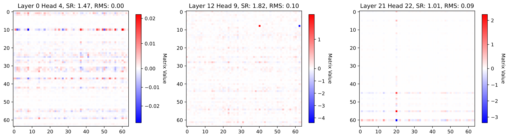

# 08 · linear 路线（三）：delta rule 与 DPLR 统一框架

> 本篇的核心是一个视角转换：把 $S_t$ 看成一个在推理时被在线训练的线性回归模型（fast weight）。于是 $\beta_t$ 是学习率，$\alpha_t$ 是 weight decay，「精确替换某个 key 的 value」变成一步梯度下降。这个视角能把 LA / RetNet / Mamba-2 / GLA / DeltaNet / GDN / RWKV-7 / KDA 全部装进一张表，而且每一步演进都对应一个可解释的优化学概念。
>
> **前置**：[`06`](./06_linear_foundation.md)（chunkwise 三行公式、fast weight 视角）、[`07`](./07_linear_decay_gating.md)（衰减只能「按比例淡忘一切」这个局限）。统一记号见 [Attention 机制](./README.md) §2。
>
> 论文：DeltaNet 并行化 [arXiv:2406.06484](https://arxiv.org/abs/2406.06484)（原始 delta rule：Schlag et al. [arXiv:2102.11174](https://arxiv.org/abs/2102.11174)；Widrow & Hoff 1960）、Gated DeltaNet [arXiv:2412.06464](https://arxiv.org/abs/2412.06464)、RWKV-7 [arXiv:2503.14456](https://arxiv.org/abs/2503.14456)。

---

## 1. delta rule 的三种等价写法

### 1.1 擦除-写入视角

$$
\begin{aligned}
S_t &= S_{t-1} - \underbrace{k_t\, (S_{t-1}^{\top} k_t)^{\top}}_{\text{erase old value}} + \underbrace{k_t\, ( \beta_t v_t + (1-\beta_t)\, S_{t-1}^{\top} k_t )^{\top}}_{\text{write new value}}\\
v_t^{\mathrm{old}} &= S_{t-1}^{\top} k_t, \qquad v_t^{\mathrm{new}} = \beta_t v_t + (1-\beta_t)\, v_t^{\mathrm{old}}
\end{aligned}
$$

语义是：先把当前 key $k_t$ 关联的旧值完整擦除，再写入新值——后者是旧值与新值按写入强度 $\beta_t$ 的线性插值。$\beta_t$ 接近 1 时完全替换，$\beta_t$ 接近 0 时完全保留。

这正是 [`07`](./07_linear_decay_gating.md) §5 结尾那个 "capital of France" 例子需要的操作。

### 1.2 化简形式

$$
S_t = (I - \beta_t k_t k_t^{\top})\, S_{t-1} + \beta_t k_t v_t^{\top}
$$

$(I - \beta_t k_t k_t^{\top})$ 是广义 Householder 变换（$\beta_t = 2$、$\|k\| = 1$ 时是标准 Householder 反射）。它的特征值可以手算出来：设 $\hat{k} = k / \|k\|$，则

$$
\begin{aligned}
(I - \beta \hat{k} \hat{k}^{\top})\, \hat{k} &= (1-\beta)\, \hat{k} &&\Rightarrow\ \lambda = 1-\beta,\ \text{multiplicity } 1\ \text{(along } \hat{k}\text{)}\\
(I - \beta \hat{k} \hat{k}^{\top})\, u &= u \quad (\forall\, u \perp \hat{k}) &&\Rightarrow\ \lambda = 1,\ \text{multiplicity } d_k - 1
\end{aligned}
$$

也就是说，$d_k - 1$ 个特征值恒等于 1，只有 1 个是 $1 - \beta$。请记住这个事实——§4 讲 RWKV-7 时它是核心论据。

### 1.3 在线梯度下降视角

三种写法中最重要的一个。定义重构损失 $L_t(S) = \tfrac{1}{2}\, \|S^{\top} k_t - v_t\|^2$。

以学习率 $\beta_t$ 走一步梯度下降（$\nabla_S L_t = k_t\, (S^{\top} k_t - v_t)^{\top}$）：

$$
S_t = S_{t-1} - \beta_t\, \nabla_S L_t(S_{t-1}) = (I - \beta_t k_t k_t^{\top})\, S_{t-1} + \beta_t k_t v_t^{\top}
$$

结果与化简形式一模一样。于是可以建立如下对应：

```
┌───────────────────────────────────────────────────────────────────────┐
│  linear attention = 测试时回归（test-time regression）                  │
│    · 状态 S       = fast weight，一个在推理时在线训练的线性回归模型       │
│    · β_t          = 学习率                                             │
│    · 门控 α_t     = weight decay / L2 正则                              │
│    · 朴素 LA      = 对 −⟨Sᵀk_t, v_t⟩ 做 GD（Hebbian，纯累加，无纠错）    │
│    · DeltaNet     = 对 ½‖Sᵀk_t − v_t‖² 做 GD（有纠错：只写入预测残差）   │
└───────────────────────────────────────────────────────────────────────┘
```

### 1.4 全谱系对照（Kimi Linear Table 7）

每一行都是「一个目标函数 + 一步梯度下降」：

| 方法 | 目标 $L$ | 更新 $S_t = S_{t-1} - \nabla_{S_{t-1}} L$ |
|---|---|---|
| LA | $-\langle S^{\top} k_t,\ v_t \rangle$ | $S_t = S_{t-1} + k_t v_t^{\top}$ |
| RetNet | $-\beta_t \langle \cdot \rangle + \tfrac{1}{2}\, \|\sqrt{1-\alpha}\, S\|_F^2$ | $S_t = \alpha S_{t-1} + \beta_t k_t v_t^{\top}$ |
| Mamba-2 | $-\beta_t \langle \cdot \rangle + \tfrac{1}{2}\, \|\sqrt{1-\alpha_t}\, S\|_F^2$ | $S_t = \alpha_t S_{t-1} + \beta_t k_t v_t^{\top}$ |
| GLA | $-\langle \cdot \rangle + \tfrac{1}{2}\, \|\sqrt{\mathrm{Diag}(1-\alpha_t)}\, S\|_F^2$ | $S_t = \mathrm{Diag}(\alpha_t)\, S_{t-1} + k_t v_t^{\top}$ |
| HGRN2 | $-\langle S^{\top} (1-\alpha_t),\ v_t \rangle + \tfrac{1}{2}\, \|\cdot\|_F^2$ | $S_t = \mathrm{Diag}(\alpha_t)\, S_{t-1} + (1-\alpha_t)\, v_t^{\top}$ |
| Longhorn | $\tfrac{1}{2}\, \|S^{\top} k_t - v_t\|^2_{\mathrm{Diag}(\beta_t)}$（**隐式**，闭式最优） | $S_t = (I - \tfrac{\beta_t}{1 + \beta_t k_t^{\top} k_t}\, k_t k_t^{\top})\, S_{t-1} + \beta_t k_t v_t^{\top}$ |
| Comba | $\tfrac{\beta_t}{2}\, \|S^{\top} k_t - v_t\|^2 + \tfrac{1}{2}\, \|\sqrt{1-\alpha_t}\, S\|_F^2$ | $S_t = (\alpha_t - \beta_t k_t \hat{k}_t^{\top})\, S_{t-1} + \beta_t k_t v_t^{\top}$ |
| RWKV-7 | $\tfrac{1}{2}\, \|S^{\top} \tilde{k}_t - v_t\|^2 + \tfrac{1}{2}\, \|\sqrt{\mathrm{Diag}(1-\alpha_t)}\, S\|_F^2$ | $S_t = (\mathrm{Diag}(\alpha_t) - (b_t \odot \hat{k}_t)\, \hat{k}_t^{\top})\, S_{t-1} + k_t v_t^{\top}$ |
| **GDN** | $\tfrac{\beta_t}{2}\, \|\tilde{S}_{t-1}^{\top} k_t - v_t\|^2$ | $S_t = (I - \beta_t k_t k_t^{\top})\, \alpha_t S_{t-1} + \beta_t k_t v_t^{\top}$ |
| **KDA** | $\tfrac{\beta_t}{2}\, \|\tilde{S}_{t-1}^{\top} k_t - v_t\|^2$ | $S_t = (I - \beta_t k_t k_t^{\top})\, \mathrm{Diag}(\alpha_t)\, S_{t-1} + \beta_t k_t v_t^{\top}$ |

（GDN/KDA 的 $\tilde{S}_{t-1}$ 指「已被衰减过的状态」，即先衰减、后在其上做 SGD。）

> **Longhorn 与 DeltaNet 的理论差别值得一提**（GDN 脚注）：Longhorn 用隐式在线学习求同一目标的闭式全局最优更新；DeltaNet 用一步显式梯度下降。所以 Longhorn 的 $(I - \beta/(1 + \beta k^{\top} k)\, k k^{\top})$ 里那个分母就是闭式解带来的。

## 2. WY 表示与 UT transform：delta rule 的并行化

递归里出现的不再是标量或向量的缩放，而是 Householder 矩阵的连乘积——这是 delta 家族比衰减家族难做的全部原因。

chunk 内展开（GDN 论文 Eq. 3，$r$ 是块内位置）：

$$
\begin{aligned}
S_{[t]}^{r} &= S_{[t]} \cdot P_{[t]}^{r} + H_{[t]}^{r}\\
P_{[t]}^{r} &= \prod_{i=1}^{r} ( I - \beta^{i} k^{i} (k^{i})^{\top} ) &&\in \mathbb{R}^{d_k \times d_k}\\
H_{[t]}^{r} &= \sum_{i=1}^{r} ( \beta^{i} v^{i} (k^{i})^{\top} \cdot \prod_{j=i+1}^{r} ( I - \beta^{j} k^{j} (k^{j})^{\top} ) )
\end{aligned}
$$

朴素计算需要为每一步物化一个 $d_k \times d_k$ 矩阵，即 $O(d^2)$ 内存乘以 $L$ 步，I/O 上不可接受。

### 2.1 WY 表示

Bischof & Van Loan 1985（*The WY Representation for Products of Householder Matrices*）给出的方法，可以把 $r$ 个 rank-1 更新压缩成两个向量序列：

$$
\begin{aligned}
P_{[t]}^{r} &= I - \sum_{i \le r} w^{i} (k^{i})^{\top}, \qquad w^{r} = \beta^{r}\, ( k^{r} - \sum_{i<r} w^{i}\, (k^{i\top} k^{r}) )\\
H_{[t]}^{r} &= \sum_{i \le r} u^{i} (k^{i})^{\top}, \qquad u^{r} = \beta^{r}\, ( v^{r} - \sum_{i<r} u^{i}\, (k^{i\top} k^{r}) )
\end{aligned}
$$

**内存从 $O(d^2)$ 降到 $O(d)$**，只需存两个向量序列 $w, u$。矩阵形式：$P = I - W^{\top} K$，$H = U^{\top} K$。

$u_t$ 被称为 "pseudo value"（伪值）——它就是 $\beta_t\, (v_t - v_t^{\mathrm{old}})$，即写入的残差。

### 2.2 UT transform

$w, u$ 的递推本身仍是串行的。Joffrain et al. 2006（*Accumulating Householder transformations, revisited*）给出的 UT transform 可以把它变成一次三角求逆：

$$
\begin{aligned}
T_{[t]} &= [ I + \mathrm{strictLower}( \mathrm{diag}(\beta)\, K K^{\top} ) ]^{-1}\, \mathrm{diag}(\beta) &&\in \mathbb{R}^{C \times C}\\
W_{[t]} &= T_{[t]} K_{[t]}, \qquad U_{[t]} = T_{[t]} V_{[t]}
\end{aligned}
$$

（$\mathrm{strictLower}(\cdot) = \mathrm{tril}(\cdot, -1)$。）

下三角矩阵求逆用前向代入（forward substitution）逐行迭代，复杂度 $O(C^3)$，但 $C = 64$ 时完全放得进 SRAM。`fla` 里这是 [[fla:fla/ops/utils/solve_tril.py#L355|solve_tril]]，实现是「16×16 块内前向代入 + 分块 Schur 精确归并」，细节见 [06 · Flash Linear Attention](../fa/06_flash_linear_attention.md) §4。

### 2.3 最终的 chunkwise 算法

$$
\begin{aligned}
S_{[t+1]} &= S_{[t]} + K_{[t]}^{\top}\, \tilde{V}_{[t]}\\
O_{[t]} &= Q_{[t]}\, S_{[t]} + ( (Q_{[t]} K_{[t]}^{\top}) \odot M )\, \tilde{V}_{[t]}
\end{aligned}
$$

其中 $\tilde{V}_{[t]} = U_{[t]} - W_{[t]}\, S_{[t]}$ 是唯一的新东西，即 pseudo value。

把 [`06`](./06_linear_foundation.md) §3.3 的 $V_{[t]}$ 换成 $\tilde{V}_{[t]}$，就得到 delta rule 的 chunkwise 算法——它与 [`06`](./06_linear_foundation.md) 的形式完全同构。整个 delta 家族（DeltaNet / GDN / KDA）都是这个模式。

```python
def deltanet_chunk(q, k, v, beta, scale, C):
    B, T, H, K = q.shape
    V, NT = v.shape[-1], T // C
    qc, kc, vc = (x.transpose(1, 2).reshape(B, H, NT, C, -1) for x in (q, k, v))
    bc = beta.transpose(1, 2).reshape(B, H, NT, C)
    strict = torch.ones(C, C, dtype=torch.bool, device=q.device).triu(0)   # True 在对角及以上
    causal = torch.ones(C, C, dtype=torch.bool, device=q.device).tril()

    # --- UT transform: T = (I + strictLower(diag(β) K K^T))^{-1} diag(β)
    Akk  = (bc[..., None] * kc) @ kc.transpose(-1, -2)          # diag(β) K K^T
    Amat = -Akk.masked_fill(strict, 0)                          # 取严格下三角并取负
    for i in range(1, C):                                       # 前向代入求逆
        Amat[..., i, :i] = Amat[..., i, :i] + (Amat[..., i, :, None] * Amat[..., :, :i]).sum(-2)
    Amat = Amat + torch.eye(C, dtype=q.dtype, device=q.device)
    Tmat = Amat * bc[..., None, :]                              # 右乘 diag(β)
    W, U = Tmat @ kc, Tmat @ vc                                 # [.., C, K] / [.., C, V]

    S = q.new_zeros(B, H, K, V); o = torch.zeros_like(vc)
    for n in range(NT):
        qi, ki = qc[:, :, n] * scale, kc[:, :, n]
        v_tilde = U[:, :, n] - W[:, :, n] @ S                    # ← pseudo value
        o[:, :, n] = qi @ S + ((qi @ ki.transpose(-1, -2)) * causal) @ v_tilde
        S = S + ki.transpose(-1, -2) @ v_tilde
    return o.reshape(B, H, T, V).transpose(1, 2)

# 实测（float64, C=16）：rel_err(deltanet_chunk, deltanet_recurrent) = 1.4e-14 ✓
```

对应的 recurrent 参考实现（decode 路径）：

```python
def deltanet_recurrent(q, k, v, beta, scale):
    B, T, H, K = q.shape
    S = q.new_zeros(B, H, K, v.shape[-1]); o = torch.zeros_like(v)
    for t in range(T):
        kt, vt, bt = k[:, t], v[:, t], beta[:, t]
        v_old = torch.einsum('bhk,bhkv->bhv', kt, S)             # 1) 读出 k_t 当前映射到什么
        S = S + bt[..., None, None] * kt.unsqueeze(-1) * (vt - v_old).unsqueeze(-2)   # 2) 只写残差
        o[:, t] = torch.einsum('bhk,bhkv->bhv', q[:, t] * scale, S)
    return o
```

### 2.4 完全并行形式（论文提及但不用）

$$
A_{ij} = k_j^{\top} P_{j+1}^{i}\, q_i \quad (j \le i) \qquad \Rightarrow \qquad A = (Q K^{\top} \odot M)\, T
$$

计算 $T$ 需要 $L \times L$ 矩阵求逆，随序列长度三次方增长，所以不用于训练。但这个 "attention 矩阵" 对 RNN 可解释性研究有价值——它让 DeltaNet 有了一个可以画出来的 attention map。

### 2.5 已知局限

论文 §Limitations 写得很诚实：

> "the training speed still lags behind that of GLA. This is due to the overhead caused by modeling **state-to-state dependencies**… which requires 'marginalizing' over the head dimension inside the kernel, similar to the case of softmax attention. However, for GLA since there are **no intra-state dependencies** (everything is elementwise)…"

**这是 delta 家族的结构性代价**：$\tilde{V} = U - W S$ 这一步要沿整个 $d_k$ 维缩并，无法把 $K$ 维切给不同 CTA——这直接决定了 `fla` 的 delta-rule kernel 必须用 `blockdim64` 特化（把 $K$ 拆成最多 4 个固定 64 宽的 slab 全部驻留寄存器），见 [06 · Flash Linear Attention](../fa/06_flash_linear_attention.md) §6。

负特征值扩展：$\beta_t \in (0, 2)$ 允许特征值为负，解锁 state tracking 能力（Grazzi et al., [arXiv:2411.12537](https://arxiv.org/abs/2411.12537), ICLR 2025）。`fla` 里对应 `allow_neg_eigval` 参数。

## 3. Gated DeltaNet：遗忘与精确替换

$$
S_t = \underbrace{( I - \beta_t k_t k_t^{\top} )}_{\text{delta: exact replacement}}\ \cdot\ \underbrace{\alpha_t}_{\text{gate: global decay}}\ \cdot\ S_{t-1} + \beta_t k_t v_t^{\top}
$$

$\alpha_t \in (0, 1)$ 是头级标量的 data-dependent 遗忘门（用 Mamba-2 的参数化）；$\beta_t \in (0, 1)$ 是写入强度，也即学习率。

> ⚠️ 乘序：$\alpha_t$ 是标量，与 Householder 项可交换，所以书写顺序无所谓。但 KDA 里 $\mathrm{Diag}(\alpha_t)$ 是矩阵，顺序变得关键（§5）。

在线学习目标（Table 1）：

$$
L = \|S_t - \alpha_t S_{t-1}\|_F^2 - 2\, \langle S_t k_t,\ \beta_t\, (v_t - \alpha_t S_{t-1}^{\top} k_t) \rangle
$$

门控项 $\alpha_t$ 放松了正则项，允许 $S_t$ 相对 $S_{t-1}$ 的受控偏移——可以理解为「自适应 weight decay」。

### S-NIAH 实证

这是全章最有说服力的一组数字。Table 2（1.3B 模型）：

| 模型 | S-NIAH-1 (pass-key) 1K/2K/4K/8K | S-NIAH-2 (number) 1K/2K/4K/8K | S-NIAH-3 (uuid) 1K/2K/4K |
|---|---|---|---|
| DeltaNet | 97.4 / 96.8 / **99.0** / **98.8** | 98.4 / 45.6 / 18.6 / 14.4 | 85.2 / 47.0 / 22.4 |
| Mamba2 | 99.2 / 98.8 / 65.4 / 30.4 | 99.4 / 98.8 / 56.2 / 17.0 | 64.4 / 47.6 / 4.6 |
| **Gated DeltaNet** | 98.4 / 88.4 / 91.4 / 91.8 | **100.0 / 99.8 / 92.2 / 29.6** | **86.6 / 84.2 / 27.6** |

三条结论（原文）：

1. **Decay hurts memory retention**：S-NIAH-1（合成重复上下文，只需长期保持）里 DeltaNet 近乎完美，Mamba2 超过 2K 后暴跌（衰减太快），GDN 因 delta rule 退化较轻。
2. **Gating facilitates filtering**：S-NIAH-2/3（真实文章上下文，需要过滤）里 DeltaNet 在长序列崩溃（memory collision——固定大小的状态下信息叠加后不可分），Mamba2 与 GDN 靠门控过滤无关信息。
3. **Delta rule helps memorization**：S-NIAH-3 把值从数字换成 UUID（复杂模式记忆），Mamba2 暴跌，GDN 明显更好。

```
┌──────────────────────────────────────────────────────────────────┐
│  门控     = 快速大范围遗忘（context switch 时清空整个状态）        │
│  delta rule = 精确定点替换（只改一条 key-value，其他不动）        │
│  二者正交、互补。缺任何一个都会在某一类任务上崩。                  │
└──────────────────────────────────────────────────────────────────┘
```

### chunkwise 形式

记 $\gamma^r = \prod_{j \le r} \alpha^j$（chunk 内累积衰减，每 chunk 从 1 重新开始），定义（原文 Eq. 2）：

$$
\overleftarrow{q}^{\,r} = \gamma^r\, q^r, \qquad \overrightarrow{k}^{\,r} = (\gamma^C / \gamma^r)\, k^r, \qquad \overrightarrow{S} = \gamma^C S
$$

（左箭头表示「衰减回 chunk 首」，右箭头表示「衰减到 chunk 尾」。）

UT transform 里额外乘一个 $\Gamma_{ij} = \gamma^i / \gamma^j$：

$$
\tilde{U} = [ I + \mathrm{strictLower}( \mathrm{diag}(\beta)\, (\Gamma \odot K K^{\top}) ) ]^{-1}\, \mathrm{diag}(\beta)\, V
$$

最终：

$$
\begin{aligned}
S_{[t+1]} &= \overrightarrow{S}_{[t]} + ( \tilde{U}_{[t]} - \overleftarrow{W}_{[t]}\, S_{[t]} )^{\top}\, \overrightarrow{K}_{[t]}\\
O_{[t]} &= \overleftarrow{Q}_{[t]}\, S_{[t]} + ( Q_{[t]} K_{[t]}^{\top} \odot M )\, ( \tilde{U}_{[t]} - \overleftarrow{W}_{[t]}\, S_{[t]} )
\end{aligned}
$$

```python
def gdn_chunk(q, k, v, g, beta, scale, C):
    """g: [B,T,H] 对数标量衰减；beta: [B,T,H]。"""
    B, T, H, K = q.shape
    V, NT = v.shape[-1], T // C
    qc, kc, vc = (x.transpose(1, 2).reshape(B, H, NT, C, -1) for x in (q, k, v))
    bc = beta.transpose(1, 2).reshape(B, H, NT, C)
    gc = g.transpose(1, 2).reshape(B, H, NT, C).cumsum(-1)          # 局部累积 log 衰减
    strict = torch.ones(C, C, dtype=torch.bool, device=q.device).triu(0)
    causal = torch.ones(C, C, dtype=torch.bool, device=q.device).tril()
    Gam = (gc[..., :, None] - gc[..., None, :]).exp()               # Γ_ij = γ^{j→i}
    Akk  = ((bc[..., None] * kc) @ kc.transpose(-1, -2)) * Gam      # ← 相比 DeltaNet 多乘一个 Γ
    Amat = -Akk.masked_fill(strict, 0)
    for i in range(1, C):
        Amat[..., i, :i] = Amat[..., i, :i] + (Amat[..., i, :, None] * Amat[..., :, :i]).sum(-2)
    Amat = Amat + torch.eye(C, dtype=q.dtype, device=q.device)
    Tmat = Amat * bc[..., None, :]
    W = Tmat @ (kc * gc[..., None].exp())                           # W⃖：k 衰减回 chunk 首
    U = Tmat @ vc
    S = q.new_zeros(B, H, K, V); o = torch.zeros_like(vc)
    for n in range(NT):
        qi, ki, gi = qc[:, :, n] * scale, kc[:, :, n], gc[:, :, n]
        v_tilde = U[:, :, n] - W[:, :, n] @ S
        A = ((qi @ ki.transpose(-1, -2)) * Gam[:, :, n]) * causal
        o[:, :, n] = (qi * gi[..., None].exp()) @ S + A @ v_tilde    # Q⃖ S + (QK^T⊙Γ⊙M) Ṽ
        g_last = gi[:, :, -1:]
        S = S * g_last[..., None].exp() + \
            (ki * (g_last - gi)[..., None].exp()).transpose(-1, -2) @ v_tilde
    return o.reshape(B, H, T, V).transpose(1, 2)

# 实测（float64, C=16）：rel_err(gdn_chunk, gdn_recurrent) = 1.7e-15
#             与 fla/ops/gated_delta_rule/naive.py:13 交叉验证（fp32）= 6.6e-7  ✓
```

### 层设计（Fig 1）

```
q/k 路径：Linear → ShortConv → SiLU → L2 Norm       ← L2 Norm 是训练稳定性的关键
v   路径：Linear → ShortConv → SiLU
α, β    ：仅 Linear 投影；α 用 Mamba-2 的参数化
输出    ：Norm → output gate（Linear + SiLU）→ 输出投影
```

混合变体：Gated DeltaNet-H1 是 GDN 与 SWA 交替；H2 是 Mamba2、GDN、SWA 依次排列的模式。见 [`11`](./11_hybrid.md)。

## 4. RWKV-7：解耦移除与写入

RWKV-7 Eq. 17（转成本章列向量约定）：

$$
S_t = ( \mathrm{Diag}(w_t) - \hat{\kappa}_t\, (a_t \odot \hat{\kappa}_t)^{\top} )\, S_{t-1} + \tilde{k}_t v_t^{\top}
$$

各变量的语义（原文 "weight preparation" 一节）：

| 符号 | 名称 | 说明 |
|---|---|---|
| $\tilde{k}$ | **replacement key**（写入用的键） | 期望 $\tilde{k}_t = k_t \odot (1 - w_t)$，但 RWKV-7 **解耦** $w_t$ 与 $a_t$ 以增强表达力 |
| $\kappa$ | **removal key**（移除用的键） | $\kappa_t = k_t \odot \xi$，$\xi$ 是可学习的「移除键乘子」（实测范围约 `[−5.3, 9.4]`） |
| $\hat{\kappa}$ | 逐头 L2 归一化的移除键 | $\hat{\kappa}_t = \kappa_t / \|\kappa_t\|_2$ |
| $w$ | in-context weight decay（向量值） | loramlp |
| $a$ | **in-context learning rate (ICLR)**（向量值） | 「替换率增强器」 |
| $g$ | rwkv gate（输出门） | `g_t = loramlp_g(sigmoid, x^g_t)` |

RWKV-7 独有的能力，原文写道："One example of this flexibility is the ability to use a **different removal key than replacement key**." 而 DeltaNet 的移除与写入都用同一个 $k_t$。



> 图：RWKV-7 的状态数值范围（Peng et al. 2025；[arXiv:2503.14456](https://arxiv.org/abs/2503.14456)）。这张图配合下面的特征值分析看：因为转移矩阵的所有特征值都被约束在 $[-1, 1]$，状态不会像 RWKV-6 那样累积膨胀。**状态数值稳定性是 linear attention 能不能上低精度训练的前提**——MiniMax-M2 的一条批评正是「linear attention 对低精度远比 full attention 敏感」（[`11`](./11_hybrid.md) §5）。

### 转移矩阵的结构分析（Eq. 19）

这是表达力论证的核心。

$$
\begin{aligned}
G_t &= \mathrm{Diag}(w_t) - \hat{\kappa}_t\, (a_t \odot \hat{\kappa}_t)^{\top}\\
&= ( I - \hat{\kappa}_t\, ((a_t / w_t) \odot \hat{\kappa}_t)^{\top} )\, \mathrm{Diag}(w_t)\\
&\approx ( I - 2\, \hat{\kappa}_t \hat{\kappa}_t^{\top} )\, \mathrm{Diag}(w_t)
\end{aligned}
$$

原文的关键论述：

> "is **no longer a Householder matrix but a scaled approximation of it**… This mimics a Householder matrix but with expanded dynamics, while still having all eigenvalues in a stable range of $[-1, 1]$ and **allows the network to decay information in all subspaces if necessary**. It contrasts with the case of a Householder-like matrix with learning rate $(I - a\, v v^{\top}),\ a \in [0, 1]$, as used in Schlag et al. 2021; Yang et al. 2024c where **all eigenvalues are one except for the last one** corresponding to $1 - a$."

把这段论述和 §1.2 的手算对照起来看，论证就完整了：

- DeltaNet 的 $(I - \beta \hat{k} \hat{k}^{\top})$：$d_k - 1$ 个特征值恒为 1（固定），只有 1 个是 $1 - \beta$——只能在**一个方向**上遗忘。
- RWKV-7 的 $\mathrm{Diag}(w_t) - \hat{\kappa}\, (a \odot \hat{\kappa})^{\top}$：$\mathrm{Diag}(w_t)$ 让**所有子空间**都能衰减——遗忘与精确替换两件事同时做。

### 理论结果

在标准复杂度猜想 $\mathrm{TC}^0 \neq \mathrm{NC}^1$ 下：RWKV-7 可用单层解决 $S_5$ state tracking（已知属于 $\mathrm{NC}^1$）；可用常数层数识别所有正则语言；严格超越 Transformer（受限于 $\mathrm{TC}^0$）和所有对角转移矩阵 RNN。关键机制是非对角、输入相关的转移矩阵，特别是可表示 "copy" 状态转移（Lemma 3）。

> 这是「linear attention 的表达力可以超过 full attention」这个说法的严格来源（[Attention 机制](./README.md) §1）。注意它说的是计算复杂度类层面，而不是「实际任务上更强」。

工程数据：公开 7 个 Apache 2.0 模型（0.1B/0.4B/1.4B Pile + 0.1B/0.4B/1.5B/2.9B World-3）；训练语料 RWKV World v3，共 3.119T tokens；2.9B 是 32 层 × 2560、40 头 × head size 64。速度（H100，bs=8，head dim 64，model dim 4096）：优化后比官方 RWKV-6 kernel 快约 3 倍；seq 16k 时 forward 7.9ms（无状态存储）/ backward 22.5ms，而 FlashAttention-v3 forward 33.9ms。

## 5. DPLR 统一框架

Diagonal Plus Low Rank——源头是 S4（[arXiv:2111.00396](https://arxiv.org/abs/2111.00396)）用静态 DPLR 作转移矩阵；RWKV-7 与 DeltaNet 把它变成动态、数据相关的：

$$
S_t = ( \mathrm{Diag}(w_t) + a_t b_t^{\top} )\, S_{t-1} + k_t v_t^{\top}
$$

一段代码、一个循环，就能把六个机制都跑出来：

```python
def dplr(q, w_log, a, b, kk, vv, scale):
    """通用 DPLR 循环。所有机制都是 (w, a, b, kk, vv) 的一种取法。"""
    B, T, H, K = q.shape
    V = vv.shape[-1]
    S = q.new_zeros(B, H, K, V)
    o = torch.zeros(B, T, H, V, dtype=q.dtype)
    for t in range(T):
        S = S * w_log[:, t].exp()[..., None] \
            + a[:, t].unsqueeze(-1) * torch.einsum('bhk,bhkv->bhv', b[:, t], S).unsqueeze(-2) \
            + kk[:, t].unsqueeze(-1) * vv[:, t].unsqueeze(-2)
        o[:, t] = torch.einsum('bhk,bhkv->bhv', q[:, t] * scale, S)
    return o
```

> 注意 $b_t^{\top} S$ 用的是未衰减的 $S$（$(\mathrm{Diag}(w) + a b^{\top})\, S$），而不是先衰减再做低秩。这一点很容易写错——写成 $(I + a b^{\top})\, \mathrm{Diag}(w)\, S$ 是另一个机制（那才是 KDA 的形式，见下）。

六个归约，全部实测通过：

| 机制 | $w$ | $a$ | $b$ | 写入项 | rel err |
|---|---|---|---|---|---|
| LA | $1$ | $0$ | $0$ | $k v^{\top}$ | `0.0` |
| GLA | $\alpha_t$（向量） | $0$ | $0$ | $k v^{\top}$ | `0.0` |
| Mamba-2 | $a_t \cdot 1$（标量广播） | $0$ | $0$ | $k v^{\top}$ | `0.0` |
| DeltaNet | $1$ | $-\beta k$ | $k$ | $\beta k v^{\top}$ | `1.1e-15` |
| Gated DeltaNet | $\alpha_t \cdot 1$ | $-\beta k$ | $\alpha_t \odot k$ | $\beta k v^{\top}$ | `4.0e-16` |
| **KDA** | $\alpha_t$（向量） | $-\beta k$ | $\alpha_t \odot k$ | $\beta k v^{\top}$ | `5.2e-16` |
| RWKV-7 | $w_t$（向量） | $-\hat{\kappa}$ | $a_{\mathrm{icl}} \odot \hat{\kappa}$ | $\tilde{k} v^{\top}$ | （无独立参考） |

$b = \alpha_t \odot k$ 那一列是关键：因为 $(I - \beta k k^{\top})\, \mathrm{Diag}(\alpha)\, S = (\mathrm{Diag}(\alpha) - \beta k\, (\alpha \odot k)^{\top})\, S$，把 $\mathrm{Diag}(\alpha)$ 提到左边就等价于把它折进 $b$。这正是 §3 那句「顺序变得关键」的代数含义。

```python
bv = beta[..., None]
zero = torch.zeros_like(k)
report("LA",       dplr(q, torch.zeros_like(g), zero, zero, k, v, scale),          linear_attn(q,k,v,scale))
report("GLA",      dplr(q, g,                   zero, zero, k, v, scale),          gla(q,k,v,g,scale))
report("DeltaNet", dplr(q, torch.zeros_like(g), -bv*k, k,            bv*k, v, sc), deltanet(q,k,v,beta,sc))
report("GDN",      dplr(q, gs_expand,           -bv*k, k*gs.exp(),   bv*k, v, sc), gdn(q,k,v,gs,beta,sc))
report("KDA",      dplr(q, g,                   -bv*k, k*g.exp(),    bv*k, v, sc), kda(q,k,v,g,beta,sc))
# 全部 rel_err ≤ 5.2e-16  ✓
```

### 全谱系映射表

| 模型 | $D_t$ | $a_t$ | $b_t$ | 门控粒度 |
|---|---|---|---|---|
| 朴素 LA | $I$ | $0$ | $0$ | 无 |
| RetNet | $\gamma I$（固定逐头） | $0$ | $0$ | 标量·数据无关 |
| Mamba-2 | $a_t I$ | $0$ | $0$ | 标量·数据相关 |
| GLA / RWKV-6 | $\mathrm{Diag}(\alpha_t)$ | $0$ | $0$ | **通道级**·数据相关 |
| DeltaNet | $I$ | $\beta_t k_t$ | $k_t$ | 无门控 + delta |
| Gated DeltaNet | $\alpha_t I$ | $\alpha_t \beta_t k_t$ | $k_t$ | 标量 + delta |
| **RWKV-7** | $\mathrm{Diag}(w_t)$ | $\hat{\kappa}_t$ | $a_t \odot \hat{\kappa}_t$ | 通道级 + 通道级 ICLR + **独立移除键** |
| Comba | $\alpha_t I$ | $\beta_t k_t$ | $\hat{k}_t$ | 标量 + delta（闭环控制） |
| **KDA** | $\mathrm{Diag}(\alpha_t)$ | $\beta_t k_t$ | $k_t \odot \alpha_t$ | **通道级 + delta，且 $a, b$ 都绑定到 $k$** |
| 通用 DPLR | $D$ | $a_t$（自由） | $b_t$（自由） | 最强但最慢 |

### 通用 DPLR 的代价

Kimi Linear §6.2：

> "While the DPLR structure introduces richer model interactions and can potentially enhance recall through its key–value update rule, it also suffers from a notable limitation: **high computational cost and poor parallelizability**."

S4 的做法是把 DPLR 联合对角化到复平面，但这反而把表达力退化回对角变换。KDA 的做法是约束 $a, b$ 都由 $k$ 生成——保留细粒度衰减，同时把算子开销降回 delta rule 水平。这就是下一篇的主题。

## 6. 小结

| 概念 | 一句话 | 对应的优化学概念 |
|---|---|---|
| **fast weight** | $S$ 是一个在推理时在线训练的线性回归模型 | 模型参数 |
| **delta rule** | 只写入预测残差 $\beta\, (v - S^{\top} k)$，而不是无脑累加 | 一步 SGD |
| $\beta_t$ | 写入强度 | **学习率** |
| $\alpha_t$ | 遗忘门 | **weight decay / L2 正则** |
| **WY 表示** | 把 $r$ 个 Householder 连乘压成两个向量序列 $w, u$ | $O(d^2) \to O(d)$ 内存 |
| **UT transform** | 把 $w, u$ 的串行递推变成一次 $C \times C$ 下三角求逆 | 消除非-matmul FLOPs |
| **pseudo value** | $\tilde{V} = U - W S$，替换掉 chunkwise 公式里的 $V$ | delta 家族的统一形态 |
| **DPLR** | $(\mathrm{Diag}(w) + a b^{\top})$，一个循环装下全家族 | —— |

本篇把「表达力」这条线推进到了 DPLR。剩下的问题纯粹是工程的：通用 DPLR 太慢（[`07`](./07_linear_decay_gating.md) §4.4 那个二级分块的麻烦在 DPLR 下更严重，因为要算四个二级 chunk 矩阵而不是两个）。

KDA 的贡献就是找到了「表达力几乎不降、算子开销减半」的那个约束点。

---

下一篇：[09 · linear 路线（四）：KDA 与 Kimi Linear / K3](./09_linear_kda_kimi.md) —— KDA 的精确 chunkwise 算法、$a = b = k$ 绑定为什么带来约 2 倍加速、KDA 作为可学习位置编码，以及 Kimi Linear / Kimi K3 的发布配置。
