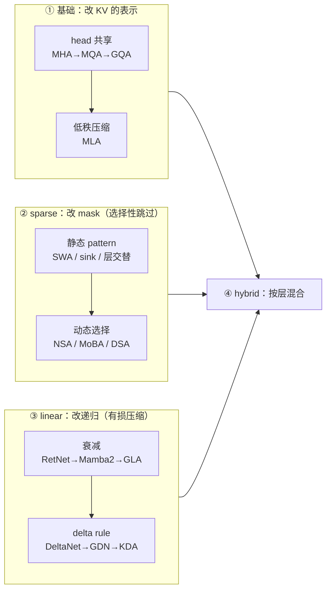

# Attention 机制

本目录讨论 attention 的定义本身如何变化。阅读本章需要会写标准 scaled dot-product attention（$S=QK^{\top}/\sqrt{d}$、行 softmax、$O=PV$），并且知道 KV cache 在 decode 阶段是什么、为什么 decode 是 memory-bound；这两点在本章 [00 · Attention 基础](../00_attention_basics.md) 有完整铺垫。除此之外，本章用到的每个定义（状态形状、门控参数化、chunkwise 递归、KL 蒸馏目标等）都会在用到时就地给出，不预设额外背景。

记号统一采用列向量约定，见下方 §2。

[FlashAttention](../fa/README.md) 解决的是另一个问题：在 attention 定义给定的前提下，怎样在硬件上把它算得快。本目录讨论的是定义本身怎样变——当 $O(N^2)$ 的计算量和 $O(N)$ 的 KV cache 都撑不住 1M context 时，人们改动的不再是 kernel，而是数学。

---

生产模型中这些机制如何组合（MLA / DSA / CSA / KDA / GDN / MSA / SWA），见 [前沿开源模型架构速览](../../frontier_open_models.md)。

## 1. 三条路线概览

三条路线针对的是 decode 阶段的同一个式子。对 seqlen $N$，每层每个 token 的 KV cache 是 $2 h_{kv} d_h$ 个元素，生成第 $N+1$ 个 token 时要把整个 cache 从 HBM 读一遍：

```
decode 每 token 的 attention HBM 流量 = N · (每 token cache 字节) · 层数
```

在 `N=1M`、Llama-3-70B 式的 GQA-8 配置下，这个式子的取值是每生成一个 token 读 40 GB——以 H100 的 3.35 TB/s 带宽计算，仅读 cache 就需要 12 ms，而整个模型权重只有 140 GB。attention 由此从不起眼的一层变成了 serving 的主要成本。三条路线分别压缩这个式子的不同因子：

```
                                  每 token cache          decode 计算
  ① 基础 / head sharing      2·h_kv·d_h  ↓ 常数因子          O(N·d)
     MHA → MQA → GQA → MLA   （128×128 → 576，56.9×）
                                                                            砍常数
  ② sparse                   不变（仍需全 cache 供选择）      O(k·d), k≪N
     SWA → NSA → DSA → CSA   但**读**的量降到 O(k)                          砍 N
                                                                          （跳过）
  ③ linear                   d_k·d_v（**与 N 无关**）         O(d_k·d_v)
     LA → GLA → DeltaNet → KDA                                              砍 N
                                                                          （压缩）
  ④ hybrid                   按层比例混合 ②/③ 与 ①
     Kimi Linear 3:1、Gemma 3 5:1、Qwen3-Next 3:1
```

②与③的区别是全章最关键的一点：sparse attention 保留完整且不断增长的 KV cache，只是每一步跳过其中的大部分；linear attention 只保留固定大小的 recurrent state，把历史不可逆地压缩进去。前者的表达力上限就是 full attention（它只做信息选择），后者受 finite-state capacity 约束，但配上 delta rule 之后理论表达力可以超过 full attention（见 [`09`](./09_linear_kda_kimi.md) 第 7 节）。Kimi Linear 论文对此有一段很好的表述，[`11`](./11_hybrid.md) 第 5 节会引用。

## 2. 全章统一记号

本章所有篇目共用下表中的记号，后文不再重复定义。

| 符号 | 含义 | shape |
|---|---|---|
| $N$ | 序列长度 | —— |
| 原论文/代码记号 | 引用论文或代码原文时保留其原记号（如序列长的 T、S），正文统一用 $N$ | —— |
| $d$ | 模型 hidden size | —— |
| $h$ / $h_{kv}$ | query head 数 / KV head 数 | —— |
| $d_h$ | 每 head 维度；$d_k$/$d_v$ 分开写时指 key/value 维 | —— |
| $q_t, k_t$ | 第 $t$ 个 token 的 query / key（**列向量**） | $[d_k]$ |
| $v_t$ | value（列向量） | $[d_v]$ |
| $S_t$ | linear attention 的 **recurrent state**（fast weight） | $[d_k, d_v]$ |
| $o_t$ | 输出，linear 路线一律 $o_t = S_t^{\top} q_t$ | $[d_v]$ |
| $\alpha_t$ | decay / forget gate（标量或 $[d_k]$ 向量） | $[]$ 或 $[d_k]$ |
| $\beta_t$ | delta rule 的写入强度 = 在线学习率 | $[]$ |
| $C$ | chunk size（chunkwise 形式的分块长度，实践取 64） | —— |
| $M$ | $C \times C$ 因果下三角掩码（含对角）；$M^{-}$ 严格下三角（不含对角） | $[C, C]$ |

张量布局一律采用 $[B, T, H, D]$，state 为 $[B, H, K, V]$，与 [[fla:]] 一致，方便对照代码。

> ⚠️ 各篇原论文的向量约定互不相同，阅读代码时务必留意。GLA（[arXiv:2312.06635](https://arxiv.org/abs/2312.06635)）用行向量 $S_t = S_{t-1} + k_t^{\top} v_t$，$o_t = q_t S_t$；Gated DeltaNet（[arXiv:2412.06464](https://arxiv.org/abs/2412.06464)）用 $S \in \mathbb{R}^{d_v \times d_k}$、$S_t = S_{t-1}(\cdot) + \beta_t v_t k_t^{\top}$。**两者与本章记号互为转置。** 写代码时 $(I - \beta k k^{\top})\, S$ 和 $S\, (I - \beta k k^{\top})$ 会静默给出不同结果，因此必须先固定一套约定。本章所有代码都在 `float64` 下与逐步 recurrent 参考实现对齐过（见 §5）。

## 3. 这组文档怎么读

| 文件 | 内容 | 代表模型 / 论文 |
|---|---|---|
| `README.md`（本文） | 三条路线的整体图景、统一记号、taxonomy、模型↔机制对照表、KV/state 总表 | —— |
| **基础** | | |
| [01 · 基础：MHA → MQA → GQA → MLA](./01_basics_head_sharing.md) | **MHA → MQA → GQA → MLA**：共享什么、arithmetic-intensity 论证、GQA 的 mean-pool uptraining、MLA 的 decoupled RoPE 与**矩阵吸收**（附严格数值验证）、MHA mode vs MQA mode | Llama/Mistral/Qwen；DeepSeek-V2/V3；Kimi K2 |
| [02 · 位置编码与数值稳定](./02_position_and_stability.md) | 作为「机制」一部分的位置编码与数值稳定：RoPE（相对性证明）/ALiBi/**NoPE**/partial RoPE、YaRN 分频带插值、QK-Norm、softcap、learned attention sink、QK-Clip、sigmoid attention、DIFF Transformer | RoPE/ALiBi/YaRN；Gemma 2/3、GPT-OSS、Kimi K2、Llama 4 |
| **路线一：sparse** | | |
| [03 · sparse 路线（一）：静态稀疏与推理期动态稀疏](./03_sparse_static.md) | **静态稀疏与推理期动态稀疏**：sliding window、attention sink 的 softmax 分母论证、Longformer/BigBird 的 pattern taxonomy、layer interleaving（Gemma 2/3、GPT-OSS、Llama 4 chunked+NoPE）、Quest/MInference/H2O 及其局限 | Mistral、Gemma、GPT-OSS、Llama 4、StreamingLLM |
| [04 · sparse 路线（二）：可训练稀疏](./04_sparse_trainable.md) | **可训练稀疏**：NSA 三分支+独立 sigmoid gate、**压缩 score 复用推出 selection 重要性**（Eq.9/Eq.10 全式+代码）、hardware-aligned 的两个理由、MoBA 的 MoE 式 top-k 路由、InfLLM-V2 对 NSA 的批评 | **NSA**、**MoBA**、InfLLM-V2/MiniCPM4 |
| [05 · sparse 路线（三）：DSA 与 DeepSeek-V4 的 CSA/HCA](./05_sparse_dsa_frontier.md) | **前沿稀疏**：DSA 的 lightning indexer（ReLU/FP8/MQA-shared key）、两阶段 KL 蒸馏与梯度 detach 的设计、DeepSeek-V4 的 CSA/HCA「先压缩再选择」 | **DeepSeek-V3.2**、**DeepSeek-V4** |
| **路线二：linear** | | |
| [06 · linear 路线（一）：kernel trick、RNN 等价与三种计算形式](./06_linear_foundation.md) | **基础形式**：kernel trick 与结合律重排、linear attention 就是 RNN、**parallel / recurrent / chunkwise 三形式**（chunkwise 是现代实现的全部）、朴素 linear attention 为什么打不过 softmax 的五个理由 | Katharopoulos 2020 |
| [07 · linear 路线（二）：衰减机制的演进](./07_linear_decay_gating.md) | **衰减谱系**：RetNet 固定 $\gamma$、Lightning Attention 的 left/right product、Mamba-2/SSD 与**半可分离矩阵**、GLA 的通道级门控与二级分块 | RetNet、MiniMax-01、Mamba-2、GLA |
| [08 · linear 路线（三）：delta rule 与 DPLR 统一框架](./08_linear_delta_rule.md) | **delta rule = 测试时回归**：擦除-写入视角、在线梯度下降视角、WY 表示与 UT transform（并行化的关键）、Gated DeltaNet 的「遗忘 vs 精确替换」正交性、RWKV-7、**DPLR 统一框架**（六个机制的实测归约） | DeltaNet、**Gated DeltaNet**、RWKV-7 |
| [09 · linear 路线（四）：KDA 与 Kimi Linear / K3](./09_linear_kda_kimi.md) | **KDA / Kimi 线**：通道级 gate + delta rule 的精确 chunkwise 算法、`a=b=k` 绑定为什么带来 ~2× 算子加速、KDA 作为**可学习位置编码**、Kimi Linear 与 Kimi K3 的生产配置与 lower-bounded decay | **Kimi Linear**、**Kimi K3** |
| **横切 & 路线三** | | |
| [10 · 门控](./10_gating.md) | **门控**（横切概念）：三个作用位置——状态转移门 / 写入门 / **输出门**；输出门为什么能消灭 attention sink（46.7%→4.8%）；sigmoid vs swish 的实测差异 | Gated Attention、Qwen3-Next、Kimi K3 |
| [11 · 混合模式：层比例、NoPE 与正反证据](./11_hybrid.md) | **混合模式**：层间混合 vs 层内并行、3:1 从哪来、NoPE 为什么是混合架构的关键、**正反方证据**（Kimi K3 2.8T 成功 vs MiniMax-M2 回退全attention）、完整决策表 | Kimi Linear/K3、Qwen3-Next/3.5、MiniMax-01/M2、Nemotron-H、Jamba、Falcon-H1 |

建议的阅读顺序是：先读本文建立整体框架，再读 01 和 02，把基础以及位置编码、数值稳定这两个「本身不是机制、却决定机制能否落地」的主题铺平。之后按兴趣分两条线：想理解 DeepSeek 的工作依次读 03、04、05；想理解 Kimi 的工作依次读 06、07、08、09。10 集中讲清楚「门控」这个反复出现的概念，11 回到工程决策。kernel 侧的 flash 实现在 [05 · Flash Sparse Attention](../fa/05_flash_sparse_attention.md) 与 [06 · Flash Linear Attention](../fa/06_flash_linear_attention.md)。

## 4. Taxonomy：三个正交的轴

读懂这片文献的关键，是把下面三个轴保持正交——绝大多数混淆都来自把它们混为一谈。

### 轴一：机制作用在什么上



### 轴二：sparse 的选择策略

| | 静态（只看位置） | 动态·启发式（无参数打分） | 动态·学习（有参数打分） |
|---|---|---|---|
| **token 粒度** | sliding window、attention sink | H2O、SnapKV（KV eviction） | **DSA**（lightning indexer） |
| **block 粒度** | Longformer、BigBird、Llama 4 chunked | Quest（channel-wise min-max 上界）、MInference、**MoBA**（mean-pooled key）、InfLLM-V2（semantic kernel） | **NSA**（压缩分支的 MLP $\varphi$，score 复用） |
| **压缩粒度** | —— | —— | NSA 的 cmp 分支、**DeepSeek-V4 的 CSA/HCA** |

> 这里有一个值得注意的张力：NSA 论证「必须 blockwise 才能对齐硬件」，DSA 随后照样做了 token 级选择，并且仍然拿到了加速——办法是把 group-consistency 推到极限，即利用 MLA 的 MQA mode 让一个 latent 被所有 head 共享。由此得到的教训是：真正重要的不是 contiguity 本身，而是一个 KV entry 被多少个 query 共享；contiguity 只是 NSA 在 GQA 约束下实现共享的路径。详见 [`04`](./04_sparse_trainable.md) §5 与 [`05`](./05_sparse_dsa_frontier.md) §3。

### 轴三：稀疏性/机制在生命周期的哪一段引入

| 阶段 | 代表 | 关键权衡 |
|---|---|---|
| **推理期，仅 prefill** | MInference、MoBA（部署时） | 零训练成本，但 decode 不受益 |
| **推理期，仅 decode** | Quest、H2O、StreamingLLM | 同上，且 GQA 下「算力稀疏 ≠ 访存稀疏」 |
| **post-hoc 适配 / 蒸馏** | SeerAttention、InfLLM-V2、**DSA** | 继承 frontier checkpoint，代价是 router 拿不到 LM 梯度 |
| **原生预训练** | **NSA**、DeepSeek-V4、所有 linear hybrid | 质量上限最高，但要从头烧算力 |

NSA 支持「必须原生训练」的量化论据是：top-20% 的 attention 只覆盖 **70%** 的 attention 质量（Chen et al. 2024b），因此 dense 预训练模型的 retrieval head 经不起事后剪枝。DSA 的反驳是纯经验的：KL 蒸馏加上约 946B token 的适配就能打平。可以看到，这个领域已经（多少有些意外地）从 NSA 的 end-to-end 论点上退了下来，却完整继承了 NSA 的硬件洞察——[`05`](./05_sparse_dsa_frontier.md) §4 会展开。

## 5. 全章代码的正确性保证

在往下读之前，有一点需要先说明：本章出现的每一段 PyTorch 代码都不是伪代码，而是真的跑过、验证过的实现。所有 chunkwise 实现都在 `float64` 精度下与「逐 token 的 recurrent 参考实现」做过逐元素对齐，其中关键的几个还与 [[fla:]] 自带的 naive 实现做了交叉验证：

| 验证项 | rel err |
|---|---|
| vanilla LA：parallel == recurrent == chunkwise | `3.7e-16` / `3.3e-16` |
| Mamba-2/SSD：dual（1-SS mask）== chunkwise == recurrent | `9.0e-16` / `3.3e-16` |
| GLA（通道级 decay，二级 log-space `A`）chunkwise == recurrent | `3.2e-16` |
| DeltaNet chunkwise（UT transform）== recurrent | `1.4e-14` |
| Gated DeltaNet chunkwise == recurrent | `1.7e-15` |
| KDA chunkwise == recurrent | `2.4e-15` |
| KDA vs [[fla:fla/ops/kda/naive.py#L12]] / [[fla:fla/ops/kda/naive.py#L69]]（fp32） | `6.8e-7` / `2.5e-6` |
| GDN vs [[fla:fla/ops/gated_delta_rule/naive.py#L13]]（fp32） | `6.6e-7` |
| RetNet parallel == SSD recurrent（$g = \log\gamma$） | `3.9e-16` |
| **DPLR 归约**：LA / GLA / Mamba-2 / DeltaNet / GDN / KDA 六者都是同一个 DPLR 循环的特例 | `≤5.2e-16` |
| **MLA**：absorbed（MQA mode）== naive（MHA mode） | `5.5e-16` |
| RoPE：同一 offset 在 4 个绝对位置上打分一致 | `8.9e-16` |
| NSA decode 访存分析复现论文 Table 4（4.0×/6.4×/9.1×/11.6×） | 精确一致 |

## 6. 模型与机制对照表

把前面讲的这些机制映射回真实模型，才能看出它们是怎么被组合使用的。下表里标注 `[?]` 的项是没能从一手来源（论文正文或官方 config）核实的，标出来以免误导。

| 模型 | 基础（KV 表示） | sparse | linear | 层混合比 | 位置编码 |
|---|---|---|---|---|---|
| Llama 2 70B / Llama 3 70B | GQA-8（64 q head） | —— | —— | —— | RoPE θ=10k / 500k |
| **Llama 4 Scout** | GQA-8 + QK-norm | **chunked local**（8192，块对角**非**滑窗） | —— | 3 RoPE-local : 1 **NoPE**-global | iRoPE + inference-time attn temperature |
| Mistral 7B | GQA-8 | **SWA** `W=4096` + rolling buffer | —— | 全层 SWA | RoPE θ=10k |
| **Gemma 2** 27B | GQA-16 + **softcap** 50/30 | SWA `4096` | —— | **1:1** local:global | RoPE θ=10k |
| **Gemma 3** 27B | GQA-16 + **QK-Norm**（取代 softcap） | SWA `1024` | —— | **5:1**，首层 local | global θ=1M / local θ=10k |
| **GPT-OSS** 120b | GQA-8，`d_h=64` + **learned sink logit** | SWA `128`（极小） | —— | **1:1** | RoPE θ=150k + YaRN |
| Qwen 3 32B / 235B-A22B | GQA-8 / GQA-4 + per-head QK-Norm | —— | —— | —— | RoPE θ=1M |
| **Qwen3-Next 80B-A3B** | GQA-2，`d_h=256` + **output gate** | —— | **Gated DeltaNet** | **3:1** GDN:GatedAttn（48 层=12×4） | **partial RoPE 0.25**，θ=10M |
| **Qwen3.5**（397B-A17B 等） | 同上 + Gated RMSNorm | —— | Gated DeltaNet | **3:1** | partial + interleaved M-RoPE |
| DeepSeek-V2 | **MLA**（`d_c=512`, `d_h^R=64`） | —— | —— | —— | **decoupled RoPE** + YaRN(s=40) |
| DeepSeek-V3 / R1 | MLA（同上，61 层 / d=7168） | —— | —— | —— | 同上 |
| **DeepSeek-V3.2** | MLA，全程 **MQA mode** | **DSA**：token 级 top-k=2048 | —— | —— | 同上 |
| **DeepSeek-V4** Pro/Flash | 取代 MLA：**CSA + HCA** 交替 + learned sink | CSA：先压缩(`m=4`)再 top-k(1024/512)；HCA：`m'=128` 但 dense | —— | CSA/HCA 逐层交替 + SWA(`w=128`)分支 | partial RoPE 64 dim + 输出侧 `−t` 反旋 |
| Kimi K2 / K2.5 | MLA，**64** q head（V3 是 128） | —— | —— | —— | decoupled RoPE θ=50k + YaRN + **QK-Clip** |
| **Kimi Linear 48B-A3B** | MLA + **NoPE** → 推理退化成纯 MQA | —— | **KDA** | **3:1**（27 层 = 20 KDA + 7 MLA，末层 MLA） | **NoPE on all MLA** |
| **Kimi K3 2.8T-A104B** | **Gated MLA** + NoPE | —— | KDA（lower-bounded decay） | **3:1**（93 层 = 69 KDA + 24 MLA，末层 MLA） | 全 NoPE |
| **MiniMax-Text-01** | GQA-8 | —— | **Lightning Attention-2** | **7:1**（80 层） | partial RoPE 0.5 |
| **MiniMax-M2** | GQA-8 + QK-Norm | —— | **无（回退全attention）** | —— | RoPE θ=5M |
| Nemotron-H 8B / 56B | GQA-8 | —— | **Mamba-2** | 4/52 层 / 10/118 层是 attention | **NoPE** |
| Jamba 52B-A12B | —— | —— | Mamba-1 | **1:7** attention:mamba（block `l=8`） | 无显式 PE `[?]` |
| Falcon-H1 | —— | —— | Mamba-2 | **层内并行**，输出 concat（≈1/8 通道给 attention） | 极高 RoPE base ≈1e11（近 NoPE） |
| IBM Granite 4.0-H | —— | —— | Mamba-2 | **9:1** | `[?]` |
| RWKV-7 "Goose" | —— | —— | **RWKV-7 全层** | 100% linear | 无（衰减即位置） |
| GLM-4.5 / 4.6 | GQA-8，**96** q head + QK-Norm | —— | —— | —— | partial RoPE 0.5 |
| MiniCPM4 / 4.1 | GQA | **InfLLM-V2**（`dense_len=8192` 以下走 dense） | —— | —— | `[?]` |
| Longformer / BigBird | —— | local(+dilated)+global / local+global+random | —— | —— | —— |

## 7. 复杂度与每 token 状态总表

再往下看一张更细的账，把上表里每个机制的复杂度和状态大小都列出来，方便互相比较。记号约定：$N$ 是序列长、$h$/$h_{kv}$ 是 query/KV head 数、$d_h$ 是 head 维、$w$ 是窗口大小、$k$ 是稀疏预算、$d_c$ 是 MLA 的 latent 维、$d_h^R$ 是 decoupled RoPE 的维度。「每 token 状态」按元素数计，且是 per layer 的口径。

| 机制 | prefill 计算 | decode 每 token 计算 | 每 token 状态 | $O(1)$ 状态？ |
|---|---|---|---|---|
| MHA | $O(N^2 d)$ | $O(Nd)$ | $2 h d_h$ | ✗ 随 $N$ 线性 |
| GQA(g) | $O(N^2 d)$ | $O(Nd)$ | $2 g d_h$ | ✗ |
| MQA | $O(N^2 d)$ | $O(Nd)$ | $2 d_h$ | ✗ |
| **MLA** | $O(N^2 d)$ + 上投影 | $O(N d_c)$ | **$d_c + d_h^R$**（注意**无因子 2**：latent 同时充当 K 和 V） | ✗ 但常数极小 |
| MLA + NoPE | 同上 | 同上 | $d_c$（可退化成纯 MQA） | ✗ |
| **SWA(w)** | $O(Nwd)$ | $O(wd)$ | $2 h_{kv} d_h$，但**总量封顶在 $\min(N, w)$ 个 token** | ✓ 有界 $O(w)$ |
| **NSA / MoBA / DSA** | $O(Nkd)$ | $O(kd)$ + 索引 | **仍需全 KV cache**（用于打分/选择） | ✗ |
| linear attn / GLA / RetNet | $O(NCd + N d_k d_v)$ | $O(d_k d_v)$ | **$h d_k d_v$** | ✓ |
| Lightning Attention-2 | $O(NBd + Nd^2/h)$ | $O(d^2/h)$ | $h d_h^2$ | ✓ |
| Mamba-2 / SSD | $O(N \cdot d_s P)$（$d_s$=state 维，$P$=head 维） | $O(d_s P)$ | $h d_s P$ | ✓ |
| DeltaNet / GDN / **KDA** | $O(NC d_k + N d_k d_v)$ + $O((N/C)\, C^3)$ 三角求逆 | $O(d_k d_v)$ | $h d_k d_v$ | ✓ |

**实例化（元素数 → bf16 @128K 上下文）**：

| 配置 | 元素/token/层 | 层数 | bf16 @128K | 备注 |
|---|---|---|---|---|
| **DeepSeek-V3 MLA** | $512+64=576$ | 61 | **8.58 GiB** | $576 = 4.5\, d_h$ 精确等于 $\tfrac{9}{2}\, d_h$ ⇒ GQA **2.25** 组 |
| 同架构若用 MHA | $2 \times 128 \times 128 = 32768$ | 61 | 488 GiB | **56.89×**，不可行 |
| 同架构若用 GQA-8 | $2048$ | 61 | 30.5 GiB | |
| **Llama-3-70B GQA-8** | $2048$ | 80 | **40 GiB** | 比 671B 的 V3 还多 4.7× |
| **gpt-oss-120b**（18 full + 18 SWA-128，$d_h=64$） | —— | 36 | **4.50 GiB** | 全 full 会是 9.00 GiB |
| **Gemma-3-27B**（10 global + 52 SWA-1024） | —— | 62 | **10.41 GiB** | 全 global 会是 62 GiB |
| **Kimi-Linear-48B**（7 MLA-NoPE + 20 KDA） | 7 层 $512$ + 20 层常数 | 27 | **0.88 GiB** | KDA 部分 `20·32·128·128·2B ≈ 21 MB`，与 $N$ 无关 |
| **MiniMax-Text-01**（10 softmax + 70 lightning） | 10 层 $2048$ + 70 层常数 | 80 | **5.00 GiB** | |

Kimi Linear 论文中「节省 75% KV cache」的说法由此而来：27 层里只有 7 层（25.9%）的 cache 随 $N$ 增长，20 层 KDA 的 state 固定为 $32 \times 128 \times 128$。1M 上下文下 MLA 部分约 7.2 GB，KDA 部分约 21 MB 可以忽略，因此相对全 MLA 节省约 **74%**，与论文的 "up to 75%" 吻合。

> 一个直观换算，可以感受 finite-state 约束有多紧：每 head 的 linear state 是 $128 \times 128 = 16384$ 个数，一个 token 的 KV 是 $2 \times 128 = 256$ 个数，因此单头 linear state 的信息预算约等于 64 个 token 的 KV。但状态是稠密叠加（superposition）的，并非简单存放 64 个 token——delta rule 的意义正是让这种叠加可纠错、可精确替换（[`08`](./08_linear_delta_rule.md) §2）。

## 8. 主要论文一览

| 主题 | 论文 | 链接 |
|---|---|---|
| MHA | Vaswani et al., *Attention Is All You Need*, 2017 | [arXiv:1706.03762](https://arxiv.org/abs/1706.03762) |
| MQA | Shazeer, *Fast Transformer Decoding: One Write-Head is All You Need*, 2019 | [arXiv:1911.02150](https://arxiv.org/abs/1911.02150) |
| GQA | Ainslie et al., 2023 | [arXiv:2305.13245](https://arxiv.org/abs/2305.13245) |
| MLA | DeepSeek-AI, *DeepSeek-V2*, 2024 | [arXiv:2405.04434](https://arxiv.org/abs/2405.04434) |
| RoPE | Su et al., *RoFormer*, 2021 | [arXiv:2104.09864](https://arxiv.org/abs/2104.09864) |
| attention sink | Xiao et al., *StreamingLLM*, 2023 | [arXiv:2309.17453](https://arxiv.org/abs/2309.17453) |
| **NSA** | Yuan et al., *Native Sparse Attention*, 2025 | [arXiv:2502.11089](https://arxiv.org/abs/2502.11089) |
| **MoBA** | Lu et al., *Mixture of Block Attention*, 2025 | [arXiv:2502.13189](https://arxiv.org/abs/2502.13189) |
| **DSA** | DeepSeek-AI, *DeepSeek-V3.2*, 2025 | [arXiv:2512.02556](https://arxiv.org/abs/2512.02556) |
| **CSA/HCA** | DeepSeek-AI, *DeepSeek-V4*, 2026 | [arXiv:2606.19348](https://arxiv.org/abs/2606.19348) |
| linear attention | Katharopoulos et al., *Transformers are RNNs*, 2020 | [arXiv:2006.16236](https://arxiv.org/abs/2006.16236) |
| RetNet | Sun et al., 2023 | [arXiv:2307.08621](https://arxiv.org/abs/2307.08621) |
| **GLA / FlashLinearAttention** | Yang et al., 2024 | [arXiv:2312.06635](https://arxiv.org/abs/2312.06635) |
| **Mamba-2 / SSD** | Dao & Gu, *Transformers are SSMs*, 2024 | [arXiv:2405.21060](https://arxiv.org/abs/2405.21060) |
| DeltaNet 并行化 | Yang et al., 2024 | [arXiv:2406.06484](https://arxiv.org/abs/2406.06484) |
| **Gated DeltaNet** | Yang, Kautz, Hatamizadeh, 2024 | [arXiv:2412.06464](https://arxiv.org/abs/2412.06464) |
| RWKV-7 | Peng et al., *Goose*, 2025 | [arXiv:2503.14456](https://arxiv.org/abs/2503.14456) |
| **Kimi Linear / KDA** | Moonshot AI, 2025 | [arXiv:2510.26692](https://arxiv.org/abs/2510.26692) |
| **Kimi K3** | Moonshot AI, 2026 | [arXiv:2607.24653](https://arxiv.org/abs/2607.24653) |
| Gated Attention | Qiu et al., 2025 | [arXiv:2505.06708](https://arxiv.org/abs/2505.06708) |
| MiniMax-M2（hybrid 的反方证据） | MiniMax, 2026 | [arXiv:2605.26494](https://arxiv.org/abs/2605.26494) |

参考代码（上游固定版本）：[[fla:]]（flash-linear-attention，commit `81091cc6`，v0.5.2）——linear attention 的 chunkwise Triton kernel，以及 NSA/MoBA 的可训练稀疏实现与 DSA 的 naive 参考；[[flash-attention:]] —— FA 系列。生产 DSA kernel 在 FlashMLA / DeepGEMM，见 [05 · Flash Sparse Attention](../fa/05_flash_sparse_attention.md) §4。

---

读完这份总览，下一步自然是从最基础的机制入手：[01 · 基础：MHA → MQA → GQA → MLA](./01_basics_head_sharing.md) 会从 MHA 讲到 MLA，沿着「每个 token 需要缓存多少个数」这条主线走完，并亲手验证 MLA 的矩阵吸收恒等式。
