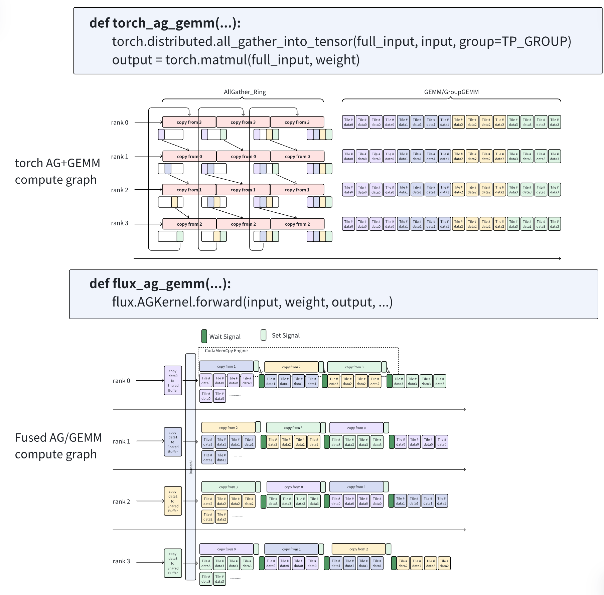
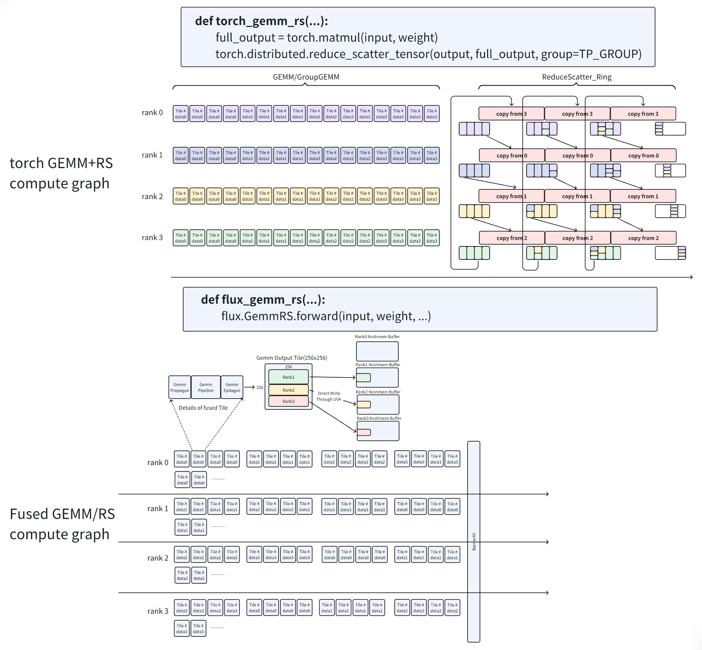

# 01 · 通算融合：GEMM 与 collective 的 tile 流水

在并行训练与推理中，GEMM 往往紧挨着 AllGather、ReduceScatter 或 AllReduce。只在框架层观察，它们是前后相接的两个 op；落到 GPU 上，却可以把原本针对整块 tensor 的依赖拆成 tile/chunk 级依赖，让已经 ready 的局部数据立刻进入下一阶段。这类 **communication–computation fusion** 的主要收益不是少一次 kernel launch，而是让计算与通信形成可持续的流水线。

本文建立这类算子的统一分析框架，重点回答 producer–consumer、tile/chunk、persistent kernel、warp specialization、in-flight 与 buffer ownership 之间的关系。集合通信的语义、ring/tree 算法和 NCCL 实现见[集合通信](../hpc/04_collectives.md)，TP/SP 为什么产生这些组合见[并行策略](../parallel/02_tp_sp/README.md)。这里以 GB200 中的 Blackwell SM100 GPU 为硬件锚点，但大部分方法同样适用于 Hopper 和更早架构。

## 1. 统一模型

假设一个 GEMM 后面紧跟 collective。最朴素的执行方式需要等整个输出物化之后再开始通信：

```text
time ──────────────────────────────────────────────►

GEMM       [==============================]
Collective                                [==========]
```

总时间近似为：

$$
T_{\mathrm{serial}} = T_{\mathrm{gemm}} + T_{\mathrm{comm}}.
$$

但 GEMM 的输出不是在最后一刻同时产生的。每个 output tile 完成沿 K 维的累加后，就可以先交给通信阶段：

```text
time ──────────────────────────────────────────────►

GEMM       [tile 0][tile 1][tile 2][tile 3]
Collective         [chunk 0][chunk 1][chunk 2][tail]
                    └──── steady state ────┘
```

忽略资源争用时，流水线时间可以粗略写成：

$$
T_{\mathrm{pipe}}
\approx
T_{\mathrm{fill}}
+ \max(T_{\mathrm{gemm}}, T_{\mathrm{comm}})
+ T_{\mathrm{drain}}.
$$

`fill` 是第一批数据 ready 之前的等待，`drain` 是 GEMM 已结束、没有后续计算可以遮住的 **communication tail**。融合的核心目标，是缩小 fill/drain，并使 steady state 中较慢的一侧不阻塞较快的一侧。

三类常见算子都可以套进同一个模型：

| 组合 | producer | consumer | ready 的数据 |
| --- | --- | --- | --- |
| GEMM + ReduceScatter | GEMM epilogue | reduce / scatter pipeline | partial output chunk |
| GEMM + AllReduce | GEMM epilogue | reduce / replicate pipeline | partial output chunk |
| AllGather + GEMM | AllGather | GEMM mainloop | remote input chunk |

前两类是 **producer-side fusion**：计算产生数据，通信消费数据。AG+GEMM 则是 **consumer-side fusion**：通信产生数据，计算消费数据。后面所有调优项，本质上都在回答五个问题：数据何时 ready、一次 ready 多少、暂存在哪里、谁负责消费、消费速度能否跟上生产速度。

## 2. Tile 与 epilogue

设 GEMM 为：

$$
C = AB,
\qquad
A \in \mathbb{R}^{M \times K},
\quad
B \in \mathbb{R}^{K \times N}.
$$

GPU 会把 $C$ 划成多个 CTA tile。一个 CTA 负责形如 $B_M \times B_N$ 的输出区域，并沿 K 维逐段执行 MMA。只有完整的 K 维累加结束，这个 output tile 才能进入 epilogue；不能把尚未完成 K-reduction 的中间 accumulator 当成最终通信数据。

在 SM100 的典型 CUTLASS GEMM 中，accumulator 位于 TMEM。标准 epilogue 再按 subtile 执行如下数据流：

```text
TMEM accumulator
      │ tcgen05.tmem_load
      ▼
registers ── cast / scale / bias / activation
      │
      ▼
SMEM epilogue buffer
      │ TMA store
      ▼
GMEM address space → L2 → 必要时访问 HBM
```

因此，epilogue 不是可有可无的“收尾函数”。即使没有 bias 或 activation，它仍负责 accumulator 的读取、类型转换、layout 变换以及最终写回。[CUTLASS 的 SM100 epilogue 说明](https://docs.nvidia.com/cutlass/latest/media/docs/pythonDSL/cute_dsl_api/utils_sm100.html)还揭示了一个重要约束：epilogue subtile 越大，迭代次数越少、TMA store 越容易高效；但它也会占用更多 SMEM，从 GEMM mainloop 的 A/B pipeline 中拿走容量，进而降低 pipeline depth。

TMA 是异步搬运引擎，而不是一种存储。少量 issuing thread 可以提交一整块 tensor transaction，数据搬运随后由硬件推进；同一个 warp 的其他 lane 不需要各自重复提交同一笔事务。于是高性能 GEMM 常把 warp 分成不同角色：load producer 负责 TMA，MMA consumer 负责 Tensor Core，epilogue warp 再处理输出。这就是 warp specialization 在本问题里的硬件背景。

通算融合所说的 tile-level epilogue，就是在“输出 subtile 已经 ready”到“写回完整 GMEM tensor”之间插入通信协议：

```text
TMEM → registers → SMEM
                      ├─ TMA store → local GMEM → communication
                      └─ device-side put/load/reduce → peer buffer
```

这里必须区分三个粒度：

| 粒度 | 决定什么 | 主要约束 |
| --- | --- | --- |
| CTA / MMA tile | GEMM 如何占用 Tensor Core 和 SM | shape、layout、寄存器/TMEM、occupancy |
| epilogue subtile | accumulator 如何分批离开 TMEM | TMA 对齐、SMEM、mainloop pipeline depth |
| communication chunk | 攒多少 ready 数据再发起通信 | 固定延迟、有效带宽、in-flight、tail |

一个 communication chunk 可以包含多个 output tile，也可以只包含一个 tile 的若干连续 subtile。把三者都叫“tile”会掩盖真正的性能旋钮。

## 3. 三类数据流

### 3.1 AllGather + GEMM

AG+GEMM 中，每个 rank 最初只持有输入 activation 的一部分。普通实现先把完整输入 AllGather 到本地，再启动 GEMM；融合实现则让某个 remote chunk 到达后，立即调度依赖它的 output tiles。



> 图：普通 AG→GEMM 与细粒度流水的对比。融合版本用 signal 表达 chunk readiness，GEMM threadblock 只等待自己依赖的数据，而不是等待整个 AllGather。（来源：[FLUX design document](https://github.com/bytedance/flux/blob/main/docs/design.md)，Apache-2.0）

这类 consumer-side fusion 的首要问题是调度：哪些 output tiles 依赖已经到达的 input chunk。若按普通 GEMM 次序调度，刚到的数据可能迟迟不被使用；因此实现通常需要 tile swizzle，让 ready chunk 对应的工作尽早进入 scheduler。

第二个问题是 remote data cache。假设 AllGather 的是 GEMM 的 A 矩阵，一个 $B_M \times B_K$ 的 A tile 会与多个 N 方向的 B tile 相乘，其粗略复用次数为：

$$
R_A \approx \left\lceil \frac{N}{B_N} \right\rceil.
$$

当 $R_A$ 较大时，第一次通过 NVLink 取回 remote tile 后把它保存在 local GMEM，后续重复从本地读取，通常能减少 remote traffic。当 $R_A$ 接近 1 时，“remote load → local store → local load”可能只是多绕一次。训练 shape 常有更宽的 N，因此 cache 往往更有吸引力；decode shape 常更小、更看重启动延迟，但这只是 workload hypothesis，不是“训练必缓存、推理必直读”的规则。

### 3.2 GEMM + ReduceScatter

在 row-parallel GEMM 中，各 rank 沿 K 维计算 partial output。设 TP size 为 $p$，每张卡得到：

$$
Y^{(0)}, Y^{(1)}, \ldots, Y^{(p-1)},
\qquad
Y = \sum_{r=0}^{p-1} Y^{(r)}.
$$

ReduceScatter 不要求每张卡获得完整 $Y$，而是把 $Y$ 切成 $p$ 个 shard，第 $j$ 个 shard 的 owner 只需要：

$$
Y_j = \sum_{r=0}^{p-1} Y_j^{(r)}.
$$

因此，最直接的数据流是每个 rank 的 epilogue 把 $Y_j^{(r)}$ 送往 owner $j$，reduction 就在最终 owner 上完成。规约后的结果已经位于目标 rank，不需要再进行一次“规约后 scatter”。Ring ReduceScatter 则会让 chunk 沿 ring 逐跳传递，每个中继 rank 收到 chunk 后先加上本地 contribution，再继续转发；它仍然是在 chunk 的最终 owner 处结束，只是 reduction 被分散到了多个 hop。



> 图：普通 GEMM→ReduceScatter 与 epilogue 直接 remote write 的对比。下半部分按 output tile 的 owner 重排计算次序，使早完成的 tile 可以立刻进入通信。（来源：[FLUX design document](https://github.com/bytedance/flux/blob/main/docs/design.md)，Apache-2.0）

这类 producer-side fusion 的关键，是让 output tile 的产生顺序与 collective 的 owner/chunk 顺序匹配。若 tile 先散乱地写到许多 owner，每个目标都只有少量 ready bytes，通信很难形成有效流水；按 owner 或连续地址做 tile swizzle，可以更快凑出第一个可发送 chunk。

### 3.3 GEMM + AllReduce

GEMM+AR 和 GEMM+RS 同样从 partial output 开始，但最终每个 rank 都要得到完整的规约结果。也就是说，结果是 replicated，而不是 sharded：

$$
Y_j^{\mathrm{out}} = \sum_{r=0}^{p-1}Y^{(r)},
\qquad 0 \le j < p.
$$

从语义上看，AllReduce 等价于 ReduceScatter 后再 AllGather。这意味着 GEMM+AR 通常比 GEMM+RS 多一个“把 owner 上的规约 shard 分发给所有 rank”的阶段，也更容易留下 exposed tail。另一方面，小 M 的推理 GEMM 可能没有足够多 output tiles 建立长流水，直接选择针对小消息优化的 fused AllReduce，反而可能比“精细切分后再 RS+AG”更合适。这个选择取决于 shape、TP size 和拓扑。

在 NVSwitch scale-up 域内，NCCL Device API 可以取得 LSA multimem pointer，并用 `multimem.ld_reduce` 把多个 rank 对应地址的数据在硬件路径上规约；[官方示例](https://docs.nvidia.com/deeplearning/nccl/user-guide/docs/usage/deviceapi.html)展示了 device kernel 如何构造这种 AllReduce。它可以减少显式 reduction worker 的工作，但仍需要 symmetric window、跨 rank barrier 和严格的 buffer ownership。multimem 是“一个逻辑地址映射到多份物理 backing”的地址/指令机制，不是新的存储层级。

三类数据流的差异可以归结为数据所有权：

| 组合 | 初始数据 | 最终数据 | 调度重点 |
| --- | --- | --- | --- |
| AG+GEMM | input 分片 | 每 rank 消费完整输入，输出按 GEMM layout | remote chunk readiness、输入复用 |
| GEMM+RS | 每 rank 的 partial output | 每 rank 持有一个规约 shard | owner-aware output 顺序、reduce 路径 |
| GEMM+AR | 每 rank 的 partial output | 每 rank 持有完整规约结果 | reduce 后 replication、tail |

## 4. Chunk 与吞吐平衡

设每 $q$ 个 output tiles 聚合成一个 communication chunk，其字节数为 $C(q)$。产生这批数据的时间为 $T_{\mathrm{produce}}(q)$，通信时间可以写成一个简化的 α-β 模型：

$$
T_{\mathrm{comm}}(C, s)
=
\alpha(C, s)
+
\frac{C}{B_{\mathrm{eff}}(C, s)},
$$

其中 $s$ 是通信 worker 的资源预算，$B_{\mathrm{eff}}$ 是该消息大小与并发度下的实测有效带宽。小 chunk 往往受固定延迟和 transaction 并发度限制，不能直接使用链路峰值带宽代入。

producer 和 consumer 的字节率分别为：

$$
R_{\mathrm{produce}} = \frac{C}{T_{\mathrm{produce}}},
\qquad
R_{\mathrm{consume}} = \frac{C}{T_{\mathrm{comm}}}.
$$

要让 steady state 不持续积压，至少需要 $R_{\mathrm{consume}} \ge R_{\mathrm{produce}}$。但这不是两个独立 benchmark 的简单比较：通信 worker 会争用 SM、L2、TMA 或 fabric，增加 $s$ 可能提高通信吞吐，也可能同时拖慢 GEMM。最终应比较**融合后的 producer rate 与 consumer rate**。

这也解释了一个反直觉结论：通信没有达到 80% 峰值带宽，并不代表融合失败。如果较小 chunk 只有 40% 带宽，却能在下一批 GEMM 完成前被完全消费，而且没有拖慢 GEMM，那么提高通信单项带宽对端到端时间没有帮助，反而可能因为攒包更久而增大 tail。

类似“每个 communication SM 保持 8 KB in-flight 后达到 80% 带宽”的数字，应理解为某个实现、拓扑和数据类型上的 microbenchmark 结果，而不是 Blackwell 的架构常数。它描述的是灌满 pipeline 所需的 minimum outstanding bytes；`每 SM 8 KB` 也不等于“每次调用只能或必须发送 8 KB”。

chunk 选择同时影响四本账：

| chunk 变化 | 收益 | 代价 |
| --- | --- | --- |
| 更小 | 更早 ready，fill/tail 更小，buffer 更省 | 固定延迟占比高，带宽利用低，signal/metadata 更多 |
| 更大 | 容易打满链路，单位字节协议开销低 | 启动更晚，tail 更粗，SMEM/GMEM buffer 与 bookkeeping 增长 |

因此不存在跨 shape 通用的最佳 tile/chunk。M 和 N 决定 output tile 数量与并行度，K 决定一个 tile 完成累加需要多久，dtype 决定每个 tile 的字节数；TP size 和拓扑又决定每个 owner 的流量与 collective 算法。生产实现通常需要 shape-dependent heuristic 或 autotune。

## 5. Persistent kernel

普通 CUDA scheduler 会在一个 CTA 结束后继续向空闲 SM 调度新 CTA，但新 CTA 不会继承上一 CTA 的 registers、SMEM、barrier、queue cursor 或 worker role。persistent kernel 的区别不是“让 SM 持续有活干”，而是让同一个 CTA 长期存在，初始化一次状态后从软件 work queue 反复领取 tile：

```cpp
initialize_pipeline();

while (true) {
    WorkTile tile = scheduler.next();
    if (!tile.valid()) break;
    compute_or_communicate(tile);
}
```

长期存在的 worker 很适合通算融合，因为算子不再只是“算完一个 tile 就退出”，而是一个带状态的生产消费系统。常见组织方式有两类。

### 5.1 CTA 内分工

同一个 CTA 内部使用 warp specialization：

```text
TMA producer warp ──► SMEM stage ──► MMA consumer warp
                                          │
                                          ▼
                                    epilogue / comm warp
```

优点是 SMEM buffer 和 `mbarrier` 都在 CTA 内，交接延迟低，不需要跨 CTA 的全局 queue。代价是长延迟 remote I/O 会延长 CTA 对 SMEM、registers 和 SM residency 的占用；如果通信直接插入已高度优化的 persistent GEMM pipeline，也可能破坏原本的 MMA/epilogue overlap。

### 5.2 独立 worker

另一种方式是在同一个 persistent grid 中让部分 CTA 负责 GEMM，另一部分负责 communication：

```text
compute workers ──► ready queue ──► communication workers
       ▲                                      │
       └──────────── free credits ◄───────────┘
```

这种设计可以显式调节 communication worker 数量，也能让 GEMM CTA 尽快释放自己的 epilogue buffer。工程师所说的“给通信分几个 SM”，通常指的是同时常驻的 communication CTA 预算，而不是 CUDA 提供了一个通用 API，把若干物理 SM 永久钉死给某类代码。实现可以通过 persistent grid 大小、CTA role 和 occupancy 约束形成近似稳定的资源分区，但仍需遵守 CUDA 的 block 调度语义。

还有第三种情况：通信由 Copy Engine、NVSwitch reduction 或 NIC 推进，不需要常驻 communication CTA。它能把更多 SM 留给 GEMM，但并不意味着零成本，fabric、L2、TMA 和内存带宽仍可能与计算竞争。

## 6. In-flight 与 ownership

**In-flight data** 是已经发起、尚未完成的通信数据。它之所以重要，是因为单笔 transaction 往往包含等待时间；只有同时保留足够多独立工作，硬件才可以在一笔等待时推进其他 transaction。过少会暴露 latency，过多则会占用 buffer、queue entry、credit 和共享资源。

实现中还要记录每笔 transaction 对应的 source slot、destination、generation、completion 条件与可回收 credit，这组状态通常称为 **outstanding bookkeeping**。它不是附带的统计信息，而是决定 buffer 能否安全复用的协议本身。

一个可靠的 slot 生命周期至少包含：

```text
FREE → PRODUCING → READY → IN_FLIGHT → FREE
```

- `PRODUCING`：GEMM 正在写这个 slot，consumer 不能读。
- `READY`：数据与 metadata 已完成写入，consumer 可以领取。
- `IN_FLIGHT`：通信已发起，但远端完成或本地 source reuse 条件尚未满足。
- `FREE`：上一代数据的所有消费者已经完成，producer 才能覆盖。

只有 `FREE/READY` 两态通常不够。若 producer 在通信真正完成前重用 slot，旧 transaction 可能读取到新数据；循环队列还会遇到 slot index 相同、generation 不同的 ABA 问题。常见解法是 credit 或 sequence number：每个 slot 带递增 generation，producer/consumer 用 acquire/release 语义发布数据与状态，并把“远端可见”和“本地 source 可重用”作为两个可能不同的完成条件。

double buffer 只是最小的 credit system：

```text
buffer 0: PRODUCE 0 ─ COMM 0 ─ PRODUCE 2 ─ COMM 2
buffer 1:           PRODUCE 1 ─ COMM 1 ─ PRODUCE 3
```

如果 consumer 比 producer 慢，两个 buffer 很快都会变成 `IN_FLIGHT`，producer 仍会被 backpressure 卡住；继续增加 stage 只能吸收短期抖动，不能修复长期的吞吐不平衡。

跨卡写入也不存在“找一个空旷的远端 GMEM 地址”这件事。发送前必须由协议共同约定 destination buffer、rank-relative offset、slot owner 和 generation。远端地址中是否已有数据并不由硬件判断；若没有确认旧 owner 已释放，remote write 就会直接覆盖仍在使用的内容。symmetric window 解决的是各 rank 地址映射与寻址，signal/barrier/credit 解决的才是 ownership。

调试这部分时，最值得观察的不是单个 API latency，而是：

- bytes in-flight 与独立 transaction 数量；
- free credits、ready queue 深度和 communication backlog；
- issue 到 completion 的延迟；
- GEMM 结束时仍 outstanding 的字节数；
- generation/ownership 错误是否只在 buffer wrap-around 后出现。

## 7. 中间数据放置

output subtile ready 后，最典型的两条路径是 SMEM resident 与 GMEM staging。

### 7.1 SMEM resident

数据从 TMEM 经 registers 写入 SMEM 后，直接由 device-side communication 发往 peer，不先物化到 local GMEM。NVSHMEM 已经提供了这种公开路径：CTA 可以注册 shared memory，再让符合条件的 block-scoped put 通过 TMA/NVLink 发送；见[官方 TMA 使用说明](https://docs.nvidia.com/nvshmem/api/latest/tma.html)。

这条路径省掉一次 local GMEM store 和后续 communication load，但通信完成前 SMEM slot 不能重用。以 NVSHMEM 的非阻塞 TMA put 为例，`flush` 可以表示 local source 已可安全复用，`quiet` 才表示远端完成；两者不能混为一个 completion 条件。double/triple buffer 会进一步扩大 SMEM 占用，挤压 GEMM mainloop 的 pipeline stages；persistent CTA 也会因为仍持有这批资源而延长生命周期。

### 7.2 GMEM staging

另一条路径先用 TMA 把 epilogue subtile 写到 local GMEM，再由独立 worker 消费：

```text
TMEM → registers → SMEM → TMA store → local GMEM
                                      │
                                      └─ communication worker
```

逻辑上它多了一次 store/load，却能更早释放 GEMM 的 SMEM，让计算和通信生命周期解耦。如果 communication 很快读取刚写入的地址，数据可能仍在 L2，未必发生完整的 HBM 往返；但 cache policy 只是 performance hint，不能把 L2 hit 当正确性前提。

两条路径的取舍不是简单的“少搬一次一定更快”：

| 路径 | 主要收益 | 主要风险 |
| --- | --- | --- |
| SMEM resident | 少一次 intermediate materialization，启动早 | SMEM/CTA 持有时间长，pipeline depth 与 occupancy 下降 |
| GMEM staging | 资源生命周期解耦，queue 容量大，独立 worker 易调度 | 额外 memory traffic，依赖实际 L2 locality 才能减轻 HBM 压力 |

因此，通算融合同时优化两种成本：**data movement** 与 **resource lifetime**。只数逻辑字节，而不看 buffer 占用了多久，往往会选错方案。

## 8. 实现路径

实现这类算子不等于必须使用 NVSHMEM，也不等于必须从裸 CUDA 开始。当前常见路径可以分成三层。

第一层是成熟库。NVIDIA [cuBLASMp](https://docs.nvidia.com/cuda/cuest/usage/tp.html)已经把 AG+Matmul、Matmul+RS 和 Matmul+AR 作为 distributed matmul 形态提供，并要求合适的 symmetric memory/workspace 才能启用高性能 overlap 算法。Transformer Engine 的 [Userbuffers](https://docs.nvidia.com/deeplearning/transformer-engine/user-guide/api/pytorch.html#communication-computation-overlap)则面向 TP linear 暴露 `num_sm`、`num_splits`、pipeline/ring exchange、Copy Engine 等配置。验证系统收益时，应优先用这些实现建立基线。

第二层是 CUDA C++ + CUTLASS/CuTe。GEMM mainloop、TMEM epilogue、tile scheduler 可以复用 CUTLASS/CuTe，通信侧再接 NCCL Device API、NVSHMEM 或自定义 P2P 协议。这条路径能精确控制 SMEM layout、warp role、barrier、persistent scheduler 和 remote I/O，适合针对 SM100 做 production-grade 深度优化。[FLUX](https://github.com/bytedance/flux)就是公开的代表性实现。

第三层是带分布式原语的 DSL。[Triton-distributed](https://github.com/ByteDance-Seed/Triton-distributed)已经提供 AG+GEMM、GEMM+RS、GEMM+AR 等算子与 tile-centric 编程能力。普通 Triton 本身擅长单 GPU tile 计算；一旦需要 remote put/get、跨 rank signal 和 symmetric memory，还必须有相应的 distributed runtime/primitive，不能仅靠把两个 Triton program 写进同一文件获得融合。

NVSHMEM 的价值在于 PGAS、device-side put/get、signal 和 TMA path；NCCL Device API 则复用 NCCL communicator、LSA/multimem/GIN 等能力。它们是不同的通信底座，不是“通算融合”本身。若项目代码中出现 `WASP AllReduce` 一类名字，也应先定位具体库和接口：截至本文调研，`WASP` 不是 CUDA、NCCL、NVSHMEM 或 CUTLASS 的公开标准 AllReduce 名称，不能仅凭 acronym 推断其协议。

## 9. 调优与验证

通算融合的最小调优空间通常包括：

- CTA tile、cluster shape 与 GEMM schedule；
- epilogue subtile 与 SMEM stages；
- tiles per chunk、`num_splits` 与 ring/tree/direct-owner 算法；
- communication CTA/SM budget 与每 worker in-flight 上限；
- double/triple buffer、queue depth 与 signal 粒度；
- SMEM resident、GMEM staging、remote cache 与 L2 policy。

这些参数必须放进 workload matrix 中评估。至少要覆盖训练、prefill、decode 的代表性 M/N/K，多个 dtype、TP size 与 scale-up 拓扑。只在一个方阵 GEMM 上得到的最优配置，很容易在 skinny decode GEMM 上退化。

profiling 时，建议把端到端时间拆成以下几项：

| 指标 | 用途 |
| --- | --- |
| fused latency 与非融合基线 | 判断优化是否真的缩短关键路径 |
| standalone GEMM vs fused GEMM throughput | 检查通信是否拖慢计算 |
| exposed communication tail | 判断 chunk 是否过大或 producer 结束过早 |
| effective bandwidth 与 backlog | 判断 consumer 是否跟得上 producer |
| SM/Tensor Core 利用、occupancy、SMEM | 判断 worker 和 resident buffer 是否抢资源 |
| L2 hit、HBM read/write bytes | 判断 GMEM staging 是否被 cache 吸收 |
| queue depth、credits、completion latency | 判断 in-flight 是否不足或过量 |

Nsight Systems 适合观察 GEMM、communication worker 与 tail 的时间关系，Nsight Compute 适合检查单个 kernel 的 SMEM、occupancy、L2/HBM 与 Tensor Core 指标；具体工具见[性能分析](../profiling/README.md)。正确性测试还必须覆盖 queue wrap-around、不同 rank 速度不一致、边界 tile、非整除 shape 和多轮复用，否则 ownership bug 很可能只表现为偶发的静默数据错误。

一个稳妥的开发顺序是：先写独立的 device-side communication microbenchmark，测出 `bandwidth(chunk, workers, in-flight)`；再用 GMEM staging 接通最小 GEMM+communication pipeline，把 signal、queue 和 ownership 做对；之后再尝试 SMEM-direct、persistent worker 与更复杂的 tile swizzle。这个顺序能把“协议不正确”和“GEMM 不够快”分开排查。

## 参考资料

- Chang et al., *FLUX: Fast Software-based Communication Overlap On GPUs Through Kernel Fusion*, 2024. [arXiv:2406.06858](https://arxiv.org/abs/2406.06858)；[官方实现与 design document](https://github.com/bytedance/flux)。
- Zhang et al., *TileLink: Generating Efficient Compute-Communication Overlapping Kernels using Tile-Centric Primitives*, MLSys 2025. [OpenReview](https://openreview.net/forum?id=e306115ee36062ed9070e4095d2ad539)。
- NVIDIA, [Using cuBLASMp for Tensor Parallelism in Distributed Machine Learning](https://docs.nvidia.com/cuda/cuest/usage/tp.html)。
- NVIDIA CUTLASS, [Blackwell SM100 epilogue flow and tile-size constraints](https://docs.nvidia.com/cutlass/latest/media/docs/pythonDSL/cute_dsl_api/utils_sm100.html)。
- NVIDIA NVSHMEM, [Using TMA with NVSHMEM](https://docs.nvidia.com/nvshmem/api/latest/tma.html)。
- NVIDIA NCCL, [Device-Initiated Communication](https://docs.nvidia.com/deeplearning/nccl/user-guide/docs/usage/deviceapi.html)。
- NVIDIA Transformer Engine, [Communication-computation overlap](https://docs.nvidia.com/deeplearning/transformer-engine/user-guide/api/pytorch.html#communication-computation-overlap)。
- ByteDance Seed, [Triton-distributed](https://github.com/ByteDance-Seed/Triton-distributed)。
