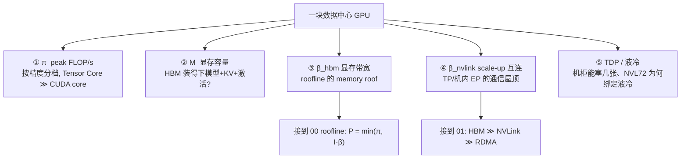
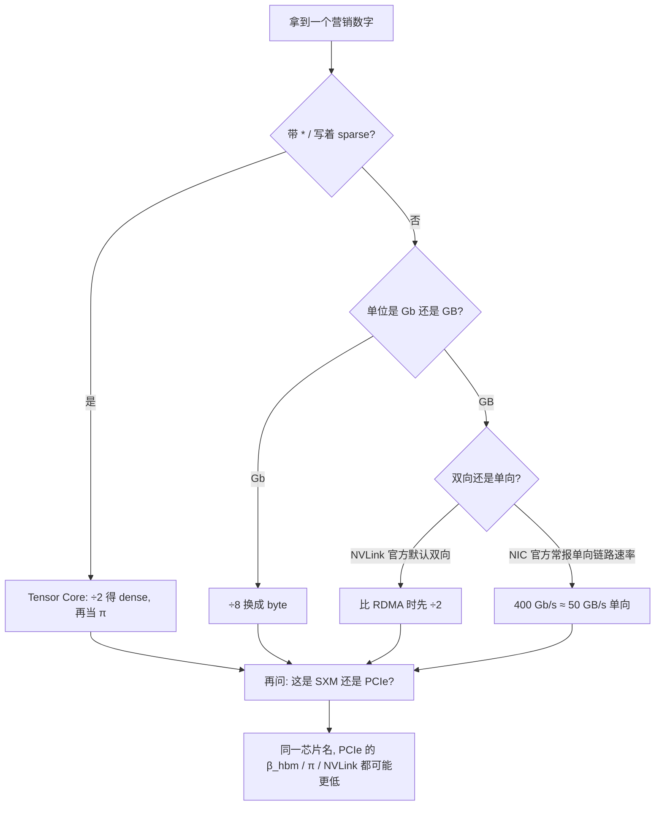
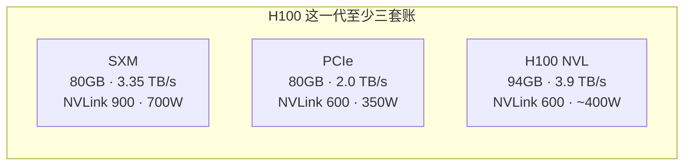
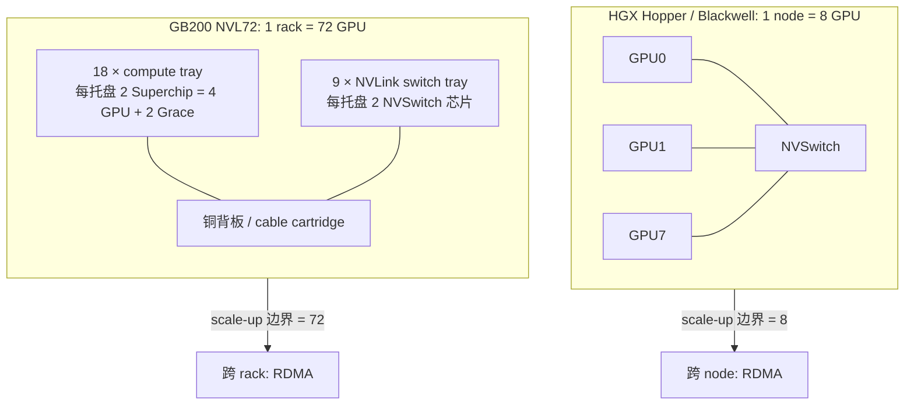
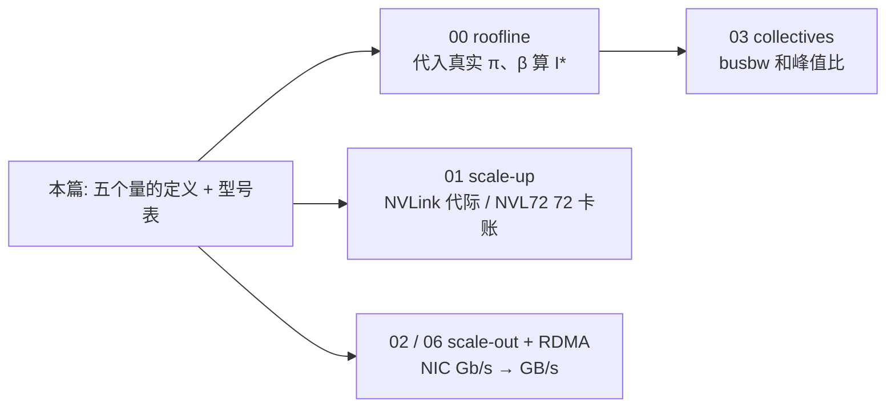

# 00 · GPU 硬件参数：常用量与主流型号对照

> 本篇是整章的数字字典。后面 [00 · Roofline model：两道天花板](./00_roofline_model.md) 里的两道天花板 $\pi$ / $\beta$、[`01`](./01_scale_up_nvlink_nvl72.md) 的带宽瀑布、[`04`](./04_collectives.md) 的 $\alpha$-$\beta$，全都要挂到这些量上。这一篇先把每个参数的语义、单位、读 datasheet 时容易踩的坑说清楚，再给出主流 NVIDIA 数据中心 GPU 的对照表——这些数字是用来推导的，不是用来背的。
>
> 读这一篇之前，只需要知道 GPU 同时受「算得快」和「搬得快」两方面约束就够了；peak FLOP/s、HBM、NVLink、dense/sparse、SXM vs PCIe 这些概念都会在正文里定义。
>
> 上一篇 [GPU 集群与网络](./README.md) 讲了「两个域 + 几个平面」这个全景框架。本篇要做的，是把那两个域里「一块卡到底有多快、能装多少、互连有多宽」写成一本可以随时查的账。

参考 / 事实来源（优先官方页与 OEM datasheet；营销数字带 `*` 的一律按 §1.2 折半）：

- NVIDIA 产品页：[H100](https://www.nvidia.com/en-us/data-center/h100/)、[H200](https://www.nvidia.com/en-us/data-center/h200/)、[GB200 NVL72](https://www.nvidia.com/en-us/data-center/gb200-nvl72/)（页脚写明 Tensor Core 数字默认 **sparse**，dense = 一半）。
- NVIDIA Hopper / Blackwell architecture datasheet（H100 SXM 80GB HBM3 @ 3.35 TB/s、NVLink 900 GB/s；B200 180GB HBM3E @ 7.7 TB/s、NVLink 5 1.8 TB/s）。
- A800 / H800：Lenovo ThinkSystem OEM datasheet（A800 相对 A100 只砍 NVLink 600→400 GB/s；H800 PCIe 另把 FP64 压到 0.8 TFLOPS）。
- 本仓库实测锚点：DeepGEMM 在 **H800** 上 FP8 GEMM 到 **1550 TFLOPS**（[[deepgemm:README.md#L23]]）——对照 H800/H100 的 FP8 dense peak ~1979 TFLOPS，约 78% 的 compute roof。

---

## 0. 一块 GPU 的五本账

读懂一块卡，其实只需要先抓住五个量：算力 $\pi$、显存容量 $M$、显存带宽 $\beta_{\mathrm{hbm}}$、scale-up 互连 $\beta_{\mathrm{nvlink}}$、功耗 TDP。其余像精度、form factor、PCIe、NIC 这些，都可以看作是这五本账的注释。LLM infra 里绝大多数「这块卡适不适合训练 / decode / MoE」的判断，其实都能从这五个数字里推出来。



这五个量分别怎么用，可以用一张表来对应：

| 量 | 单位 | 决定什么 | 接到哪一篇 |
|---|---|---|---|
| $\pi$ | FLOP/s（**按精度**） | compute-bound 算子的上界 | [`00` roofline](./00_roofline_model.md) 的水平屋顶 |
| $M$ | GB | 单卡能放下的参数 / KV cache / 激活 | serving 的 batch、训练的 micro-batch |
| $\beta_{\mathrm{hbm}}$ | TB/s | memory-bound 算子的上界（decode、norm、读 KV） | [`00`](./00_roofline_model.md) 的斜线屋顶 |
| $\beta_{\mathrm{nvlink}}$ | GB/s（**双向合计**，见 §1.5） | 机内/rack 内 collective 的通信屋顶 | [`01`](./01_scale_up_nvlink_nvl72.md) |
| TDP | W | 功率密度、是否必须液冷、机柜 GPU 数 | [`01` §5.3](./01_scale_up_nvlink_nvl72.md)、[`05`](./05_reliability_at_scale.md) 故障域 |

---

## 1. 常用参数：先定义、后对照

下面每个量都先说清楚它量的到底是什么、单位怎么换算、datasheet 里哪个括号容易让人算错一倍。§2 的对照表只有在这些定义之上才可读。

### 1.1 peak compute `π`：每秒多少次浮点运算

$\pi$ 指的是硬件在某一精度、某一执行单元上，理论上每秒能完成的浮点运算次数，单位是 FLOP/s（tera- = 10¹²，peta- = 10¹⁵）。

要让这个数字可比，必须同时声明三件事：

1. **精度**：同一块 H100，FP32 CUDA core 只有 67 TFLOPS，BF16 Tensor Core dense 已经是 ~989 TFLOPS，FP8 再翻一倍。$\pi$ 和精度是强绑定的，[`00`](./00_roofline_model.md) 里算 ridge point 时必须用「你实际在跑的那一档」精度对应的 $\pi$。
2. **执行单元**：Tensor Core（矩阵乘加，LLM 的 GEMM / attention 主路径）远高于同精度的 CUDA core。datasheet 上不标 "Tensor Core" 的 FP32/FP64 是 CUDA core 峰值，不能拿去当训练 peak 用。
3. **dense vs sparse**：见下一小节。NVIDIA 官网页上带 `*` 或脚注 "specification in sparse" 的 Tensor Core 数字，默认是 2:4 structured sparsity 的稀疏峰值，dense 只有它的一半。

LLM 训练 / prefill 真正该看的 $\pi$，按精度列一下大致的倍数关系：

| 精度 | 谁在用 | 和 BF16 的大致倍数（Hopper/Blackwell Tensor Core） |
|---|---|---|
| BF16 / FP16 | 训练、激活的主流 | 1×（本表基准） |
| FP8 / FP6 | 训练通信与 GEMM（DeepGEMM）、推理 | ~2× |
| NVFP4 | Blackwell 推理 | ~4×（相对 BF16） |
| TF32 | 未显式用半精度的 TF32 GEMM | ~0.5× |
| FP32 / FP64 | 数据准备、部分 HPC；**不是** LLM 主路径 | 低 1～2 个数量级 |

本仓库的计算锚点是：DeepGEMM 在 H800 上把 FP8 GEMM 干到了 **1550 TFLOPS**（[[deepgemm:README.md#L23]]）。而 H100/H800 SXM 的 FP8 Tensor Core **dense** peak 约为 1979 TFLOPS，所以这个数字是真实贴着 compute roof 打的证据，而不是营销用的稀疏峰值。

### 1.2 2:4 structured sparsity：营销数字为什么经常是 2×

Ampere 开始，Tensor Core 支持 **2:4 structured sparsity**：每 4 个连续权重里必须恰好有 2 个非零，硬件可以跳过零元、让吞吐翻倍。NVIDIA 官网页 / datasheet 上的 Tensor Core 峰值经常就是按「开了 sparsity」来报的。

```
dense π   = 硬件对稠密矩阵的峰值
sparse π  = 2 × dense π    （仅当权重满足 2:4 结构时可达）

roofline / MFU 的分母必须用 dense π
——训练权重几乎都是稠密的；推理若没走 2:4 sparse kernel，也不该用 sparse π。
```

读表时可以记一个口诀：看到 H100 BF16 = 1979 TFLOPS 带 `*`，心里先除以 2 得到 **989**，再拿去算 $I^* = \pi/\beta$。这一步搞反一次，ridge point 和 MFU 的结论就会全部偏一倍。

### 1.3 显存容量 `M`：HBM 能装多少

$M$ 指的是这块 GPU 上 HBM（High Bandwidth Memory）的容量，单位是 GB。它是一堵容量墙，和带宽墙 $\beta_{\mathrm{hbm}}$ 是两件不同的事。

LLM 里 $M$ 大致被三块东西瓜分（这里给的是粗账，$s$ 表示精度对应的字节/参数）：

```
参数     ≈  #params · s                          （BF16 70B ≈ 140 GB, 一张 H100 80GB 装不下）
KV cache ≈  2 · layers · kv_heads · head_dim · seq · batch · s
激活     ≈  随 micro-batch、序列、是否重计算 线性涨
```

在训练场景里，$M$ 要装参数、优化器状态（Adam 大约 8–16 字节/参数，ZeRO/FSDP 可以切分）以及激活，$M$ 的大小直接决定单卡能承受多大的 micro-batch，进而影响 DP/PP 怎么切。在 decode 场景里，权重往往还能放得下，真正的瓶颈变成了 KV cache 会随上下文长度线性增长——这也是为什么 H200（141 GB）相对 H100（80 GB）在长上下文推理上，即便算力没变，只加了显存也依然很值钱（细节见 §3）。

HBM 的代际演进是：HBM2（V100）→ HBM2e（A100）→ HBM3（H100）→ HBM3e（H200/B200）。每一代主要抬升的是带宽和容量；计算架构的演进则是另一条独立的线（Volta → Ampere → Hopper → Blackwell）。

### 1.4 显存带宽 `β_hbm`：HBM 每秒能搬多少

$\beta_{\mathrm{hbm}}$ 是 HBM 控制器的峰值吞吐，单位 TB/s（即 10¹² byte/s）。它就是 [`00`](./00_roofline_model.md) 里 memory roof 的斜率。

$\beta_{\mathrm{hbm}}$ 和 $M$ 是两个相互独立的量：H200 相对 H100 算力几乎不变，但 $M$ 从 80 涨到 141 GB、$\beta$ 从 3.35 涨到 4.8 TB/s。对 decode（见 [`00` §2.2](./00_roofline_model.md) 的 GEMV 分析，$I \approx 2/s$）而言，性能上界几乎就是 $\beta_{\mathrm{hbm}}$，所以 H200 可以理解成一次「同计算、换带宽」的升级。

粗算一下一次 decode 步要搬多少 HBM 流量：需要把整份权重扫一遍。70B 的 BF16 模型约 140 GB，H100 的 3.35 TB/s 理论上限大约是 `3350/140 ≈ 24` step/s（这还没算上 KV cache、也没算实际效率）。数量级上的直觉是：decode 的 token/s 天花板首先要看 $\beta/M_{\mathrm{weights}}$，而不是 $\pi$。

### 1.5 NVLink 带宽 `β_nvlink`：scale-up 域的屋顶

NVLink 是 GPU 之间的专用互连。datasheet 上给出的 GB/s 数字默认是双向合计（bidirectional aggregate）：H100 SXM 的 900 GB/s，实际每个方向大约是 450 GB/s。和 RDMA NIC 常见的「400 Gb/s ≈ 50 GB/s **单向**」这种写法相比时，必须先统一到同一个方向，否则会先错一个 2 倍（双向 vs 单向），再错一个 8 倍（bit vs byte）。

| 代际 | 典型卡 | 双向合计（官方） | 单向约 | 域内 GPU 数 |
|---|---|---|---|---|
| NVLink 2 | V100 | 300 GB/s | 150 GB/s | 8（DGX-1 半）/ 8 |
| NVLink 3 | A100 | 600 GB/s | 300 GB/s | 8（HGX） |
| NVLink 3（出口） | A800 | **400 GB/s** | 200 GB/s | 8 |
| NVLink 4 | H100 / H200 | 900 GB/s | 450 GB/s | 8 |
| NVLink 4（出口） | H800 | **400 GB/s** | 200 GB/s | 8 |
| NVLink 5 | B200 / GB200 | 1.8 TB/s | 900 GB/s | 8（HGX）或 **72（NVL72）** |

NVSwitch 的作用是把「点对点的几条 NVLink」收成域内全连接：任意两块 GPU 之间的带宽都是对等的。没有 NVSwitch 的 PCIe 卡（比如 L40S、部分 PCIe SKU）只能靠 NVLink Bridge 两两相连，或者干脆只走 PCIe——这种情况下不能按 SXM 的 $\beta_{\mathrm{nvlink}}$ 去估算 TP 的通信开销。

DeepEP 在 H800 上测到机内 dispatch 达到 **153 GB/s**（[[deepep:docs/legacy.md#L23-L26]]）：H800 单向 NVLink 的理论峰值约 200 GB/s，153 是实际利用率，并不是说「NVLink 只有 153」。在 SM100 / Blackwell 上，同一条路径能到 **726 GB/s**（[[deepep:README.md#L50]]），这对应的正是 NVLink 5 单向 900 GB/s 这个量级。

### 1.6 PCIe、NIC，以及 bit / byte 的区别

GPU 出了 scale-up 域之后，数据还要经过：

| 链路 | 官方常见写法 | 换成单向 GB/s（约） | 谁用 |
|---|---|---|---|
| PCIe Gen4 ×16 | 64 GB/s（双向约 32+32） | ~32 | A100 主机通道 |
| PCIe Gen5 ×16 | 128 GB/s | ~64 | H100 主机通道 |
| ConnectX-7 IB NDR | **400 Gb/s** | 400/8 = **50 GB/s** | Hopper 代 scale-out |
| ConnectX-8 | **800 Gb/s** | **100 GB/s** | Blackwell 代 SuperNIC |

这里最容易出错的一点是：`Gb/s` 是 Gigabit，`GB/s` 是 Gigabyte，两者差 8 倍。这是读 NIC datasheet 时最常见的错误。[`02`](./02_scale_out_topology_planes.md) 里把 400 Gb/s 换算成 50 GB/s，用的就是这个换算关系。另外 PCIe 的数字有人报单向、有人报双向，做对比时要先把方向对齐。

### 1.7 form factor 与 TDP：SXM vs PCIe vs 超节点

同一个架构会做成多种板型，而算力、带宽、功耗会一起随板型变化，所以不能只看芯片名字：

| form factor | 怎么装 | 典型后果 |
|---|---|---|
| **SXM** | 焊在 HGX 基板，经 NVSwitch 全连 | 最高 TDP、满血 HBM/NVLink；训练默认 |
| **PCIe** | 插槽卡，可选 NVLink Bridge（通常 2 卡） | TDP 更低、HBM 带宽常打折（H100 PCIe 2.0 vs SXM 3.35 TB/s） |
| **NVL / Superchip** | 两卡桥接或 Grace+GPU 封装 | H100 NVL 94GB；GB200 = 1 Grace + 2 GPU |
| **NVL72 tray** | 1U 计算托盘，4 GPU + 2 Grace，铜背板进 NVSwitch | 单卡 TDP 提到 1200W 量级，**必须液冷** |

TDP（Thermal Design Power）本质上是一本机柜账：8×H100 SXM 大约 5.6 kW，这还只算了 GPU；NVL72 整柜是几十到上百 kW 的量级，这也是为什么 [`01` §5.3](./01_scale_up_nvlink_nvl72.md) 会说 rack-scale 超节点和液冷数据中心是绑定出现的。

### 1.8 读 datasheet 的五条铁律



把上面的坑归纳成五条：

1. **sparse 先折半**，再拿去算 roofline / MFU。
2. **bit 不等于 byte**，两者差 8 倍。
3. **NVLink 官方数字默认是双向合计**，和 HBM、RDMA 比较时要先统一成单向。
4. **SXM ≠ PCIe ≠ NVL72 里那颗 GPU**（比如 B200 HGX 是 180GB/7.7 TB/s/1000W，而 NVL72 里对应的那颗是 186GB/8 TB/s/1200W）。
5. **中国区 SKU 通常优先砍互连**（A800/H800 的 NVLink 被限到 400 GB/s），有的 PCIe SKU 还会再砍 FP64——算力数字看着差不多，但 TP 一开就会露馅。

---

## 2. 主流 NVIDIA 数据中心 GPU 对照

下表里 Tensor Core 的数字给的是 **dense**（roofline 该用的口径），括号里是官方常报的 sparse 数字。除非特别说明，NVLink 一律按双向合计计。数字会随 SKU/步进微调，这里的数字应当按量级来用，用于推导而不是精确核对。

### 2.1 总表：训练 / 推理最常见的几块卡

| 型号 | 架构 | 显存 $M$ | $\beta_{\mathrm{hbm}}$ | BF16 TC $\pi$ dense（sparse） | FP8 TC dense（sparse） | NVLink 双向 | TDP | 典型定位 |
|---|---|---|---|---|---|---|---|---|
| **V100 SXM2** | Volta | 32 GB HBM2 | 0.90 TB/s | 125（无 2:4） | — | 300 GB/s | 300 W | 历史基线 |
| **A100 SXM** | Ampere | 80 GB HBM2e | 2.04 TB/s | 312（624） | — | 600 GB/s | 400 W | 上一代训练主力 |
| **A800 SXM** | Ampere | 80 GB HBM2e | ~2.0 TB/s | 312（624） | — | **400 GB/s** | 400 W | A100 出口版，只砍互连 |
| **H100 SXM** | Hopper | 80 GB HBM3 | 3.35 TB/s | 989（1979） | 1979（3958） | 900 GB/s | 700 W | 当前最常见训练卡 |
| **H800 SXM** | Hopper | 80 GB HBM3 | ~3.35 TB/s | ≈ H100 | ≈ H100 | **400 GB/s** | ~700 W | 国内训练主力；互连腰斩 |
| **H100 PCIe** | Hopper | 80 GB HBM3 | 2.0 TB/s | ~756（1513） | ~1513（3026） | 600 GB/s | 350 W | 功耗墙下的打折 Hopper |
| **H800 PCIe** | Hopper | 80 GB HBM2e | 2.0 TB/s | 756* 档 | 1513* 档 | **400 GB/s** | 350 W | 另砍 FP64→0.8 TFLOPS |
| **H200 SXM** | Hopper | **141 GB HBM3e** | **4.8 TB/s** | 989（1979） | 1979（3958） | 900 GB/s | 700 W | **同算力、换显存/带宽** |
| **L40S** | Ada | 48 GB GDDR6 | 0.86 TB/s | 362（733） | 733（1466） | 无（纯 PCIe） | 350 W | 推理 / 图形；不适合大 TP |
| **B200 SXM** | Blackwell | 180 GB HBM3E | 7.7 TB/s | ~2.5 PFLOPS（5） | ~5 PFLOPS（10） | **1.8 TB/s** | 1000 W | 下一代 HGX 训练 |
| **GB200 GPU**（NVL72 内） | Blackwell | 186 GB HBM3E | 8.0 TB/s | ~2.5 PFLOPS（5） | ~5 PFLOPS（10） | 1.8 TB/s | 1200 W | 超节点里那颗，TDP 更高 |

H800 SXM 没有像 H100 那样在官网页上有完整的表。国内集群最常见的部署方式是：Hopper 算力和 HBM 对齐 H100 SXM，NVLink 按出口限制锁定在 400 GB/s。DeepEP 在 H800 上测到的机内 153 GB/s，和「单向 ~200 GB/s」是同一个量级，与这个描述是一致的。H800 PCIe 的数字来自 Lenovo ThinkSystem datasheet，其中 FP64 被砍到了 0.8 TFLOPS——这意味着它不能当 H100 用来做科学计算，不过 LLM 的主路径走 Tensor Core，受到的影响较小。

B200 / GB200 的 PFLOPS 数字是根据 [GB200 NVL72 官方表](https://www.nvidia.com/en-us/data-center/gb200-nvl72/) 反推出来的：NVL72 的 FP16/BF16 Tensor Core 是 **360 PFLOPS sparse**，除以 72 GPU 得到 **5 PFLOPS sparse/卡**，再折半得到 dense 2.5；FP8 是 720/72 = 10 sparse → 5 dense；NVFP4 是 1440/72 = 20 sparse → 10 dense。产品页脚注原文写的是："Specification in sparse. Dense is one-half sparse spec shown."

### 2.2 同一芯片、不同板型：不要只记「H100」



只有 HGX 八卡基板上的那种才是训练论文里默认指的那颗 GPU。云厂商如果只写「H100」而不注明 SXM/PCIe，实际带宽可能相差 1.7 倍（3.35 vs 2.0），TP 的 all-reduce 屋顶也会跟着变化。

### 2.3 系统级：8 卡 HGX vs 72 卡 NVL72

单卡的数字还要再乘上「一个 scale-up 域里到底有几张卡」：



| 系统 | GPU 数 | 单 GPU NVLink | 域内聚合 NVLink（量级） | 域外 |
|---|---|---|---|---|
| HGX A100 / H100 / H200 | 8 | 600 / 900 GB/s | 数 TB/s | 每 GPU 一张 400 Gb/s NIC |
| HGX B200 | 8 | 1.8 TB/s | ~14 TB/s | 400G / 800G NIC |
| **GB200 NVL72** | **72** | 1.8 TB/s | **130 TB/s**（官方） | 跨 rack 走 IB / RoCE |
| GB200 Superchip（单封装） | 2 GPU + 1 Grace | GPU↔GPU 走 NVLink；GPU↔CPU 走 **NVLink-C2C 900 GB/s** | — | — |

需要注意的是，NVL72 的 130 TB/s 是 **72 卡 fabric 的聚合双向带宽**，不是单卡的 130。单卡仍然是 1.8 TB/s。这对软件的意义在 [`01` §5](./01_scale_up_nvlink_nvl72.md) 会详细展开：EP≤72 时可以做到全程不掉出 NVLink 域。

GB200 NVL72 官方整柜数字（来自[产品页](https://www.nvidia.com/en-us/data-center/gb200-nvl72/)，其中 Tensor Core 为 sparse 口径）：

| | NVL72 整柜 | 含义 |
|---|---|---|
| 配置 | 36 Grace + 72 Blackwell | 18 个计算托盘 |
| NVFP4 TC | 1440 PFLOPS sparse / 720 dense | 推理主精度 |
| FP8 TC | 720 PFLOPS sparse | 训练 / prefill |
| BF16/FP16 TC | 360 PFLOPS sparse | |
| GPU HBM | 13.4 TB HBM3E | 72 × ~186 GB |
| NVLink fabric | 130 TB/s | 单一 scale-up 域 |

---

## 3. 代际趋势：算力比带宽涨得快，H200 是一次带宽特供

把 §2 的 $\pi$（BF16 dense）和 $\beta_{\mathrm{hbm}}$ 收成 ridge point $I^* = \pi/\beta$，就能看到 [`00`](./00_roofline_model.md) 那道拐点在真实硬件上落在哪个位置：

| 卡 | $\pi$ BF16 dense | $\beta_{\mathrm{hbm}}$ | **$I^*$ FLOP/byte** | 读法 |
|---|---|---|---|---|
| A100 80GB | 312 TFLOPS | 2.04 TB/s | **~153** | 上一代，较多算子仍能跨过拐点 |
| H100 SXM | 989 TFLOPS | 3.35 TB/s | **~295** | 算力 +3.2×、带宽只 +1.6× → 拐点右移 |
| H200 SXM | 989 TFLOPS | 4.8 TB/s | **~206** | **只加带宽，拐点回撤**——decode 直接受益 |
| B200 SXM | ~2500 TFLOPS | 7.7 TB/s | **~325** | 两端都抬，拐点继续在 ~300 量级 |

```
 P (log)
   π_B200 ─ ─ ─ ─ ─ ─ ─ ─ ─ ─ ─ ─ ─
   π_H100 ─ ─ ─ ─ ─ ─ ─ ─ ─ ─ ─
         ╱     ╱      ╱
        ╱ H200 ╱ H100  ╱ B200     斜率 = β_hbm
       ╱(最陡)╱       ╱(π 最高)
      ╱      ╱       ╱
     └──────┼───────┼──────────► I
          I*_H200  I*_H100≈I*_B200
```

从这张表里能读出几个趋势。第一个是 **memory wall**：从 Ampere 到 Hopper，$\pi$ 的增速快于 $\beta$，$I^*$ 从 ~150 一路推到 ~300。这意味着越来越多的算子会掉到斜线那一侧，也是 fusion / FlashAttention / 量化这些优化手段的动机所在。

第二个趋势可以叫 **H200 是带宽特供**：同一块 GH100 的算力没变，HBM3e 把 $\beta$ 从 3.35 拉到 4.8，$I^*$ 因此回落到 ~206。这意味着训练里的大 GEMM 几乎感觉不到差别，但 decode、长上下文的 KV 读取会明显受益。

第三个趋势是**互连两极分化**：scale-up 方向从 600→900→1800 GB/s，还把域从 8 扩到了 72；scale-out 方向同期从 200G → 400G → 800G（对应 25→50→100 GB/s）。两个域之间的落差并没有收窄，[`01`](./01_scale_up_nvlink_nvl72.md) 里说的「掉出 NVLink 域要贵一个数量级」，在 Blackwell 上仍然成立。

第四个趋势是**出口 SKU 把代价打在互连上**：A800/H800 的 $\pi$/$M$/$\beta_{\mathrm{hbm}}$ 可以对齐正版型号，但 $\beta_{\mathrm{nvlink}}$ 被锁在 400 GB/s。单卡跑 GEMM 看不出差别，但一旦 TP=8 做 all-reduce、或者机内做 EP，就会先碰到这堵墙——这正是 DeepEP 要在 H800 上专门做 asymmetric-domain forwarding 的硬件背景。

---

## 4. 与后续各篇的衔接



- 算 $I^*$、判 compute/memory-bound：用本篇 §1.1–1.4 的 dense $\pi$ 与 $\beta_{\mathrm{hbm}}$，公式在 [`00` §1](./00_roofline_model.md)。
- 判「TP 能不能出域」：用 §1.5 的单向 NVLink 对比 §1.6 的单向 RDMA；H800 的 200 vs 50 GB/s 仍是约 4 倍，不是 H100 的 9 倍。
- 读 `nccl-tests` 的 busbw：分母用本篇对应 SKU 的 NVLink / NIC 峰值（[`04` §2.5](./04_collectives.md)）。
- 选卡：训练看 SXM 的 $\pi$ 与 $\beta_{\mathrm{nvlink}}$；长上下文 decode 看 $M$ 与 $\beta_{\mathrm{hbm}}$（H200 / B200）；纯推理小模型看 L40S 的性价比，但不要对它做大 TP。

---

## 5. 小结

- 一块 GPU 先看五本账：$\pi$（按精度、**dense**）、$M$、$\beta_{\mathrm{hbm}}$、$\beta_{\mathrm{nvlink}}$（**双向官方数字，对比时 ÷2**）、TDP。
- datasheet 五条铁律：sparse 折半、bit≠byte、NVLink 默认双向、SXM≠PCIe、出口 SKU 优先砍互连。
- 主流对照：A100/H100/H200/B200 是正线；A800/H800 是「算力还在、NVLink 400」的国内线；L40S 是无 NVLink 的推理卡；NVL72 把 scale-up 域从 8 推到 72，整柜 130 TB/s。
- ridge point：A100 ~150 → H100/B200 ~300 FLOP/byte；**H200 把拐点拉回 ~206**，是同算力的带宽升级。
- 这些数字是后面 roofline / 带宽瀑布 / busbw 讨论的唯一输入；下一篇会把它们画成两道天花板。

---

下一篇：[00 · Roofline model：两道天花板](./00_roofline_model.md) —— 用本篇的 $\pi$/$\beta$ 立起 roofline：$P = \min(\pi,\ I\cdot\beta)$，并把它推广成通信版的一摞屋顶。
