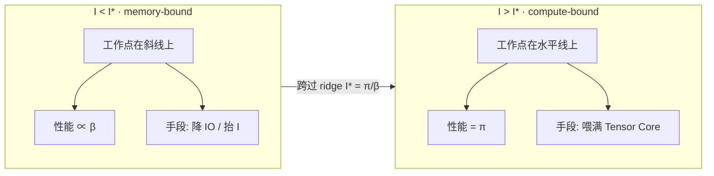
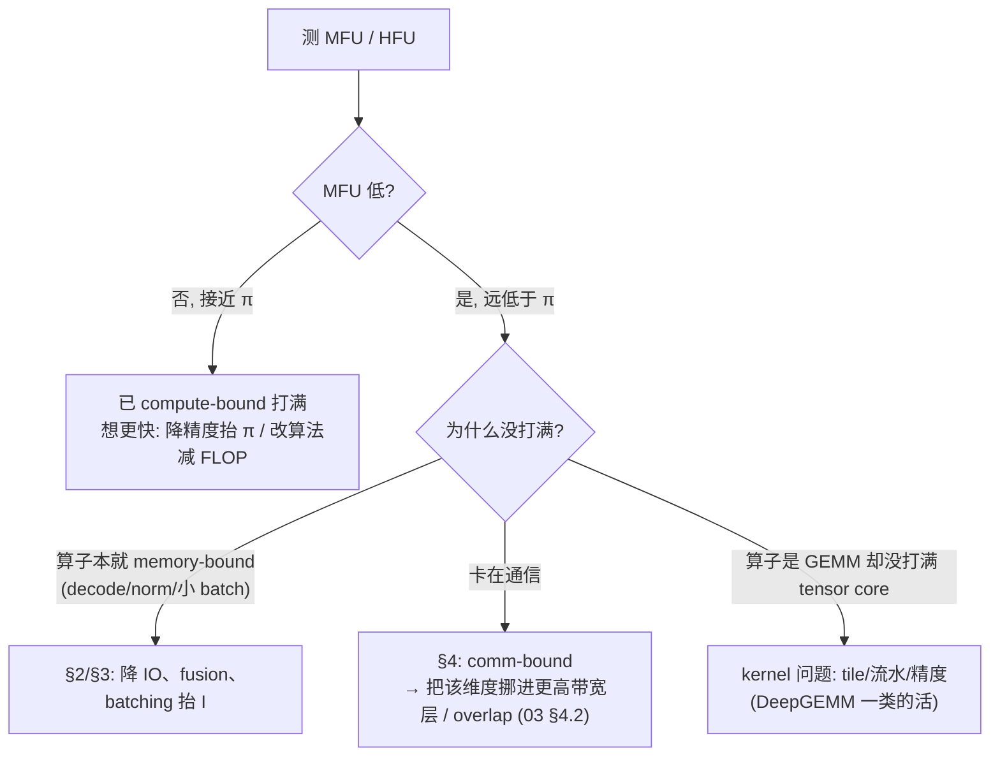

# 00 · Roofline model：两道天花板

> 本篇是整章的分析底座。在讲集群、网络、collective 之前，先把一个最朴素也最锋利的问题说清楚：一段 kernel、一个算子、一整层 transformer，它在一块 GPU 上能跑多快，这个上界是由什么决定的？答案就是 roofline——两道天花板（peak compute 与 peak bandwidth）加一个拐点（ridge point）。
>
> 上一篇 [00 · GPU 硬件参数：常用量与主流型号对照](./00_gpu_hw_params.md) 已经把 $\pi$ / $\beta$ 的单位、dense vs sparse、各型号的具体数字定下来了。本篇只负责讲清楚「怎么用这些数字判断瓶颈」。它和后面几篇的关系是这样的：[`01`](./01_scale_up_nvlink_nvl72.md)/[`02`](./02_scale_out_topology_planes.md) 讲的「带宽瀑布」、[`04`](./04_collectives.md) 讲的 α-β，本质上都是 roofline 里「带宽这一道天花板」在不同层级（HBM → NVLink → RDMA）上的展开。
>
> 阅读这一篇之前，只需要知道 GPU 有算力和显存带宽两项瓶颈；具体型号的数字见上一篇，FLOP、算术强度、拐点这些概念会在正文里逐一定义。

参考 / 事实来源：

- 单卡峰值算力锚点：DeepGEMM 在 H800 上 FP8 GEMM 冲到 **1550 TFLOPS**（[[deepgemm:README.md#L23]]，News · 2025.04.18），是「compute-bound 算子打满 compute 天花板」的真实证据。
- memory-bound 的范本：FlashAttention 的核心卖点就是 **IO-Awareness**——"Fast and Memory-Efficient Exact Attention with **IO-Awareness**"（[[flash-attention:README.md#L6]]）。后面会用它说明 memory-bound 算子怎么沿 roofline 往右挪。
- 单卡 $\pi$ / $\beta$ / ridge point 的型号对照见 [`00_gpu_hw_params` §3](./00_gpu_hw_params.md)；带宽层级的量级沿用 [`01` §2](./01_scale_up_nvlink_nvl72.md)，这里不重复推导。

---

## 0. 两道天花板加一个拐点

一块 GPU 的可达性能 $P$，并不是单一的一个峰值，而是两道上界取小之后的结果：要么被算力（peak FLOP/s）卡住，要么被搬数据的带宽（peak byte/s）卡住。而决定你会撞上哪道墙的，是这个算子的 arithmetic intensity——也就是每搬一个 byte，能换来多少次浮点运算。

把它画成一张图会更直观（双对数坐标，横轴是 arithmetic intensity $I$，纵轴是可达性能 $P$）：

```
 P (FLOP/s, log)
   π ┤· · · · · · · ·________________________   ← ① compute roof: P = π (peak FLOP/s)
     │              ╱
     │             ╱
     │            ╱  ← ② memory roof: P = I·β  (这条斜线的斜率 = β, peak bandwidth)
     │           ╱
     │          ╱
     │         ╱
     │        ╱
     └───────┼────────────────────────────────► I (FLOP/byte, log)
            I* = π/β
   ◄ memory-bound ►│◄────── compute-bound ──────►
   (撞带宽墙)        (撞算力墙)
```



> 图：roofline 两种工作点。真实 $I^*$ 按卡代入上一篇 §3——H100 ≈295 FLOP/byte，H200 因带宽更高回落到 ≈206，B200 ≈325。

图里两道线的含义分别是：**compute roof（水平线）**是硬件每秒能做的浮点运算上限 $\pi$（peak FLOP/s），算子再怎么省 IO，也不可能跑得比它快；**memory roof（斜线）**说的是，如果每秒最多能搬 $\beta$ 字节，而这个算子每个字节只够喂 $I$ 次运算，那它每秒最多也就做 $I \cdot \beta$ 次运算，这条斜线的斜率就是带宽 $\beta$。两道墙相交的地方是 **ridge point $I^* = \pi/\beta$**（拐点）：$I < I^*$ 时工作点落在斜线下方，属于 **memory-bound**；$I > I^*$ 时工作点顶到水平线，属于 **compute-bound**。

整章乃至整个 `docs/` 仓库的优化，几乎都可以归结为一句话：要么把工作点沿着 roofline 往上推，逼近自己那道天花板；要么把工作点往右挪，提高 $I$、跨过 ridge point，让算子从 memory-bound 变成 compute-bound。

---

## 1. 定义：三个量

roofline 只涉及三个量，但每一个都要把单位和语义钉清楚，否则后面算 arithmetic intensity 会算错。

| 符号 | 名字 | 单位 | 语义 |
|---|---|---|---|
| $\pi$ | peak compute | FLOP/s | 硬件每秒浮点运算上限。**和精度强绑定**：同一块卡 FP8 的 $\pi$ ≈ BF16 的 ~2×，FP16/BF16 又远高于 FP32。tensor core 的 $\pi$ 远高于 CUDA core。 |
| $\beta$ | peak bandwidth | byte/s | 某一级存储/链路每秒能搬的字节上限。**分层**：HBM（数 TB/s）$\gg$ NVLink（数百 GB/s）$\gg$ RDMA（数十 GB/s），见 [`01` §2](./01_scale_up_nvlink_nvl72.md)。 |
| $I$ | arithmetic intensity（也叫 operational intensity） | FLOP/byte | **算子自身的属性，与硬件无关**：完成这次计算总共要做的 FLOP，除以必须跨过那一级存储/链路搬运的 byte。 |

可达性能就是一道取最小值的公式：

$$
P(I) = \min(\pi,\ I \cdot \beta)
$$

当 $I \cdot \beta < \pi$，也就是 $I < I^* = \pi/\beta$ 时，属于 **memory-bound**：性能正比于带宽，这时候加算力没有用，得想办法降 IO 或者升高 $I$。反过来，当 $I \cdot \beta \ge \pi$，也就是 $I \ge I^*$ 时，属于 **compute-bound**：性能顶在 $\pi$ 上，省 IO 也没用，得换更高精度的算力，或者想办法把 tensor core 打满。

### 1.1 ridge point 的数值与逐代右移的趋势

代入真实卡的 **dense** 数字（来自 [`00_gpu_hw_params`](./00_gpu_hw_params.md)，营销用的 sparse 数字已经折半）：

| 量 | H100 SXM BF16 | H100 SXM FP8 | H200 SXM BF16 | B200 SXM BF16 |
|---|---|---|---|---|
| $\pi$（Tensor Core **dense**） | 989 TFLOP/s | 1979 TFLOP/s（DeepGEMM 实测 H800 FP8 **1550**，[[deepgemm:README.md#L23]]） | 989 | ~2500 |
| $\beta$（HBM） | 3.35 TB/s | 3.35 TB/s | 4.8 TB/s | 7.7 TB/s |
| **$I^* = \pi/\beta$** | **~295** | **~590** | **~206** | **~325** |

这里有一个值得展开说的关键趋势，通常叫 **memory wall**：每一代 GPU，$\pi$ 的增速都远快于 $\beta$——算力翻得比带宽快得多。$I^* = \pi/\beta$ 因此逐代右移：上一代还算 compute-bound 的算子，到了新卡上可能就变成了 memory-bound。这正是为什么近几年的 kernel 工程越来越多是在「省 IO」（fusion、FlashAttention、量化通信），而不是在「堆 FLOP」——因为 ridge point 一直在往前跑，工程师必须追着它调整策略。低精度（FP8/FP4）比较特殊，它一边抬高 $\pi$、一边因为每个元素占用的字节更少而抬高 $I$，是少数能同时把工作点往「上」和往「右」推的手段。

---

## 2. 怎么算一个算子的 arithmetic intensity

roofline 的全部功夫都在「估对 $I$」这一步。规则很简单：分子是这次计算的总 FLOP，分母是必须穿过目标存储层的 byte（通常就是 HBM 的读写量）。下面四类算子基本覆盖了 LLM 里 99% 的情况，把它们的 $I$ 量级记下来，就能一眼判断出瓶颈在哪。

先约定一个贯穿全文的记号：`dtype` 的字节数记为 $s$（BF16/FP16 时 $s = 2$，FP8 时 $s = 1$，FP32 时 $s = 4$）。

### 2.1 大 GEMM：compute-bound 的代表

对于 $[M, K] \times [K, N] \to [M, N]$ 这样的矩阵乘，分子是总 FLOP（每个输出元素 $K$ 次乘加，即 $2K$ FLOP），分母是 HBM 流量（读两个输入 + 写一个输出，假设各过一次 HBM）：

$$
\begin{aligned}
\text{FLOP} &= 2MNK \\
\text{bytes} &= (MK + KN + MN) \cdot s \\
I &= \frac{2MNK}{(MK + KN + MN)\,s}
\end{aligned}
$$

取一个「方阵」的直觉：$M = N = K = n$ 时，$I = 2n^3 / (3n^2 \cdot s) = 2n / (3s)$。可以看到 $I$ 是随维度 $n$ 线性增长的——矩阵一旦变大，每个从 HBM 读进来的元素就会被复用 $O(n)$ 次，arithmetic intensity 也就很容易冲过 ridge point。

这就是为什么训练里的大 GEMM（QKV proj、FFN 的 up/down、MoE 的 grouped GEMM）都是 compute-bound，也是为什么 DeepGEMM 能在 H800 上把 FP8 GEMM 干到 **1550 TFLOPS**（[[deepgemm:README.md#L23]]）——它本来就贴着 compute roof 在跑，优化目标是把 tensor core 喂满、别让 $\pi$ 空转，而不是省 IO。有意思的是，一个 compute-bound 算子如果做对了，busbw / HBM 带宽利用率反而应该不高，因为瓶颈根本不在那里。

### 2.2 矩阵×向量（decode、batch=1）：memory-bound 的代表

把上面的 $N$ 取成 1（相当于一个 token 过一层权重 $[M, K]$）。此时权重必须整块从 HBM 读一遍，远大于读输入向量（$Ks$）与写输出（$Ms$）的开销：

$$
\begin{aligned}
\text{FLOP} &= 2MK \\
\text{bytes} &\approx MKs \\
I &\approx \frac{2MK}{MKs} = \frac{2}{s}
\end{aligned}
$$

代入 $s$ 的具体值：BF16 时 $I \approx 1$，FP8 时 $I \approx 2$（FLOP/byte）。

这里 $I$ 只有 $O(1)$，远远落在 ridge point（H100 BF16 大约 295）的左边——是深度的 memory-bound。直觉上很好理解：算一个 token，需要把整个权重矩阵从 HBM 拉一遍，但每个权重只做了一次乘加运算，算力几乎全程在空转，瓶颈 100% 落在 HBM 带宽上。这正是 LLM decode（自回归逐 token 生成）阶段是 memory-bandwidth-bound 的根本原因（细节见 [`04` §5.4 prefill vs decode](./04_collectives.md)）。

把工作点往右挪的标准手段是 batching：让 $N$ 个 token 一起过同一份权重（变成 $[M, K] \times [K, N]$），权重只读一遍，却能做出 $N$ 倍的 FLOP，$I$ 因此抬升到大约 $2N/(s + \cdots)$。这正是 continuous batching、大 batch prefill 能拉高 MFU 的 roofline 层面的解释——本质上是用 batch 把 memory-bound 的 GEMV 推成了 compute-bound 的 GEMM。decode 之所以难，就是因为它天然 $N$ 小、抬不动 $I$，所以要么靠 speculative decoding 变相增大每步产出的 token 数，要么干脆接受它是 memory-bound 的事实，按 [`04` §5.4](./04_collectives.md) 的 low-latency 路线去优化。

### 2.3 elementwise / norm / softmax / activation：天然 memory-bound

RMSNorm、LayerNorm、SiLU、residual add、dropout、softmax 里的 exp/归一化，这类逐元素算子的共同特点是：每个元素读进来，做几次运算，再写回去。记 $c$ 为每元素的运算次数（个位数常数），读一遍加写一遍共 $2Ns$ 字节：

$$
\begin{aligned}
\text{FLOP} &\approx cN \\
\text{bytes} &\approx 2Ns \\
I &\approx \frac{c}{2s} = O(1)
\end{aligned}
$$

这类算子永远落在 roofline 的最左边，$I$ 是个常数，跟规模无关。单独跑的话，性能就是 $\approx \beta$，被 HBM 带宽锁死，算力完全闲置。优化只有一条路可走：减少 HBM 往返。**kernel fusion** 是最直接的手段——把 `matmul → bias → activation → ...` 串成一个 kernel，中间结果留在寄存器或 shared memory 里，不落 HBM，相当于把多个低 $I$ 算子的分母合并到一起，整体的 $I$ 就抬高了。**FlashAttention** 也是「降 IO」思路的一次胜利，但它牵涉一个 $[\text{seq}, \text{seq}]$ 的中间矩阵，还要满足「softmax 要看整行」这个约束，比一般的 fusion 微妙不少，值得单独拿出一节完整推导（见 §2.4）。

### 2.4 attention 的 arithmetic intensity 与 FlashAttention

attention 值得单独讲，因为它是 LLM 里最典型的「FLOP 本身不大、却被一个中间矩阵的 IO 拖死」的算子，也是理解 FlashAttention 唯一正确的入口。先把 shape 固定下来，再分 prefill / decode 两种情形推导 $I$。

先约定记号（考虑单个 attention head）：序列长 $N$，head dim $d$，$Q, K, V \in [N, d]$，dtype 字节数 $s$。多 head、多 batch 只是把下面所有 FLOP 和 byte 同时乘上 $B \cdot H$，$I$ 本身不变（分子分母同比例放大），所以单 head 推导就够了。整个计算分三步：

$$
\begin{aligned}
S &= QK^{\top}: \quad [N,d]\times[d,N] \to [N,N], & \text{FLOP} &= 2N^2d \\
P &= \mathrm{softmax}(S): \quad \text{row-wise over keys}, & \text{FLOP} &\approx O(N^2) \\
O &= PV: \quad [N,N]\times[N,d] \to [N,d], & \text{FLOP} &= 2N^2d
\end{aligned}
$$

其中 softmax 一步只做 exp 与归一化除法，相对两个 matmul 是低阶项；总 FLOP $\approx 4N^2d$。

#### 2.4.1 朴素实现：`I` 恒在 ~`d/s`，且与 `N` 无关

朴素的 attention 实现把三步写成三个独立的 kernel，那张 $[N, N]$ 的 $S$/$P$ 矩阵就必须先落到 HBM 上，再读回来：

```
QKᵀ kernel : 读 Q,K (2Nd) + 写 S (N²)
softmax    : 读 S (N²)   + 写 P (N²)
PV  kernel : 读 P (N²)   + 读 V (Nd) + 写 O (Nd)
```

把三个 kernel 的读写量加起来：$N \gg d$ 时 $N^2$ 项主导，记系数 $c \approx 2 \sim 4$：

$$
\begin{aligned}
\text{bytes} &\approx (2 \sim 4)\, N^2 s + O(Nd)\, s \approx c N^2 s \\
I_{\text{naive}} &= \frac{4N^2d}{cN^2s} = \frac{4}{c} \cdot \frac{d}{s} = \Theta(d/s)
\end{aligned}
$$

这里有一个乍看意外、但很关键的结论：$I_{\text{naive}} \approx d/s$，也就是说它只取决于 head dim，跟序列长度 $N$ 完全无关——因为分子分母里的 $N^2$ 项恰好约掉了。代入 $d = 128, s = 2$，得到 $I \approx 64$，远在 ridge $I^* \approx 295$ 的左边，属于 memory-bound。

这和 §2.1 的 GEMM 形成了一个鲜明的对比：GEMM 的 $I$ 会随维度 $n$ 线性增长，矩阵一大就变成 compute-bound；但 attention 的 $I$ 是一个被 $d$ 卡死的常数，序列拉得再长也不会变成 compute-bound。更糟的是，绝对的 HBM 流量还会随 $N^2$ 暴涨——长上下文场景下，attention 是确凿无疑的 memory wall，而瓶颈从来都不是那 $4N^2d$ 次 FLOP，而是那张 $N \times N$ 矩阵反复搬运的开销。

#### 2.4.2 FlashAttention：让 `[N,N]` 矩阵从不落 HBM

既然瓶颈是物化了 $S$/$P$ 这张矩阵，最好的解法就是根本不物化它。但这里有个拦路虎：softmax 归一化需要整行的 max 与 sum，看上去似乎必须先把整行 $S$ 都算出来才行——这正是朴素实现要物化 `[N,N]` 矩阵的理由。FlashAttention 用两个技巧拆掉了这个约束（对应 [[flash-attention:README.md#L6]] 的 **IO-Awareness**；work partitioning 细节见 FA-2，[[flash-attention:README.md#L12]]）。

第一个技巧是 **online softmax**：把「先看整行、再做 softmax」改成分块流式计算，而且在数值上完全等价（exact，不是近似）。做法是维护一个 running max $m$、running 分母 $l$、running 输出累加器 $O_i$，每来一个新的 K/V block 就做一次 rescale：

```
对第 j 个 K/V block，片上算出本块分数 S_j = Q_i·K_jᵀ：
  m_new = max(m, rowmax(S_j))                  # 更新 running max
  p_j   = exp(S_j − m_new)                      # 本块未归一化权重
  l     = l·exp(m − m_new) + rowsum(p_j)        # 旧分母按比例缩小后 + 新分母
  O_i   = O_i·exp(m − m_new) + p_j·V_j          # 旧输出按比例缩小后 + 新输出
  m     = m_new
遍历完所有 j： O_i ← O_i / l                     # 最后一次性归一化
```

其中 $\exp(m - m_{\text{new}})$ 是一个修正因子：每当发现一个更大的 max，就把已经累积的分母 $l$ 和输出 $O_i$ 按比例缩小，从而保证最终结果和「先看到整行再做 softmax」完全等价。所以 FlashAttention 是 exact attention，并不是像 linear attention 那样的近似方法。

第二个技巧是 **tiling**：把 $Q/K/V$ 切成小块，每一对 $(Q_i, K_j, V_j)$ block 载入 SRAM，在片上算出 $S_j$、跑上面的 online-softmax 更新，再把结果直接累加进 $O_i$。这样一来，$S_j$ 全程只停留在 SRAM 里，从来不写 HBM。HBM 流量因此可以重新估算（记 $M$ 为 SRAM 容量；每个 $K, V$ block 只载入一次，被所有 $Q$ block 复用），对比朴素实现的 $\Theta(N^2) \cdot s$：

$$
\begin{aligned}
\text{bytes}_{\text{flash}} &\approx \Theta\!\left(\frac{N^2d^2}{M}\right) s \\
I_{\text{flash}} &\approx \frac{4N^2d}{(N^2d^2/M)\, s} = \Theta\!\left(\frac{M}{ds}\right)
\end{aligned}
$$

由于因子 $d^2/M$ 远小于 1（$d^2$ 约为 $10^4$ 个元素，而 SRAM 容量 $M$ 通常有上百 KB），HBM 流量能降低约一个数量级（FA 论文在 GPT-2 上报告了大约 9 倍更少的 HBM accesses）。$I$ 从 $\sim d/s$ 抬升到 $\sim M/(d \cdot s)$，沿着 roofline 大幅右移，逼近 compute-bound。整个过程一个 FLOP 都没省下来（甚至反向还要多算一点），纯粹靠降低 IO 提速——这是 roofline「往右挪」最经典的一个工程案例。

第三点值得顺带一提：FlashAttention 只需要保留 $O(N)$ 大小的 per-row 统计量 `softmax_lse`（logsumexp，形状为 `[batch, heads, seqlen_q]`、fp32，见 [[flash-attention:flash_attn/flash_attn_interface.py#L135]]），而不是 $O(N^2)$ 大小的 $P$ 矩阵，这样也顺带省了显存。反向传播也不存 $S$/$P$，而是用保存下来的 $O$ 和 `softmax_lse` 现场重算 attention block——这正是 §5 里「重计算抬 HFU 不抬 MFU」的一个具体实例；因为 attention 本来就是 memory-bound 的，这点重算的 FLOP 几乎是免费的。

#### 2.4.3 decode regime：瓶颈变成读 KV cache

自回归 decode 每一步只处理 1 个新 token：$Q \in [1, d]$，而 $K, V \in [N, d]$ 是已经缓存下来的 KV（$N$ 是已生成的长度）。此时 $S = [1, N]$、$O = [1, d]$，HBM 流量由「必须把整个 KV cache 读一遍」主导，远大于 $Q, O$ 的 $O(d)$：

$$
\begin{aligned}
\text{FLOP} &= 2Nd\ (QK^{\top}) + 2Nd\ (PV) = 4Nd \\
\text{bytes} &\approx 2Nds \\
I &= \frac{4Nd}{2Nds} = \frac{2}{s} = O(1)
\end{aligned}
$$

这和 §2.2 的 GEMV 是同样的深度 memory-bound，只是卡住的物理量不同：GEMV 卡在读 weight，decode-attention 卡在读 KV cache。所以这里 FlashAttention（也就是 FlashDecoding，沿 KV 维再切分做并行）仍然能省下中间矩阵、提升并行度，但 $I$ 的天花板是由「读 KV cache」这件事锁死的，真正能抬高上界的手段是压缩 KV cache：量化、MQA/GQA（减少 KV head 数）、PagedAttention（省掉冗余读取）。要注意的是，batch decode 能共享权重，却不能共享 KV（每条序列的 KV 都不一样），所以即便 batch 很大，attention 这一段依然是 memory-bound——这也是为什么 LLM serving 里 attention kernel 总是要被单独拿出来优化的 roofline 层面的原因。

#### 2.4.4 三种 attention 的 `I` 对照

| attention 形态 | 总 FLOP | 主导 bytes | $I$（FLOP/byte） | 相对 ridge $I^* \approx 295$ | 瓶颈物理量 |
|---|---|---|---|---|---|
| 朴素 prefill/train | $4N^2d$ | $\Theta(N^2) \cdot s$（物化 $S$/$P$） | $\sim d/s$（**恒定，与 $N$ 无关**） | $\ll$ → memory-bound | $N \times N$ 矩阵来回搬 |
| FlashAttention prefill/train | $4N^2d$ | $\Theta(N^2 d^2 / M) \cdot s$ | $\sim M/(d \cdot s)$（右移 ~10×） | $\approx$ → 接近 compute | 已逼近算力墙 |
| decode（batch=1, +KV cache） | $4Nd$ | $2Nd \cdot s$ | $2/s = O(1)$ | $\ll$ → memory-bound | 读 KV cache |

### 2.5 小结：四类算子的 arithmetic intensity 与瓶颈

| 算子 | $I$ 量级（FLOP/byte） | 相对 ridge $I^* \approx 295$ | 瓶颈 | 优化方向 |
|---|---|---|---|---|
| 大 GEMM（train fwd/bwd、prefill、grouped GEMM） | $O(n)$，几十~几百+ | $\ge$ | **compute-bound** | 打满 tensor core、低精度抬 $\pi$（DeepGEMM） |
| 矩阵×向量（decode batch=1） | $O(1)$，~1–2 | $\ll$ | **memory-bound** | batching 抬 $I$、KV cache 省读、低精度 |
| elementwise / norm / softmax | $O(1)$，常数 | $\ll$ | **memory-bound** | **kernel fusion**、减少 HBM 往返 |
| attention（朴素 vs Flash，§2.4） | 朴素 $\sim d/s$（恒定）→ Flash $\sim M/(d \cdot s)$；decode $2/s$ | $\ll$ → 接近 | memory-bound → 接近 compute | **IO-aware（FlashAttention）；decode 压 KV cache** |

判断的口诀很简单：先估出 $I$，和 $I^*$ 比较。$I \ll I^*$ 时别去碰算力，重点是降 IO；$I \gg I^*$ 时别去碰 IO，重点是喂满算力。方向搞反是性能工作中最常见的浪费。

---

## 3. 两个 regime 的优化清单

把第 2 节的结论按「现在撞的是哪道墙」整理成一张行动表：

| | memory-bound（$I < I^*$，工作点在斜线上） | compute-bound（$I \ge I^*$，工作点在水平线上） |
|---|---|---|
| 现象 | 性能随带宽变化、随算力**不**变；HBM 带宽利用率高、算力利用率低 | 性能顶在 $\pi$、随带宽**不**变；算力利用率高 |
| 第一手段 | **降 IO**：fusion、FlashAttention、不落中间结果 | **打满 tensor core**：tiling、流水、避免 warp stall |
| 抬性能上界 | 抬 $\beta$：换更高带宽存储层（见 §4 通信版）、或抬 $I$ 跨过 ridge | 抬 $\pi$：**降精度**（BF16→FP8→FP4，DeepGEMM） |
| 把工作点往右挪 | **batching**（GEMV→GEMM）、增大 tile、复用数据 | 已在右侧，无需 |
| LLM 实例 | decode、norm/act、朴素 attention | train 的大 GEMM、prefill、grouped GEMM |

这里要注意「抬性能上界」和「打满当前上界」是两件不同的事。如果 MFU 很低（§5），说明还没打满当前那道墙，应该先把它打满；等打满之后还想更快，才轮到「抬上界 / 挪工作点」这一层考虑。

---

## 4. 把 roofline 推广到通信：communication roofline

到目前为止，roofline 讲的还是「单卡、对 HBM」的故事。有意思的是，它可以原样推广到多卡通信上，这正是 roofline 能把整章内容串起来的地方。

做法是把 §1 的「memory roof」里的 $\beta$ 从 HBM 带宽换成互连带宽（NVLink 或 RDMA），同时把 arithmetic intensity 的分母从「HBM byte」换成「跨链路通信的 byte」：定义 **communication intensity $I_{\text{comm}}$（= FLOP / 跨某级互连搬运的 byte）**，可达性能就是 $P = \min(\pi,\ I_{\text{comm}} \cdot \beta_{\text{link}})$。

于是 [`01` §2 的带宽瀑布](./01_scale_up_nvlink_nvl72.md)——$\text{HBM} \gg \text{NVLink} \gg \text{RDMA} \gg \text{Ethernet}$——就变成了一摞斜率递减的 roofline：同一个算子，搬运量不变，但把它放到越低的带宽层上，那条 memory/comm roof 的斜线就越平、ridge point 越往右移，也就越容易变成通信带宽 bound。

```
 P (log)
   π ┤········______________________  compute roof
     │      ╱   ╱   ╱
     │     ╱   ╱   ╱      斜率 = β:
     │    ╱   ╱   ╱        HBM   (最陡, 最难被它 bound)
     │   ╱   ╱   ╱         NVLink(中)
     │  ╱   ╱   ╱          RDMA  (最平, 最容易被它 bound)
     └─┼───┼───┼──────────────────────► I (FLOP/byte, log)
   每往低带宽层走一步, ridge point 右移约一个数量级
```

这也给了 [大规模训练的并行策略 —— 总览](../parallel/README.md) 那张 `TP→CP→PP→DP` rank 排布图一个 roofline 层面的解释，和 [`01` §3](./01_scale_up_nvlink_nvl72.md)、[`04` §5.1 映射表](./04_collectives.md) 完全自洽：

| 并行维度 | 每通信 byte 换来的 FLOP（$I_{\text{comm}}$ 直觉） | 结论 |
|---|---|---|
| **TP / SP** | 低：每层都要 all-reduce 全量 activation，通信 byte 大、夹在关键路径，$I_{\text{comm}}$ 小 | $I_{\text{comm}}$ 小 → 极易 comm-bound → **必须放最陡的那条 roof（NVLink/scale-up）** 才不被带宽锁死 |
| **PP** | 高：只在 micro-batch 边界传一次小激活，搬一点 byte 换一整段 layer 的计算，$I_{\text{comm}}$ 大 | $I_{\text{comm}}$ 大 → 用最平的 RDMA roof 都够 → **可以跨机** |
| **DP / FSDP** | 中高：每 step 才 all-reduce 一次梯度，且可 overlap | 放 scale-out 可接受 |

这些其实可以统一成一句话：该把哪个并行维度摁进 scale-up 域，取决于哪个维度的 $I_{\text{comm}}$ 最小、最容易被通信带宽 bound。TP 的 $I_{\text{comm}}$ 是这几个维度里的峰值（最小），所以它被锁死在 NVLink 域；PP 的 $I_{\text{comm}}$ 最大，所以随便跨机都无所谓。这其实和 [`01` §3](./01_scale_up_nvlink_nvl72.md) 用「频率×大小×关键路径」得到的结论是同一件事的两种说法，roofline 只是把它进一步量化成了 arithmetic intensity。

### 4.1 α-β 模型与 latency roof

[`04` §2.1](./04_collectives.md) 的 $T = \alpha + m/\beta$ 和这里的 communication roofline 是互补的关系，两者合起来才是完整的图景。$m/\beta$ 这一项对应 communication roof 的斜线段（bandwidth-bound，大消息场景）；$\alpha$ 这一项则是无论消息多小、带宽利用率多低都逃不掉的固定延迟地板，它对应的是 roofline 在「极小 $I$ / 极小消息」这一端的一道水平延迟墙（latency roof）——此时性能不再正比于 $\beta$，而是被 $\alpha$（跳数 × 单跳延迟）锁死。

所以一个 collective 的真实上界，其实是三道墙取小：compute roof（$\pi$）、bandwidth roof（$I_{\text{comm}} \cdot \beta_{\text{link}}$）、latency roof（大致 消息量/$\alpha$）。[`04`](./04_collectives.md) 里说的「小消息 latency-bound，要减跳数或换 LL 协议」，对应的就是撞上了 latency roof；「大消息 bandwidth-bound，要靠 ring 搬 $\sim 2n$ 或打满 busbw」，对应的是撞上了 bandwidth roof。可以这样理解两者的关系：roofline 是在空间维度上（每 byte 几次运算）刻画瓶颈，α-β 则是把同一套思想在「消息大小」这根轴上重新展开了一遍。

---

## 5. MFU / HFU：离上界还有多远

roofline 给出的是理论上界；**MFU（Model FLOPs Utilization）/ HFU（Hardware FLOPs Utilization）** 则是用来衡量「离上界还差多远」的实测指标。

MFU 的定义是 `模型理论必需 FLOP/s（实测）` 除以硬件 peak $\pi$，分子用的是「完成这一步训练在数学上必须做的 FLOP」（前向大约 $2 \cdot \text{params} \cdot \text{tokens}$，加上反向大约是 $3\times$）。HFU 则是把分子换成「硬件实际执行的 FLOP」，其中包含 activation recomputation 这类会重复计算的部分。所以总有 $\mathrm{HFU} \ge \mathrm{MFU}$：重计算会抬高 HFU（因为硬件确实在算），却不会抬高 MFU（因为对模型本身没有多算出有用功）。

怎么用 roofline 来读 MFU：



MFU 低并不等于代码写得差，得先用 §2 的方法判断一下「这段工作本来是不是就该 memory-bound」。decode、纯 elementwise 这些阶段 MFU 天生就低，这是 roofline 决定的，不是 bug；这种情况下该看的指标是 HBM 带宽利用率（是否打满了 memory roof），而不是 MFU。总的原则是指标要和算子所在的 regime 匹配：compute-bound 看 MFU，memory-bound 看带宽利用率，comm-bound 看 busbw（[`04` §2.5](./04_collectives.md)）。

---

## 6. 小结

- **roofline = 两道天花板取 min**：$P = \min(\pi,\ I \cdot \beta)$。撞哪道墙由算子自身的 arithmetic intensity $I = \text{FLOP/byte}$ 与 ridge point $I^* = \pi/\beta$ 的大小关系决定。
- **四类 LLM 算子的 $I$**：大 GEMM $O(n)$→compute-bound；GEMV/decode $O(1)$→深度 memory-bound（batching 抬 $I$）；elementwise/norm $O(1)$→memory-bound（fusion）；attention（§2.4）朴素 $I \approx d/s$（**与序列长无关的常数**、瓶颈是物化 $N \times N$ 矩阵）→ FlashAttention 用 tiling + online-softmax 让矩阵不落 HBM、$I$ 右移约 10× 逼近 compute-bound，decode-attention 则退化成 $2/s$ 卡在读 KV cache。锚点：DeepGEMM FP8 到 1550 TFLOPS（贴 compute roof）、FlashAttention 降 IO（往右挪）。
- **趋势——memory wall**：$\pi$ 增速快于 $\beta$，ridge point 逐代右移，越来越多算子变 memory-bound；低精度同时抬 $\pi$ 和 $I$，是少数能两头推工作点的手段。
- **优化先判 regime**：$I \ll I^*$ 降 IO，$I \gg I^*$ 喂满算力——搞反方向是最常见的浪费。
- **推广到通信（communication roofline）**：把 $\beta$ 换成互连带宽，$I_{\text{comm}}$ = FLOP/通信 byte。带宽瀑布 = 一摞斜率递减的 roofline；$I_{\text{comm}}$ 最小的并行维度（TP）最易 comm-bound，故锁死 scale-up 域。α-β 模型补上了小消息端的 latency roof——collective 的上界是 compute / bandwidth / latency 三墙取小。
- **MFU/HFU** 是 roofline 的实测刻度；读它之前先用 $I$ 判断该算子本应落在哪个 regime，再选对该看 MFU、带宽利用率还是 busbw。

---

下一篇：[01 · scale-up 域：NVLink 与 NVL72](./01_scale_up_nvlink_nvl72.md) —— 用上一篇的 NVLink 数字，把最陡的那条 roof（scale-up 域）从 8 GPU 扩到 NVL72 的 72 GPU。
