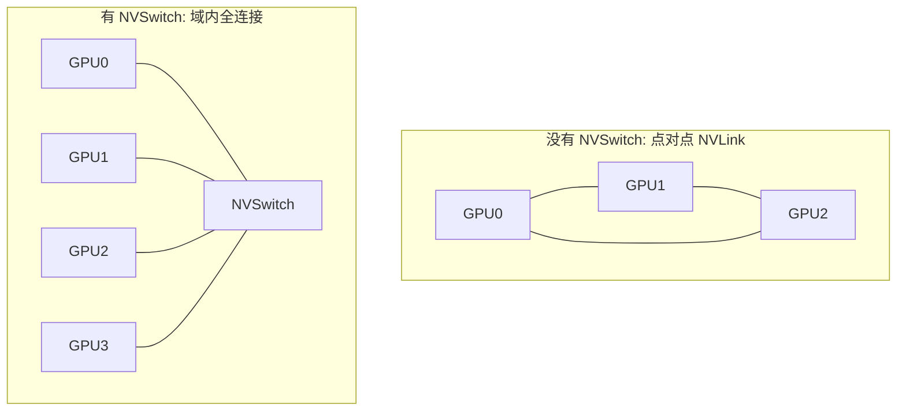
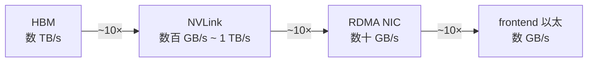
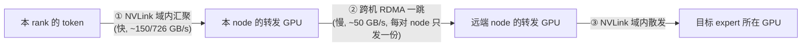
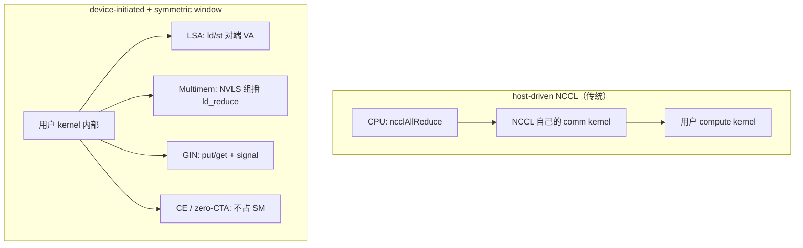
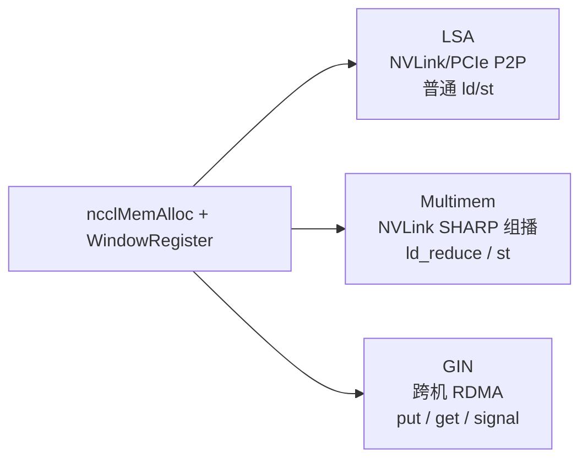
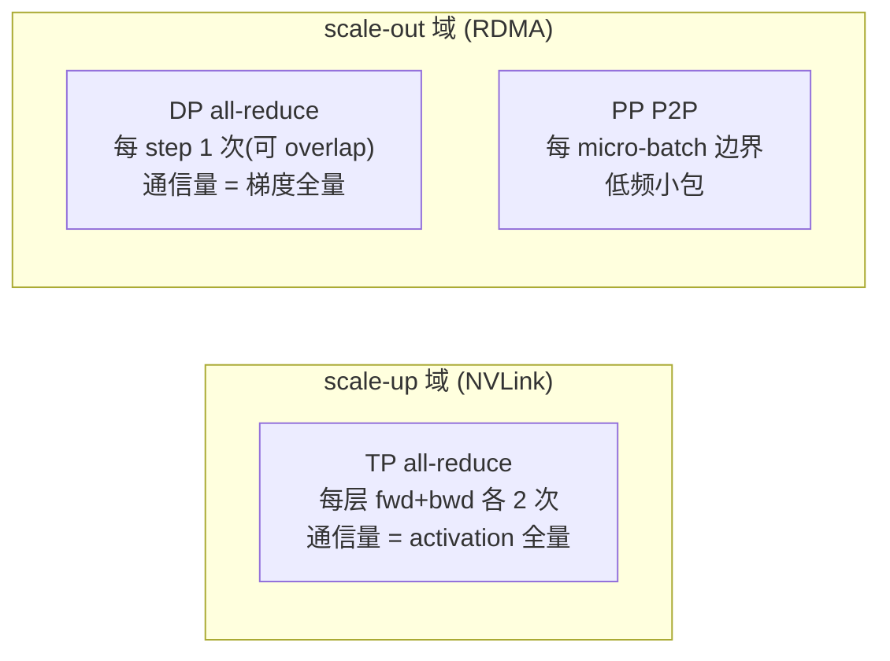
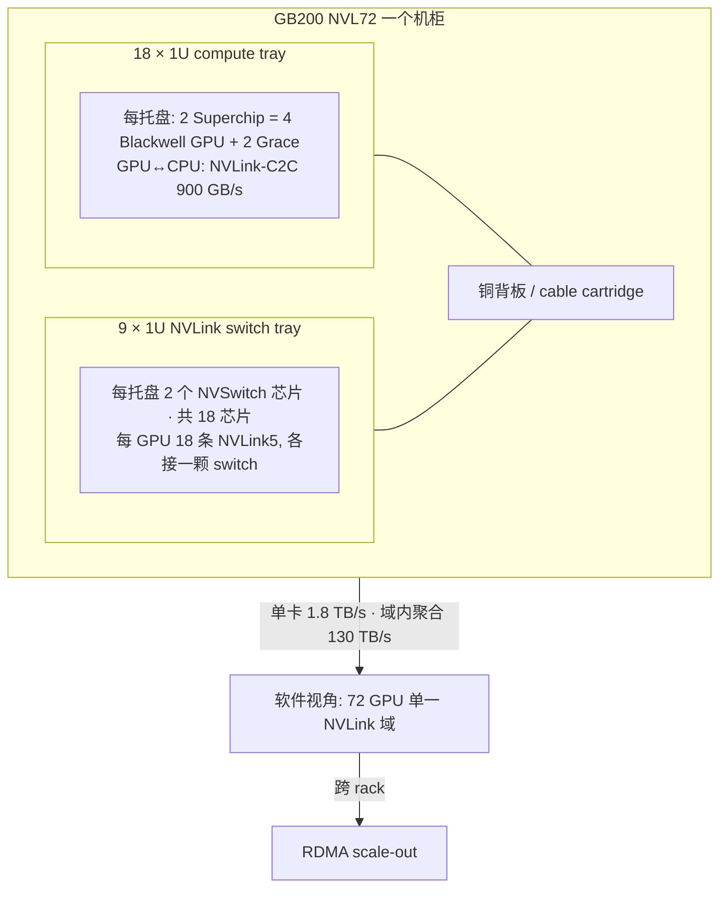

# 01 · scale-up 域：NVLink 与 NVL72

> 本篇讲的是集群里那块高带宽的小天地：scale-up 域。先把定义与带宽层级说清楚，再看软件是怎么把它收成 **symmetric memory**（NVSHMEM heap / NCCL window）这套抽象的，以及 LSA、NVLS multimem、zero-copy、zero-CTA（CE offload）这些概念各自在做什么；最后讲 NVL72 把这个域从 8 卡扩到 72 卡之后，账本会发生什么变化。
>
> 上一篇是 [00 · Roofline model：两道天花板](./00_roofline_model.md)。单卡的 NVLink / HBM 数字见 [`00_gpu_hw_params`](./00_gpu_hw_params.md)。

---

## 1. 定义：scale-up 域是什么

先把这个量的定义固定下来，后面所有的论证都会挂在它上面。

**scale-up 域**指的是一组 GPU，彼此之间通过 NVLink + NVSwitch 直接、全带宽、可寻址地互连，对软件呈现出「任意两块卡之间都有一条高速路」的样子。它的边界传统上是一个 node（8 GPU），而 NVL72 把这个边界推到了一个 rack（72 GPU）。



> 图：NVSwitch 把「几条点对点 NVLink」收成任意两卡等带宽。HGX 八卡是一张 NVSwitch；NVL72 是 18 个 NVSwitch 芯片 + 铜背板，但软件看到的仍是「一张全连接 fabric」。单卡 NVLink 代际数字见 [`00_gpu_hw_params` §1.5](./00_gpu_hw_params.md)。

scale-up 域和 scale-out 域有三个本质区别：

1. **全连接（all-to-all）拓扑**：经过 NVSwitch，域内任意两块 GPU 之间的带宽都是对等的，不存在「近邻/远邻」的区分。这和 scale-out 那种分层的 fabric（有 rail-local / 跨 spine 之分，见 [`02`](./02_scale_out_topology_planes.md)）截然不同。
2. **带宽高一个数量级**：具体数字见下表。
3. **可以直接 load/store**：NVLink 支持 GPU 直接读写对端的显存（P2P），不像 RDMA 那样需要先 post 一个 work request 再走 NIC。这也是为什么 TP 那种细粒度的 all-reduce 只能待在这里做。

---

## 2. 带宽层级：一张贯穿全章的表

把数据通路上每一级的带宽按量级列出来（具体数字随代际变化，这里给的是可用于推导的量级，不用刻意去背）：

| 层级 | 介质 | 单 GPU 带宽量级（单向） | 相对 NVLink |
|---|---|---|---|
| **HBM**（卡上显存） | 片上 | 数 TB/s | ~10× |
| **NVLink / NVSwitch**（scale-up） | 铜，机内/rack 内 | 数百 GB/s ~ ~1 TB/s | 1× |
| **RDMA NIC**（scale-out） | IB/RoCE 光/铜跨机 | 数十 GB/s（400 Gb/s≈50 GB/s） | ~1/10 |
| **frontend 以太** | TCP | 数 GB/s 或更低 | ~1/100 |

这条带宽瀑布——`HBM ≫ NVLink ＞ RDMA ≫ Ethernet`——值得记住：每往下一级大约掉一个数量级。并行策略设计的全部艺术，说到底就是把通信量大的算子尽量摁在靠上的那几层。



> 图：四级带宽瀑布。具体型号代入 [`00_gpu_hw_params`](./00_gpu_hw_params.md)——H100 是 3.35 TB/s → 450 GB/s 单向 NVLink → 50 GB/s 的 400Gb NIC；H800 的 NVLink 单向只剩 ~200 GB/s，和 RDMA 的落差从 ~9× 收成 ~4×，但「出域就贵」仍然成立。

DeepEP 的实测把 NVLink 与 RDMA 这两级的落差量化得很干净（同一套 DeepSeek-V3 dispatch 配置，[[deepep:docs/legacy.md#L17-L26]]）：

| 场景 | EP 规模 | dispatch 带宽 | 说明 |
|---|---|---|---|
| Intranode（纯 NVLink） | 8 | **153 GB/s** | 全程待在 scale-up 域 |
| Internode（跨机 RDMA） | 16 | 43 GB/s | 一半流量被打到 scale-out |
| Internode | 32 | 58 GB/s | |
| Internode | 64 | 51 GB/s | |

在 SM100（Blackwell 代）上，NVLink-only 的 EP=8 更是能冲到 **726 GB/s**（[[deepep:README.md#L50]]），而跨机的 `EP 8 x 2` 只有 **90 GB/s**（含本地流量，[[deepep:README.md#L47-L49,L53]]）。这个对比就是「掉出 scale-up 域」需要付出的代价的真实标价。

### 2.1 asymmetric-domain 两级转发

DeepEP 的 normal kernel 自称是「kernels optimized for asymmetric-domain bandwidth forwarding, such as forwarding data from NVLink domain to RDMA domain」（[[deepep:docs/legacy.md#L9]]，标题见 [[deepep:docs/legacy.md#L17]]）。这里的「asymmetric-domain」说的正是上表那件事：两个域的带宽是不对称的。当要 dispatch 一个 token 时，目标如果在本机就走 NVLink，如果在远端 node 就必须过 RDMA。DeepEP 的做法是把这个过程分成两级转发：



> 图：发往同一个远端 node 的 token 先在机内 NVLink 域聚齐，跨机只发一份；对端再用 NVLink 散开。昂贵的 RDMA 跳数 = node 对数，不是 token×expert 数。实现层落位见 [02 · Dispatch：permute、all-to-all、buffer 分配](../parallel/05_ep/02_dispatch.md)；all-reduce 的同构做法是 [`04` §5.3](./04_collectives.md) 的 hierarchical collective。


> 图：DeepEP **normal** kernel——机内 NVLink 与跨机 RDMA 两级转发 + channel 流水。（DeepEP 官方图，本地镜像自 [deepseek-ai/DeepEP](https://github.com/deepseek-ai/DeepEP) `figures/normal.png`）

这套设计的关键在第②步：机内 NVLink 负责兜住细粒度的流量，跨机 RDMA 只搬运聚合之后的粗粒度数据。等到 NVL72 把 EP≤72 的规模塞回单一 NVLink 域之后，这一级转发的必要性其实被硬件本身吃掉了大半（细节见 §5.2）。

---

## 3. 软件抽象：symmetric memory 与 device-initiated 通信

§1 提到 scale-up 域「可以直接 load/store」，这一节要把这句话落实成一套可调用的对象：谁来分配、怎么注册、kernel 里怎么寻址、什么时候连 SM 都不需要用。官方入口如下：

- NCCL [Window / User Buffer Registration](https://docs.nvidia.com/deeplearning/nccl/user-guide/docs/usage/bufferreg.html)（`ncclCommRegister` / `ncclCommWindowRegister`）
- NCCL [Device-Initiated Communication](https://docs.nvidia.com/deeplearning/nccl/user-guide/docs/usage/deviceapi.html)（NCCL ≥ 2.28：LSA / Multimem / GIN）
- NVSHMEM：OpenSHMEM 风格的 **symmetric heap**（[Scaling Scientific Computing with NVSHMEM](https://developer.nvidia.com/blog/scaling-scientific-computing-with-nvshmem/)）
- NCCL 2.28 CE collectives / zero-CTA（[Device API + Copy Engine](https://developer.nvidia.com/blog/fusing-communication-and-compute-with-new-device-api-and-copy-engine-collectives-in-nvidia-nccl-2-28/)）

这套抽象在 DeepEP / MegaMoE 里具体是怎么落地的，见 [06 · DeepEP：V1 (legacy/NVSHMEM) 与 V2 (elastic/NCCL Gin)](../moe/06_deepep.md)、[07 · MegaMoE：把 MoE forward 融成单个 kernel](../moe/07_megamoe.md)；跨机的 GIN/IBGDA 对应的 verbs 对象见 [`03` §6](./03_rdma_ib_verbs.md)。

### 3.1 为什么需要 symmetric memory

传统的 NCCL / MPI 是 host-driven 的：CPU 调 `ncclAllReduce`，再 launch 通信 kernel，GPU 做完之后再回到 CPU。对 TP 的 per-layer all-reduce、MoE 的 fused dispatch 来说，这一层 CPU 同步本身就是 α 开销的一部分。scale-up 域已经具备了 NVLink P2P 的能力，缺的是一套能让 kernel 用同一套偏移量去摸到所有 rank 那块 buffer 的地址模型。

**Symmetric memory** 说的就是这套模型：每个参与的 rank 都分配同样大小、同样布局的一块（或一段）虚拟地址空间，集体注册之后，任意 rank 只需要用 `(peer, offset)` 就能算出对端对应的字节位置——语法上看起来像本机指针，物理上可能是一条 NVLink load/store，也可能是 GIN 的一次 RDMA Write。

这里的「对称」其实指两件事，缺一不可：第一是**布局对称**，各 rank 这块 buffer 的 size 和内部字段偏移都相同，所以 `base_peer + offsetof(x)` 对所有 peer 都成立；第二是**视图对称**，kernel 里访问本机和访问 peer 的写法是一样的（`ncclGetLsaPointer(win, offset, peer)` 或者 NVSHMEM 的 `nvshmem_ptr`），scale-up 和 scale-out 之间的语义差异被藏在了 window 注册这一层里。



> 图：host-driven 把通信和计算拆成两次 launch；symmetric window 让通信原语长在用户 kernel 里。NVL72 把「一张巨大 GPU」的幻觉推到 72 卡，没有这套地址模型，kernel 无法把 72 份 HBM 当一块 PGAS 用。

### 3.2 两套前端、一个底座：NVSHMEM heap vs NCCL window

物理底座都是 **CUDA VMM**（`cuMemCreate` / `cuMemAddressReserve` / `cuMemMap` / `cuMemExportToShareableHandle`）。`cudaMalloc` 分配出的指针不能跨进程导出 memHandle，所以走 symmetric 路径必须用 `ncclMemAlloc` 或者等价的 VMM allocator（`NCCL_CUMEM_ENABLE`）。

| | **NVSHMEM** | **NCCL symmetric window** |
|---|---|---|
| 模型 | OpenSHMEM / PGAS：一个全局 **symmetric heap** | 按 communicator 注册的 **window**（`ncclWindow_t`） |
| 分配 | `nvshmem_malloc`，各 PE 等大 | `ncclMemAlloc` + 每 rank `ncclCommWindowRegister(..., NCCL_WIN_COLL_SYMMETRIC)` |
| 寻址 | heap 内对称偏移；`nvshmem_ptr` / put/get | `(window, byte offset, peer)`；`ncclGetLsaPointer` / `ncclGin::put` |
| 发起 | kernel 内 one-sided；跨机可走 IBGDA | Device API（≥2.28）：LSA / Multimem / GIN；也可仍走 host collective |
| 和框架 | 独立初始化（unique id、另一套 comm） | **复用已有 `ncclComm`** |
| 本仓库 | DeepEP V1（[[deepep:deep_ep/buffers/legacy.py#L103-L135]]，[[deepep:csrc/kernels/backend/nvshmem.cu]]） | DeepEP V2 Gin（`ncclCommWindowRegister`，[[deepep:csrc/kernels/backend/symmetric.hpp#L124-L140]]）；MegaMoE 用 PyTorch `symm_mem.rendezvous`（[[deepgemm:deep_gemm/mega/__init__.py#L38-L44]]） |

NCCL 官方文档（[bufferreg](https://docs.nvidia.com/deeplearning/nccl/user-guide/docs/usage/bufferreg.html)）规定：window 只接受 VMM / `ncclMemAlloc` 分配出来的 buffer，其它 `cudaMalloc` 会注册失败；`NCCL_WIN_ENABLE=0` 可以关闭这个功能。API 是 2.27 引入的，2.28 起才支撑 Device API 与 CE。

DeepEP 从 V1 换到 V2 的后端切换，本质上就是上表这一列的迁移：从「自建 NVSHMEM heap + IBGDA」换成了「挂在框架 NCCL comm 上的 window」（详见 [06 · DeepEP：V1 (legacy/NVSHMEM) 与 V2 (elastic/NCCL Gin)](../moe/06_deepep.md)）。MegaMoE 走得更极端：它只做 scale-up，完全不调通信库，`SymBuffer::map` 就是「远端 base 减去本地 base」的一次加法（`sym_buffer.cuh:33-39`）。

### 3.3 一次注册，三条数据面：LSA / Multimem / GIN

只需要 `ncclCommWindowRegister` 一次，NCCL 就会按拓扑把同一块 window 绑定到不同的后端（NCCL 内部把它们称为 LSA team、rail team 或 GIN handle）：



NCCL Device API 把某个 rank 子集叫做 **team**（[deviceapi · Teams](https://docs.nvidia.com/deeplearning/nccl/user-guide/docs/usage/deviceapi.html)）：

| team | 谁在里面 | 对应本章哪条拓扑 |
|---|---|---|
| `ncclTeamLsa()` | 本 rank 能 **load/store** 到的 peer（同 NVLink 域 / 有 P2P 的 PCIe） | **本篇的 scale-up 域** |
| `ncclTeamRail()` | 各 LSA team 里**编号相同**的 rank | [`02`](./02_scale_out_topology_planes.md) 的 rail |
| `ncclTeamWorld()` | 整个 communicator | 可能跨机，走 GIN |

`ncclTeamRail` 的 stride 等于 LSA team 的大小：如果 node 内是 8 卡，rail team 就是「所有 node 的 GPU3」这种集合。这就是 rail-local 在 Device API 里对应的类型；跨 rail 时仍然要上 spine 或者先走 PXN。

**LSA（Load/Store Accessible）**：window 注册的时候，`cuMemMap` 会把 peer 的物理页映射进本机的虚拟地址空间。于是 kernel 里可以这样写：

```
T* p = (T*)ncclGetLsaPointer(win, offset, peer);
v += p[i];          // 一条 NVLink load，没有 WQE
```

官方给出的示例是一个 in-place AllReduce：先用 `ncclLsaBarrierSession` 对齐，再对每个 peer 调用 `ncclGetLsaPointer` 累加并写回（[Simple LSA Kernel](https://docs.nvidia.com/deeplearning/nccl/user-guide/docs/usage/deviceapi.html)）。这正是 §1「可直接 load/store」在 API 层面的具体形态。MegaMoE 的 pull/push 走的是同一条路，只是没有用 NCCL 的 `ncclGetLsaPointer`。

**Multimem（NVLS 组播）**：Hopper 及之后的 NVSwitch 提供了 multicast 能力。host 侧只需设置 `reqs.lsaMultimem = true`，device 侧调用一次 `ncclGetLsaMultimemPointer`，就能用 `multimem.ld_reduce.global.add` / `multimem.st.global` 直接在交换芯片里做规约，不必按 peer 逐个循环。这正是 [`04` §5.2](./04_collectives.md) 里 NVLS 在 device 层面的具体形态：scale-up 域的 all-reduce 可以做到不把数据在链路上搬两遍。

**GIN**：一旦出了 LSA team，就必须走消息语义，这就是 GIN 要解决的问题。它提供 `ncclGin::put/get` 加上 `signal` / `flush` / `ncclGinBarrierSession`。后端有两种：一种是 GDAKI（DOCA GPUNetIO），由 SM 直接写 NIC 的 doorbell，对标 NVSHMEM 的 IBGDA；另一种是 CPU Proxy，即 GPU 到 CPU 的无锁队列。更多细节和 DeepEP V2 的对接方式见 [`03` §6.3](./03_rdma_ib_verbs.md)、[`04` §3.9](./04_collectives.md)。

GIN 的 `SegmentType` 允许一个 window 里混合 `DEVICE` 和 `HOST_NUMA` 两种段——DeepEP V2 的 `ElasticSymmetricMemory`（[[deepep:csrc/kernels/backend/symmetric.hpp#L145-L186]]）正是这样一段虚拟地址：前半是 HBM，后半是 host 内存，再统一做 `ncclCommWindowRegister`，Gin 就可以直接从这种混合页发起 RDMA。

### 3.4 Zero-copy：别再搬进 NCCL 自己的 FIFO

默认路径是：用户的 tensor 先拷贝进 NCCL 预先注册好的通信 FIFO（`NCCL_BUFFSIZE`），再由 NVLink/NIC 做 DMA。这多出来的一次 HBM 往返，在小消息上会加重 α 开销，在大消息上则会抢占带宽。

NCCL 把「跳过这次拷贝」分成了两档（出自同一篇 [bufferreg](https://docs.nvidia.com/deeplearning/nccl/user-guide/docs/usage/bufferreg.html) 文档）：

| 档 | API | 从哪版 | 做什么 | 约束 |
|---|---|---|---|---|
| **User buffer registration** | `ncclCommRegister` | 2.19+；**机内** 2.23+ | 把用户指针登记给 NCCL，collective / sendrecv **直接 DMA 用户缓冲** | 各 rank 相对 buffer 头的 **offset 要一致**；也可用 CUDA graph 触发机内注册 |
| **Window registration** | `ncclCommWindowRegister` | 2.27+ | VMM 对称窗口；打开 Device API、CE、GIN、NVLS multicast | 必须 `ncclMemAlloc` / 合格 VMM allocator |

TransformerEngine 的 **userbuffers**（Megatron 里的 `tp_comm_overlap`，见 [04 · TP/SP 的通信-计算 overlap 与工程优化](../parallel/02_tp_sp/04_overlap_and_optimizations.md)）是同一思想在训练场景里的特化版本：把 activation 放进预先注册好、NVLink P2P/NVLS 可以直接摸到的窗口，AG/RS 按 tile 和 GEMM 一起流水，不再需要「先拷进 NCCL FIFO 再走 ring」这一步。

需要澄清一点：零拷贝并不是「没有 DMA」，而是「没有『用户缓冲 ↔ 通信库私有缓冲』这一跳」。对 decode 或者小规模 AG 而言，这一跳往往比链路上真正的 `m/β` 还要贵。

### 3.5 Zero-CTA：把搬运从 SM 卸到 CE / NIC

通信 kernel 占用 SM，就会和 GEMM 抢算力——这正是 [`04` §3.2](./04_collectives.md) 里 channel 那个老问题。如果这次 collective 本身没有算术运算（比如 AllGather / AlltoAll / Gather / Scatter，只是搬运，不做 add），那在 scale-up 域里其实根本不需要开 CTA。

**Copy Engine（CE）**是 GPU 上独立于 SM 的一个 DMA 引擎，和 `cudaMemcpyAsync` / TMA 是近亲。当 NVLink 域内的源和目的都是已注册的 symmetric window 时，NCCL 可以让 CE 直接在 peer 显存之间搬运数据，用户侧的 SM 占用为 0。

官方给出的几个要点（[bufferreg · zero-CTA](https://docs.nvidia.com/deeplearning/nccl/user-guide/docs/usage/bufferreg.html)、NCCL 2.28 release notes）：

- NVLink 上的 zero-CTA + CE 从 NCCL **2.28** 开始支持，`ncclAlltoAll` / `Gather` / `Scatter` 等可以把 SM 还给计算。
- 跨机的 zero-CTA 要到 NCCL **2.30.6**：机内仍然用 CE，跨机走 CPU proxy 推 NIC，但整次 collective 从用户侧看仍然是 0 CTA。
- 打开方式是把 buffer 放进 symmetric window，并给 communicator 配置 `NCCL_CTA_POLICY_ZERO`。
- AllReduce / ReduceScatter 不能纯靠 CE 完成，因为规约需要 ALU 或者 NVSwitch 的 multimem；只要涉及算术，就至少需要 SM 或 NVLS 参与。

```
有算术的 collective（AllReduce）:
  SM kernel:  recv + add + send     或  NVLS multimem.ld_reduce
只搬运的 collective（AllGather / A2A）:
  传统:  N 个 CTA 占 SM 发 P2P
  zero-CTA:  CE（域内）/ NIC（跨机）按 window 偏移 DMA，SM = 0
```

这和 DeepEP LL 的 0-SM hook（[`04` §5.4](./04_collectives.md)）其实是同一条轴线上的两个点，都是在追求「通信别占 SM」。区别只在于 offload 的目标不同：NCCL CE 走的是拷贝引擎，DeepEP/IBGDA 走的是 NIC doorbell；CE 更适合吃 NVLink 上的大块搬运，IBGDA 更适合吃跨机的小消息。DeepEP V2 还把这套 0-SM 的思路扩展到了 Engram / PP / CP（详见 `ep/05` 的对照表）。

### 3.6 决策表

| 你要什么 | 走哪条 | 别走哪条 |
|---|---|---|
| 用户 kernel 里 fine-grain 摸同域 peer | LSA / NVSHMEM / `symm_mem` | 每步 `ncclAllReduce` 出 kernel |
| 同域 AllReduce 少搬字节 | Multimem / `NCCL_ALGO=NVLS` | 纯 ring（`~2n`） |
| 跳过 FIFO 拷贝 | `ncclCommRegister` 或 window | 默认 NCCL staging |
| AllGather/A2A 且不想抢 SM | window + `NCCL_CTA_POLICY_ZERO`（CE） | 多 channel SM kernel |
| 跨机、小消息、kernel 内发起 | GIN GDAKI / NVSHMEM IBGDA | CPU proxy 热路径 |
| 跨机、大块、可接受 host 调度 | 传统 NCCL NET + GPUDirect | 为打满 `β` 不必上 GIN |

概括一下：symmetric window 是地址模型；LSA/Multimem/CE 是 scale-up 域上的三条执行引擎，分别对应 SM load-store、NVSwitch 规约、Copy Engine；GIN 则是同一个窗口伸出 scale-out 域外的那只手。

---

## 4. 为什么 TP/SP 必须留在 scale-up 域

回到[并行策略总览](../parallel/README.md)那张 rank 排布图：`TP` 被放在最内层、紧贴着 NVLink。原因说到底是一本纯粹的通信账。



TP 的 all-reduce 是三者里频率最高的：每个 transformer block 的 forward 里有一次（`g` 算子），backward 里也有一次（`f` 算子的反向），通信量是 activation 的全量，而且处在关键路径上——算不下去就必须等通信完成（详见 [Tensor Parallelism (TP) 与 Sequence Parallelism (SP) —— Infra 视角深入](../parallel/02_tp_sp/README.md) 里的 `f`/`g` 共轭算子）。这种「高频 + 关键路径 + 大包」的组合，只有 scale-up 域的带宽和低延迟才能扛得住。

相比之下，PP 的 P2P 是在每个 micro-batch 边界发一次激活/梯度，频率低，可以和计算 overlap，跨机的 scale-out plane 完全够用——这就是 PP 被放到外层跨机的原因。DP 的 all-reduce 每个优化步才做一次，而且可以用 bucket + async 藏进 backward 里（见 [01 · Megatron DDP：连续 buffer、bucket、grad-ready hook 与 overlap](../parallel/01_dp/01_ddp_and_overlap.md)），所以它可以放在最外层，走 scale-out 也完全能接受。

把这一节的道理归纳一下：通信频率、单次通信量、以及是否在关键路径这三者相乘，乘积越大，就越应该往 scale-up 域里塞。TP 是这个乘积的峰值，所以它被锁死在 NVLink 域。

---

## 5. NVL72：把 scale-up 域从 8 扩到 72

### 5.1 NVL72 带来的变化

传统 node 的 scale-up 域是 8 GPU；一旦并行规模超过 8，就必须把某个并行维度「掉到」scale-out 域。NVL72（以 GB200 NVL72 为代表）要做的事情，是把一整个 rack 的 72 块 GPU 用统一的 NVLink fabric（经由 NVSwitch tray 加铜背板）连成一个 scale-up 域——对软件而言，这 72 块卡之间任意互连都是 NVLink 带宽。

```
传统:   [node: 8 GPU @NVLink] ── RDMA ── [node: 8 GPU] ── RDMA ── ...
                ↑ scale-up 边界在这里(8)

NVL72:  [ rack: 72 GPU 全程 @NVLink, 单一 fabric ] ── RDMA ── [ rack: 72 GPU ] ── ...
                ↑ scale-up 边界推到 72
```



> 图：NVL72 的物理拼法——计算托盘和 NVSwitch 托盘经铜背板盲插，不是「8 卡盒子再外挂」。官方整柜数字（72 GPU、130 TB/s、13.4 TB HBM）见 [`00_gpu_hw_params` §2.3](./00_gpu_hw_params.md) 与 [NVIDIA GB200 NVL72](https://www.nvidia.com/en-us/data-center/gb200-nvl72/)。

### 5.2 对 LLM 训练与推理的意义

scale-up 边界从 8 扩大到 72，意味着原本必须跨机（也就是要掉一个数量级带宽）的那些通信，现在能够留在 NVLink 域内完成。具体到每个并行维度：

| 维度 | 8-GPU node 时代 | NVL72 之后 |
|---|---|---|
| **TP** | TP≤8 才不出域；TP>8 性能悬崖 | TP 可开到几十，大模型单层切更细仍全程 NVLink |
| **EP**（MoE） | EP>8 → dispatch all-to-all 跨机，带宽塌到 ~50 GB/s | **EP≤72 可全程 NVLink**，dispatch 留在 726 GB/s 级别，跨机 all-to-all 流量骤降 |
| **PP/DP** | 跨机扩展 | 不变（本就在 scale-out 域，rack 间仍走 RDMA） |

对 MoE + EP 而言，这一点的意义最大：DeepSeek-V3 这类模型的 EP 动辄开到 32、64，在 8-GPU node 的时代，dispatch 的大部分流量都是跨机的 RDMA——这正是 §2.1 提到的两级转发存在的理由。而 NVL72 把 EP=64 整个塞进一个 scale-up 域之后，dispatch/combine 这两个 all-to-all 几乎不再触碰 RDMA，通信库的复杂度和带宽瓶颈同时被硬件本身吃掉了一大半。

### 5.3 代价与约束

rack-scale 并不是没有代价的，这里需要说明清楚：

- **功耗与散热**：72 GPU 一个 rack 是几十到上百 kW 的量级，这会逼出液冷方案，也是 rack-scale 超节点总是和液冷数据中心绑定出现的原因。
- **铜的物理极限**：NVLink 用的是铜背板，受限于铜的传输距离，scale-up 域天然被「一个机柜」的物理尺度卡住——这就是为什么 scale-up 域不可能无限扩张，跨 rack 仍然必须回到 scale-out 的 RDMA fabric（[`02`](./02_scale_out_topology_planes.md)）。
- **故障域变大**：72 GPU 共享一个 NVLink fabric 与供电域，一旦出问题，单点故障的爆炸半径会更大，具体的稳定性账本见 [`05`](./05_reliability_at_scale.md)。

---

## 6. 小结

- scale-up 域 = NVLink/NVSwitch 全连、带宽高一个数量级、可直接 load/store 的高带宽小天地；边界传统是 8 GPU。
- 软件把「直接 load/store」收成 **symmetric memory**：NVSHMEM heap 或 NCCL `ncclMemAlloc` + `ncclCommWindowRegister`。一次注册三条数据面——**LSA**（ld/st）、**Multimem**（NVLS 组播规约）、**GIN**（跨机 put）。`ncclTeamLsa` / `ncclTeamRail` 就是本篇的域和 [`02`](./02_scale_out_topology_planes.md) 的 rail。
- **Zero-copy** = 跳过 NCCL FIFO（`ncclCommRegister` / window）；**zero-CTA** = 无算术 collective 把搬运卸给 CE（2.28 域内，2.30.6 可跨机）。通信不再默认占 SM。
- 带宽瀑布决定高频大包必须留在域内。DeepEP 实测 NVLink↔RDMA ~150/726 vs ~50 GB/s；跨机用两级转发压 RDMA 跳数。NVL72 把边界推到 72，EP≤72 可全程 NVLink。

---

下一篇：[02 · scale-out fabric：拓扑与 rail 结构](./02_scale_out_topology_planes.md) —— 出了 scale-up 域之后，跨机的 RDMA fabric 长什么样，以及「rail（超平面）」到底指什么。window 伸出域外的那只手（GIN / IBGDA）在 [`03` §6.3](./03_rdma_ib_verbs.md)；落到 collective 的四档路径见 [`04` §3.9](./04_collectives.md)。
