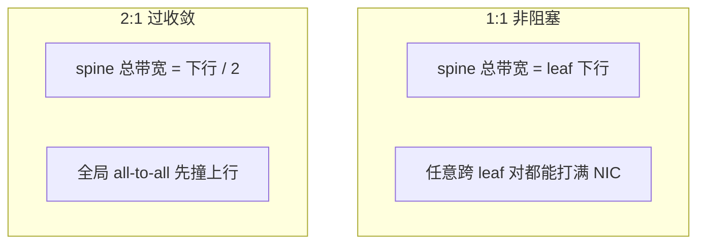
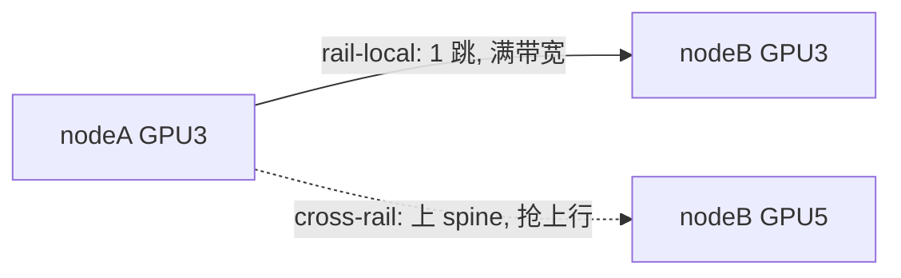
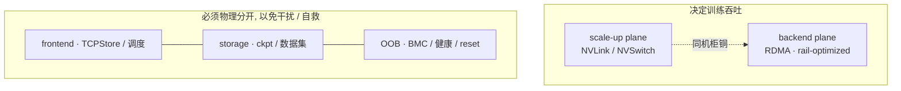

# 02 · scale-out fabric：拓扑与 rail 结构

> 出了 scale-up 域，跨机通信就要走 RDMA fabric 了。本篇讲这张网长什么样：fat-tree / Clos 的层级结构与收敛比、rail-optimized 拓扑到底是什么意思、以及一个集群实际上叠了哪几张物理平面。最后把 IB 运维的三件套（VL / adaptive routing / congestion）落到 DeepEP 的实际配置上看看。QP / WQE / GPUDirect 这些 verbs 层的对象留给下一篇 [`03`](./03_rdma_ib_verbs.md) 详细讲。
>
> 上一篇 [`01`](./01_scale_up_nvlink_nvl72.md) 讲的是 NVLink 那个高带宽的小天地；本篇要讲的是它外面那张低带宽、但能无限扩展的大网。

---

## 1. scale-out 的介质：IB vs RoCE

跨机 RDMA 有两条物理路线，软件接口（verbs）是一致的，差别在底层实现上：

| | InfiniBand (IB) | RoCE (RDMA over Converged Ethernet) |
|---|---|---|
| 链路层 | 专用 IB，无损靠 credit-based flow control | 以太，无损靠 PFC（priority flow control） |
| 交换机 | IB switch（自带 subnet manager、SHARP） | 标准以太交换机 |
| 调优难度 | 开箱即用更稳 | PFC/ECN 调不好易 deadlock/抖动 |
| 成本/生态 | 高，NVIDIA 主导 | 复用以太生态，便宜 |

DeepEP 的立场在这方面很有代表性：它的说法是「fully tested with InfiniBand，theoretically compatible with RoCE」（[[deepep:README.md#L373]]）。也就是说，目前生产环境的大规模训练默认仍然用 IB，RoCE 在成本敏感的场景里在慢慢上量，但调优确实是一门手艺。

---

## 2. fat-tree / Clos 与收敛比

scale-out fabric 的标准结构是 fat-tree（Clos 的一种）：GPU → leaf（ToR）→ spine →（大集群再加 core/SU 层）。

```
            spine  spine  spine  spine          ← 上层，决定跨 leaf 带宽
             │  ╲  ╱  │  ╲  ╱  │
            leaf    leaf    leaf    leaf         ← ToR，每台接一组 node 的 NIC
             │       │       │       │
          [node]  [node]  [node]  [node]         ← 每 node 8 GPU / 8 NIC
```

这里的核心指标叫**收敛比（oversubscription ratio）**：leaf 朝下（连 node）的总带宽，除以 leaf 朝上（连 spine）的总带宽。如果做到 **1:1 非阻塞（non-blocking）**，上行等于下行，任意一对通信双方都能跑满带宽，代价是 spine 侧的交换机和光模块数量要翻倍，成本很高。如果是**过收敛**（比如 2:1、4:1），上行带宽被砍到一半或四分之一，能省不少钱，但跨 leaf 的 all-reduce / all-to-all 会互相争抢上行链路，带宽因此打折。



> 图：收敛比是「leaf 朝下 ÷ 朝上」。训练的 DP AR / EP A2A 是全局流量，过收敛时有效带宽被上行锁死——拓扑直接决定 step time。

大规模训练之所以倾向于选择 1:1 非阻塞，原因在于 DP all-reduce 和 EP all-to-all 都是全局性的通信，流量会大面积地穿越 spine。一旦网络过收敛，这些 collective 的有效带宽就会被上行链路的瓶颈卡住，进而拖长整个训练 step 的时间。这是「网络拓扑直接决定训练吞吐」体现得最硬的一个例子。但也正因为非阻塞如此昂贵，才催生了下面要讲的 rail-optimized 设计，它的思路是尽量让流量不上 spine。

---

## 3. rail-optimized 拓扑

README 的「两个域与几个平面」已经提过，scale-out plane 内部还能再分出几条并行的子平面；这一节就把产生这种子平面的 rail-optimized 拓扑本身讲清楚。

### 3.1 定义

**rail（轨道）**指的是把每个 node 的第 i 张 NIC，都接到第 i 个 leaf 交换机上。一个 8-GPU node 有 8 张 NIC，于是整个集群的 scale-out plane 就被劈成了 8 个物理上独立的并行子平面（rail 0 到 rail 7）。第 i 张卡只接 rail i，不同 rail 之间在 leaf 这一层是不连通的，只有上到 spine 才会汇合。

```
        rail 0      rail 1      ...    rail 7      ← 8 个独立 leaf 平面(超平面)
        leaf_0      leaf_1             leaf_7
       ╱  │  ╲     ╱  │  ╲           ╱  │  ╲
   node0 node1.. node0 node1..    node0 node1..
   GPU0  GPU0    GPU1  GPU1        GPU7  GPU7
   └ 每个 node 的 GPU_i 都挂到 leaf_i = rail i ┘
```

### 3.2 rail-local 与 cross-rail 通信

- **rail-local（同 rail 跨机）**：node A 的 GPU3 发往 node B 的 GPU3，两者都在 rail 3，只过 leaf_3 一跳，不上 spine。带宽满、延迟低。
- **cross-rail（跨 rail）**：node A 的 GPU3 发往 node B 的 GPU5，必须经 rail3 上 spine 再下 rail5，要占用稀缺的上行带宽。



这条性质对软件非常有价值：如果一个 collective 能被安排成「只在编号相同的 GPU 之间通信」，那它就能全程走 rail-local，完全不上 spine。NCCL Device API 里，这样一个集合就叫 **`ncclTeamRail()`**（stride 等于 LSA team 的大小，见 [`01` §3.3](./01_scale_up_nvlink_nvl72.md)）。NCCL 的 PXN / rail-aware 优化（[`04` §3.7](./04_collectives.md)）就是在 all-reduce 场景下吃这顿午餐：跨 rail 时先经机内 NVLink 把数据交给「与目标同 rail」的 NIC，再一跳直接发出去。DeepEP 的实验分支 **LL-Layered**（[[deepep:README.md#L418]]）把同一思想用在了 low-latency all-to-all 上，它的说法是「optimizing cross-node LL operator communication using rail-optimized forwarding and data merging」——跨机转发尽量走同一条 rail，并且合并数据以减少消息数量（也就是在压 α）。

### 3.3 Dragonfly 作对照

超大规模（多 pod）场景下，有时会用 **Dragonfly / Dragonfly+** 拓扑替代纯粹的 fat-tree：把交换机分组，组内全连接，组间只用少量长链路相连，用更少的交换机和光纤覆盖更大的规模，代价是跨组路径变长、更依赖 adaptive routing 来打散流量。这可以看作是「省成本」和「保非阻塞」这条光谱上的另一个点；不过目前大模型训练的主流仍然是 rail-optimized fat-tree。

---

## 4. 几张物理平面：一个集群叠了几张网

把 [`README`](./README.md) 里的平面表展开成数据通路的视角来看：

```
                ┌─────────────────────────────────────────────┐
   训练吞吐相关  │ scale-up plane   NVLink/NVSwitch (机内/rack)  │  ← 01
                │ backend plane    RDMA rail-optimized fabric   │  ← 本篇, 决定跨机扩展性
                ├─────────────────────────────────────────────┤
   不在关键路径  │ frontend plane   以太/TCP: 调度·控制·rendezvous│
                │ storage plane    以太/IB: 读数据·写 ckpt       │
                │ OOB/mgmt plane   独立以太: BMC/IPMI 健康监控   │
                └─────────────────────────────────────────────┘
```



> 图：一个集群叠了多张物理网。backend 挂了还得靠 OOB 去 reset——这就是管理面必须独立的原因（[`05` §5](./05_reliability_at_scale.md)）。建 QP 的 rendezvous 走 frontend，见 [`03` §4.2](./03_rdma_ib_verbs.md)。

为什么要把这些平面物理上分开，有几个理由。一是隔离干扰：checkpoint 写盘（storage）产生的突发流量不能挤占 backend plane 上的 all-reduce，否则会造成训练 step 抖动，把它们放到不同的物理网络（或者同一张网络的不同 VL，见 §5）是最干净的隔离方式。二是故障独立：OOB/管理平面必须独立存在——一旦 backend fabric 挂掉，还得靠 OOB 去 reset 节点、读取健康状态（详见 [`05`](./05_reliability_at_scale.md)）。三是不让 rendezvous 抢带宽：`torch.distributed` 的 TCPStore、调度心跳这些走 frontend，不会碰到 backend。

---

## 5. IB 运维三件套

同一张 backend fabric 上会同时跑着多种 collective（EP all-to-all、DP all-reduce、PP P2P），它们彼此之间会产生干扰。IB 提供了三个机制来管理这种情况，DeepEP 的 README 给出了生产级别的建议，而且都可以核实：

### 5.1 Traffic isolation via Virtual Lane (VL)

IB 用 **Virtual Lane** 把一条物理链路切成多条逻辑上无损的通道。DeepEP 建议把 expert-parallel 流量和其他流量分到不同的 VL 上，避免互相挤占（[[deepep:README.md#L375-L386]]）。配置入口是 `sl_idx` 参数或者 `EP_OVERRIDE_RDMA_SL` 环境变量（[[deepep:README.md#L342]]）。

把 EP 的突发 all-to-all 和 DP 的稳态 all-reduce 隔离到不同的 VL 上，等于是在共享的物理链路上重新构建出了逻辑层面的平面分离。

### 5.2 Adaptive routing

Adaptive routing 是 IB 交换机的一个高级特性，作用是把流量均匀地打散到多条等价路径上。DeepEP 给出的建议很干脆：在所有网络负载下都推荐开启，即使它会引入一点额外延迟（[[deepep:README.md#L386-L388]]）。

背后的原因是：rail-optimized fat-tree 里，跨 rail 流量上 spine 时往往有多条等价路径，如果用静态路由（按 hash 分配），很容易把多条大流量压到同一条路径上，形成热点。而 adaptive routing 能让交换机按实时负载动态选路，避免 cross-rail 的 all-to-all 把某一条上行链路打爆。代价是包可能乱序到达，延迟也会略微增加，但对吞吐型的 collective 来说这笔账是划算的。

### 5.3 Congestion control

DeepEP 默认关闭 congestion control，因为它会损害峰值带宽；如果某些场景下拥塞确实不可避免，建议把那部分 workload 放到低优先级的 VL 上（[[deepep:README.md#L390-L392]]）。

这是一个乍看有些意外、但在 HPC 里很典型的取舍：训练流量的模式相对规整，而且追求峰值带宽，所以宁可放弃拥塞控制带来的限速保护，转而用 VL 优先级加上 adaptive routing 来管理冲突。

---

## 6. 小结

- scale-out fabric 是 RDMA over IB（主流）或 RoCE，结构是 fat-tree/Clos；**收敛比**决定全局 collective 的有效带宽，大模型训练倾向 1:1 非阻塞，但代价高。
- **rail-optimized 拓扑 = 把每 node 第 i 张 NIC 接到第 i 个 leaf**，scale-out plane 被分成 8 条独立 rail（即「几个超平面」）。rail-local 通信只过一跳、不上 spine，cross-rail 要上 spine、抢稀缺上行。NCCL PXN 与 DeepEP LL-Layered 都是在利用这条性质。
- 一个集群叠了 scale-up / backend / frontend / storage / OOB 多张物理平面，物理分离用于隔离干扰与保证故障独立。
- IB 运维三件套（VL traffic isolation、adaptive routing、congestion control）是在共享 fabric 上重建逻辑隔离与负载均衡的手段，DeepEP 给了可核实的生产建议。

---

下一篇：[03 · RDMA / InfiniBand 底层](./03_rdma_ib_verbs.md) —— 这张 RDMA fabric 在软件里长成 QP / WQE / CQ；弄清谁 post 一条 work request，再回 [`04`](./04_collectives.md) 看 collective 怎么落到这些对象上。
