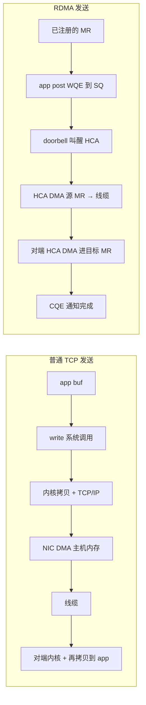
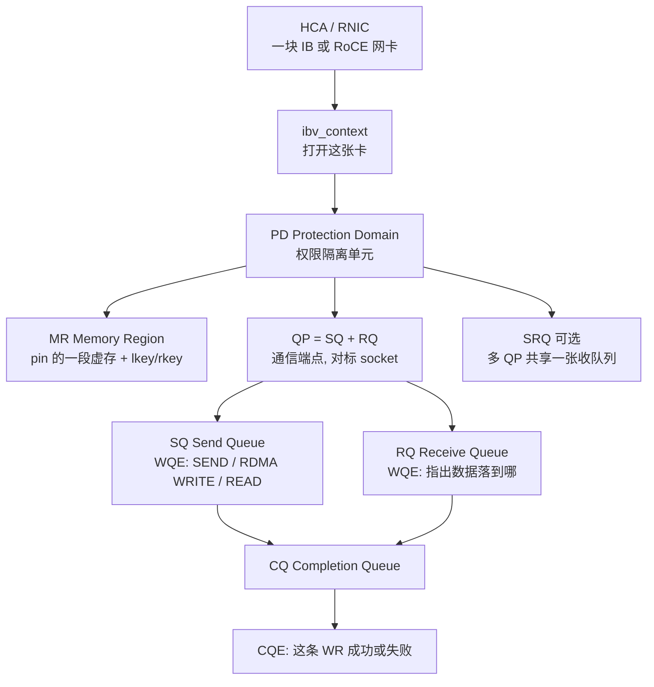
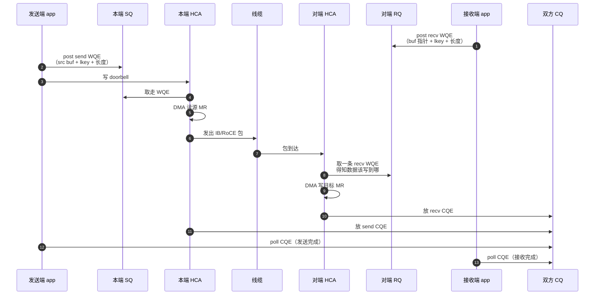
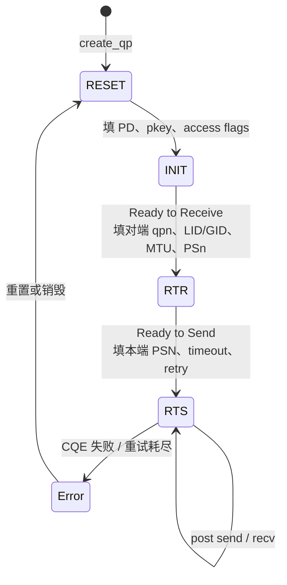
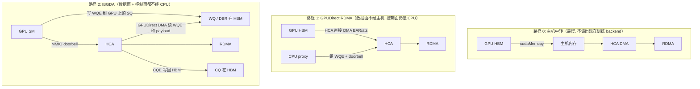
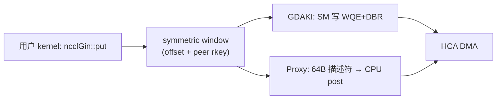

# 03 · RDMA / InfiniBand 底层

> [`02`](./02_scale_out_topology_planes.md) 把 scale-out 讲成了一张 rail-optimized 的 RDMA fabric。本篇要做的是把「RDMA」这个口号拆开，落到对象模型和一条消息完整的生命周期上：HCA、QP、WQ/WQE、CQ/CQE、MR 的 lkey/rkey、doorbell，以及 GPUDirect / IBGDA / NCCL GIN 分别是怎么把 CPU 从控制面拿掉的。读完之后应该能看懂 NCCL 的 proxy 路径、GIN 的 GDAKI/Proxy 后端，以及 DeepEP 的 IBGDA 各自 post 的到底是哪一层的东西。
>
> 阅读本篇之前，只需要知道跨机通信要走 NIC、IB 与 RoCE 在软件接口上同为 verbs（见 [`02` §1](./02_scale_out_topology_planes.md)）就够了。本篇会从零开始定义 Queue Pair 等对象，不假设你写过 `libibverbs`。
>
> 上一篇是 [02 · scale-out fabric：拓扑与 rail 结构](./02_scale_out_topology_planes.md)。下一篇会把这些底层对象收进 collective 的实现里：[`04`](./04_collectives.md) §3.6。

参考 / 事实来源：

- NVIDIA *RDMA Aware Networks Programming User Manual*（[在线版（已并入 DOCA 文档）](https://docs.nvidia.com/doca/sdk/rdma-aware-networks-programming-guide/index.html)、[PDF](https://docs.nvidia.com/rdma-aware-networks-programming-user-manual-1-7.pdf)）——QP / WQ / CQ / MR 的官方定义。
- InfiniBand Architecture（IBA）概述：SNIA *InfiniBand Architecture Overview*（HCA、WQE、credit-based flow control）。
- GPU 路径：NVIDIA [GPUDirect RDMA](https://docs.nvidia.com/cuda/gpudirect-rdma/)；[NVSHMEM + IBGDA](https://developer.nvidia.com/blog/improving-network-performance-of-hpc-systems-using-nvidia-magnum-io-nvshmem-and-gpudirect-async/)（WQ/DBR 迁到 GPU 显存、SM 写 doorbell）；NCCL [GIN / Device API](https://docs.nvidia.com/deeplearning/nccl/user-guide/docs/usage/deviceapi.html)（≥2.28.7）；论文 [GPU-Initiated Networking for NCCL](https://arxiv.org/abs/2511.15076)。
- 落到本仓库：DeepEP [[deepep:docs/nvshmem.md#L14]]（IBGDA）、NCCL NET / GIN（[集合通信：原语、算法、NCCL 实现与拓扑映射](./04_collectives.md)）。

---

## 0. 网卡是一台 DMA 机器，QP 是它的 socket

**RDMA（Remote Direct Memory Access）**指的是本端网卡按照事先登记好的权限，直接 DMA 读写对端进程的内存，整个数据面既不经过双方的 CPU，也不经过内核的 TCP/IP 协议栈。软件是通过 **verbs** 把「请网卡做的事」写成一条条条目，丢进 **Queue Pair** 里；网卡做完之后，会把结果丢进 **Completion Queue**。QP 可以类比 socket，但它的数据路径和 socket 完全不一样。



和 TCP 相比，RDMA 省掉的是系统调用热路径、内核协议栈、至少一次主机内存拷贝，以及 CPU 在数据面上的参与。代价是内存必须先 pin 住并注册，两端要先建好 QP，权限用 rkey 来管理——出错的方式也从「socket 返回 EAGAIN」变成了「CQE 带错误码 / QP 进入 Error 状态」。

LLM 集群里几乎所有跨机 collective（DP all-reduce、跨机 EP all-to-all、PP P2P）最终都要落到 post 这些 WQE 上。[`04`](./04_collectives.md) 里说的 $\alpha$（单次消息固定开销），很大一部分就是「组 WQE + doorbell + 对端处理 CQE」这几步的耗时；IBGDA 要砍掉的，正是其中 CPU proxy 那一段。

---

## 1. 对象模型

verbs 并不是某一种具体 API 的函数名，而是 IBA 规定的「通道适配器必须提供的操作集合」。Linux 上最常见的实现是 **`libibverbs`**（比如 `ibv_create_qp`）；NCCL、NVSHMEM、rdma-core 都是建立在这一层之上的。这些对象之间的关系如下：



| 对象 | 全称 | 一句话 | 对标直觉 |
|---|---|---|---|
| **HCA** | Host Channel Adapter | 本机那块会 RDMA 的网卡（RoCE 上也叫 RNIC） | 「这块 NIC」 |
| **PD** | Protection Domain | 哪些 QP 可以碰哪些 MR 的隔离域 | 进程内的安全组 |
| **MR** | Memory Region | 一段被 pin、并写入网卡页表的内存 | 「网卡能 DMA 的那片」 |
| **lkey / rkey** | local / remote key | 本端 / 对端引用这块 MR 的票据 | 文件描述符 vs 发给别人的能力 |
| **WQ** | Work Queue | 给网卡的指令 FIFO | 提交队列 |
| **QP** | Queue Pair | **一对** WQ：Send Queue + Receive Queue | socket |
| **WR / WQE** | Work Request / Work Queue Element | 一条「请做 SEND/WRITE/READ…」的描述符（读 wookie） | 一次 I/O 请求 |
| **CQ / CQE** | Completion Queue / Entry | 完成通知 FIFO（读 cookie） | epoll 里的 completion |
| **SRQ** | Shared Receive Queue | 多个 QP 共用的收队列，省 WQE 内存 | 共享 recv ring |
| **AH** | Address Handle | UD 模式下的目的地址缓存 | UDP 的对端地址 |
| **doorbell** | — | 写网卡 MMIO，告诉它 SQ 里有新 WQE | 「敲一下铃」 |

NVIDIA 官方手册原句是这样描述 QP 的：*"the pair (send queue and receive queue) of independent WQs packed together … Posts are used to initiate the sending or receiving of data."* CQ 则是 *"an object which contains the completed work requests"*，多个 QP 的 send/recv 完成通知可以都挂到同一张 CQ 上轮询。

---

## 2. 一条消息的生命周期

先看两端都要参与的双边操作，把队列是怎么转起来的看清楚。单边的 RDMA Write/Read 留到 §3 再讲。



把这个过程逐步拆开看：

1. **接收端必须先 post recv**（这是双边 SEND/RECV 的要求）。WQE 里写的是「数据要落到哪段已注册的内存」，而不是「我这次 recv 系统调用要挂起等待」。如果 RQ 是空的但包已经到了，这条 QP 会报出 RQE/WQE 类错误（RNR，Receiver Not Ready），可靠连接还会按照重试策略去处理它。
2. **发送端 post send 加 doorbell**。只把 WQE 链进 SQ 是不够的，HCA 并不会主动轮询主机内存来判断有没有新工作，必须由软件写它的 doorbell register（一次 MMIO 写操作），它才去拉取 WQE。这正是 $\alpha$ 里「发起一次传输」对应的硬件动作。
3. **HCA 自己 DMA**。之后 CPU 就可以去做别的事情了，数据面完全是网卡在读写 MR。
4. **完成看 CQ，不看 return 值**。`ibv_post_send` 返回成功只表示「WQE 已经进队」，真正的成功/失败、实际传输长度、立即数这些信息，都记录在 CQE 里。既可以选择 poll（忙等，延迟低），也可以注册 completion event（省 CPU，但延迟稍高）。
5. **CQ 是 FIFO，而且可以被多个 QP 共享**。一个进度线程可以 poll 一张大的 CQ，分发所有 QP 的完成通知——NCCL 的 proxy 线程用的就是这种结构。

这里有个术语上的对照要说明一下：软件调用叫做 post a WR；进到队列里的那条描述符叫 WQE；硬件做完之后写下的叫 CQE（也叫 Work Completion，简称 WC）。口语里 WR/WQE 经常被混用，指的其实是同一条指令。

---

## 3. 操作类型：双边 vs 单边

QP 上能 post 的 opcode 分成两大类，LLM 通信库两种都会用到。

### 3.1 双边：SEND / RECV

这和 socket 的 `send`/`recv` 最像：发送端指定数据源，接收端必须提前准备好目标缓冲区。适合「对端要先声明接收」的控制类消息，也适合不想把 rkey 暴露给对端的场景。

### 3.2 单边：RDMA Write / RDMA Read

单边操作的特点是：发起端同时知道数据的源和目的，对端的 RQ 上不需要有对应的 WQE，对端的 CPU 甚至可以完全不参与这次数据搬运。

| opcode | 谁 DMA | 发起端需要什么 | 对端 CPU |
|---|---|---|---|
| **RDMA Write** | 本端 HCA 读本地 MR，对端 HCA 写远程 MR | 远程虚址 + **rkey** + 长度 | 不参与数据面（可选 CQE） |
| **RDMA Read** | 对端 HCA 读远程 MR，本端 HCA 写本地 MR | 同上 | 不参与 |
| **Atomic**（CmpSwap / FetchAdd） | 对端 HCA 在远程地址上原子改 | 远程虚址 + rkey | 不参与 |

```
RDMA Write（最常见的「把这块 GPU 显存推到对面」）:

  本端:  post WQE{ opcode=WRITE, local_addr, lkey, remote_addr, rkey, len }
         doorbell
  对端:  内存自己变了。可以不 poll CQ——直到本端用 SEND Imm 或写一个 flag 通知「写完了」。
```

这也是为什么 RDMA Write 特别适合 all-to-all / P2P 这类大数据传输：对端不需要提前为每一条消息 post recv（从而避免 RNR），发起端只要带着 rkey，就能把数据直接「拍」进对端预先登记好的窗口里。DeepEP / NVSHMEM 的 payload 路径本质上走的就是这条路；至于「写完了没有」，另外用 flag、atomic 或者 completion 来同步——这对应的正是 [`04`](./04_collectives.md) LL 协议里「数据和 flag 交织」的思路，只是把介质从 NVLink 换成了 RDMA。

### 3.3 立即数与通知

RDMA Write 还可以带上 **immediate data**（跟在包后面的几个字节）：数据本身是单边写进 MR 的，但这一次会让对端的 RQ 消耗掉一条 WQE 并产生一个 CQE，相当于「单边搬数据，同时附带双边的通知」。如果不想消耗 RQ，也可以约定在 payload 末尾写一个 flag，让对端轮询这个 flag——虽然延迟低但费带宽，这和 NCCL 的 LL 协议是同一套思路。

---

## 4. QP 类型与状态机

### 4.1 RC / UC / UD

创建 QP 时就要选定类型，之后不能再改，这个选择决定了它是否可靠、能不能做单边操作：

| 类型 | 全称 | 可靠? | 单边 RDMA | 连接? | LLM 里谁用 |
|---|---|---|---|---|---|
| **RC** | Reliable Connection | 是（顺序、重传、ACK） | Write/Read/Atomic | 一对一 | **默认**。NCCL IB、NVSHMEM、DeepEP 跨机 |
| **UC** | Unreliable Connection | 否 | 仅 Write | 一对一 | 少见 |
| **UD** | Unreliable Datagram | 否 | 否（只有 SEND） | 无连接，靠 AH | 管理面、偶尔的发现 |

训练用的 fabric 几乎全部用 RC QP：collective 是不能丢包的，一旦丢包就会 hang 在 barrier 上（[`05`](./05_reliability_at_scale.md) 里说的 straggler / hang）。代价是每建一个连接都要维护一对 QP 的状态，QP 数大致等于通信对数，规模大了之后要控制「每张卡对多少远端建立连接」，这和 [`04` §5.1](./04_collectives.md) 里的 node-limited 扇出其实是同一类资源账。

### 4.2 状态机

新建出来的 QP 停在 **RESET** 状态，不能收发数据，必须按顺序调用 `ibv_modify_qp`（或者由 CM 代劳）：



两端都要走到 **RTR** 才能开始接收，都要走到 **RTS** 才能开始发送。这个过程中需要交换的关键信息包括：**QPN**（QP number，对端的端点号，类似端口）；**LID**（IB 子网内的局部 ID）或者 **GID**（用于 RoCE / 跨子网，是 IPv6 形态的地址）；**PSN**（Packet Sequence Number）初值，RC 靠它来检测重传；以及如果走单边操作，还需要另外交换 **rkey 和远程缓冲地址**。

这个交换过程本身走的是 **Communication Manager（CM）**，或者训练框架自己的 TCPStore / 控制面（对应 [`02`](./02_scale_out_topology_planes.md) 的 frontend plane）。也就是说，数据面走的是 RDMA，但控制面的建连过程往往仍然走以太网——这不是浪费，而是故意把 rendezvous 留在不会抢占 backend 带宽的那张平面上。

---

## 5. 内存注册：pin、页表、lkey/rkey

HCA 做 DMA 用的是物理页。进程里普通的 `malloc` / `cudaMalloc` 对网卡来说是不可见的，必须先把它做成 MR 才行：

```
ibv_reg_mr(pd, addr, length, access):
  1. pin：页锁在物理内存, 禁止 swap / 搬家
  2. 把 虚址→物理 页表写进 HCA
  3. 按 access 生成 lkey（本端 WQE 用）、rkey（发给对端做单边）
```

权限位常见的组合有：`LOCAL_WRITE`（本端 recv / RDMA Read 的落点）、`REMOTE_WRITE`、`REMOTE_READ`、`ATOMIC`。这里要特别注意：**rkey 一旦泄漏，就等于对端可以随意写你这片内存**，所以 PD 把 QP 和 MR 绑定在一起，只有同一个 PD 里的 QP 才能用这把 key。

注册这个动作本身很贵（要 pin 内存、走内核、灌网卡页表），所以通信库通常都会预先注册一大块 buffer，运行时只往窗口里填数据——NCCL 的 `NCCL_BUFFSIZE` FIFO、DeepEP 的通信 buffer，用的都是「一次注册、反复 post WQE 指向其中不同偏移」这种模式。

GPU 显存的注册方式和普通内存不一样，不是走 `get_user_pages`，而是走 NVIDIA 驱动提供的 peer-mem / dma-buf 路径，下一节会讲这个。

---

## 6. 三条 GPU 数据路径：拷贝、GPUDirect、IBGDA / GIN

跨机搬运的是 GPU 显存里的张量。从慢到快一共有三条路，分别对应[集合通信：原语、算法、NCCL 实现与拓扑映射](./04_collectives.md)里提到的几种方式。GIN 是第三条路上 NCCL 给出的产品名，IBGDA 是 NVSHMEM 给出的产品名，两者用的 verbs 对象其实是相同的。



### 6.1 GPUDirect RDMA：NIC 能看见 HBM

这条路径的前提条件是 GPU 与 NIC 处于同一个 PCIe root complex 下、可以做 P2P（或者经过支持 ATS 的交换机），并且加载了 `nvidia-peermem` / dma-buf 驱动。这样一来，HCA 就可以把 GPU 显存当作 MR 来直接 DMA，payload 不再需要经过主机 DRAM 中转。不过控制面仍然是传统方式：GPU kernel 算完之后通知 CPU，CPU 调用 `ibv_post_send`，再写 doorbell。

这已经比路径 0 快了一个主机往返的时间；但每次发起仍然要叠加一次「GPU 唤醒 CPU」的固定开销，在小消息场景下，这笔固定开销正是 $\alpha$ 的大头。

### 6.2 IBGDA：SM 自己 post WQE

**IBGDA（InfiniBand GPUDirect Async）** 把控制面也搬到了 GPU 上（这是 NVIDIA NVSHMEM 2.6+ 引入的特性；DeepEP 的 low-latency 路径就建立在它之上，见 [[deepep:docs/nvshmem.md#L14]]）。具体做法分几步：首先把 WQ、doorbell record 放在 GPU 显存里，让 SM 能够直接写 WQE；然后 SM 直接写 NIC 的 doorbell MMIO（这块地址被映射进了 GPU 的地址空间）；接着 NIC 用 GPUDirect 去读 WQE、读 payload，再把 CQE 写回 GPU 上的 CQ；整个过程中，**CPU 完全不在这条环路上**。

用 NVIDIA 博客里的说法来对比：CPU proxy 的流程是「kernel 产生数据 → 主机上的 NVSHMEM 代理组装描述符 → NIC」；而 IBGDA 的流程是「SM 组装描述符并敲铃 → NIC 自己来取」。被砍掉的是 post WQE 这条控制路径，而不是 RDMA 协议本身。DeepEP 的 low-latency 路径正是建立在这套机制之上（[[deepep:docs/nvshmem.md#L14]]；启用方式见 [[deepep:docs/nvshmem.md#L32-L55]]，包含传统 IBGDA 与 CPU-assisted 两种模式），对应的正是 [`04` §5.4](./04_collectives.md) 讲的 decode 路径。

decode 或者低延迟 all-to-all 每一步只有几百个 token，$m/\beta$ 很小，总时间几乎就是 $\alpha$。[`04` §2.1](./04_collectives.md) 讲的 latency-bound 在这里正好落地：同一套 RC QP、同一套 RDMA Write，只是换了「谁来写 WQE」，$\alpha$ 就能明显掉一截。而吞吐型的 normal kernel 反而可以继续用 channel 加上 CPU/代理流水的方式，去打满 $\beta$。

### 6.3 NCCL GIN：同一套 window，两条 RDMA 后端

GIN 把 §6.2 里「谁来 post WQE」这件事，收进了 NCCL Device API 里，而不是像 NVSHMEM 那样另外拉一套独立的体系。它的前提是 [`01` §3](./01_scale_up_nvlink_nvl72.md) 讲过的 **symmetric window**：各 rank 先做 `ncclMemAlloc` 加 `ncclCommWindowRegister`，kernel 里就只需要看到 `(window, offset, peer)` 这几个信息。一旦出了 LSA team，就必须走消息语义，这正是 GIN 要处理的场景。

官方要求（见 [deviceapi · GIN](https://docs.nvidia.com/deeplearning/nccl/user-guide/docs/usage/deviceapi.html)，需要 NCCL ≥ **2.28.7**）是：在 `ncclDevCommCreate` 时声明 `worldGinBarrierCount` / `ginSignalCount` / `ginConnectionType = NCCL_GIN_CONNECTION_FULL`；device 侧创建 `ncclGin gin{devComm, ctx}`，然后调用 `put` / `get` / `waitSignal` / `flush`。相关论文把它拆成了四个部分：

1. **Window 集体注册**：一次 `ncclCommWindowRegister` 就能换回所有 peer 的 rkey / handle，one-sided 操作不再需要现场注册 MR。
2. **Device API**：以 thread / warp / CTA 协作的方式工作，小消息可以 inline 处理，完成状态分为本地（`flush`、counter）和远端（`signal`）两种。
3. **双后端**：
   - **GDAKI**（GPUDirect Async Kernel-Initiated）：基于 DOCA GPUNetIO，由 SM 直接给 IB/RoCE NIC 写 doorbell，和 NVSHMEM 的 IBGDA 是同一条控制面思路，需要较新版本的 rdma-core / 内核 / OFED 或者 DOCA。
   - **Proxy**：走 GPU 到 CPU 的 64 字节无锁描述符队列，再由 CPU 调用 `ibv_post_send`。任意 RDMA NIC 都能用，代价是 $\alpha$ 会比 GDAKI 高一截，但不需要依赖 IBGDA 驱动。
4. **fence**：按 thread scope 自动插入，和 CUDA 的内存模型保持一致。



> 图：GIN 不发明新的 RDMA 协议。它发明的是「用户 kernel + NCCL window」这一层；底下仍是 §2 的 QP / WQE。DeepEP V2 的 [[deepep:csrc/kernels/backend/nccl.cu]] 走这条，V1 的 [[deepep:csrc/kernels/backend/nvshmem.cu]] 走裸 IBGDA——verbs 对象相同，初始化是否复用框架 `ncclComm` 不同（[06 · DeepEP：V1 (legacy/NVSHMEM) 与 V2 (elastic/NCCL Gin)](../moe/06_deepep.md)）。

`SegmentType` 允许一个 window 里混合 `DEVICE` 与 `HOST_NUMA` 两种段。DeepEP V2 的 `ElasticSymmetricMemory`（[[deepep:csrc/kernels/backend/symmetric.hpp#L145-L186]]）就是这样一段虚拟地址：前半部分是 HBM，后半部分是 host 内存，Gin 可以直接从这种混合页发起 RDMA，不必先把数据拷回显存。

Host 侧还有 **one-sided** 的 `ncclPutSignal` / `ncclWaitSignal`（需要 NCCL ≥ 2.29，见 [p2p](https://docs.nvidia.com/deeplearning/nccl/user-guide/docs/usage/p2p.html)）：由 CPU 调用，目标 window 必须已经注册好，对端不需要配对一个 `recv`。这可以看作是 GIN 在 host 侧的兄弟接口，而不是 Device API 的一部分。

### 6.4 和 NCCL / DeepEP 的对应

| 通信库路径 | 用的底层对象 | 谁 post WQE | 对应场景 |
|---|---|---|---|
| NCCL NET + CPU proxy | RC QP、预注册 FIFO MR | 主机 proxy 线程 | 大消息、打满带宽（[`04` §3.6](./04_collectives.md)） |
| NCCL GPUDirect RDMA | 同上，MR 在 HBM | 仍是 proxy | 去掉主机拷贝 |
| NCCL GIN Proxy | window 上的 rkey + 描述符队列 | CPU（被 GPU 踢一脚） | Device API 要跨机、但没有 IBGDA 驱动 |
| NCCL GIN GDAKI | window + 显存里的 SQ/DBR | **SM** | NCCL 产品化的 IBGDA（DeepEP V2） |
| NVSHMEM IBGDA / DeepEP LL | RC QP，WQ/CQ 在 HBM | **SM** | decode、小消息（[`04` §5.4](./04_collectives.md)） |
| 机内 NVLink / LSA / CE | **不走 QP** | GPU ld/st 或 Copy Engine | scale-up 域（[`01` §3](./01_scale_up_nvlink_nvl72.md)） |

scale-up 域「可以直接 load/store」（[`01` §1](./01_scale_up_nvlink_nvl72.md)）和 scale-out 域「必须 post WQE」，这两者是本质上的区别。TP 的细粒度 all-reduce 之所以要待在 NVLink 上，并不是口味问题，而是因为 $\alpha$ 差着一到两个数量级：NVLink 上根本没有「组 WQE + 过交换机 credit」这一条链路。GIN / IBGDA 能砍掉的是控制面上的 CPU 参与，但砍不掉交换机本身的 hop。

---

## 7. IB 链路层：credit、VL、LID

verbs 层之上是对象模型，之下则是 [`02` §5](./02_scale_out_topology_planes.md) 已经用到过、这里补充定义的一些链路层机制。

### 7.1 credit-based flow control（无损）

IB 链路用的是 credit 机制：接收端有缓冲的时候才发放 credit，发送端没有 credit 就必须停下来。所以 IB 在链路层上是无损的，它不像 TCP 那样靠丢包重传来当作拥塞信号（RC 的 ACK/重传是端到端层面的另一件事）。RoCE 没有原生的 credit 机制，要靠 **PFC**（Priority Flow Control）在以太网上模拟无损传输，如果调不好会导致整网限速甚至 deadlock——这正是 [`02` §1](./02_scale_out_topology_planes.md) 里说「IB 开箱更稳、RoCE 调 PFC 是门手艺」的底层原因。

### 7.2 Virtual Lane 与 Service Level

一条物理链路可以切成多条 **VL（Virtual Lane）**，每一条都有自己独立的 credit。QP 上的 **SL（Service Level）** 会被子网管理器映射到某一条 VL 上。DeepEP 建议把 EP 流量和其他流量分到不同 VL（[[deepep:README.md#L375-L386]]，入口是 `sl_idx` 参数或者 `EP_OVERRIDE_RDMA_SL` 环境变量），说到底就是同一根物理线上跑两套独立的 credit，彼此不占用对方的无损通道。

### 7.3 寻址：LID、GID、子网管理器

- **LID**：IB 子网内的 16-bit 地址，交换机按照 LID 转发表来转发数据，由 **Subnet Manager（SM）** 负责分配。
- **GID**：128-bit 地址，在 RoCE 上通常是由 IPv6/IPv4 映射而来的。
- **SM**：IB 特有的控制面大脑，负责计算路径、配置 VL、管理多路径；以太网上的 RoCE 没有对等的单一 SM，路由要靠交换机自己的 ECMP / adaptive 机制来完成。

adaptive routing（见 [`02` §5.2](./02_scale_out_topology_planes.md)）改变的是 LID 路径在多条等价链路上打散的方式；这个过程对 verbs 应用是透明的，但 RC 必须能够接受包乱序到达再重新排序——这也是「开启 AR 会多一点延迟、换来不拥塞」这个权衡的具体体现。

---

## 8. 资源与性能账：QP 数、WQE 深度、α 从哪来

把这套对象模型收回到 [`04`](./04_collectives.md) 的 $\alpha$-$\beta$ 模型里看：

```
T = α + m/β

α ≈  组 WQE
   + doorbell MMIO
   + HCA 调度
   + 线缆/交换机 hop（credit、VL）
   + 对端 DMA + CQE
   + （若走 proxy）GPU→CPU 唤醒
```

| 旋钮 | 影响 | 过大 / 过小 |
|---|---|---|
| QP 数 | 一对通信对一条 RC | 太多：HCA 缓存抖动、建连慢；太少：多流挤一条 QP 无法并行 |
| SQ/RQ 深度 | 能 in-flight 多少 WQE | 太浅：RNR / 发不动；太深：占 pin 内存 |
| WQE 大小 / SGE 数 | 一条消息几段 gather | 多 SGE 灵活，但描述符更贵 |
| CQ 共享 vs 每 QP 一张 | poll 效率 | 一张大 CQ 适合 proxy 线程 |
| 注册窗口大小 | 对应 NCCL `BUFFSIZE` | 见 [`04` §3.5](./04_collectives.md) chunk-pipeline |

大规模 EP 里「不能对所有 rank 建全连接 QP」这个约束，和 routing 里的 `group_topk` 其实是同一个约束的两端体现：一个落在通信库层面，一个落在算法层面（[`04` §5.1](./04_collectives.md)）。

---

## 9. 小结

- RDMA 的数据面是 **HCA DMA 已注册 MR**；控制面是 **post WQE → doorbell → poll CQE**。QP = SQ+RQ，对标 socket。
- 双边 SEND/RECV 要求对端先 post recv；单边 **RDMA Write/Read** 带着 rkey 直接拍对端内存，是 collective 大数据路径。
- 训练默认 **RC QP**，状态机 RESET→INIT→RTR→RTS；建连信息走 frontend，数据走 backend。
- MR 要 pin；rkey 是远程写权限。通信库预注册大块，运行时只改偏移。
- GPU 三条路：主机中转（不该出现）→ GPUDirect（payload 直达，CPU 仍 post）→ **IBGDA / GIN GDAKI（SM 写 WQE+doorbell）**。NVSHMEM 与 DeepEP V1 走裸 IBGDA；NCCL GIN 把同一控制面挂在 symmetric window 上（GDAKI 或 Proxy）。砍的是 $\alpha$ 里的 CPU proxy，不是交换机 hop。
- IB 无损靠 **credit + VL**；RoCE 用 PFC 模拟。SL→VL 是 DeepEP 隔离 EP 流量的那条旋钮。
- scale-up 无 QP（load/store），scale-out 必 QP——这是两域 $\alpha$ 差一个数量级的微观解释。

---

下一篇：[集合通信：原语、算法、NCCL 实现与拓扑映射](./04_collectives.md) —— 集合通信怎样把 ring/tree 落到 channel，跨机段又怎样变成刚才这些 WQE（proxy / GPUDirect / IBGDA）。
