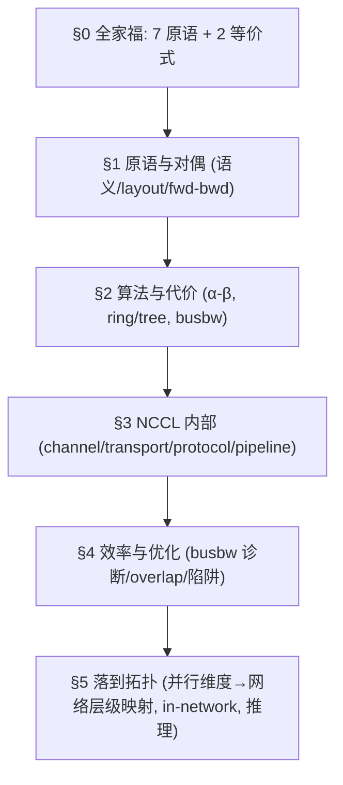
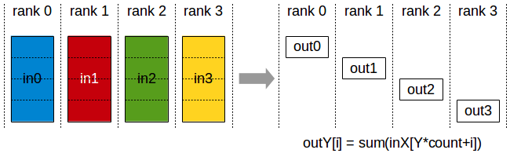
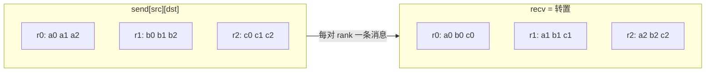
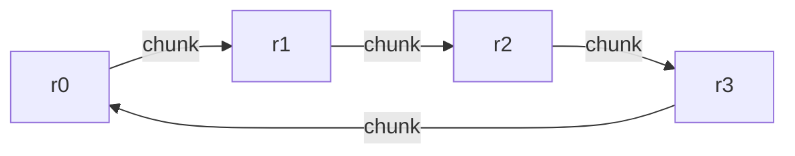
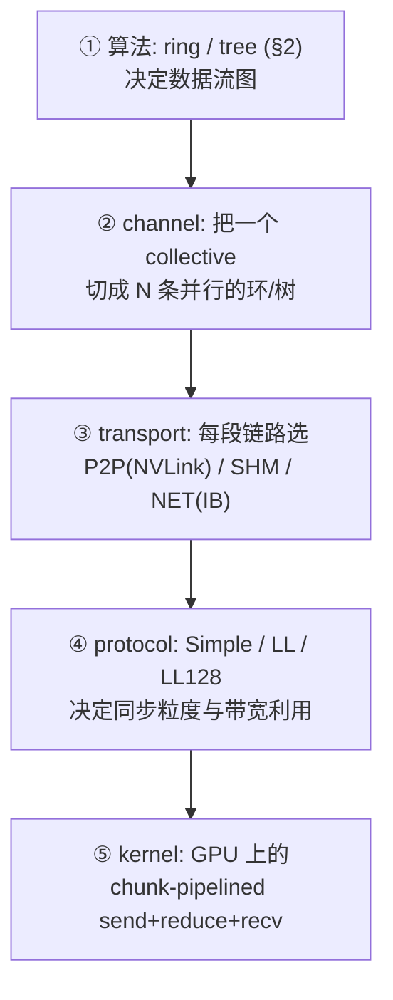
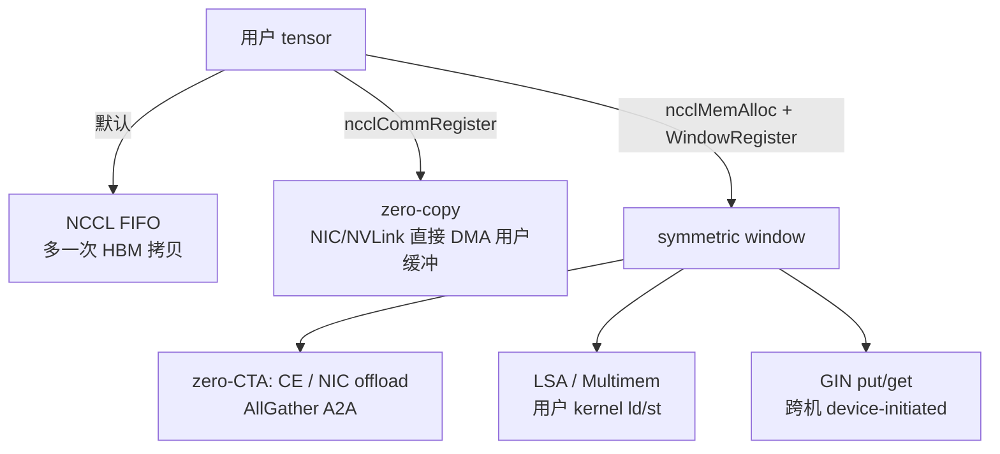
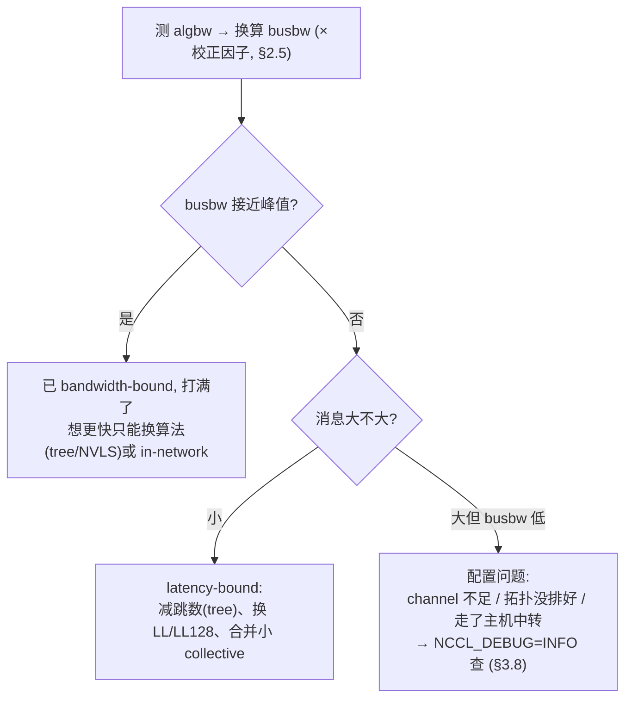
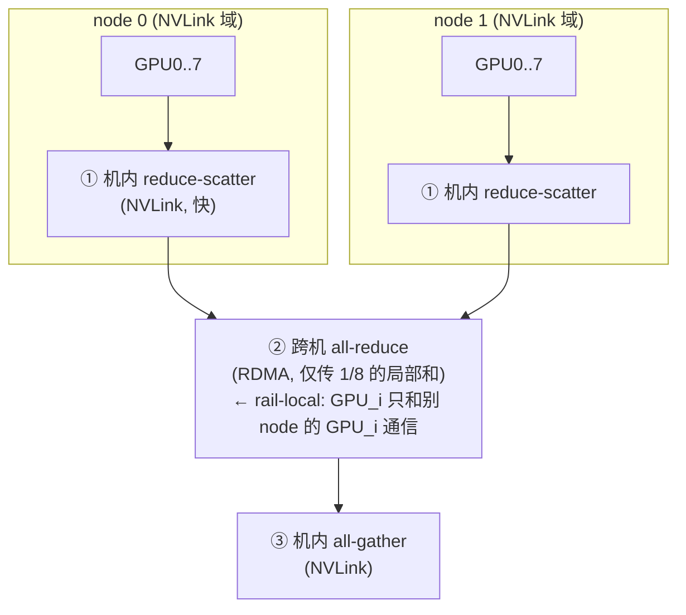

# 集合通信：原语、算法、NCCL 实现与拓扑映射

> 本文是一篇自洽的长文，把集合通信从原语到落地的整条链路讲清楚：先讲原语语义与对偶，再讲算法与代价，然后进入 NCCL 内部实现，接着谈效率与优化，最后落到怎么映射到 GPU 集群的物理拓扑与并行维度。它是 [GPU 集群与网络](./README.md)的通信底座，也是[并行策略](../parallel/README.md)（TP/CP/DP/PP/EP）的公共依赖。
>
> 和相邻内容的边界是这样划分的：怎么用 torch API 调用这些原语（`dist.all_reduce`、async work、DeviceMesh）见 [04 · torch.distributed：通信原语、process group、DeviceMesh](../torch/04_distributed.md)，本文不重复讲 API 用法，只讲 API 背后算的是什么、怎么实现、效率边界在哪、怎么落到硬件上。
>
> 阅读本文之前，只需要知道多进程/多卡之间要交换张量，以及 `send/recv` 这种点对点通信的基本语义。本文会从定义出发，讲清楚各个 collective 的数据布局与等价分解，再落到 NCCL 与训练框架里的具体用法。

参考 / 事实来源：

- 原语语义与示意图采自 **NVIDIA NCCL User Guide · Collective Operations**（图见正文外链）。
- NCCL 实现细节为公开通用知识（本仓库不维护 NCCL 镜像），文中标注「概念性 / 量级」；凡能落到 DeepEP 上游实现的（channel/SM 预算、IBGDA、FP8 通信）给出固定版本代码链接。
- 硬件带宽、symmetric window / LSA / CE 见 [`01`](./01_scale_up_nvlink_nvl72.md)；rail 见 [`02`](./02_scale_out_topology_planes.md)；跨机 WQE / GPUDirect / IBGDA / GIN 见 [`03`](./03_rdma_ib_verbs.md)。

整章贯穿的符号约定：$p$ 表示 rank 数；每个 rank 持有 $n$ 个元素（标记为 $[n]$）；rank 记作 $r_0 \dots r_{p-1}$；$+$ 表示逐元素规约（sum/min/max，下文以 sum 为例）；$\alpha$ 是单次消息的固定开销，$\beta$ 是链路带宽。

---

## 0. 7 个原语 + 2 条等价式

先把整篇文章浓缩成一张「原语全家福」。集合通信的全部原语，其实可以由三个维度组合出来：是否带规约（reduce）、结果落到一个 rank 还是所有 rank、数据是聚拢还是打散。

| 原语 | 带规约? | 结果在 | in → out（每 rank 视角） | 典型并行场景 | NCCL 官方图 |
|---|---|---|---|---|---|
| **Broadcast** | 否 | 所有 | root 的 $[n]$ → 所有 rank $[n]$ | 参数广播、root 发配置 | [broadcast.png](./assets/nccl/broadcast.png) |
| **Reduce** | 是 | 仅 root | 各 rank $[n]$ → root $[n]$（逐元素 $\sum$） | 汇总到一处 | [reduce.png](./assets/nccl/reduce.png) |
| **AllReduce** | 是 | 所有 | 各 rank $[n]$ → 所有 rank 同一份 $[n]$ | **DP 梯度同步**、TP partial-sum | [allreduce.png](./assets/nccl/allreduce.png) |
| **AllGather** | 否 | 所有 | 各 rank $[n]$ → 所有 rank $[p \cdot n]$（按 rank 拼接） | **FSDP 收 param**、SP/TP 收 activation | [allgather.png](./assets/nccl/allgather.png) |
| **ReduceScatter** | 是 | 所有 | 各 rank $[p \cdot n]$ → 所有 rank $[n]$（规约后按 rank 切块） | **FSDP/ZeRO 散梯度**、SP | [reducescatter.png](./assets/nccl/reducescatter.png) |
| **AllToAll** | 否 | 所有 | 各 rank 给每个 rank 发一块 → 转置式重排 | **MoE dispatch/combine**、CP Ulysses | —— |
| Gather / Scatter | 否 | 仅 root / 所有 | AllGather / Broadcast 的「单 root」版 | 较少单独用 | —— |

这里有一个 NCCL 的约定值得提前说明：root 指的是 rank 索引，而不是物理 device 号，所以 root 具体落在哪块卡上，其实是受 rank-to-device 映射影响的（§1 会展开讲）。

### 两条等价式

```
AllReduce  ==  Reduce  then  Broadcast
AllReduce  ==  ReduceScatter  then  AllGather      ← ring all-reduce 的实现根据
```

第二条尤其重要：**ring all-reduce 本质上就是「先做 ring-reduce-scatter，再做 ring-all-gather」**（细节在 §2）。这也顺带解释了为什么 FSDP 把一次 DP all-reduce 拆成 reduce-scatter（散梯度）加 all-gather（收参数）两步并不吃亏——因为这两种写法本来就是等价的（见 [03 · FSDP = ZeRO-3：逐层 all-gather 参数、用完即扔](../parallel/01_dp/03_fsdp.md)）。

### 全文地图



它和相邻章节的分工是这样的：

```
   API: 怎么调            torch/04_distributed.md   (dist.all_reduce / DeviceMesh / async)
   原理: 算什么/怎么实现   ★ 本文 §0–§4 ★            (原语 → 算法 → NCCL 实现 → 效率)
   拓扑: 落到哪条链路      ★ 本文 §5 ★ + hpc/01,02   (映射表 / SHARP / 并行维度→网络层级)
   消费方: parallel/*     TP / CP / DP / PP / EP
```

---

## 1. 原语与对偶：语义、layout 与 forward/backward 对称

本节把 7 个原语逐个说清楚：语义、in/out layout、是否带规约、结果落在哪。每个都配上 NCCL 官方图和 ASCII 图示。然后建立两套贯穿全文的结构——代数等价式（§0 已给出）和 forward/backward 对偶表（§1.7）。

### 1.1 Broadcast


> 图：Broadcast 的数据布局——只有 root 的缓冲进入，所有 rank 拿到同一份。（NCCL User Guide, Collective Operations；本地镜像自 [docs.nvidia.com/…/broadcast.png](https://docs.nvidia.com/deeplearning/nccl/user-guide/docs/_images/broadcast.png)）

Broadcast 的语义是把 root rank 的一个 $[n]$ 缓冲区原样复制到所有 rank（NCCL 官方定义是 "copies an N-element buffer from the root rank to all the ranks"）。

```
        in                         out
 r0(root) [a b c]          r0 [a b c]
 r1       [ . . ]   ──►     r1 [a b c]
 r2       [ . . ]          r2 [a b c]
 r3       [ . . ]          r3 [a b c]
```

它不带规约，结果分发到所有 rank。这里也要提一句：root 是 rank 索引，不是 device 号，所以 root 落在哪块物理卡上取决于 rank-to-device 映射，这会影响它在拓扑里的位置。

### 1.2 AllGather


> 图：AllGather——每 rank 贡献一块，所有人拿到按 rank 拼好的整段。（NCCL User Guide；本地镜像 [allgather.png](https://docs.nvidia.com/deeplearning/nccl/user-guide/docs/_images/allgather.png)）

AllGather 的语义是从 $p$ 个 rank 各收一份 $[n]$，拼成 $[p \cdot n]$（按 rank 索引排序），再分发给所有 rank。

```
        in                              out (所有 rank 相同)
 r0 [A]                         r0 [A B C D]
 r1 [B]      ──AllGather──►      r1 [A B C D]
 r2 [C]                         r2 [A B C D]
 r3 [D]                         r3 [A B C D]
```

输出是按 rank 索引拼接的（同样受 rank-to-device 映射影响）。典型用途是 FSDP 在 forward 前把分片的参数收齐（[03 · FSDP = ZeRO-3：逐层 all-gather 参数、用完即扔](../parallel/01_dp/03_fsdp.md)），或者 SP 把序列分片的 activation 收齐（[03 · Sequence Parallelism：用 AG+RS 替换 all-reduce，把复制的 activation 也切开](../parallel/02_tp_sp/03_sequence_parallel.md)）。

### 1.3 Reduce


> 图：Reduce——逐元素求和后只有 root 持有结果。（NCCL User Guide；本地镜像 [reduce.png](https://docs.nvidia.com/deeplearning/nccl/user-guide/docs/_images/reduce.png)）

Reduce 和 AllReduce 一样做逐元素规约，但结果只存到 root：$out_{\text{root}}[i] = \sum_r in_r[i]$。

```
        in                         out
 r0 [1 2]                  r0(root) [10 14]   ← 1+3+0+6, 2+4+1+7
 r1 [3 4]   ──Reduce──►     r1       [ .  . ]
 r2 [0 1]                  r2       [ .  . ]
 r3 [6 7]                  r3       [ .  . ]
```

### 1.4 AllReduce


> 图：AllReduce——规约结果在所有 rank 上相同。它等于 ReduceScatter+AllGather，也是 ring 算法的语义目标。（NCCL User Guide；本地镜像 [allreduce.png](https://docs.nvidia.com/deeplearning/nccl/user-guide/docs/_images/allreduce.png)）

AllReduce 的语义是逐元素规约之后，所有 rank 都拿到同一份结果：$out_r[i] = \sum_{r'} in_{r'}[i]$，对所有 $r$ 都相同。

```
        in                         out (所有 rank 相同)
 r0 [1 2]                  r0 [10 14]
 r1 [3 4]   ──AllReduce──►  r1 [10 14]
 r2 [0 1]                  r2 [10 14]
 r3 [6 7]                  r3 [10 14]
```

这是 LLM infra 里用得最多的原语：DP/DDP 的梯度同步（[01 · Megatron DDP：连续 buffer、bucket、grad-ready hook 与 overlap](../parallel/01_dp/01_ddp_and_overlap.md)），以及 TP 的 row-parallel partial-sum 汇总（[01 · ColumnParallelLinear / RowParallelLinear 与核心 autograd](../parallel/02_tp_sp/01_linear_layers.md) 里的 `g` 算子）都要用到它。值得一提的是，旧版 NCCL 并没有原生的 `AVG`，所以 DDP 要求平均值时必须先 `SUM` 再除以 `world`（见 [04 · torch.distributed：通信原语、process group、DeviceMesh](../torch/04_distributed.md) §2.1）。

### 1.5 ReduceScatter



> 图：ReduceScatter——先按块规约，再按 rank 切开；它是 AllGather 的反向对偶。（NCCL User Guide；本地镜像 [reducescatter.png](https://docs.nvidia.com/deeplearning/nccl/user-guide/docs/_images/reducescatter.png)）

ReduceScatter 和 Reduce 一样做逐元素规约，但结果按 rank 索引切成等大的块，每个 rank 只拿自己那一块。输入每 rank 是 $[p \cdot n]$，输出每 rank 是 $[n]$。

```
        in (每 rank [p·n]=4 块)              out (每 rank [n]=1 块)
 r0 [A0 B0 C0 D0]                    r0 [A0+A1+A2+A3]
 r1 [A1 B1 C1 D1]  ──ReduceScatter──► r1 [B0+B1+B2+B3]
 r2 [A2 B2 C2 D2]                    r2 [C0+C1+C2+C3]
 r3 [A3 B3 C3 D3]                    r3 [D0+D1+D2+D3]
```

第 $r$ 块的规约结果落到 rank $r$ 上。典型用途是 FSDP/ZeRO 把梯度规约并散成分片（[02 · ZeRO-1/2/3 显存账本 与 Megatron DistributedOptimizer](../parallel/01_dp/02_zero_and_distributed_optimizer.md)），以及 SP（[03 · Sequence Parallelism：用 AG+RS 替换 all-reduce，把复制的 activation 也切开](../parallel/02_tp_sp/03_sequence_parallel.md)）。

### 1.6 AllToAll

AllToAll 的语义是：每个 rank 都要给每一个 rank（包括自己）发一块数据，收端把来自各 rank 的块按来源拼起来。可以把它理解为对「[发送方][接收方]」这个数据矩阵做一次转置。

```
   发送矩阵 send[src][dst]                收到 recv[dst][src] (= 转置)
 r0: → r0:a0 r1:a1 r2:a2 r3:a3       r0 收: a0 b0 c0 d0
 r1: → r0:b0 r1:b1 r2:b2 r3:b3  ──►  r1 收: a1 b1 c1 d1
 r2: → r0:c0 r1:c1 r2:c2 r3:c3       r2 收: a2 b2 c2 d2
 r3: → r0:d0 r1:d1 r2:d2 r3:d3       r3 收: a3 b3 c3 d3
```

它不带规约。MoE 的 dispatch/combine 就是一个变长版的 AllToAll（每对 rank 的收发量并不相等，见 [02 · Dispatch：permute、all-to-all、buffer 分配](../parallel/05_ep/02_dispatch.md)）；CP 的 Ulysses 也用到了它（[02 · DeepSpeed-Ulysses：用 all-to-all 在「seq 切」↔「head 切」之间切换](../parallel/04_cp/02_ulysses_a2a.md)）。这是对带宽要求最苛刻的一个原语：因为是全局的两两通信，对拓扑最为敏感（对应 §5.1 的 node-limited，以及 [`01` §2.1](./01_scale_up_nvlink_nvl72.md) 的两级转发）。



> 图：AllToAll 是「发送矩阵转置」。跨机时每对 rank 对应 [`03`](./03_rdma_ib_verbs.md) 的一条（或一批）RDMA Write；扇出越大、QP 与跨 spine 流量越多，所以才有 node-limited routing。

另外 Gather / Scatter 可以看作「单 root」的退化版本（AllGather 只保留 root 收，Broadcast 变成带 per-rank 不同数据的版本），LLM 训练里很少单独用到，这里不再展开。

### 1.7 forward/backward 对偶表

把规约和搬运拆开来看，AllReduce 可以由更基本的原语合成（§0 的两条等价式）。其中第二条 $\mathrm{AllReduce} = \mathrm{AllGather} \circ \mathrm{ReduceScatter}$ 正是 ring all-reduce 的实现根据：与其让所有数据都汇聚到一点（Reduce 那样会形成热点），不如让每个 rank 只负责规约 $1/p$ 的数据（ReduceScatter），再把各自规约好的块互相收齐（AllGather）。这样一来既没有热点，每个 rank 的收发量也是均衡的——§2 会一步步推导出它为什么带宽最优。

这也是全仓两条主线之一在原语层面的具体落点。可以把每个 collective 看成一个线性算子，它的反向（转置）就是另一个 collective：

| forward 原语 | backward（梯度）原语 | 直觉 |
|---|---|---|
| **AllGather** | **ReduceScatter** | 前向把分片拼全 → 反向把全量梯度规约回分片 |
| **ReduceScatter** | **AllGather** | 互为逆 |
| **Broadcast** | **Reduce** | 前向一份复制多份 → 反向多份梯度加回一份 |
| **Reduce** | **Broadcast** | 互为逆 |
| **AllReduce** | **AllReduce** | 自对偶（sum 的转置还是 sum 复制） |
| **AllToAll** | **AllToAll**（splits 互换） | 转置矩阵的转置 |

这张表之所以对实现如此重要，是因为 autograd 只需要为每个 collective 注册好「反向 = 它的对偶 collective」，整条并行通信路径的反向就能自动保持正确。以下几个例子都是这条规律的具体体现：[`tp_sp`](../parallel/02_tp_sp/README.md) 的 `f`/`g` 共轭算子——`f` 前向是 identity、反向是 all-reduce，`g` 前向是 all-reduce、反向是 identity，本质上是 AllReduce 自对偶性质的一种拆分；[`ep`](../parallel/05_ep/README.md) 的 `dispatch.bwd == combine`——dispatch/combine 是一对 AllToAll，互为对偶；FSDP 的 `AllGather(param).bwd == ReduceScatter(grad)`（[03 · FSDP = ZeRO-3：逐层 all-gather 参数、用完即扔](../parallel/01_dp/03_fsdp.md)）。

只要把前向的通信写对，反向通信就会由这张表自动给出——这是「先定义后技巧」这条原则在通信层面最省力的一个体现。可微 collective 在 torch API 里的落地方式见 [04 · torch.distributed：通信原语、process group、DeviceMesh](../torch/04_distributed.md) §5。

---

## 2. 算法与代价：ring / tree、α-β 推导与 bus bandwidth

本节是全文的核心：原语具体用什么算法实现，每种算法的代价怎么算，以及怎么判断带宽到底打满了没有。

### 2.1 α-β cost model

这一节其实是 [`00` 的 communication roofline](./00_roofline_model.md) 在「消息大小」这根轴上的展开：$m/\beta$ 这一项对应那条 bandwidth roof 的斜线，$\alpha$ 这一项则是斜线补不到的 latency 地板——也就是小消息端的一道延迟墙。两者合起来，才是 collective 上界的完整图景：compute / bandwidth / latency 三墙取小。

传一条 $m$ 字节的消息，耗时是 $T = \alpha + m/\beta$。其中 $\alpha$ 是每条消息的固定开销（包括链路延迟和发起一次传输的 overhead），跟 $m$ 无关；$m/\beta$ 则是纯传输时间。

一个算法的总代价，等于消息条数乘以 $\alpha$，加上每节点串行搬运的总字节数除以 $\beta$。这样一来，优化目标就自然分成了两个 regime：

| regime | 条件 | 主导项 | 优化方向 |
|---|---|---|---|
| **latency-bound** | 消息小（$m/\beta \ll \alpha$） | 条数 $\cdot\ \alpha$ | **减少跳数/消息条数** |
| **bandwidth-bound** | 消息大（$m/\beta \gg \alpha$） | 字节 $/\ \beta$ | **减少每节点搬运量、打满带宽** |

有一个关键直觉值得强调：$\alpha$ 在不同域之间的差异非常大。scale-up 域（NVLink）的 $\alpha$ 是亚微秒级的，而 scale-out 域（RDMA 跨机，尤其是上 spine 的情况）的 $\alpha$ 要高出一到两个数量级（[`01`](./01_scale_up_nvlink_nvl72.md)、[`02`](./02_scale_out_topology_planes.md)）。所以「跳数」在跨机场景下远比在机内场景值钱得多——这正是 rail-local（少一跳、不上 spine）和 node-limited routing（少跨几个 node，见 §5.1）这些设计能带来价值的全部原因所在。这套划分直接决定了下面的算法选择：小消息应该选跳数最少的 recursive doubling 或 tree，大消息应该选每节点搬运量最优的 ring。

### 2.2 ring all-reduce

由 §1.7 的等价式 $\mathrm{AllReduce} = \mathrm{AllGather} \circ \mathrm{ReduceScatter}$ 出发，ring all-reduce 可以分成两段，各走 $p-1$ 步。做法是把每个 rank 的 $n$ 字节切成 $p$ 份（每份 $n/p$），让 rank 排成一个环 $r_0 \to r_1 \to \dots \to r_{p-1} \to r_0$。



> 图：ring 的物理直觉——每步每 rank 只和邻居交换一份 $n/p$。跨机时这一跳就是 [`03`](./03_rdma_ib_verbs.md) 的一条 RDMA Write（或 SEND）；机内则是 NVLink P2P。

第一段是 **ring reduce-scatter（$p-1$ 步）**：每一步里，每个 rank 把自己当前持有的某一份发给下一个 rank，同时从上一个 rank 收到一份并累加到本地对应的份上。以 $p=4$ 为例走一遍 trace（份记为 `0/1/2/3`，`rX_k` 表示 rank X 的第 k 份初值）：

```
初始(每 rank 4 份):
 r0: [a0 a1 a2 a3]   r1: [b0 b1 b2 b3]   r2: [c0 c1 c2 c3]   r3: [d0 d1 d2 d3]

step1: rX 发第 (X) 份给 X+1, 收并累加
 r1 收 a1 → b1+=a1 ; r2 收 b2 → c2+=b2 ; r3 收 c3 → d3+=c3 ; r0 收 d0 → a0+=d0
step2: 继续沿环推进累加 ...
step3: (共 p-1=3 步后) 每 rank 恰好持有「某一份的全局和」:
 r0 持有第3份全和 (a3+b3+c3+d3)
 r1 持有第0份全和 (a0+b0+c0+d0)
 r2 持有第1份全和
 r3 持有第2份全和
```

走完这三步之后，每个 rank 都恰好拥有 1 份完整的规约结果，这正是 ReduceScatter 应该输出的结果。每个 rank 在这一阶段收发的总量各是 $(p-1)$ 份，即 $n(p-1)/p$ 字节。

第二段是 **ring all-gather（$p-1$ 步）**：把每个 rank 手里那份「完整结果」沿着环传一圈，让所有 rank 都集齐全部 4 份。同样是 $p-1$ 步，每个 rank 再收发 $n(p-1)/p$ 字节。

把两段加起来，可以得到总代价：

$$
\begin{aligned}
\text{messages} &= 2(p-1) \\
\text{bytes per rank} &= 2n(p-1)/p \approx 2n \\
T_{\mathrm{ring}} &\approx 2(p-1)\,\alpha + \frac{2(p-1)}{p}\,\frac{n}{\beta}
\end{aligned}
$$

这里有一个关键结论：ring 的带宽项 $2n(p-1)/p$ 几乎与 $p$ 无关，当 $p$ 较大时会趋近 $2n$，也就是说无论多少张卡参与，每个 rank 平均下来都只搬运约 $2n$ 的数据——这就是它带宽最优的原因。代价是 $\alpha$ 项会随 $2(p-1)$ 线性增长，所以在小消息或者大 $p$ 的场景下，ring 在延迟上会吃亏。这也是「大消息用 ring」这条经验法则的来历。

### 2.3 recursive doubling 与 halving-doubling

ring 的 $2(p-1)$ 跳数在 $p$ 很大时会显得太多。**recursive doubling** 可以用 $\log_2 p$ 步就搞定（假设 $p$ 是 2 的幂）：第 $k$ 步，每个 rank 和距离 $2^k$ 的 peer 交换并做规约。

```
p=8, recursive doubling (log2 8 = 3 步):
 step1: 与距离1的peer换 (0↔1, 2↔3, 4↔5, 6↔7)
 step2: 与距离2的peer换 (0↔2, 1↔3, 4↔6, 5↔7)
 step3: 与距离4的peer换 (0↔4, 1↔5, 2↔6, 3↔7)
 → 3 步后每 rank 都有全局和
```

朴素的 recursive doubling（每步都传全量 $n$）代价是：跳数 $\log_2 p$（最少，小消息时最有利），但每 rank 搬运量约为 $n \log_2 p$（大消息时比 ring 的 $2n$ 要差 $\log p$ 倍）。

**halving-doubling** 是它的一个改进版本：前 $\log p$ 步做 reduce-scatter 时，每一步的消息大小都减半（halving）；后 $\log p$ 步做 all-gather 时，消息大小逐步加倍（doubling）。这样一来，搬运量就能压到接近 ring 的 $2n$，同时还保持了 $2 \log p$ 的跳数。在「中等消息 + 中等 $p$」的场景下，它是介于 ring 和 tree 之外的一个有力选项。

| 算法 | 跳数（$\alpha$ 项） | 每 rank 搬运（$\beta$ 项） | 最适 |
|---|---|---|---|
| ring | $2(p-1)$ | $\approx 2n$ | 大消息 |
| recursive doubling | $\log_2 p$ | $n \log_2 p$ | 小消息 |
| recursive halving-doubling | $2 \log_2 p$ | $\approx 2n$ | 中等消息 |

### 2.4 double binary tree

当 $p$ 很大时（跨多机场景），ring 的 $2(p-1)$ 跳数会让延迟迅速爆炸；而纯粹的 tree 结构又只能用到一半带宽（因为树的叶子节点通常只收不发，或者反过来）。NCCL 采用的方案是 **double binary tree（双二叉树）**：构造两棵互补的二叉树，让每个节点在一棵树里当内节点、在另一棵树里当叶子，从而让上下行带宽都能被用满。

```
        tree A                tree B (A 的镜像/错位)
          0                      7
        /   \                  /   \
       1     2                6     5
      / \   / \              / \   / \
     3  4  5  6            4  3   2   1
合起来: 每个 rank 同时参与两棵树, 一棵里收(下行)、一棵里发(上行) → 双向带宽都用上
```

它的代价量级是：延迟大约 $2 \log_2 p \cdot \alpha$（比 ring 的 $2(p-1)$ 小得多），带宽利用大约能接近 $2n$（比单棵树翻倍，接近 ring 的水平）。

所以 NCCL 的大规模 all-reduce 会根据消息大小，在 tree（大 $p$ / 小消息延迟优）和 ring（大消息带宽优）之间自动做选择（也可以用 `NCCL_ALGO` 强制指定，见 §3）。双二叉树可以理解成「既要低延迟，又不想丢带宽」这个矛盾的工程解法。另外还有 Bruck / butterfly 这类算法，用于 all-gather / all-to-all 的小消息场景（$\log p$ 跳、按 2 的幂错位交换），思路和 recursive doubling 是一致的，这里不再展开。

### 2.5 bus bandwidth

跑 `nccl-tests` 会看到两个带宽数字：**algbw（algorithm bandwidth）** 和 **busbw（bus bandwidth）**。理解两者的区别，是理解通信效率的关键。

algbw 的定义是「数据量 / 耗时」，即用户视角的吞吐——传了多少有用数据、花了多久。busbw 则等于 $\mathrm{algbw} \times$ 校正因子，它把算法固有的「数据要在链路上走几遍」这个因素折算掉了，因此反映的是链路的真实利用率，可以直接和硬件峰值带宽比较。

各原语的校正因子（来自「每 rank 实际搬运量 ÷ 数据量」）：

| 原语 | busbw 校正因子 | 来历 |
|---|---|---|
| **AllReduce** | $2(p-1)/p \approx 2$ | RS+AG 各搬 $n(p-1)/p$，合计 $2n(p-1)/p$ |
| **ReduceScatter / AllGather** | $(p-1)/p \approx 1$ | 单段，搬 $n(p-1)/p$ |
| **Broadcast / Reduce** | $1$ | 数据走一遍 |
| **AllToAll** | $(p-1)/p \approx 1$ | 每 rank 发出 $n(p-1)/p$ |

具体怎么用：拿到 `nccl-tests` 的 busbw 之后，把它和该链路的硬件峰值（NVLink/RDMA，见 [`01`](./01_scale_up_nvlink_nvl72.md)）做对比。如果 busbw 已经接近峰值，说明已经是 bandwidth-bound、打满了，没有优化空间（除非换算法或者用 in-network 加速）；如果 busbw 远低于峰值，那要么是 latency-bound（消息太小，见 §2.1），要么是 channel 不足或者拓扑没配好（见 §3）。

AllReduce 的校正因子约等于 2，这正好对应 §2.2 推出的「每 rank 搬约 $2n$」这个结论——这个约等于 2 的因子，其实是 all-reduce 的一个物理下界：因为 AllReduce 本质上等价于 RS+AG，数据必然要在链路上来回各走一遍。任何 all-reduce 的实现都逃不开这个 2，除非把规约下沉进交换机（见 §5 的 in-network reduction）。

### 2.6 ring 与 tree 的交叉点

| 维度 | 小消息 (latency-bound) | 大消息 (bandwidth-bound) |
|---|---|---|
| 主导项 | 条数 $\cdot\ \alpha$ | 字节 $/\ \beta$ |
| all-reduce 选 | **double binary tree**（约 $2 \log p$ 跳） | **ring**（搬约 $2n$，与 $p$ 无关） |
| 为什么 | 跳数少、$\alpha$ 累积小 | 带宽最优、不随 $p$ 恶化 |
| NCCL 行为 | 自动选 tree（或 LL/LL128 protocol，§3） | 自动选 ring（Simple protocol） |

存在一个由 $\alpha, \beta, p$ 决定的消息大小阈值，跨过它之后最优算法就会从 tree 切到 ring。理解了 α-β 模型，也就理解了 NCCL 的 `NCCL_ALGO` 是怎么自动做决策的。

---

## 3. NCCL 内部：channel、transport、protocol 与 pipelining

§2 讲的 ring/tree 属于逻辑算法，本节要讲的是 NCCL 怎么把它们落到真实的异构硬件上：一条逻辑环要穿过 NVLink + PCIe + NIC 三种链路；要切成多个 channel 才能打满聚合带宽；要在 Simple/LL/LL128 三种 protocol 之间选择，平衡延迟与带宽；还要做 chunk-pipeline，让规约和传输能够重叠。

本仓库不维护 NCCL 镜像，本节内容属于公开通用知识，会标注「概念性」；凡是能落到 DeepEP 上游实现的部分（channel/SM、IBGDA），会给出固定版本的代码链接。

### 3.1 从逻辑算法到物理执行



### 3.2 channel：用并行度打满聚合带宽

单条 ring 一次只在一对相邻 rank 之间搬运数据，这吃不满「一块 GPU 有多条 NVLink、一台机器有多张 NIC」这种聚合带宽。NCCL 的做法是把一个 collective 拆成多个 **channel**，每个 channel 都是一条独立的 ring/tree，并行运行：

```
一个 all-reduce
 ├─ channel 0:  ring over 全体 rank, 走 NVLink 链路组 A / NIC0
 ├─ channel 1:  另一条 ring,        走 NVLink 链路组 B / NIC1
 └─ ...                            (channel 数 ≈ 可用并行链路数)
```

channel 的数量由拓扑探测决定，也可以用 `NCCL_MIN_NCHANNELS / NCCL_MAX_NCHANNELS` 来调整。channel 太少会打不满聚合带宽（§4 的陷阱清单里会讲到）。另外每个 channel 在 GPU 上都要占用一组线程块（也就是 SM 资源），这正是通信和计算会互相争抢 SM 的根源，也是 [`pp`](../parallel/03_pp/README.md)/[`ep`](../parallel/05_ep/README.md) 里反复关心「通信占几个 SM」的原因。

DeepEP 用的也是同样的思路，用 channel 切分流量并行搬运，「一对 SM 跑一个 channel」，`Buffer.num_sms`（默认 20）就是它的 SM 预算（见 [06 · DeepEP：V1 (legacy/NVSHMEM) 与 V2 (elastic/NCCL Gin)](../moe/06_deepep.md)）。NCCL 的 channel 可以看作是同一思想的通用版本；而 DeepEP 的 low-latency 0-SM hook 则是「把 channel 从 SM 上彻底剥离」的一种极端优化（见 §5.4）。

### 3.3 transport：一条环穿过三种链路

NCCL 在构建 ring/tree 时，会根据拓扑给每一段相邻 rank 之间的连接选择最快的 transport：

| transport | 介质 | 何时用 |
|---|---|---|
| **P2P** | NVLink / PCIe（GPU 直连 GPU） | 同机、有 NVLink/可 P2P 的两卡 |
| **SHM** | 主机共享内存 | 同机但走不了 P2P（跨 PCIe switch/socket） |
| **NET** | IB / RoCE（经 NIC） | 跨机 |

所以一条逻辑上的 ring $r_0 \to r_1 \to \dots$ 在物理上可能是这样的：`NVLink → NVLink → …(机内)… → NIC 跨机 → NVLink …`。NCCL 的拓扑探测（用 XML 描述）会尽量把环上相邻的关系排列成「机内连续、跨机只在环上出现少数几次」，从而减少昂贵的 NET 段——这和 §2 里说的「ring 跳数」在物理层面是同一个道理。此外 `NCCL_P2P_LEVEL` 控制的是何种距离才会启用 P2P，`NCCL_NET_GDR_LEVEL` 控制的是 GPUDirect RDMA 的启用范围。

### 3.4 protocol：Simple / LL / LL128

同一个算法，NCCL 提供了三种数据传输 protocol，本质上是在「同步开销」和「带宽利用」之间取不同的平衡点。这正是 §2.1 α-β 模型里 $\alpha$ 在实现层的来源。

| protocol | 同步方式 | 延迟 | 带宽利用 | 适用消息 |
|---|---|---|---|---|
| **Simple** | 用 memory fence 保证数据可见后再通知对端 | 高（fence 贵） | **最高**（无额外开销） | **大消息** |
| **LL**（Low Latency） | 每 8 字节数据带一个 4 字节 flag，收端轮询 flag 判断到达，**免 fence** | **最低** | 低（flag 占 1/3 带宽、且 4B 数据 8B 传） | **小消息** |
| **LL128** | LL 的改进：每 128 字节才用一次 flag 同步 | 低 | 高（仅损失 ~5% 带宽） | 中小消息（依赖 NVLink 的 128B 原子性） |

```
Simple:  [====== data ======] →(fence)→ 通知对端    省带宽, 但 fence 延迟高
LL:      [data8|flag4][data8|flag4]...  收端轮询 flag  延迟极低, 但 1/3 带宽喂了 flag
LL128:   [==== 128B data ====|flag] ...  折中: 低延迟 + ~95% 带宽 (需 NVLink 128B 原子写)
```

LL 之所以能更快，是因为 Simple 要靠 memory fence 来保证「数据已落地」，对端才能读，而 fence 在跨设备场景下延迟很高。LL 的做法是把同步信息（flag）和数据交织在一起发送，收端只需要轮询 flag 就知道对应的数据到了没有，省掉了 fence 那一次往返——代价是 flag 会占用一部分带宽。因为小消息本来就是 latency-bound 的（§2.1），用带宽换延迟在这种场景下是划算的。

NCCL 会把（algorithm × protocol）的组合按消息大小和拓扑查表选出最优解；`NCCL_PROTO=Simple/LL/LL128`、`NCCL_ALGO=Ring/Tree` 可以用来强制指定。

### 3.5 chunking 与 pipelining

ring all-reduce 每一步都要「收一份、把它加到本地、再发一份」。如果整份数据处理完才发下一份，reduce 计算和链路传输就会串行、互相等待。NCCL 的做法是把每一份再切成更小的 **chunk**，做成流水线：

```
时间 →
chunk0:  recv ──► reduce ──► send
chunk1:        recv ──► reduce ──► send
chunk2:              recv ──► reduce ──► send
         (收下一块的同时, 规约/发送上一块 → 计算与通信 overlap)
```

chunk 的大小由通信 FIFO buffer 决定，可以用 `NCCL_BUFFSIZE` 调整（默认在 4MB 量级）。这个值太小会导致流水线段数太多、$\alpha$ 开销占比过高；太大又会导致启动变慢、overlap 不充分。这正是 §2 代价公式里「字节 $/\ \beta$」这一项能够逼近理论值的实现保证——没有这层 pipelining，reduce 计算的算力就会成为一个隐藏的瓶颈。

### 3.6 跨机：proxy thread、GPUDirect、IBGDA

跨机段（也就是 NET transport）的数据要经过 NIC。有两种不同的发起方式，延迟差别很大：**CPU proxy（传统方式）**是 GPU kernel 把数据准备好之后，通知 CPU 上的 proxy 线程，再由 CPU post 一个 RDMA work request 到 NIC，每次传输都要叠加一次「GPU→CPU→NIC」的固定延迟。**GPUDirect RDMA** 让 NIC 直接 DMA 读写 GPU 显存，数据不再经过主机内存中转，省下了一次拷贝。**IBGDA（InfiniBand GPUDirect Async）** 更进一步，让 GPU 直接发起 RDMA、完全不经过 CPU proxy，从而砍掉了 CPU 那一段固定延迟——对小消息、高频发起的场景（比如 decode、低延迟 all-to-all）这一点是决定性的。

这几种路径的对象模型和三条路径的图解，见 [03 · RDMA / InfiniBand 底层](./03_rdma_ib_verbs.md)：proxy 是 CPU 写 WQE+doorbell，IBGDA 是 SM 写 WQE+doorbell，RDMA 协议本身其实没有变化。

DeepEP 的 low-latency 路径正是建立在 IBGDA 之上的（[[deepep:docs/nvshmem.md#L14]]，启用方式见 [[deepep:docs/nvshmem.md#L32-L55]]）。NCCL ≥ 2.28.7 的 GIN 可以看作是同一条控制面思路的产品化（GDAKI 约等于 IBGDA，另外还有 CPU Proxy 兜底），详见 §3.9 与 [`03` §6.3](./03_rdma_ib_verbs.md)。这条「砍掉 CPU proxy」的优化路线，对应的正是 §2.1 α-β 模型里压低 $\alpha$ 项的思路。

### 3.7 PXN 与 rail-aware

回顾一下 [`02`](./02_scale_out_topology_planes.md) 讲过的内容：在 rail-optimized 拓扑里，同 rail 跨机只需要一跳，跨 rail 则要上 spine。NCCL 的 **PXN（PCI × NVLink）** 优化正是针对这一点：当一个 GPU 要发往「别的 rail」上的远端时，先通过机内 NVLink 把数据交给本机那张「与目标同 rail」的 NIC，由它来跨机直发——这样就把原本 cross-rail（要上 spine）的通信，变成了 rail-local（只需一跳）。

```
没有 PXN:  GPU3 ──其 NIC3── spine ── 远端 GPU5 的 NIC5    (cross-rail, 上 spine)
有 PXN:    GPU3 ─NVLink─► 本机 NIC5 ──rail5 一跳── 远端 NIC5 ─►GPU5   (rail-local)
```

这其实就是 [`02` §3.2](./02_scale_out_topology_planes.md) 讲的 rail-local 性质在 NCCL 里的具体实现；DeepEP 的 LL-Layered 把同一招用在了 low-latency all-to-all 上。

### 3.8 调优旋钮速查

| 环境变量 | 控制 | 何时动它 |
|---|---|---|
| `NCCL_ALGO` | 强制 Ring / Tree / NVLS / CollNet | 怀疑自动选错（大消息却用了 tree 等） |
| `NCCL_PROTO` | 强制 Simple / LL / LL128 | 小消息延迟差 → 试 LL/LL128 |
| `NCCL_MIN_NCHANNELS` / `MAX` | channel 数 | busbw 打不满 → 加 channel；通信抢 SM 太多 → 减 |
| `NCCL_BUFFSIZE` | chunk/FIFO 大小 | 调 pipelining 粒度 |
| `NCCL_P2P_LEVEL` | P2P 启用的拓扑距离 | 机内 P2P 没生效 |
| `NCCL_NET_GDR_LEVEL` | GPUDirect RDMA 启用范围 | 跨机走了主机中转 |
| `NCCL_IB_HCA` / `NCCL_SOCKET_IFNAME` | 选哪张 NIC / 网卡 | 多网卡选错 plane（[`02`](./02_scale_out_topology_planes.md)） |
| `NCCL_WIN_ENABLE` | symmetric window（默认开） | window 注册失败 / 排查 VMM |
| `NCCL_CUMEM_ENABLE` | 用 CUDA VMM 分配 | window / Device API 的前置 |
| `NCCL_NVLS_ENABLE` | NVLS multimem | Hopper+ NVSwitch 上的 in-switch 规约 |
| `NCCL_DEBUG=INFO` | 打印拓扑/算法/protocol 决策 | 排查一切的第一步 |

调优比较稳妥的做法是：先用 `NCCL_DEBUG=INFO` 看看 NCCL 实际选了什么算法/protocol、开了几条 channel、ring 是怎么穿过链路的，再对照 §2.5 的 busbw 来判断到底是 latency-bound 还是 channel/拓扑的问题，而不是盲目地去调环境变量。

### 3.9 Symmetric window、zero-copy、zero-CTA、GIN

§3.1–3.8 讲的都是 host-driven 的 NCCL：CPU 调用 collective，NCCL 自己的 kernel 占用 SM，数据也经常要先拷进 FIFO。NCCL 2.23–2.28 把这条链路拆开了。地址模型和 LSA/CE 的直觉在 [`01` §3](./01_scale_up_nvlink_nvl72.md) 已经讲过；这里只梳理 collective 路径上多出来的几个档位，以及怎么选。官方页面：[User Buffer / Window Registration](https://docs.nvidia.com/deeplearning/nccl/user-guide/docs/usage/bufferreg.html)、[Device-Initiated Communication](https://docs.nvidia.com/deeplearning/nccl/user-guide/docs/usage/deviceapi.html)、[2.28 Device API + CE](https://developer.nvidia.com/blog/fusing-communication-and-compute-with-new-device-api-and-copy-engine-collectives-in-nvidia-nccl-2-28/)。

一共可以分成四档，从「多一次拷贝」逐步走到「kernel 自己发网」：

| 档 | 谁发起 | 数据从哪来 | SM？ | 典型 API |
|---|---|---|---|---|
| 默认 FIFO | host `ncclAllReduce` | 用户 tensor **拷进** `NCCL_BUFFSIZE` 窗口 | 通信 CTA 占 SM | 任何 `cudaMalloc` buffer |
| **User buffer（zero-copy）** | 仍是 host collective | `ncclCommRegister` 后 **DMA 用户指针**，跳过 FIFO | 仍占 SM（通信 kernel 还在） | 2.19+；机内 2.23+。各 rank **相对 buffer 头的 offset 必须一致**；CUDA graph 也能触发机内注册 |
| **Symmetric window + CE（zero-CTA）** | host collective，执行卸给硬件 | `ncclMemAlloc` + `ncclCommWindowRegister(..., NCCL_WIN_COLL_SYMMETRIC)` | **0 CTA**（域内走 Copy Engine；2.30.6 起跨机 = 机内 CE + 跨机 CPU proxy） | 无算术：AllGather / AlltoAll / Gather / Scatter。communicator 配 `NCCL_CTA_POLICY_ZERO` |
| **Device API / GIN** | **用户 kernel** 里 `ncclGin::put` / LSA ld/st | 同一套 window，按 `(peer, offset)` | 用户 CTA 自己发；GIN GDAKI 对标 IBGDA | `ncclDevCommCreate`；`ginConnectionType = NCCL_GIN_CONNECTION_FULL` |



> 图：zero-copy 砍的是「用户缓冲 ↔ 库缓冲」；zero-CTA 砍的是「通信占 SM」；GIN 砍的是「CPU 调度每一次 put」。三件事经常被混着叫「零拷贝」，账本不一样。

这里有几个要点值得强调。首先，**User buffer 不等于 window**：`ncclCommRegister` 只是让 host collective 认得用户指针，而 window 才会导出 VMM handle，才能用上 LSA/CE/GIN；`cudaMalloc` 出来的内存过不了 window 这一关。其次，**有算术运算就不能纯靠 CE**：AllReduce / ReduceScatter 需要 ALU 或者 NVLS multimem（§5.2）。2.28 引入的 grouped symmetric kernel 仍然可以把一组 window collective 收进同一个 kernel 里，减少 launch 次数，但那只是「少占 SM」，并不是「零 CTA」。

GIN 有两个后端（细节见论文 [GPU-Initiated Networking for NCCL](https://arxiv.org/abs/2511.15076)）：一个是 **GDAKI**（DOCA GPUNetIO，由 SM 写 doorbell），一个是 **Proxy**（GPU 向 CPU 发 64B 无锁描述符，任意 RDMA NIC 都能用）。同步机制分为 `signal`（表示远端完成）和 `flush`/`counter`（表示本地发送缓冲可以复用了）。DeepEP V2 换用 Gin，正是为了能复用框架自带的 `ncclComm`，同时去掉独立的 NVSHMEM heap（详见 [06 · DeepEP：V1 (legacy/NVSHMEM) 与 V2 (elastic/NCCL Gin)](../moe/06_deepep.md)）。

TransformerEngine 的 **userbuffers**（`tp_comm_overlap`）在训练侧是同一思路的对应实现：activation 被放进预先注册好的窗口，AG/RS 按 GEMM tile 做流水，详见 [04 · TP/SP 的通信-计算 overlap 与工程优化](../parallel/02_tp_sp/04_overlap_and_optimizations.md)。

---

## 4. 效率与优化：busbw 利用率、overlap 与陷阱

前三节讲了原语、算法、NCCL 实现，本节把这些内容收束成一套效率心法。

### 4.1 效率模型：三种带宽与两个 regime

先把三个「带宽」的关系理清楚（这是 §2.5 的延伸）：

```
峰值带宽 (hardware peak)   ← 链路物理上限 (NVLink/RDMA, 01)
   ≥ busbw (bus bandwidth) ← 校正算法因子后的链路真实利用率
       ≥ algbw            ← 用户视角吞吐 = 数据量/耗时
```

拿到一次 collective 的实测数据之后，可以按下面的流程诊断：



核心判断原则是：先算出 busbw 相对峰值的利用率，再决定往哪个方向排查。这一步不做，调优基本就是盲猜。

### 4.2 comm-compute overlap

一个 collective 的代价能不能藏进计算里，往往比把 collective 本身跑快几个百分点更重要。这是全仓的第二条主线，具体手段从底层到上层依次是：

**异步 + 单硬件队列**。collective 用异步方式发起（`async_op=True` 或者独立的 stream），发起之后立刻去做不依赖它的计算，等到真正需要用结果的时候再 `wait`（详见 [04 · torch.distributed：通信原语、process group、DeviceMesh](../torch/04_distributed.md) §3）。`CUDA_DEVICE_MAX_CONNECTIONS=1` 这个环境变量的作用，是把通信和计算 kernel 塞进同一个硬件队列，保证它们的发射顺序，避免通信 kernel 被计算 kernel 插队推迟——这是 Megatron TP/SP overlap 能够生效的前提（[04 · TP/SP 的通信-计算 overlap 与工程优化](../parallel/02_tp_sp/04_overlap_and_optimizations.md)）。

**bucketing / fusion**。DDP 的 gradient bucketing 把多个小梯度的 all-reduce 合并成一个大 bucket 再发送，这样能摊薄 $\alpha$（少发几条消息），同时也让 all-reduce 能和 backward 计算重叠（[01 · Megatron DDP：连续 buffer、bucket、grad-ready hook 与 overlap](../parallel/01_dp/01_ddp_and_overlap.md)）。这是小消息 latency-bound（§2.1）问题的标准解药，把多个逻辑上独立的小 collective 合并成一个，也是同样的道理。

**chunk-pipelining 与 SM-free**。NCCL 内部的 chunk-pipelining（§3.5）让单个 collective 内部的 reduce 和传输能够重叠。更极端的形态是把通信从 SM 上彻底剥离：DeepEP low-latency 的 hook-based 0-SM overlap（§5.4）让 RDMA 在后台跑，完全不占用一个 SM，算力可以全部留给计算——这可以看作是 overlap 这条思路的天花板。

### 4.3 量化通信

用更低的精度来传输数据，可以直接砍掉字节数。MoE 的 dispatch 用 FP8（e4m3）、combine 用 BF16，把 all-to-all 的字节数砍掉一半（[02 · Dispatch：permute、all-to-all、buffer 分配](../parallel/05_ep/02_dispatch.md)、[`01`](./01_scale_up_nvlink_nvl72.md) §2 的 dispatch 配置）。梯度也可以用低精度做 all-reduce，代价是会引入数值误差，需要权衡。

另外还有两类「减少链路上实际字节数」的优化，本质上是拓扑感知的，会放在 §5 和拓扑映射一起讲：一类是 hierarchical collective（机内先规约，跨机只搬 $1/p$ 的数据），另一类是 in-network reduction（SHARP/NVLS）。

### 4.4 常见陷阱清单

把前面所有的原理倒过来用，就是一份排错表：

| 症状 | 可能原因 | 对应原理 |
|---|---|---|
| 小消息 all-reduce 巨慢 | latency-bound 还用了 ring（$2(p-1)$ 跳）；没用 LL/LL128 | §2.1, §2.6 / §3.4 |
| 大消息 busbw 远低于峰值 | channel 数不足，打不满聚合带宽 | §3.2 |
| 跨机带宽塌到主机内存速度 | GPUDirect RDMA 没生效，走了主机中转 | §3.6, §3.8 |
| 一堆小梯度逐个 all-reduce，GPU 空转 | 没做 bucketing/fusion，$\alpha$ 累积 + 无 overlap | §4.2 |
| overlap 没发生、通信串行 | 没设 `CUDA_DEVICE_MAX_CONNECTIONS=1`，通信被计算插队 | §4.2 |
| 跨 rail all-to-all 拥塞、尾延迟高 | 未 rail-aware/PXN，流量都上 spine | §3.7 / [`02`](./02_scale_out_topology_planes.md) |
| 选错网卡 / 走了 frontend plane | `NCCL_SOCKET_IFNAME`/`NCCL_IB_HCA` 没指对 | §3.8 / [`02`](./02_scale_out_topology_planes.md) |
| AllReduce 结果对但慢，busbw 卡在峰值一半 | 没用 in-network（SHARP/NVLS），受约 $2n$ 的下界 | §5.2 |

---

## 5. 并行维度到网络层级的映射

前四节讲的都是与硬件无关的算法和实现。本节要把它们摁到 [`01`](./01_scale_up_nvlink_nvl72.md)/[`02`](./02_scale_out_topology_planes.md) 描述的物理拓扑（scale-up 域 + scale-out rail fabric）上，给出本章的主结论：哪种并行的 collective 该落到哪一层网络。

### 5.1 并行维度到网络层级的映射表

这张表把 [大规模训练的并行策略 —— 总览](../parallel/README.md) 提到的五个并行维度，逐一摁到了网络层级上：

| 并行维度 | 主 collective | 流量特征（频率×大小×是否关键路径） | 该落到哪一层 | 拓扑技巧 |
|---|---|---|---|---|
| **TP / SP** | all-reduce / AG / RS（[`tp_sp`](../parallel/02_tp_sp/README.md)） | 极高频 × 大 × 关键路径 | **scale-up 域（NVLink）** | NVLS 在 NVSwitch 内规约 |
| **CP** | ring P2P / all-to-all（[`cp`](../parallel/04_cp/README.md)） | 中频 × 大 × 关键路径 | scale-up 优先；溢出到 rail-local | Ulysses A2A 尽量机内 |
| **EP**（MoE） | all-to-all（[`ep`](../parallel/05_ep/README.md)） | 高频 × 大 × 关键路径，**对跨机最敏感** | scale-up（NVL72 可全程）；溢出走 rail | **node-limited routing**（下节）压跨机扇出 |
| **DP / FSDP** | all-reduce / RS+AG（[`dp`](../parallel/01_dp/README.md)） | 低频（每 step 1 次）× 大 × **可 overlap** | **scale-out（RDMA）**，可分层 | hierarchical AR + SHARP |
| **PP** | P2P send/recv（[`pp`](../parallel/03_pp/README.md)） | 低频（micro-batch 边界）× 小 × 可 overlap | **scale-out（RDMA）**，最省心 | 跨 rack 也能忍 |

这张表的读法是从上往下、对网络的要求依次递减：TP 锁死在 scale-up，PP 则可以随便丢到跨机。这张表正是[并行策略总览](../parallel/README.md)那张 `TP→CP→PP→DP` rank 排布图在网络层的依据——内层贴 NVLink、外层走 IB，并不是约定俗成的习惯，而是 §2 的 α-β 账本算出来的结果。

#### node-limited routing

EP 的 all-to-all 是上表里对跨机最敏感的一环。每个 token 要选出 top-k 个 expert，如果不加约束，很可能扇出到所有 node，跨机流量就会变成满负荷的 all-to-all。[`01` §2](./01_scale_up_nvlink_nvl72.md) 的实测数字很说明问题：EP 从 8 涨到 64，dispatch 带宽从 153 掉到了大约 50 GB/s。

DeepSeek-V3 的解法叫 **group-limited gating**：把 E 个 expert 按 node 分组，强制每个 token 只能落到不超过 M 个组（大约等于不超过 M 个 node）。Megatron 里的实现是 `group_limited_topk`（[[megatron-lm:megatron/core/transformer/moe/moe_utils.py#L579]]，调用见 `:767`），语义和前反向细节见 [01 · Router 与 Dispatch 前的 Preprocess](../parallel/05_ep/01_router_and_preprocess.md)。DeepEP 的 normal kernel 正是为了对齐这套 gating 设计而设计的（[[deepep:docs/legacy.md#L9]]）。

```
未约束:       token → 可能命中所有 N 个 node  → 跨机扇出 = N
node-limited: token → 强制只命中 ≤ M 个 node（如 M=4）→ 跨机扇出封顶 = M
```

`group_topk`（DeepSeek-V3 里取 4）本质上是在规定「每个 token 允许跨几个 node」——这是一个纯粹的网络拓扑参数，却出现在了 router 的算法里。它把 [`01` §2.1](./01_scale_up_nvlink_nvl72.md) 两级转发里「跨机一跳」的对数，从 `N` 压到了 `M`，从而给 RDMA 流量设了个上限；同时也给 [`03`](./03_rdma_ib_verbs.md) 的 RC QP 数量设了上限（因为 QP 数大致等于通信对数）。算法和硬件在这个地方被同一个超参数拴在了一起。

### 5.2 in-network reduction：NVLS 与 SHARP

§2.5 给出了 all-reduce 的约 $2n$ 物理下界——除非把规约本身下沉到交换机里去做。

**NVLS（NVLink SHARP）**在 NVSwitch 里做规约：在 scale-up 域内做 all-reduce 时，让 NVSwitch 直接在交换芯片里把多块 GPU 的数据加起来，而不是每块卡都要收发全量数据。它在 Device API 层面的形态，是 window 上的 multimem（`ncclGetLsaMultimemPointer` + `multimem.ld_reduce`，见 [`01` §3.3](./01_scale_up_nvlink_nvl72.md)）；在 host 侧对应的仍然是 `NCCL_ALGO=NVLS`。**SHARP（Scalable Hierarchical Aggregation and Reduction Protocol）**则是 IB 交换机上的 in-network reduction，规约动作发生在 spine/leaf 交换机内部。

in-network reduction 之所以能省，是因为传统的 all-reduce 需要数据在节点间搬两遍（reduce-scatter + all-gather，约 $2n$，见 §2.2），而 SHARP 让交换机自己做加法树，数据上行到 switch 完成规约后再把结果下发，理论上能把跨机流量砍掉约一半，而且规约过程完全不占用 GPU 的 SM。对大规模的 DP all-reduce 而言，这个收益相当可观，代价是需要特定交换机硬件的支持，NCCL 通过 `NCCL_ALGO=NVLS/CollNet` 启用（见 §3.8）。可以说它是能够突破 §2.5 里约 $2n$ 下界的少数手段之一，因为数据不再需要在普通链路上来回走两遍。

### 5.3 hierarchical collective

既然带宽本身是分层的（NVLink ≫ RDMA，见 [`01`](./01_scale_up_nvlink_nvl72.md)），那 collective 也应该做成分层的，而不是把所有节点一视同仁地拉进一个 ring。典型的 2-level（hierarchical）all-reduce 是这样的：



整个过程分三步：第一步机内（走 NVLink）先做 reduce-scatter，每张卡持有 $1/8$ 的局部和；第二步只把这 $1/8$ 的数据拿去做跨机的 all-reduce——而且第 i 张卡只和其他 node 的第 i 张卡通信，天然就是 rail-local、不需要上 spine；第三步再在机内做 all-gather 把结果散回去。

这样做的收益是：昂贵的跨机（scale-out 域）只需要搬运 $1/8$ 的数据量，而且全程都是 rail-local 的。这可以看作是把 §2 的算法、§5.1 的映射表，以及 [`02`](./02_scale_out_topology_planes.md) 的 rail-local 思路，三者结合起来的一个工程产物。NCCL 的 tree 算法、SHARP 都是在这个框架下运作的。

AllToAll 的同构做法就是 [`01` §2.1](./01_scale_up_nvlink_nvl72.md) 里的 asymmetric-domain 两级转发：机内 NVLink 先聚合，跨机 RDMA 只搬运一份聚合流量，对端再把它散开。hierarchical 对应的是 all-reduce，两级转发对应的是 all-to-all，两者其实是同一个思路——把细粒度的流量留在陡的那条 roof 上，跨机只搬粗粒度的数据。

### 5.4 推理的吞吐与延迟两套路径

训练之外，大规模推理对网络的需求可以拆成两副完全不同的面孔。DeepEP 因此提供了两套 kernel（[[deepep:docs/legacy.md#L9,L11]]），这不是两个可选的优化开关，而是对应 α-β 模型里两个不同的 regime：

| | normal kernel | low-latency kernel |
|---|---|---|
| 目标 | 吞吐（打满 NVLink/RDMA） | 延迟（最小化每步 RTT） |
| 场景 | 训练 / 推理 **prefill** | 推理 **decode** |
| 机制 | asymmetric-domain 两级转发 + channel 流水（[`01` §2.1](./01_scale_up_nvlink_nvl72.md)） | **纯 RDMA + IBGDA**（[`03` §6.2](./03_rdma_ib_verbs.md)），绕开重型 channel |
| 消息特征 | bandwidth-bound（大 batch） | latency-bound（每 rank 一两百 token，$T \approx \alpha$） |
| overlap | SM 占用可控（`num_sms`） | **hook-based，0 SM 占用** |
| 锚点 | [[deepep:docs/legacy.md#L9,L17]] | [[deepep:docs/legacy.md#L11,L28]] |


> 图：DeepEP **low-latency** kernel——纯 RDMA + IBGDA，hook 把通信放后台、**0 SM 占用**，两个 micro-batch 的通信/计算交错。（DeepEP 官方图，本地镜像自 [deepseek-ai/DeepEP](https://github.com/deepseek-ai/DeepEP) `figures/low-latency.png`）

prefill 阶段要处理一次性的大批 prompt token，计算密集、batch 大，通信模式接近训练的 forward，属于吃带宽的场景，走的是 normal 或者高吞吐 collective 的路线。decode 阶段则是自回归逐 token 生成，每步的 batch 极小，对延迟极其敏感，此时 EP 的 all-to-all 变成了小消息 latency-bound 的场景，必须靠 GPU 直发（IBGDA）来绕开为吞吐设计的那套 channel 流水。

low-latency kernel 的核心特性是「hook-based communication-computation overlapping method that does not occupy any SM resource」（[[deepep:docs/legacy.md#L11]]），也就是所谓的 0-SM hook：RDMA 在后台跑，完全不占用任何一个 SM，算力可以全部留给 attention/MoE 计算——这可以看作全仓 overlap 主线在网络层面的一个极致案例（相比之下，[`pp`](../parallel/03_pp/README.md) 是「把通信藏进计算」，而这里是「通信根本不碰算力」）。NCCL 的 CE zero-CTA（§3.9）是同一条轴线上的另一端：它的 offload 目标是 Copy Engine 而不是 NIC doorbell，吃的是 NVLink 域内的大块 AllGather/A2A 场景。

**P/D disaggregation：把两副面孔拆到不同机器**。既然 prefill（吞吐型）和 decode（延迟型）对硬件/网络的诉求恰好相反，P/D 分离就把它们部署到不同的 GPU 池，中间通过网络传输 KV cache：

```
[Prefill 池: 大 batch, 吃算力] ── KV cache 跨网传输 ──► [Decode 池: 低延迟, 高并发]
```

KV cache 的体量并不小（每层每 token 都有对应的 K/V），跨网传输这件事给 backend plane 带来了一类新的流量，需要和训练一样认真考虑带宽问题，实践中也常用 VL 隔离来处理（[`02`](./02_scale_out_topology_planes.md) §5）。故障域也因此被拆开了：prefill 节点挂掉不会影响正在进行的 decode，反过来也一样（稳定性相关内容见 [`05`](./05_reliability_at_scale.md)）。

---

## 6. 全文小结

- **原语**（§0–§1）：7 个由「带规约? × 结果在一个还是所有 × 聚拢还是打散」组合而成；两条等价式 $\mathrm{AllReduce} = \mathrm{Reduce} \circ \mathrm{Broadcast} = \mathrm{AllGather} \circ \mathrm{ReduceScatter}$（第二条是 ring all-reduce 的根据）；**forward/backward 对偶表**（AG↔RS、Bcast↔Reduce、AllReduce/AllToAll 自对偶）是 tp_sp 的 f/g、ep 的 dispatch/combine、FSDP 的 AG/RS 在原语层的统一来源。
- **算法与代价**（§2）：α-β 模型分 latency-bound（减跳数）/ bandwidth-bound（减搬运量）；ring 搬约 $2n$（带宽优）、recursive doubling $\log p$ 跳（延迟优）、double binary tree 兼顾；**busbw 校正因子**（AllReduce $\approx 2$ 是物理下界）让你把实测和峰值直接比。
- **NCCL 实现**（§3）：channel（并行打满、占 SM）→ transport（P2P/SHM/NET）→ protocol（Simple/LL/LL128，α 的来源）→ chunk-pipelining；跨机靠 GPUDirect/IBGDA/GIN 压 α、PXN/rail-aware 把 cross-rail 变 rail-local。再往下是 **user buffer / symmetric window / CE zero-CTA / Device API**（§3.9）：分别砍 FIFO 拷贝、通信 SM、和 CPU 调度。
- **效率与优化**（§4）：诊断三步（algbw→busbw→比峰值）；最大优化是 comm-compute overlap；量化通信砍字节；陷阱清单把原理倒过来用。
- **落到拓扑**（§5）：**并行维度→网络层级映射表**是主结论（TP 锁 scale-up、PP 随意跨机）；**node-limited routing** 把「跨几个 node」写进 MoE router；in-network reduction（SHARP/NVLS）破约 $2n$ 下界；hierarchical collective / 两级转发匹配带宽瀑布；推理把吞吐/延迟拆成 DeepEP normal vs low-latency（0-SM + IBGDA），P/D 分离把两副面孔拆到不同机器。

---

顺着这条线继续看下去：
- 用 torch API 调用这些原语 → [04 · torch.distributed：通信原语、process group、DeviceMesh](../torch/04_distributed.md)
- symmetric window / LSA / CE 的地址模型 → [`01` §3](./01_scale_up_nvlink_nvl72.md)
- 跨机 WQE / IBGDA / GIN 对象模型 → [03 · RDMA / InfiniBand 底层](./03_rdma_ib_verbs.md)
- 大规模下「跑得住」（失效/checkpoint/网络可靠性）→ [05 · 大规模稳定性](./05_reliability_at_scale.md)
- 各并行维度（TP/CP/DP/PP/EP）怎么具体用 → [大规模训练的并行策略 —— 总览](../parallel/README.md)；DeepEP 实现层 → [06 · DeepEP：V1 (legacy/NVSHMEM) 与 V2 (elastic/NCCL Gin)](../moe/06_deepep.md)
