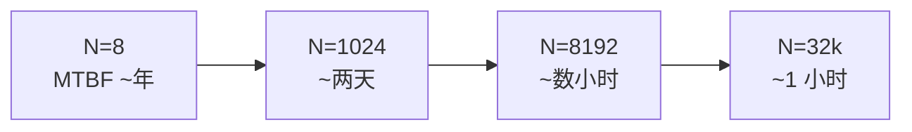

# 05 · 大规模稳定性

> 集群规模一旦上去，「跑得快」就要让位给「跑得住」。本篇讲的是规模带来的失效问题：先用一点失效数学说清楚为什么万卡量级的 job 几个小时就会挂一次，再依次讲 checkpoint/restart、straggler 与 SDC、fault-tolerant/elastic、以及网络本身的可靠性；推理侧的可靠性话题也并入本篇一起讲。
>
> 上一篇是[集合通信：原语、算法、NCCL 实现与拓扑映射](./04_collectives.md)。这里说的故障域、故障代价，都建立在前面讲过的拓扑与通信基础之上。

---

## 1. 失效数学

先把量固定下来。设单个 GPU（连带它的 NIC、链路、供电、HBM）的平均无故障时间为 **MTBF₁**，一个 job 用了 `N` 个 GPU，且任一硬件失效都会导致整个同步训练 job 崩溃（这是同步 SGD 的本性：一个 rank 挂了，集合通信就会 hang 住）。在「失效独立、指数分布」这个近似假设下，可以推出：整个 job 的有效 MTBF 大约等于 MTBF₁ / N。

代入一些量级感受一下：假设单卡 MTBF₁ 大约是 5 年，也就是 4.4×10⁴ 小时（这里已经把 GPU/NIC/链路等所有可能致崩的部件都算进去了，是一个乐观估计）：

| 规模 N | job MTBF ≈ MTBF₁/N | 直觉 |
|---|---|---|
| 8（单 node） | ~5500 小时 | 几乎不用管 |
| 1024 | ~43 小时 | 每两天挂一次 |
| 8192 | ~5.4 小时 | 每个工作日挂一两次 |
| 32768 | ~1.3 小时 | **几乎一直在恢复** |

> 图：同步训练下 job MTBF 随 N 线性变差。万卡量级「一直在恢复」不是运维事故，是这张表的推论——所以 checkpoint 频率变成 goodput 的第一性约束。

这张表其实是大规模训练 infra 的第一性约束：到了万卡量级，平均一两个小时就会有一次硬件失效发生。于是问题就不再是「会不会挂」，而变成了「挂了之后多久能回到挂之前的状态」——也就是说，checkpoint 频率乘以恢复时间，决定了有效算力利用率（goodput）。NVL72 把 72 GPU 收进一个故障域这件事（见 [`01`](./01_scale_up_nvlink_nvl72.md) §5.3），也正是在这张表的语境下做出的权衡：单点故障的爆炸半径变大了，但跨机链路这一大类故障源反而减少了。

---

## 2. checkpoint / restart 的恢复成本

恢复的代价，等于「从上次 ckpt 到崩溃点这段时间的计算被回滚」，加上「重启与 reload 所花的时间」。围绕把这两项压小，形成了一套技术：

```mermaid
gantt
    title 一次失效的时间线（示意）
    dateFormat X
    axisFormat %s
    section 训练
    有效计算           :a1, 0, 30
    回滚到上次 ckpt    :crit, a2, 30, 40
    重建进程组+reload  :crit, a3, 40, 50
    继续训练           :a4, 50, 80
    section I/O
    async 写盘         :b1, 10, 25
```

> 图：goodput 损失 = 回滚计算 + 重启 reload。async/sharded checkpoint 压的是停顿；elastic 压的是「重建进程组」那段。频率由 §1 的 job MTBF 决定。

最简单的方式是 **sync checkpoint**：到点就暂停训练，把 model+optimizer 全量写盘。实现起来最简单，但停顿时间会随模型增大而变得难以忍受。**async checkpoint** 的改进方式是先把 state 快照到 CPU 内存（这一步很快），训练可以立刻继续，写盘的过程放到后台去做，相当于把「停顿」从「写盘时间」缩短成了「快照时间」。**distributed / sharded checkpoint** 则是让每个 rank 只写自己持有的那一份分片（和 FSDP/ZeRO 的分片方式对齐，参见 [02 · ZeRO-1/2/3 显存账本 与 Megatron DistributedOptimizer](../parallel/01_dp/02_zero_and_distributed_optimizer.md)、[03 · FSDP = ZeRO-3：逐层 all-gather 参数、用完即扔](../parallel/01_dp/03_fsdp.md)），让 N 个 rank 并行写到 storage plane（[`02`](./02_scale_out_topology_planes.md)）上，I/O 带宽因此能随 N 扩展，这已经是大模型训练里的标配做法。

这里也能看出 storage plane 独立存在的意义：如果 checkpoint 的突发写流量挤占了 backend plane，就会让训练 step 出现抖动，这正是 [`02`](./02_scale_out_topology_planes.md) 强调要把 storage 放到独立物理网（或者独立 VL）上的原因。而 checkpoint 的写入频率本身是一个优化问题：写得太勤会占用 I/O 资源，写得太疏则一旦崩溃回滚的计算量就更大，最优点是由 §1 的 job MTBF 决定的。

---

## 3. straggler 与 SDC

崩溃是显性的，容易被检测到。更难对付的是下面这两类不会崩溃、却会拖垮或者污染训练的故障。

### 3.1 straggler（慢节点）

同步训练每一步都有一次全局 barrier（all-reduce 或者 all-to-all），整个 step 的时间是由最慢的那个 rank 决定的。一张卡如果因为降频、ECC 重试、链路抖动或者热点拥塞而变慢，就会拖慢所有其他卡。

检测的办法是监控 per-rank 的 step time 和 collective wait time，出现离群点就是 straggler。缓解的手段包括把慢节点踢出去（也就是 elastic，见 §4），或者在调度上主动避开已知的慢节点；在网络侧则可以靠 adaptive routing（[`02`](./02_scale_out_topology_planes.md) §5.2）来避免某条链路持续成为热点。

### 3.2 SDC（silent data corruption，静默数据损坏）

这是最危险的一类故障：硬件算出了错误的结果，但并不报错（比如 HBM 出现了没被 ECC 兜住的位翻转，或者计算单元偶发出错）。它在训练里的表现是 loss 莫名出现尖刺，甚至会悄悄毒化模型而没有人察觉。

检测这类故障通常靠周期性的数值校验（同一个计算在不同卡或不同时刻重算比对）、梯度/loss 的异常监控，以及对关键张量做校验和。这也是为什么大规模训练需要专门的可观测性基建——光有 checkpoint 是不够的，还得知道 checkpoint 本身有没有被 SDC 污染过。

---

## 4. fault-tolerant / elastic training

这一节的目标是让单点失效不必导致整个 job 从头重启，而是能够就地恢复、动态伸缩。

具体的做法包括：**进程组重建**，也就是检测到某个 rank 失效后，重新调用 `init_process_group`，从最近的 ckpt reload，跳过坏掉的 node 继续训练——`torchrun` 的 elastic 模式（rendezvous 走 frontend plane，见 [`02`](./02_scale_out_topology_planes.md)）支持成员变动之后重新组队。另一种做法是**热备 / 冗余 node**，预留一些 spare 节点，坏一个就顶一个，避免每次都要缩减规模。还有一层是**弹性通信域**，要求通信库本身也能适应成员的变化。DeepEP V2 的 `ElasticBuffer`（NCCL Gin 后端，支持更大且可变的 scale-up/scale-out 域，见 [06 · DeepEP：V1 (legacy/NVSHMEM) 与 V2 (elastic/NCCL Gin)](../moe/06_deepep.md)）正是朝这个方向努力，目标是让 EP 通信域不必在每次成员变动之后都从零重建。

值得注意的是，fault tolerance 和 §1 的失效数学是配套的：MTBF/N 决定的是失效的频率，而 elastic 恢复决定的是每次失效的代价，两者相乘才是真正的 goodput 损失。

---

## 5. 网络可靠性

前几篇把网络当作「带宽/拓扑」来讨论，但从稳定性的角度看，它本身也是一个故障源。

- **link flap（链路抖动）**：光模块或线缆偶尔掉线重连，会造成瞬时丢包或者带宽塌陷，表现出来往往是 straggler 或者 collective 偶发 hang。
- **绕障靠多路径**：rail-optimized fat-tree 里，cross-rail 通常有多条等价路径，adaptive routing / ECMP 可以在某条链路出问题时把流量改道（[`02`](./02_scale_out_topology_planes.md) §5.2），实现网络层面的自愈——这是 adaptive routing 除了均衡负载之外的第二个价值。
- **拥塞与尾延迟**：collective 的全局 barrier 对尾延迟极其敏感（§3.1），拥塞导致的长尾很容易被放大成 straggler。DeepEP 宁可关掉 congestion control 以保住峰值带宽，转而用 VL 优先级来管理冲突（[`02` §5](./02_scale_out_topology_planes.md)），正是这套权衡的具体落地。
- **OOB/管理平面**：即便 backend fabric 挂掉了，还能靠独立的 OOB 平面（[`02`](./02_scale_out_topology_planes.md)）去 reset 节点、读取健康状态——这正是它必须物理独立的原因。

---

## 6. 推理侧可靠性

推理是长期在线的服务，它对可靠性的诉求和训练有所不同：

- **decode SLA**：decode 路径（[`04` §5.4](./04_collectives.md)）对延迟有硬性的 SLA 要求，网络抖动会直接体现为 token 延迟出现尖刺——low-latency 加上 adaptive routing 既是为了速度，也是为了稳定的尾延迟。
- **副本冗余**：推理通常用多副本加负载均衡，单个实例挂掉不会影响整体的可用性，这一点和同步训练「一挂全崩」的模式完全不同。
- **P/D 分离的故障域隔离**：[`04`](./04_collectives.md) §5.4 里提到过，prefill 池和 decode 池的故障相互独立，一侧挂掉不会波及正在处理中的另一侧，比单体部署更容错。

---

## 7. 小结

- 失效数学 **job MTBF ≈ MTBF₁/N**：万卡量级几乎一直在恢复，于是 **checkpoint 频率 × 恢复时间** 成为 goodput 的第一性约束。
- checkpoint 从 sync → async → distributed/sharded 逐级压小停顿与 I/O，分片与并行维度对齐、并行写 storage plane。
- straggler（最慢者决定整步）和 SDC（静默污染）是比崩溃更阴险的两类故障，需要 per-rank 监控与数值校验。
- elastic/fault-tolerant 决定每次失效的代价；通信库（DeepEP `ElasticBuffer`）也要支持弹性域。
- 网络本身是故障源：link flap 靠 adaptive routing/ECMP 多路径自愈，拥塞长尾被 barrier 放大成 straggler，OOB 平面必须独立。
- 推理靠副本冗余 + P/D 故障隔离 + low-latency 保尾延迟。

---

回到 [GPU 集群与网络](./README.md) 看全章框架，或者回到 [大规模训练的并行策略 —— 总览](../parallel/README.md) 把并行算法和本章讲的物理网络重新对照一遍——那张 `TP→CP→PP→DP` 的 rank 排布图，现在每一层都有了网络与稳定性两个维度的理由。
