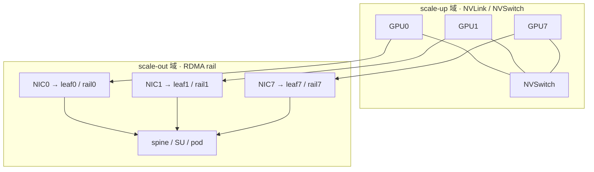

# GPU 集群与网络

> 要理解「多机多卡」训练，首先得知道机器之间是怎么连起来的。本章会先给出 InfiniBand、NVLink、RDMA 这些概念在这里用到的最小充分定义，然后把一个真实 GPU 集群的物理结构与网络拓扑拆开来看，讲清楚拓扑上的约束是怎样反过来决定并行策略与通信库设计的。
>
> 这一章可以看作 [大规模训练的并行策略 —— 总览](../parallel/README.md) 的下层基础：那边讲的是并行*算法*——TP/CP/DP/PP/EP 各自切什么、怎么通信、前反向如何对称；这边讲的则是这些通信原语最终落在什么样的硬件与网络上，以及为什么大规模训练里许多具体的工程决策（routing 扇出怎么限、collective 算法怎么选、checkpoint 多久做一次）几乎都是被网络拓扑和硬件失效率逼出来的。

## 前置知识

本章是全仓库比较靠底层的一章，假设的背景不多：

- 知道 all-reduce、all-to-all 等 collective 的语义，以及 DP/TP/PP/EP 各并行维大致切什么（见 [大规模训练的并行策略 —— 总览](../parallel/README.md)）；本章不重复并行算法本身，正文用到时会给最小定义。
- 跑通过一次多卡训练、见过 `torch.distributed` 的基本用法（[04 · torch.distributed：通信原语、process group、DeviceMesh](../torch/04_distributed.md)）会有帮助，但不是必须。
- NVLink、NVSwitch、RDMA、QP/WQE、fat-tree 这些硬件与网络概念不要求预习，正文会就地给出最小充分定义。

---

## 0. 两个域与几个平面

整章的内容其实可以先用一句话勾勒出来：一个 GPU 集群，本质上是一个高带宽的 scale-up 域（NVLink，机内/rack 内）嵌在一个低带宽的 scale-out 域（RDMA，跨机）里面；而「网络」本身又不是单一的一张网，是好几张物理上分开的平面（plane）叠在一起。后面会看到，几乎所有大规模训练/推理的 infra 设计，都是在「尽量把流量留在高带宽域、把跨域流量压到最小」这一条约束下做出的取舍。

### 0.1 两个域（domain）：带宽差一个数量级

| 域 | 互连 | 典型单 GPU 带宽（量级） | 寻址范围 | 谁用它 |
|---|---|---|---|---|
| **scale-up** | NVLink + NVSwitch | 数百 GB/s ~ ~1 TB/s（单向，量级） | 机内 8 GPU；NVL72 = 一个 rack 72 GPU | TP/SP（高频大包）、机内 EP all-to-all |
| **scale-out** | RDMA over InfiniBand / RoCE | 单 NIC 数十 GB/s（400 Gb/s ≈ 50 GB/s，量级） | 跨机、跨 rack，到整个 pod | 跨机 DP all-reduce、跨机 EP all-to-all、PP P2P |

scale-up 与 scale-out 之间的带宽差着大约一个数量级，这是理解本章几乎所有设计动机的关键事实。DeepEP 的实测数字把这一点体现得非常直白：同一套 EP=8 的 dispatch，如果留在 NVLink 域内，能跑到 **~150 GB/s（H800）/ ~700 GB/s（SM100）** 的级别；但一旦跨机走 RDMA，就掉到 **~40–60 GB/s**（[[deepep:docs/legacy.md#L23-L26]]、[[deepep:README.md#L47-L51]]）。也就是说，「掉出 scale-up 域」的代价是可以量化的，这一个数字就解释了本章后面几乎所有的设计选择。

### 0.2 几个平面（plane）：一个集群叠了好几张网

工程师口中的「网络」其实不是一张网，而是几张物理上独立、职责不同的网叠在一起。先把它们分清楚，才能理解「rail」「traffic isolation」这些后面会反复出现的概念：

| 平面 | 介质 | 流量类型 | 是否决定训练吞吐 |
|---|---|---|---|
| **scale-up plane** | NVLink/NVSwitch（铜，机内/rack 内） | TP all-reduce、机内 all-to-all | 是（最吃带宽） |
| **scale-out / backend plane** | RDMA（IB/RoCE），**rail-optimized** | 跨机 collective（DP AR、EP A2A、PP P2P） | 是（决定跨机扩展性） |
| **frontend plane** | 普通以太 / TCP | 调度、控制面、日志、`torch.distributed` 的 TCPStore rendezvous | 否 |
| **storage plane** | 以太 / IB（常独立） | 读数据集、写 checkpoint | 间接（checkpoint 阻塞时影响） |
| **OOB / management plane** | 独立以太（BMC/IPMI） | 带外管理、健康监控、重启 | 否（但稳定性靠它） |

这几张平面里最值得展开讲的，是 backend/scale-out plane 内部的 **rail（轨道）** 结构：一个 8-GPU node 的 8 张 NIC 各自接到 8 个独立的 leaf 交换机，等于把 scale-out plane 又劈成了 8 个并行的子平面。这正是 [`02`](./02_scale_out_topology_planes.md) 要展开讲的主题。

### 0.3 集群解剖：从一块 GPU 到一个 pod

```
GPU ─8 张 NVLink 全连─► node (8 GPU)
                          │  ── 经 NVSwitch/铜背板可扩到 ──►  rack / NVL72 (72 GPU, 单一 NVLink fabric)
                          │
                          └─ 每 GPU 1 张 NIC ─► leaf 交换机 (rail) ─► spine ─► SU(scalable unit) ─► pod / cluster
                                                └──────────── scale-out plane ────────────┘
```



> 图：从一块 GPU 同时长出两条路——横向是机内 NVSwitch 全连（[`01`](./01_scale_up_nvlink_nvl72.md)），纵向是「第 i 张 NIC 只上第 i 条 rail」（[`02`](./02_scale_out_topology_planes.md)）。单卡参数见 [`00_gpu_hw_params`](./00_gpu_hw_params.md)，跨机 QP/WQE 见 [`03`](./03_rdma_ib_verbs.md)。

- **node**：scale-up 域的传统边界（8 GPU，NVSwitch 全连）。
- **rack / NVL72**：把 scale-up 域从 8 扩到 72 GPU 的 rack-scale 超节点（[`01`](./01_scale_up_nvlink_nvl72.md)）。
- **rail**：每张 NIC 接同一编号的 leaf，构成 scale-out plane 的一条轨道。
- **SU / pod**：rail-optimized fat-tree 的中/上层，决定整集群是否非阻塞。

---

## 1. 这组文档怎么读

把上面的框架落到具体文件上，下面这张表大致说明了这组文档的分工和阅读顺序：

| 文件 | 内容 | 锚点 |
|---|---|---|
| `README.md`（本文） | 两个域 + 几个平面的全景框架、集群解剖、代码映射 | —— |
| [00 · GPU 硬件参数：常用量与主流型号对照](./00_gpu_hw_params.md) | **数字字典**：peak FLOP/s、HBM 容量/带宽、NVLink、TDP、dense vs sparse、SXM vs PCIe；主流 NVIDIA 卡对照（V100→B200/NVL72，含 A800/H800） | NVIDIA 产品页；`deepgemm` 1550 TFLOPS |
| [00 · Roofline model：两道天花板](./00_roofline_model.md) | **分析底座**：roofline 的两道天花板（peak compute / peak bandwidth）+ ridge point、arithmetic intensity 怎么算、compute/memory-bound 判断、**推广到 communication roofline**（带宽瀑布=一摞 roofline）、与 α-β 模型的关系、MFU/HFU | [[deepgemm:README.md]](1550 TFLOPS), [[flash-attention:README.md#L6]] |
| [01 · scale-up 域：NVLink 与 NVL72](./01_scale_up_nvlink_nvl72.md) | scale-up 域：NVLink/NVSwitch、带宽层级、**symmetric memory**（NVSHMEM heap / NCCL window、LSA/Multimem/GIN）、zero-copy 与 **zero-CTA（CE offload）**、**NVL72** 把域扩到 72 GPU | [[deepep:README.md#L50]], [[deepep:docs/legacy.md#L23]]；NCCL Device API / bufferreg |
| [02 · scale-out fabric：拓扑与 rail 结构](./02_scale_out_topology_planes.md) | scale-out fabric：IB vs RoCE、fat-tree/Clos、收敛比、**rail-optimized 拓扑与几个平面**、VL/adaptive routing/congestion 运维三件套 | [[deepep:README.md#L373-L392]] |
| [03 · RDMA / InfiniBand 底层](./03_rdma_ib_verbs.md) | **RDMA / IB 底层**：HCA、QP/WQ/WQE、CQ/CQE、MR 的 lkey/rkey、RC 状态机；GPUDirect vs IBGDA vs **NCCL GIN**（GDAKI / Proxy） | NVIDIA RDMA verbs 手册；NCCL deviceapi；[[deepep:docs/nvshmem.md#L14]] |
| [集合通信：原语、算法、NCCL 实现与拓扑映射](./04_collectives.md) | **集合通信底座**（长文）：7 原语与 fwd/bwd 对偶、α-β 与 ring/tree、busbw、NCCL channel/protocol、**user buffer / window / CE zero-CTA / GIN**、并行维度→网络层级、hierarchical / node-limited、DeepEP normal vs LL | [[deepep:docs/nvshmem.md#L14]]、NCCL 图与 bufferreg、`legacy.md` |
| [05 · 大规模稳定性](./05_reliability_at_scale.md) | 大规模稳定性：失效数学、checkpoint/restart、straggler/SDC、elastic/fault-tolerant、网络可靠性；推理可靠性并入 | `ep/05`（ElasticBuffer） |

大致的阅读顺序建议是：先读本文建立「两个域 + 几个平面」的框架，再看 [`00_gpu_hw_params`](./00_gpu_hw_params.md) 把 `π`/`M`/`β` 这些量固定成可查的账本，接着用 [`00` roofline](./00_roofline_model.md) 立起分析的尺子；然后是 `01`（含 symmetric window / LSA / CE）和 `02`，把硬件与拓扑铺开；接着 [`03`](./03_rdma_ib_verbs.md) 顺着 scale-out 把跨机路径拆到 QP/WQE / IBGDA / GIN 这一层；再用 [`04`](./04_collectives.md) 把集合通信从原语讲到拓扑映射，`05` 收尾稳定性话题。

DeepEP 在这里**不再单独成篇**，而是作为贯穿 `01`/`02`/`03`/`04` 的一个真实案例反复出现（两域转发、rail、IBGDA、node-limited、normal vs low-latency）。它内部更细的机制（channel / handle / ElasticBuffer）放在了 [06 · DeepEP：V1 (legacy/NVSHMEM) 与 V2 (elastic/NCCL Gin)](../moe/06_deepep.md)。

顺带说明一下为什么数字字典排在 roofline 前面：本文回答的是「带宽长什么样」，[`00_gpu_hw_params`](./00_gpu_hw_params.md) 回答「具体是多少、datasheet 怎么读」，roofline 则回答「这些数什么时候说了算」。后面 `01`/`02` 的带宽瀑布、`04` 的 α-β、`03` 的 doorbell，都是同一把尺子在不同层级上的展开。

---

## 参考代码与事实来源

本章引用的代码事实均指向上游固定 commit：

- [[deepep:]] —— asymmetric-domain forwarding、node-limited routing、IBGDA / NCCL GIN、VL traffic isolation、rail-optimized forwarding。
- [[megatron-lm:megatron/core/transformer/moe/moe_utils.py#L579]] —— `group_limited_topk`，拓扑约束写进 routing 算法的代码证据。

---

## 2. 与并行策略的对接

[并行策略总览](../parallel/README.md)给过一张 rank 排布图：

```
rank 排布(典型, 内→外):  TP → CP → PP → DP
                         └NVLink┘   └──── IB(跨机) ────┘
```

本章其实就是这张图的物理层展开：为什么 `TP` 要放最内层——因为它的 all-reduce 必须吃 scale-up 域的带宽；为什么 `PP` 放外层跨机也能忍——因为 P2P 是低频小包，scale-out plane 扛得住；为什么 `EP` 的 all-to-all 是整套体系里对拓扑最敏感的一环——因为 dispatch 流量会随跨机比例线性塌缩。读完本章再回头看那张图，会发现每一层的位置都有了网络层面的理由。

全仓贯穿的两条主线，在本章对应的物理落点是：

1. **forward/backward 通信对称性**——反向通信走的是同一批物理链路，所以前向把流量留在高带宽域，反向自然也跟着省。
2. **comm-compute overlap + `CUDA_DEVICE_MAX_CONNECTIONS=1`**——落到物理上，就是让 NIC/NVSwitch 在后台搬数据的同时，SM 继续算。DeepEP 的 hook-based 0-SM overlap（[`04` §5.4](./04_collectives.md)）可以看作这条主线在网络层的极致形态。

---

接下来该看的是 [00 · GPU 硬件参数：常用量与主流型号对照](./00_gpu_hw_params.md)——先把一块 GPU 的五本账（`π` / 显存 / HBM 带宽 / NVLink / TDP）和主流型号对照表立住，再进 [00 · Roofline model：两道天花板](./00_roofline_model.md)，用这些数字画出两道天花板。
