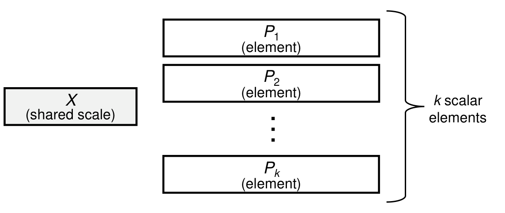
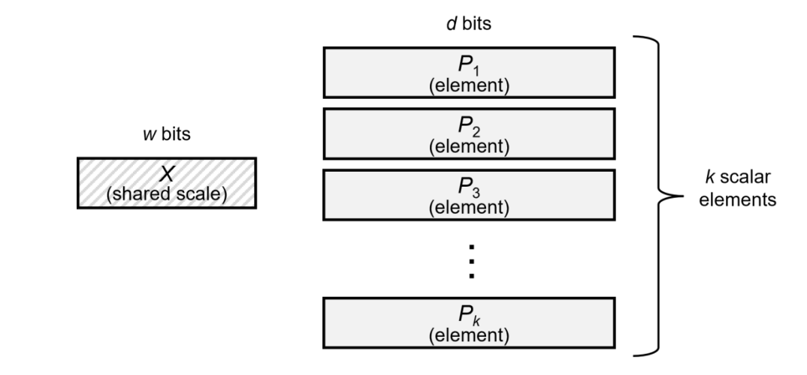
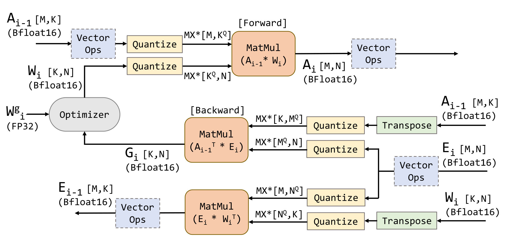
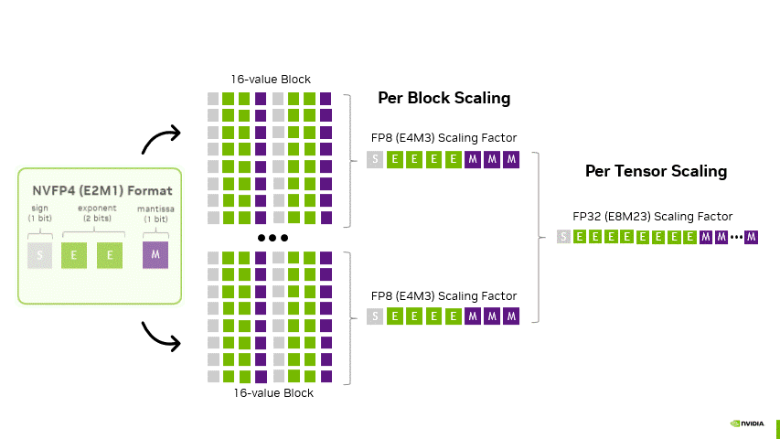
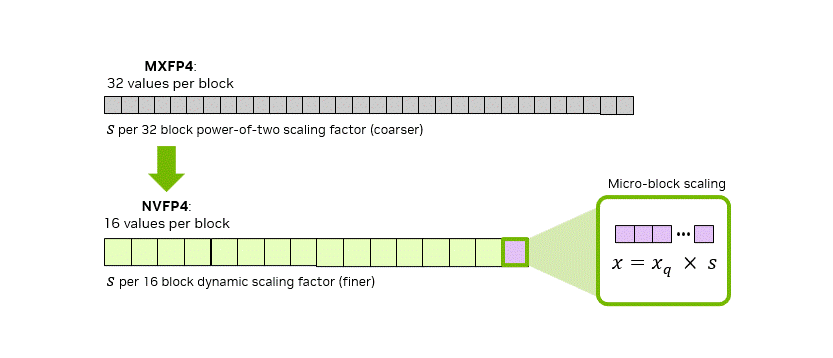

# 00 · 数值格式与 scaling 粒度

> 这一篇只要求你知道二进制小数和科学计数法，别的概念都会从头讲起。后面所有篇章依赖的概念，本篇会一次性说清楚：浮点格式的 S/E/M 语义、量化的定义式与误差来源、scaling 粒度这条主线，以及 OCP MX 标准与 NVFP4 的精确定义。
>
> 可以把本篇当成字典加主线来读：[`01`](./01_deepseek_fp8_hopper.md)（DeepSeek FP8）与 [`02`](./02_blackwell_mxfp_nvfp4.md)（Blackwell）里的每一个工程决策，都能在本篇的某一条定义里找到理由。

事实来源：OCP FP8 论文（[arXiv:2209.05433](https://arxiv.org/abs/2209.05433)，E4M3/E5M2 定义）、OCP MX 原始论文（[arXiv:2310.10537](https://arxiv.org/abs/2310.10537)）与 OCP MX Specification v1.0（2023-09）、NVIDIA NVFP4 推理博客（[Introducing NVFP4](https://developer.nvidia.com/blog/introducing-nvfp4-for-efficient-and-accurate-low-precision-inference/)）、Transformer Engine 文档。

---

## 1. 浮点格式三要素：sign / exponent / mantissa

一个浮点格式由三个字段的 bit 数定义，记作 `ExMy`（x 位 exponent、y 位 mantissa，sign 恒占 1 位）：

$$
\begin{aligned}
x &= (-1)^S \times 2^{E - \mathrm{bias}} \times (1.M) && \text{normal} \\
x &= (-1)^S \times 2^{1 - \mathrm{bias}} \times (0.M) && \text{subnormal}
\end{aligned}
$$

其中第一行是 normal（正规格化数，$E \neq 0$），第二行是 subnormal（$E = 0$，填补 0 附近的空隙）。

- **mantissa（尾数）决定相对精度**：相邻两个可表示数的相对间隔约为 $2^{-y}$。$y=7$（BF16）约 0.8%，$y=3$（E4M3）约 12.5%，$y=1$（E2M1）间隔已经大到「0.5 之后就是 1」。
- **exponent（指数）决定动态范围**：可表示幅值落在 $[2^{1-\mathrm{bias}}, \sim 2^{2^x - \mathrm{bias}}]$ 这个区间。一个常用的直觉单位是 **binade**（相邻两个 2 的幂之间的区间），动态范围可以近似理解成有多少个 binade。
- **bias** $= 2^{x-1} - 1$（惯例），作用是把指数平移到以 1 为中心。

主流格式一次列全，后文会反复引用这张表：

| 格式 | S/E/M | bias | max normal | min normal | Inf/NaN | 备注 |
|---|---|---|---|---|---|---|
| FP32 | 1/8/23 | 127 | $\sim 3.4 \times 10^{38}$ | $\sim 1.2 \times 10^{-38}$ | 都有 | 训练的金标准 |
| TF32 | 1/8/10 | 127 | $\sim 3.4 \times 10^{38}$ | $\sim 1.2 \times 10^{-38}$ | 都有 | A100 起 tensor core 内部格式，存储仍 32 bit |
| FP16 | 1/5/10 | 15 | 65504 | $6.1 \times 10^{-5}$ | 都有 | 动态范围小，需要 loss scaling |
| BF16 | 1/8/7 | 127 | $\sim 3.4 \times 10^{38}$ | $\sim 1.2 \times 10^{-38}$ | 都有 | 范围约等于 FP32、精度约 3 位十进制；训练默认 |
| FP8 **E4M3** | 1/4/3 | 7 | **448** | $2^{-6}$ | **无 Inf**，NaN 单编码 `S.1111.111` | 回收特殊值编码换范围（OCP FP8 论文 §3.1） |
| FP8 **E5M2** | 1/5/2 | 15 | **57344** | $6.1 \times 10^{-5}$ | 都有（IEEE 风） | 范围大、精度更差，惯例用于梯度 |
| FP6 E2M3 / E3M2 | 1/2/3、1/3/2 | 1 / 3 | 7.5 / 28 | 1 / 0.25 | 都无 | MXFP6 的元素格式 |
| FP4 **E2M1** | 1/2/1 | 1 | **6** | 1.0（subnormal 0.5） | 都无 | 正值只有 $\{0, 0.5, 1, 1.5, 2, 3, 4, 6\}$ 八个 |

> **E4M3 的设计哲学**（OCP FP8 论文，arXiv:2209.05433）：8 bit 已经很紧张，与其保留 Inf，不如把特殊值编码省下来换动态范围——E4M3 因此没有 Inf、只留一个 NaN 编码，max 从 240 撑到了 **448**。E5M2 则走的是 IEEE 风格，保留 Inf/NaN。这种「每个编码点都要精打细算」的思路，到 FP4（E2M1 只有 8 个正值）被推向了极致。

---

## 2. 量化：定义式与误差来源

**量化（quantize）** 指的是把一个高精度张量 $x$ 映射到低精度可表示的网格上。对称均匀量化的定义式是：

$$
\begin{aligned}
s &= \mathrm{amax} / M \\
x_q &= Q(x / s) \\
\hat{x} &= s \cdot x_q
\end{aligned}
$$

其中 $s$ 是 scaling factor，$\mathrm{amax} = \max|x|$，$M$ 是目标格式的 max normal；$Q$ 表示舍入到最近的可表示值并 clamp 到 $[-M, M]$；最后一行是 dequantize（反量化），有 $\hat{x} \approx x$。

误差只有两种来源，值得分开看：

第一种是 **rounding 误差**：$x/s$ 落在两个可表示值之间时会被舍入，大小由 mantissa 决定，与 scale 本身无关（这里说的是相对意义下）。第二种是 **clipping / 欠载误差**：amax 把 scale 撑大之后，幅值远小于 amax 的元素会被压到网格的稀疏区，甚至直接归零——outlier 通过 amax 这一个统计量，把伤害传播给了所有正常值。这是低精度数值面对的头号麻烦。

由这个定义式可以直接推出本章的主线：要减小 clipping 误差，就得把 scale 的作用范围缩小，让 outlier 只污染它所在的那一小块区域。这就是 scaling 粒度不断细化的根本动机。

---

## 3. 主线：scaling 粒度的演进

把「多少个元素共享一个 scale」从粗到细排开，其实就是低精度技术这十年的演进史：

```
per-tensor            per-token / per-channel        block (128)              microscaling (32/16)
┌─────────────────┐   ┌──┬──┬──┬──┐                  ┌───┬───┬───┐            ┌─┬─┬─┬─┬─┬─┐
│ 整个张量 1 个 scale │   │每行/每列 1 个│             │1×128 / 128×128│        │每 32 或 16 个元素│
└─────────────────┘   └──┴──┴──┴──┘                  └───┴───┴───┘            └─┴─┴─┴─┴─┴─┘
FP16 loss scaling      SmoothQuant / per-token dyn.   DeepSeek-V3 FP8           MXFP8/MXFP4/NVFP4
TE per-tensor FP8      （推理 W8A8 常用）              （01 篇的主题）            （Blackwell 硬件原生）
```

逐档说清楚各自的权衡：

| 粒度 | 精度表现 | scale 开销 | 工程/硬件要求 |
|---|---|---|---|
| **per-tensor** | 最差：一个 outlier 就能毁掉整张量 | 1 个 scale / 张量 | 需要估计 amax：delayed scaling 用历史窗口（TE 默认 `amax_history_len=1024`、取窗口内 max，`scale = (FP8_MAX/amax) / 2^margin`），current scaling 用当前 pass 的 amax（多一趟读写） |
| **per-token / per-channel** | outlier 被限制在一行/一列以内 | 约每行/列 1 个 | 推理侧已经成熟（W8A8 标配）；训练中反向张量的「行」方向会变，处理起来比较麻烦 |
| **block（$1 \times 128$ / $128 \times 128$）** | DeepSeek-V3 验证过：全 E4M3 也足够准 | activation 每 128 通道 1 个、weight 每 $128 \times 128$ 块 1 个 | **标准 FP8 GEMM 不支持沿 K 维的 per-group scale**，DeepGEMM 靠 CUDA core promotion 顺带完成 dequant（[`01` §4](./01_deepseek_fp8_hopper.md)） |
| **microscaling（每 32 / 16 元素）** | 细到 outlier 几乎无害 | 每 32/16 元素 1 个 8-bit scale（摊薄下来只有 0.25/0.5 bit） | 软件做起来不划算，所以变成了 **Blackwell tensor core 指令级原生支持**（[`02` §2](./02_blackwell_mxfp_nvfp4.md)） |

**等效 bit 数**（每元素平均存储开销，scale 摊薄之后）：

$$
\begin{aligned}
\mathrm{MXFP8} &= 8 + 8/32 = 8.25\ \text{bit} & \mathrm{MXFP4} &= 4 + 8/32 = 4.25\ \text{bit} \\
\mathrm{MXFP6} &= 6 + 8/32 = 6.25\ \text{bit} & \mathrm{NVFP4} &= 4 + 8/16 = 4.50\ \text{bit}
\end{aligned}
$$

其中 NVFP4 外加每 tensor 1 个 FP32 scale，摊薄之后可以忽略。

这里有一点初看容易想反：**粒度变细之后，元素格式本身反而可以「只要精度不要范围」**。DeepSeek-V3 全部用 E4M3（不用 E5M2）、MXFP8 recipe 也全部用 E4M3，原因是细粒度的 scale 已经把动态范围问题兜住了，元素格式只需要把 3 位尾数的精度用足即可。这可以理解成「用粒度换来了格式的自由度」，`01`/`02` 会反复看到这个思路。

---

## 4. OCP Microscaling（MX）标准：每 32 个元素共享一个 2 的幂

MX 是 Microsoft、AMD、Arm、Intel、Meta、NVIDIA、Qualcomm 七家在 2023 年一起定的开放标准（论文 arXiv:2310.10537 加上 OCP MX Specification v1.0），把「block + shared scale」这个想法正式变成了一种数据格式：


> 图：MX 数据块的逻辑布局——一个 shared scale `X` 加 `k` 个元素 `P_1..P_k`，元素值 `v_i = X · P_i`（Rouhani et al. 2023, Fig 1；[arXiv:2310.10537](https://arxiv.org/abs/2310.10537)）。

它的定义可以说清楚三条：

第一，**结构**上 $v_i = X \cdot P_i$，其中 $X$ 是 shared scale，$P_i$ 是低精度元素；block size $k$、scale 格式、元素格式这三者相互独立，物理布局规范并不做规定。第二，**scale 格式固定为 E8M0**：8 bit 全部给指数，无符号也无尾数，bias 为 127，因此只能表示 2 的幂（$2^{-127}$ 到 $2^{127}$）；没有 Inf、也没有零编码，唯一的 NaN 编码是 `11111111`，一旦 $X = \mathrm{NaN}$ 整个 block 就都是 NaN。第三，**具体格式名单**在 $k=32$、scale 一律 E8M0 的前提下有四种：**MXFP8**（元素 E4M3/E5M2）、**MXFP6**（E2M3/E3M2）、**MXFP4**（E2M1）、**MXINT8**。


> 图：MX block 的 bit 预算——`w` bit 的 shared scale `X` 加 `k` 个 `d` bit 元素，每 block 共 `w + k·d` bit，摊到每元素就是 `d + w/k`（MXFP8：8 + 8/32 = 8.25 bit）（NVIDIA 2025, Fig 4；[Per-Tensor and Per-Block Scaling Strategies for FP8 Training](https://developer.nvidia.com/blog/per-tensor-and-per-block-scaling-strategies-for-effective-fp8-training/)）。

MX 规范（§6.1）给出的**点积语义**是：两个 MX block 的点积等于 $X_A \cdot X_B \cdot \sum_i P_i Q_i$，也就是把共享 scale 提到了求和号外面，reduction 只在元素上进行，累加输出是 FP32。这条语义正是 Blackwell 能够「一条指令吃掉整个 block scale」的标准依据（[`02` §2](./02_blackwell_mxfp_nvfp4.md)）。

**量化转换**（论文 Algorithm 1）的公式是 $X = 2^{\lfloor \log_2 \mathrm{amax} \rfloor} / 2^{e_{\max,\mathrm{elem}}}$，也就是先向下取整到 2 的幂，再除掉元素格式能表示的最大 2 的幂。这里的「向下」要记住，它是后来 MXFP8 训练出问题的根源之一（[`02` §3](./02_blackwell_mxfp_nvfp4.md) 会讲到的 ceil 修正）。

还有两个工程性质后面会反复用到：

第一，**量化与转置不可交换**。对一个 MX 张量做转置之后，原来的 $1 \times 32$ block 方向就变了，scale 也不再对齐。解法是从高精度原值分别量化出两份（行方向和列方向各一份），避免直接「转置已经量化过的张量」引入二次误差（MX 论文 §3/§4.1；Transformer Engine 的 MXFP8 实现就是这么处理的）。第二，**MXFP4 不能裸用**。MX 论文实测过，direct-cast 推理用 MXFP4 会直接崩掉（ResNet-50 从 77.40 掉到 42.39）；但 **MXFP6_E3M2 训练**（20M–1.5B 的 GPT）全程能追平 FP32，**MXFP4 权重 + MXFP6 激活/梯度**的训练也只有轻微损失（1.5B 模型 loss 从 2.74 变成 2.76）——这给了后来 MXFP4/NVFP4 路线足够的信心。


> 图：MX 论文给出的训练 compute flow——所有 GEMM 的输入都转成 MX 格式，vector ops（LayerNorm/Softmax/GELU/residual）保持高精度，master weights 保持 FP32。这就是「精度地图」最早的官方形态（Rouhani et al. 2023, Fig 2；[arXiv:2310.10537](https://arxiv.org/abs/2310.10537)）。

---

## 5. NVFP4：把 scale 也换成「带尾数的」

NVFP4 是 NVIDIA 随 Blackwell 一起推出的私有 4-bit 格式，在 MXFP4 的基础上改动了两处，而且都改在 scale 上：

| | MXFP4 | NVFP4 |
|---|---|---|
| 元素 | E2M1 | E2M1（不变） |
| block 大小 | 32 | **16**（block 内动态范围更小） |
| per-block scale | E8M0（只能 2 的幂） | **E4M3**（带 3 位尾数，可以表示「分数」缩放） |
| 二级 scale | 无 | **per-tensor FP32**（先把整张量 remap 进可表示范围） |
| 等效 bit | 4.25 | 4.5 |


> 图：NVFP4 的两级 scaling——E2M1 元素每 16 个组成一个 block，每个 block 配一个 FP8(E4M3) scale（Per Block Scaling），整张量再叠加一个 FP32 scale（Per Tensor Scaling）（NVIDIA 2025, Fig 2；[Introducing NVFP4](https://developer.nvidia.com/blog/introducing-nvfp4-for-efficient-and-accurate-low-precision-inference/)）。

**为什么 E4M3 scale 比 E8M0 准**：E8M0 只能取 2 的幂，而 block 的 amax 往往落在两个幂之间，只能「向上凑」，因此会浪费掉一部分动态范围；E4M3 带尾数，可以把 block amax 更精确地贴到 E2M1 的最大值（6）附近。NVFP4 预训练论文（arXiv:2509.25149 §B.4）给出了具体的量化分析：MXFP4 用 2 的幂做 scale，最坏情况下只能用上 $\log_2(3/0.5) \approx 2.58$ 个 binade（满配是 $\log_2(6/0.5) \approx 3.58$），相当于浪费了将近 1 个 binade；换句话说，NVFP4 每个 block 至少有一个值（也就是 amax）能以接近 FP8 的精度被编码下来。


> 图：同一输入矩阵分别用 2 的幂（E8M0，coarse）与分数（E4M3，fractional）scale 量化的对比——E4M3 scale 的平均 MSE 明显更低（博客给出的示例数值在 0.08 量级）（NVIDIA 2025, Fig 3；[Introducing NVFP4](https://developer.nvidia.com/blog/introducing-nvfp4-for-efficient-and-accurate-low-precision-inference/)）。

**量化公式**（arXiv:2509.25149 §B，这里写清楚是因为 `02` 篇的 recipe 会直接依赖它）：

全局 encode scale 是

$$
s_{\mathrm{enc}} = \frac{6 \times 448}{\mathrm{amax}_x}
$$

其中 6 是 E2M1 的 max normal，448 是 E4M3 的 max normal。block decode scale 是

$$
s_{\mathrm{dec},b} = \mathrm{amax}_b / 6
$$

它会再量化为 E4M3 存储。硬件内的行为是：tensor core 对每个 block 的部分积乘 $s_{\mathrm{dec},b}$（E4M3），GEMM 输出后再乘全局 $s_{\mathrm{dec}}$。


> 图：MXFP4（32 值/block、2 的幂 scale）与 NVFP4（16 值/block、E4M3 动态 scale）的 micro-block 结构对比（NVIDIA 2025, Fig 5；[Introducing NVFP4](https://developer.nvidia.com/blog/introducing-nvfp4-for-efficient-and-accurate-low-precision-inference/)）。

---

## 6. 舍入方式：两个后面会反复出现的坑

低精度里「怎么 round」并不是无关紧要的细节，而是 recipe 本身的组成部分。

第一个坑是**元素舍入：RNE 还是 stochastic rounding（SR）**。round-to-nearest-even 是确定性的最近舍入，权重和激活通常都用它；但**梯度**如果也用确定性舍入，会引入系统性偏差——小梯度总是被舍到同一边——而 SR 按概率随机取舍，期望是无偏的。NVFP4 预训练 recipe 里就有一条明确规定：SR 只用于梯度（[`02` §4](./02_blackwell_mxfp_nvfp4.md)）。Blackwell 的 FP4 转换指令在硬件层面同时支持这两种舍入方式。

第二个坑是**scale 取整方向：floor 还是 ceil**。OCP MX v1.0 的转换算法等效于向下取整到 2 的幂，这会让 scale 偏小，缩放后的值就可能溢出元素格式的表示范围，引入额外的饱和噪声。MXFP8 预训练论文（arXiv:2506.08027）把这一步改成了向上取整（ceil 到 2 的幂），这是他们让 MXFP8 训练追平 BF16 的两个关键修改之一（[`02` §3](./02_blackwell_mxfp_nvfp4.md)）。DeepGEMM 的 Python 参考实现同样采用 `ceil_to_ue8m0`（[[deepgemm:deep_gemm/utils/math.py#L13-L16]]）。

---

## 7. 小结

浮点格式由 S/E/M 三个字段定义：mantissa 决定相对精度，exponent 决定动态范围，bit 数越少，特殊值编码就越是一种奢侈品。量化误差可以分解成 rounding 和 clipping 两部分，其中 clipping 是由 outlier 经 amax 传播出去的，解法是细化 scaling 粒度——这是贯穿全章的主线。OCP MX 是 $k=32$ 加 E8M0 shared scale 的开放标准（对应 MXFP8/6/4/INT8），NVFP4 则是 $k=16$ 加 E4M3 block scale 再加 FP32 tensor scale 的 NVIDIA 加强版。

这里埋下三个伏笔，会在 `01`/`02` 里逐一揭晓：block scaling 在 Hopper 上没有硬件支持，DeepGEMM 只能用软件（promotion）去模拟；MX 的 floor scale 有一个坑，MXFP8 训练时需要改成 ceil；转置不可交换，因此训练时要存下行、列两份量化结果。

下一篇：[01 · DeepSeek FP8 与 DeepGEMM：Hopper 软件方案](./01_deepseek_fp8_hopper.md) —— DeepSeek-V3 如何在没有硬件 block scaling 的 Hopper 上，用 $1 \times 128$/$128 \times 128$ 细粒度量化加上 CUDA core promotion，把 671B 模型的 FP8 训练做成，以及 DeepGEMM kernel 里与之逐行对应的实现。
