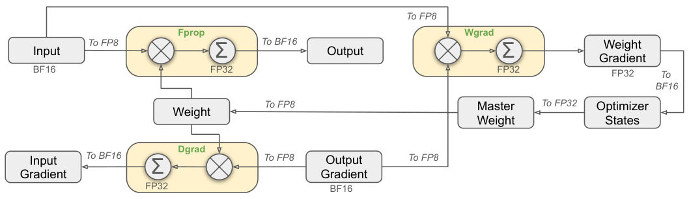
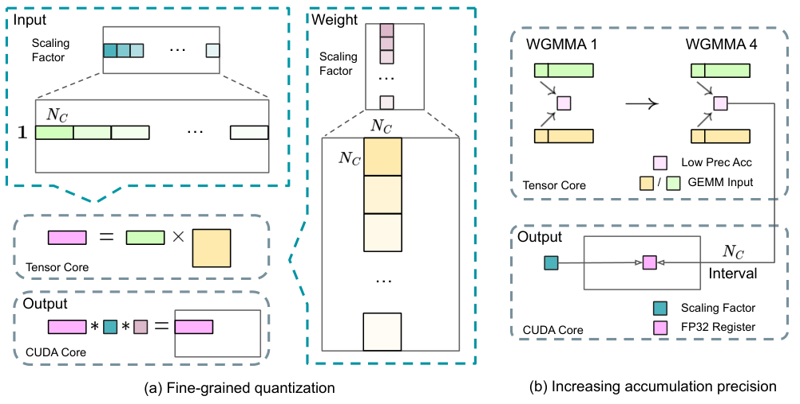
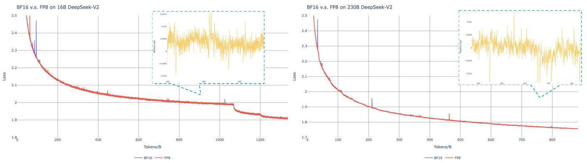

# 01 · DeepSeek FP8 与 DeepGEMM：Hopper 软件方案

> 前置知识是 [`00`](./00_formats_and_scaling.md) 里讲过的浮点格式、量化定义式和 scaling 粒度这条主线，另外还要知道 transformer 的 `Linear` 层前向就是一次 GEMM——反向的两个 GEMM（Dgrad/Wgrad）会在 §1 里先定义再使用。
>
> 本篇讲的是同一件事的两面：**DeepSeek-V3 论文（[arXiv:2412.19437](https://arxiv.org/abs/2412.19437)，§3.3 + Appendix B）是怎么设计 FP8 训练框架的**，以及 **DeepGEMM（[[deepgemm:]]，commit `88965b07`）是怎么把它落成 Hopper 上 1550 TFLOPS 的 kernel 的**。论文负责讲清楚概念，代码负责把细节钉在具体的实现上。

事实来源：DeepSeek-V3 论文 v2（e-print LaTeX 源逐句核对，图号以 arXiv HTML v2 为准）；DeepGEMM 源码锚点均为相对 [[deepgemm:]] 的 `path:line`。

---

## 0. 问题设定：FP8 训练难在哪

2024 年之前，FP8 训练的主流方案是 Transformer Engine 的 **per-tensor delayed scaling**：每个 FP8 tensor 配一个 scale，用过去若干次迭代的 amax 历史来推断当前的 scale（默认窗口 1024），格式上前向用 E4M3、梯度用 E5M2（也就是 `HYBRID` 模式）。这套方案有两个绕不过去的坎。

第一个坎是**粒度太粗**：per-tensor scale 下，一个 outlier 通道就能抬高整张量的 amax，把正常值压进 E4M3 的稀疏区（这正是 [`00` §2](./00_formats_and_scaling.md) 讲过的 clipping 误差）。模型越大、训练越久，outlier 的问题就越严重。

第二个坎是**硬件累加精度**的问题：Hopper tensor core 的 FP8 累加并不是真正的 FP32。DeepSeek-V3 §3.5.2 对这一点有一段实测描述：「After aligning 32 mantissa products by right-shifting based on the maximum exponent, the Tensor Core only uses the highest 14 bits of each mantissa product for addition, and truncates bits exceeding this range.」也就是说，有效累加精度其实只有约 **14 bit**。论文给出的量级是：两个 $K=4096$ 的随机矩阵做 FP8 GEMM，仅仅是累加误差就能造成**最大相对误差接近 2%**。

DeepSeek 给出的答案是：把 scaling 粒度细化到 $1 \times 128$ / $128 \times 128$，用来解决第一个坎；把每 128 个 $K$ 元素的累加结果 promote 到 CUDA core 上做真正的 FP32 累加，用来解决第二个坎。这一整套方案完全用软件在 Hopper 上实现，没有借助任何新硬件特性。下面先按论文的结构展开这套设计，再用 DeepGEMM 的代码逐行对齐。

---

## 1. 一个 Linear 的三个 GEMM（Fprop / Dgrad / Wgrad）

先把 shape 固定下来（$T$ 表示 token 数，$C_{\mathrm{in}}$ / $C_{\mathrm{out}}$ 分别是输入、输出通道数；Fprop 是前向，Dgrad 是 activation 反向，Wgrad 是 weight 反向）：

$$
\begin{aligned}
\text{Fprop:}\quad & Y = X W^{\top} && X:[T, C_{\mathrm{in}}],\ W:[C_{\mathrm{out}}, C_{\mathrm{in}}] \;\to\; Y:[T, C_{\mathrm{out}}] \\
\text{Dgrad:}\quad & \mathrm{d}X = \mathrm{d}Y\, W && \mathrm{d}Y:[T, C_{\mathrm{out}}],\ W:[C_{\mathrm{out}}, C_{\mathrm{in}}] \;\to\; \mathrm{d}X:[T, C_{\mathrm{in}}] \\
\text{Wgrad:}\quad & \mathrm{d}W = \mathrm{d}Y^{\top} X && \mathrm{d}Y:[T, C_{\mathrm{out}}],\ X:[T, C_{\mathrm{in}}] \;\to\; \mathrm{d}W:[C_{\mathrm{out}}, C_{\mathrm{in}}]
\end{aligned}
$$

这三个 GEMM 是同一结构的镜像，呼应了全仓「forward/backward 对称」这条主线。值得注意的是，**Dgrad 和 Wgrad 里输入张量的「$K$ 维方向」各不相同**：Fprop 的 $K$ 是 $C_{\mathrm{in}}$，Dgrad 的 $K$ 是 $C_{\mathrm{out}}$，Wgrad 的 $K$ 则是 $T$（沿 token 维做归约）。这个差异会在 §3 里直接决定量化方向的设计。

---

## 2. 框架总览：三个 GEMM 全部 FP8（§3.3.1，Figure 6）


> 图：FP8 mixed precision framework 总览——Linear 的 Fprop/Dgrad/Wgrad 三个 GEMM 走 FP8、FP32 累加；master weight 与 weight gradient 保持 FP32，optimizer states 用 BF16（DeepSeek-AI 2024, Fig 6；[arXiv:2412.19437](https://arxiv.org/abs/2412.19437)）。

论文 §3.3.1 原句是这样的：

> "all three GEMMs associated with the `Linear` operator, namely `Fprop`, `Dgrad`, and `Wgrad`, are executed in FP8. This design theoretically doubles the computational speed compared with the original BF16 method. ... These GEMM operations accept FP8 tensors as inputs and produce outputs in BF16 or FP32."

这句话背后有三个要点值得展开讲。

第一，**Wgrad 也做成 FP8** 带来一个附带的收益：反向要用的 activation 可以直接以 FP8 的形式缓存下来（§3.3.1），activation 的显存占用因此减半。

第二，论文选择**全用 E4M3，不用 E5M2**（§3.3.2 "Mantissa over Exponents"）。原句是："we adopt the `E4M3` format on all tensors for higher precision. We attribute the feasibility of this approach to our fine-grained quantization strategy... By operating on smaller element groups, our methodology effectively shares exponent bits among these grouped elements, mitigating the impact of the limited dynamic range."换句话说，这正是 [`00` §3](./00_formats_and_scaling.md) 提到的「粒度换格式自由度」：细粒度的 scale 把动态范围问题兜住了，元素格式就可以把 3 位尾数的精度用足。

第三，论文用的是**online quantization，而不是 delayed scaling**（§3.3.2 "Online Quantization"）。原句是："we calculate the maximum absolute value online for each `1x128` activation tile or `128x128` weight block. Based on it, we derive the scaling factor and then quantize the activation or weight online into the FP8 format."原因是粒度一旦细到 128 个元素，amax 的统计涨落就已经很小，在线计算 amax 既准确又省去了维护历史窗口的机制。

---

## 3. 细粒度量化（§3.3.2，Figure 7a）


> 图：(a) 细粒度量化——input 按 $1 \times N_C$ tile、weight 按 $N_C \times N_C$ block 各配一个 scaling factor（$N_C = 128$）；(b) 每 4 条 WGMMA（=128 个 K 元素）把 tensor core 的部分和 promote 到 CUDA core 的 FP32 register，乘 SF 完成 dequant（DeepSeek-AI 2024, Fig 7；[arXiv:2412.19437](https://arxiv.org/abs/2412.19437)）。

论文对粒度的定义（§3.3.2 原句）是：

> "(1) for activations, we group and scale elements on a `1x128` tile basis (i.e., per token per 128 channels); and (2) for weights, we group and scale elements on a `128x128` block basis (i.e., per 128 input channels per 128 output channels)."

也就是说，activation $X: [T, C]$ 对应的 SF 张量 shape 是 $[T, C/128]$（per-token 乘以 per-128-channel）；weight $W: [C_{\mathrm{out}}, C_{\mathrm{in}}]$ 对应的 SF 张量 shape 是 $[C_{\mathrm{out}}/128, C_{\mathrm{in}}/128]$。SF 的具体公式论文本身没有写出来，但 DeepGEMM 的 Python 参考实现给出了 `sf = amax/448.0`，amax 会 clamp 到不小于 $10^{-4}$（对应 [[deepgemm:deep_gemm/utils/math.py#L25-L37]] 里的 `per_token_cast_to_fp8` / `per_block_cast_to_fp8`）。

论文自己也指出了这个设计里最关键的工程难点（§3.3.2 原句）：

> "One key modification in our method is the introduction of per-group scaling factors along the inner dimension of GEMM operations. This functionality is not directly supported in the standard FP8 GEMM."

SF 沿 GEMM 的 **$K$ 维（归约维）逐组变化**——每归约 128 个元素就要换一组 scale 并做一次 dequant。标准 FP8 GEMM（不管是 cuBLAS 还是 CUTLASS 的 per-tensor scale）都做不到这一点，这正是 DeepGEMM 需要自己写 kernel 的原因，也是 §4 里 promotion 机制真正派上用场的地方——论文原句说："These scaling factors can be efficiently multiplied on the CUDA Cores as the dequantization process with minimal additional computational cost."

**为什么 activation 不能用 $128 \times 128$ block**（Appendix B.2）：论文实测过，把 Dgrad 相关张量改成 block-wise 量化后，一个 16B 的 MoE 模型训到大约 300B tokens 就**直接发散**了，原因是"activation gradients are highly imbalanced among tokens, resulting in token-correlated outliers"。也就是说，activation（以及它的梯度）里的 outlier 是按 token 分布的，只有 per-token 的 $1 \times 128$ 粒度才能兜得住。这也解释了 §1 埋下的伏笔：Dgrad 的归约维是 $C_{\mathrm{out}}$，反向时 activation 梯度要从 $1 \times 128$ tile 转置成 $128 \times 1$ tile 重新量化，两个方向各存一份——这和 [`00` §4](./00_formats_and_scaling.md) 提到的「转置不可交换」是同一个性质。

论文里还提到**两个需要特殊处理的 activation**（§3.3.3 "Low-Precision Activation"）：一个是 attention 之后 Linear 层的输入，反向对量化误差特别敏感，因此用自定义的 **E5M6** 格式缓存，且所有 SF 都取 **2 的幂**（"integral power of 2"），这样才能保证 $1 \times 128$ 和 $128 \times 1$ 之间的转置量化不引入额外误差；另一个是 MoE SwiGLU 的输入，做法是用 FP8 缓存，反向时重新计算 SwiGLU 的输出，用重计算换显存。

---

## 4. 累加精度与 two-level accumulation（§3.3.2，Figure 7b）

§0 提到的 14-bit 累加坑，论文给出的解法是（§3.3.2 原句）：

> "Once an interval of N_C is reached, these partial results will be copied to FP32 registers on CUDA Cores, where full-precision FP32 accumulation is performed. ... setting N_C=128 elements, equivalent to 4 WGMMAs, represents the minimal accumulation interval that can significantly improve precision without introducing substantial overhead."

也就是所谓的 **two-level accumulation**：

```
每 128 个 K 元素 = 4 条 WGMMA（Hopper FP8 WGMMA 的 K=32）
  level 1: tensor core 内累加这 4 条 WGMMA 的部分和（~14 bit 精度，但只连加 4 次，误差可控）
  level 2: 部分和搬到 CUDA core，乘上 SFA×SFB（dequant），以真 FP32 累加进最终结果
```

效率方面，论文指出可以让两个 warpgroup 并发：一个在做 promotion（CUDA core 的 FFMA）的同时，另一个继续发 WGMMA，这样 tensor core 就不会空转。$N_C = 128$ 是在精度和开销之间权衡后得到的最小 interval，而且它恰好等于量化粒度（128 通道一组 SF），这样 promotion 和 dequant 就能在同一个边界上完成——这是这个设计里最精巧的一处。

推理侧后来也踩过同一个坑：vLLM 在 Hopper 上做 FP8 attention 时，如果不修正累加精度，128k needle-in-a-haystack 的准确率会从 91% 崩到 13%，加上 two-level accumulation 之后能回到 89%（[`02` §6](./02_blackwell_mxfp_nvfp4.md)）。Blackwell 硬件内部已经不存在这个问题。

---

## 5. DeepGEMM 代码逐行对齐（SM90 / Hopper）

DeepGEMM 就是把上面这套设计变成生产 kernel 的库。本节把 §2–§4 讲过的每一个概念，都钉到具体的 `path:line`。

### 5.1 仓库形态：JIT + 头文件 kernel

安装时**不编译任何 CUDA kernel**，而是在运行时由 host 端按 shape/dtype 拼出模板实例化的源码再编译（[[deepgemm:csrc/jit_kernels/impls/sm90_fp8_gemm_1d2d.hpp#L34-L69]] 的 `generate_impl` 负责拼模板参数，`:142-143` 调用 `compiler->build`；编译器基类见 [[deepgemm:csrc/jit/compiler.hpp#L23-L62]]，默认缓存在 `$HOME/.deep_gemm`）。device 端的实现全部放在 [[deepgemm:deep_gemm/include/deep_gemm/]] 目录下的 `.cuh` 头文件里：`impls/`（SM90/SM100 kernel）、`mma/`（WGMMA/UMMA 封装）、`ptx/`（内联 PTX）、`scheduler/`（persistent block scheduler）。README 给出的性能宣称是："DeepGEMM now achieves up to **1550 TFLOPS** on H800"（[[deepgemm:README.md#L23]]，2025-04-18 的更新）——H800 的 FP8 峰值约 2000 TFLOPS，也就是大约 78% 的利用率，这正是 [00 · Roofline model：性能上界的两道天花板](../hpc/00_roofline_model.md) 里「compute-bound 算子打满 compute 天花板」的一个具体锚点数字。

### 5.2 两个 SM90 kernel 变体：1d2d 与 1d1d

host 端的分发逻辑在 [[deepgemm:csrc/apis/gemm.hpp#L87-L94]]：当 weight SF 的 $N$ 向粒度为 1 时走 **1D1D**（A、B 两侧都是 per-token-per-128-channel 的 SF，用在 Wgrad 这类 B 也按 token 缩放的场景），否则走 **1D2D**——这正是论文的 $1 \times 128$ activation SF + $128 \times 128$ weight SF 标准路径（[[deepgemm:deep_gemm/include/deep_gemm/impls/sm90_fp8_gemm_1d2d.cuh]]）。

### 5.3 promotion 的代码实现（对应 §4）

代码里有几处清晰的对应：**粒度断言**在 `sm90_fp8_gemm_1d2d.cuh:58`，也就是 `DG_STATIC_ASSERT(BLOCK_K == 128, "Only support per-128-channel FP8 scaling")`——一个 K-block 恰好 128 通道，等于一个 SF 组，也等于一个 promotion interval，三者对齐。**两级累加器**在 `sm90_fp8_gemm_1d2d.cuh:253-256`，`float accum[WGMMA::kNumAccum]` 是 WGMMA 在 tensor core 上的累加寄存器，`final_accum[...]` 是 CUDA core 上的 FP32 累加器，注释原文写的是 "Accumulation for WGMMA or CUDA promotion"。**一个 K-block 内会发出 4 条 WGMMA**，对应 `sm90_fp8_gemm_1d2d.cuh:311-316` 里的 `for (k = 0; k < BLOCK_K / WGMMA::K; ++k) WGMMA::wgmma(a_desc, b_desc, accum, k);`，也就是 $128 / 32 = 4$ 条。这里第 4 个参数 `k` 起到 `scale_d` 的作用：`k==0` 时覆盖写，`k>0` 时在 tensor core 内累加（[[deepgemm:deep_gemm/include/deep_gemm/mma/sm90.cuh#L19]]）——tensor core 只连续累加 4 条 WGMMA，和论文的 $N_C = 128$ 完全对应。最后是 **promote 加 dequant**，在 `sm90_fp8_gemm_1d2d.cuh:331-347`，注释写的是 "Promote with scales"，`final_accum[i] += (scale_a * scale_b) * accum[i]`，由 CUDA core 的一次 FFMA 同时完成乘 SF 反量化和 FP32 累加。

### 5.4 SF 通路

**SFA（activation，$1 \times 128$，FP32）**：host 侧要求它是 transposed（MN-major）并且按 TMA 对齐（[[deepgemm:csrc/jit_kernels/impls/runtime_utils.hpp#L246-L266]] 里的 `make_tma_sf_desc`），在 kernel 内和 A 一起用 TMA 载入（`sm90_fp8_gemm_1d2d.cuh:197-199`），每个 stage 占用 `BLOCK_M` 个 float 的 smem（`:81-82`）。**SFB（weight，$128 \times 128$，FP32）**：不走 TMA，由 math warpgroup 直接从 global 读进 smem（`:241-249`），每个 k-block 取 1 到 2 个 scale，用来处理 BLOCK_N 跨越 $128 \times 128$ block 边界的情况。host 侧的 SF 变换规则集中在 [[deepgemm:csrc/apis/layout.hpp#L39-L57]]：在 SM90 上，`(FP32,1,128)` 会被转成 MN-major 的 TMA 对齐张量，而 `(FP32,128,128)` 则原样使用。也就是说，**SM90 的 SF 本身就是 FP32**——这一点值得和 §8 对照，SM100 要求的是 packed UE8M0。

### 5.5 WGMMA 封装与调度优化

**WGMMA 封装**在 [[deepgemm:deep_gemm/include/deep_gemm/mma/sm90.cuh#L14-L30]]（`FP8MMA`，$M=64$、$K=32$），`:36-67` 的 `FP8MMASelector` 会按 $N$ 选择 cute 的 `MMA_64x{N}x32_F32E4M3E4M3_SS_TN`——注意这里只有 E4M3×E4M3 一种组合，这正是论文「全 E4M3」在代码里的证据。**persistent scheduler** 在 [[deepgemm:deep_gemm/include/deep_gemm/scheduler/gemm.cuh#L30-L93]]，kernel 只启动 `kNumSMs` 个常驻 CTA，主循环是 `while (scheduler.get_next_block(...))`（`sm90_fp8_gemm_1d2d.cuh:175,229`），`:95-100` 的 `get_swizzled_block_idx` 负责做对 L2 友好的 rasterize。**TMA multicast 加 warp specialization**：由 1 个 TMA warpgroup 负责搬数据，1 到 2 个 math warpgroup 负责计算（对应 `:147-148,169,217` 的寄存器重分配，multicast 的配置在 `:178-181`）。**FFMA interleaving** 从 NVCC 12.9 起已经由编译器自动完成（[[deepgemm:README.md#L17-L19]]），也就是说，§4 提到的「promotion 与 WGMMA 并发」这件事，现在已经由 ptxas 兜底了。

### 5.6 Grouped GEMM（MoE 的专家 GEMM）

类型枚举在 [[deepgemm:deep_gemm/include/deep_gemm/common/types.cuh#L20-L27]]（`MGroupedContiguous` / `MGroupedMasked` / `KGroupedContiguous`）。它只 group $M$ 轴，$N$/$K$ 保持固定，是专门为「同 shape 的 expert、不同 token 数」这种 MoE 场景设计的（[[deepgemm:README.md#L80]]）。**contiguous layout**：各个 expert 的 token 沿 $M$ 轴拼接在一起，SFA 本来就是 per-token 的（每个 token 一行 $1 \times 128$ 的 SF），scheduler 通过 `m_indices` 把 m-block 映射到全局 token 行；每个 expert 的 $128 \times 128$ SFB 由 group offset 来选取（`sm90_fp8_gemm_1d2d.cuh:242-245`），host launcher 在 [[deepgemm:csrc/jit_kernels/impls/sm90_fp8_gemm_1d2d.hpp#L147-L222]]。**masked layout**（`:224-` 起）：CPU 端不知道每个 expert 具体有多少 token，就用 `masked_m` 这个上界来截断无效计算，配合 DeepEP low-latency kernel 的输出和 CUDA graph 使用（[[deepgemm:README.md#L84-L88]]），对应的是推理 decode 场景。

### 5.7 数值验证与已知限制

验证方法是拿 PyTorch FP32 作为参考（[[deepgemm:tests/generators.py#L279]]），误差指标是 `calc_diff` = $1 - 2\sum xy / \sum(x^2 + y^2)$（[[deepgemm:deep_gemm/testing/numeric.py#L5-L11]]），FP8 的容差是 **0.001**（[[deepgemm:tests/generators.py#L64-L69]]）。测试 shape 覆盖了 Fprop/Dgrad/Wgrad 三个 GEMM，以及 DeepSeek-V3 真实用到的 shape（比如 $(2112, 7168)$、$(24576, 1536)$）。已知限制方面，SM90 只支持 NT layout、输出只能是 BF16（`sm90_fp8_gemm_1d2d.cuh:63-64`）；A/B 必须是 K-major（[[deepgemm:csrc/apis/gemm.hpp#L62-L65]]）；量化和转置需要用户自己负责，README 原句是"operations like input transposition or FP8 casting must be handled separately by the user"（[[deepgemm:README.md#L72]]）。

---

## 6. 精度验证与训练成本（§3.3 末 + Appendix B.1 + Table 1）


> 图：BF16 vs FP8 训练的 loss 曲线——16B（1.33T tokens）与 230B（0.9T tokens）两组 MoE 模型，右上角 inset 为 relative error（EMA 平滑，系数 0.9）（DeepSeek-AI 2024, Fig 10；[arXiv:2412.19437](https://arxiv.org/abs/2412.19437)）。

论文给出的**精度结论**（§3.3）是："compared with the BF16 baseline, the relative loss error of our FP8-training model remains consistently below **0.25%**, a level well within the acceptable range of training randomness."实验规模（Appendix B.1）是 16B 总参数的 MoE 模型训了 1.33T tokens，230B 总参数的 MoE 模型训了约 0.9T tokens。需要注意的是，671B 的 DeepSeek-V3 本体直接使用了这套框架，但论文并没有对 671B 规模做 FP8 与 BF16 的直接对照实验。

**训练成本**方面（Table 1）：pre-train 2664K + context extension 119K + post-train 5K，合计 **2788K H800 GPU hours**（按每小时 \$2 计算约 \$5.576M）；折算下来每 1T tokens 需要 180K H800 hours（在 2048 卡集群上大约是 3.7 天）。这里有一点需要提醒：这个成本是 DualPipe、通信优化、内存优化和 FP8 **整个框架**加在一起的综合成本，论文并没有把 FP8 单独带来的加速和显存收益拆分出来（只给出了「理论上翻倍」这个数字），引用这个成本数字时不要把收益全部归到 FP8 头上。

---

## 7. 存储与通信的低精度（§3.3.3）

除了框架总览之外，「精度地图」里剩下的部分（对应 [README §3.1](./README.md) 的总表）如下：

| 对象 | 精度 | 论文原句要点 |
|---|---|---|
| master weights | **FP32** | "the master weights (stored by the optimizer) and gradients (used for batch size accumulation) are still retained in FP32" |
| weight gradients | **FP32** | 同上 |
| AdamW 一/二阶 moment | **BF16** | "We adopt the BF16 data format instead of FP32 to track the first and second moments in the AdamW optimizer, without incurring observable performance degradation." |
| embedding / output head / MoE gating / normalization / attention | 原始精度（BF16/FP32） | §3.3.1 逐一列举 |
| 反向 activation 缓存 | FP8（两个特例见 §3） | §3.3.3 "Low-Precision Activation" |
| **MoE dispatch 通信** | **FP8**（SF 为 2 的幂） | "we quantize the activation before MoE up-projections into FP8 and then apply `dispatch` components" |
| **MoE combine 通信** | **BF16**（前向+反向） | "For both the forward and backward `combine` components, we retain them in BF16 to preserve training precision in critical parts" |

最后两行其实是低精度在**网络**上的延伸：dispatch 之前先量化，all-to-all 的传输量因此减半，而且和 expert GEMM 的 FP8 Fprop 直接衔接，收到的就是 FP8，不需要再反量化；combine 阶段是把各个 expert 的输出累加起来的关键路径，因此保持 BF16。这种「dispatch 量化、combine 保精度」的不对称设计，和 [Expert Parallelism (EP) —— Infra 视角深入](../parallel/05_ep/README.md) 里 dispatch/combine 的对偶结构对照着读效果最好。DP 梯度 all-reduce 的通信精度，论文全文都没有提到（e-print 里没有出现 "all-reduce" 这个词），这里不做臆测。

---

## 8. DeepSeek-V3.1 的 UE8M0：向 MX 生态对齐（2025-08）

DeepSeek-V3.1 的 HuggingFace model card 有这样一句原话：

> "DeepSeek-V3.1 is trained using the **UE8M0 FP8 scale** data format on both model weights and activations to ensure compatibility with **microscaling data formats**."

这里的 **UE8M0** 指 unsigned E8M0：scale 只能是 2 的幂（对应 [`00` §4](./00_formats_and_scaling.md)），和 OCP MX 的 shared scale 是同一种结构。DeepSeek 官方在发布时曾表示，这个格式是「针对即将发布的下一代国产芯片设计」的（2025-08-21 微信公众号，经多家媒体转述；model card 里的表述已经过直接核实）。

这个变化在工程上的证据就在 DeepGEMM 里：同一个仓库中，**SM90 kernel 吃的是 FP32 SF，SM100 kernel 只吃 packed UE8M0**（4 个 8-bit scale 打包进一个 `int32`，见 [[deepgemm:README.md#L67-L70]]；打包的实现在 [[deepgemm:deep_gemm/include/deep_gemm/impls/smxx_layout.cuh#L100-L107]]，直接取 FP32 的指数字节；Python 参考实现 `ceil_to_ue8m0` 在 [[deepgemm:deep_gemm/utils/math.py#L13-L16]]）。

整条叙事到这里算是闭合了：V3 论文（2024-12）自己就说过它的细粒度量化"highly consistent with the idea of microscaling formats"（§3.3.2）；V3.1（2025-08）进一步把 SF 全部约束成 2 的幂，向 MX 生态对齐；再往后，Blackwell 硬件已经能原生消费 UE8M0 scale。软件先验证出一条路，硬件随后把它收编进指令集——这正是 [`02`](./02_blackwell_mxfp_nvfp4.md) 要讲的主题。

---

下一篇：[02 · Blackwell：MXFP8 / MXFP4 / NVFP4](./02_blackwell_mxfp_nvfp4.md) —— Blackwell 第五代 tensor core 如何把 per-block scale 做进指令（`tcgen05.mma...block_scale`），MXFP8 预训练 recipe 的两个关键修正，以及 NVFP4 如何把 4-bit 推理与预训练同时做到「接近无损」。
