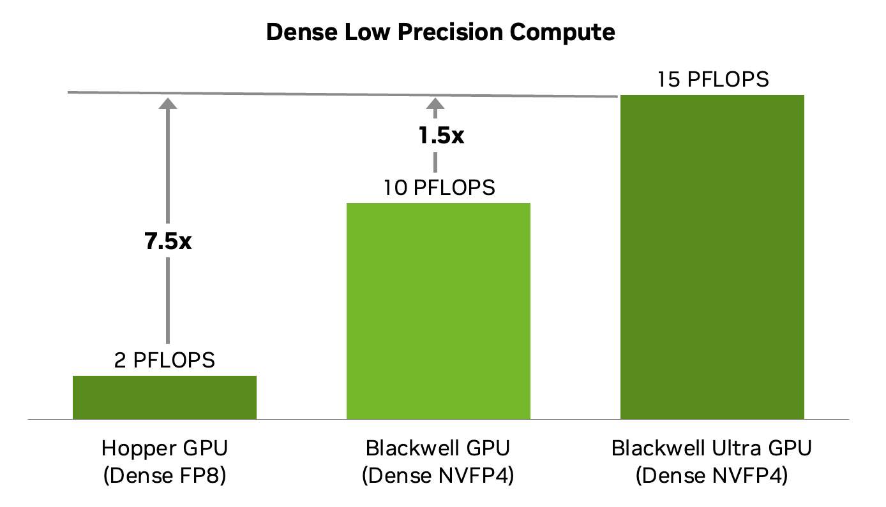
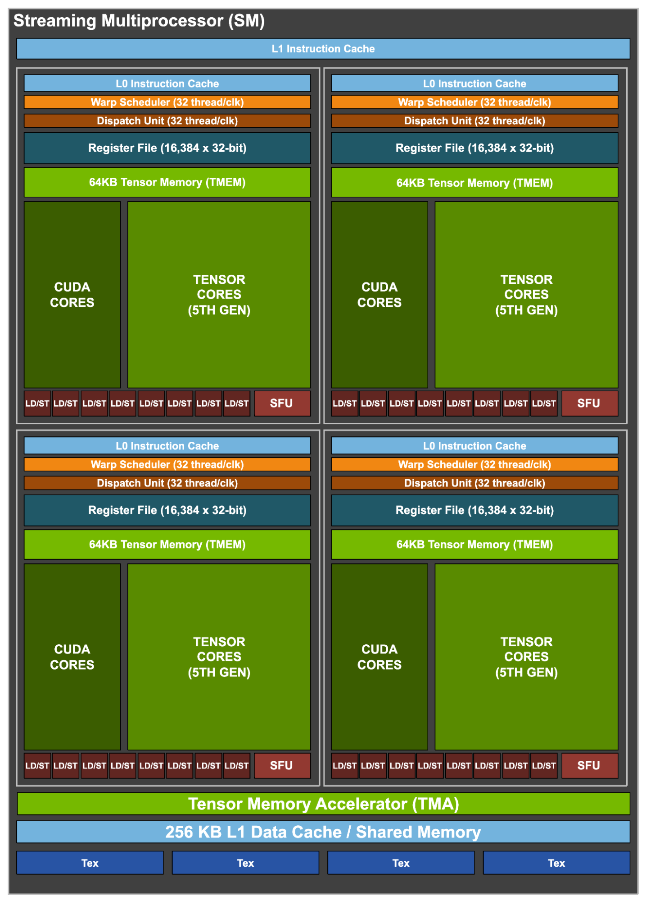
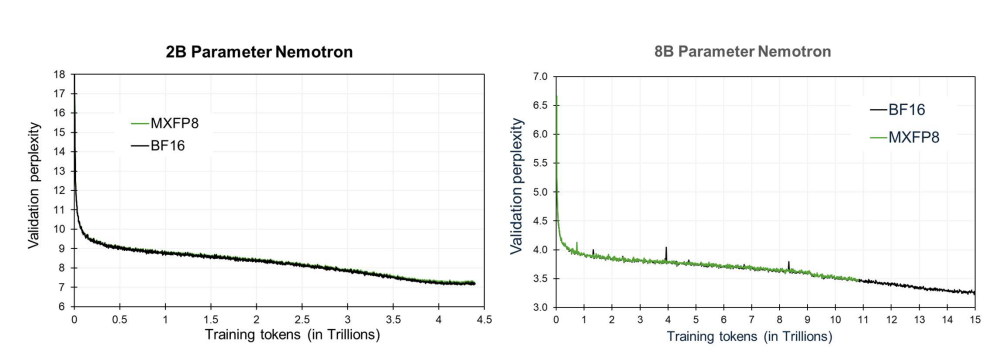
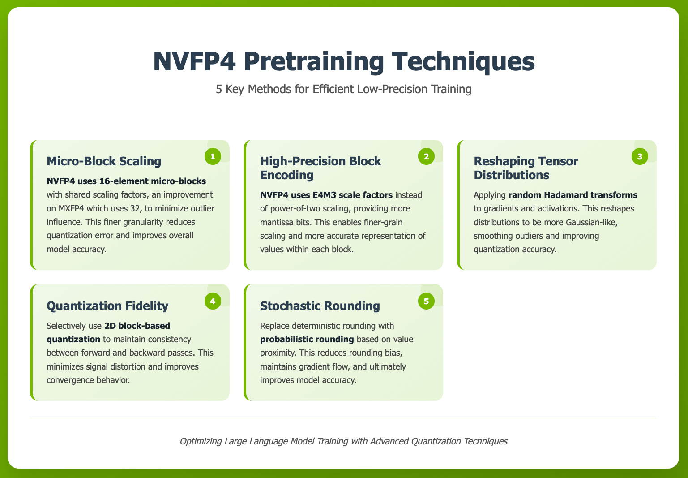
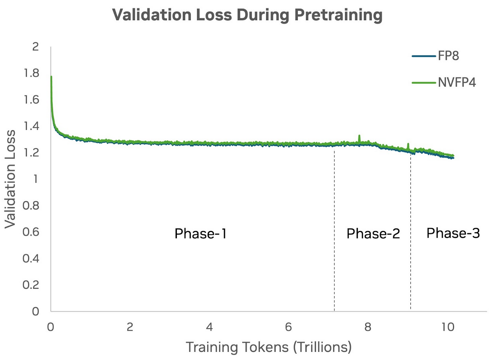
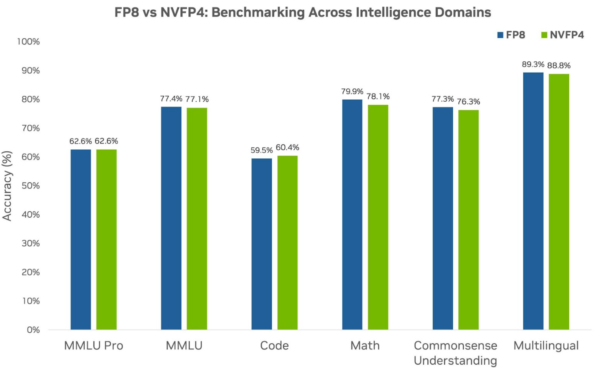
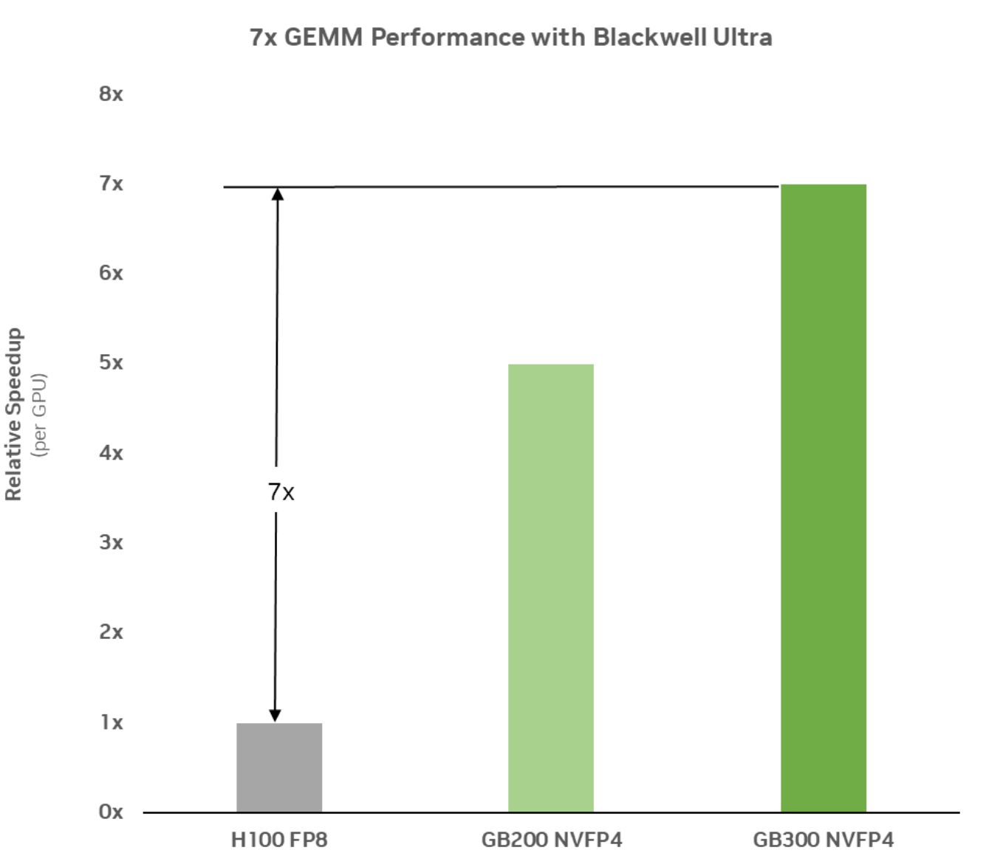
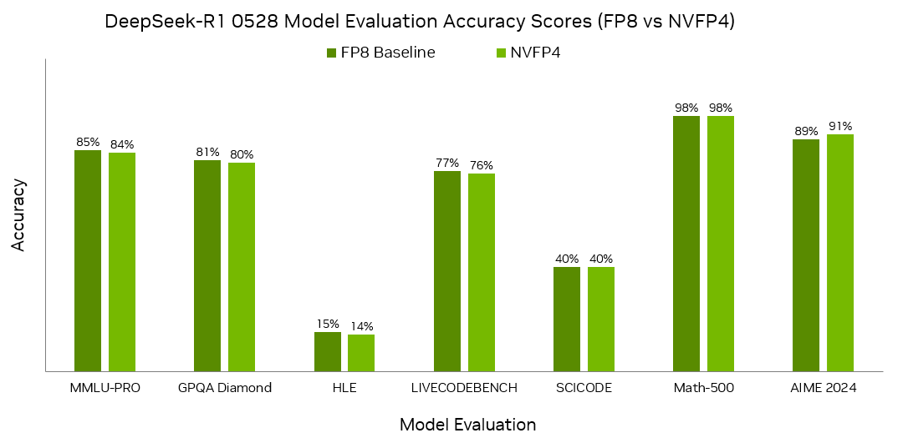

# 02 · Blackwell：MXFP8 / MXFP4 / NVFP4

> 前置知识包括 [`00`](./00_formats_and_scaling.md)（MX 与 NVFP4 的格式定义、E8M0/E4M3 scale、舍入方式的坑）和 [`01`](./01_deepseek_fp8_hopper.md)（Hopper 上 DeepSeek 的软件方案：细粒度 SF 加 CUDA core promotion）。
>
> 本篇讲的是 Blackwell（SM100）如何把 [`01`](./01_deepseek_fp8_hopper.md) 里 DeepSeek 用软件实现的那套机制收编进 tensor core 指令，以及在这个基础上长出来的三套生产 recipe：**MXFP8 预训练**（追平 BF16）、**NVFP4 推理**（PTQ 接近无损）、**NVFP4 预训练**（用 4-bit 训练 10T tokens）。最后落到推理生态：gpt-oss、vLLM/SGLang、FP8 KV cache。

事实来源：NVIDIA 官方博客（[Inside Blackwell Ultra](https://developer.nvidia.com/blog/inside-nvidia-blackwell-ultra-the-chip-powering-the-ai-factory-era/)、[Introducing NVFP4](https://developer.nvidia.com/blog/introducing-nvfp4-for-efficient-and-accurate-low-precision-inference/)、[NVFP4 Trains with Precision of 16-Bit](https://developer.nvidia.com/blog/nvfp4-trains-with-precision-of-16-bit-and-speed-and-efficiency-of-4-bit/)、[Per-Tensor and Per-Block Scaling Strategies for FP8 Training](https://developer.nvidia.com/blog/per-tensor-and-per-block-scaling-strategies-for-effective-fp8-training/)、[Nemotron 3 Ultra NVFP4 Checkpoint](https://developer.nvidia.com/blog/creating-the-nvidia-nemotron-3-ultra-nvfp4-checkpoint-with-nvidia-model-optimizer/)）、NVIDIA Blackwell Architecture Technical Brief V2.1、论文 arXiv:2509.25149（NVFP4 预训练）/ arXiv:2506.08027（MXFP8 recipe）/ arXiv:2508.10925（gpt-oss）；代码锚点相对 [[deepgemm:]]（commit `88965b07`）。

---

## 0. 从软件到硬件

[`01`](./01_deepseek_fp8_hopper.md) 结尾提到过这条线索：DeepSeek-V3 用 FP32 scale 加上 $1\times128$/$128\times128$ 分组、再加上 CUDA core promotion，在 Hopper 上用软件模拟出了细粒度 scaling；V3.1 把 scale 统一成了 UE8M0（2 的幂），向 MX 对齐；而 Blackwell 的 tensor core 已经能够原生消费 per-block scale——软件方案里的每一步，包括分组、scale、dequant、FP32 累加，都变成了硬件指令本身的语义。本篇的 §1–§2 讲硬件本身，§3–§5 讲硬件之上长出来的几套 recipe，§6 讲推理生态。

---

## 1. Blackwell 硬件：第五代 Tensor Core

### 1.1 原生支持的 microscaling 格式

Blackwell tensor core 原生支持的、带硬件 block scaling 的格式只有四种（依据 NVFP4 预训练论文 arXiv:2509.25149 §2 Table 1）：

| 格式 | 元素类型 | scale 类型 | block 大小 | vs BF16 加速比（GB200 / GB300） |
|---|---|---|---|---|
| MXFP8 | E4M3 / E5M2 | UE8M0 | 32 | 2× / 2× |
| MXFP6 | E2M3 / E3M2 | UE8M0 | 32 | 2× / 2× |
| MXFP4 | E2M1 | UE8M0 | 32 | 4× / 6× |
| NVFP4 | E2M1 | **E4M3** | **16** | 4× / 6× |

> 这里再澄清一次容易混淆的术语：并不存在「NVFP8」。NVIDIA 的私有格式只有 NVFP4；8-bit 的 microscaling 就是 OCP 标准的 MXFP8。Transformer Engine 文档的表述也一致："On Blackwell GPUs, TE also supports MXFP8 and NVFP4 formats"。

### 1.2 算力数字（dense / sparse，官方口径）

> 图：单 GPU dense 低精度算力——Hopper FP8 2 PFLOPS → Blackwell NVFP4 10 PFLOPS（7.5×）→ Blackwell Ultra NVFP4 15 PFLOPS（NVIDIA 2025, Fig 3；[Inside Blackwell Ultra](https://developer.nvidia.com/blog/inside-nvidia-blackwell-ultra-the-chip-powering-the-ai-factory-era/)）。

| | Hopper（H100/H800） | Blackwell（GB200 单 GPU） | Blackwell Ultra（GB300 单 GPU） |
|---|---|---|---|
| FP8 dense / sparse | 2 / 4 PFLOPS | 5 / 10 PFLOPS | 5 / 10 PFLOPS |
| NVFP4 dense / sparse | — | 10 / 20 PFLOPS | 15 / 20 PFLOPS |
| HBM | 80–141 GB，3.35–4.8 TB/s | 192 GB HBM3E，8 TB/s | 288 GB HBM3E，8 TB/s |

整柜层面（Technical Brief V2.1 Table 2）：GB200 NVL72 的 dense FP4 算力是 **720 PFLOPS**，FP8 是 360，BF16 是 180；GB300 NVL72 的 dense FP4 达到 **1080 PFLOPS，约等于 1.1 EFLOPS**。可以注意到 FP4:FP8:BF16 恰好是 4:2:1 这样一个整齐的比例——每降一半 bit，tensor core 峰值就翻一倍，这正是 [README §0](./README.md) 里「`π` 翻倍」这句话的硬件来源。

架构层面还有几处配套值得一提（依据 Inside Blackwell Ultra）：每个 SM 有 4 个第五代 tensor core，外加 **256KB TMEM**（tensor memory，专门用作累加器的存储）；**第二代 Transformer Engine** 负责做 "micro-tensor scaling" 这种细粒度的动态范围管理（Technical Brief）；FP4 转换指令在硬件层面同时原生支持 round-to-nearest-even 和 **stochastic rounding** 两种舍入方式——[`00` §6](./00_formats_and_scaling.md) 提到的那个坑，到了硬件里已经有了现成的解法。

> 图：Blackwell Ultra 的 SM——4 个处理块各配 64KB TMEM + 第五代 tensor core（绿色大块），底部是 TMA 与 256KB L1/smem。TMEM 是 block_scale MMA 的 FP32 累加器与 SF 的落脚地（NVIDIA 2025, Fig 2；[Inside Blackwell Ultra](https://developer.nvidia.com/blog/inside-nvidia-blackwell-ultra-the-chip-powering-the-ai-factory-era/)）。

---

## 2. 硬件 block scaling 与 DeepGEMM SM100 对照

### 2.1 与 Hopper 软件方案的本质区别

NVFP4 预训练论文 §2 对硬件行为有这样一段描述：

> "Tensor Cores read narrow precision inputs along with 8-bit scale factors for each block of 16 or 32 elements. Tensor Cores compute partial dot-products over the block, multiply each partial product by the corresponding scale factors to descale the inputs scaled during quantization, and accumulate the partial results in higher precision to produce the final dot-product in FP32."

把它和 [`01` §4](./01_deepseek_fp8_hopper.md) 讲的软件方案逐条对照，可以看出硬件是怎么把每一步都收编过去的：

| 环节 | Hopper（DeepSeek 软件方案） | Blackwell（硬件原生） |
|---|---|---|
| scale 粒度 | $1\times128$ / $128\times128$，FP32 SF | 每 32（MX）/ 16（NVFP4）元素，8-bit SF 随数据进 tensor core |
| dequant | CUDA core promotion 时乘 SF（FFMA） | **tensor core 内在点积部分和上直接 descale** |
| 累加 | 每 128 元素 promote 一次补精度（~14 bit 累加坑） | 累加器在 TMEM 中保持 FP32，**无 14-bit 坑** |
| scale 格式 | FP32（V3）→ UE8M0（V3.1） | UE8M0（MX）/ E4M3（NVFP4） |
| 开销 | promotion 占用 CUDA core 算力，需要 warpgroup overlap 隐藏 | 指令级完成，几乎没有额外 SM 开销 |

MXFP8 recipe 论文（arXiv:2506.08027）的总结说得很直接："Native support for MXFP8 simplifies this — fine-grained scaling provides better numerical robustness and hardware support for scaling avoids any tradeoff between smaller block sizes and hardware speed."也就是说，软件时代「粒度 vs 速度」这个权衡，到了硬件时代已经不存在了。

### 2.2 DeepGEMM SM100 路径：硬件收编的代码证据

同一个 DeepGEMM 仓库里，SM100 kernel 和 SM90 在形态上的差异，就是上面这张表最直接的代码证据。**指令层面**：[[deepgemm:deep_gemm/include/deep_gemm/common/sm100_utils.cuh#L220,L241]] 用的是 `tcgen05.mma.cta_group::{1,2}.kind::mxf8f6f4.block_scale`，一条指令就能同时消费 FP8/FP6/FP4 元素和 per-block scale。**指令描述符自带 UE8M0 SF 类型**：[[deepgemm:deep_gemm/include/deep_gemm/impls/sm100_fp8_gemm_1d1d.cuh#L277-L278]] 里的 `make_instr_desc_block_scaled<..., float_ue8m0_t, ...>`。**SF 粒度**方面，`:54-57` 定义 `kGranKA/kGranKB ∈ {32, 128}`：gran 32 是 MX 的原生粒度（每条 block_scale MMA 的 SF 覆盖 32 个 $K$ 元素），gran 128 则用来兼容 DeepSeek 风格的 $1\times128$ SF，此时全 $K$ 维在 TMEM 内完成累加，不再需要 CUDA core promotion（MMA 循环在 `:352-374`）。**SF 通路**上，packed UE8M0（4 个 8-bit SF 打包进一个 `int32`）通过 TMA 载入，由专用 warp 做 UTCCP transposer 把 SF 转成 K-major 布局后再拷进 TMEM（`:326-348`、`:389-428`）；host 侧从 FP32 SF 到 packed UE8M0 的变换在 [[deepgemm:csrc/apis/layout.hpp#L47-L57]]，打包 kernel 直接取 FP32 的指数字节（[[deepgemm:deep_gemm/include/deep_gemm/impls/smxx_layout.cuh#L100-L107]]），所以 host 侧必须先把 SF round 成 2 的幂（也就是 `ceil_to_ue8m0`，[[deepgemm:deep_gemm/utils/math.py#L13-L16]]）。

---

## 3. MXFP8 预训练 recipe：两个修正追平 BF16（arXiv:2506.08027）

NVIDIA 的 MXFP8 预训练论文（用 Megatron-LM 加 Transformer Engine 实现，在 3072 张 Hopper 卡上用 BF16 与 MXFP8 互转的方式模拟数值）给出了迄今为止最完整的 MXFP8 训练证据：**8B 模型训练 15T tokens，validation perplexity 与 BF16 的差距小于 0.50%**，MMLU 5-shot 与 9 项推理任务的表现都能匹配 BF16/FP8 baseline。

> 图：Nemotron 2B/8B 上 MXFP8 与 BF16 的 validation perplexity 曲线基本重合（NVIDIA 2025, Fig 5；[Per-Tensor and Per-Block Scaling Strategies for FP8 Training](https://developer.nvidia.com/blog/per-tensor-and-per-block-scaling-strategies-for-effective-fp8-training/)）。

这套 recipe 相对 OCP MX v1.0 做了**两个关键修正**，两者都能回到 [`00`](./00_formats_and_scaling.md) 的定义里找到理由。第一个修正是**所有张量统一用 E4M3**：权重、激活，乃至梯度也都不用 E5M2。在 32 元素 block 的细粒度 scale 下，E4M3 的 17.8 个 binade 已经足够，精度比范围更重要，而实测发现 8B 模型上梯度如果用 E5M2 反而会明显掉点——这和 DeepSeek-V3「全 E4M3」的选择是殊途同归的。第二个修正是**把 scale 改为向上取整（ceil 到 2 的幂）**：OCP v1.0 的转换算法等效于向下取整，会让缩放后的值可能溢出 FP8 的表示范围、引入额外的饱和噪声——这正是 [`00` §6](./00_formats_and_scaling.md) 埋下的 floor/ceil 伏笔。

**量化范围**方面（也就是精度地图的 MXFP8 版本）：所有 transformer block 里的 GEMM（QKV/Proj/FFN 的权重、激活、梯度）全部量化，这已经比 per-tensor FP8 时代「首尾层留 BF16」的做法更进一步；但 attention 的两个 batched GEMM（$QK^{\top}$、$\mathrm{score}\cdot V$）、softmax、激活函数、residual、input embedding、最终的 output projection 仍然保持 BF16/FP16。每个张量都会存下行、列两份量化结果，原因还是转置不可交换（[`00` §4](./00_formats_and_scaling.md)）。

---

## 4. NVFP4 预训练：4-bit 训 10T tokens（arXiv:2509.25149）

2025 年，NVIDIA 把 NVFP4 从推理推进到了预训练：用 **12B 的 hybrid Mamba-Transformer 架构**（对应 Nemotron-Nano-12B-v2-Base）训练了 **10T tokens**——论文称其为"the longest publicly documented training run in 4-bit precision to date"。裸用 NVFP4 直接训练会发散，论文给出的 recipe 是四件套，每一条都有明确的动机可以解释。

> 图：NVFP4 预训练五项技术总览——16 元素 micro-block scaling、E4M3 scale（high-precision block encoding）、Random Hadamard transform（reshaping tensor distributions）、2D block 量化（quantization fidelity）、stochastic rounding（NVIDIA 2025, Fig 2；[NVFP4 Trains with Precision of 16-Bit](https://developer.nvidia.com/blog/nvfp4-trains-with-precision-of-16-bit-and-speed-and-efficiency-of-4-bit/)）。

第一件是**尾部少数层保持高精度**：全 FP4 会直接发散，只保留前部层也不稳定，因为尾部层的 Wgrad 量化误差最大。论文建议保留不到 15% 的 linear 层为 BF16，主要集中在网络尾部；12B 模型实际的做法是保留第 1–2 个 block 加上最后 8 个 block（FFN/Mamba-2），合计约 16% 的 linear 层。第二件是 **Random Hadamard transform（RHT）**：用一个 $16\times16$ 的 Hadamard 矩阵加上固定的随机符号向量，只施加在 Wgrad GEMM 的输入上，把 activation 梯度里的 outlier「搅散」成接近高斯分布——这个动机和 DeepSeek-V3 Appendix B.2 里发现的 token-correlated outlier 问题完全一致，只是解法不同：DeepSeek 选择细化粒度，NVIDIA 则选择搅乱分布。有意思的是，如果把这个变换加在 Fprop 或 Dgrad 上，反而会掉点。第三件是**权重的 2D scaling**：权重按 $16\times16$ 的二维 block 量化，喂给 tensor core 时再复制成 $1\times16$，这样能保证 forward 和 backward 两个方向的量化表示一致，不破坏链式法则——思路和 DeepSeek-V3 的 $128\times128$ weight block 一致，只是做得更细。第四件是 **stochastic rounding 只用于梯度**：这样可以消除梯度量化的系统性偏差（[`00` §6](./00_formats_and_scaling.md)）；权重和激活仍然用 RNE，如果把 SR 加在前向张量上反而会有害。

**保持高精度的部分**（也就是精度地图的 NVFP4 版本）：embedding、output head、normalization、非线性、attention 的全部组件（softmax、$QK^{\top}$、$\mathrm{score}\cdot V$）都用 BF16/FP32；master weights、梯度累加、optimizer states 用 FP32；TP reduction 用 BF16。

> 图：12B 模型 10T tokens 的 validation loss——NVFP4 与 FP8 baseline 全程贴近（稳定期差距 <1%，LR decay 后期约 1.5%）（NVIDIA 2025, Fig 3；[NVFP4 Trains with Precision of 16-Bit](https://developer.nvidia.com/blog/nvfp4-trains-with-precision-of-16-bit-and-speed-and-efficiency-of-4-bit/)）。

主结果与对照如下。**下游任务**方面（BF16 评测，论文 Table 2）：MMLU-Pro 62.58 对比 FP8 的 62.62；MMLU 76.57 对比 77.36；GSM8k 92.27 对比 89.08；General 平均 69.82 对比 68.99——总体上和 FP8 baseline 相当。**和 MXFP4 相比**（§5，8B 模型训练 1T tokens）：MXFP4 的相对误差约 2.5%，NVFP4 约 1.5%，而且 **MXFP4 需要多训练 36% 的 token（即 1.36T）才能追平 NVFP4 在 1T tokens 时的 loss**——这正是 [`00` §5](./00_formats_and_scaling.md) 里 E4M3 scale 优势在训练端的量化证据。**补救手段**方面：如果在 LR decay 之前（8.2T tokens 处）切回 BF16，可以完全闭合 loss 差距，代价是只把大约 6% 的计算量升到高精度；如果只把前向切回高精度，差距也能从 1.5% 收窄到 0.5%。**性能**方面，NVFP4 训练已经完整支持于 Transformer Engine，实测 GEMM 性能见下图。

> 图：12B NVFP4 预训练与 FP8 baseline 在六大智能域的下游精度对比——MMLU-Pro 62.6 vs 62.6 持平、Code 60.4 vs 59.5 反超、Math 78.1 vs 79.9 略低，总体相当（NVIDIA 2025, Fig 4；[NVFP4 Trains with Precision of 16-Bit](https://developer.nvidia.com/blog/nvfp4-trains-with-precision-of-16-bit-and-speed-and-efficiency-of-4-bit/)）。

> 图：实测 GEMM 性能（per GPU，相对 H100 FP8）——GB200 NVFP4 约 5×、GB300 NVFP4 达到 **7×**（NVIDIA 2025, Fig 1；[NVFP4 Trains with Precision of 16-Bit](https://developer.nvidia.com/blog/nvfp4-trains-with-precision-of-16-bit-and-speed-and-efficiency-of-4-bit/)）。

---

## 5. NVFP4 推理：PTQ 接近无损

### 5.1 精度与收益（Introducing NVFP4 博客）

DeepSeek-R1-0528（从官方 FP8 checkpoint 做 NVFP4 PTQ）的七项评测结果如下：

> 图：DeepSeek-R1-0528 的 FP8 vs NVFP4 评测——MMLU-PRO 85→84、GPQA Diamond 81→80、LIVECODEBENCH 77→76、Math-500 98→98、AIME 2024 89→**91**（反而提升 2%），关键语言任务掉点不超过 1%（NVIDIA 2025, Fig 6；[Introducing NVFP4](https://developer.nvidia.com/blog/introducing-nvfp4-for-efficient-and-accurate-low-precision-inference/)）。

收益方面的数字是：显存约为 FP16 的 **1/3.5**、FP8 的 **1/1.8**（4.5 bit/value）；FP4 加上液冷，让 Blackwell / Blackwell Ultra 相比 H100 在 GPT-MoE 1.8T 上达成最高 **25× / 50×** 的单 token 能效。生态方面，TensorRT Model Optimizer 和 LLM Compressor 负责做 PTQ/QAT，TensorRT-LLM 和 vLLM 负责部署，HuggingFace 上已经有 DeepSeek-R1-0528、Llama 3、FLUX.1-dev 的预量化 checkpoint。

### 5.2 逐层 recipe 实例：Nemotron 3 Ultra 550B NVFP4 checkpoint

NVFP4 推理博客本身没有给出逐层方案，一个生产实例可以参考 Nemotron 3 Ultra（由 Model Optimizer 制作）：

| 层 / 算子 | 精度 |
|---|---|
| MoE routed experts | **NVFP4**（W4A4） |
| MoE shared experts、Mamba mixer linears | FP8 per-tensor |
| **attention linears、embedding、输出层、MTP 层** | **BF16**（不动） |
| KV cache | **FP8** |
| Mamba SSM cache | FP16（stochastic rounding） |

整个模型从 **1121 GB（BF16）压缩到 352.3 GB（3.2×）**；同一份 checkpoint 可以跨代部署：在 Hopper 上会自动退化成 W4A16（用 Marlin kernel），在 Blackwell 上则是原生 W4A4。Model Optimizer 内置的几个预设（`NVFP4_DEFAULT_CFG` / `NVFP4_MLP_ONLY_CFG` / `NVFP4_EXPERTS_ONLY_CFG` 等）有一个共同点：**FP4 只进入 MLP/expert，attention 投影保持高精度**——这和训练侧的精度地图是同一个结构。

---

## 6. 推理生态落地：MXFP4、FP8 KV cache 与支持矩阵

### 6.1 gpt-oss：MXFP4 的最大规模生产案例

OpenAI 的 gpt-oss（2025-08，arXiv:2508.10925 §2.1）原句是这样描述的：

> "We post-trained the models with quantization of the MoE weights to MXFP4 format, where weights are quantized to 4.25 bits per parameter. The MoE weights are responsible for 90+% of the total parameter count, and quantizing these to MXFP4 enables the larger model to fit on a single 80GB GPU and the smaller model to run on systems with as little as 16GB memory."

这里的要点是：**只有 MoE（MLP）权重被量化成 MXFP4**（4.25 bit/param 的分摊方式见 [`00` §3](./00_formats_and_scaling.md)），attention 和 embedding/unembedding 都保持高精度；"post-trained **with** quantization" 指的是量化在 post-training 阶段就已经存在（quantization-aware），而不是训练完成后再做纯 PTQ。效果上，这使得 120B 模型可以放进单卡 80GB 显存，20B 模型甚至能在 16GB 显存上跑起来。

### 6.2 vLLM / SGLang 支持矩阵（文档口径）

**vLLM** 的 online quantization scheme 包括：`fp8_per_tensor`（E4M3 + FP32 per-tensor scale）、`fp8_per_block`（weight $128\times128$ block + activation $1\times128$ block，即 DeepSeek 式）、`mxfp8`（E4M3 + E8M0 per-$1\times32$，W8A8 需要 SM100 及以上，其他 GPU 会退化成 W8A16）、`mxfp4`（E2M1 + E8M0 per-$1\times32$，MoE 支持 W4A4）；走 Model Optimizer 路径的还有 `NVFP4`（没有原生 FP4 GEMM 的 GPU 会自动退化到 Marlin W4A16）。**SGLang** 支持 `fp8` / `mxfp4` / `modelopt_fp8`（Hopper 及以上）/ `modelopt_fp4`（SM80–90 走 Marlin W4A16 fallback，SM100 及以上原生支持）/ `nvfp4_online`（Blackwell 在线量化 MoE expert 权重）等；DeepSeek V3/R1 的官方 checkpoint 本身就是 FP8，可以直接加载，FP8 blockwise GEMM backend 可以选 deep_gemm、flashinfer_trtllm、flashinfer_cutlass 或 triton。

### 6.3 KV cache FP8：与训练侧互为印证的故事

vLLM 官方博客（2026-04，H100/FA3 实测）给出的数字是：FP8 E4M3 的 KV cache 能直接把显存减半，decode ITL slope 最低可以降到 BF16 的 **54%**，并发 8 时吞吐提升 **14.9%**，reasoning benchmark 的掉点不超过 1 到 2 分。最有意思的是这里出现的硬件坑，和 DeepSeek-V3 训练时遇到的**完全相同**：Hopper FP8 tensor core 的累加精度问题——如果不修正，128k needle-in-a-haystack 的准确率会从 91%（BF16）崩到 **13%**，加上 two-level accumulation 之后能修回 89%；Blackwell 上不存在这个问题。可以说是同一个硬件特性，在训练（[`01` §4](./01_deepseek_fp8_hopper.md)）和推理两侧各自逼出了一次相同的软件解法，最后被下一代硬件一并抹平。

### 6.4 其余生态一句话

**attention 量化**方面：SageAttention2（arXiv:2411.10958）对 $Q$/$K$ 做 thread 级 INT4、对 $\tilde{P}$/$V$ 做 FP8，在 Hopper 上能追平 FA3(fp8) 的速度，精度还更高——这说明 attention 这个「精度地图里一贯保持高精度」的组件，也在被逐步蚕食。**weight-only 低比特**方面：W4A16（GPTQ/AWQ + Marlin）用 INT4 权重加 FP16 激活，是非 Blackwell 平台的主力方案，也是 NVFP4 在旧硬件上的退化形态。

---

## 7. 收尾：格式怎么选

把全章的内容收成一张决策表（2026 年口径）：

| 场景 | 推荐 | 理由 |
|---|---|---|
| Hopper 训练 | FP8 block scaling（DeepSeek 式 $1\times128$/$128\times128$）或 TE per-tensor delayed scaling | 唯一被 671B 规模验证的方案（[`01`](./01_deepseek_fp8_hopper.md)）；DeepGEMM 直达 1550 TFLOPS |
| Blackwell 训练 | **MXFP8**（默认）/ NVFP4（激进，需四件套 recipe） | 硬件原生、recipe 成熟（15T tokens 证据）；NVFP4 有 10T tokens 证据但需尾部层 BF16 兜底 |
| Blackwell 推理 | **NVFP4**（W4A4，MLP/expert 层）+ FP8 KV cache | PTQ 掉点 ≤1%，显存 3.2–3.5×，GEMM 7× |
| 非 Blackwell 推理 | FP8 W8A8（Hopper/Ada）/ W4A16（GPTQ/AWQ/Marlin，通用） | 生态最成熟；NVFP4 自动退 Marlin W4A16 |
| MoE 模型 | 权重 MXFP4/NVFP4 只进 expert；router/共享 expert 慎量 | gpt-oss（90%+ 参数 MXFP4）与 Nemotron 3 Ultra 的共同选择 |
| 长上下文推理 | + FP8 KV cache（Hopper 上注意 two-level accumulation） | decode slope 54%，吞吐 +14.9% |

不管选哪一种 recipe，有一条底线是所有方案共同遵守的：**embedding、output head、softmax/normalization、router、master weights、梯度累加保持高精度；低精度只进入 GEMM 的输入端**。

---

本章完。回到 [README](./README.md) 的总表与导读；相关章节：[00 · Roofline model：性能上界的两道天花板](../hpc/00_roofline_model.md)（roofline 与 `π`/`I`）、[Expert Parallelism (EP) —— Infra 视角深入](../parallel/05_ep/README.md)（dispatch/combine 与 MoE 通信）、[Attention —— 总览](../attention/README.md)（FlashAttention 的精度处理）。
