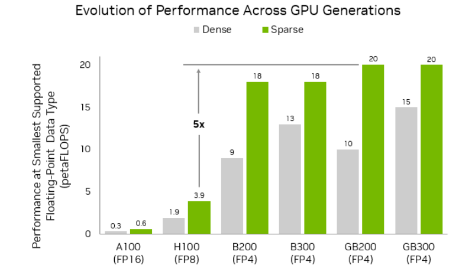

# 低精度（Low Precision）：从 FP8 到 FP4 的训练与推理

> 读这一章之前，最好已经能用矩阵乘法的视角看 transformer——一个 `Linear` 层的前向就是一次 GEMM，反向再贡献两次 GEMM，因为后面处处会用到这个视角。浮点数的 sign/exponent/mantissa 结构、scaling factor、量化误差这些概念本章不假设你已经知道，[`00`](./00_formats_and_scaling.md) 会从头定义。另外，如果你已经读过 [00 · Roofline model：性能上界的两道天花板](../hpc/00_roofline_model.md) 会更顺——本章会反复借用 roofline 里「两道天花板」的说法来解释低精度为什么真的有效。
>
> 这一章想讲清楚三件事：当前主流的低精度数值格式——FP8 的 E4M3/E5M2、MXFP8/MXFP6/MXFP4、NVFP4——各自是什么、差别在哪里；硬件是怎么支持它们的，Hopper 时代 DeepSeek 用软件的方式把 FP8 大规模训练做成了（DeepSeek-V3 论文加上 DeepGEMM kernel），而到了 Blackwell，tensor core 已经能原生消费 per-block scale；以及在一个真实模型里，究竟哪些部分敢用低精度、哪些必须保持高精度，训练和推理两侧各给出一张「精度地图」。

下面这些是本章依据的代码与文献：

- [[deepgemm:]] —— DeepGEMM（DeepSeek 的 FP8/FP4 GEMM kernel 库），pin 在 commit `88965b07`（2026-06-01），引用给 `path:line`。它的 SM90 路径就是 DeepSeek-V3 论文 §3.3 的工程实现，SM100 路径则是 Blackwell 硬件 block scaling 的直接证据。
- 论文：DeepSeek-V3（[arXiv:2412.19437](https://arxiv.org/abs/2412.19437)）、OCP MX 原始论文（[arXiv:2310.10537](https://arxiv.org/abs/2310.10537)）、NVFP4 预训练（[arXiv:2509.25149](https://arxiv.org/abs/2509.25149)）、MXFP8 预训练 recipe（[arXiv:2506.08027](https://arxiv.org/abs/2506.08027)）、gpt-oss model card（[arXiv:2508.10925](https://arxiv.org/abs/2508.10925)）。
- NVIDIA 官方博客 / 文档：Blackwell Ultra 架构深度文、NVFP4 推理博客、NVFP4 训练博客、FP8 scaling 策略博客、Transformer Engine 文档（URL 见各篇正文）。

---

## 0. 低精度的收益、代价与 scaling 粒度

低精度可以理解成一笔交易：把每个数的 bit 数砍掉一半，roofline 的两道天花板会同时松动——tensor core 的峰值算力 `π` 翻倍（FP8 大约是 BF16 的 2 倍，FP4 大约是 FP8 的 2 倍），每个元素的字节数减半又让 memory-bound 算子的搬运量减半。代价是动态范围和精度都会随之塌缩。能让这笔交易不亏本的工具其实只有一个，那就是 scaling 的粒度——用多细的粒度给数据配上缩放因子。

这笔交易能推出三个推论，整章内容基本都是围绕它们展开的。

第一，`π` 和 `I` 会同时受益（这里借用 roofline 的语言，参见 [00 · Roofline model：性能上界的两道天花板](../hpc/00_roofline_model.md)）：compute-bound 的大 GEMM 吃到 `π` 翻倍的好处，memory-bound 的 decode、KV cache、权重读取则吃到字节减半的好处。低精度因此是少数能同时把工作点往上、往右推的手段。

第二，bit 数越少，scaling 就必须做得越细。FP16 时代一个全局的 loss scale 就够用；到了 FP8 时代需要 per-tensor 的 scale；DeepSeek 把 FP8 的 scaling 做到了 1×128 / 128×128 的分组粒度；Blackwell 上的 MXFP4/NVFP4 更是细到每 32 个或 16 个元素配一个 scale。粒度不断细化，是贯穿全章的一条主线。

第三，粒度每往下细化一步，都需要硬件在背后买单。纯软件做细粒度 scaling 是有上限的——DeepGEMM 在 Hopper 上就得靠 CUDA core 做一次 promotion 来补齐累加精度；而 Blackwell 直接把 per-block scale 做进了 tensor core 的指令（`tcgen05.mma...block_scale`），软件方案这才算是被硬件正式收编。

> 图：各代 NVIDIA GPU「最小浮点格式」的峰值算力（dense/sparse）：A100 FP16 0.3/0.6 → H100 FP8 1.9/3.9 → B200 FP4 9/18 → GB300 FP4 15/20 PFLOPS。每一代的峰值跃迁几乎都靠更低精度的格式撑出来（NVIDIA 2025, Fig 1；[Introducing NVFP4](https://developer.nvidia.com/blog/introducing-nvfp4-for-efficient-and-accurate-low-precision-inference/)）。

---

## 1. 演进时间线

下面这张表按时间顺序排开：格式的 bit 数一路降低，scaling 的粒度也一路细化，这两条线其实互为因果——想再省一点 bit，就不得不把 scale 做得更细一点，才能不牺牲精度。

| 时间 | 硬件 | 主流格式 | scaling 粒度 | 代表系统 / 事件 |
|---|---|---|---|---|
| 2017– | Volta 起 | FP16 + FP32 master | **单 per-tensor** loss scale | mixed precision 训练范式确立 |
| 2020– | A100 | BF16 / TF32 | 不需要 scale（动态范围≈FP32） | BF16 成为训练默认 |
| 2022– | Hopper (SM90) | FP8 E4M3/E5M2 | **per-tensor** delayed scaling（amax 历史） | Transformer Engine；惯例：前向 E4M3、梯度 E5M2 |
| 2024-12 | Hopper | FP8 全 E4M3 | **1×128 activation tile + 128×128 weight block**（FP32 scale，软件实现） | **DeepSeek-V3**：首次在 671B 规模验证 FP8 训练（[01](./01_deepseek_fp8_hopper.md)） |
| 2023-09 标准 → 2025 硬件落地 | Blackwell (SM100) | **MXFP8 / MXFP6 / MXFP4** | **每 32 元素**共享 E8M0 scale，tensor core 原生消费 | OCP MX v1.0 标准；`tcgen05.mma.kind::mxf8f6f4.block_scale`（[02](./02_blackwell_mxfp_nvfp4.md)） |
| 2025 | Blackwell | **NVFP4** | **每 16 元素**一个 E4M3 scale + per-tensor FP32 二级 scale | NVFP4 推理 PTQ；12B×10T tokens NVFP4 预训练（[02](./02_blackwell_mxfp_nvfp4.md)） |
| 2025-08 | — | MXFP4（推理） | 每 32 元素 E8M0 | OpenAI **gpt-oss**：MoE 权重 MXFP4，120B 单卡 80GB 可跑 |
| 2025-08 | — | FP8 + **UE8M0** scale | 1×128/128×128，scale 约束为 2 的幂 | **DeepSeek-V3.1**：SF 全面 UE8M0 化，向 MX 生态对齐（[01 §8](./01_deepseek_fp8_hopper.md)） |

这张表可以横着看，也可以竖着看：横着看是格式的变化，竖着看是粒度的变化。格式的 bit 数一路下降，从 16 降到 8 再降到 4；scaling 粒度则一路细化，从整张量到 128 个元素再到 32 或 16 个元素。前者省下 bit，后者把精度保住，两者互相成就，缺一不可。

---

## 2. 格式概览与硬件支持

各格式精确的 bit 布局、特殊值和量化公式，会放在 [`00`](./00_formats_and_scaling.md) 里从头定义，这里先给一张总表建立整体印象。表里的「等效 bit」指元素本身的 bit 数加上 scale 摊到每个元素上的开销，比如 MXFP4 就是 4 + 8/32 = 4.25 bit/元素。

| 格式 | 元素 (S/E/M) | 元素最大幅值 | scale | scale 粒度 | 等效 bit | 硬件原生加速 |
|---|---|---|---|---|---|---|
| FP32 | 1/8/23 | ~3.4e38 | — | — | 32 | 所有 GPU |
| TF32 | 1/8/10 | ~3.4e38 | — | — | 19（存 32 算 10） | A100 起 |
| FP16 | 1/5/10 | 65504 | 全局 loss scale | per-tensor ×1 | 16 | Volta 起 |
| BF16 | 1/8/7 | ~3.4e38 | 不需要 | — | 16 | A100 起 |
| FP8 E4M3 | 1/4/3 | **448**（无 Inf） | FP32，软件管理 | per-tensor（TE）~ 1×128/128×128（DeepSeek） | 8（+scale 开销极小） | Hopper 起 |
| FP8 E5M2 | 1/5/2 | **57344**（有 Inf） | 同上 | 同上 | 8 | Hopper 起 |
| MXFP8 | E4M3/E5M2 | 448 / 57344 | **E8M0**（2 的幂） | **每 32 元素** | 8.25 | Blackwell 起 |
| MXFP6 | E2M3/E3M2 | 7.5 / 28 | E8M0 | 每 32 元素 | 6.25 | Blackwell 起 |
| MXFP4 | E2M1 | **6** | E8M0 | 每 32 元素 | 4.25 | Blackwell 起 |
| NVFP4 | E2M1 | 6 | **E4M3**（带尾数）+ per-tensor FP32 | **每 16 元素** | 4.5 | Blackwell 起 |

硬件层面的算力矩阵如下（dense 峰值，都是量级数字，具体来源见 [`02` §1](./02_blackwell_mxfp_nvfp4.md)）：

| | BF16 | FP8 | MXFP8 | MXFP4 / NVFP4 |
|---|---|---|---|---|
| Hopper（H100/H800，单卡） | ~1 PFLOPS | ~2 PFLOPS（DeepGEMM 实测 1550 TFLOPS，[[deepgemm:README.md#L23]]） | ✗ | ✗ |
| Blackwell（B200/GB200，单 GPU） | ~2.2–2.5 PFLOPS | ~4.5–5 PFLOPS | 同 FP8（2× BF16） | ~9–10 PFLOPS（4× BF16） |
| Blackwell Ultra（GB300，单 GPU） | — | ~5 PFLOPS | 同 FP8 | ~15 PFLOPS（6× BF16） |

> 这里有一个常被搞混的术语需要澄清：并不存在所谓的「NVFP8」。NVIDIA 的私有格式（带 NV 前缀）只有 NVFP4 一个；8-bit 的 microscaling 格式就是 OCP 标准里的 MXFP8。Blackwell tensor core 原生支持的 microscaling 格式一共只有四种：**MXFP8、MXFP6、MXFP4、NVFP4**（依据是 NVFP4 预训练论文的 Table 1，Transformer Engine 文档的表述也一致）。日常说的「Blackwell FP8」，指的其实是 MXFP8，或者是沿用 Hopper 时代的 per-tensor FP8。

---

## 3. 精度地图

严格意义上「全模型 FP8」或「全模型 FP4」是不存在的——所有生产级方案都是 mixed precision：GEMM 部分吃到低精度带来的算力收益，而那些对误差特别敏感的组件仍然保持高精度。下面两张表分别给出训练侧和推理侧的精度地图，细节和出处见 [`01` §7](./01_deepseek_fp8_hopper.md) 与 [`02` §3–§5](./02_blackwell_mxfp_nvfp4.md)。

### 3.1 训练侧

| 组件 | DeepSeek-V3（Hopper FP8） | NVIDIA MXFP8 recipe（Blackwell） | NVIDIA NVFP4 recipe（Blackwell） |
|---|---|---|---|
| Linear 的 3 个 GEMM（Fprop/Dgrad/Wgrad） | **FP8 E4M3**，1×128/128×128 SF | **MXFP8**（全 E4M3 + E8M0 scale） | **NVFP4**（Wgrad 输入加 RHT） |
| attention 的 QK^T / score·V（batched GEMM） | 保持 BF16/FP32 | 保持 BF16/FP16 | 保持 BF16/FP32 |
| softmax / LayerNorm / RMSNorm | 原始精度 | 原始精度 | 原始精度 |
| embedding / output head（LM head） | 原始精度（BF16/FP32） | 原始精度 | 原始精度 |
| MoE router / gating | 原始精度 | — | — |
| 敏感层（首/尾部 block） | 不特殊处理 | 全部 block 都可量化 | **尾部 ~15% linear 保持 BF16**（必须，否则发散） |
| 反向 activation 缓存 | FP8（attention 后 Linear 输入用定制 E5M6） | 各存行/列两份 MXFP8 | NVFP4 + stochastic rounding（仅梯度） |
| master weights | **FP32** | FP32 | FP32 |
| weight gradients（累加） | **FP32** | FP32 | FP32 |
| optimizer states（AdamW moments） | **BF16** | — | FP32 |
| MoE dispatch 通信 | **FP8**（SF 为 2 的幂）；combine 保持 **BF16** | — | — |
| 精度结论 | relative loss error **< 0.25%**（16B@1.33T、230B@0.9T tokens） | 8B@15T tokens 与 BF16 差距 **< 0.5% ppl** | 12B@10T tokens，下游与 FP8 baseline 相当 |

### 3.2 推理侧

| 组件 | 典型做法 | 代表 |
|---|---|---|
| dense Linear 权重+激活 | FP8 W8A8（per-tensor / per-token / 128×128 block）；Blackwell 上 MXFP8、NVFP4 W4A4 | DeepSeek 官方 FP8 checkpoint；vLLM/SGLang `fp8`/`mxfp8`/`modelopt_fp4` |
| MoE expert 权重 | **MXFP4**（W4A16/W4A4）或 NVFP4 | **gpt-oss**：MoE 权重 MXFP4（占参数 90%+），attention/embedding 保持高精度，120B 单卡 80GB |
| attention 计算 | 默认 BF16/FP16；FP8 KV cache 时 Q/K/V 可在 FP8 域内算（FA3）；INT4 QK + FP8 PV（SageAttention2） | vLLM blog；arXiv:2411.10958 |
| KV cache | **FP8 E4M3**（per-tensor 或 per-head scale），显存减半、decode ITL slope 最低降至 BF16 的 54% | vLLM `kv_cache_dtype="fp8"` |
| embedding / LM head | 保持 BF16/FP16 | gpt-oss、Nemotron NVFP4 checkpoint 同 |
| weight-only 低比特 | W4A16（GPTQ/AWQ + Marlin kernel）：权重 INT4、激活 FP16 | 推理生态主力之一，非 Blackwell 上 NVFP4 也退化为此形态 |

---

## 4. 这组文档怎么读

整章一共四篇，可以按下面这张表按需查阅或顺序通读：

| 文件 | 内容 | 锚点 |
|---|---|---|
| `README.md`（本文） | 全景、演进时间线、格式概览、精度地图 | —— |
| [00 · 数值格式与 scaling 粒度](./00_formats_and_scaling.md) | 地基部分：浮点格式 S/E/M 语义、量化定义式与误差来源、**scaling 粒度演进**（per-tensor → block → microscaling）、OCP MX 标准、NVFP4 两级 scaling、舍入方式的坑 | OCP MX spec；arXiv:2310.10537 |
| [01 · DeepSeek FP8 与 DeepGEMM：Hopper 软件方案](./01_deepseek_fp8_hopper.md) | Hopper 时代的软件答卷：DeepSeek-V3 FP8 框架（全 E4M3、1×128/128×128、online quantization、N_C=128 promotion）+ DeepGEMM SM90 kernel 逐行对齐 + 精度验证与成本数字 + V3.1 UE8M0 过渡 | [[deepgemm:deep_gemm/include/deep_gemm/impls/sm90_fp8_gemm_1d2d.cuh#L58,L253,L311,L331]] |
| [02 · Blackwell：MXFP8 / MXFP4 / NVFP4](./02_blackwell_mxfp_nvfp4.md) | Blackwell 的硬件答卷：第五代 tensor core 原生 block scaling、MXFP8 预训练 recipe、NVFP4 推理（PTQ 精度/显存/能效）与 NVFP4 预训练四件套、推理生态落地（gpt-oss、vLLM/SGLang、FP8 KV cache） | [[deepgemm:deep_gemm/include/deep_gemm/impls/sm100_fp8_gemm_1d1d.cuh#L54,L277]] |

建议的阅读顺序是：先读本文建立起「粒度细化」这条主线，再读 [`00`](./00_formats_and_scaling.md) 把格式与量化的定义讲清楚，然后读 [`01`](./01_deepseek_fp8_hopper.md) 看纯软件方案在 Hopper 上能做到什么程度，最后读 [`02`](./02_blackwell_mxfp_nvfp4.md) 看硬件是如何把这套软件方案收编进指令集的。

---

## 5. 与全仓主线的呼应

- **roofline**（[00 · Roofline model：性能上界的两道天花板](../hpc/00_roofline_model.md)）：低精度会同时抬高 `π`（FP8 大约是 BF16 峰值的 2 倍，FP4 大约是 FP8 峰值的 2 倍）和 `I`（元素字节减半），本文 §0 的两个推论正是由此推出的。
- **forward/backward 对称性**（[大规模训练的并行策略 —— 总览](../parallel/README.md)）：一个 Linear 层的 Fprop、Dgrad、Wgrad 三个 GEMM 本来就是同一结构的镜像，DeepSeek-V3 把它们全部做成了 FP8，只是 Dgrad 的量化方向（把 1×128 转置成 128×1）需要单独处理——对称性在「量化方向」这个细节上体现得很清楚（[`01` §3](./01_deepseek_fp8_hopper.md)）。
- **MoE 通信**（[Expert Parallelism (EP) —— Infra 视角深入](../parallel/05_ep/README.md)）：DeepSeek-V3 把 dispatch 阶段的 activation 量化到 FP8 再做 all-to-all，combine 阶段则保持 BF16，通信量化其实就是低精度思路在网络上的延伸（[`01` §7](./01_deepseek_fp8_hopper.md)）。

---

下一篇是 [00 · 数值格式与 scaling 粒度](./00_formats_and_scaling.md)，会先把浮点格式是什么、量化误差从哪里来、scaling 粒度为什么是关键变量这几件事说清楚，再进入 DeepSeek 与 Blackwell 各自的工程故事。
