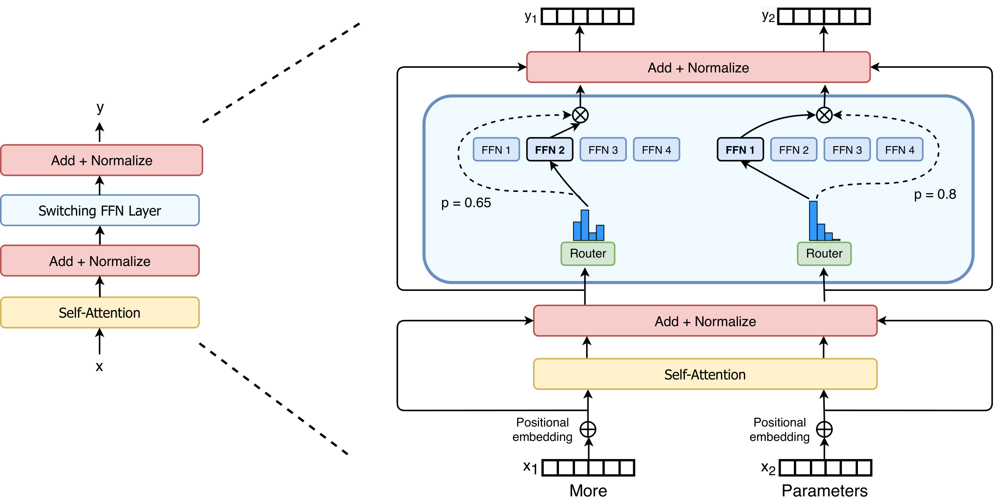
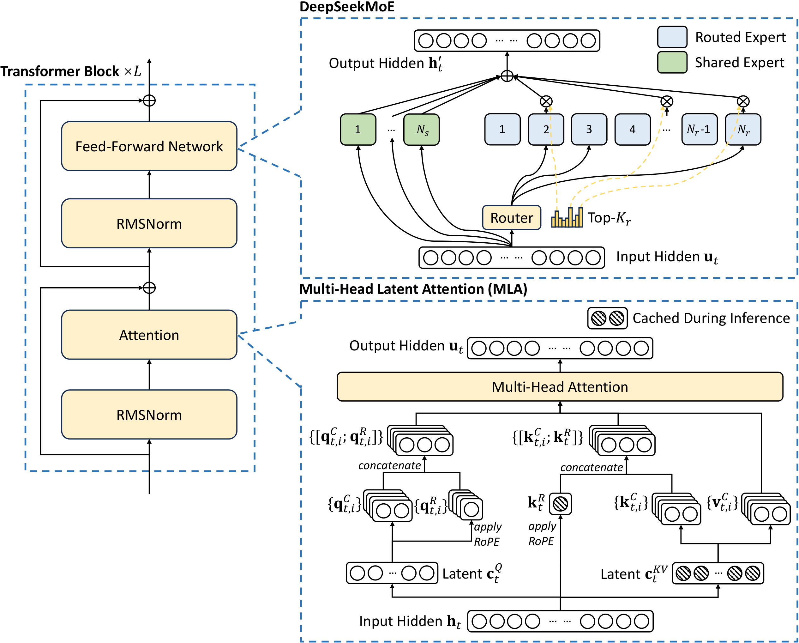

# 01 · MoE 基础与关键组件

> 上一篇（README）搭起了 MoE 演化的整体框架；这一篇要把「一层 MoE 到底是什么」讲清楚：它替换的是 Transformer 里哪一段计算、每个张量的 shape 和语义分别是什么、哪些量参与反向传播，以及 routing collapse 从何而来。后面几篇要讲的细粒度切分、LatentMoE、三类 load balancing，全都建立在这一篇给出的定义之上，所以这里不会跳过它们。
>
> 工程实现上的 permute、all-to-all、grouped GEMM，这一篇只保留它们的算法语义，具体怎么实现见 [Expert Parallelism (EP) —— Infra 视角深入](../parallel/05_ep/README.md)。

---

## 1. 被替换的那一段：dense FFN

一个 decoder-only Transformer block（这里先略去 LayerNorm 具体放在哪个位置的细节）可以写成：

```
u = Attn(h) + h                 # residual 1，混合序列维
y = FFN(u)  + u                 # residual 2，逐 token 的通道混合
```

其中 attention 负责在 token 之间混合信息，而 FFN 是对每个 token 独立地做通道混合，token 之间互不影响。以现在主流的 SwiGLU FFN 为例，令输入 $u \in \mathbb{R}^H$：

$$
\mathrm{FFN}(u) = W_{\mathrm{down}}\,( \mathrm{Swish}(W_{\mathrm{gate}}\, u) \odot (W_{\mathrm{up}}\, u) )
$$

其中 $W_{\mathrm{gate}}, W_{\mathrm{up}} \in \mathbb{R}^{M \times H}$，$W_{\mathrm{down}} \in \mathbb{R}^{H \times M}$。

这里 $M$ 是 intermediate size，常见取法是 $M \approx \frac{8}{3} H$ 再做对齐。每个 token 的 FLOP 是 $\Theta(H \cdot M)$，参数量也是 $\Theta(H \cdot M)$。这条路的扩展上限很清楚：想要更强的表达能力，只能把 $H$ 或 $M$ 调大，而这样做会让训练和推理时每个 token 的成本一起上涨。

MoE 正是从这里出发的。FFN 占据了 Transformer 里大部分的参数和大部分的 FLOP，但它的计算是逐 token 进行的，token 之间没有序列依赖，这个性质正好适合做成「条件计算」：让不同的 token 走向不同的 FFN 副本，而不是都挤在同一套参数里。

---

## 2. 一层 MoE 的定义式

把第 $\ell$ 层的 FFN 替换成 $E$ 个结构相同的 expert，每个 expert 本身仍然是一个 FFN。对 token $t$，输入 $u_t \in \mathbb{R}^H$：

$$
\begin{aligned}
y_t &= u_t + \sum_{i=1}^{E} g_{i,t} \cdot \mathrm{Expert}_i(u_t) \\
g_{i,t} &= \begin{cases} s_{i,t}, & \text{if } s_{i,t} \in \mathrm{TopK}(\{s_{j,t}\}, k) \\ 0, & \text{otherwise} \end{cases} \\
s_{\cdot,t} &= \mathrm{Score}(W_r u_t)
\end{aligned}
$$

打分也可以写成 $\mathrm{Score}(u_t^{\top} e_i)$（见 §3.1）。$g$ 是稀疏的：每一行恰好有 $k$ 个非零元素，这就是 token-choice（也叫 top-k routing）。由此可以得到几条直接的推论：

- 每 token 的 FLOP 约等于 $k$ 个 expert 的计算量，是 $\Theta(k \cdot H \cdot M_e)$，和 expert 总数 $E$ 无关。
- 总参数量约等于 $E$ 个 expert 的参数量，是 $\Theta(E \cdot H \cdot M_e)$，可以随 $E$ 一起增长。
- 稀疏度常用 $E/k$ 表示（Kimi K3 写成 56 = 896/16），激活比则是 $k/E$。

换句话说，这是用条件计算换取宽度：模型的总容量随专家数增长，而实际计算量只跟着 top-k 走，与专家总数无关。



> 图：Switch Transformer 的 MoE 示意。router 给每个 token 一组 gate 分数，再把 token 送到得分最高的 expert FFN。Switch 是 top-1；GShard / Mixtral / DeepSeek 是 top-k。下面的 `routing_map` / `probs` 就是这张图的张量化。（Fedus et al. 2021, Fig 2；[arXiv:2101.03961](https://arxiv.org/abs/2101.03961)）

DeepSeek-V3 进一步把 shared expert 也画进了同一层，这是上面这个定义的一个超集——那些始终激活的路径不再经过 top-k 挑选：



> 图：DeepSeek-V3 右侧即 DeepSeekMoE——少量 **shared expert**（始终激活）+ 大量 **routed expert**（top-k）。本篇先按「纯 routed」把组件讲清，shared 的动机放到 [`02`](./02_fine_grained.md)。（DeepSeek-AI 2024, Fig 2；[arXiv:2412.19437](https://arxiv.org/abs/2412.19437)）

---

## 3. 各个张量的 shape 与语义

后文统一使用下面这套符号，它和 Megatron `TopKRouter` 的命名是对齐的（见 `router.py` 的 docstring，以及 [[megatron-lm:megatron/core/transformer/moe/moe_utils.py#L672]]）：

| 符号 | shape | 语义 | 可导？ |
|---|---|---|---|
| `u` / `hidden_states` | $[T, H]$ | 进入 MoE 的 token 表示；$T = S \cdot B$（或 $S/\mathrm{TP} \cdot B$） | 是 |
| `W_r` | $[E, H]$ | router 权重（gating linear） | 是 |
| `logits` | $[T, E]$ | 第 $t$ 行第 $e$ 列 = token $t$ 对 expert $e$ 的**原始打分** | 是 |
| `scores` | $[T, E]$ | `Score(logits)`，用于选 expert 和（若用 aux）算平衡项 | 是 |
| `expert_bias` `b` | $[E]$ | **只加在选择用的分数上**，不进加权 | 否（手写更新） |
| `routing_map` | $[T, E]$ bool | 每行恰好 $k$ 个 True | 否（离散 top-k） |
| `probs` / `g` | $[T, E]$ 稀疏或 $[T, k]$ | combine 时的连续权重 | 是 |
| `tokens_per_expert` | $[E]$ | `routing_map.sum(0)`，真实负载计数 | 否（整数计数） |

这里的 $T$ 是本 rank 上可见的 token 数。如果 aux loss 要做全局（global）统计，`tokens_per_expert` 和 $T$ 就要换成全局 batch 的数值——[[megatron-lm:megatron/core/transformer/moe/moe_utils.py#L72-L95]] 的 docstring 里写清楚了 micro batch 和 global batch 分别该传哪一个。

有两个点最容易混淆：

1. `routing_map` 和 `probs` 说的不是同一件事：前者回答的是「选了谁」，是硬的、不可导的；后者回答的是「选中的这几个各占多少权重」，是软的、可导的。combine 用的是 `probs`，负载统计用的是 `routing_map`。
2. `expert_bias` 不会进入 `probs`。Megatron 的实现在这一点上写得很干净（[[megatron-lm:megatron/core/transformer/moe/moe_utils.py#L805-L808]]）：

```python
scores_for_routing = scores + expert_bias.float()   # 只用来选谁
_, top_indices = compute_topk(scores_for_routing, topk)
scores = torch.gather(scores, dim=1, index=top_indices)  # 加权仍用无 bias 的 scores
```

bias 挪动的是路由这一步的选择结果，不会污染前向的数值，也不会给 router 的权重制造出「为了平衡负载而扭曲」的梯度。这正是 [`04`](./04_load_balancing.md) 里 aux-free 和 QB 能够成立的前提。

---

## 4. 关键组件

### 4.1 Router / gating：一个小的、高精度的 linear

```
logits = u @ W_rᵀ          # [T, H] × [H, E] → [T, E]
```

`W_r` 这个权重通常用 fp32 保存，并且在每个 rank 上都完整复制一份（[[megatron-lm:megatron/core/transformer/moe/router.py#L60-L62]]）。这么做的原因是：top-k 的边界对数值噪声非常敏感，两个 logits 只要相差几个 ulp，就可能换掉一个被选中的 expert，整个 dispatch 的 layout 也会跟着变化。即便 $E$ 涨到几百甚至上千，$[E, H]$ 这个矩阵相对整个 expert 的权重量级仍然很小，不值得专门为 router 做 TP 切分。

DeepSeek-V3 的写法在数学上是等价的：给每个 expert 一个 centroid 向量 $e_i \in \mathbb{R}^H$，打分公式是 $s_{i,t} = \mathrm{Sigmoid}(u_t^{\top} e_i)$（技术报告 Eq. 15）。这其实就是 `W_r` 矩阵里的一行，只是换了一种叙述方式。

### 4.2 Score function：归一化维度的选择

`topk_routing_with_score_function`（[[megatron-lm:megatron/core/transformer/moe/moe_utils.py#L793-L818]]）里有三个常见的选择：

| `score_function` | 公式 | 归一化维 | 典型使用者 |
|---|---|---|---|
| `softmax` | `softmax(logits, dim=-1)` 或先 top-k 再 softmax | **沿 $E$**：$E$ 个 expert 争一个 token | GShard / Switch / Mixtral |
| `sigmoid` | $\sigma(\mathrm{logits})$ 逐元素 | **无竞争**：每个 $(t, e)$ 独立打分 | DeepSeek-V3、Kimi K3 |
| `sqrtsoftplus` | $\sqrt{\mathrm{softplus}(\mathrm{logits})}$ | 逐元素，正值更平滑 | Megatron 备选 |

`use_pre_softmax` 是复现实验时一个经典的坑：如果先对全部 $E$ 个 expert 做 softmax、再挑出 top-k，被选中的 $k$ 个权重加起来会小于 1；如果先挑出 top-k、再只对这 $k$ 个做 softmax，权重之和才等于 1。sigmoid 路径的做法是在 `topk>1` 时对选中的分数再做一次求和归一化，同样保证 combine 权重之和为 1。

sigmoid 相比 softmax 的好处在于，expert 之间不会在 score 这一层直接产生互斥竞争，数值更平稳，top-k 的边界也更稳定。至于「哪个 expert 不该被选」，这套设计把决定权交给了后面要讲的 bias 或 QB 机制，而不是交给 softmax 内部的相互压制。

### 4.3 Top-k：离散选择

```
idx = argtop_k(scores [+ b], dim=-1)     # [T, k]，不可导
routing_map[t, idx[t]] = True
```

这一步把连续的分数变成了一个离散的 assignment。反向传播时，这里不存在「本该选另一个 expert」这样的梯度——autograd 只能沿着被选中位置的 `probs` 往回走。这正是 MoE router 训练不稳定的根源，也是为什么必须额外做 load balancing 的原因。

目前主流的做法是 token-choice，即每个 token 自己选 $k$ 个 expert。与之对偶的做法是 expert-choice（每个 expert 挑选固定数量的 token，Zhou et al. 2022），它能做到严格的负载均分，但代价是这个选择依赖于同一个 batch 或同一条序列里未来的 token，会破坏语言模型的因果性，实际评测出来的效果也会因此虚高。DeepSeek 的 aux-free 论文把这一点写进了它与 aux、loss-free 方案的对照表里；[`04`](./04_load_balancing.md) 提到 expert-choice 时，也只把它当作一个反例来讨论。

### 4.4 Expert：结构与 dense FFN 同构

每个 routed expert 都是一个独立的 FFN（可以是 SwiGLU，也可以是后面会讲到的 SiTU-GLU），参数互不共享。实际实现里并不会真的写一个 `for i in experts: if selected` 这样的循环，而是分两步走：

1. 按 expert 把 token 排成连续的一段（permute）；
2. 用一次 grouped GEMM 一口气吃掉所有 local expert。

这部分具体怎么实现属于算子层面的事情，见 [05 · Grouped GEMM 与 Expert 计算](./05_grouped_gemm.md)。架构层面只需要记住一点：expert 的中间维 $M_e$ 不必等于 dense FFN 的 $M$——细粒度切分正是靠缩小 $M_e$、同时增多 $E$ 来保持总参数和激活 FLOP 不变的。

### 4.5 Dispatch / combine：算法语义

```
dispatch:  按 routing_map 把 token 复制到它选中的 k 个 expert
           输出「每个 expert 一段连续 token」，段长 = tokens_per_expert[i]（数据相关）

expert:    各段独立 FFN

combine:   把 k 路输出按 probs 加权，scatter_add 回原 token 序
```

这里有两件架构层面的事实值得记住。第一，dispatch 的反向就是 combine，combine 的反向就是 dispatch，这是线性 gather/scatter 操作互为转置的自然结果，DeepEP 因此只需要实现两个 kernel（详见 [EP 一章](../parallel/05_ep/README.md)）。第二，满宽 MoE 里的通信体积是 $\Theta(T \cdot k \cdot H)$（还要再乘上 dtype 的字节数），$k$ 和 $H$ 都出现在分子上，这正是 [`03`](./03_latentmoe.md) 要把 routed 路径压缩到更窄的 $\ell$ 的直接原因。

### 4.6 Residual、shared expert、dense 层

标准写法是 MoE 的输出再加上输入的 residual，这一点和 dense FFN 完全一样。如果模型里存在 shared expert，它走的是一条不经过 router、每个 token 都会计算的并行分支，最终再和 routed 部分的加权和相加（细节见 [`02` §3](./02_fine_grained.md)）。

很多模型会把最前面的一层或几层保留为普通的 dense FFN（Kimi K2 和 K3 都设置 `Number of Dense Layers = 1`）。原因是早期层的表示还没有充分分化，router 很难在这个阶段做出稳定的专家分工，先用 dense FFN 把表示垫稳，是工程上常见的做法，通常称为 first-k-dense。

---

## 5. Collapse、capacity、dropless

如果放任离散的 top-k 不管，router 很容易塌缩到只使用少数几个 expert——这就是 routing collapse（Shazeer 2017）：被选中次数多的 expert 会收到更多梯度，因此变得更容易被选中，其余的 expert 则逐渐被「饿死」。这既是一个质量问题（大量专家容量被浪费），也是一个系统问题（在 expert parallelism 下，最慢的那个 expert 决定了整个 step 的时间）。

面对瞬时的负载不均衡，工程上主要有两条路可以走：

| | dropless（训练主流） | drop-and-pad / capacity |
|---|---|---|
| 规则 | 每个 expert 来多少算多少 | 每 expert 固定 `capacity` $= \lceil T \cdot k / E \cdot \mathrm{factor} \rceil$，超出丢、不足 pad |
| shape | `num_out_tokens` $= T \cdot k$ 固定，但每段长度动态 | 所有 shape 静态，CUDA graph 友好 |
| 精度 | 不丢 token | 过载时丢 |
| 代表 | DeepSeek-V3、Kimi K3（都明确 no token-dropping） | GShard / Switch 的经典 TPU 实现 |

GShard 当年还带了 group-level 本地 gating、以及「第二个专家按门控值大小随机丢弃」这类为吞吐服务的技巧。现在的大模型训练几乎都走向了 dropless：靠更好的平衡算法把负载主动推平，而不是靠丢弃 token 来维持静态的 shape。推理的 decode 阶段则仍然常见 capacity 或 masked 路径。

需要区分的是，capacity 解决的是实现层面的约束问题，而不是 collapse 本身。collapse 必须在 router 这一侧从根源上处理，这正是 [`04`](./04_load_balancing.md) 要讲的三条平衡路线。

---

## 6. 本层的梯度账（forward / backward）

| 子步骤 | forward | backward |
|---|---|---|
| gating linear | fp32 `u @ W_rᵀ` | 标准 matmul 反传（Megatron 可能重算以省激活，`RouterGatingLinearFunction`） |
| score | softmax / sigmoid / … | 沿 score 定义反传 |
| top-k 选择 | 不可导 | **无梯度**穿过「选了谁」 |
| `probs` 归一化 | 连续 | 主 loss 经 combine 回到被选中位置的 `probs`，再回 `W_r` |
| aux loss（若用） | 标量，经 `MoEAuxLossAutoScaler` 挂上 | 人为注入 `ones·scale`，沿 `probs` 回 router（[[megatron-lm:megatron/core/transformer/moe/moe_utils.py#L246]]） |
| expert bias / QB | 加在选择分数上；step 结束后更新 | **不进 autograd**；下一 step 才生效（因果） |
| dispatch / expert / combine | 见 [EP 一章](../parallel/05_ep/README.md) | `dispatch.bwd = combine` |

有一个简单的标准可以用来检验对这套机制的理解是否正确：如果某个想法的合理性依赖于「梯度会告诉 router 应该换一个 expert」这样的假设，那这个理解就是错的。router 实际能收到的学习信号只有三种：

1. 被选中 expert 的 `probs`，以及 expert 输出对隐藏状态的贡献；
2. 如果启用了 aux，还会有 $P_i$ 被 $f_i$ 加权之后带来的额外梯度；
3. 如果启用了 bias 或 QB，会有「下一步哪些位置会变成被选中的位置」这样的调整——但这是一次非梯度的、离散的干预，不经过 autograd。

---

## 7. 一条极简历史

| 年份 | 工作 | 留给后面的东西 |
|---|---|---|
| 1991 / 1994 | Jacobs / Jordan & Jacobs，经典 MoE | 「门控 + 多个专家」这一结构 |
| 2017 | Shazeer，sparsely-gated MoE | 稀疏 top-k、collapse、noisy gating |
| 2020 | GShard | 规模化、**aux loss**、capacity、expert parallelism |
| 2021 | Switch | 简化到 top-1，把 aux 写成 $E \sum_i f_i P_i$ 的常用形式 |
| 2022 | ST-MoE | **z-loss** 压 logits 尺度 |
| 2024 | Mixtral | 开源 LLM 里可复现的粗粒度 top-2 |
| 2024 | DeepSeekMoE → V2/V3 | **细粒度 + shared**、sigmoid、**aux-free** |
| 2026 | LatentMoE；Kimi K3 | **latent 宽**、SiTU-GLU、**QB** |

下一篇不会再讲「MoE 是什么」这个问题，而是要讲清楚为什么 8 个大专家还不够用，为什么要把专家的中间维继续切开。

---

下一篇：[02 · 细粒度 MoE：从 Mixtral 到 DeepSeekMoE](./02_fine_grained.md)，讲 knowledge hybridity 和 redundancy 这两个问题，以及 DeepSeekMoE 用来解决它们的两处关键改动。
