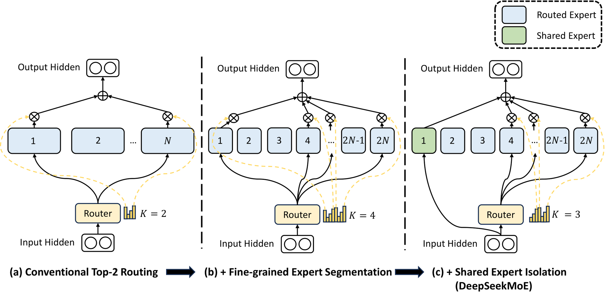

# 02 · 细粒度 MoE：从 Mixtral 到 DeepSeekMoE

> 上一篇（[`01`](./01_basics_and_components.md)）把专家定义成了「多个 FFN + top-k」。但当 $E$ 很小、每个 expert 又和 dense FFN 一样宽的时候，专家会陷入一种尴尬的处境：既学不出真正的专精，彼此之间又在悄悄重复学习同一套公共知识。DeepSeekMoE 针对这个处境做了两处关键改动——**fine-grained expert segmentation** 与 **shared expert isolation**——在保持总参数和激活 FLOP 不变的前提下，把专家切得更细，并抽出一条始终激活的 shared 通路。这两处改动后来成了 DeepSeek-V2/V3、Kimi K2，乃至下一篇要讲的 LatentMoE 共同的底座。

---

## 1. 粗粒度 MoE 的两个问题：hybridity 与 redundancy

以 Mixtral 8×7B 为标本来看：每层 $E=8$、$k=2$，每个 expert 的中间维 $M=14336$，和 Mistral 7B 的 dense FFN 同构（Jiang et al. 2024）。这是 GShard、Switch 一路走下来延续的「少量大专家」形态。

DeepSeekMoE 把这种形态的失败模式概括成了两点（Dai et al. 2024, §1）：

1. **Knowledge hybridity（知识杂糅）**。当 $E$ 只有 8 或 16 的时候，被分到同一个 expert 的 token 往往覆盖非常杂的知识领域。一个 FFN 被迫在同一套参数里同时装下「代码缩进」和「古文虚词」这类差异极大的模式，结果是两头都学不好。
2. **Knowledge redundancy（知识冗余）**。不同 expert 收到的 token 之间，仍然共享大量「怎么把 residual 往前推」这类公共变换。于是多个 expert 各自都要学一份相同的公共知识，routed 参数被浪费，专家之间的可替换性也很高。

论文用一个可操作的探针验证了第二点：对每个 token 屏蔽掉路由概率最高的若干个 routed expert，再从剩下的里面重新选 top-k。冗余程度高的模型对这种屏蔽不敏感，因为别的专家能顶上；而 DeepSeekMoE 明显更敏感——说明它的 routed expert 彼此更不可替代（Fig 4）。

---

## 2. Fine-grained expert segmentation：把专家切细

### 2.1 做法：切开中间维，同时把 top-k 乘上去

保持「专家参数总量 = $N$ 个 dense FFN」「激活计算量 = $K$ 个 dense FFN」这两个量不变，把每个专家沿 FFN 的 intermediate hidden 维切成 $m$ 份：

```
原来：N 个专家，每个中间维 M，每 token 激活 K 个
现在：mN 个专家，每个中间维 M/m，每 token 激活 mK 个
```

参数量 $mN \cdot H \cdot (M/m) = N \cdot H \cdot M$，不变。
激活 FLOP $mK \cdot H \cdot (M/m) = K \cdot H \cdot M$，不变。

对应的定义式是（DeepSeekMoE Eq. 6–8，略去 residual）：

$$
\begin{aligned}
h_t &= \sum_{i=1}^{mN} g_{i,t}\, \mathrm{FFN}_i(u_t) \\
g_{i,t} &= \begin{cases} s_{i,t} & s_{i,t} \in \mathrm{Topk}(\{s_{j,t}\}, mK) \\ 0 & \text{otherwise} \end{cases} \\
s_{i,t} &= \mathrm{softmax}_i(u_t^{\top} e_i)
\end{aligned}
$$

这里的 $m$ 就是 granularity。DeepSeekMoE 2B 的验证实验里，把原本「16 个 dense-等价 FFN」切到了 64 个细专家（相当于 $m=4$ 的量级），激活数也按比例增加。



> 图：同一组总参数 / 激活 FLOP 下的三个阶段。(a) 经典 top-2；(b) 把每个大专家切细、激活数按比例增加；(c) 再隔离出始终激活的 shared expert，构成完整的 DeepSeekMoE。三张图对应的专家参数量和计算量始终保持不变。（Dai et al. 2024, Fig 2；[arXiv:2401.06066](https://arxiv.org/abs/2401.06066)）

### 2.2 真正涨的是组合空间

计算预算没有变化，变化的是一个 token 可以点名的专家组合数：

$$
\begin{aligned}
\text{coarse (top-2 / 16 experts):} \quad & \binom{16}{2} = 120 \\
\text{fine-grained } m = 4 \text{ (top-8 / 64 experts):} \quad & \binom{64}{8} = 4{,}426{,}165{,}368
\end{aligned}
$$

论文把这一点视为「更灵活、更对准的知识组合」。它和 LatentMoE 后面要用到的不等式属于同一类：

$$
\binom{\alpha N}{\alpha K} \ge \big[ \binom{N}{K} \big]^{\alpha}
$$

也就是说，同时放大专家数和 top-k，组合空间是按指数增长的，而不是按线性增长。细粒度先走出了「$m$ 倍」这一步；LatentMoE 后来用压缩省下来的预算再走一步（见 [`03`](./03_latentmoe.md)）。

直觉上可以这样理解：一个 token 不再被塞进 1–2 个「大而全的 FFN」里，而是点一组更小的专家，拼出自己真正需要的变换。当然 $m$ 也不是越大越好——$m$ 太大，每个专家的 $M/m$ 会过窄、单个专家的表达力不够，而且 router 输出的 $[T, mN]$ logits 和 top-k 的开销也会随之上升。$m$ 的取值是精度和路由复杂度之间的一个折中。

### 2.3 和「只加专家、不加激活」的区别

这里容易产生一个疑问：为什么不直接把 $N$ 调大、$K$ 保持不动？那样总参数会涨，激活 FLOP 却不变，看起来更划算。区别在于，细粒度切分的约束是同时 iso-parameter 且 iso-FLOP：在把专家切细的同时把激活数也乘上去，比的是「在同样的计算预算下，专家组合是否更精准」这件事。只加 $N$、不加 $K$ 是另一条轴，会让模型变得更稀疏，也会改变激活 FLOP 占总参数的比例，负载也更难平衡——Kimi K3 把稀疏度推到 56 的时候，aux-free 的固定步长机制已经不够用了（见 [`04`](./04_load_balancing.md)）。

---

## 3. Shared expert isolation：隔离出公共知识

### 3.1 做法：抽出 `K_s` 路，永远激活

在细粒度切分的基础上，再指定 $K_s$ 个 expert 不经过 router，让每个 token 都计算它们。为了保住总的激活量，routed 部分的 top-k 从 $mK$ 减到 $mK - K_s$：

$$
h_t = \sum_{i=1}^{K_s} \mathrm{FFN}_i^{\mathrm{shared}}(u_t) + \sum_{i=K_s+1}^{mN} g_{i,t}\, \mathrm{FFN}_i^{\mathrm{routed}}(u_t) + u_t
$$

其中最后一项 $u_t$ 是 residual；routed 部分 $g$ 的 top-k 宽度为 $mK - K_s$。

这是 DeepSeekMoE Eq. 9–11。DeepSeek-V3 把它写成了更干净的 $N_s$ / $N_r$ / $K_r$ 形式（技术报告 Eq. 12–15），并用 sigmoid 加选中项归一化代替了 softmax：

$$
\begin{aligned}
s_{i,t} &= \mathrm{Sigmoid}(u_t^{\top} e_i) \\
g'_{i,t} &= \begin{cases} s_{i,t} & s_{i,t} \in \mathrm{TopK} \\ 0 & \text{otherwise} \end{cases} \\
g_{i,t} &= g'_{i,t} \big/ {\textstyle\sum_j g'_{j,t}}
\end{aligned}
$$

### 3.2 动机：把公共变换从 routed 参数里搬出去

shared 路的假设是：任何 token 都需要少量与路由无关的变换，比如残差尺度的调整、通用句法，或者数值稳定所需的公共投影。如果这笔变换被每个 routed expert 各自学一份，那就是前面说的 redundancy。把它压进始终激活的 shared 通路之后，routed expert 就被「允许」只学差异化的那一部分。

工程上这样做还有一个附带的好处：shared 不参与 dispatch 的 all-to-all，因为它的参数在计算它的每个 rank 上就能本地完成，或者走普通的 TP。DeepSeek-V3 和 Kimi 都把 shared 做成了满宽、数量很少的形式（V3 是 1 个，K2 是 1 个，K3 是 2 个）。

从原型上看，DeepSpeed-MoE（Rajbhandari et al. 2022）已经从系统角度用过「总有几个 expert 留在本地」这种做法。DeepSeekMoE 的贡献是把它提升为一条算法层面的假设——隔离公共知识——并把它和细粒度切分绑在了同一套 iso-budget 设计里。

### 3.3 验证实验里的量级（DeepSeekMoE 论文）

在同一套 2B 总参、约 0.3B 激活、100B token 的设定下：

- DeepSeekMoE 2B 大幅优于同等计算量的 GShard 2B，并逼近了 **GShard 2.9B**（专家参数和计算量都是 1.5 倍）；
- 几乎摸到了「同总参 dense 模型」这条 MoE 理论上界；
- 消融实验显示：只加 shared、或者只加细粒度，效果都比 GShard 基线好；两者一起用效果最好（Fig 3）；
- 切成「1 个 shared + 63 个 routed、只激活 3 个 routed」从零训练，仍然优于同总参的 GShard——而这时激活的专家参数只有对方的一半（Fig 6）。

16B、2T token 规模的 DeepSeekMoE，用约 40% 的计算量就能对齐 LLaMA2 7B 和 DeepSeek 7B。后来的 DeepSeek-V2、V3 就是把这套结构拉到了数百 B 到 671B 的规模。

---

## 4. 落地：从 DeepSeekMoE 到 V3 / Kimi K2

细粒度加 shared，成了 2024 到 2025 年开源 MoE 的默认骨架。几组常用的数字：

| 模型 | routed $E$ | top-k | shared | hidden | 备注 |
|---|---|---|---|---|---|
| Mixtral 8×7B | 8 | 2 | 0 | 4096 | 粗粒度对照 |
| DeepSeekMoE 16B | 64 | 6 | 2 | 2048 | 细粒度公开检查点 |
| DeepSeek-V2 | 160 | 6 | 2 | 5120 | device-limited routing |
| DeepSeek-V3 | **256** | **8** | **1** | 7168 | sigmoid；aux-free |
| Kimi K2 | **384** | **8** | **1** | 7168 | 仍满宽 routed |
| Qwen3-235B-A22B | 128 | 8 | （实现相关） | 4096 | LatentMoE 论文的 running example |

V3 在细粒度之外，还加了两件属于路由算法、但对 infra 十分友好的设计，这里先点到为止，细节放在 EP 章展开：

- **Node-limited routing**：每个 token 的 top-k 先被限制在最多 `M` 个 node 以内（V3 常用 `M=4`）。做法是先把组内分数求和再选组，再在入选组里选 expert，这样可以直接压低跨机 all-to-all 的扇出（`moe_utils.py:579 group_limited_topk`，见 [01 · Router 与 Dispatch 前的 Preprocess](../parallel/05_ep/01_router_and_preprocess.md) §1.3）。
- **No token-dropping**：只要平衡做得足够好，就不需要靠 capacity 去丢 token。

Kimi K2 已经把 routed 推到了 384、top-8，但仍然在满宽 $H=7168$ 上做 dispatch。如果下一步继续加大 $E$ 和 $k$，通信量和权重带宽会按 $k \cdot H$ 再翻一倍——这正是下一篇（[`03`](./03_latentmoe.md)）要讨论的入口。

---

## 5. 细粒度之后的平衡问题

$E$ 从 8 涨到 256、384，再涨到 K3 的 896，对 load balancing 意味着：

- aux 的 $\alpha$ 变得更难调：专家数一多，$\sum_i f_i P_i$ 的尺度和噪声都会变化，主梯度也更容易被干扰；
- aux-free 的 $\gamma$ 是一个和 score 尺度、专家数都耦合的步长。苏剑林指出，它和 sigmoid 的数值范围是绑在一起的，换一种激活函数，或者某些层的 score 出现畸变，同一个 $\gamma$ 就会在「收敛太慢」和「后期振荡」之间来回摆动（见 [`04` §4](./04_load_balancing.md)）；
- 早期层仍然是最难平衡的部分，这也是 first-k-dense 一直存在的原因之一。

所以细粒度切分并不是切完就结束了：它把架构送进了一个必须把负载均衡当作一等公民来对待的区间。V3 用 aux-free 撑过了 256 个专家；K3 到了 896 个专家之后，换成了 QB。

---

下一篇：[03 · LatentMoE 与 Stable LatentMoE（Kimi K3）](./03_latentmoe.md)，讲清楚为什么在细粒度之后还要把 routed 路径压进 latent 宽，以及 Kimi K3 是怎么把它训稳的。
