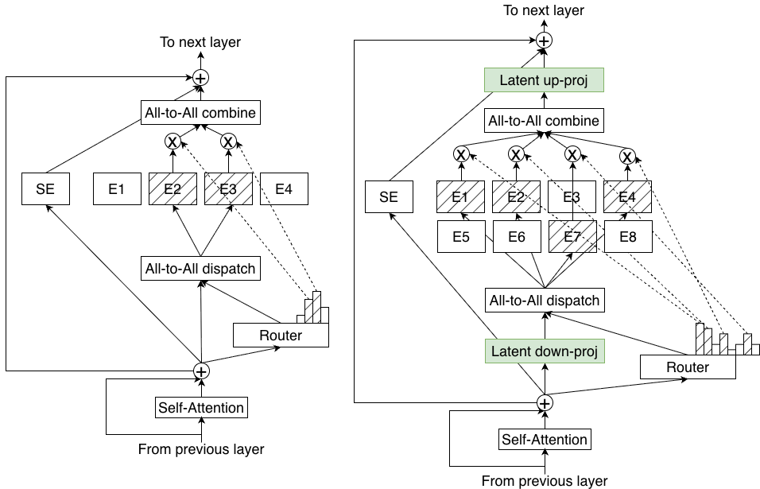
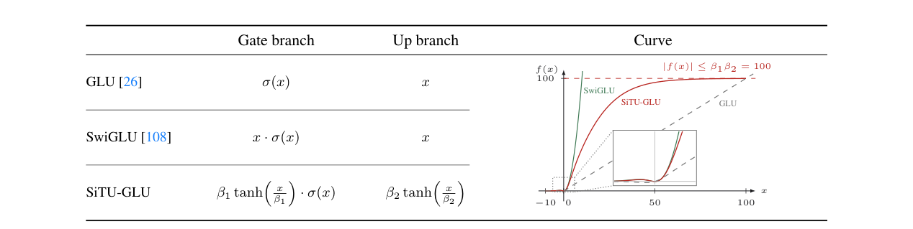

# 03 · LatentMoE 与 Stable LatentMoE

> 细粒度解决了「专家不够专」的问题，但并没有改变「每个被选中的 expert 仍在满宽 $H$ 上计算」这一事实。当 $E$ 与 $k$ 继续增大时，dispatch 体积与 expert 权重加载都按 $k \cdot H$（以及 $H \cdot M_e$）增长。LatentMoE 把 routed 路径迁移到 $\ell < H$ 的 latent 空间，用省下的带宽与通信开销换取更多的专家和更大的 top-k。Kimi K3 的 **Stable LatentMoE** 则是同一结构在 2.8T 参数、896 experts 规模上的稳定化版本，引入 RMSNorm、SiTU-GLU 以及 [`04`](./04_load_balancing.md) 将讨论的 QB。

---

## 1. 细粒度之后的瓶颈

在满宽 MoE 中，一次 routed 前向的开销分为两部分（Elango et al. 2026, §2；可对照 [00 · Roofline model：性能上界的两道天花板](../hpc/00_roofline_model.md) 中的两道天花板）：

| 场景 | 瓶颈 | 成本跟谁走 |
|---|---|---|
| 低延迟 decode（小 batch） | HBM 上 **加载 expert 权重** | 每个 expert $\Theta(H \cdot M_e)$ 字节；算术强度随每 expert token 数下降 |
| 高吞吐 prefill / 训练 | **all-to-all** 体积 | $\Theta((N/\mathrm{EP}) \cdot t_{\mathrm{exp}} \cdot H) = \Theta(T \cdot k \cdot H / \mathrm{EP})$ |

以论文的 running example——Qwen3-235B-A22B 在 GB200、EP=64 上的数量级为例：$H=4096$、$M=1536$、$E=128$、$k=8$。decode 要进入 compute-bound 区间，每个 expert 大约需要 $t_{\mathrm{exp}} \ge 1418$ 个 token，交互式 batch 远达不到这个量级，因此会撞上权重带宽瓶颈。在吞吐场景中，同一组数字给出的 all-to-all 时间与计算时间之比约为 **9:1**（NVLink 域内已经如此，跨机 RDMA 更差）。

关键观察是：**通信体积不依赖中间维 $M_e$，只取决于被搬运的 token 宽度 $H$ 和激活数 $k$。** 细粒度切分的是 $M_e$，对 all-to-all 没有直接帮助。要在不牺牲非线性预算 $k \cdot M_e$ 的前提下降低开销，唯一可调整的自由度是 routed 路径所使用的宽度。

---

## 2. 五条设计原则

论文将设计约束归纳为五条（§2），后面的结构是从这些约束推导出来的，而不是先设计结构再寻找理由：

| | 原则 | 推论 |
|---|---|---|
| I | 低延迟 serving 由权重带宽主导 | 优化 **accuracy per parameter**，减小每个 expert 的 $H \cdot M$ |
| II | 高吞吐由 all-to-all 主导 | $M_{\mathrm{comm}} \propto T \cdot k \cdot H / \mathrm{EP}$，应减 $H$ 或 $k$ |
| III | 质量依赖有效非线性预算 $U_{\mathrm{eff}} \propto k \cdot M$ | **不能**靠减 $k$ 或 $M$ 省通信 |
| IV | 任务有本征特征秩 $r_{\mathrm{eff}}$ | 压缩后的 $\ell$ 不能低于 $r_{\mathrm{eff}}$，否则信息塌缩 |
| V | 组合稀疏有益 | $C(\alpha E, \alpha k) \ge [C(E,k)]^{\alpha}$，应同时放大 $E$ 和 $k$ |

综合起来：压缩满宽 $H$ 的收益最大（I、II 同时受益，III 不直接受损），但只能压到 $\ell \ge r_{\mathrm{eff}}$（IV）；省下的预算则用于将 $E$、最好连同 $k$ 一起乘以 $\alpha = H/\ell$（V）。

消融实验显示，$\alpha \le 4$（即 $\ell = H/4$）时质量几乎不下降，$\alpha > 4$ 时开始明显恶化。论文因此将 $\alpha=4$ 作为默认压缩比，并在 16B 与 95B 规模上做了复验。

---

## 3. 结构：满宽路由、latent 计算



> 图：左侧为满宽 MoE（router、dispatch、expert 都在 $H$ 上）；右侧为 LatentMoE——先做 latent down-proj 再 dispatch，expert 在 $\ell$ 上计算，combine 之后再 up-proj 回 $H$。shared expert 仍走满宽，不经过 bottleneck。右侧的专家数与 top-k 按 $\alpha=H/\ell$ 放大，通信与权重字节数与基线同量级，但组合空间更大。（Elango et al. 2026, Fig 1；[arXiv:2601.18089](https://arxiv.org/abs/2601.18089)）

对 $x \in \mathbb{R}^{H}$：

$$
\begin{aligned}
z &= W_{\downarrow} x \in \mathbb{R}^{\ell} \\
u &= \sum_{i \in T} p_i \cdot E_i^{\mathrm{routed}}(z) \\
y &= W_{\uparrow} u + \sum_j E_j^{\mathrm{shared}}(x)
\end{aligned}
$$

其中第一行是共享的 down-proj（$\ell = H/\alpha$）；每个 $E_i$ 都是 $\mathbb{R}^{\ell} \to \mathbb{R}^{\ell}$ 的 FFN，中间维仍是 $M$；最后由 up-proj 回到 $H$，shared 始终在 $H$。

下面明确各模块所在的计算空间：

| 模块 | 空间 | 为什么 |
|---|---|---|
| router | **满宽 $H$** | 路由决策不是通信/带宽瓶颈；从 $x$ 打分，避免压缩损失直接毁 top-k |
| shared experts | **满宽 $H$** | 公共变换要保留完整通道；数量少，不主导 A2A |
| dispatch / combine 载荷 | **latent $\ell$** | 体积 × $\ell/H$ |
| routed expert 权重 | **$M \times \ell$ 而不是 $M \times H$** | 加载字节 × $\ell/H$ |
| residual 相加 | **满宽 $H$** | 在 up-proj 之后与 shared、输入残差对齐 |

router 仍然输出 $E'$ 维（$E' = \alpha E$，K3 中为 896），logits 的 shape 是 $[T, E']$，与 [`01`](./01_basics_and_components.md) 的定义兼容——改变的是被 dispatch 的向量宽度，而不是路由对象的数量。

### 3.1 两种变体

论文给出两个同构变体，区别只在于 top-k 是否随 $\alpha$ 一起放大：

```
α = H / ℓ
E' = α · E

ℓ-MoE_eff :  k' = k      → 通信、权重加载都 ÷α，精度对齐基线（更便宜）
ℓ-MoE_acc :  k' = α · k  → 通信、权重加载对齐基线，精度更高（推荐）
```

| | 通信 / GPU | 每 expert 权重加载 | 精度 | 推理成本 |
|---|---|---|---|---|
| 标准 MoE | $(E/\mathrm{EP}) \cdot t_{\mathrm{exp}} \cdot H$ | $H \cdot M$ | 基线 | 基线 |
| $\ell$-MoE$_{\mathrm{eff}}$ | $(E/\mathrm{EP}) \cdot t_{\mathrm{exp}} \cdot \ell$ | $\ell \cdot M$ | ≈ 基线 | ↓ |
| $\ell$-MoE$_{\mathrm{acc}}$ | 与基线同阶（$k$ 也 $\times \alpha$） | 与基线同阶 | ↑ | ≈ 基线 |

16B-2B、95B-8B、Hybrid-73B-8B 的预训练实验呈现同一规律：`eff` 变体对齐基线 loss，`acc` 变体全面优于基线。在 95B、300B token 的实验中，`acc` 变体将 MMLU-Pro 从 29.3 提升到 34.9，而总参数与激活参数与基线几乎相同。Nemotron-3 Super / Ultra 采用了这一结构。

如果只压缩宽度而不把 $E$ 乘以 $\alpha$，精度会明显下降（Fig 4）：bottleneck 使训练更脆弱，必须靠增加专家数把容量补回来。这与细粒度「切分后必须把激活数乘回去」是同一逻辑在另一维度上的体现。

---

## 4. Kimi K3：Stable LatentMoE

Kimi K3 将 LatentMoE 嫁接到 DeepSeekMoE 的结构上，并扩展到 **896 routed / 16 active / 2 shared**，总参 2.78T，激活参数 104.2B。稀疏度写作 $E/k = 56$。论文指出了原版 LatentMoE 在这一尺度下会失效的两个问题（Kimi Team 2026, §2.3）：

1. routed 路径变成近似连续四个 GEMM 的串联：先经 $W_{\downarrow}$，再经 expert 的 gate/up，最后经 $W_{\uparrow}$。这一结构病态且尺度容易漂移，在 2.8T 规模上出现内部激活爆炸；
2. 接近 `10^3` 的专家数超出了 aux-free **固定步长 bias** 更新能够良好工作的区间。

「Stable」对应三项修正：聚合后的 RMSNorm、SiTU-GLU 和 QB。前两项在本文介绍，QB 在 [`04`](./04_load_balancing.md) 讨论。


> 图：Kimi K3 总览。每个 attention（3×KDA + 1×Gated MLA）后接一层 Stable LatentMoE。**左上虚线框**即 MoE：绿盒 shared（满宽、始终激活）+ 蓝盒 routed（经 router）；routed 一侧先 Linear（down）再进专家，出来后 Norm + Linear（up）与 shared 相加。本章只分析这个虚线框，KDA / AttnRes 属于宽度轴之外的内容。（Kimi Team 2026, Fig 2；[arXiv:2607.24653](https://arxiv.org/abs/2607.24653)）

### 4.1 定义式

对 $x \in \mathbb{R}^d$，$d = 7168$，$\ell = 3584$，$N_s = 2$（K3 Eq. 11）：

$$
\begin{aligned}
u &= \sum_{i \in T_k(x)} p_i \cdot E_i^{\mathrm{routed}}(W_{\downarrow} x), \quad u \in \mathbb{R}^{\ell} \\
y &= \sum_{j=1}^{N_s} E_j^{\mathrm{shared}}(x) + W_{\uparrow}\, \mathrm{RMSNorm}(u)
\end{aligned}
$$

与 NVIDIA 原版的唯一差别是 $W_{\uparrow}$ 之前多了一个 **RMSNorm**。$p_i$ 由 QB 规则给出：用 sigmoid 分数做加权，bias 只参与 top-k 选择（即 [`01` §3](./01_basics_and_components.md) 所述的规则）。

K2 到 K3 的 MoE 部分对照（Table 1）：

| | Kimi K2 | Kimi K3 |
|---|---|---|
| hidden $d$ | 7168 | 7168 |
| latent $\ell$ | —— | **3584（$\alpha = 2$）** |
| expert 中间维 | 2048 | 3072 |
| routed / active / shared | 384 / 8 / 1 | **896 / 16 / 2** |
| 激活 | SwiGLU | SiTU-GLU |
| 平衡 | （K2 配方） | QB |

值得注意的是，K3 的 $\alpha=2$ 比 NVIDIA 推荐的 $\alpha=4$ 更保守：在 2.8T 规模上，他们选择少压缩一些宽度，把预算更多地分配给专家数（384 到 896）、top-k（8 到 16）和中间维（2048 到 3072）。这与 $\alpha=4$ 并不矛盾——原则 IV 只给出 $\ell \ge r_{\mathrm{eff}}$ 的下界，模型规模越大，工程上往往越不敢压满。

如果按照「对 K2 做一次标准的 $\ell$-MoE$_{\mathrm{acc}}$、$\alpha=2$」做纸面缩放，会得到 $E' = 768$、$k' = 16$。K3 实际开到 **896**，比纯 $\alpha$ 缩放更稀疏一些（稀疏度 56，K2 为 48）。

### 4.2 Normalized LatentMoE

$u$ 是**被选中的、带 $p_i$ 的 routed 输出之和**。不同 token 选择的专家不同、$p$ 的取值不同，$u$ 的尺度会随之漂移。原版直接计算 $W_{\uparrow} u$，相当于让一个已经漂移的向量再乘以一个满秩大矩阵，与 shared 满宽分支相加时更容易破坏残差尺度。

RMSNorm 在 $u$ 进入 $W_{\uparrow}$ 之前固定了 routed 支路的尺度。论文报告它不仅使训练稳定，还稳定地改善 validation loss 与下游指标——也就是说，这个 Norm 不仅是防止激活爆炸的修正，也对精度有贡献。

### 4.3 SiTU-GLU

SwiGLU 的两个乘子都是无界的：$\mathrm{Swish}(W_g z) \odot (W_u z)$。当两个坐标偶尔同时取大值时，乘积就会形成激活 outlier，在低精度训练（K3 使用 MXFP4 权重 / MXFP8 激活做 QAT）下更容易溢出。普通 GLU 的 gate 是 sigmoid、有界，但会丢失 Swish 在正半轴接近线性的响应特性。

SiTU-GLU（Sigmoid Tanh Unit GLU）对 **gate 的线性因子**和 **up 支路**分别施加 soft-cap $\beta \tanh(x/\beta)$（K3 Eq. 12）：

$$
\mathrm{SiTU\text{-}GLU}(z) = \bigl[ \beta_1 \tanh(W_g z / \beta_1) \odot \sigma(W_g z) \bigr] \odot \bigl[ \beta_2 \tanh(W_u z / \beta_2) \bigr]
$$

K3 取 $\beta_1 = 4$、$\beta_2 = 25$，因此 $|f| \le \beta_1 \beta_2 = 100$。$\tanh$ 在原点附近近似线性，所以函数在局部与 SwiGLU 接近；大信号被平滑地限制在上界之内，而不是像 hard clip 那样把梯度直接截断。



> 图：三种 GLU 的 gate / up 定义与标量响应曲线。SiTU-GLU（红）在原点附近贴近 SwiGLU，在正半轴大输入时逼近 $|f| \le 100$ 的上界；SwiGLU 仍然无界。这是 routed 路径的四连乘在 2.8T 规模加低精度条件下能够稳定训练的激活侧条件。（Kimi Team 2026, Fig 4；[arXiv:2607.24653](https://arxiv.org/abs/2607.24653)）

与「只在输出端做 clip」不同：SiTU-GLU 的两个因子各自有界，乘积的上界由两个上界相乘得到，梯度在饱和区仍能经由 $\tanh'$ 少量回传。附录 B 给出了局部展开与正式的界。

---

## 5. Stable LatentMoE 的完整数据通路

把 [`01`](./01_basics_and_components.md) 的组件图替换为 K3 的实际宽度：

```
x ∈ R^{7168}
 ├─ shared E1, E2:  满宽 SiTU-GLU，始终激活          →  y_shared ∈ R^{7168}
 └─ routed
      router:  s = σ(W_r x) ∈ R^{896}                 # 仍看满宽
      (+ b，只用于选) → top-16 → p（无 bias 归一化）
      z = W_↓ x ∈ R^{3584}
      dispatch(z) 按 top-16 送到 expert                 # A2A 载荷是 3584 维
      每个被选 E_i: SiTU-GLU_{3584 ↔ 3072}
      u = Σ p_i E_i(z)
      y_routed = W_↑ RMSNorm(u) ∈ R^{7168}
 y = y_shared + y_routed (+ residual)
```

对 EP 的影响（仅给数量级直觉，不替代 `05_ep` 的分析）：

- 如果 K3 仍在 7168 宽度上做 16 路 dispatch，载荷相对 K2 的 8 路满宽是 **2×**（$k$ 翻倍）；
- 压缩到 3584 之后，16 路半宽的载荷与 K2 的 8 路满宽大致同阶，这正是 $\ell$-MoE$_{\mathrm{acc}}$ 变体的设计；
- 两路 shared expert 不参与 all-to-all。

K3 报告 §5 还提到了「perfectly balanced expert-parallel training」：QB 把每个 step 的 token 计数推到接近 $q = mk/n$ 之后，EP 训练才不再被最慢的 expert 拖慢。算法与系统在这里衔接：[`04`](./04_load_balancing.md) 负责求解 $q$，[系统侧负载均衡](../parallel/05_ep/04_system_load_balancing.md) 负责在算法无法完全均衡时通过 replica 与 reroute 兜底。

---

## 6. 与细粒度的关系

| | 细粒度（`02`） | LatentMoE（本篇） |
|---|---|---|
| 切哪一维 | expert **中间维** $M \to M/m$ | routed 的 **输入/输出宽** $H \to \ell$ |
| 直接省的 | 无（iso-FLOP / iso-param 重切） | A2A 字节、expert 权重字节 |
| 买回来的 | 组合数 $C(mE, mk)$ | 再乘 $\alpha$ 的 $E$、（`acc`）$k$ |
| shared | 隔离公共知识 | 继续满宽，作为不被压缩的旁路 |
| 失败模式 | 专家仍太宽时的 hybridity | 四连乘爆炸、近千专家不可平衡 |

K3 同时采用了两种切分：细粒度小专家（中间维 3072）、latent 宽度 3584，以及 2 个 shared expert。缺少其中任何一项，896×16 的配置要么开销过大，要么训练不稳定。

---

下一篇：[04 · 负载均衡：aux / aux-free / Quantile Balancing](./04_load_balancing.md) —— 用同一套符号讨论 aux、aux-free、QB 三条路线，把「离散路由如何被推向均衡」写完。
