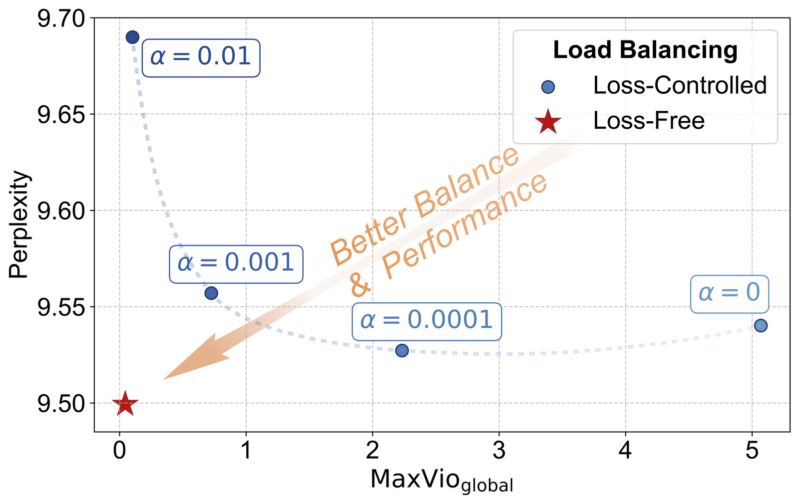
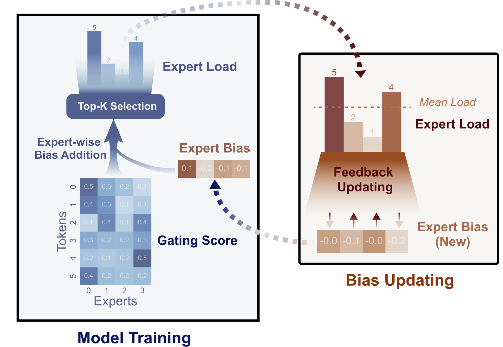
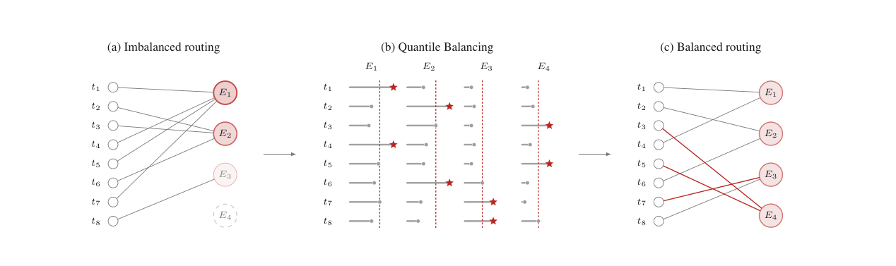

# 04 · 负载均衡：aux / aux-free / Quantile Balancing

> 本篇只讨论算法侧的问题：如何让离散的 top-k 选择不塌缩，并让各 expert 收到的 token 数接近均匀。系统侧的 expert 放置与 replica（EPLB）、per-batch reroute（LPLB）见 [系统侧负载均衡：EPLB、LPLB、UltraEP 与 MoonEP](../parallel/05_ep/04_system_load_balancing.md)——那些方法处理的是「专家选定之后算力如何摆放」，而不是「选择哪些专家」。
>
> 本篇用同一套符号对照三条主流路线：aux（GShard / Switch）、aux-free（DeepSeek Loss-Free Balancing）和 QB（苏剑林 2026；Kimi K3 将其用于生产）。每条路线先给出定义式，再说明梯度或更新落在何处，最后给出适用边界。

---

## 1. 问题定义

设训练 batch 有 $m$ 个 token、$n$ 个 routed expert，每个 token 选 $k$ 个。router 给出分数矩阵 $s \in \mathbb{R}^{m \times n}$，其中 $s_{i,j}$ 是 token $i$ 对 expert $j$ 的 score（sigmoid 或 softmax 之后）。理想的分配 $x_{i,j} \in \{0, 1\}$ 满足：

$$
\begin{aligned}
\text{s.t.} \quad & \sum_j x_{i,j} = k \\
& \sum_i x_{i,j} = q := mk/n \\
\max \quad & \sum_{i,j} x_{i,j} \, s_{i,j}
\end{aligned}
$$

第一个约束要求每个 token 恰好 $k$ 个 expert；第二个约束要求每个 expert 恰好 $q$ 个 token（假设整除）；目标是在这两个约束下尽量尊重分数。

不加约束时，token-choice 的 top-k 只保证第一个约束，第二个约束完全放开，这正是 collapse 与 EP straggler 的来源。

三条路线都是这个整数规划的**可执行近似**，区别只在于介入的位置：

| | 改什么 | 进不进主梯度 | 超参 | 因果 |
|---|---|---|---|---|
| **aux** | 往 loss 加 $\alpha \cdot n \cdot \sum_j f_j P_j$ | **进**（经 $P_j$ / `probs`） | $\alpha$（太大伤 LM，太小不平） | 是（当前 token 的 score 不看未来） |
| **aux-free** | 给每个 expert 一个 bias $b_j$，只改 top-k | **不进** | $\gamma$（步长：慢 vs 振荡） | 是（用**上一步**负载更新，下一步才生效） |
| **QB** | 同样用 $b$，但 $b$ 由分位数直接解出 | **不进** | 无（或仅 histogram 宽度） | 是（同上，禁止用本 batch 解出的 $b$ 再选一次） |
| Expert Choice（反例） | 每个 expert 选定额 token | 不进 | capacity | **否**（未来 token 决定过去的分配） |

DeepSeek 将 Expert Choice 从候选方案中排除：同一序列中靠后的 token 会改变靠前 token 的 expert 分配，这等价于泄漏后文。aux-free 论文通过减小 chunk、打乱 token 的实验验证了这一点。后文不再讨论 Expert Choice。

---

## 2. Aux loss

### 2.1 定义式

GShard（Lepikhin et al. 2020）的原始动机是最小化 $\sum_e (c_e / S)^2$（负载的平方和），但 $c_e$ 来自 top-2 选择，不可导。于是用平均门控 $m_e$ 作为可导替代，把平方换成乘积（straight-through）：

$$
\ell_{\text{aux}} = \frac{1}{E} \sum_e \frac{c_e}{S} \cdot m_e
$$

其中 $c_e / S$ 是「实际分到的比例」，是离散量、作为常数处理；$m_e$ 是「router 愿意分配的平均概率」，是连续量、参与梯度传播。Switch（Fedus et al. 2021）把它写成现在框架中的标准形式，并乘上 $E$ 使均衡点的值为 1：

$$
\begin{aligned}
L_{\text{aux}} &= \alpha \cdot E \cdot \sum_{i=1}^{E} f_i \cdot P_i \\
f_i &= \frac{1}{T \cdot k} \sum_t \text{routing\_map}[t, i] \\
P_i &= \frac{1}{T} \sum_t \text{probs}[t, i]
\end{aligned}
$$

其中 $f_i$ 是实际负载份额（$\sum_i f_i = 1$），$P_i$ 是平均概率质量。

完全均衡时 $f_i = P_i = 1/E$，于是 $\sum_i f_i P_i = 1/E$，故 $L_{\text{aux}} = \alpha$。分配越偏斜，这个点积越大。这是 Cauchy–Schwarz 不等式的直接推论：两个概率向量的内积在均匀分布时最小。

Megatron `switch_load_balancing_loss_func`（[[megatron-lm:megatron/core/transformer/moe/moe_utils.py#L56-L143]]）实现的就是这个式子，只是把归一化常数收进系数：

```python
aux_loss = (probs.sum(0) * tokens_per_expert).sum() \
         * (E * α / (k * T * T))
# tokens_per_expert = n_i = routing_map.sum(0)，detach 的计数
```

与定义式等价：$n_i = f_i \cdot T \cdot k$，而 `probs.sum(0)` 的第 $i$ 项即 $P_i \cdot T$。

梯度只流经 $P_i$：

$$
\frac{\partial L_{\text{aux}}}{\partial \text{probs}[t, i]} = \alpha \cdot E \cdot f_i / T
$$

**已经过载的 expert（$f_i$ 较大）会让对应的 `probs` 受到更大的正梯度，从而在下一步被压低。** $f_i$ 在这里作为常数权重使用，这就是 STE 的含义：用离散计数作为连续概率的系数。

### 2.2 工程实现

aux loss 是一个标量，工程中通常不会把它手动加进 `total_loss` 再做一次 backward。Megatron 使用 `MoEAuxLossAutoScaler`（[[megatron-lm:megatron/core/transformer/moe/moe_utils.py#L246]]）：forward 把 router 的某个输出原样传出，同时把 `aux_loss` 挂进 ctx；backward 时为 `aux_loss` 注入 `ones * scale`，梯度自动沿 router 的计算图回传。读代码时如果忽略这个 autoscaler，会误以为 aux loss 没有生效。

$\alpha$ 对应配置项 `moe_aux_loss_coeff`。Switch 常用 `0.01`；DeepSeekMoE 的验证实验使用 expert-level 的 `0.01`。V3 把主要的平衡工作交给 aux-free 之后，只保留了一个**极小**的 sequence-wise aux（见 §3.3）。

分布式场景下，$f_i$ 必须使用**全局**计数，$P_i$ 可以按 rank 拆分（[[megatron-lm:megatron/core/transformer/moe/moe_utils.py#L82-L95]]）。否则每个 micro-batch 各自统计，全局负载仍可能塌缩。

### 2.3 z-loss

ST-MoE 的 z-loss（[[megatron-lm:megatron/core/transformer/moe/moe_utils.py#L146]]）不直接平衡负载，而是压低 logits 的尺度，防止 softmax 饱和与 router 输出爆炸：

$$
L_z = \beta \cdot \frac{1}{T} \sum_t (\operatorname{logsumexp}_e \text{logits}[t, e])^2
$$

式中的 `logsumexp` 正是 softmax 分母的对数。z-loss 常与 aux loss 一起开启，但它属于另一类正则。sigmoid 路由对 z-loss 的需求较弱（不存在分母竞争），但仍可用来控制数值范围。

### 2.4 α 的两难



> 图：在同一套 DeepSeekMoE 骨干上扫描 $\alpha$。横轴是负载不均衡程度（MaxVio，越大越不均衡），纵轴是 validation perplexity。$\alpha$ 太小会导致塌缩、PPL 变差；$\alpha$ 太大虽然均衡了负载，PPL 也明显变差。Loss-Free（红线）同时取得更好的 PPL 与更好的均衡，打破了这条权衡曲线。（Wang et al. 2024, Fig 2；[arXiv:2408.15664](https://arxiv.org/abs/2408.15664)）

从机制上看，这种两难几乎不可避免：aux 的梯度与语言建模梯度叠加在同一套 $W_r$ 上，而均衡所要求的方向未必与「这个 token 在语义上应该去哪个专家」一致。$\alpha$ 是在「允许塌缩」与「允许干扰主目标」之间选取的一个折中点，**这样的好点不一定存在**；当专家数达到数百乃至近千时，可选的范围更窄。

DeepSeekMoE 还区分过 expert-level aux 与 device-level aux：严格的专家均衡会损害特化，因此用很小的 expert-level aux 防止塌缩，同时用更大的 device-level aux 保证 EP 的系统效率（论文 Eq. 12–17）。这实际上已经承认：aux loss 同时承担「算法特化」与「系统不空转」两个相互冲突的目标。

---

## 3. Aux-free expert bias

### 3.1 基本思路

Loss-Free Balancing（Wang et al. 2024；DeepSeek-V3 §2.1.2）不再向 loss 添加任何项，而是为每个 expert 维护一个标量 $b_j$，**只加在用于 top-k 选择的分数上**：

$$
\begin{aligned}
T_i &= \operatorname{argtop}_k(s_i + b) \\
p_{i,j} &= s_{i,j} \Big/ \sum_{r \in T_i} s_{i,r}
\end{aligned}
$$

谁被选，看的是偏置分数 $s + b$；加权时仍看原始分数 $s$（V3 / K3 都是 sigmoid）。

这正是 [`01`](./01_basics_and_components.md) 引用的 Megatron 代码片段（[[megatron-lm:megatron/core/transformer/moe/moe_utils.py#L805-L808]]）。可以把 $b$ 理解为专家的价格：负载过高的专家降价（减小 $b$），负载过低的专家提价。



> 图：左侧，token×expert 的 gating 分数加上 expert-wise bias 后再做 top-k，得到本 step 的负载；右侧，将各 expert 负载与均值比较，过载则降低 bias、欠载则提高 bias，新的 bias 只用于**下一步**。整个过程不产生干扰主目标的梯度。（Wang et al. 2024, Fig 1；[arXiv:2408.15664](https://arxiv.org/abs/2408.15664)）

### 3.2 更新规则

记 $\ell_j$ 为本 step（全局 batch）expert $j$ 收到的 token 数，$\bar{\ell} = (\sum_j \ell_j)/n = q$。固定步长：

$$
b_j \leftarrow b_j + \gamma \cdot \mathrm{sign}(\bar{\ell} - \ell_j)
$$

当 expert 过载（$\ell_j > \bar{\ell}$）时，$\mathrm{sign}$ 为负，$b$ 下降，下一步更难进入 top-k。Megatron 的 `get_updated_expert_bias`（[[megatron-lm:megatron/core/transformer/moe/moe_utils.py#L1079-L1108]]）先对 `tokens_per_expert` 做一次跨 TP、CP、DP 的 all-reduce，然后执行：

```python
average_tokens = tokens_per_expert.sum(-1, keepdim=True) / n
offset = average_tokens - tokens_per_expert          # = ℓ̄ − ℓ
updated = expert_bias + sign(offset) * update_rate
```

$b$ 是一个 `float32` buffer（[[megatron-lm:megatron/core/transformer/moe/router.py#L173-L194]]），**不是 nn.Parameter**，因此不归 optimizer 管理。

论文比较了几种变体，结论是：

- $\gamma = 10^{-3}$ 较为稳定；$10^{-4}$ 早期收敛太慢，$10^{-2}$ 后期出现振荡（Fig 4）；
- 用 $\gamma \cdot (\bar{\ell} - \ell)$ 代替 $\gamma \cdot \mathrm{sign}(\cdot)$ 时均衡略好，但 PPL 没有改善，因此保留了 sign 形式；
- 乘性 bias（$s \cdot b$）略差于加性 bias。

aux-free 论文推荐 $\gamma = 10^{-3}$。V3 将其作为 bias update speed 超参，在整段预训练中持续动态更新 $b$；**推理阶段冻结 $b$**，恢复为普通的 top-k。

### 3.3 保留极小的 sequence-wise aux

V3 的主要平衡机制是 batch 级 aux-free，但仍加入了互补的 sequence-wise aux（Eq. 17–20），$\alpha$ 取得极小：

$$
L_{\text{Bal}} = \alpha \sum_i f_i P_i
$$

其中 $f_i$ 与 $P_i$ 按「单条序列」统计，且 $P_i$ 使用在全专家上归一化后的分数 $s'$。

动机在于：aux-free 统计的是**整个 step 的大 batch**，单条序列内部仍可能出现极端不均衡。极小的序列级 aux 可以抑制这种尖峰，同时不至于强迫专家在「每个 domain、每条样本」的粒度上都均匀分配。

V3 的消融（Table 5）与相关讨论（§4 附近）给出以下结论：

- 从纯 aux 换成 aux-free 后，多数下游任务更好；
- 真正拉开质量差距的往往是 **batch 级均衡与 sequence 级均衡的区别**：后者强迫每条序列、每个 domain 都均分，专家更难特化。论文绘制了 Pile 不同 domain 上的 expert load 分布，aux-free 的特化模式更清晰（Fig 9）；
- 把 aux 改为 **batch-wise aux**（不再按序列统计）之后，1B/3B 规模上的 validation loss 可以与 aux-free 持平。因此「免 loss」本身并不是关键，把均衡的统计范围改为 batch 才是质量改善的来源之一。aux-free 的额外优点在于：达到同样的 batch 级均衡时，它不会向 $W_r$ 注入干扰梯度，并且与 EP 的「计算 batch = micro × EP-DP」天然一致——计算 batch 越大，MaxVio 越接近全局值（论文 Fig 5）。

### 3.4 固定步长在近千专家规模下失效

$\gamma$ 是有量纲的：它与 $s$ 的数值范围、专家数、batch 统计噪声耦合在一起。苏剑林对此有以下评论（kexue.fm/archives/11619）：

- 推荐的 $\gamma = 10^{-3}$ 与 **sigmoid** 的分数范围耦合，更换 score function 时需要重新调节；
- 当某些层（尤其是早期层）的 $s$ 分布畸变时，同一个 $\gamma$ 要么推不动负载，要么在后期使 $b$ 振荡；
- 这正是「first-k-dense」长期存在的原因之一。

Kimi K3 把 routed expert 增加到 896 之后，原文写道：*balancing … exceeds the regime in which existing auxiliary-loss-free bias updates remain well behaved*。这正是 QB 的出发点：不再猜测步长，而是直接求解「什么样的 $b$ 会使负载恰好等于 $q$」。

---

## 4. Quantile Balancing

### 4.1 从整数规划到分位数

回到 §1 的分配问题。苏剑林把它松弛为 $x_{i,j} \in [0,1]$ 的线性规划，引入 token 侧乘子 $\alpha_i$ 与 expert 侧乘子 $\beta_j$；交换 min 与 max 之后可以证明，无结（无平局）时最优解仍是 0-1 的：

$$
x_{i,j}^* = 1 \iff s_{i,j} - \alpha_i - \beta_j > 0
$$

也就是说：对每个 token，选择 $s_i - \beta$ 的 top-k（$\alpha_i$ 恰好是第 $k+1$ 大的门槛）；对每个 expert，门槛 $\beta_j$ 使恰好 $q$ 个 token 越过门槛。两者交替求解：

$$
\begin{aligned}
\alpha_i &\leftarrow \operatorname{quantile}_{1-k/n}(s_i - \beta) && \text{(over experts, the } (k{+}1)\text{-th largest)} \\
\beta_j &\leftarrow \operatorname{quantile}_{1-k/n}(s_{:,j} - \alpha) && \text{(over tokens, the } (q{+}1)\text{-th largest)}
\end{aligned}
$$

由于 $q/m = k/n$，两次取的都是同一个分位 $1 - k/n$，方法因此得名 **Quantile Balancing**。推理时只需要 $\beta$（或写成 $b = -\beta$），即 $\operatorname{argtop}_k(s - \beta)$；$\alpha$ 是 batch 内部的中间量，不作为持久状态保存。

QB 与 aux-free 属于同一族方法（都是 loss-free 的 bias），但 $b$ 不再按 $\pm\gamma$ 步进，而是直接取**当前分数分布下使负载等于 $q$ 的那个对偶变量**。BASE Layers / BIP 也曾把均衡表述为规划问题；BIP 使用不等式约束并将乘子 clip 到非负，容易无法挽救欠载的专家。QB 去掉了非负约束，允许 $\beta$ 取负值，从而可以把死亡专家重新激活。

相关实现：Marin / OLMoE-M 复现了论文所述的交替分位算法；Megatron 上游 PR `#5349` 增加了 `--moe-router-load-balancing-type quantile_balancing`（本仓库 pin 的 `e03878b5f` 尚未包含该 API，请勿在 pin 的代码中查找）。

### 4.2 Kimi K3 的单次前向形式

完整的交替求解需要在每个 step 对数百万个 margin 迭代，训练成本太高，也更容易过拟合当前 batch。K3 采用了**一次前向即可读出门槛**的因果版本（§2.3.3, Eq. 13–14）：

1. 用**旧** bias 计算 $\operatorname{Top}\text{-}(k+1)(s_i + b^{(t)})$。前 $k$ 个用于真正的路由，第 $k+1$ 个就是 token $i$ 的门槛 $\alpha_i^{(t)}$——任何 expert 想进入这个 token 的 top-k，其偏置分数必须超过它。这样就无需单独计算 token 侧的分位数。
2. 对每个 expert $j$，考察原始分数相对这些门槛的 **margin**：

$$
\text{margin}_{i,j} = s_{i,j} - \alpha_i^{(t)}
$$

   在门槛固定时，候选 $\hat{b}_j$ 使 expert $j$ 获得的 token 数为 $\sum_i \mathbf{1}[s_{i,j} + \hat{b}_j > \alpha_i]$，它关于 $-\hat{b}_j$ 单调。无结时，要恰好取到 $q$ 个 token，$-\hat{b}_j$ 必须等于 margin 的第 $q+1$ 大值，也就是 $(1 - k/n)$ 分位数：

$$
\begin{aligned}
\hat{b}_j^{(t+1)} &= -\operatorname{quantile}_{1-k/n}\bigl(s_{:,j} - \alpha^{(t)}\bigr) \\
b^{(t+1)} &= \hat{b}^{(t+1)} - \operatorname{mean}\bigl(\hat{b}^{(t+1)}\bigr)
\end{aligned}
$$

   其中第二行减去公共偏移，不改变 top-k。

3. **本 batch 仍使用 $b^{(t)}$ 路由**，新的 bias 只在下一步生效（与 aux-free 受同一条因果约束）。推理时冻结 $b$。

注意 $s - \alpha$ 使用的是**原始分数减去偏置后的门槛**，旧的 $b$ 只通过 $\alpha$ 进入更新，不会在更新中被重复计入。



> 图：$m=8, n=4, k=1$，目标 $q=2$。(a) 普通 top-1 得到的负载为 (4,3,1,0)，存在过热与死亡专家；(b) 每列是 $s_{i,j} + b_j - \alpha_i$ 的 margin，红虚线位于第 $q+1$ 大处，恰好留下 $q$ 个为正的 margin；(c) 按新门槛重选后负载为 (2,2,2,2)，红边是被 QB 修改的分配边。（Kimi Team 2026, Fig 5；[arXiv:2607.24653](https://arxiv.org/abs/2607.24653)）

### 4.3 一个数值示例

$k=1$ 时 top-2 的第二名就是 $\alpha_i$。假设某 expert 对 8 个 token 的 margin 从大到小是

```
(+0.40, +0.25, +0.10, +0.02, −0.05, −0.20, −0.30, −0.50)
```

取 $q=2$，第 $q+1=3$ 大的值是 `+0.10`，于是 $\hat{b} = -0.10$。加上这个 bias 之后（门槛不变），只有前 2 个 margin 仍大于 0，恰好达到目标负载。aux-free 的 $\pm\gamma$ 步进可能需要很多 step 才能收敛到同一个 $b$，中途还会越过目标。

### 4.4 histogram 估计分位数

全局 batch 的 margin 数以百万计，且分散在各个 rank 与各个 accumulation step 上，无法 gather 起来做精确分位数计算。K3 的做法是（§2.3.3 Histogram；附录 D）：

```
每个 rank：按 expert 把 margin 丢进几百个 bin
一次 all-reduce：把 bin count 加总
从累积直方图里读 (1 − k/n) 分位  →  误差不超过一个 bin 宽
```

通信量是 $O(n \cdot n_{\text{bins}})$ 个整数，与 token 数无关。由于计数可以相加，无论 token 按 DP/CP/EP 如何切分，估计的都是**整 batch 的分位数**。这是 QB 能够在 2.8T 规模训练中落地的关键工程环节。

### 4.5 与 aux-free 的对偶视角

苏剑林还指出：固定 $\alpha$ 之后，关于 $\beta$ 的目标是可微的，对它做一步 SignSGD 就是

$$
\beta_j \leftarrow \beta_j - \gamma \cdot \mathrm{sign}( q - \#\{i : s_{i,j} - \alpha_i - \beta_j > 0\} )
$$

这与 aux-free 的更新式 $b \leftarrow b + \gamma \cdot \mathrm{sign}(\bar{\ell} - \ell)$ **同构**——aux-free 是在 QB 的对偶目标上做固定步长下降，QB 则是在同一目标上按分位数直接走到该维的最优点。因此：

- 当负载已接近均匀时，margin 的分位数靠近 0，QB 给出的 $\Delta b$ **自动变小**，无需为 $\gamma$ 设计 schedule；
- 当 score 的尺度变化（sigmoid 换成 softmax，或某一层分布畸变）时，分位数会随之自适应，无需重新调节 $\gamma$；
- 当有 896 个专家时，固定的 $\gamma$ 很难同时照顾「仍未激活」与「已经均衡」的列，而分位数是逐列自适应的。

K3 将最终的 bias 冻结在推理计算图中，serving 阶段仍是普通的 top-k，没有任何分位数计算开销。

---

## 5. 三条路线对照

### 5.1 信号作用位置

```
                    ┌─ probs（连续）──► combine 加权
logits → scores ────┤
                    └─ scores + b ──► top-k ──► routing_map（离散）──► 负载 ℓ
                                      ▲                    │
                                      │                    ▼
                                      └──── b 的更新 ◄─── ℓ vs q
```

| 方法 | 谁去推 $W_r$ | 谁去推 $b$ | $b$ 进 `probs`？ |
|---|---|---|---|
| aux | 主 loss + $\alpha \cdot E \cdot f \odot P$ | 无 $b$ | —— |
| aux-free | 只有主 loss | $\gamma \cdot \mathrm{sign}(q - \ell)$ | 否 |
| QB | 只有主 loss | $-\operatorname{quantile}_{1-k/n}(s - \alpha)$ | 否 |
| aux + aux-free（V3） | 主 loss + 极小序列 aux | $\gamma \cdot \mathrm{sign}$ | 否 |

### 5.2 超参与失败模式

| | 要调的 | 典型失败 | 已被谁推到多大规模 |
|---|---|---|---|
| aux | $\alpha$；是否 sequence / batch / device 级 | $\alpha$ 大 → 干扰 LM、专家不敢特化；$\alpha$ 小 → 塌 | GShard / Switch / Mixtral；细粒度时代逐渐退居二线 |
| aux-free | $\gamma$；何时冻结 | $\gamma$ 小早期不平，大后期振；近千专家、畸变层 | DeepSeek-V3 671B / 14.8T |
| QB | 几乎无；histogram bin 宽 | 本 batch 若先更新再选 → 泄漏；精确分位在分布式上不可行（必须直方图） | Kimi K3 2.78T / 896 experts；Marin 32B-A5B / 1e22 FLOP 复现 |

### 5.3 与系统侧的分工

| 层级 | 做什么 | 不做什么 |
|---|---|---|
| 本篇三条 | 决定 **哪些 (token, expert) 边存在**，尽量让 $\ell \approx q$ | 不移动 expert 的物理位置 |
| EPLB | 静态复制热点 expert、LPT packing | 不改 router 分数 |
| LPLB | 本 batch 把过载边改写到 replica | 假定 replica 已在 |

算法层把 `MaxVio` 压低之后，EP 的 step time 才由算力而非最慢的 expert 决定。K3 所报告的 perfectly balanced EP 以 QB 为前提；V3 的 redundant expert 部署（推理阶段每 10 分钟调整一次副本）则是在算法层冻结之后由系统层继续兜底。两个层面都需要，不应把 EPLB 理解为「另一种 aux」。

---

## 6. 实践选择

以下是一条可供参考的决策顺序：

1. **小模型、少量专家（≤32）、以可复现为首要目标** —— Switch aux + 可选 z-loss。实现简单，也是 Megatron 的默认路径。
2. **细粒度、数百个专家、需要专家特化** —— aux-free，$\gamma \approx 10^{-3}$，统计范围取**全局 batch**；必要时保留极小的 sequence-wise aux 以抑制单条序列的尖峰（V3 的配方）。不要把大 $\alpha$ 的序列级 aux 作为主要平衡手段。
3. **专家数达到约 10³、或 $\gamma$ 无论如何扫描都不稳定** —— QB。用 Top-$(k+1)$ 读取 $\alpha$，用 histogram all-reduce 估计分位数，新 bias **下一步再生效**，推理时冻结。
4. **任何时候都不要**用 Expert Choice 作为因果语言模型的主路由，除非能证明分配不依赖未来 token。

三条路线可以在代码中共存：例如以 QB 为主、关闭 aux（Megatron PR 的用法是 `--moe-aux-loss-coeff 0`），或 aux-free 加极小 aux。但不要同时开启「大 $\alpha$ 的 aux」和 QB：前者会把 $s$ 推向 aux 所要求的形状，QB 再依据被扭曲的 $s$ 定价，两种信号会相互冲突。

从数学上看，三条路线是层层递进的：aux 用 STE 近似「均匀」这一目标；aux-free 把目标从 loss 中取出，转化为对偶变量上的次梯度步进；QB 则把同一步写成当前 batch 上的分位数闭式解。Kimi K3 在 Stable LatentMoE 的 896 个专家上完成了这第三步。

---

到这里，算法侧的三条平衡路线就讲完了。从下一篇开始进入算子与 kernel 专题：[05 · Grouped GEMM 与 Expert 计算](./05_grouped_gemm.md) 会讲 dispatch 输出的「按 expert 连续」buffer 是怎样交给 DeepGEMM 的 m-grouped GEMM 的。如果想回看这些 `routing_map` 在通信层面怎样变成 all-to-all 的 splits，以及 EPLB/LPLB 怎样在算法层已经尽量均匀之后补上系统层的洞，可以回到 [Expert Parallelism (EP)](../parallel/05_ep/README.md) 一章；若还要继续模型侧的话题，可从 [前沿开源模型架构速览](../frontier_open_models.md) 进入其它专题。
