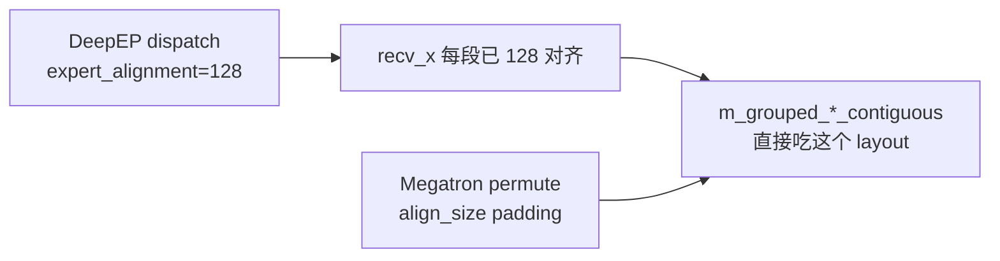
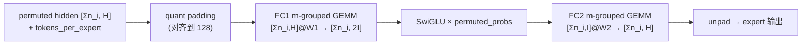
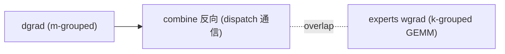

# 05 · Grouped GEMM 与 Expert 计算

> 前面四篇讨论了 MoE 的架构与算法，从本篇开始转向算子与 kernel 视角。本篇的前置是 [Expert Parallelism (EP)](../parallel/05_ep/README.md) 的全流程：dispatch 已经把 token 搬运到 expert 所在的 rank，并排成「按 local expert 连续」的 buffer。本篇讨论接下来的第三段：如何用一个 kernel 高效地完成本 rank 上所有 local expert 的 `fc1 → act → fc2` 计算，以及它的反向（dgrad / wgrad）。正文中的 `01`/`02` 等篇号均指 EP 章的对应篇。
>
> 本篇的核心矛盾是：**每个 expert 的权重 shape 相同（$[H, I]$ / $[I, H]$），但 token 数 $n_i$ 各不相同且只有运行时才知道**。逐 expert 单独发起 GEMM 会导致 kernel launch 过多、小 GEMM 无法充分利用算力；padding 到统一大小又会浪费算力。grouped GEMM 正是为解决这一矛盾而设计的。
>
> 代码锚点：Megatron `experts.py`（`TEGroupedMLP` / `GroupedMLP`）、DeepGEMM `m_grouped_*` / `k_grouped_*`。

---

## 1. 只沿 M 轴分组

DeepGEMM 的 README 把这一设计点写得很明确（[[deepgemm:README.md#L80]]）：

> Unlike traditional grouped GEMMs in CUTLASS, DeepGEMM groups only the M-axis, while N and K must remain fixed. This design is tailored for scenarios where experts in an MoE model share the same shape.

也就是说，MoE 的 expert GEMM 形如：

```
fc1:  Y_i = X_i @ W1^T        X_i: [n_i, H]   W1: [I, H]   Y_i: [n_i, I]
                              （各 expert 的 n_i 不同，但 H, I 固定）
```

把所有 expert 的 $X_i$ 沿 $M$（token）维拼接起来，得到一个大矩阵 $X: [\sum_i n_i, H]$，权重为 $W: [E_{\text{local}}, I, H]$。grouped GEMM 用**一个 tile scheduler 扫过整个 $M$ 维**，每个 M-tile 根据它落在哪个 group（即哪个 expert）选取对应的 $W_i$。$N$、$K$ 固定保证了 tile 形状一致，scheduler 也因此简单。

```
        M 维（拼接所有 expert 的 token）
   ┌────────────┬──────┬─────────────┬────┐
X  │ expert0    │ exp1 │  expert2    │... │   每段 [n_i, H]
   └────────────┴──────┴─────────────┴────┘
        │ tile      │       │
        ▼           ▼       ▼
   用 W_0 算    用 W_0 算  用 W_1 算 ...   ← scheduler 按 m_indices 决定取哪个 W
```

与传统做法对比：

- **CUTLASS grouped GEMM**：每个 group 可以有任意的 $(M, N, K)$，scheduler 复杂、元数据较多。
- **DeepGEMM m-grouped**：只有 $M$ 维变化，$N/K$ 固定，因此可以用一个 persistent kernel 跨 group 连续调度，几乎没有额外开销，并且能够利用 Hopper 的 TMA 与 warp specialization。

---

## 2. 两种 layout：contiguous 与 masked

DeepGEMM 为 MoE 提供了两套 API，分别对应两种部署场景。

### 2.1 Contiguous layout

API：`m_grouped_fp8_gemm_nt_contiguous` / `m_grouped_bf16_gemm_nt_contiguous`（[[deepgemm:deep_gemm/__init__.py#L47,L55]]）。

这种 layout 把所有 expert 的 token **真正拼接**成一个 $[M_{\text{total}}, K]$ 张量，并配一个 `m_indices: [M_total]`，标记第 $m$ 行属于哪个 group（expert）。kernel 按 `m_indices` 为每个 tile 选择权重。它对应训练 forward 与推理 prefill 场景。

```
A (tokens) : [M_total, K]      FP8 e4m3 或 BF16
B (weights): [num_groups, N, K]
m_indices  : [M_total]  int    每行的 group id，如 [0,0,0, 1,1, 2,2,2,2, ...]
D (output) : [M_total, N]      BF16
```

这里有一个关键的对齐约束：每个 expert 段在 $M$ 维上必须对齐到 `get_mk_alignment_for_contiguous_layout()`（[[deepgemm:deep_gemm/utils/layout.py#L20]]，Hopper 上通常为 128）。原因是 tile scheduler 假设每个 group 的起点落在 tile 边界上，否则一个 tile 会跨越两个 expert 并取错权重。

这与 `02` 所讲的 dispatch `expert_alignment` 以及 Megatron 的 padding 正好衔接：



`generate_m_grouped_contiguous`（[[deepgemm:tests/generators.py#L294-L299]]）中的 `actual_ms = [expected_m_per_group * uniform(0.7,1.3)]` 模拟的正是「各 expert token 数不等」的真实情况。

### 2.2 Masked layout

API：`m_grouped_fp8_gemm_nt_masked`（[[deepgemm:deep_gemm/__init__.py#L49]]）。

decode 阶段，每个 expert 实际收到多少 token 在 kernel launch 时 CPU 并不知道（要兼容 CUDA graph，就不能做 D2H sync）。masked layout 采用**固定的最大槽位加 mask** 的方式：

```
A : [num_groups, max_m, K]     每个 expert 预留 max_m 个槽，多数空着
B : [num_groups, N, K]
masked_m : [num_groups] int     每个 expert 实际有效的 token 数（GPU 上）
D : [num_groups, max_m, N]
```

kernel 只计算每个 group 的前 `masked_m[i]` 行，其余跳过（[[deepgemm:tests/test_fp8_fp4.py#L145-L156]]）。由于 `masked_m` 保存在 GPU 上，**整个 launch 过程 CPU 无需知道 token 数**，因此完全兼容 CUDA graph。

这套 layout 的输入正是 **DeepEP low-latency dispatch 的输出**（[[deepgemm:README.md#L88]]，[[deepep:deep_ep/buffers/legacy.py#L589-L599]]）：

```
DeepEP low_latency_dispatch →
  packed_recv_x : [num_local_experts, max_dispatch_tokens*num_ranks, hidden]   ← 就是 [groups, max_m, K]
  recv_count    : [num_local_experts]                                          ← 就是 masked_m
→ 直接喂给 m_grouped_fp8_gemm_nt_masked
```

| | contiguous | masked |
|---|---|---|
| 场景 | 训练 fwd / prefill | decode |
| token 数已知性 | CPU 已知（dispatch 后 sync） | CPU 未知（GPU 上 masked_m） |
| 内存 | 紧凑（$\sum_i n_i$） | 浪费（$\text{groups} \times \text{max\_m}$） |
| CUDA graph | 否（除非静态） | 是 |
| 配套 DeepEP | normal dispatch | low-latency dispatch |

---

## 3. FP8 grouped GEMM 的数据布局

DeepGEMM 的 FP8 采用 **per-block (1×128) scaling**，而不是 per-tensor scaling。输入是一个 `(x, x_scales)` tuple：

```
x        : [M, K]        float8_e4m3fn
x_scales : [M, K//128]   float（或 UE8M0 packed）   每 128 个 channel 一个 scale
```

几个实现细节：

- **scale 的 layout 是 mn-major 且 TMA 对齐的**（[[deepep:deep_ep/buffers/legacy.py#L596]] "the last-two-dimension of the scaling tensors are in column-major for TMA compatibility"）。DeepGEMM 提供 `transform_sf_into_required_layout` / `get_mn_major_tma_aligned_*`（[[deepgemm:deep_gemm/__init__.py#L73]]、[[deepgemm:deep_gemm/utils/layout.py]]）完成这一转换。
- **UE8M0**：scale 本身用 8-bit 指数格式打包（`use_ue8m0`，[[deepep:deep_ep/buffers/legacy.py#L582]]），进一步节省 scale 的存储与带宽，这是 DeepSeek-V3.x 采用的配置。
- **端到端不做解量化**：dispatch 输出 FP8，grouped GEMM 直接消费 FP8，最终输出 BF16。中间不还原成 BF16，节省了显存与带宽。

---

## 4. Megatron 的调用：TEGroupedMLP

Megatron 一侧的入口是 `TEGroupedMLP.forward`（[[megatron-lm:megatron/core/transformer/moe/experts.py#L630]]），dispatcher 向它传入三个量：

```python
def forward(self, permuted_local_hidden_states, tokens_per_expert, permuted_probs):
    #   permuted_local_hidden_states: [Σn_i, H]   按 expert 连续（来自 02 的 dispatch）
    #   tokens_per_expert:            [E_local]    每个 expert 的 n_i（CPU list）
    #   permuted_probs:               [Σn_i]       每个 token 的 router 权重
```

forward 内部（`_fused_forward`, [[megatron-lm:megatron/core/transformer/moe/experts.py#L551-L619]]）：

1. **quantization padding**（[[megatron-lm:megatron/core/transformer/moe/experts.py#L572-L584]]）：使用 FP8/FP4 时把每个 expert 段 pad 到对齐长度（`quantization_padding`），并同步更新 `tokens_per_expert`。在 dropless 路径中，这一步对应 `02` 提到的 `align_size` padding。
2. **fused ops**（[[megatron-lm:megatron/core/transformer/moe/experts.py#L608-L613]]）：一个 TE operation fuser 把 `fc1 → scaled SwiGLU → fc2` 串起来：
   ```
   ops(hidden,          tokens_per_expert,   # FC1: m-grouped GEMM
       permuted_probs,                       # SwiGLU 里顺带乘 router 权重
       tokens_per_expert)                    # FC2: m-grouped GEMM
   ```
   需要注意的是，**router 权重 `permuted_probs` 在 SwiGLU 处就已经乘入**（"Scaled SwiGLU", [[megatron-lm:megatron/core/transformer/moe/experts.py#L611]]），而不是等到 combine 阶段。这样 combine 只需要做纯加法的 reduce（见 EP `03`）。
3. **unpadding**（[[megatron-lm:megatron/core/transformer/moe/experts.py#L614-L616]]）：去掉刚才 pad 的行。

`tokens_per_expert` 通过 `.tolist()`（`experts.py:573, 658`）转到 CPU，这是又一个 D2H 同步点，但数据量很小。非 TE 的 `GroupedMLP` 路径流程相同，只是 grouped GEMM 换成后端自己的实现（如 DeepGEMM 或 cuBLAS 的 batched/grouped）。



---

## 5. Expert 的反向：dgrad 与 wgrad

一个 grouped linear $Y = X W^{\top}$ 的反向包含两个梯度，**它们分别使用不同的 grouped 模式**，这是本篇最需要记住的一点。

```
forward:   Y_i = X_i @ W_i^T            X_i:[n_i,K]  W_i:[N,K]  Y_i:[n_i,N]

dgrad:     dX_i = dY_i @ W_i            → 还是「M 维(n_i)变、N/K 固定」 = m-grouped
wgrad:     dW_i = dY_i^T @ X_i          → 「K 维(n_i)变、M(N) N(K) 固定」 = k-grouped
```

### 5.1 dgrad：m-grouped

$dX = dY W$ 沿 token 维分组，每段乘以对应的 $W_i$，与 forward 同构，使用 `m_grouped_*_contiguous`（只是 A 换成 `dY`、B 换成不转置的 `W`）。layout 与对齐要求与 forward 一致。

### 5.2 wgrad：k-grouped GEMM

$dW_i = dY_i^{\top} X_i$：每个 expert 的权重梯度，是该 expert 收到的 $n_i$ 个 token 在**收缩维（$K$ 维，即 token 维）**上的求和。这里变化的是 $K$（每个 group 的 token 数），$M$ 和 $N$ 固定（分别为 out_dim 与 in_dim），因此需要使用 **k-grouped** API：

```python
k_grouped_fp8_gemm_tn_contiguous(...)   # deepgemm/__init__.py:50
```

DeepGEMM README（`:82`）："a K-axis-grouped API for MoE weight backward (with M and N must remain fixed)"。k-grouped 还有专门的 scale 打包 `get_k_grouped_mn_major_tma_aligned_packed_ue8m0_tensor`（[[deepgemm:deep_gemm/__init__.py#L157]]）。

> 直观地说：dgrad 与 forward 一样，是「不同 token 走不同 expert 权重」，因此按 token 维（$M$）分组；wgrad 是「把每个 expert 自己收到的 token 累加成一个权重梯度」，因此按收缩维（$K$）分 expert。**同一个 MoE 层，forward 使用 m-grouped，wgrad 使用 k-grouped**。

### 5.3 wgrad 的延迟执行

Megatron 把 expert 的 wgrad 单独拆分为 `backward_dw`（[[megatron-lm:megatron/core/transformer/moe/moe_layer.py#L705-L725]]，`experts.backward_dw()`）。原因是 wgrad 不在反向传播的关键路径上（需要尽快算出并传给上游的是 dgrad），因此可以**延迟到 combine/dispatch 的反向通信期间再计算**，把 wgrad 的计算与 EP all-to-all 的通信重叠起来。这是 MoE 反向加速的标准手法（`config.overlap_dispatch_backward_with_experts_wgrad`，[[megatron-lm:megatron/core/transformer/moe/experts.py#L398]]）。



---

## 6. token 数为 0 与不均衡的处理

- 某 expert $n_i = 0$：masked 模式直接跳过（`masked_m[i]=0`，[[deepgemm:tests/test_fp8_fp4.py#L150]]）；contiguous 模式该段长度为 0。
- 极度不均衡：contiguous 的对齐 padding 会放大浪费（一个只有 3 个 token 的 expert 也要 pad 到 128）。drop-and-pad / capacity（`01` 第 3 节）或 expert_bias 负载均衡（`01` 第 1.2 节）从源头缓解。
- DeepGEMM 的注释提醒（[[deepgemm:tests/test_fp8_fp4.py#L115]]）：masked 模式下，当实际 `m` 远超 `expected_m_per_group` 时效率会下降，因此 `expected_m_per_group` 需要估计准确。

---

## 7. forward 与 backward 小结

| | forward | dgrad | wgrad |
|---|---|---|---|
| 公式 | $Y_i = X_i W_i^{\top}$ | $dX_i = dY_i W_i$ | $dW_i = dY_i^{\top} X_i$ |
| grouped 模式 | m-grouped | m-grouped | **k-grouped** |
| DeepGEMM API | `m_grouped_*_contiguous`(训练) / `_masked`(decode) | `m_grouped_*_contiguous` | `k_grouped_*_contiguous` |
| 数据 | dispatch 后的 `recv_x` | combine 反向前的 `dY` | `dY` 与 forward 存的 `X` |
| 调度时机 | 关键路径 | 关键路径 | 可延迟，与 EP 通信 overlap |

---

下一篇：[06 · DeepEP：V1 (legacy/NVSHMEM) 与 V2 (elastic/NCCL Gin)](./06_deepep.md)。combine 如何把 expert 输出加权送回原 token、为什么「dispatch 的反向就是 combine」，见 EP 章 [03 · Combine 与 forward / backward 对称性](../parallel/05_ep/03_combine_and_backward.md)。
