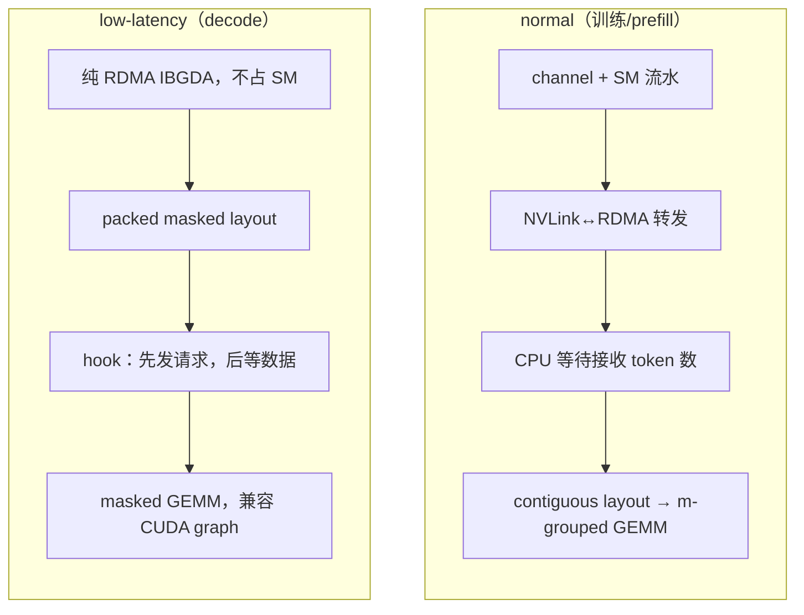
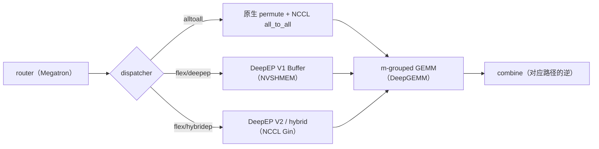

# 06 · DeepEP：V1 (legacy/NVSHMEM) 与 V2 (elastic/NCCL Gin)

上一篇讲完了 grouped GEMM 怎么处理 dispatch 送来的 token。这一篇往回补一块：dispatch/combine 本身——那次把 token 从一个 rank 搬到另一个 rank 的 all-to-all——具体是怎么在 GPU 上跑起来的。[EP 一章的 dispatch 篇](../parallel/05_ep/02_dispatch.md)已经介绍过 dispatch 要达成的目标 layout，以及 Megatron 原生路径和 DeepEP fused dispatch 这两条主线在 API 层面的样子；这里要做的是把 DeepEP 这个通信库的实现彻底打开，看看 channel、prefix matrix、IBGDA 这些概念具体指什么，以及本仓库所引版本（`v1.2.1+`，`__version__ = '2.0.0'`）里并存的 V1（legacy/NVSHMEM）和 V2（elastic/NCCL Gin）两套实现差在哪。

这个版本的 DeepEP 正好处在 V1 迈向 V2 的交界点：[[deepep:deep_ep/__init__.py#L88-L89]] 同时导出了 `Buffer`（V1）和 `ElasticBuffer`（V2），而 Megatron 目前用的还是 V1 的 `Buffer`（[[megatron-lm:megatron/core/transformer/moe/fused_a2a.py#L11]]）。下面先讲 V1 的机制，因为它更经典、也是当前的生产路径；讲完再看 V2 相对它做了哪些改动。

代码地图，方便对照：

```
DeepEP/
├── deep_ep/
│   ├── __init__.py                # export Buffer (V1) 和 ElasticBuffer (V2)
│   ├── buffers/
│   │   ├── legacy.py   (713 行)   # V1 Buffer：NVSHMEM 后端的 Python 封装
│   │   └── elastic.py  (928 行)   # V2 ElasticBuffer：NCCL Gin 后端
│   └── include/deep_ep/impls/     # V2 设备端 header-only kernel（JIT 编译）
│       ├── dispatch.cuh  combine.cuh
│       ├── hybrid_dispatch.cuh  hybrid_combine.cuh
│       ├── dispatch_deterministic_prologue.cuh
│       ├── combine_reduce_epilogue.cuh
│       └── engram_fetch.cuh  pp_send_recv.cuh ...
├── csrc/
│   ├── kernels/
│   │   ├── legacy/                # V1 kernels（预编译）
│   │   │   ├── intranode.cu  internode.cu  internode_ll.cu
│   │   │   └── layout.cu  ibgda_device.cuh  buffer.cuh
│   │   └── elastic/               # V2 kernels（JIT）
│   │       ├── dispatch.hpp  combine.hpp  engram.hpp  barrier.hpp
│   │   └── backend/
│   │       ├── nvshmem.cu         # V1 后端
│   │       └── nccl.cu            # V2 NCCL Gin 后端
│   ├── jit/                       # V2 的 JIT 编译框架（类似 DeepGEMM）
│   └── indexing/main.cu           # V2 索引/layout 计算
```

---

## 1. 两种工作模式：normal 和 low-latency

无论 V1 还是 V2，DeepEP 都区分两种工作模式，分别对应训练/prefill 和推理 decode 这两类完全不同的需求。

### 1.1 Normal 模式：面向吞吐

这是 EP 一章 dispatch 一篇里一直在用的模式，对应 `dispatch`/`combine` 这两个 API（[[deepep:deep_ep/buffers/legacy.py#L322]] / `:408`）。它的设计目标很直接，就是把 NVLink/RDMA 的带宽打满：

- 用 **channel** 把 token 流切块并行搬运，一对 SM 跑一个 channel，`Buffer.num_sms`（默认 20）就是分给这套机制的 SM 预算。
- 接收端到底会收到多少 token 是运行时才知道的，所以有一次隐式的 CPU 等待（下面第 2 节会展开），这也意味着 normal 模式默认不兼容 CUDA graph，除非显式传 `num_worst_tokens`。
- 支持 FP8 dispatch 配 BF16 combine，跨机时还会走 NVLink 与 RDMA 的两级转发。

### 1.2 Low-latency 模式：面向延迟

对应 `low_latency_dispatch` / `low_latency_combine`（[[deepep:deep_ep/buffers/legacy.py#L553]] / `:624`）。decode 阶段每个 rank 一次只有一两百个 token，吞吐早已不是问题，真正要命的是延迟，所以这套路径的实现思路完全不同：

- 纯粹依赖 **IBGDA**（GPU 直接发起 RDMA，不经 CPU 或 proxy，见 §2.4），绕开 normal 模式那一整套 channel 流水线。
- 输出是固定形状的 packed masked layout（[[deepep:deep_ep/buffers/legacy.py#L589-L599]]）：

  ```
  packed_recv_x : [num_local_experts, num_max_dispatch_tokens_per_rank * num_ranks, hidden]
  recv_count    : [num_local_experts]        # 每个 expert 实际收到的数量，即上一篇的 masked_m
  ```

  因为槽位是固定最大值、不需要同步 token 数，这套输出天然兼容 CUDA graph，可以直接喂给上一篇讲的 `m_grouped_*_masked`。
- 更进一步，dispatch 支持 **hook-based** 接收（`return_recv_hook=True`，[[deepep:deep_ep/buffers/legacy.py#L584]]）：调用后立刻返回，只发起 RDMA 请求而不等数据真正到达，先返回一个 `hook`，等真正需要用数据时再调用 `hook()` 去等。这样 RDMA 请求在后台跑，完全不占用 SM，配合 attention/dispatch/MoE/combine 之间的双批次编排就能把通信彻底藏起来：

  

  > 图：low-latency 模式下，dispatch 只发起请求不等待，计算和下一批的通信因此可以重叠。（DeepEP 项目文档）
- FP8 dispatch 支持 `round_scale` / `use_ue8m0`（[[deepep:deep_ep/buffers/legacy.py#L557]]），scale 按列主序排布以对齐 TMA。
- low-latency 模式只维护两个 buffer，同一时刻最多持有 2 个 LL kernel 的结果（[[deepep:deep_ep/buffers/legacy.py#L564]]）。

两种模式的对比可以归纳成一张图：



切换 normal 和 low-latency 之间还有一个实现细节要注意：两者共用部分 buffer，切换前必须调用 `clean_low_latency_buffer`（[[deepep:deep_ep/buffers/legacy.py#L538]]），因为 low-latency 模式要求相关 buffer 处于零初始化状态。

---

## 2. 接收端怎么知道数据落在哪里：notify_dispatch、channel、prefix matrix

EP 一章那篇提到过，dispatch 在 Python 层面像是一步到位，但内部其实是两个 kernel 加一次 CPU 握手。这一节把这一步拆开看。下面对齐的是 `legacy.py` 的 intranode 路径（[[deepep:deep_ep/buffers/legacy.py#L384-L405]]），也就是 V1 在单机内的实现。

### 2.1 notify_dispatch：在搬数据之前先把账算清楚

`get_dispatch_layout` 在每个 rank 上算出的 `num_tokens_per_rank` / `num_tokens_per_expert`，都只是发送侧的局部视角——我要发给谁多少。但接收端要预先分配好 `recv_x` 这块显存，必须先知道一件全局的事：我总共会从所有 rank 收到多少 token，其中每个本地 expert 各收到多少。这是一次跨 rank 的归约，DeepEP 用一个独立的小 kernel `notify_dispatch` 来完成（[[deepep:csrc/kernels/legacy/intranode.cu#L26-L127]]），host 侧的编排逻辑在 [[deepep:csrc/legacy/buffer.hpp#L540-L600]]。

这个 kernel 本质上是对一个 `[num_ranks, num_ranks]` 的小计数矩阵做一次 all-to-all，全程不涉及真正的 token 数据，大致分两步：先让每个 rank 把要发给 rank j 多少这个数字，通过 NVLink P2P 写进 rank j 自己的 buffer，等所有 rank 都写完之后，再在本地沿着源 rank 这一维做一次前缀和——这个前缀和就是下一节要用到的 `rank_prefix_matrix`。与此同时，每个 local expert 的接收总数也会被算出来并向上对齐到 `expert_alignment`，写进一块 host-mapped pinned 内存（`cudaHostAllocMapped`，[[deepep:csrc/legacy/buffer.hpp#L153-L161]]）。

CPU 侧的做法是先把这块内存里的计数器置成 -1，启动 `notify_dispatch` 之后就原地自旋轮询，直到看到所有计数器都变成非负值（带 `LEGACY_NUM_CPU_TIMEOUT_SECS` 超时保护）。只有拿到这个数字，CPU 才能用 `torch.empty` 分配出正确大小的 `recv_x`，然后才能启动真正搬运 token 的 dispatch kernel。这一步正是 EP 一章提到的「绕不开的 CPU 等待」的真正来源：host 端的控制流（要分配多大的 buffer）依赖一个只有 GPU 跑完归约才能知道的数字，CPU 没有别的办法，只能停下来等。这也是 normal 模式默认不兼容 CUDA graph 的根本原因；`num_worst_tokens` 模式（[[deepep:csrc/legacy/buffer.hpp#L571-L577]]）跳过这次等待，直接按最坏情况预先分配显存，换来的是可以入图，但目前只有单机内（intranode）支持。

跨机时这次归约要做两级：先在 RDMA-rank 粒度归约一次，再在 NVLink-rank 粒度归约一次，对应第 3 节要讲的两级转发，也是 `get_dispatch_layout` 要额外返回 `num_tokens_per_rdma_rank` 的原因。

### 2.2 Channel：少量 SM 如何喂饱一整条链路的带宽

DeepEP 不是用一次大的 memcpy 去搬所有 token，而是把整条 token 流切成若干个 **channel** 并行搬运。看真正搬数据的那个 kernel（[[deepep:csrc/kernels/legacy/intranode.cu#L211-L546]]，`kNumThreads=768`）是怎么切的：一对 SM block 构成一个 channel，偶数号 block 当发送方、奇数号当接收方（`num_channels = num_sms / 2`，[[deepep:csrc/kernels/legacy/intranode.cu#L239-L247]]），`Buffer.num_sms` 就是这套机制能用的 SM 总预算；block 内部再按目标/源 rank 把线程分组，每组 warp 只负责一个 rank 的搬运；不同 channel 之间按 token 区间分工（`get_channel_task_range`，[[deepep:csrc/kernels/legacy/intranode.cu#L330]]），各自扫描自己那一段。

发送方和接收方之间是一条 ring-buffer 流水（channel 的数据 buffer 物理上落在接收方一侧，发送方通过 NVLink P2P 写进去）：发送方抢一个槽位就把数据写过去，槽位满了就自旋等接收方腾出空间；接收方轮询到新数据就用 TMA 拷进最终的 `recv_x`，然后释放槽位告诉发送方可以复用。`head` 和 `tail` 这对游标就存放在接收方一侧的 NVLink buffer 里（[[deepep:csrc/kernels/legacy/intranode.cu#L271-L274]]）。这条流水让算地址、发数据和收数据、落位置这两件事重叠起来，于是少量的 SM 对就足以把 NVLink 带宽喂满——这正是第 4 节要对比 V2 时的关键参照点：V2 把 channel 的粒度从一对 SM 进一步细化到一个 warp，省 SM 的秘密很大一部分就在这里。

channel 数、chunk 大小、warp 配置这些调优参数在 V1 里是按 EP size 查表得到的，集中在 `Config`（[[deepep:deep_ep/buffers/legacy.py#L245]]，如 `Config(num_sms, 32, 288, 8, 128)`）里；V2 则改成了按带宽模型解析计算（§4.6）。

### 2.3 Prefix matrix：通信前就准备好的地址簿

有了 §2.1 里 `notify_dispatch` 算出的 `rank_prefix_matrix` 和 `channel_prefix_matrix`，接收端的 GPU kernel 就能在完全不依赖 CPU 协调的情况下，把乱序到达的 token 精确地写到按 expert 连续排列的目标位置。直观地说，`rank_prefix_matrix[i][j]` 记录的是发往 rank j 的 token 里、来自 rank 编号不超过 i 的累计数量，接收方用它定位来自某个源 rank 的这一段数据在 `recv_x` 里从哪个偏移开始（[[deepep:csrc/kernels/legacy/intranode.cu#L425]]）；`channel_prefix_matrix` 把这个偏移再细化到 channel 粒度。两者相加，就是「来自源 rank r、channel c 的第 k 个 token」应该落在 `recv_x` 里的确切位置——接收端拿到这个地址后直接写入（`total_offset = rank_offset + channel_start_offset`，[[deepep:csrc/kernels/legacy/intranode.cu#L436-L440]]），不需要任何二次排序或 CPU 参与。

这些矩阵连同其他一些逆变换信息会被打包进 dispatch 返回的 `handle` 里（intranode，[[deepep:deep_ep/buffers/legacy.py#L401]]）：

```python
handle = (rank_prefix_matrix,        # [num_ranks, num_ranks] 每对 rank 间的 token 前缀和
          channel_prefix_matrix,     # [num_ranks, num_channels] 发送侧 channel 前缀和
          recv_channel_prefix_matrix,# 接收侧 channel 前缀和
          recv_src_idx,              # [num_recv_tokens] 每个收到的 token 的源下标
          is_token_in_rank,          # [T, num_ranks] 复用自 layout
          send_head)                 # 发送进度 head 指针
```

其中 `send_head[token, rank]` 记录每个发出的 token 落在 channel ring 的哪个槽位（[[deepep:csrc/kernels/legacy/intranode.cu#L358-L360]]），`recv_src_idx` 记录每个收到的 token 来自哪里。combine 阶段要把结果送回原处，用的正是同一份地址簿，按这两个字段反着走一遍。

跨机场景下还会多出一层 RDMA 前缀矩阵——`rdma_channel_prefix_matrix` / `gbl_channel_prefix_matrix` 以及两段各自的 ring 进度 `send_rdma_head` / `send_nvl_head`（[[deepep:deep_ep/buffers/legacy.py#L479-L495]]），对应两级转发中 RDMA 段和 NVLink 段各自的地址计算，下一节会具体展开。

### 2.4 IBGDA：GPU 直发 RDMA，不经过 CPU

V1 的 internode 与 low-latency 路径都依赖 **IBGDA**（InfiniBand GPUDirect Async）：GPU 上的 kernel 直接向网卡 QP 写 work request，不经过 CPU proxy。`Buffer.__init__`（[[deepep:deep_ep/buffers/legacy.py#L105-L126]]）中的一系列 `NVSHMEM_*` 环境变量就是用来开启 IBGDA、设置 QP 数（`NVSHMEM_IBGDA_NUM_RC_PER_PE = num_qps_per_rank`）、QP depth 等参数的。low-latency 模式要求 `num_qps_per_rank == num_local_experts`（[[deepep:docs/legacy.md#L254]]），即每个 local expert 独占一条 QP，以最大化并发。

这也提示了 V1 的整套机制建立在 NVSHMEM 之上：symmetric memory、IBGDA、unique-id 初始化（[[deepep:deep_ep/buffers/legacy.py#L103-L135]]）。NVSHMEM 是一个重量级依赖，初始化复杂，SM 占用偏高——这是 V2 要换掉它的直接动机，第 4 节会展开。

---

## 3. 跨机转发：NVLink 和 RDMA 的两级接力，以及两种模式的不同取舍

跨机通信时，DeepEP 走的是 `internode_dispatch`（[[deepep:deep_ep/buffers/legacy.py#L458]]）。这里有一个不对称的现实需要面对：机内 8 卡之间的 NVLink 带宽有数百 GB/s，跨机的 RDMA 每张 NIC 却只有大约 50 GB/s，还要走 rail fabric。这个拓扑上的原因在 [scale-up 域](../hpc/01_scale_up_nvlink_nvl72.md)、[scale-out 拓扑](../hpc/02_scale_out_topology_planes.md)和[集合通信](../hpc/04_collectives.md)里有更完整的讨论；这里只关心 dispatch kernel 在实现层怎么应对这个不对称，以及 normal 和 low-latency 两种模式在这件事上走了完全不同的路。

地址上，DeepEP 把 global rank 分解成 `rdma_rank * 8 + nvl_rank`（[[deepep:csrc/kernels/legacy/internode.cu#L128]]，`LEGACY_NUM_MAX_NVL_PEERS = 8`），`rdma_rank` 对应节点序号、`nvl_rank` 对应节点内的 GPU 序号。后面所有转发逻辑都建立在这个二级分解之上。

### 3.1 normal 模式：五种 warp 角色接力完成两级转发

normal 模式的 internode dispatch kernel 把整个 grid 按 SM 编号分成五种角色（[[deepep:csrc/kernels/legacy/internode.cu#L487]]，`is_forwarder = sm_id % 2 == 0` 决定本 SM 承担哪一档）：奇数号 SM 分别当 RDMA 发送方（`kRDMASender`）和发送协调者（`kRDMASenderCoordinator`），负责把本地 token 经 RDMA 发往远端节点；偶数号 SM 当「接收 RDMA 并转发 NVLink」的角色（`kRDMAAndNVLForwarder`）和转发协调者（`kForwarderCoordinator`），在远端节点上把刚收到的数据经 NVLink 转发出去；剩下的奇数号 SM 当 NVLink 接收方（`kNVLReceivers`），在本节点内收数据并落进 `recv_x`。一个 token 到达远端 expert 的完整路径就是这三档角色的接力，中间用 ring buffer 解耦，两级之间可以重叠进行。

这套设计能省 RDMA 带宽，关键在两点。第一，RDMA 的落点被限定为同号卡（rail-aligned）：源卡 `(A, k)` 发起的 RDMA 永远打到目标节点上 `nvl_rank` 同样是 `k` 的那张卡——normal 模式下 `translate_dst_rdma_rank(dst_rdma_rank, nvl_rank)` 直接返回 `dst_rdma_rank`（[[deepep:csrc/kernels/legacy/internode.cu#L88-L89]]）。NVSHMEM 的 RDMA team 本来就建在同号卡之间，这一跳天然落在同一条 rail 上，不需要经过更上层的 spine。第二，同一批要发往同一个远端节点的 token，无论节点内有几张卡的 expert 会命中它，RDMA 只发一份到入口卡；每个 token 自带一个 `SourceMeta`（[[deepep:csrc/kernels/legacy/internode.cu#L23-L38]]），其中的 `is_token_in_nvl_rank_bits` 是一个 8 位掩码，标出目标节点内哪些卡需要它，负责转发的 warp 读到这个掩码后，再经 NVLink 把 token 扇出给所有命中的卡。这样一来，真正昂贵的 RDMA 跳数只和节点对数有关，和 token 数、expert 数无关；配合 router 侧的 node-limited routing（[01 · Router 与 Dispatch 前的 Preprocess](../parallel/05_ep/01_router_and_preprocess.md) 第 1.3 节把每个 token 的跨节点数量封顶），每个 token 至多产生固定几跳 RDMA。

这也解释了 §2.1 里提到的跨机要做两级归约：`rdma_channel_prefix_matrix` / `gbl_channel_prefix_matrix` 对应 RDMA 段的落位前缀，`send_rdma_head` / `send_nvl_head` 是两段各自的 ring 进度，分别服务于上面三档角色里的第一档和后两档（forwarder 用它们定位，[[deepep:csrc/kernels/legacy/internode.cu#L849-L876]]）。

### 3.2 low-latency 模式：干脆去掉转发这一层

decode 用的 `low_latency_dispatch`（`internode_ll.cu`）直接砍掉了 NVLink 转发这一级。对每一个 token 和它命中的 expert，都直接算出目标卡的全局 rank `dst_rank = dst_expert_idx / num_local_experts`，一次 IBGDA RDMA 直接打过去（[[deepep:csrc/kernels/legacy/internode_ll.cu#L254-L266]]），不管目标节点内是否有多张卡的 expert 命中同一个 token——如果有，就重复发送多份。同一个 `translate_dst_rdma_rank` 在 low-latency 模式下返回的是 flat 的全局 rank `dst_rdma_rank * 8 + nvl_rank`（[[deepep:csrc/kernels/legacy/internode.cu#L89]]），即「目标是哪张卡就直接发给哪张卡」，不存在「先发同号卡再经 NVLink 散开」这一层。

为什么放弃两级转发带来的去重收益？因为 decode 阶段每个 rank 只有一两百个 token，RDMA 带宽本来就绰绰有余，真正的瓶颈是延迟。多一级转发意味着多一跳 NVLink、多一轮 ring-buffer 握手、还要多等一次 RDMA 元数据，这些都会直接推高延迟。low-latency 模式宁可在极少数情况下重复发送，也要换来每条消息单跳、延迟可预测这个更重要的目标，再叠加 §1.2 讲的 hook 机制把这一跳彻底藏到后台。

两种模式的差异可以归纳成一张表：

| | normal（训练/prefill） | low-latency（decode） |
|---|---|---|
| 转发级数 | 两级：RDMA（同号卡）→ NVLink（节点内扇出） | 一级：直接 RDMA 到目标全局 rank |
| RDMA 跳数 | 与节点对数相关（节点级去重） | 与 token×命中 expert 数相关（不去重） |
| `translate_dst_rdma_rank` | 返回 `dst_rdma_rank`（rail-aligned） | 返回 `dst_rdma_rank*8+nvl_rank`（flat） |
| 优化目标 | 吞吐：节省 RDMA 带宽 | 延迟：单跳、不占 SM |
| 角色分工 | 五种（发送/转发/接收等） | 无转发角色，纯 IBGDA 直发 |

---

## 4. 从 V1 到 V2：一次相当彻底的重构

V2 在项目里被描述为「a complete refactoring of Expert Parallelism」（README News）。逐项对照来看，变化集中在几个方向（信息来源：[[deepep:README.md]]、[[deepep:docs/legacy.md]] 与代码结构）：

| 维度 | V1（legacy） | V2（elastic） |
|---|---|---|
| 通信后端 | NVSHMEM（[[deepep:csrc/kernels/backend/nvshmem.cu]]） | NCCL 新增的 Gin backend（[[deepep:csrc/kernels/backend/nccl.cu]]），header-only，可以直接复用已有的 NCCL communicator |
| 编译方式 | 预编译的 `.cu` 文件（[[deepep:csrc/kernels/legacy/]]） | 完全 JIT（[[deepep:csrc/jit/]]），运行时按实际配置编译 |
| API | `Buffer` + 独立的 low-latency 接口 | 统一的 `ElasticBuffer`，吞吐和延迟两种场景共用一套接口 |
| SM 占用 | 类似 V3 规模的训练需要约 24 个 SM | 4~6 个 SM 即可达到同等或更好性能（见 §4.6） |
| EP 规模 | 实测到 EP 64~160（config 表 [[deepep:deep_ep/buffers/legacy.py#L259]]） | 可以扩展到 EP 2048 |
| SM/QP 数量 | 需要预先跑测试、手动调参选配置 | 按带宽模型直接解析计算（`get_theoretical_num_sms`，[[deepep:deep_ep/buffers/elastic.py#L582]]），无需调参（见 §4.6） |
| GEMM layout | normal=contiguous、low-latency=masked，分开 | 新的统一 GEMM layout |
| buffer | 较省（用 queue，[[deepep:docs/legacy.md#L310]] 提到 queue 的复杂性与死锁风险） | 更大（README Notes：buffer size 比 V1 大） |
| RDMA low-latency 0-SM | 支持 | 不再支持（README Notes） |
| 额外能力 | EP only | 0-SM Engram(RDMA) / 0-SM PP / 0-SM CP，hybrid 与 direct 模式 |

### 4.1 从 NVSHMEM 换到 NCCL Gin

V1 最大的依赖是 NVSHMEM——一整套独立的 symmetric heap、IBGDA 支持和 unique-id 初始化流程，和框架本身已经建立好的 NCCL communicator 是两套完全独立的东西，初始化复杂，IBGDA 的每个 SM 还要额外承担 QP 和 proxy 的簿记开销。V2 换成了 NCCL 新增的 Gin backend（README 的 Acknowledgement 中鸣谢了 NCCL 团队；NVSHMEM heap 与 NCCL window 的区别、GIN 的 GDAKI/Proxy 后端见 [01 · scale-up 域：NVLink / NVSwitch 与 NVL72 rack-scale 超节点](../hpc/01_scale_up_nvlink_nvl72.md) 与 [03 · RDMA / InfiniBand 底层：从 verbs 到 GPU 直发](../hpc/03_rdma_ib_verbs.md)），好处首先是它是 header-only、非常轻量，发起 NVLink/RDMA 请求的设备端路径更薄，这正是后面能用更少 SM 的原因之一；其次它可以直接复用框架已经建立好的 NCCL communicator（`get_nccl_comm_handle(group)`，[[deepep:deep_ep/buffers/elastic.py#L172]]），不必再单独拉起一套 NVSHMEM，buffer 的注册也走 NCCL 自己的 `ncclCommWindowRegister` 接口（§4.5 的混合虚拟地址段也因此可以直接用于 RDMA）。设置 `EP_DISABLE_GIN` 可以回退到非 Gin 路径（见 README 的环境变量说明）。

### 4.2 完全 JIT 编译

V2 把 kernel 全部做成 header-only 的形式（[[deepep:deep_ep/include/deep_ep/impls/]]），运行时按实际 shape、架构和配置现场编译（[[deepep:csrc/jit/]]，环境变量 `EP_JIT_*`，缓存目录 `$HOME/.deep_ep`），思路和 DeepGEMM 完全一致：安装阶段不需要编译任何 CUDA 代码，运行阶段才编出针对当前配置的最优 kernel。这一点和下面要讲的解析计算 SM/QP 数量是配套的——既然这些参数是按当前 EP 拓扑现算出来的，kernel 也就应该按这些参数现编，而不是像 V1 那样用一份预编译的 kernel（[[deepep:csrc/kernels/legacy/]] 在 setup 阶段由 nvcc 编译）去应付所有可能的配置。

### 4.3 统一的 ElasticBuffer，以及它怎么处理那次绕不开的等待

V2 把 dispatch 和 combine 都收进一个 `ElasticBuffer` 对象里（`elastic.py:708 / 868`），对称性依然成立：dispatch 的反向调用 combine，combine 的反向调用 dispatch，和 V1 完全一致。它内部的 `EPHandle`（[[deepep:deep_ep/buffers/elastic.py#L24]]）取代了 V1 那个不透明的 tuple，字段更清晰：

```python
class EPHandle:
    topk_idx                              # 路由，combine 复用
    num_recv_tokens_per_expert_list       # 每 expert 收到数 (CPU)，给 grouped GEMM
    psum_num_recv_tokens_per_expert        # 对齐 padding 后的前缀和（= GEMM 段 offset）
    token_metadata_at_forward, channel_linked_list   # hybrid 模式的转发元数据
```

其中 `psum_num_recv_tokens_per_expert`（[[deepep:deep_ep/buffers/elastic.py#L41]]）本质上就是把 V1 那套 prefix matrix 显式化成每个 expert 段在输出 buffer 里的起始偏移——§2.1 中 V1 由 `notify_dispatch` 跨 rank 归约得到的前缀和，在 V2 中就是这个字段——直接对应上一篇讲的 grouped GEMM contiguous layout 的分段边界。

关于 §2.1 那次 CPU 等待，V2 给了一个更灵活的处理方式：dispatch 多了一个 `do_cpu_sync` 开关（[[deepep:deep_ep/buffers/elastic.py#L723,L761]]；C++ 侧 [[deepep:csrc/legacy/buffer.hpp#L986-L1032]] 仍是一段 host 上的 `while` 轮询，与 V1 同构），要点在于它可以被显式关闭。首次调用（比如训练或 prefill 阶段）照常等待真实的接收计数；但 decode 阶段的路由通常和上一步高度相似，于是可以把上一次的 `EPHandle` 作为参数传回去（[[deepep:deep_ep/buffers/elastic.py#L786-L793]]），让 V2 直接复用其中缓存的接收计数，强制 `do_cpu_sync=False`，这样整个 dispatch/combine 就可以被 CUDA graph 捕获。这个思路本质上和 V1 用两套完全不同的 kernel（normal 有等待、low-latency 没有）是同一个动机的不同实现方式——V2 用一个统一的接口加一个可以关闭的开关来解决，不再需要维护两套逻辑；EP 一章讲的 V1 `num_worst_tokens` 是出于同一动机的更粗略做法。

### 4.4 hybrid 模式：更适合大规模跨节点部署

V2 的 `ElasticBuffer` 还提供了 `allow_hybrid_mode` 选项（[[deepep:deep_ep/buffers/elastic.py#L135]]）。direct 模式下每个 GPU 直接和所有 peer 通信，QP 数量随节点数增长，适合较小的单机内（scale-up）场景；hybrid 模式下多节点场景改用转发聚合流量（`token_metadata_at_forward` / `channel_linked_list`，[[deepep:deep_ep/buffers/elastic.py#L51-L52]]），思路上和 V1 的两级转发接近但更通用，并鼓励每个 channel 使用一条独立 QP（[[deepep:deep_ep/buffers/elastic.py#L702-L703]]），更适合大规模跨节点（scale-out）的 EP 部署。

Megatron 的 `HybridEPDispatch`（[[megatron-lm:megatron/core/transformer/moe/fused_a2a.py#L353]]，`dispatch_with_permute`）对应 DeepEP 的 hybrid-ep 实验分支，它把 permute 也融合进 dispatch，比 V1 的 `FusedDispatch` 再少一次显存往返。这是 Megatron 侧对接 V2/hybrid 的过渡形态。

### 4.5 elastic buffer：一段横跨 GPU 显存和主机内存的虚拟地址

V2 名字里的 elastic 不是营销词。它的通信 buffer 是一段连续的虚拟地址，底层物理页一部分落在 GPU 显存上，一部分落在主机（NUMA 本地）内存上——实现上不走常规的 `cudaMalloc`，而是直接调用 CUDA 的虚拟内存管理（VMM）接口自己拼出这段地址空间。参见 `ElasticSymmetricMemory`（[[deepep:csrc/kernels/backend/symmetric.hpp#L145-L186]]）：

```cpp
// 内存布局：[GPU VRAM (前) | CPU RAM / NUMA-local (后)]，一段连续 VA
cuMemAddressReserve(&addr, gpu_bytes + cpu_bytes, 2MB对齐);   // 1) 预留整段虚拟地址

cuMemCreate(&gpu_handle, gpu_bytes, prop=DEVICE);            // 2) 在显存上建物理块
cuMemMap(addr,            gpu_bytes, gpu_handle);            //    映射到 VA 前半段
set_access(addr, gpu_bytes, device_idx);                     //    GPU 可读写

cuMemCreate(&cpu_handle, cpu_bytes, prop=HOST_NUMA[numa_id]); // 3) 在 host NUMA 节点上建物理块
cuMemMap(addr + gpu_bytes, cpu_bytes, cpu_handle);          //    映射到 VA 后半段
set_access(addr + gpu_bytes, cpu_bytes, device_idx, numa_id);//    GPU 和该 NUMA 节点都可读写
```

这样做的好处是，kernel 里访问这块 buffer 就是普通的指针加法：`ptr[i]` 落在前半段读的是显存，落在后半段则透明地经过芯片间互联去读主机内存——地址空间不变，kernel 代码也不用区分。两段物理内存挂在同一个 VA range 上，`prop` 的 `location.type` 一段是 `CU_MEM_LOCATION_TYPE_DEVICE`，另一段是 `CU_MEM_LOCATION_TYPE_HOST_NUMA`（NUMA id 取自该 GPU 的 `CU_DEVICE_ATTRIBUTE_HOST_NUMA_ID`，[[deepep:csrc/kernels/backend/symmetric.hpp#L30]]）。`cuMemSetAccess` 为两段都开启了「GPU 与 host NUMA 节点」双向读写（[[deepep:csrc/kernels/backend/symmetric.hpp#L90-L111]]），并要求 `gpuDirectRDMACapable`（[[deepep:csrc/kernels/backend/symmetric.hpp#L60]]），这样整段 VA 都可以被 `ncclCommWindowRegister` 注册，NCCL Gin 可以直接从这段混合内存发起 RDMA，无需先拷回显存。

多进程、多 rank 的共享由另一个类 `HybridElasticSymmetricMemory` 实现（布局为 `[GPU VRAM | CPU rank0 | CPU rank1 | … | CPU rank(N-1)]`）：每个 rank 在自己的 NUMA 节点上创建 CPU 段，并导出一个 POSIX file-descriptor handle（`create_cpu_handle` 返回 `(pid, fd)`，[[deepep:csrc/kernels/backend/symmetric.hpp#L658-L660]]；Python 侧通过 `_C.create_cpu_handle` 与 `dist.all_gather_object` 交换，[[deepep:deep_ep/buffers/elastic.py#L208-L213]]），随后每个 rank 把所有 peer 的 fd import 进来，依次映射到 GPU 段之后。这样任意 rank 的 kernel 都能用一个 VA 直接寻址任意 peer 的主机内存。

这意味着 buffer 的容量可以超过显存本身，溢出的部分自动落到主机内存上。这个机制目前主要支撑几个仍在推进中的能力：

- **Engram**（0-SM 的远程 KV cache，`engram.hpp` / `engram_fetch.cuh`）：把 KV cache 放在更便宜的主机内存上，按需通过 RDMA 取回；`get_engram_storage_size_hint` 直接返回 `(num_gpu_bytes, num_cpu_bytes)` 两个值（[[deepep:deep_ep/buffers/elastic.py#L280-L306]]）。
- **自动处理不均衡的 EP**：当热点 expert 的 token 超出显存容量时，可以让 buffer 扩展到主机内存，而不是直接 OOM。

当前默认路径仍然是纯 GPU 的 `GPUSymmetricMemory`（`ncclMemAlloc`，[[deepep:csrc/kernels/backend/symmetric.hpp#L124-L140]]）；elastic / hybrid 路径需要通过 `num_cpu_bytes > 0` 加 `allow_hybrid_mode` 显式开启（[[deepep:deep_ep/buffers/elastic.py#L210]]），项目文档里也标注这是实验特性——但这套用 VMM 拼一段跨 GPU/CPU 的连续虚拟地址的机制本身已经完整落地。

### 4.6 为什么 V2 能用更少的 SM 跑出更好的性能

这是 V2 最反直觉的一点（V3 规模训练的 SM 占用从 24 降到 4~6），也值得单独说清楚。答案分两层：先看 dispatch/combine 这类 kernel 里 SM 到底在干什么，再看 V2 如何把「该用多少 SM」从经验调参变成解析计算。

第一层，这些 kernel 里的 SM 更像 DMA 泵，而不是算力来源。dispatch/combine 没有任何矩阵乘法，warp 做的全部工作就是把 token 从 HBM 读出来、写进通信 buffer 或发起 NVLink/RDMA 请求，接收端再把数据从通信 buffer 拷到目标位置。真正的吞吐天花板是网络链路带宽（机内 NVLink 有 700 GB/s 以上，跨机每张 NIC 的 RDMA 却只有 50 到 90 GB/s），而不是 SM 的数量。所以「需要多少 SM」这个问题的本质，是要让这些 SM 的 HBM 读写带宽刚好喂饱那条真正受限的链路。多给的 SM 纯粹是浪费，更糟的是它们本可以留给和通信重叠执行的 grouped GEMM。

第二层，V2 把这件事从拍脑袋变成了解析计算，即 `get_theoretical_num_sms`（[[deepep:deep_ep/buffers/elastic.py#L582-L687]]）：先把每个 token 在 HBM 上的读写流量、以及实际会经过 NVLink 或 RDMA 的流量分别归一化，找出哪条链路是真正的瓶颈，再算出喂饱这条瓶颈链路所需的 HBM 读、写带宽各自需要多少个 SM，取两者的较大值，加上一点余量。下面是精简后的逻辑：

```python
# 把每个 token 的 HBM 读/写、NVLink/RDMA 流量都归一化成「份」
sm_read  += 1 / num_expected_topk          # 读 token
sm_write += num_nvlink_ranks / num_ranks   # 写 send buffer / 发 NVLink
nvlink_traffic += ...                       # 实际过 NVLink 的份额（去掉 local bypass）
rdma_traffic   += (num_ranks - num_nvlink_ranks) / num_ranks

# 找到 bounded 的那条链路（traffic / 带宽 最大者）
bounded_traffic, bounded_gbs = max_by(traffic/gbs, {nvlink, rdma})

# SM 数 = 喂饱 bounded 链路所需的 HBM 读 / 写带宽，取大者
num_sms = max(bounded_gbs / bounded_traffic * sm_read  / sm_read_gbs,    # 每 SM 读 ~200 GB/s
              bounded_gbs / bounded_traffic * sm_write / sm_write_gbs)   # 每 SM 写 ~50 GB/s
num_sms = align(max(4, ceil(num_sms * 1.25)), 2)        # 25% 余量、偶数、下限 4
num_sms = num_sms if prefer_overlap_with_compute else max(num_sms, 64)
```

可以这样读这段代码：当瓶颈链路是 RDMA、比如每张 NIC 只有 60 GB/s 时，喂饱它所需的 HBM 带宽很小，几个 SM 就够了，于是只需要 4 到 6 个；当瓶颈链路是机内 NVLink、带宽 700 GB/s 时，就需要更多 SM 才能喂满。README 的实测表（[[deepep:README.md#L45-L55]]）正好验证了这个模型：

| Topo | Dispatch bottleneck | #SMs |
|---|---|---|
| EP 8×4（跨机，RDMA） | 61 GB/s (RDMA) | 6 |
| EP 8×2（跨机，RDMA） | 90 GB/s (RDMA) | 12 |
| EP 8（单机，NVLink） | 643 GB/s (NVLink) | 24（min SM）/ 64（max perf） |

`prefer_overlap_with_compute`（[[deepep:deep_ep/buffers/elastic.py#L677]]）这个 flag 直接表达了设计意图：需要与 GEMM overlap 时，就用上面算出的最小值，把 SM 让给计算；不需要 overlap 时，则把 SM 数提高到至少 64，以追求单 kernel 的峰值性能。`num_qps` 用同样的思路解析计算（`get_theoretical_num_qps`，[[deepep:deep_ep/buffers/elastic.py#L689-L706]]）。

但仅有解析公式还不足以解释能用更少 SM 这件事，真正的功劳在两处底层重构（参见 V2 设备端 kernel [[deepep:deep_ep/include/deep_ep/impls/dispatch.cuh]]）。一是 channel 的粒度从一对 SM 细化到一个 warp：§2.2 介绍过 V1 的 channel 由一对 SM block 组成（`num_channels = num_sms/2`），而 V2 在注释中直接写明 "We treat each warp as a channel"（`dispatch.cuh:67`），每个 dispatch warp 独立地按 stride 扫描 token（`token_start = dispatch_warp_idx*kNumSMs + sm_idx`，`dispatch.cuh:272-273`），并独立绑定一条 QP（`get_qp_mode(...)`，hybrid 模式下 `num_qps ≈ num_sms*16+1`，[[deepep:deep_ep/buffers/elastic.py#L704]]）。一个 SM 大约有 16 个 warp，也就意味着一个 V2 的 SM 能顶 V1 大约 16 个 channel 的并发度，自然只需要少一个量级的 SM 就能凑够喂满链路所需的并发通信流。二是把 §2.1 讲的 notify 阶段直接融进了 dispatch kernel 内部，变成其中几个专门的 warp 角色（`dispatch.cuh:77` "Different warp roles"），而不再是独立 launch 的一个 kernel、中间还要卡一次 CPU 握手：前 `kNumNotifyWarps` 个 warp 用 shared memory 上的 atomic 统计各 rank/expert 的计数（`:94-106`），再由全 grid 通过 `red_add` 归约到 workspace（`:112-113`），然后由 SM 0 用 NCCL Gin 的 `put` 把计数发给 peer（`:151-176`），并就地计算 `psum_num_recv_tokens_per_expert`（`:245-251`，即 §4.3 提到的字段）；与此同时其余 warp 在搬运 token。§2.1 那套「跨 rank 归约计数、计算前缀和」的逻辑一步不少，只是从单独的 kernel 变成了与数据搬运同一 grid 内的几个 warp，省掉了一次 kernel launch 和一次 GPU 与 CPU 之间的往返，CPU 同步也退化成了一个可选项（`kDoCPUSync`，`dispatch.cuh:218`），可以被 §4.3 说的 handle 缓存机制关掉。

反过来问，V1 为什么需要 24 个 SM？V1 没有解析模型，依靠一张按 EP size 手工调优的 `Config` 表过量供给（[[deepep:deep_ep/buffers/legacy.py#L245-L290]]，`Buffer.num_sms` 默认 20，V3 训练 recipe 中上调到 24），channel 粒度又粗（一对 SM 一个 channel），再加上 NVSHMEM/IBGDA 要求每个 SM 承担更多 QP/proxy 簿记。V2 在四个方面同时改进——warp 级 channel、融合 notify、NCCL Gin 的轻量 issue 路径（§4.1）、解析式的 SM 数量计算——最终结果是 README News 中的数据：V3 规模的训练中 SM 从 24 降到 4~6，峰值性能反而提升到 1.3 倍，最多节省 4 倍 SM（[[deepep:README.md#L22,L55]]）。说到底，少占用 SM 不是目的本身，而是为了让 dispatch/combine 不再和同一张卡上的 grouped GEMM 抢占 SM 资源，把通信真正地藏进计算背后——这也呼应了全站反复出现的通信与计算重叠这条主线。

---

## 5. 把 V1/V2 放回整条 pipeline 里看



把这一篇和上一篇串起来看：训练主力路径要么是 Megatron 原生的 alltoall，要么是 flex 路径配 DeepEP V1 的 normal dispatch，通常带 FP8；decode 阶段则是 DeepEP 的 low-latency 模式（V1）或 ElasticBuffer 的 LL 路径（V2），配上 DeepGEMM 的 masked GEMM 和 CUDA graph。V2 的卖点是明显更少的 SM 占用、更大的 EP 规模、不需要手动调参，以及更轻量的 NCCL Gin 后端；代价是 buffer 更大，并且去掉了 V1 那种完全不占 SM 的 RDMA low-latency 路径。不变的是 [EP 一章](../parallel/05_ep/03_combine_and_backward.md)反复强调的对称性：dispatch 的反向就是 combine，V1、V2 概莫能外，这是 EP 通信库设计上的一条不变式。

延伸阅读：

- V1 的完整文档 [[deepep:docs/legacy.md]] 里有更细的性能表和调参建议（含 normal/LL 的 perf 表、auto-tuning 建议、undefined-behavior PTX 那段 hack）。
- V2 的接口和环境变量在项目 [[deepep:README.md]] 里（`EP_*` 环境变量、traffic isolation/VL、adaptive routing、PCI atomic mode）。
- 项目还提到了几个仍在推进的实验分支，包括去掉 PyTorch 与通信 buffer 之间拷贝的 zero-copy 版本、去掉 RDMA atomic 往返延迟的 eager 版本、融合 permute 的 Hybrid-EP（TMA、NVFP4），以及支持 AMD ROCm 的 Mori-EP。

至此，从 router 到 dispatch、grouped GEMM、combine，再到 DeepEP 的内部机制与 V1/V2 演进，整条 MoE 与 EP 的 infra 通路已经讲完。动手环节见 [[atlas:docs/parallel/05_ep/ep_lab.ipynb]]：用纯 torch 与 `torch.distributed.all_to_all` 在本地把上面的每一段亲手实现一遍，前向与反向都能跑通。

下一篇是 [07 · MegaMoE：把 MoE forward 融成单个 kernel](./07_megamoe.md)：它把这一篇讲的 dispatch/combine 通信，连同上一篇讲的 grouped GEMM 计算，一起塞进了同一个 SM100 kernel，让 NVLink 通信与 tensor core 计算真正重叠。
