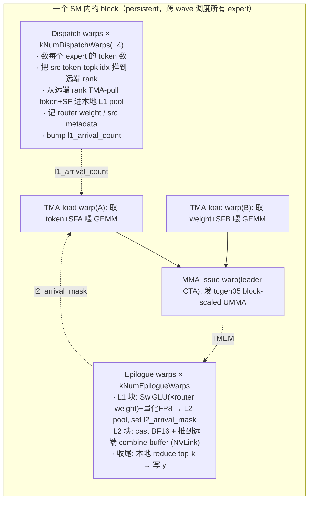

# 07 · MegaMoE：把 MoE forward 融成单个 kernel

> 本篇是算子与 kernel 专题的最后一篇。[Expert Parallelism (EP)](../parallel/05_ep/README.md)（`02` dispatch、`03` combine/backward）与本章前两篇（[05 · Grouped GEMM 与 Expert 计算](./05_grouped_gemm.md)、[06 · DeepEP：V1 (legacy/NVSHMEM) 与 V2 (elastic/NCCL Gin)](./06_deepep.md)）把 MoE forward 拆成了一条 **kernel 链**：DeepEP `dispatch` → DeepGEMM grouped GEMM(L1) → activation → grouped GEMM(L2) → DeepEP `combine`。每一段都是独立的 kernel，段与段之间隔着一次 launch 与一次 HBM 往返，而且**通信与计算严格串行**：dispatch 占用 NVLink 时 tensor core 空转，GEMM 占用 tensor core 时 NVLink 空转。正文中的 `01`/`02` 等篇号均指 EP 章的对应篇。
>
> MegaMoE（由 DeepGEMM `#304` 引入，`#316` 给出 benchmark）把这条链整体塞进**一个** SM100 kernel，用 **kernel 内部的 warp specialization** 让 NVLink 通信与 tensor core 计算真正同时发生，即 PR 描述中的 "fusing & overlapping dispatch / linear 1 / SwiGLU / linear 2 / combine into a single mega-kernel, overlapping NVLink communication and tensor core computation"。
>
> 代码锚点：[[deepgemm:deep_gemm/mega/__init__.py]]（Python API）、[[deepgemm:csrc/apis/mega.hpp]]（buffer 布局 + host 入口）、[[deepgemm:csrc/jit_kernels/]]（调参 + launch）、[[deepgemm:deep_gemm/include/deep_gemm/]]（kernel 本体）、[[deepgemm:tests/test_mega_moe.py]]（用例 + baseline 对拍）。

---

## 0. 适用边界

MegaMoE 不是一个通用算子，而是为 **DeepSeek-V3 类大规模 EP 推理**专门设计的 kernel。在展开设计细节之前，先明确它的适用边界：

| 维度 | MegaMoE 的取值 | 出处 |
|---|---|---|
| 架构 | **仅 SM100（Blackwell）** | `arch_major == 10` 才 dispatch，否则 `DG_HOST_UNREACHABLE`（[[deepgemm:csrc/apis/mega.hpp#L206-L220]]）；用到 tcgen05 / TMEM / UTCCP / 2-CTA MMA |
| 并行域 | **scale-up only**：单个 NVLink 域（≤72 rank） | `SymBuffer` 的 `kNumMaxRanks=72`（`sym_buffer.cuh:7`），靠 symmetric memory P2P，**没有** cross-node IBGDA（对比 `06` 的 DeepEP internode/LL） |
| 数据类型 | activation **FP8 e4m3** × weight **FP4 e2m1**，per-32 UE8M0 SF | `a_dtype_t=float_e4m3_t`、`b_dtype_t=float_e2m1`（`sm100_fp8_fp4_mega_moe.cuh:164-165`）；`use_fp8_dispatch` 必须 true（[[deepgemm:csrc/apis/mega.hpp#L26]]） |
| 方向 | **只有 forward**（prefill / decode 推理） | 无 backward；无 dgrad/wgrad。这点和 EP `03` 与 [05](./05_grouped_gemm.md) 讲的训练前反向是两个世界 |
| 激活 | 只支持 **SwiGLU**，recipe 固定 `(1,1,32)` | [[deepgemm:csrc/apis/mega.hpp#L155-L156]] |
| 约束 | `num_experts % num_ranks == 0`、`hidden % 128 == 0`、`intermediate_hidden % 128 == 0` | `mega.hpp:25, 90` |

可以把它概括为：

> **MegaMoE 在一个 NVLink 域内用一个 Blackwell kernel 跑完整条 FP8×FP4 MoE 推理 forward**：消除了前面几篇（EP `02`/`03`、本章 `05`/`06`）那条 5-kernel 链的所有 HBM 往返与 launch 边界，并用 warp 级分工把 dispatch/combine 的 NVLink 流量藏到 GEMM 的 tensor core 计算背后。它与 baseline（DeepEP dispatch 加 DeepGEMM grouped GEMM 加 combine）的输出**逐 bit 相同**（[[deepgemm:tests/test_mega_moe.py#L194]] 中的 `torch.equal`）。

---

## 1. 为什么要融合成单个 kernel

先把前面几篇拆开的链路完整列出来（这正是 [[deepgemm:tests/test_mega_moe.py#L158-L184]] 中的 `run_baseline`）：

```python
recv_x, _, recv_w, handle, _ = ep_buffer.dispatch(x, topk_idx, topk_w, ...)   # kernel 1：NVLink/IB
l1_y = empty(...);  gemm_fn(recv_x, l1_weights, l1_y, n_per_expert)           # kernel 2：tensor core
l1_y = swiglu_apply_weight_to_fp8(l1_y, recv_w, ...)                          # kernel 3：CUDA core
l2_y = empty(...);  gemm_fn(l1_y, l2_weights, l2_y, n_per_expert)            # kernel 4：tensor core
out  = ep_buffer.combine(l2_y, handle)                                        # kernel 5：NVLink/IB
```

这条链有三个代价：

1. **launch 边界**：5 次 kernel launch 加上中间的 handle 拷贝（baseline 特地用 CUDA graph 消除 launch 开销，以保证对比公平）。
2. **HBM 往返**：`recv_x`、`l1_y`、`l2_y` 都要先写入 HBM 再被下一个 kernel 读回。`recv_x` 是全部 dispatch 来的 token（FP8），`l1_y` 是 $[\sum_i n_i,\ 2 \cdot \text{intermediate}]$ 的中间激活，数据量很大。
3. **通信与计算串行**：kernel 1（dispatch）运行时 tensor core 完全空闲，kernel 2/4（GEMM）运行时 NVLink 完全空闲。一张 H/B 卡的 NVLink 带宽与 tensor core 算力是**两套独立的硬件**，串行执行意味着任何时刻都有一半的资源在闲置。

本质问题是第三条。MegaMoE 的核心不在于省 launch 或省一次拷贝，而在于**让通信与计算在同一时刻分别占用 NVLink 与 tensor core**。要做到这一点，通信与计算必须在**同一个 kernel 内**由**不同的 warp** 同时推进，这就是 warp specialization。测试输出中的 `overlap: ... TFLOPS / HBM GB/s / NVL GB/s` 三个指标同时打满，正是 overlap 生效的体现。

```
baseline（串行）:  [dispatch NVLink]→[L1 TC]→[act]→[L2 TC]→[combine NVLink]   墙钟 = 各段之和
                    ▔▔▔▔▔▔▔▔▔        ▔▔▔▔         ▔▔▔▔     ▔▔▔▔▔▔▔▔▔

MegaMoE（overlap）: dispatch NVLink  ════════════════╗
                          L1 TC        ════════════════╗            墙钟 ≈ max(NVLink, TC)
                          L2 TC          ════════════════╗
                    combine NVLink         ═══════════════════
                    （不同 warp 同时在跑，靠 block 级依赖串起来）
```

---

## 2. 整体结构：kernel 内的 warp 角色分工

`sm100_fp8_fp4_mega_moe_impl`（`sm100_fp8_fp4_mega_moe.cuh:50`）启动后，所有线程按 `warp_idx` 分成若干**角色组**，每组只负责一件事，彼此通过 shared memory barrier 与 global memory 上的 arrival counter 协作。`__launch_bounds__(kNumThreads,1)` 表示一个 SM 上只驻留一个 block（persistent kernel）。



代码里这套分工就是一串 `if (warp_idx < kNumDispatchWarps) {...} else if (warp_idx == kNumDispatchWarps) {...} else if ...`（`sm100_fp8_fp4_mega_moe.cuh:330, 643, 714, 757, 870, 874`）：

| warp 角色 | warp_idx 范围 | 寄存器配额 | 干什么 | 代码 |
|---|---|---|---|---|
| **Dispatch** | `< kNumDispatchWarps`（4 warp = 128 线程） | 48 / 96 | 计数 → push 元数据 → pull token 数据 → 收尾清理 | `:330-642` |
| **TMA-load A** | `== kNumDispatchWarps` | 40 / 88 | 给 GEMM 灌 activation + SFA | `:643-713` |
| **TMA-load B** | `+1` | 40 / 88 | 给 GEMM 灌 weight + SFB | `:714-756` |
| **MMA-issue** | `+2`（仅 leader CTA） | 40 / 88 | 发 `SM100_MMA_MXF8F6F4_2x1SM` block-scaled UMMA | `:757-869` |
| （预留） | `+3` | 40 / 88 | 空 | `:870-872` |
| **Epilogue** | `>= kNumDispatchWarps + kNumMMANonEpilogueWarps` | 208 / 160 | SwiGLU+量化 / combine 推送 / 收尾 reduce | `:874-1352` |

寄存器配额通过 `warpgroup_reg_dealloc/alloc` 显式重分配（`:332, 645, 876`）：dispatch、load、MMA warp 让出寄存器，epilogue warp 分配到更多（SwiGLU、量化与 reduce 都是寄存器消耗大户）。`kUseMoreEpilogueRegisters = kNumExpertsPerRank <= 64`（`:316`）：expert 越多，scheduler 状态占用的寄存器越多，分配给 epilogue 的就相应减少。

在这套分工中，**dispatch warp 负责通过 NVLink 拉取数据，MMA warp 负责驱动 tensor core，epilogue warp 既负责 CUDA core 上的计算（SwiGLU、量化、reduce）也负责 NVLink 上的 combine 推送**。三类硬件单元在同一个 kernel 内被不同的 warp 同时驱动，overlap 正是由此产生的。

---

## 3. 内存基础：symmetric memory

`02` 中的 dispatch 使用 `dist.all_to_all_single`（或 DeepEP 的 fused kernel）完成跨 rank 搬运。MegaMoE 不调用任何通信库，而是使用 **PyTorch symmetric memory**：所有 rank 各自分配一块**等大、等布局**的 buffer 并执行 `rendezvous`，于是每个 rank 都能拿到所有 rank 的 buffer 指针，**直接用指针偏移寻址远端显存**（NVLink P2P load/store）。这就是 [01 · scale-up 域：NVLink / NVSwitch 与 NVL72 rack-scale 超节点](../hpc/01_scale_up_nvlink_nvl72.md) 中的 LSA 路径，只是前端换成了 `torch.distributed._symmetric_memory` 而不是 `ncclGetLsaPointer`。

```python
# deep_gemm/mega/__init__.py:38-44
allocator = torch if group.size() == 1 else symm_mem
self.buffer = allocator.empty(num_bytes, dtype=torch.int8, device='cuda')
self.handle = symm_mem.rendezvous(self.buffer, group=group)     # 拿到所有 rank 的 buffer_ptrs
```

kernel 中把这些指针封装为 `SymBuffer`，远端寻址只是一次加法（`sym_buffer.cuh:33-39`）：

```cpp
// 把"本地某结构体指针 ptr"翻译成"dst_rank 上同一结构体的指针"
ptr_t map(const ptr_t& ptr, const uint32_t& dst_rank_idx) const {
    int64_t mapped = offsets[dst_rank_idx] + reinterpret_cast<int64_t>(ptr);  // offset = 远端base - 本地base
    return *reinterpret_cast<ptr_t*>(&mapped);
}
```

这样，MoE 的两次跨 rank 搬运都变成了纯粹的 P2P 操作：

- **dispatch 等于「元数据 push 加数据 pull」**。每个 rank 先把「我这边有哪些 token 要送给你的 expert」（`src_token_topk_idx`）**写到目标 rank** 的 workspace（`sym_buffer.map(dst_ptr, dst_rank_idx)`，`:377`）；然后由**拥有该 expert 的 rank** 反过来**从源 rank 拉取**真正的 token 数据（TMA load remote 再 store local，`:524-546`）。
- **combine 等于「数据 push 加本地 reduce」**。L2 epilogue 把每个 token 的 partial 输出**写回原 token 所属 rank** 的 combine buffer（`:1199`）；最后每个 rank 在**本地**把自己那些 token 的 top-k partial 读出并求和（`:1264-1352`）。

这套 buffer 的布局在 `get_symm_buffer_size_for_mega_moe`（[[deepgemm:csrc/apis/mega.hpp#L19-L133]]）中手工排布：一块大的 `int8` buffer 被切分为输入区（`x`/`x_sf`/`topk_idx`/`topk_weights`）、L1 pool（`l1_acts`/`l1_acts_sf`/`l1_topk_weights`）、L2 pool（`l2_acts`/`l2_acts_sf`）与 combine 区。Python 侧的 `SymmBuffer.__init__` 通过 `slice_input_buffers` 暴露可见的输入视图（[[deepgemm:deep_gemm/mega/__init__.py#L50-L53]]），调用方在每次 kernel 前把 `x/x_sf/topk_idx/topk_weights` 拷入（[[deepgemm:tests/test_mega_moe.py#L101-L104]]，README 提示这一步可以 fuse 进上一个 kernel）。

> 一个值得注意的反直觉设计是：dispatch 采用 **pull**（owner rank 主动拉取），combine 采用 **push**（计算 rank 主动写回）。两者都通过 `SymBuffer::map` 做 P2P，但方向相反。这与 `06` 中 DeepEP 的 push 式 dispatch 不同，其目的是让 owner rank 能把拉进来的 token 直接放置到 GEMM 所要求的 pool 布局中，详见下一节。

---

## 4. 共享 token pool

`05` 介绍过 grouped GEMM 的 contiguous layout：把所有 local expert 的 token 沿 $M$ 维拼成一个大张量，每段按 `BLOCK_M` 对齐并配 `m_indices`。MegaMoE 把这个**布局约定**直接实现为 kernel 内部的一块 **token pool**：dispatch 把拉取进来的 token 按 expert 顺序、每段对齐到 `BLOCK_M` 地写入 `l1_acts`，于是 L1 GEMM 天然就是 m-grouped 的形式，不需要任何额外的 permute。

pool 的容量按最坏情况预先确定（[[deepgemm:deep_gemm/include/deep_gemm/layout/mega_moe.cuh#L17-L25]]）：

```cpp
num_max_pool_tokens = align(
    num_ranks * num_max_tokens_per_rank * min(num_topk, num_experts_per_rank)   // 最坏：所有 token 都来
    + num_experts_per_rank * (kMaxCandidateBlockM - 1),                          // 每个 expert 段的对齐 padding
    kLCMCandidateBlockM /* = 384 */);
```

其中有两个关键数字：

- **每个 expert 段按 `BLOCK_M` 对齐**：与 `05` 的 `expert_alignment=128` 是同一要求，保证每个 tile 不会跨 expert 取错权重。
- **token 总数对齐到 `kLCMCandidateBlockM = 384`**（`get_token_alignment_for_mega_moe`，[[deepgemm:csrc/apis/mega.hpp#L15-L17]]）：$384 = \mathrm{lcm}(8,16,32,64,96,128,192)$，即所有候选 `BLOCK_M`（`kCandidateBlockM`，[[deepgemm:deep_gemm/include/deep_gemm/layout/mega_moe.cuh#L11]]）的最小公倍数。这样**无论 heuristic 选择哪个 `BLOCK_M`，每个 expert 段的起点都落在它的 tile 边界上**。

`scheduler` 用一个 per-lane 缓存 `stored_num_tokens_per_expert` 记录每个 local expert 实际收到的 token 数（[[deepgemm:deep_gemm/include/deep_gemm/scheduler/mega_moe.cuh#L185-L199]] 从 `expert_recv_count_sum` 读取，自旋等待所有 rank 与 SM 汇报完毕）；`get_pool_block_offset(e)` 是「前 e 个 expert 占用了多少个 `BLOCK_M` 块」的前缀和（`:82-90`），也就是 expert e 在 pool 中的 $M$ 维偏移。`05` 中需要 D2H sync 才能拿到的 `tokens_per_expert`，在这里全程留在 GPU 上、由 kernel 自行计算。

---

## 5. Persistent scheduler：wave 与块流

整个 kernel 的控制流集中在 `MegaMoEScheduler`（[[deepgemm:deep_gemm/include/deep_gemm/scheduler/mega_moe.cuh]]）。它把**本 rank 上所有 expert 的 L1 与 L2 的全部 tile** 展平成一条 `(BlockPhase, expert, m_block, n_block)` 序列，三类 GEMM warp（load-A、load-B、MMA）与 epilogue warp 都通过同一个 `for_each_block` 回调遍历这条序列（`:201-220`），从而保证所有角色看到的块顺序完全一致。

其核心机制是 **wave 加两相位状态机**：

- **wave**：把 expert 分组，每 `num_experts_per_wave` 个 expert 构成一个 wave。`get_next_block`（`:150-183`）在一个 wave 内**先把这个 wave 所有 expert 的 L1 块全部发出**（`next_phase==Linear1`），再切换到 `Linear2` 发出这个 wave 的全部 L2 块，然后进入下一个 wave 的 L1。
- **为什么按 wave 而不是「逐 expert 完成 L1 加 L2」来调度**：`num_experts_per_wave` 由 `get_num_experts_per_wave_for_mega_moe`（[[deepgemm:csrc/jit_kernels/heuristics/mega_moe.hpp#L101-L145]]）按「凑够块数以喂满所有 SM」的原则确定。wave 太小，一个 wave 的块数喂不满 GPU，SM 会闲置；wave 太大，L1/L2 的 working set 会超出 L2 cache。实现中还特意选择一个让**最后一个 partial wave 尽量满**的 `num_experts_per_wave`（`:135-144` 的 tail_ratio 搜索）。当 token 特别少时（例如 RL 长尾 rollout，`expected_tokens_per_expert < 1`），直接用一个 wave 装下所有 expert（`:106-108`）。
- **block_idx 跨 SM 跳步**：`block_idx += kNumSMs`（`:160, 172`），即 `kNumSMs` 个 SM 各领取一条等差子序列，以 persistent 的方式把整个 wave 的块均摊到所有 SM 上。

```
一个 wave（含 expert e0,e1,e2,...）的块发射顺序：
  e0.L1[m,n]  e1.L1  e2.L1 ... （这 wave 全部 L1）   ← L1 阶段
  e0.L2[m,n]  e1.L2  e2.L2 ... （这 wave 全部 L2）   ← L2 阶段（L1 输出已就绪）
  ↓ 下一个 wave
```

`get_valid_m`（`:112-116`）返回当前 m_block 的有效 token 数（最后一块可能不满 `BLOCK_M`），还可以 `align(m,16)` 供 UMMA 使用；MMA 据此动态调整 `UMMA_N`（`:791` 的 `update_instr_desc_with_umma_n`），避免对 padding 行做无用计算。

`heuristics` 还会按「每个 expert 的期望 token 数」选择 `BLOCK_M`（`get_block_config_for_mega_moe`，`:64-99`）：不超过 8.5 时用 `BLOCK_M=16`，不超过 16.5 时用 32，依此类推，prefill 与大 EP 场景用 192。这组阈值直接对应不同的推理场景（decode batch size 128/256/512、prefill），是这个 kernel 面向推理设计的最直接证据。

---

## 6. overlap 的实现机制：block 级 arrival counter

前面的内容还只解释了「如何把 5 个 kernel 放进一个 kernel」。**真正让通信与计算重叠起来的，是用细粒度的 arrival counter 取代 kernel 边界的全局同步**，这是本篇最关键的一节。

在 baseline 中，L1 GEMM 必须等 `dispatch` 这个 kernel **整体**结束才能开始，因为 kernel 边界就是一道全局 barrier。MegaMoE 把这道 barrier 拆解为 **per-pool-block 的依赖**：

- **dispatch → L1**：dispatch warp 每把一个 pool block（`BLOCK_M` 个 token）的数据拉齐，就对 `l1_arrival_count[pool_block]` 执行一次 `red_add`（`:581-582`）。L1 的 TMA-load-A warp 在加载某个 block 前**自旋等待** `l1_arrival_count == valid_m`（`:664-667`）：

  ```cpp
  if (block_phase == Linear1) {
      const auto ptr = workspace.get_l1_arrival_count_ptr(pool_block_idx);
      while (ptx::ld_acq(ptr) != scheduler.get_valid_m<false>());   // 这一块的 token 全到了才开 GEMM
  }
  ```
  于是**第 0 块 token 一就位，L1 GEMM 就可以开始计算，而此时 dispatch warp 还在拉取后面的块**。NVLink 与 tensor core 由此实现真正的并行。

- **L1 → L2**：L1 epilogue 把 SwiGLU 加量化后的输出写进 L2 pool，每写完一个 $N$ 块就在 `l2_arrival_mask[pool_block]` 里用 `red_or` 置一个 bit（`:1100-1106`）。L2 的 TMA-load-A warp 自旋等待掩码集齐所有 $N$ 块（`:676-682`）：

  ```cpp
  const auto ptr = workspace.get_l2_arrival_mask_ptr(pool_block_idx);
  while (ptx::ld_acq_gpu(ptr) != kExpectedMask);   // L1 输出的所有 N 块都写好了，L2 才读
  ```
  由于 SwiGLU 使 L1 输出的 $N$ 维减半（`BLOCK_N/2`），L2 需要等待两个 L1 块凑成一个 L2 输入块（`:669-682` 的注释）。

- **L2 → combine，以及 combine-reduce 与清理的重叠**：L2 epilogue 直接把结果通过 NVLink 推到远端 combine buffer（既是计算输出又是通信）；最后的 combine-reduce 循环（`:1264-1352`）与 dispatch warp 的 workspace 清理（`:587-633`）通过 `kDispatchWithEpilogueBarrierIdx` 这道 named barrier 错开，**清理的访存延迟被隐藏在 reduce 背后**（`:588` 的注释 "overlapped with combine reduction epilogue"）。

```
SM 内 trace（pool block 粒度，箭头=arrival counter 触发）:

dispatch:   pull blk0 ─┐ pull blk1 ─┐ pull blk2 ...
                       ↓l1_cnt      ↓
L1 GEMM:               └ MMA blk0 ─┐ MMA blk1 ...
                                   ↓(SwiGLU+quant, l2_mask)
L2 GEMM:                           └ MMA blk0 ─┐ ...
                                               ↓(cast BF16)
combine push (NVLink):                         └ scatter→远端 ...
                                                          ↓(全 rank nvlink_barrier)
combine reduce → y:                                       └ 本地 top-k 求和
```

整张依赖图由 workspace 中几个位于 GPU 上的计数器（`l1_arrival_count`、`l2_arrival_mask`、`expert_recv_count*`，布局见 [[deepgemm:deep_gemm/include/deep_gemm/layout/mega_moe.cuh#L40-L173]]）连接起来，**全程没有一次 D2H 同步、没有一次 host 介入**。这正是 `02` 反复强调的「dispatch 动态 split 导致 D2H sync」问题在融合 kernel 中的彻底解决：从设计上就不让 CPU 知道 token 数。

---

## 7. dispatch 的实现：计数、push 元数据与 pull 数据

dispatch warp（`:330-642`）分几步完成 `02` 中 preprocess、permute 与 all-to-all 的全部工作，且全部在 GPU 上进行：

1. **统计 token**（`:356-360`）：每个 warp 扫描一批 token 的 `topk_idx`，用 `atomicAdd_block` 累加到 shared memory 的 `expert_token_count[expert]`。`expert_idx < 0`（被 mask 掉的 top-k 槽）直接跳过。
2. **计算全局发送偏移**（`:362-368`）：把本 SM 的计数通过 `atomic_add` 累加进 workspace 的 `expert_send_count`，取回本段的起始偏移（返回值的高 32 位填入 SM 计数用于汇报，低 32 位是 token 数）。
3. **push 源索引**（`:371-378`）：把每个 (token, topk) 的 `token_topk_idx` 写入**目标 rank** 的 `src_token_topk_idx` 槽位，相当于告诉 owner rank「我有这些 token 要发送给你」。
4. **交换计数**（`:386-400`）：SM 0 把 `expert_recv_count` 与 `expert_recv_count_sum` 写到各 owner rank。scheduler 的 `fetch_expert_recv_count` 会自旋等待 `count>>32 == kNumSMs*kNumRanks`，确认计数齐全（`scheduler:192-194`）。
5. **NVLink barrier**（`:404-410`）：确保所有 rank 的源索引都写完后才能开始 pull。
6. **pull 数据**（`:431-585`）：每个 warp 认领 pool 中的一段 token，根据「该 token 属于哪个 expert、来自哪个源 rank」计算远端地址，用 **TMA load remote 经 smem 再 TMA store local** 的方式把 token（按 `kNumBytesPerPull` 分块，`:518-546`）与 SF（`:550-564`）搬入本地 L1 pool；同时把 router weight 存入 `l1_topk_weights`（`:570-573`，供 SwiGLU 使用），把 `{src rank, src token, src topk}` 记入 `token_src_metadata`（`:576-577`，供 combine 写回使用）；最后递增 `l1_arrival_count`。
   - 其中 `:462-510` 的 "round-robin rank selection via iterative min-peeling" 是把一个 expert 收到的 token 在源 rank 之间**轮转交错**地分配 pool 槽位（用于负载均衡，并让同一 round 的 token 连续）。这段逻辑不影响正确性，理解为「按源 rank 交错填充 pool」即可。

这一段完成了 `02` 中 `preprocess`（计算 splits）、`permute`（按 expert 排序）与 `all_to_all`（跨 rank 搬运）三件事，并且在搬运的同时记录下 combine 所需的逆映射——`token_src_metadata` 扮演的正是 `02` 中 `handle`/`routing_map` 的角色。

---

## 8. L1 epilogue：融合的 Scaled SwiGLU 与 FP8 量化

L1 GEMM 的结果在 TMEM 中是 FP32（$[\text{BLOCK\_M},\ 2 \cdot \text{intermediate}]$，gate 与 up 各一半）。L1 epilogue（`:928-1107`）连续完成三件事，输出以 FP8 形式直接写入 L2 pool，省掉了 baseline 中 `l1_y` 的 HBM 往返：

1. **Scaled SwiGLU**（`:991-1003`）：`out = (gate · sigmoid(gate)) · up · weight`，其中 `weight` 是 dispatch 时保存的 router 权重——**与 `05` §4 所述「router 权重在 SwiGLU 处乘入」完全一致**，因此 combine 只需做纯加法（见下节）。可选的 `activation_clamp` 用于约束 gate/up。`kFastMath` 时使用 `__expf` 与 `fast_rcp`。
   - 为了让一次 TMEM load 就能取到相邻的 gate/up 对，权重在 host 侧由 `_interleave_weights` 按粒度 8 交错排布（[[deepgemm:deep_gemm/mega/__init__.py#L80-L86]]：`[gate0..7, up0..7, gate8..15, ...]`）。
2. **量化回 FP8 e4m3**（`:1006-1040`）：跨 warp-pair 做 amax reduction（`:1007-1014` 与 `:1028-1031`），计算 per-block 的 UE8M0 scale，把 SwiGLU 输出 cast 为 e4m3，并把 SF 以 MN-major 形式写入 `l2_sf_buffer`（`:1052-1077`）。这一步相当于把 baseline 中独立的 `swiglu_apply_weight_to_fp8` kernel 内联了进来。
3. **通过 STSM 写入 smem，再经 TMA store 写入 L2 pool**（`:1042-1092`），然后置位 `l2_arrival_mask` 通知 L2（见第 6 节）。

L1 输出与 L2 输入「本质上是同一张 tensor」（[[deepgemm:csrc/apis/mega.hpp#L160]] 的注释），只是 $N$ 维因 SwiGLU 减半。这就是为什么 L2 pool 的 token 布局能与 L1 pool 共用同一套 `pool_block_offset`。

---

## 9. L2 epilogue 与 combine

L2 GEMM 的结果（每个 token 对某个 expert 的最终输出，BF16）由 L2 epilogue（`:1108-1205`）处理：

1. cast 为 BF16，经 STSM 写入 smem（`:1123-1165`）。
2. **直接经 NVLink 推回原 token 所属的 rank**（`:1167-1200`）：利用 dispatch 时记录的 `token_src_metadata` 找到 `{dst_rank, dst_token, dst_topk}`，把这份 partial 写入**远端**的 `combine_token_buffer[dst_topk][dst_token]`。注意 combine buffer 按 **top-k 槽位**分开存储（$\text{bf16\_token\_layout} \times \text{num\_topk}$，[[deepgemm:csrc/apis/mega.hpp#L85-L87]]），因此同一 token 的 k 份 partial 落在 k 个不同的槽位中，互不覆盖。

到这一步，每个 rank 的 combine buffer 中保存着「本 rank 拥有的每个 token 在每个 top-k 槽位上的 partial 输出」。经过一道全 rank 的 `nvlink_barrier`（`:1214-1218`）确认所有 partial 都到齐后，进入 **combine-reduce 循环**（`:1264-1352`）：每个 token 把它至多 k 个 partial 通过 TMA load 读入，在 FP32 寄存器中累加（`:1305-1321`），再 cast 回 BF16，经 TMA store 写入最终输出 `y`。

这正是 EP `03` 所述对称性的 kernel 内实现：

| EP `03` 的抽象 | MegaMoE 里的落地 |
|---|---|
| dispatch = 按 routing_map scatter token | dispatch warp：元数据 push + 数据 pull，记 `token_src_metadata` |
| router 权重在 expert 内乘入 → combine 是纯 reduce | Scaled SwiGLU 把 weight 乘进去（第 8 节），combine 只做加法 |
| combine = unpermute + 逆 all-to-all + 加权 reduce | L2 epilogue scatter 回原 rank（逆 all-to-all）+ 本地 top-k 求和（reduce） |
| `dispatch.bwd == combine` | 不适用——MegaMoE **只有 forward**，无 autograd |

> 与 EP `03` 唯一不同的是：MegaMoE 是推理 kernel，没有反向传播。EP `03` 的对称性是为了「写对 forward，让 autograd 自动给出反向」；MegaMoE 把 combine 手写成「scatter 加本地 reduce」，是为了把通信安排进 kernel 的尾部并与 dispatch 的清理工作重叠，并不为求导服务。

---

## 10. 跨 rank 同步：nvlink_barrier

融合 kernel 中不存在 kernel 边界，跨 rank 的「全员到齐」需要自己实现。`comm::nvlink_barrier`（[[deepgemm:deep_gemm/include/deep_gemm/comm/barrier.cuh#L37-L87]]）由三部分组成：**grid sync（SM 之间）、跨 rank 信号、再一次 grid sync**。grid sync 借助 workspace 中的计数器复刻 `cooperative_groups::this_grid().sync()` 的语义；跨 rank 信号使用 symmetric memory 上的 atomic，只有 SM 0 参与，并带有 300 秒超时打印以防死锁。kernel 用三个不同 tag 的 barrier 把流程切分为三个相位：

| barrier tag | 位置 | 保证 |
|---|---|---|
| `kBeforeDispatchPullBarrierTag` | dispatch pull 之前（`:404`） | 所有 rank 的源索引都已 push 完，可以安全 pull |
| `kBeforeCombineReduceBarrierTag` | combine reduce 之前（`:1214`） | 所有 rank 的 partial 都已 scatter 完，可以安全 reduce |
| `kAfterWorkspaceCleanBarrierTag` | workspace 清理之后（`:636`） | 所有 rank 都清完 counter，下次调用干净 |

此外还有 cluster 内部的 `cluster_sync_with_relaxed_arrive`（2-CTA tensor memory 分配所必需，`:237, 282`）以及大量 named barrier（dispatch、epilogue、combine），整个 kernel 构成一张相当精密的同步图。这也是它只限定在不超过 72 rank 的单 NVLink 域内的原因——P2P 寻址与 grid sync 的开销都随 rank 数增长。

---

## 11. 小结：与前几篇的对应及局限

**MegaMoE 把前面几篇拆开的每一段重新表达进了一个 kernel：**

| 前面几篇的链 | MegaMoE 里 | 关键差异 |
|---|---|---|
| `preprocess`（算 splits，D2H sync） | dispatch warp 在 GPU 上数 + 前缀和 | **零 D2H**，counter 全留 GPU |
| `permute` + `all_to_all`（dispatch） | 元数据 push + TMA pull 进 token pool | pool = `05` 的 contiguous layout，内化 |
| grouped GEMM L1（独立 kernel） | scheduler 的 `Linear1` 块 + MMA warp | 块级 `l1_arrival_count` 触发，和 dispatch overlap |
| SwiGLU + 量化（独立 kernel） | L1 epilogue inline | router weight 乘入，FP8 量化 on-the-fly |
| grouped GEMM L2（独立 kernel） | scheduler 的 `Linear2` 块 | 块级 `l2_arrival_mask` 触发 |
| `combine`（独立 kernel） | L2 epilogue scatter + 本地 reduce | push 回原 rank + 本地 top-k 求和 |

**核心收益**：消除了 5-kernel 链的 launch 开销、HBM 往返与通信-计算串行，通过 warp specialization 与块级 arrival counter 让 NVLink 通信隐藏在 tensor core 计算背后；输出与 baseline 逐 bit 相同。

**局限（使用前务必确认）**：

- **SM100 与 scale-up 限定**：Blackwell 专属（tcgen05/TMEM/UTCCP/2-CTA MMA），单个 NVLink 域不超过 72 rank，不支持 cross-node IB——跨机场景仍需使用 `06` 介绍的 DeepEP internode/LL。
- **仅支持 FP8×FP4 推理前向**：无 backward，激活只支持 SwiGLU，recipe 固定为 `(1,1,32)`，权重需要先经 `transform_weights_for_mega_moe` 处理（gate/up 交错，SF 为 UTCCP 转置）。
- **buffer 按最坏情况预分配**：`num_max_pool_tokens` 是 worst-case 值，本质是以显存换取零同步（测试中会打印 buffer 的 GiB 数）。
- **调参强依赖场景**：`BLOCK_M` 与 `num_experts_per_wave` 由每个 expert 的 token 数 heuristic 决定，估计不准会损失性能（与 `05` §6 对 masked 模式 `expected_m_per_group` 的提醒一致）。

---

至此，从 [EP 章](../parallel/05_ep/README.md) 的 router（`01`）、dispatch（`02`）、combine（`03`）、系统侧负载均衡（`04`），到本章的 grouped GEMM（[05](./05_grouped_gemm.md)）、DeepEP 内部机制（[06](./06_deepep.md)），再到把它们全部融合的 MegaMoE（本篇），这条链路已经完整。理解本篇的前提正是前面逐段讲解的内容——dispatch 的 layout 约定、grouped GEMM 的 contiguous pool、SwiGLU 中 router weight 的折入、combine 的对称性，它们在这里全部以「一个 kernel 内不同 warp 的协作」的形式重新出现。

> 本章没有新增 lab：MegaMoE 依赖 SM100、symmetric memory 与多进程，无法在本机 CPU/gloo 环境复现。真实的运行方式与 benchmark 见 [[deepgemm:tests/test_mega_moe.py]]（包含与 DeepEP+DeepGEMM 非融合 baseline 的逐 bit 对拍，以及 TFLOPS/HBM/NVLink 三轴的 overlap 指标）。
