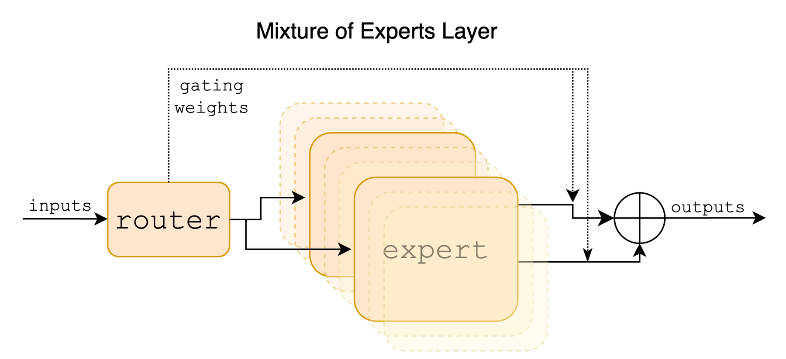

# MoE

本章讨论 mixture of experts（MoE）这一架构家族，回答的是模型层面的问题：一层 MoE 具体在算什么、专家怎么切分、路由怎么学习、负载怎么被推平。章内的顺序是先把 MoE 的定义式、张量 shape 与可导性讲清楚，再展开细粒度切分、LatentMoE，以及 aux / aux-free / QB 这三类 load balancing。

本章共八篇。`01`–`04` 是架构视角，依次讨论 MoE 的定义与关键组件、细粒度专家、LatentMoE、算法侧负载均衡；`05`–`07` 是算子与 kernel 视角，讨论 expert 计算如何落到 grouped GEMM 上、dispatch/combine 通信 kernel 的内部机制、以及把整条链路融成单个 kernel 的 MegaMoE。后三篇承接 [Expert Parallelism (EP)](../parallel/05_ep/README.md) 一章的 router/preprocess、dispatch、combine/backward 全流程，两章互为补充。它和 [EP 章](../parallel/05_ep/README.md)的分工是：

| | 本章（MoE） | [EP 章](../parallel/05_ep/README.md) |
|---|---|---|
| 视角 | 架构与算法（01–04）、算子与 kernel（05–07） | infra 全流程：router → dispatch → combine |
| 核心对象 | router 分数、专家宽度、平衡目标、expert 计算与通信 kernel | token 重排、all-to-all、前反向对称 |
| 负载均衡 | aux / aux-free / QB（怎么选 expert） | EPLB / LPLB（expert 放哪、replica 怎么补） |

## 前置知识

本章假设读者具备以下背景：

- 清楚 Transformer block 的基本结构：self-attention 加 FFN，其中 FFN 通常是两层（或者 SwiGLU 的三投影）、逐 token 独立计算的 MLP——这是下面所有讨论的起点。
- 集合通信和 expert parallelism 不算本章的前置知识，用到的地方会链到 [Expert Parallelism (EP)](../parallel/05_ep/README.md)。
- 「这个操作到底贵不贵」的判断会用到 roofline 的直觉，见 [00 · Roofline model：性能上界的两道天花板](../hpc/00_roofline_model.md)。

---

## 0. 一层 MoE 的直观图景

MoE 的基本想法，是把 Transformer 里「每个 token 都走同一套 FFN」这件事，换成「每个 token 只激活少量专家 FFN」。这样一来，模型的总参数量可以随专家数量线性增长，但每个 token 真正要花的计算量（FLOP）只取决于它实际激活的那几个专家，与专家总数无关。这个设计带来的代价也很明确：路由本身是一次离散选择，不可导，训练中专家的负载很容易塌缩到只有少数专家被频繁选中；而当专家数量变多、粒度变细之后，通信体积和权重搬运又会变成新的瓶颈。后面细粒度切分、LatentMoE，以及 aux / aux-free / QB 这三条平衡路线，都是围绕着这两处代价逐步展开的。

把这套逻辑画成一层 MoE 内部的数据通路会更直观：

```
hidden_states [T, H]
      │
      ├──────────────────────────────┐
      │                              │
      ▼                              ▼
  router: logits = x @ W_rᵀ      shared experts（可选, 始终激活）
      │                              │
      ▼                              │
  score → (+bias, 只用于选) → top-k   │
      │                              │
      ▼                              │
  routing_map [T, E] 离散              │
  probs        [T, E] 连续             │
      │                              │
      ▼                              │
  dispatch 到被选 expert               │
      │                              │
      ▼                              │
  expert FFN（可能在 latent 宽 ℓ）     │
      │                              │
      ▼                              │
  combine：按 probs 加权求和 ─────────┴──► + residual → [T, H]
```



> 图：经典 token-choice MoE 层。router 为每个 token 选出少数 expert，输出是被选专家的加权和。Mixtral 是 top-2 / 8 experts 的粗粒度形态；后面的细粒度和 LatentMoE 都是在这张图上改「专家有多细、在哪个宽度上算」。（Jiang et al. 2024, Fig 1；[arXiv:2401.04088](https://arxiv.org/abs/2401.04088)）

---

## 1. 这组文档怎么读

前四篇讲的是模型架构本身：一层 MoE 在算什么、专家怎么切、路由怎么学、负载怎么平。后三篇往下走一层，讲的是把这套架构真正跑起来所需要的关键算子：grouped GEMM 怎么应付「每个 expert 分到的 token 数不一样」这件事，DeepEP 这个通信库内部怎么把 dispatch/combine 这次 all-to-all 做到既高吞吐又低延迟，MegaMoE 又怎么把整条链路融进一个 kernel。这三篇原本挂在并行策略的 EP 一章下面，现在搬到了这里，是因为它们回答的问题更接近「这个算子怎么写得快」，而不是「EP 这个并行维度怎么工作」——后者仍然在 [EP 那一章](../parallel/05_ep/README.md)里讲。

| 文件 | 内容 | 锚点 |
|---|---|---|
| `README.md`（本文） | 整体框架、与 EP 章的分工、两条演化轴、贯穿数字、阅读顺序 | —— |
| [01 · MoE 基础与关键组件](./01_basics_and_components.md) | **基础**：dense FFN vs MoE 定义式、shape、router / score / top-k / expert / dispatch-combine、离散选择 vs 连续权重、collapse 与 capacity | Switch / GShard；`router.py`, `moe_utils.py` |
| [02 · 细粒度 MoE：从 Mixtral 到 DeepSeekMoE](./02_fine_grained.md) | **细粒度**：knowledge hybridity / redundancy、把 FFN 中间维切成 m 份、shared expert isolation、组合空间、DeepSeek-V2/V3 落地 | DeepSeekMoE；DeepSeek-V3 |
| [03 · LatentMoE 与 Stable LatentMoE](./03_latentmoe.md) | **LatentMoE**：为什么还要压宽度、五条设计原则、`ℓ-MoE_eff` / `ℓ-MoE_acc`、Kimi K3 的 Stable LatentMoE（RMSNorm + SiTU-GLU） | LatentMoE；Kimi K3 |
| [04 · 负载均衡：aux / aux-free / Quantile Balancing](./04_load_balancing.md) | **算法侧负载均衡**：aux（GShard/Switch）、aux-free（DeepSeek expert bias）、QB（Kimi 分位数定价）；三者对照与适用边界 | `moe_utils.py:56, 1079`；Wang et al. 2024；Kimi K3 §2.3.3 |
| [05 · Grouped GEMM 与 Expert 计算](./05_grouped_gemm.md) | **算子**：grouped GEMM 只分组 M 轴的设计、contiguous / masked 两种排布、FP8 数据布局、expert 的 dgrad（m-grouped）与 wgrad（k-grouped）。承接 EP 章 dispatch 的输出 layout | `experts.py`；DeepGEMM `m_grouped_*` / `k_grouped_*` |
| [06 · DeepEP：V1 (legacy/NVSHMEM) 与 V2 (elastic/NCCL Gin)](./06_deepep.md) | **算子**：normal / low-latency 两种模式、notify_dispatch 与接收端落位、NVLink↔RDMA 两级转发、V1(NVSHMEM) 到 V2(NCCL Gin) 的架构演进 | [[deepep:deep_ep/buffers/legacy.py]]、[[deepep:deep_ep/buffers/elastic.py]] |
| [07 · MegaMoE：把 MoE forward 融成单个 kernel](./07_megamoe.md) | **算子**：把 dispatch→linear1→SwiGLU→linear2→combine 融成单个 SM100 kernel，warp specialization、共享 token pool、块级 arrival counter 驱动的 overlap | [[deepgemm:csrc/apis/mega.hpp]] |

建议的阅读顺序是：先由本文建立起「稀疏宽度」这个整体框架，然后进 `01` 把一层 MoE 的定义式和梯度账讲清楚，再进 `02` 看专家怎么被切细、为什么还要留一条 shared 通路，接着 `03` 讲宽度为什么还要再压一档变成 LatentMoE，以及 Kimi K3 是怎么把它训稳的，`04` 把三条平衡路线放进同一张决策表里对照。到 `05`–`07` 就转向算子实现的层面了，建议先读完 [EP 那一章](../parallel/05_ep/README.md)的 01 到 03 三篇，再回过头看这三篇会顺畅很多。`02`/`03` 也可以和 `04` 交叉着读：细粒度切分和近千专家的规模，会把平衡问题从「调 α 这个超参」逼成「直接解一个分配问题」。

---

## 2. 两条演化轴

MoE 近几年的架构演化，大体可以归到两条相互正交的轴线上。把这两条轴线拆开看，后面每一篇要讲的具体设计都能在其中找到自己的落点。

### 2.1 宽度轴：专家的切分粒度与计算空间

```
粗粒度（Mixtral / Switch）
  少量大专家，在满宽 H 上算
        │
        ▼  切中间维、加 shared          ← DeepSeekMoE
细粒度（DeepSeek-V2/V3, Kimi K2）
  大量小专家 + 始终激活的 shared
        │
        ▼  再把 routed 路径压到 ℓ < H   ← LatentMoE
Latent / Stable LatentMoE（Nemotron-3, Kimi K3）
  shared 仍走满宽；routed 在 latent 宽上 dispatch / 计算 / combine
```

这条轴上每一步跳跃的动机并不相同：细粒度要解决的问题，是专家学得驳杂、彼此又在重复学习相同的公共知识；LatentMoE 要解决的问题，是当专家数和 top-k 继续往上加时，通信体积和权重加载会按 `K·H` 线性膨胀。

### 2.2 平衡轴：从离散路由到负载均衡

```
aux loss（GShard / Switch）
  往主目标里加 L = α·E·Σ fᵢ·Pᵢ，梯度流经 probs
        │
        ▼  去掉干扰梯度                  ← DeepSeek Loss-Free
aux-free expert bias
  只改 top-k 的排序，b ← b + γ·sign(ℓ̄ − ℓ)
        │
        ▼  去掉 γ，按目标负载直接定价     ← Kimi QB
Quantile Balancing
  把 bias 设成「刚好让每个专家吃到 q = mk/n 个 token」的分位数
```

这三条路线其实都承认同一件事：top-k 本身是不可导的，必须另外找一个能真正被执行的平衡信号来补救。它们之间的差别只在于这个信号具体是什么形式——是一项加进 loss 里的惩罚项，是按固定步长调整的一个价格，还是一个对偶变量的闭式解。

---

## 3. 一组贯穿全文的数字

后面文中出现的各种 shape，以及「这个操作到底贵不贵」的判断，基本都挂在下面这三组配置上。不需要刻意去记，读的时候拿来对照体感即可：

| | Mixtral 8×7B | DeepSeek-V3 | Kimi K3 |
|---|---|---|---|
| 总参 / 激活 | ~47B / ~13B | 671B / 37B | 2.78T / 104.2B |
| hidden `H` | 4096 | 7168 | 7168 |
| latent `ℓ` | —— | ——（满宽 routed） | **3584（0.5×）** |
| routed experts `E` | 8 | 256 | **896** |
| top-k | 2 | 8 | **16** |
| shared experts | 0 | 1 | 2 |
| 稀疏度 `E/k` | 4 | 32 | **56** |
| expert 中间维 | 14336 | （细粒度小专家） | 3072 |
| 激活 | SwiGLU | SwiGLU | **SiTU-GLU** |
| 平衡 | aux（训练配方未完全公开） | **aux-free + 极小 sequence-wise aux** | **QB** |

Kimi K2 到 K3 在宽度轴上迈出了很大一步（Kimi Team 2026，Table 1）：routed expert 从 384 涨到 896，top-k 从 8 涨到 16，shared expert 从 1 个增加到 2 个，并且第一次引入了 3584 这个 latent 宽度。激活参数从 32.6B 涨到 104.2B，但这并不完全是「专家变多」带来的——attention 部分同时也从纯 MLA 换成了 Hybrid KDA–MLA，层数从 61 涨到 93。本章只拆解 MoE 这一段的变化。

---

## 4. 与 EP 实现的衔接

在 EP 那一章里，一层 MoE 已经被浓缩成一句话：

> **MoE layer = 一次「按 expert 重排 token 的 all-to-all」+ 一次本地 grouped GEMM + 一次逆向 all-to-all。**

本章要补的，是这句话背后「谁被重排」这个决策是怎么做出来的：router 怎么打分和选择、专家的形状是细粒度还是 latent、以及这个决策又是靠 aux、bias 还是 QB 被推平的。读完 `01` 之后再去看 [01 · Router 与 Dispatch 前的 Preprocess](../parallel/05_ep/01_router_and_preprocess.md)，会发现 `routing_map`、`probs`、`expert_bias` 这些工程实现，其实就是本章里定义的那些张量的具体落地。

两条贯穿全站的主线，在本章的体现是：

1. **forward/backward 对称**：dispatch 的反向就是 combine；router 里真正走梯度的只有 `probs`，以及如果启用了的话还有 aux loss，top-k 的选择和 bias 的更新都不进入 autograd。
2. **通信与计算的 overlap**：细粒度和 LatentMoE 改变的只是 all-to-all 的体积（正比于 `T·k·width`），并没有改变「必须做一次 all-to-all」这件事本身。把 width 从 `H` 换成 `ℓ`，正是 `03` 要算的核心账。

---

## 5. 参考代码与论文

参考代码用的是上游固定 commit，代码链接都带 `#Lx-Ly`（Megatron pin 在 `e03878b5f`）：

- [[megatron-lm:megatron/core/transformer/moe/router.py]]、`moe_utils.py` —— router、aux loss、expert bias
- [[megatron-lm:megatron/core/transformer/moe/moe_layer.py]] —— MoE layer 编排

下面这些论文会按阅读顺序陆续出现：

- Shazeer et al., *Outrageously Large Neural Networks*, 2017. [arXiv:1701.06538](https://arxiv.org/abs/1701.06538)
- Lepikhin et al., *GShard*, 2020. [arXiv:2006.16668](https://arxiv.org/abs/2006.16668)
- Fedus et al., *Switch Transformers*, 2021. [arXiv:2101.03961](https://arxiv.org/abs/2101.03961)
- Jiang et al., *Mixtral of Experts*, 2024. [arXiv:2401.04088](https://arxiv.org/abs/2401.04088)
- Dai et al., *DeepSeekMoE*, 2024. [arXiv:2401.06066](https://arxiv.org/abs/2401.06066)
- Wang et al., *Auxiliary-Loss-Free Load Balancing*, 2024. [arXiv:2408.15664](https://arxiv.org/abs/2408.15664)
- DeepSeek-AI, *DeepSeek-V3*, 2024. [arXiv:2412.19437](https://arxiv.org/abs/2412.19437)
- Elango et al., *LatentMoE*, 2026. [arXiv:2601.18089](https://arxiv.org/abs/2601.18089)
- Kimi Team, *Kimi K3*, 2026. [arXiv:2607.24653](https://arxiv.org/abs/2607.24653)
- 苏剑林, *MoE Odyssey: Optimal Allocation / Quantile Balancing*, 2026. [kexue.fm/archives/11619](https://kexue.fm/archives/11619)

---

下一篇：[01 · MoE 基础与关键组件](./01_basics_and_components.md)。先把 dense FFN 和一层 MoE 的定义式、shape、可导性这些基础问题讲清楚，后面几篇的讨论都建立在这些定义之上。
