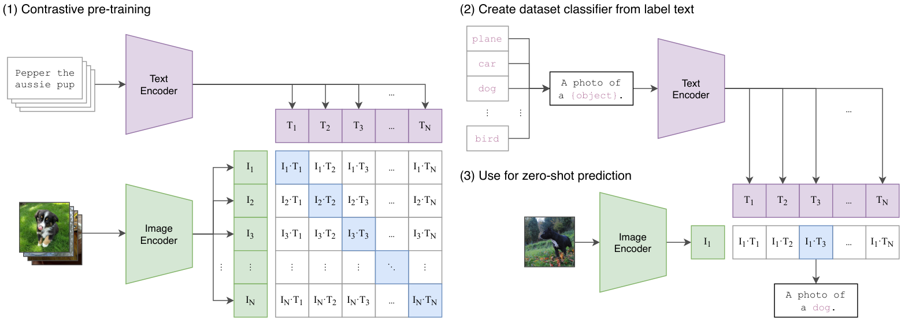
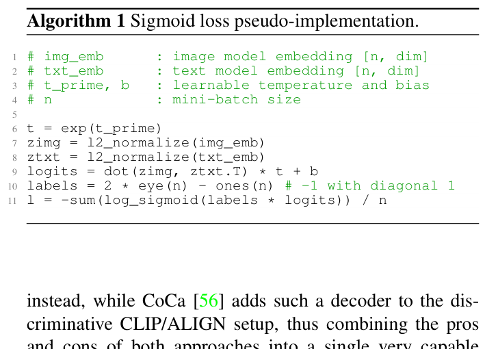
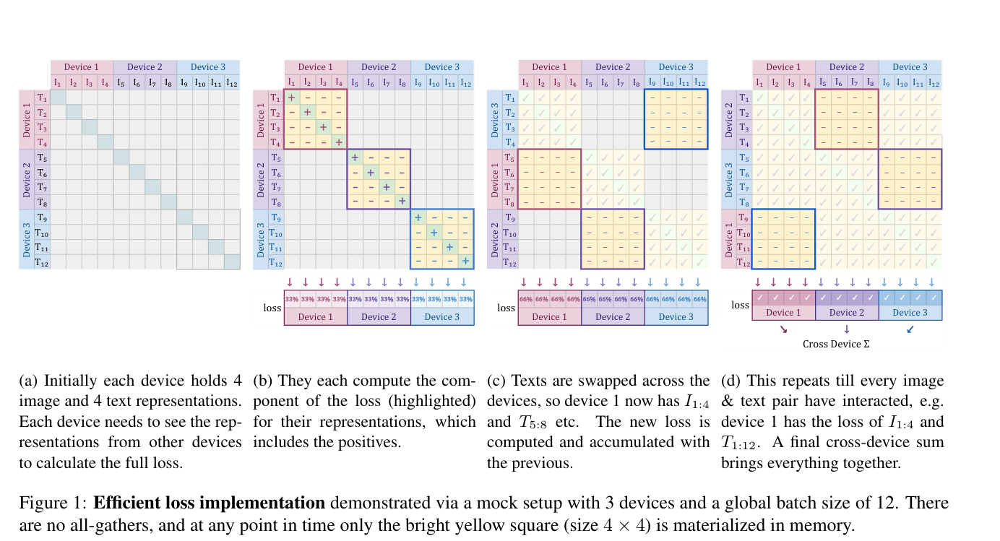

# 01 · 对比预训练

开源 VLM 里用的 vision encoder，绝大多数并不是为了「看图说话」这个任务从零训练出来的，而是取自一台 CLIP / SigLIP 风格的双塔模型的图像那一半。本篇要把这台双塔模型的目标函数讲清楚：CLIP 用的是对称 InfoNCE、可学习的温度参数、以及超大的 batch；SigLIP 又为什么要把 softmax 换成 pairwise sigmoid。读完之后你应该能手写出这两个 loss，并且说清楚它们对「冻结视觉塔」这件事意味着什么。

读这一篇之前，最好已经了解 softmax 和余弦相似度的基本用法。ViT 内部 patchify 的具体过程留在 [`02`](./02_encoders.md)，怎么把这座塔接进 LLM 则是 [`03`](./03_classic_vlms.md) 的内容。

---

## 1. 用自然语言当视觉监督

分类预训练（比如 ImageNet）给每张图打一个类别 id。而互联网上更容易获取、成本也更低的监督信号是图文对 $(I, T)$：一张图配上一句 alt-text 或者 caption。CLIP（Radford et al. 2021, [arXiv:2103.00020](https://arxiv.org/abs/2103.00020)）提出的主张是这样的：

> 不要去预测 caption 里的每一个词——那样做既贵又噪声很大。只需要学会判断「这 $N$ 张图和这 $N$ 句文本里，哪一对才是真正配对的」就够了。

这个想法把视觉预训练收敛成了一个 batch 内部的双向检索问题。



> 图：CLIP 的三个步骤。第一步在 batch 内部做 $N\times N$ 的对比，对角线上是正样本；第二步把类别名套进 prompt 模板，经过文本塔变成分类权重；第三步，新图片只需要过一遍图像塔，就能在共享空间里做最近邻检索。后面提到的所有「冻结 CLIP ViT」，用的都是这座图像塔。（Radford et al. 2021, Fig 1；[arXiv:2103.00020](https://arxiv.org/abs/2103.00020)）

---

## 2. CLIP：对称 InfoNCE

### 2.1 双塔与共享空间

CLIP 有一个图像塔 $f$（ResNet 或者 ViT）和一个文本塔 $g$（12 层 Transformer）。两座塔各自先输出自己的表征，然后都经过一层线性投影（CLIP 没有像 SimCLR 那样用非线性的 projection head）投到同一个维度 $d$ 上，再做 L2 归一化：

$$
\mathbf{x}_i=\frac{f(I_i)}{\|f(I_i)\|_2}\in\mathbb{R}^{d},\qquad
\mathbf{y}_i=\frac{g(T_i)}{\|g(T_i)\|_2}\in\mathbb{R}^{d}.
$$

配对 $(I_i,T_i)$ 的相似度取余弦，再乘上一个可学习的温度：

$$
s_{ij}= t\cdot \mathbf{x}_i^{\top}\mathbf{y}_j,\qquad t=\mathrm{e}^{\tau}.
$$

这里 $\tau$ 是一个标量参数，初始化时使 $t\approx 1/0.07$，训练过程中会不断被优化，并且被 clip 到 $\mathrm{e}^{\tau}\le 100$ 以内。温度的直观含义是：$t$ 越大，softmax 就越尖锐，模型也就越是被逼着把正样本从一堆负样本里精确地「抠」出来。

### 2.2 定义式

考虑一个 batch $B=\{(I_i,T_i)\}_{i=1}^{N}$。对第 $i$ 张图来说，正确的文本是 $T_i$，其余 $N-1$ 句都构成 in-batch 的负样本。图像找文本方向的损失是：

$$
\mathcal{L}_{i\to t}
=-\frac{1}{N}\sum_{i=1}^{N}
\log\frac{\mathrm{e}^{t\,\mathbf{x}_i^{\top}\mathbf{y}_i}}
{\sum_{j=1}^{N}\mathrm{e}^{t\,\mathbf{x}_i^{\top}\mathbf{y}_j}}.
$$

文本找图像的方向只是把分子分母对调（用的是同一张相似度矩阵，只是沿着另一个维度做 softmax）：

$$
\mathcal{L}_{t\to i}
=-\frac{1}{N}\sum_{i=1}^{N}
\log\frac{\mathrm{e}^{t\,\mathbf{x}_i^{\top}\mathbf{y}_i}}
{\sum_{j=1}^{N}\mathrm{e}^{t\,\mathbf{x}_j^{\top}\mathbf{y}_i}}.
$$

总损失是这两个方向的对称平均：

$$
\mathcal{L}_{\mathrm{CLIP}}=\frac{1}{2}\bigl(\mathcal{L}_{i\to t}+\mathcal{L}_{t\to i}\bigr).
$$

这其实就是 InfoNCE（也叫 multi-class N-pair loss）的图文版本。写成伪代码，和论文 Fig 3 是一致的：`logits = (X @ Y.T) * exp(tau)`，`labels = arange(N)`，分别沿 axis=0 和 axis=1 做两次 `cross_entropy` 再取平均。

具体到 shape：`X, Y : [N, d]`，`logits : [N, N]`，softmax 沿着行方向对应「图找文」，沿着列方向对应「文找图」。整个过程里可导的量是两座塔的参数以及 $\tau$，不涉及任何离散选择。

### 2.3 为什么 batch 必须很大

每个正样本的负样本，恰好就是 batch 里其它 $N-1$ 对。所以 $N$ 既决定了「一次参数更新能见到多少个负样本」，也决定了 softmax 分母的宽度。CLIP 用的 batch 大小是 **32768**：分母里塞进了三万多个干扰项，检索任务才会足够难，模型才学得到位。这带来两个直接的工程后果：

- 相似度矩阵是 $N\times N$ 的，朴素实现必须先 all-gather 全部 embedding，才能算出全局的 softmax。
- 分布式实现必须先把 $\mathbf{x},\mathbf{y}$ 集齐，才能开始算 $\mathcal{L}$。这恰恰是 SigLIP 想要改掉的地方。

### 2.4 CLIP 实际训出来的东西

- 训练数据是 4 亿图文对（WIT），并没有用 ImageNet 做初始化。
- 图像塔尝试过 ViT-B/32、ViT-B/16、**ViT-L/14**（后来又在 $336^2$ 上做了一轮 fine-tune，得到 ViT-L/14@336，这也正是 LLaVA-1.5 用的那一版）。
- 文本塔用的是 BPE 词表，大小 49408，最长 76 个 token；推理时靠 prompt template（比如 `a photo of a {class}`）来做 zero-shot 分类。
- zero-shot 分类的做法，本质上是把类别名当成一句「文本」，在共享空间里做最近邻。因此这座图像塔学到的其实是「和自然语言对齐的视觉特征」，而不是 ImageNet 那 1000 类的决策边界——这正是它能够直接拿来当 VLM 视觉前端的原因。

ALIGN（Jia et al. 2021）把同一套 softmax 对比学习方案用到了 18 亿条噪声更大的图文对上，公式和 CLIP 相同，只是数据规模更大、更脏。本章不再单独展开。

---

## 3. SigLIP：把 softmax 换成 pairwise sigmoid

CLIP 的 softmax 有一个天然的限制：它必须看见整个 batch 才能完成归一化。SigLIP（Zhai et al. 2023, [arXiv:2303.15343](https://arxiv.org/abs/2303.15343)）换了个思路，把这个任务改写成 $N^2$ 个相互独立的二分类问题：这一对 $(I_i,T_j)$ 到底是不是配对的？

具体来说，对每一对 $(i,j)$ 定义标签 $z_{ij}=+1$（表示配对）或者 $-1$（表示不配对），损失函数是

$$
\mathcal{L}_{\mathrm{SigLIP}}
=-\frac{1}{N}\sum_{i=1}^{N}\sum_{j=1}^{N}
\log\sigma\bigl(z_{ij}\cdot(t\,\mathbf{x}_i^{\top}\mathbf{y}_j+b)\bigr),
$$

其中 $\sigma(u)=1/(1+\mathrm{e}^{-u})$。写成伪代码（对应论文 Alg. 1）就是：

```
logits = (X @ Y.T) * t + b          # [N, N]
labels = 2 * I - 1                  # 对角 +1，其余 -1
L = -mean(log_sigmoid(labels * logits))
```



> 图：论文里给出的实现。`labels = 2*eye(n)-ones(n)` 把检索问题变成了 $n^2$ 道相互独立的二分类，最后 loss 是除以 $n$ 而不是 $n^2$。因为没有行/列方向的 softmax，所以不必先 all-gather 整个 batch。（Zhai et al. 2023, Alg. 1；[arXiv:2303.15343](https://arxiv.org/abs/2303.15343)）

这里多引入了两个标量：温度 $t$ 和偏置 $b$。它们的初始化是 $t=\log 10$、$b=-10$，目的是从一开始就把「绝大多数 pair 都是负样本」这个先验写进模型里，避免第一步训练就被 $N^2-N$ 个负样本的梯度压垮。

CLIP 和 SigLIP 的关键差别可以总结成下面这张表：

| | CLIP softmax | SigLIP sigmoid |
|---|---|---|
| 每个 pair 是否依赖其它 pair | 是（分母是整行或整列） | 否（是独立的二分类） |
| 要不要 all-gather 全 batch | 要 | 可以按 chunk 计算，不必物化整个 $N\times N$ 矩阵 |
| 小 batch（$N<16\mathrm{k}$） | 负样本不够，效果明显下降 | 更稳定 |
| 最优 batch | CLIP 原始设定是 32k，softmax 要到约 98k 才饱和 | 32k 已经足够，再大到 307k 两边反而都会掉点 |

从概念上讲，softmax 问的是「这 $N$ 句话里哪一句配这张图」（更像多项选择题），而 sigmoid 问的是「这一句话到底配不配」（更像 $N$ 道判断题）。任务的定义不再和 batch 大小绑死。工程上因此还可以按设备做 chunked 循环：每台设备只需要物化自己那一小块 $n_{\mathrm{local}}\times n_{\mathrm{local}}$ 的相似度矩阵，文本表征在设备之间轮转，直到每一对 $(I,T)$ 都被比较过一次为止，全程不需要物化全局的 $N\times N$ 矩阵。



> 图：全局 batch 为 12、用 3 台设备的情形。每一步只计算本机的 4 张图和当前手上的 4 句文本；算完之后把文本 swap 给下一台设备，同时累加 loss。因为 sigmoid 的每一项都是独立的，这种切块方式在数学上和算全集损失是完全等价的。（Zhai et al. 2023, Fig 1；[arXiv:2303.15343](https://arxiv.org/abs/2303.15343)）

SigLIP 的图像塔仍然是 ViT（常见配置是 B/16、SO400M）。InternVL、DeepSeek-VL2、Janus 的理解支路都选用了 SigLIP 家族的视觉塔，原因并不是 sigmoid 本身改变了 patchify 的方式，而是它在中等 batch 规模下更容易训练、学出来的特征也更好用。

SigLIP2-NaFlex（[arXiv:2502.14786](https://arxiv.org/abs/2502.14786)）在这座塔的基础上又加上了可变分辨率的支持（位置编码插值加上多种训练分辨率）。这属于 encoder 侧的改动，具体见 [`02 §2`](./02_encoders.md)。

---

## 4. 视觉塔在 VLM 里的角色

对比预训练的产出是一个 embedding 空间，而不是一个能说话的模型。VLM 真正想要的是塔中间那一层的 patch token 序列 $\mathbf{Z}\in\mathbb{R}^{N\times D}$（丢掉 [class] token 或者 SigLIP 的全局池化输出），再经过 projector 送给 LLM。

这一点会带来三个一直延续到 [`03`](./03_classic_vlms.md) 的事实：

1. 这座塔是靠「图文对齐」训出来的，而不是靠「像素重建」训出来的，所以它擅长表达语义，但不擅长把图片再画回去——这也是 Janus 的生成支路要另外用一套 VQ tokenizer 的原因。
2. 分辨率被写死在位置编码里。CLIP ViT-L/14 是按 $224^2$ 或者 $336^2$ 训练的，$\mathbf{E}_{\mathrm{pos}}$ 的长度是固定的。想要支持更高的分辨率，要么做插值，要么切 tile，要么像 Qwen2-VL 那样换成 2D-RoPE。
3. 早期的 VLM 通常会冻住这座塔。既然对比特征已经和语言对齐过一层，那么只需要训练一个很轻的 projector，就足以让 LLM「看见」图片（LLaVA 的 Stage 1 就是这么做的）。至于解冻 ViT，那是后话，目的是为了提升 OCR 能力和支持动态分辨率，而不是为了重新做一遍对比学习。

顺带一提，LiT（Zhai et al. 2022）是同一个思想的另一种呈现：锁住一个已经训好的图像塔，只训练文本塔去对齐它。SigLiT 就是 LiT 加上 sigmoid 损失。而 VLM 做的事情——锁住图像塔、只训练 LLM 侧的 connector——和 LiT 恰好是对称的。

---

## 5. 实践检查单

1. 写一组 $N{=}4$ 的 $\mathbf{X},\mathbf{Y}$，手算出 CLIP 的 $4\times 4$ logits 矩阵，以及两个方向各自的 softmax，确认对角线上就是正样本。
2. 用同一组数据改算 SigLIP：labels 对角线是 +1、其余是 −1，确认 loss 是 16 项 `log_sigmoid` 的平均值，中间没有出现跨行的归一化。
3. 想一想：如果把 CLIP 的 batch 从 32k 降到 256，分母里的负样本数量会少两个数量级——这正是「对比学习吃 batch」这句话的具体含义。
4. 读 VLM 论文的时候，先找一句话：「视觉塔用的是 CLIP-ViT-L/14@336，还是 SigLIP-SO400M？」这个信息会决定 $P$、$D$ 和默认分辨率，进而决定 [`02`](./02_encoders.md) 里 $N$ 的取值。

## 参考

- Radford et al., [CLIP](https://arxiv.org/abs/2103.00020), 2021.
- Jia et al., [ALIGN](https://arxiv.org/abs/2102.05918), 2021.
- Zhai et al., [LiT](https://arxiv.org/abs/2111.07991), 2022.
- Zhai et al., [SigLIP](https://arxiv.org/abs/2303.15343), 2023.

---

接下来是 [02 · Encoder：像素/音频到变长 token](./02_encoders.md)。这一篇会进入塔的内部，讲清楚 patchify、$N=HW/P^2$、变分辨率以及各种压缩方式。
