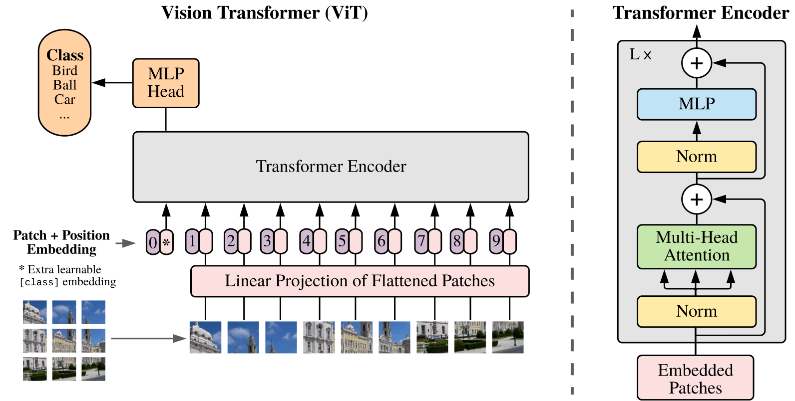
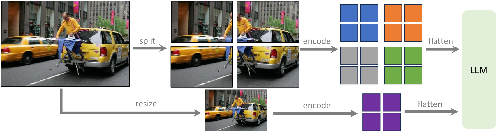
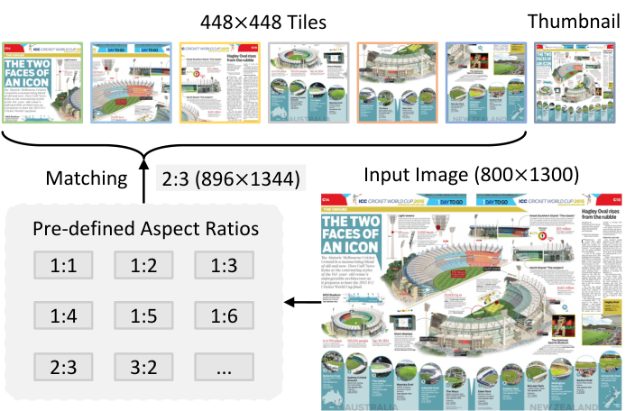
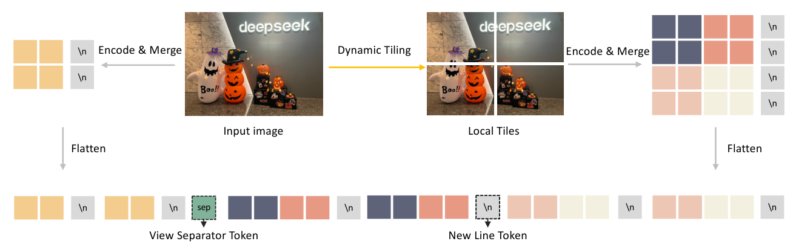
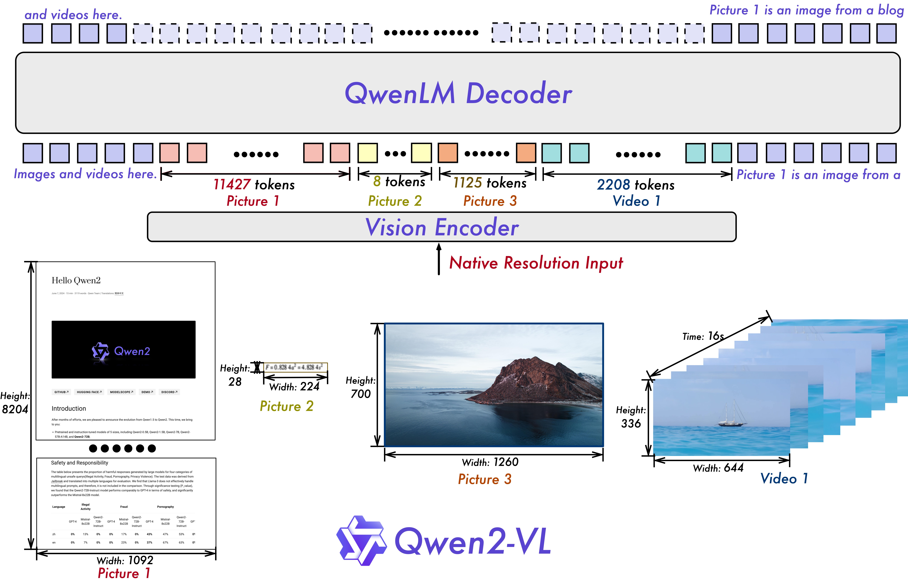
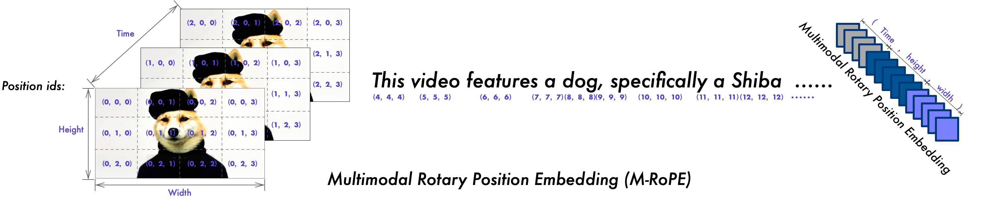
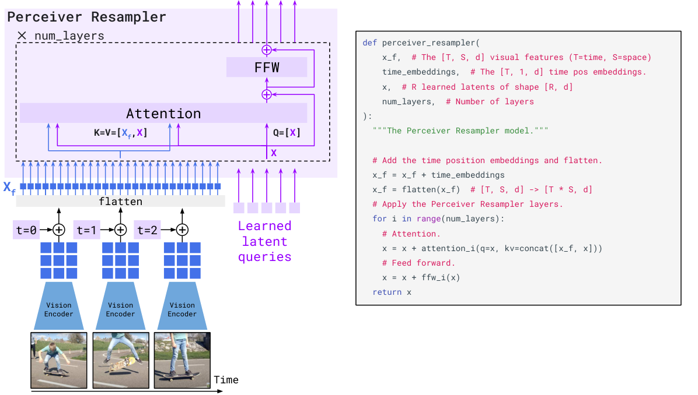

# 02 · Encoder：像素/音频到变长 token

[`01`](./01_contrastive_pretrain.md) 讲清楚了视觉塔是靠对比损失训出来的。本篇要进入塔的内部：ViT 是怎么把一张图切成 patch 的、$N$ 又是怎么随分辨率变化的、各家模型在「细节」和「token 数」之间又是怎么取舍的。音频和视频走的其实是同一条路：先变成一个二维的谱图或者帧序列，再套一个 Transformer。

读这一篇之前，最好已经熟悉 attention 的 QKV 公式，并且看过 [`00`](./00_definitions.md) 里关于①patch embedding、②encoder、③projector 这三者区分的说明。

---

## 1. ViT：从像素到 patch token

ViT（Dosovitskiy et al. 2020, [arXiv:2010.11929](https://arxiv.org/abs/2010.11929)）的核心思路是把 CNN 换成「切 patch 加 Transformer encoder」。VLM 里用的正是这一条数据通路，唯一的区别是分类头会被直接丢掉。



> 图：自下而上依次是 patchify、①投影加上 position embedding、以及 L 层 Encoder。顶部的 MLP Head 只用于分类任务，多模态场景下的 encoder 并不需要它。（Dosovitskiy et al. 2020, Fig 1；[arXiv:2010.11929](https://arxiv.org/abs/2010.11929)）

先固定几个记号：图像 $\mathbf{x}\in\mathbb{R}^{H\times W\times C}$，patch 边长为 $P$，hidden 维度为 $D$，层数为 $L$，头数为 $h$，每个头的维度 $d_h=D/h$。

### 1.1 Patchify 与 token 数量公式

$$
\mathbf{x}\in\mathbb{R}^{H\times W\times C}
\;\xrightarrow{\mathrm{reshape}}\;
\mathbf{x}_p\in\mathbb{R}^{N\times (P^2 C)},
\qquad
\boxed{N=\frac{H}{P}\cdot\frac{W}{P}=\frac{HW}{P^2}}
$$

这里的第 $i$ 行就是第 $i$ 个 $P\times P\times C$ patch 被拉平后的结果。$N$ 就是没有经过任何压缩时的 vision token 数，后面所有关于「变长」的讨论都是从这条公式推出来的。

### 1.2 Patch embedding 等价于 stride-P 卷积

每个 patch 都会经过同一个矩阵 $\mathbf{E}\in\mathbb{R}^{(P^2 C)\times D}$：$\mathbf{x}_p\mathbf{E}:[N,P^2C]\cdot[P^2C,D]\to[N,D]$。这一步在数学上等价于一个 `Conv2d(C, D, kernel=P, stride=P)`。Megatron 的实现是：

[[megatron-lm:megatron/core/models/vision/clip_vit_model.py#L115]]

```python
# upstream: clip_vit_model.py:L115
self.conv1 = torch.nn.Conv2d(in_channels=3, out_channels=D,
                             kernel_size=patch_dim, stride=patch_dim, ...)
```

### 1.3 [class] token 与位置编码

按照论文 Eq.1 的定义：

$$
\mathbf{z}_0=\bigl[\mathbf{x}_{\mathrm{class}};\;
\mathbf{x}_p^{(1)}\mathbf{E};\;\ldots;\;\mathbf{x}_p^{(N)}\mathbf{E}\bigr]
+\mathbf{E}_{\mathrm{pos}},
\qquad
\mathbf{E}_{\mathrm{pos}}\in\mathbb{R}^{(N+1)\times D}.
$$

其中 $\mathbf{E}_{\mathrm{pos}}$ 是一张可学习的查找表，也就是一个 `nn.Embedding(seq_length, D)`（[[megatron-lm:megatron/core/models/vision/clip_vit_model.py#L126]]）。需要注意的是，这里的 `seq_length` 是在初始化时就写死的，这正是固定分辨率这个限制的来源。

VLM 通常会丢掉 [class] token（对应参数 `drop_vision_class_token`）；SigLIP 塔本身在设计上就没有 [class] token。

### 1.4 Encoder block：双向、无 KV

第 $\ell$ 层采用 pre-LN 结构（对应论文 Eq.2–3）：

$$
\mathbf{z}'_\ell=\mathrm{MSA}(\mathrm{LN}(\mathbf{z}_{\ell-1}))+\mathbf{z}_{\ell-1},\quad
\mathbf{z}_\ell=\mathrm{MLP}(\mathrm{LN}(\mathbf{z}'_\ell))+\mathbf{z}'_\ell.
$$

这里的 MSA 是 full attention：$\mathbf{A}_j\in\mathbb{R}^{(N+1)\times(N+1)}$，没有 causal mask，复杂度是 $O(N^2)$。双向意味着这里不能像 LLM 的 decode 阶段那样「算完一个 token 就缓存它的 KV」——整张图必须一次性算完才行。这就是 encoder 的算力画像呈现出「compute-bound、一次性」这个特点的数学根源，[`06`](./06_heterogeneity_and_disaggregation.md) 会用到这一点。

MLP 部分是两层加上 GELU 激活，中间维度通常是 $4D$。

### 1.5 VLM 取的是哪一部分输出

分类任务取的是 $\mathbf{z}_L^{(0)}$。而多模态场景下取的是全部 patch 对应的输出：

$$
\boxed{\mathbf{Z}=\mathbf{z}_L^{(1:N)}\in\mathbb{R}^{N\times D}}
$$

这一串 $\mathbf{Z}$ 会交给③projector，再按照 [`04`](./04_fusion_and_connectors.md) 里介绍的某种 fusion 方式送进 LLM。

### 1.6 量级

| 模型 | 分辨率 | $P$ | 网格 | $N$ |
|---|---|---|---|---|
| ViT-B/16 | $224^2$ | 16 | 14×14 | 196 |
| CLIP ViT-L/14 | $224^2$ | 14 | 16×16 | 256 |
| CLIP ViT-L/14@336 | $336^2$ | 14 | 24×24 | **576**（LLaVA-1.5） |
| SigLIP-SO400M-384 | $384^2$ | 14 | 27×27 | 729 |

可以看到 $N$ 正比于分辨率的平方：分辨率翻一倍，token 数就变成 4 倍，attention 的计算量则变成 16 倍。高分辨率因此会同时推高 encoder 的算力占用和 LLM 的 context 占用。

---

## 2. 变分辨率的三种方案

$\mathbf{E}_{\mathrm{pos}}$ 把 $N$ 写死之后，图片就必须被缩放到固定尺寸，这对 OCR、文档和图表这类场景是难以接受的。目前的改进方案主要有三类：

### 2.1 位置编码插值

做法是把 $\mathbf{E}_{\mathrm{pos}}$ reshape 成 $\sqrt{N_0}\times\sqrt{N_0}\times D$ 的网格，再双线性插值到目标网格 $g_h\times g_w$，最后重新 flatten 回去。FlexiViT、SigLIP2-NaFlex 都是靠这个方法在 $\{128,256,576,\ldots\}$ 这几种训练分辨率之间自由切换。这相当于在「定长权重」和「任意网格」之间架了一座桥，但并没有改变「一张图对应一条序列」这个基本假设。

### 2.2 Tiling / AnyRes

这类方法里，塔本身仍然只吃固定尺寸（比如 336 或者 448），高分辨率的图会被切成若干个 tile，再额外加一张全局的 thumbnail。

**LLaVA-1.5-HD / AnyRes**（[arXiv:2310.03744](https://arxiv.org/abs/2310.03744) Fig 2；后来 LLaVA-NeXT 延续了这个做法）：先选定一个网格（比如 2×2），按照塔原生支持的分辨率把图切块，每一块独立过一遍 CLIP ViT，得到的特征再拼回一张大的 feature map，另外再拼上一张下采样过的全局图。塔本身的位置编码不需要做插值。



> 图：当固定的 CLIP 分辨率不够用时，用「切块加原图 thumbnail」的方式换取更高的有效分辨率，塔本身的权重完全不动。这是 tiling 这条路线在开源社区里的起点。（Liu et al. 2024, Fig 2；[arXiv:2310.03744](https://arxiv.org/abs/2310.03744)）

**InternVL 1.5**（[arXiv:2404.16821](https://arxiv.org/abs/2404.16821)）把候选长宽比做成一个集合 $\{1{:}1,1{:}2,\ldots\}$（训练时最多 12 个 tile，推理时最多 40 个），选出 padding 最小的那个比例，resize 之后切成 $448^2$ 的块，再额外拼一张 thumbnail。



> 图：动态高分辨率的具体操作——匹配长宽比、切 tile、保留全局缩略图。总 token 数等于 tile 数乘以每个 tile 的 token 数。（Chen et al. 2024, Fig 4；[arXiv:2404.16821](https://arxiv.org/abs/2404.16821)）

**DeepSeek-VL2** 把候选分辨率写成集合

$$
C_R=\bigl\{(m\cdot 384,\,n\cdot 384)\mid m,n\in\mathbb{N},\;mn\le 9\bigr\},
$$

选出 padding 最小的 $(m,n)$，得到 $1+mn$ 个 $384^2$ 的 tile（其中一个是全局视图）。当一次输入超过两张图时会关闭 tiling，以免 context 超限。序列里用换行 token 标记行的边界，用 `<|view_separator|>` 隔开全局视图和局部 tile——这样 LLM 看到的就不是一堆杂乱堆叠的 token，而是带有 2D 结构信息的 token 串。



> 图：同一张图会走两条路：整图出一份粗粒度的 token，切块之后再出一份细粒度的 token，中间用 `sep` 分开，每行末尾再加一个 `\n`。可以看到 tiling 不只是「多跑几遍 ViT」这么简单，还需要把空间关系显式地写进序列里。（Wu et al. 2024, Fig 3；[arXiv:2412.10302](https://arxiv.org/abs/2412.10302)）

Tiling 的算力代价是同一座塔要跑 $k$ 遍；总 token 数随 tile 数量线性增长，本质上仍然是变长的。

### 2.3 Native dynamic resolution

**NaViT**（[arXiv:2307.06304](https://arxiv.org/abs/2307.06304)）按图片的原始长宽切 patch，把多张图 pack 进同一条序列，用逐样本的 mask 做出块对角的 attention；位置编码则改成可以分解的 $\boldsymbol{\phi}_x+\boldsymbol{\phi}_y$。

**Qwen2-VL**（[arXiv:2409.12191](https://arxiv.org/abs/2409.12191)）把 ViT 原本的绝对位置编码换成了 2D-RoPE，推理时可以在任意分辨率下直接产出 $N_{\mathrm{raw}}=HW/14^2$ 个 patch，再通过 2×2 merge 压缩到 $N_{\mathrm{raw}}/4$。论文把每张图的视觉 token 数限制在 4 到 16384 之间。具体实现里常用的是像素预算的说法：每个 merge 之后的 token 对应 $28\times28$ 个像素，`min_pixels=4\times28^2=3136` 对应的是下限 4 token，而 `max_pixels` 对齐的是 16384 token 这个上限——注意不要把 3136 误当成上限。文本侧用 `<|vision_start|>` 和 `<|vision_end|>` 把视觉部分包起来。



> 图：Naive Dynamic Resolution——不再先把图缩放到固定尺寸。token 数会随着图片本身变化，这正是数据异构在这里的具体表现形式。（Wang et al. 2024, Fig 2；[arXiv:2409.12191](https://arxiv.org/abs/2409.12191)）

配套的 **M-RoPE** 把 RoPE 原本一维的位置拆成 $(p_t,p_h,p_w)$ 三段，head 维度也相应切成三段分别做旋转。文本的三段是相同的，因此退化成普通的 1D-RoPE；图像的 $p_t$ 保持固定、$(p_h,p_w)$ 沿着网格变化；视频的 $p_t$ 则随着帧数递增。



> 图：同一套旋转位置编码同时覆盖文本、图像、视频三种模态。position id 必须根据每张图真实的网格现场计算，因此和 packing、CP 的切分方式是耦合在一起的。（Wang et al. 2024, Fig 3；[arXiv:2409.12191](https://arxiv.org/abs/2409.12191)）

举一个具体的例子：一张 $224\times224$ 的图会先切出 256 个 $14^2$ 的 patch，除以 4 之后变成 64 个，再加上 2 个 special token，总共是 **66 个 token**。而一张接近 4K 的图（大约 $3840\times2160$）在 16384 的预算内大约会用掉一万量级的 token。同一个 batch 里的两条样本，token 数可以相差两个数量级——这正是 [`07`](./07_variable_length_load_balancing.md) 整章要处理的输入条件。

---

## 3. Token 压缩：定长 vs 变长

一个直观的矛盾是「token 越多，细节越足，但 LLM 也越贵」。解决办法是在 encoder 和 LLM 之间插入一个压缩器：

| 方法 | 机制 | 输出长度 | 是否定长 | 代表 |
|---|---|---|---|---|
| **2×2 merge / pixel-shuffle** | 邻域拼接通道后再投影 | $N/r^2$ | 否 | Qwen2-VL、InternVL |
| **Perceiver Resampler** | $M$ 个 latent query cross-attend $\mathbf{Z}$ | $M=64$ | 是 | Flamingo |
| **Q-Former** | 32 个 query 配 BERT-like 结构 | $M=32$ | 是 | BLIP-2 |

### 3.1 Cross-attention 重采样：输出长度由 query 数决定

$$
\mathbf{Q}=\mathbf{L}\mathbf{W}^Q,\;
\mathbf{K}=\mathbf{Z}\mathbf{W}^K,\;
\mathbf{V}=\mathbf{Z}\mathbf{W}^V,
\qquad
\mathbf{L}\in\mathbb{R}^{M\times D}\ \text{learnable}.
$$

attention 矩阵的形状是 $M\times N$，输出是 $\mathbb{R}^{M\times D}$，和 $N$ 完全无关——这就是「定长」这个说法在数学上的来源。Flamingo 靠它把任意分辨率或者任意帧数的输入都收成 64 个 token，这样一来 backbone 的 context 长度就变得可预测了，代价是高分辨率下的细节会被压没。Q-Former 的训练目标要更复杂一些，具体见 [`03 §3`](./03_classic_vlms.md)。



> 图：视频先逐帧编码，再加上时间 embedding，flatten 成 $X_f$；$R$ 个 latent 做 cross-attn（K/V 是 $[X_f;X]$）。多叠几层，输出仍然是 $R\times D$。这是「变长进、定长出」这个思路的标准实现。（Alayrac et al. 2022, Fig 2；[arXiv:2204.14198](https://arxiv.org/abs/2204.14198)）

### 3.2 Pixel-shuffle

InternVL 的做法是把空间维度折进通道维度，再用一层线性层降回原来的 $D$：

$$
\mathbb{R}^{g_h\times g_w\times D}
\xrightarrow{\mathrm{shuffle},\,r}
\mathbb{R}^{g_h/r\times g_w/r\times r^2 D}
\xrightarrow{\mathrm{linear}}
\mathbb{R}^{g_h/r\times g_w/r\times D}.
$$

当 $r=2$ 时 token 数会变成原来的四分之一。以 $448^2$、$P=14$ 为例，1024 个 patch 会被压缩成 **每个 tile 256 个 token**。DeepSeek-VL2 对每个 729 维的 tile 做同样的 2×2 shuffle，得到每个 tile 196 个 token。

> 目前主流的选择大多是「变长加轻度压缩」（比如 2×2 merge 或者 pixel-shuffle），这样可以保住 OCR 能力，把变长这件事留给 infra 去解决。定长的 resampler 几乎消除了数据异构，但从 2023 年之后就不再是开源社区的默认选择。

---

## 4. 音频：时长与 token 数

音频先被转换成一种「类图像」的二维谱，再经过卷积和 Transformer 处理。这里的 $N$ 正比于音频时长。


> 图：Whisper 的 encoder 是 omni 模型里常见的音频塔。（Radford et al. 2022；[arXiv:2212.04356](https://arxiv.org/abs/2212.04356)）

具体流程是：16 kHz 的波形先做 STFT（25 ms 窗、10 ms hop），再过 mel 滤波，最后取 log。30 秒的音频会变成 3000 帧，经过两层 Conv1d（第二层 stride 为 2）之后，时间维度会减半：

$$
\boxed{30\mathrm{s}\to 1500\ \mathrm{token}=50\ \mathrm{token/s}}
$$

wav2vec2、HuBERT 的 CNN 前端也大约是 50 Hz 的采样率。Qwen2-Audio 从 Whisper-large-v3 初始化，再加一层 stride-2 pooling，大约是 25 token/s。一段 5 分钟的音频大约会产生 15000 个 token，比绝大多数图片都要长。

---

## 5. 视频：空间 × 时间

$$
N_{\mathrm{video}}\approx N_{\mathrm{per\ frame}}\times N_{\mathrm{sampled\ frames}}
$$

很少有模型会逐帧独立编码。Qwen2-VL 的做法是用 2 fps 的采样率配合 depth-2 的 3D conv（把相邻两帧打成一个 tube），单个视频的 token 上限是 16384；一张静止图片会被当成「两帧完全相同」来处理。Flamingo 则是用 1 fps 加上可学习的时间编码，再送进 Perceiver。

在同一个训练 batch 里，纯文本样本可能只有几十个 token，而长视频样本能有上万个 token，两者相差 2 到 3 个数量级。

---

## 6. 小结：token 数量表

| 模态 | $N$ 的标度律 | 典型范围 | 是否变长 |
|---|---|---|---|
| 图（CLIP-336） | 常数 576 | 576 | 否 |
| 图（Qwen2-VL） | $\propto HW/P^2/4$ | 66–16384 | 高 |
| 图（InternVL tile） | $256\times$ tile 数 | 256–10496 | 高 |
| 图（Q-Former / Perceiver） | 常数 $M$ | 32 / 64 | 否 |
| 音频（Whisper） | $50\times$ 秒 | 数百–上万 | 高 |
| 视频 | 每帧 $N$ × 采样帧 | 数千–16384+ | 极高 |

这张表是 [`07`](./07_variable_length_load_balancing.md) 全篇讨论的出发点。而 encoder 本身双向、$O(N^2)$、只算一次、没有 KV 这几个特点，正是 [`06`](./06_heterogeneity_and_disaggregation.md) 要把它从 LLM 里解耦出去的根本原因。

---

接下来是 [03 · 经典 VLM](./03_classic_vlms.md)，会看这座塔具体是怎么被接进 LLM 的：按照设计缺口，依次讲 Flamingo、BLIP-2、LLaVA、InternVL、Qwen2-VL、DeepSeek-VL2、Janus。
