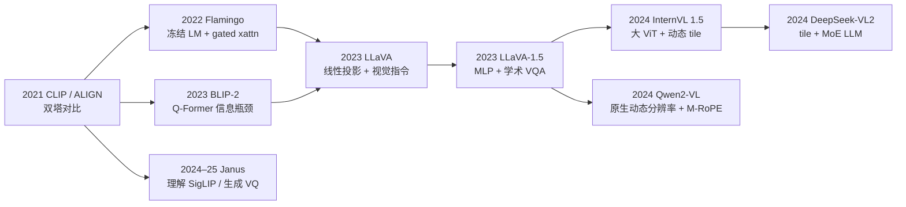
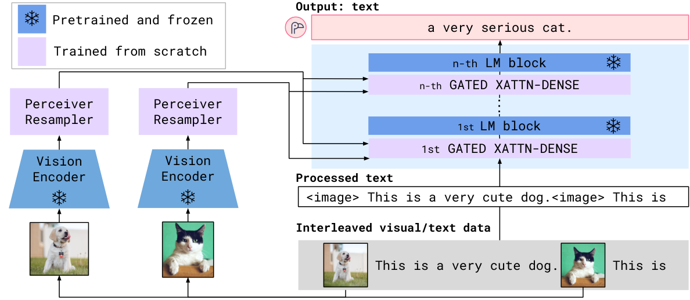
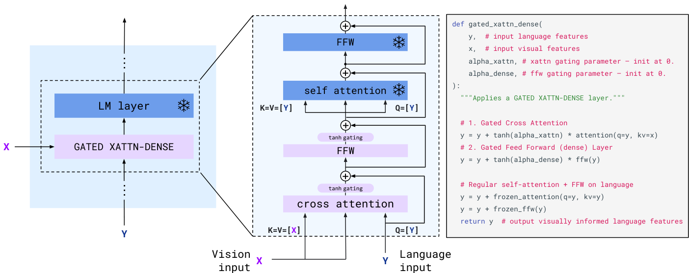
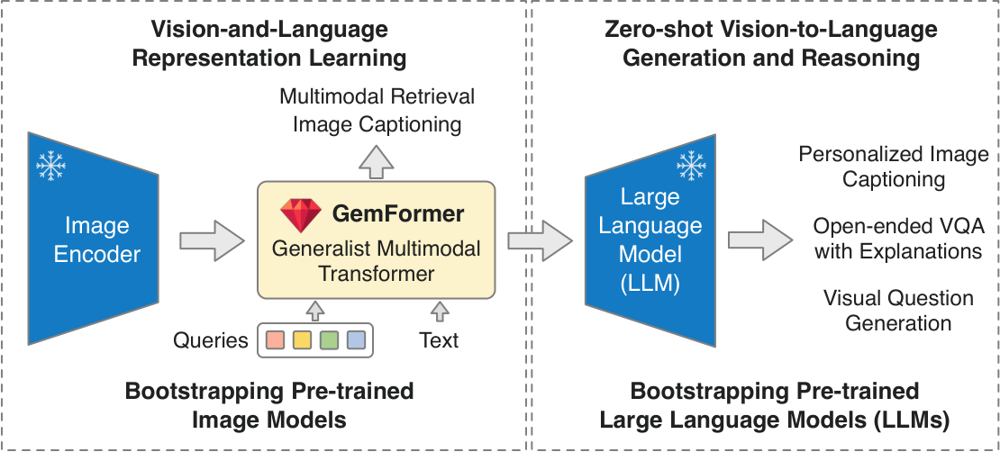
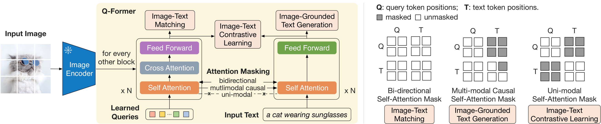
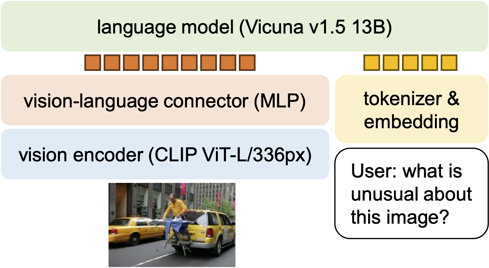
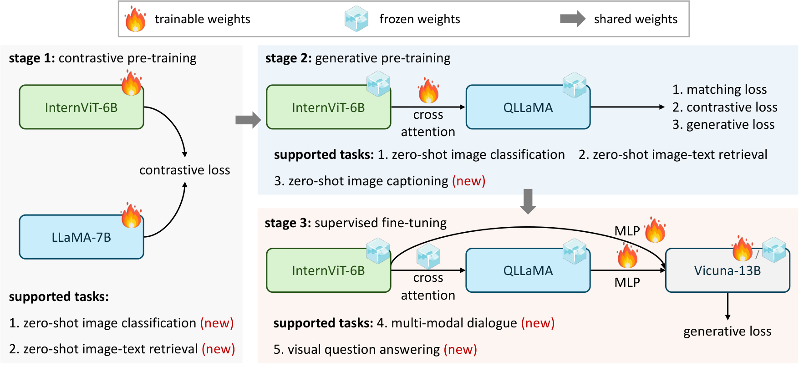
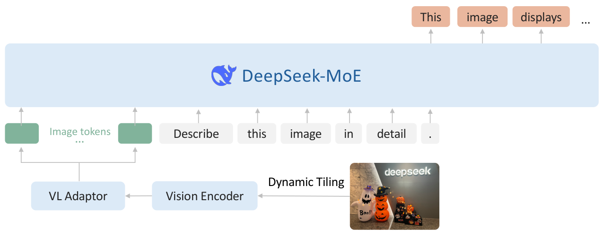
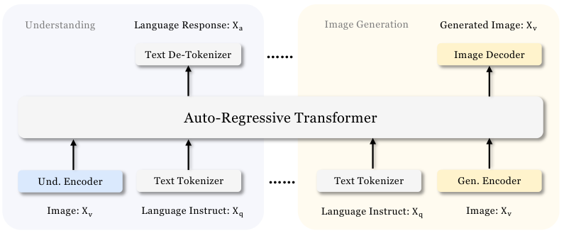

# 03 · 经典 VLM

[`01`](./01_contrastive_pretrain.md) 给出了一座对比训练的视觉塔，[`02`](./02_encoders.md) 给出了它的输出 $\mathbf{Z}\in\mathbb{R}^{N\times D}$。本篇要看的是几个代表性工作是怎么把 $\mathbf{Z}$ 接进 LLM 的。这里只收录那些真正改变了设计空间的模型，不按发表时间堆砌：每一节会先说清楚它补上了设计空间里的哪个缺口，再讲具体的架构和训练配方。至于各种融合范式的完整对照表，留到 [`04`](./04_fusion_and_connectors.md)。

---

## 1. 五个设计缺口

对比训练出来的双塔能做检索和 zero-shot 分类，但没法生成文字。2022 到 2025 年间的开源 VLM，绝大多数都是在补下面这五个缺口中的某一个：

| 缺口 | 问题 | 代表性工作 |
|---|---|---|
| **A. 双塔不会说话** | CLIP 只输出 embedding，没法看图回答问题 | 需要一个 LM decoder |
| **B. 怎么接进冻结 LLM 而不破坏语言能力** | 随机初始化的视觉通路会把预训练学到的东西冲掉 | Flamingo 的 gated xattn；BLIP-2 的 Q-Former |
| **C. 没有视觉指令数据** | 图文对只能学会写 caption，学不会对话 | LLaVA 的 visual instruction tuning |
| **D. 固定分辨率对 OCR 不友好** | $336^2$ 的分辨率读不了文档和表格 | InternVL 的 tile；Qwen2-VL 的原生动态分辨率；DeepSeek-VL2 |
| **E. 理解和生成需要的粒度不一样** | 共享一个 encoder 会让两个任务都做不好 | Janus 拆开两座视觉塔 |

下面这张图大致勾勒出了这些工作之间的传承关系：

下面就按这五个缺口逐一展开。DeepSeek-VL 第一代那种「双分辨率混合塔」的方案（SigLIP-L 384 配 SAM-B 1024）后来被 VL2 的动态 tile 取代，只在 §6 的对照表里简单提一句。

---

## 2. Flamingo：接进冻结 LLM

Flamingo（Alayrac et al. 2022, [arXiv:2204.14198](https://arxiv.org/abs/2204.14198)）可以看作视觉版的「GPT-3 时刻」：一个模型、few-shot 提示、开放式生成，而且它完全不改动预训练 LM 的权重。

> 图：冻结的视觉塔输出变长特征，Perceiver 把它收成固定的 64 个 token；冻结 LM 的层与层之间插入新训练的 cross-attention。语言模型本身的权重完全不动。（Alayrac et al. 2022, Fig 3；[arXiv:2204.14198](https://arxiv.org/abs/2204.14198)）

### 2.1 架构

Flamingo 的架构由三部分组成：

1. **冻结的视觉塔**：用的是对比预训练的 NFNet-F6。对视频以 1 fps 的速率采样，每一帧独立编码，再加上一个可学习的时间 embedding。
2. **Perceiver Resampler**：$M=64$ 个 latent query 对变长的特征做 cross-attend，输出恒定是 64 个 token，具体见 [`02 §3.1`](./02_encoders.md)。
3. **GATED XATTN-DENSE**：插在冻结 LM 的各个 block 之间。文本隐状态 $\mathbf{x}$ 作为 Q，64 个视觉 token $\mathbf{V}$ 作为 K/V：

$$
\mathbf{x}\leftarrow\mathbf{x}+\tanh(\alpha)\cdot\mathrm{CrossAttn}(\mathbf{x},\,\mathbf{V}),
\qquad \alpha\xleftarrow{\mathrm{init}}0.
$$

当 $\tanh(\alpha)=0$ 时，这一项完全消失，也就是说新插入的层在初始状态下等价于原来的 LM。消融实验显示，如果去掉这道门，总分会掉 4.2%，训练也会变得不稳定。Flamingo-9B 每 4 层插一次这样的模块，80B 版本则是每 7 层插一次——这个频率本质上是在「可训练参数量」和「表达能力」之间做权衡。

> 图：新增层的残差被 $\tanh(\alpha)$ 挡住了。这和 DiT 里的 adaLN-Zero「初始化为恒等映射」是同一类思路。（Alayrac et al. 2022, Fig 4；[arXiv:2204.14198](https://arxiv.org/abs/2204.14198)）

4. **image-causal mask**：每个文本 token 只能 cross-attend 紧挨在它前面的那一张图，更早出现的图则要靠 LM 自身的 self-attention 间接看到。训练时最多用 5 张图，推理时能外推到 32-shot。

### 2.2 训练

训练数据是几种类型的混合：对比塔用过的那种图文对、交错排列的图文网页、以及视频文本对。训练目标是标准的 next-token 预测，条件是交错出现的视觉输入。可训练的部分只有 Perceiver 和 gated xattn，相对于 80B 的冻结 LM 来说非常小。

这里留下的设计选择包括：冻结 LM、门控初始化、定长的 resampler、以及交错输入的格式。Llama 3.2 Vision 至今仍然走的是 cross-attention adapter 这条路线。

---

## 3. BLIP-2：另一种接法，Q-Former

BLIP-2（Li et al. 2023, [arXiv:2301.12597](https://arxiv.org/abs/2301.12597)）同样冻结了 ViT 和 LLM，但中间不是像 Flamingo 那样「插层」，而是用一个 188M 参数的 Querying Transformer，把视觉信息压缩成 32 个可以当 soft prompt 用的向量。

> 图：Stage 1 负责对齐视觉和文本；Stage 2 把 query 投影成 LLM 的 prefix。它的可训练参数比 Flamingo-80B 少两个数量级。（Li et al. 2023, Fig 1；[arXiv:2301.12597](https://arxiv.org/abs/2301.12597)）

### 3.1 Q-Former 结构

Q-Former 内部有两个共享 self-attention 的子模块：image transformer（每两层插入一次对冻结 ViT 特征的 cross-attention）和 text transformer。它维护 **32 个可学习的 query**，维度是 768。输出 $Z\in\mathbb{R}^{32\times 768}$ 相对于 ViT-L 的 $257\times 1024$ 是一个明显的信息瓶颈：这些 query 必须学会只抽取「对文本有用」的那部分视觉信息。

### 3.2 Stage 1：三个目标，三种 mask

Stage 1 用同一套参数、三种不同的 self-attention mask（对应论文 Fig 2）来同时优化三个目标：

| 目标 | mask | 在学什么 |
|---|---|---|
| **ITC**（image-text contrastive） | query 与文本互不可见 | 在 $Z$ 的 32 个向量里，取和文本 [CLS] 相似度最高的那一个来做 InfoNCE |
| **ITG**（image-grounded text generation） | query 看不见文本；文本可以看见全部 query 以及自己左侧的文本 | 迫使生成 caption 所需的信息必须先经过 query |
| **ITM**（image-text matching） | 双向，query 和文本全部可见 | 二分类任务「这图配这文吗」，用的是硬负样本 |

如果跳过 Stage 1 直接做 Stage 2，OPT 会出现灾难性遗忘（论文 Fig 5）。相比 Perceiver 只做「压缩长度」这一件事，Q-Former 多做了一件事：为语言任务专门抽取特征。

> 图：左边是结构图，query 流有 cross-attn，文本流没有，两者共享 self-attn。右边是三种 mask：ITC 把 query 和文本隔开，ITG 让文本能看见全部 query 但 query 看不见文本，ITM 则完全双向。同一套参数换一种 mask，就对应了三个不同的训练目标。（Li et al. 2023, Fig 2；[arXiv:2301.12597](https://arxiv.org/abs/2301.12597)）

### 3.3 Stage 2：query 当 soft visual prompt

$Z$ 经过一层全连接投影到 $D_{\mathrm{llm}}$，然后被 prepend 到文本 embedding 的前面。如果是 decoder LLM（比如 OPT），就做标准的 LM loss；如果是 encoder-decoder 架构（比如 FlanT5），则做 prefix LM。LLM 在整个过程中始终保持冻结。VQA 微调阶段会把问题 token 也一并喂给 Q-Former，让 query 能根据问题去有侧重地看图。

和 Flamingo 相比，BLIP-2 的视觉信息进入的是序列头部的 32 个连续 token（可以理解为 early fusion 的定长版本），而不是层间的 cross-attn；和 LLaVA 相比，它的 connector 要重得多，而且 LLM 始终不解冻。

---

## 4. LLaVA 与 LLaVA-1.5：视觉指令跟随

LLaVA（Liu et al. 2023, [arXiv:2304.08485](https://arxiv.org/abs/2304.08485)）的核心主张其实不在于结构上的创新，而在于：用 GPT-4 把图文对扩充成指令数据，再端到端训练一个尽可能简单的架构。

> 图：这是开源 VLM 后来的默认配置。视觉 token 和文本 token 走的是同一条 causal self-attention，没有 Q-Former，也没有插层。（Liu et al. 2023, Fig 1；[arXiv:2304.08485](https://arxiv.org/abs/2304.08485)）

### 4.1 架构：H_v = W Z_v

LLaVA 冻结 CLIP ViT-L/14，取出网格特征 $\mathbf{Z}_v$，然后用一个可训练的矩阵做投影：

$$
\mathbf{H}_v=\mathbf{W}\mathbf{Z}_v,\qquad \mathbf{W}\in\mathbb{R}^{D_{\mathrm{llm}}\times D_v}.
$$

$\mathbf{H}_v$ 直接插入 Vicuna 的 embedding 序列中。在第一轮对话里，图片可以放在问题前面或者后面；之后的几轮对话就不再重复送图了。训练时 loss 只算在 assistant token 上（对应论文 Table 2 里绿色标记的部分）：

$$
p(X_a\mid X_v,X_{\mathrm{instruct}})=\prod_i p_\theta(x_i\mid X_v,X_{\mathrm{instruct},<i},X_{a,<i}).
$$

### 4.2 用文本版 GPT-4 构造指令数据

当时还没有 GPT-4V，LLaVA 的做法是：把 COCO 图片的 captions 和 bounding box 列表当成图像的符号化表示，喂给纯文本的 GPT-4，让它生成三类回答——conversation、detailed description、complex reasoning，一共 158K 条（分别是 58K、23K、77K）。这是「视觉指令跟随」这个任务第一次拥有公开数据。

### 4.3 两阶段训练

| | 冻 | 训 | 数据 |
|---|---|---|---|
| **Stage 1 alignment** | ViT + LLM | 只训 $\mathbf{W}$ | CC3M 筛选后剩 595K，扩展成单轮的「请简述这张图」 |
| **Stage 2 instruction** | ViT | $\mathbf{W}$ + LLM | 158K 条指令数据，或者 ScienceQA |

Stage 1 的作用是给冻结的 LLM 训练一个兼容的 visual tokenizer；真正教会 LLM「按指令说话」的是 Stage 2。

### 4.4 LLaVA-1.5：三处小改动

LLaVA-1.5（[arXiv:2310.03744](https://arxiv.org/abs/2310.03744)）在同一个框架上做了一系列对照实验，得出的结论后来成了开源社区的默认配置：

1. **把线性层换成两层 MLP（配 GELU）**。connector 的表达能力上去了，multimodal 相关的分数也跟着上升。Megatron 里默认的 `projector_type="mlp"`（[[megatron-lm:megatron/core/models/vision/multimodal_projector.py#L47]]）用的就是这个配置。
2. **加入学术 VQA 数据，并配合格式提示**。把 VQAv2、GQA、OCR、region-level 这些数据混进指令数据里，短答案题目末尾会加一句 `Answer the question using a single word or phrase.`。InstructBLIP 只训练 Q-Former、提示又比较含糊，容易过拟合到短答案上、变得不会闲聊；而 LLaVA 解冻了 LLM 并且用了显式的格式提示，两种风格能够共存。
3. **换用 CLIP-ViT-L-336px**，对应 $N=576$。13B 模型在 8×A100 上训练，Stage 1 大约 6 小时、Stage 2 大约 20 小时，用到的公开数据大约 1.2M 条。

> 图：相对原版 LLaVA 的三处改动是相互正交的，合在一起就成了后来 InternVL、Qwen-VL 等模型仍在沿用的「ViT–MLP–LLM」骨架。（Liu et al. 2024, Fig 1；[arXiv:2310.03744](https://arxiv.org/abs/2310.03744)）

留下来的设计是：decoder-only 拼接、轻量级 projector、两阶段训练、以及解冻 LLM。Q-Former 从此不再是必需品。至于缺口 D（分辨率问题），LLaVA-1.5 用 LLaVA-1.5-HD（论文 Fig 2，切块加 thumbnail）做了早期尝试，真正把这条路铺开的是后面的 InternVL 和 Qwen2-VL。

---

## 5. InternVL 与 Qwen2-VL：动态高分辨率

### 5.1 InternVL 1.5：大视觉塔加 tile

InternVL 1.5（Chen et al. 2024, [arXiv:2404.16821](https://arxiv.org/abs/2404.16821)）本质上仍然是 ViT–MLP–LLM 的结构，但把原来 300M 参数的冻结 CLIP 换成了持续预训练过的 **InternViT-6B**（45 层，$448^2$ 分辨率），LLM 用的是 InternLM2-20B。

> 图：结构上仍然属于 LLaVA 家族，差别在于塔的规模更大、支持动态 tile、并且用 pixel-shuffle 把每个 tile 压缩到 256 个 token。（Chen et al. 2024, Fig 3；[arXiv:2404.16821](https://arxiv.org/abs/2404.16821)）

动态 tile 的机制见 [`02 §2.2`](./02_encoders.md)。训练时用 1 到 12 个 tile（对应 256 到 3328 个 token），推理时可以零样本外推到 40 个 tile（10496 个 token）。用 $r=2$ 的 pixel-shuffle，是为了让 4K 分辨率的图也能塞进 context。

视觉塔本身也经过了一轮「连续学习」：丢掉最后 3 层，分辨率从 224 提升到 448，在 caption 和 OCR 数据上和 MLP 一起训练。当 LLM 从 Yi-34B 换成 InternLM2-20B 时，InternViT 仍然可以直接复用——这说明这套视觉特征并没有和某一个特定的语言模型绑死。

### 5.2 Qwen2-VL：原生动态分辨率，统一处理图像和视频

Qwen2-VL（Wang et al. 2024, [arXiv:2409.12191](https://arxiv.org/abs/2409.12191)）不做切 tile 这一套。它的 ViT 大约 675M 参数，绝对位置编码换成了 2D-RoPE，可以在任意 $H\times W$ 下直接产出 patch，再用 2×2 的 MLP merge 压缩，配合 M-RoPE 让图像、视频、文本共用同一套位置编码体系（详见 [`02 §2.3`](./02_encoders.md)）。视频以 2 fps 加 3D conv（depth 2）处理，token 预算上限是 16384。

训练分三个阶段，而且只对文本 token 计算 loss（图像 token 是条件输入，不是预测目标）：

| 阶段 | 规模 | 学什么 |
|---|---|---|
| 预训练 I | 约 600B token | 图文对齐、OCR、分类；LLM 从 Qwen2 初始化，ViT 从 DFN 初始化并改成 RoPE-2D |
| 预训练 II | 再加 800B | 交错图文、VQA、多任务，同时混入纯文本数据以保住语言能力 |
| 指令微调 | ChatML 格式 | 图问答、文档、多图、视频、agent 场景 |

和 LLaVA「冻住 ViT、只训 projector」的做法正相反，Qwen2-VL 在 LVLM 训练阶段就会微调 ViT，否则动态分辨率和 OCR 的效果都上不去。这是解决缺口 D 的另一条路径：不切块，而是直接改造塔本身。

---

## 6. DeepSeek-VL2：动态 tile 配稀疏 LLM

DeepSeek-VL2（Wu et al. 2024, [arXiv:2412.10302](https://arxiv.org/abs/2412.10302)）在 LLaVA 式的 decoder-only 结构上换掉了两个部件：视觉前端换成了动态 tile，语言骨干换成了 DeepSeekMoE 加 MLA。

> 图：视觉侧是一座 SigLIP-SO400M-384 加动态切块；语言侧是 MoE 结构，激活参数分三档：1.0B、2.8B、4.5B。（Wu et al. 2024, Fig 2；[arXiv:2412.10302](https://arxiv.org/abs/2412.10302)）

候选分辨率的集合是 $C_R=\{(m\cdot384,n\cdot384)\mid mn\le 9\}$，选择 padding 最小的那个格子。每个 tile 会产出 729 个 1152 维的 token，经过 2×2 pixel-shuffle 压缩成 196 个。空间结构靠三个特殊 token 显式写进序列（对应论文 Fig 3，见 [`02 §2.2`](./02_encoders.md)）：全局 thumbnail 每一行末尾加一个 `<tile_newline>`（$14\times15=210$ 个），接一个 `<view_separator>`，再拼上局部 $m\times n$ 个 tile 排成的 $14m\times(14n+1)$ 网格，总长度是

$$
210+1+14m\,(14n+1).
$$

以 $m=n=3$ 为例，总长度大约是 $210+1+42\times43 = 2017$ 个 token。当输入超过两张图时，tiling 会被关闭。

第一代 DeepSeek-VL 用的是双塔方案：SigLIP-L@384 提供语义信息，SAM-B@1024 提供细节信息，再把两者拼接起来。VL2 用动态 tile 取代了这种固定双分辨率的做法，避免了「最多只能吃 $1024^2$」这个上限。语言侧的 MoE 和 MLA 涉及的内容更适合放到 [前沿开源模型架构速览](../frontier_open_models.md) 里单独展开；这里只需要记住一件事：视觉配方和语言骨干是可以独立替换的。

---

## 7. Janus：理解与生成解耦

Chameleon 和 Emu3 走的是另一条路：把图像也变成离散 token，用一个自回归 Transformer 统一处理所有模态。这条路的问题在于理解任务需要的是高层语义，而生成任务需要的是 codebook 级别的细节，用一座 encoder 同时服务这两个目标，往往会两头都拖累。

Janus / Janus-Pro（Chen et al. 2024/2025, [arXiv:2410.13848](https://arxiv.org/abs/2410.13848), [arXiv:2501.17811](https://arxiv.org/abs/2501.17811)）把视觉编码拆成两条路，但仍然共用同一个 LLM：

> 图：Und. Encoder（SigLIP-L/16@384 加两层 MLP adaptor）负责看图；Gen. Encoder（VQ，codebook 大小 16384，下采样 16 倍，配另一只 MLP）负责画图。中间共用同一个 DeepSeek-LLM。（Chen et al. 2024, Fig 3；[arXiv:2410.13848](https://arxiv.org/abs/2410.13848)）

理解任务这一路，连续特征直接 flatten 成序列；生成任务这一路，图像被表示成离散 id，训练时对这些 id 做 teacher-forcing，推理时自回归采样，再经过 VQ decoder 还原成像素。Janus-Pro 相对 Janus 的改进主要体现在数据配比、训练日程和模型规模（扩大到 7B），架构本身没有变化。

这可以看作 [`04`](./04_fusion_and_connectors.md) 里「统一离散 token」和「连续拼接」这两条路径之间的一个折中方案：生成任务享受自回归带来的 KV cache 复用，理解任务享受 SigLIP 带来的语义能力，两边都不需要共享同一个 codebook。

---

## 8. 谱系表

| 模型 | 视觉塔 | connector | 融合 | 分辨率 | 训 LLM？ | 训 ViT？ |
|---|---|---|---|---|---|---|
| CLIP | ViT / RN | 对比空间线性层 | 双塔检索 | 固定 | 无 LLM | 是（对比） |
| Flamingo | 冻结 NFNet | Perceiver 64 | gated xattn | 变长→定长 | 否 | 否 |
| BLIP-2 | 冻结 ViT | Q-Former 32 + FC | 定长 prepend | 固定 224 | 否 | 否 |
| LLaVA | 冻结 CLIP-L/14 | 线性 $\mathbf{W}$ | 拼接 | 固定 224 | Stage 2 是 | 否 |
| LLaVA-1.5 | 冻结 CLIP-L@336 | 两层 MLP | 拼接 | 固定 336 / AnyRes | 是 | 否 |
| InternVL 1.5 | InternViT-6B | MLP + pixel-shuffle | 拼接 | 动态 tile | 是 | 持续训 |
| Qwen2-VL | 675M ViT, 2D-RoPE | 2×2 merge MLP | 拼接 | 原生动态 | 是 | 是 |
| DeepSeek-VL2 | SigLIP-SO400M | pixel-shuffle + MLP | 拼接 | 动态 tile $mn\le9$ | MoE LLM | 视配方 |
| Janus-Pro | SigLIP + VQ | 两只 MLP | 拼接（两路） | 固定 384 | 是 | adaptor |

读这张表时可以重点抓住三件事：

1. 2023 年之后，开源社区的默认配置是「拼接加轻量 MLP」，既不是 Flamingo 的插层方案，也不是 Q-Former。
2. 分辨率的演化路径是「固定 → tile → 原生动态」，这是 2024 年的主战场，塔是否解冻也随之变化。
3. 如果要同时支持生成图像，要么把整条流水线都离散化（像 Chameleon 那样），要么像 Janus 那样拆成两座塔。

---

接下来是 [04 · 融合与 connector](./04_fusion_and_connectors.md)。上面每家用的接法各不相同，下一篇会把这些接法收敛成三种融合范式，再看 embedding 具体是怎么被 scatter 进序列的。
