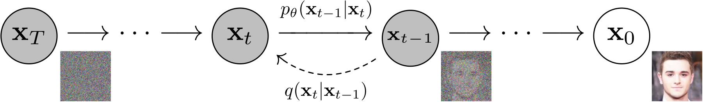
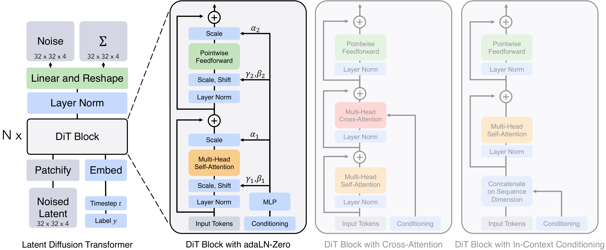
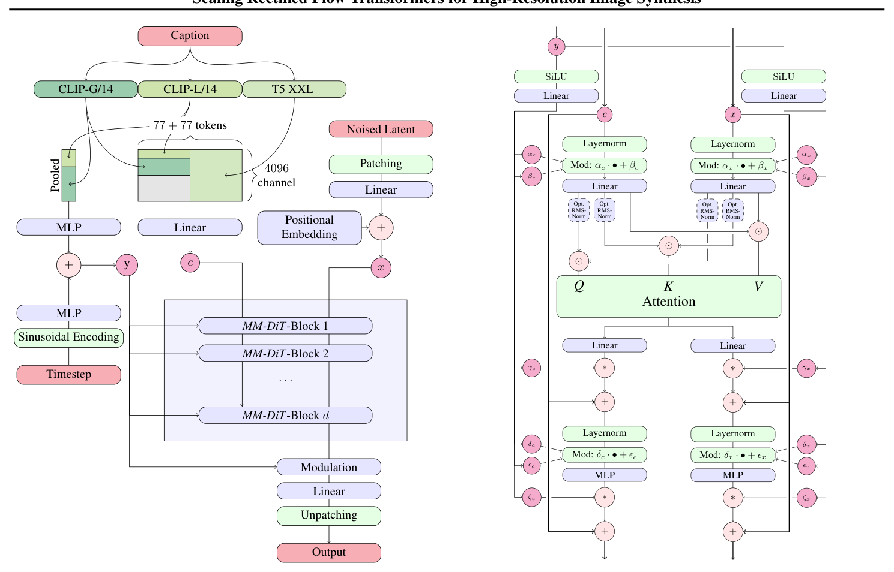
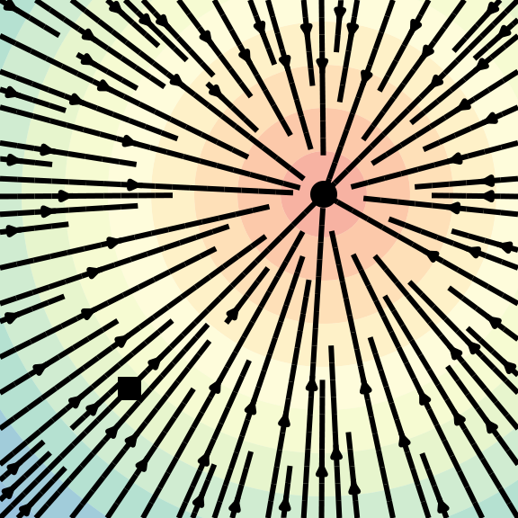
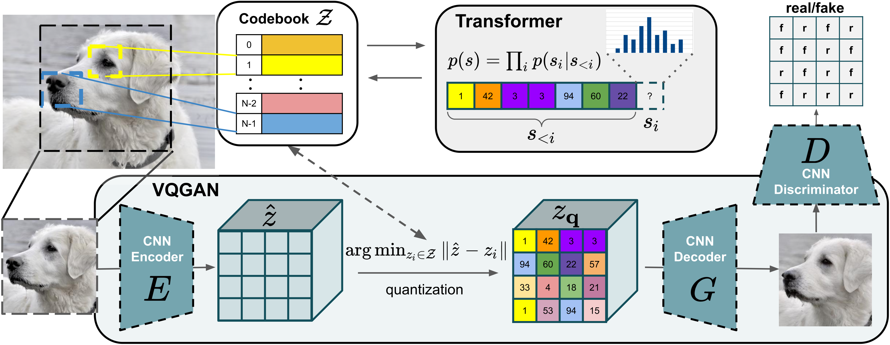

# 05 · 生成器：diffusion / DiT / 自回归图像

流水线的第三段是生成器。omni 模型不止要理解输入，往往还要生成图像、视频或者音频，负责这件事的正是生成器这一段。本篇要把生成器背后的算法讲清楚，并且说明它的算力画像和 LLM 的 decode 阶段恰好相反——迭代、双向、没有 KV。这既是 any-to-any 模型在 diffusion 和自回归之间做选择的依据，也是 [`06`](./06_heterogeneity_and_disaggregation.md) 把它当成第三类独立资源来处理的原因。

要讲清楚这一点，绕不开 diffusion 背后的数学——否则「为什么一次生成要跑 20 到 1000 遍 forward」这句话就无从解释。本篇按照「先定义、后技巧」的顺序，把 DDPM、score、CFG、DDIM、latent diffusion、DiT、flow matching、自回归图像这条线上的核心公式一一讲清楚，每一条公式都会标注它在算力账本里对应的位置。读这一篇只需要本科水平的高斯分布与期望知识，前向/反向过程的定义式和采样步数的来源都会在正文给出。

---

## 0. 两大生成范式

生成器的工作，是从噪声或者起始 token 出发，反向构造出数据。这个任务大体上分成两大范式，它们的算力画像截然不同：

```
扩散/流(连续):  噪声 x_T ──去噪 N 步──► 数据 x_0     每步一次"全量" forward, N=20~1000
                (U-Net / DiT, 双向 attention, 无 KV)

自回归(离散):   <bos> ──逐 token──► img_tok₁ img_tok₂ …  每 token 一次增量 forward, 有 KV
                (transformer, causal, 复用 KV, 同文本生成)
```

| 范式 | 一张图跑几遍 | attention 方向 | KV cache | roofline |
|---|---|---|---|---|
| diffusion / flow | N_steps 遍全量（每步都要对所有 latent token 重新计算） | 双向（非 causal） | 无法复用 | compute-bound、迭代 |
| 自回归（VQ token） | N_tokens 遍增量 | causal | 可复用（同文本） | decode 同 LLM |

这张表值得记住：diffusion 的「贵」体现在 `N_steps × 全量 forward(所有 token)` 这个乘积上，而且双向 attention 决定了它没法像自回归那样复用 KV——每一步都得把所有 latent token 重新算一遍。相比之下，自回归的图像生成和文本 decode 是同构的，能够直接复用 LLM serving 那一整套基础设施（KV cache、continuous batching）。这个差异直接决定了两者在 serving 阶段需要完全不同的资源配置和调度策略。

---

## 1. DDPM：扩散的定义式

DDPM（[Ho et al. 2020, arXiv:2006.11239](https://ar5iv.labs.arxiv.org/html/2006.11239)）把生成过程拆成两条马尔可夫链：前向加噪是固定的、没有可学习参数；反向去噪则是需要学习的部分。



> 图：左边是纯噪声 $x_T$，右边是真实数据 $x_0$。虚线 $q(x_t\mid x_{t-1})$ 表示固定的加噪过程，实线 $p_\theta(x_{t-1}\mid x_t)$ 表示要学习的去噪过程。采样时就是从左边一路走到右边，每一步对应网络的一次 forward。（Ho et al. 2020, Fig 1；[arXiv:2006.11239](https://arxiv.org/abs/2006.11239)）

前向过程用一张固定的方差表 `β_1..β_T`，把数据一步步推向纯高斯噪声：

```
q(x_t | x_{t-1}) = N(x_t ; √(1-β_t)·x_{t-1}, β_t·I)            (Eq.2)
```

记 `α_t = 1-β_t`，`ᾱ_t = ∏_{s≤t} α_s`，就可以得到一个闭式的跳步公式——在训练时非常关键，因为它允许从 $x_0$ 一步直接采样到任意时刻 $t$：

```
x_t = √ᾱ_t · x₀ + √(1-ᾱ_t) · ε,    ε ~ N(0, I)               (Eq.4)
```

这里的 shape 和语义需要先说清楚：`x_t` 和原始数据同形（可以是一张图，也可以是一块 latent）；`ε` 是同形状的高斯噪声；`ᾱ_t ∈ (0,1]` 是单调递减的，当 `t→T` 时 `ᾱ_t→0`，也就是说 `x_T` 已经近似于纯噪声。

反向过程则是要学一个去噪器，把噪声一步步还原成数据：

```
p_θ(x_{t-1} | x_t) = N(x_{t-1} ; μ_θ(x_t, t), Σ_θ)            (Eq.1)
```

DDPM 的一个关键参数化选择是：不直接回归均值，而是让网络 `ε_θ(x_t, t)` 去预测当初加进去的那个噪声 `ε`，于是

```
μ_θ = (1/√α_t)·( x_t − β_t/√(1-ᾱ_t) · ε_θ(x_t, t) )          (Eq.11)
```

这样一来，训练目标就塌缩成了一个非常简单的噪声回归 MSE，这也是工程上真正在跑的 loss：

```
L_simple = E_{t, x₀, ε} [ ‖ ε − ε_θ( √ᾱ_t·x₀ + √(1-ᾱ_t)·ε , t ) ‖² ]    (Eq.14)
```

从算力账本的角度看，训练阶段只需要对随机采样的 `t` 跑一遍 `ε_θ`（采一个 t、加噪、预测、算 MSE）就够了。真正贵的是采样阶段——按照 Eq.11 的公式，要从 `x_T` 一步步走到 `x₀`，需要跑 T 遍（原版是 1000 遍）`ε_θ`（对应 Alg.2）：

```
x_{t-1} = (1/√α_t)·( x_t − (1-α_t)/√(1-ᾱ_t)·ε_θ(x_t,t) ) + σ_t·z      (Alg.2 采样)
```

这正是 [README §0](./README.md) 里「generator 一次请求跑 20 到 1000 遍」这句话的出处：采样过程就是串行执行 N_steps 次去噪网络的 forward。`ε_θ` 本身是一个双向网络（U-Net 或者 DiT），每一步都要对全部 latent token 重新计算一遍，步与步之间没有任何可以复用的中间结果。

---

## 2. score-based 视角

Song et al.（[arXiv:2011.13456](https://ar5iv.labs.arxiv.org/abs/2011.13456)）把离散化的扩散过程推广到了连续时间的 SDE 上：

```
前向 SDE:        dx = f(x,t) dt + g(t) dw                       (Eq.5)
反向 SDE:        dx = [ f − g²·∇_x log p_t(x) ] dt + g·dw̄        (Eq.6)
probability-flow ODE: dx = [ f − ½g²·∇_x log p_t(x) ] dt        (Eq.13)
```

这里核心的未知量是 score，也就是 `∇_x log p_t(x)`（对数密度的梯度），网络 $s_\theta$ 要学习的正是它。score 和 noise 之间可以互相换算（这一段连接了两套语言，出自 Luo 的 tutorial [arXiv:2208.11970](https://arxiv.org/abs/2208.11970) 以及 Yang Song 的博客，而不是 SDE 的原始论文）：

```
s_θ(x_t, t)  ≈  − ε_θ(x_t, t) / √(1-ᾱ_t)
```

VP-SDE 离散化之后就是 DDPM（Eq.11 已经给出了对应关系）。从 infra 的角度看，score 和 noise 只是同一个网络的两种不同解读方式，采样本质上仍然是「解一个反向 SDE 或者 ODE，等价于跑 N 步网络」。这里的 probability-flow ODE 把原本随机的采样过程变成了一个确定性的 ODE，是后面 DDIM 以及少步数采样方法的理论入口。

---

## 3. classifier-free guidance（CFG）

文生图任务要求生成结果服从某个条件 `c`（通常是文本 prompt）。CFG（[Ho & Salimans 2022, arXiv:2207.12598](https://ar5iv.labs.arxiv.org/html/2207.12598)）的做法是：训练时以概率 `p_uncond` 把条件丢成空集 ∅，让网络既学会有条件生成，也学会无条件生成；采样时再把这两者外推组合起来：

```
ε̃_θ(x_t, c) = (1+w)·ε_θ(x_t, c) − w·ε_θ(x_t, ∅)             (Eq.6)
等价实现:    ε̂ = ε_θ(∅) + s·( ε_θ(c) − ε_θ(∅) ),  s = 1+w
```

（Stable Diffusion 默认的 guidance scale 是 `s=7.5`，对应 `w=6.5`。）

从 infra 账本的角度看，这一步很重要：CFG 让每一个去噪 step 都要跑两遍 `ε_θ`（一遍有条件、一遍无条件），所以实际采样时网络 forward 的总次数大约是 `2 × N_steps`。工程实现上通常会把这两遍拼进 batch 维一起算（batch=2），这也是 diffusion serving 里 batch 维度的一个固定来源。

---

## 4. DDIM：把 1000 步压到 20~50 步

DDPM 原始的 1000 步采样实在太慢。DDIM（[Song et al. 2020, arXiv:2010.02502](https://ar5iv.labs.arxiv.org/html/2010.02502)）基于 probability-flow ODE 的思想，给出了一种非马尔可夫、且可以做成完全确定性的采样方式：

```
x_{t-1} = √α_{t-1}·(predicted x₀) + √(1-α_{t-1}-σ_t²)·ε_θ(x_t,t) + σ_t·ε     (Eq.12)
```

这里有一个容易踩的记号陷阱：DDIM 论文里裸写的 `α_t` 实际上对应的是 DDPM 里的 `ᾱ_t`（也就是累乘后的值），而不是单步的 `α_t`。引用的时候一定要注意对齐。

当 `σ_t = 0` 时，采样就变成完全确定性的了，而且这时候可以跳步（在一个子序列上走），大约 20 到 100 步就能逼近 1000 步 DDPM 的生成质量。

从 infra 账本的角度看，DDIM 把 `N_steps` 从 1000 砍到了 20 到 50，这是 diffusion 能够被真正部署到 serving 场景的前提。但即便是 20 步配合 CFG 的两遍计算，也相当于 40 遍全量 forward，仍然远比自回归「每个 token 一次增量计算」要贵得多——这正是 diffusion serving 始终是 compute-bound、延迟以秒计的根本原因。

---

## 5. latent diffusion / Stable Diffusion：在压缩过的 latent 上做扩散

直接在 512×512×3 的像素空间上跑扩散代价太大。Stable Diffusion（[Rombach et al. 2022, arXiv:2112.10752](https://ar5iv.labs.arxiv.org/html/2112.10752)）的做法是先用一个 VAE 把图片压缩到低维的 latent 空间，再在 latent 上做扩散：


> 图：扩散过程发生在 VAE 的 latent 上；条件经过 $\tau_\theta$ 变成 K/V，U-Net 的各层用 cross-attention 把条件注入进去。像素空间只负责编码和解码，去噪本身的算力会随着下采样因子 $f^2$ 大幅降低。（Rombach et al. 2022, Fig 3；[arXiv:2112.10752](https://arxiv.org/abs/2112.10752)）

```
z = E(x),  downsample f=8:   512×512×3  ──►  64×64×4   (latent)
条件 loss:  L = E[ ‖ ε − ε_θ(z_t, t, τ_θ(y)) ‖² ]                 (Eq.3)
条件注入(cross-attn):  Q = W_Q·φ(z_t),  K = W_K·τ_θ(y),  V = W_V·τ_θ(y)
```

latent 比像素空间小 $f^2=64$ 倍，扩散网络（U-Net）需要的算力也随之下降了两个数量级——这正是文生图能够真正跑起来的工程关键。文本条件 `y` 经过一个 text encoder $\tau_\theta$（Stable Diffusion 用的是冻结的 CLIP ViT-L/14）变成 K/V，再由 U-Net 各层的 cross-attention 注入。这里值得留意的是：这个用来注入条件的 cross-attention，和 [`04`](./04_fusion_and_connectors.md) 里讲的融合用的 cross-attn，其实是同一种机制，都是把条件信息接进模型的通用工具。

---

## 6. DiT：把 U-Net 换成 Transformer

DiT（[Peebles & Xie 2022, arXiv:2212.09748](https://ar5iv.labs.arxiv.org/html/2212.09748)）把扩散模型里的去噪网络从卷积 U-Net 换成了 Transformer，是 Sora、SD3 这些模型的骨架：



> 图：左边是 patchify latent 加上 $N$ 个 DiT block；中间是默认的 adaLN-Zero 结构，从 $t,c$ 回归出 $\gamma,\beta,\alpha$，其中 $\alpha$ 初始化为 0，使得 block 在训练开始时等价于恒等映射。这和 Flamingo 里的 $\tanh(\alpha)$ 门控是同一类「插入瞬间不破坏主干」的技巧。（Peebles & Xie 2023, Fig 2；[arXiv:2212.09748](https://arxiv.org/abs/2212.09748)）

- **patchify latent**：把 `32×32×4` 的 latent 切成 $T=(I/p)^2$ 个 token，之后的处理就是标准的 ViT 流程了，和 [`02`](./02_encoders.md) 里讲的 patchify 是同构的。
- 条件信息（timestep `t` 加上类别或文本 `c`）经过 adaLN-Zero 注入：从 `t,c` 回归出每一层 LayerNorm 的 `γ,β`，外加一个逐维度的门控 `α`，并且 MLP 的初始化让 `α=0`，这样每个 DiT block 在初始状态下都等价于恒等映射，训练也就更稳定。
- 从 infra 的角度看，DiT 让生成器和 backbone 在结构上变得同构（两者都是 transformer），理论上可以复用同一套并行方案和 kernel。但它本质上仍然是双向 attention 加迭代去噪，所以算力画像依然属于 generator 那一类：没有 KV、需要 N 步全量计算。SD3 的 MMDiT（[arXiv:2403.03206](https://ar5iv.labs.arxiv.org/html/2403.03206)）进一步用了双流结构（文本流加图像流）的 block：



> 图：SD3 的 MM-DiT。文本流 $c$ 和图像流 $x$ 各自走一套独立的权重，只在 attention 计算时拼在一起；timestep 加上池化后的文本变成调制向量 $y$。（Esser et al. 2024, Fig 2；[arXiv:2403.03206](https://arxiv.org/abs/2403.03206)）

---

## 7. flow matching / rectified flow

flow matching（[arXiv:2210.02747](https://ar5iv.labs.arxiv.org/html/2210.02747)）和 rectified flow（[arXiv:2209.03003](https://ar5iv.labs.arxiv.org/html/2209.03003)）是 SD3、Flux 等最新一批模型采用的范式。它们的核心思路是：与其学一条弯曲的扩散反向路径，不如直接学习从噪声到数据的直线插值所对应的速度场：



> 图：flow matching 学习一个速度场，把噪声分布搬运到数据分布。当路径接近直线时，ODE 积分所需的步数可以变得很少——这正是把 $N_{\mathrm{steps}}$ 从几十步压缩到个位数的理论入口。（Lipman et al. 2023, Fig 1；[arXiv:2210.02747](https://arxiv.org/abs/2210.02747)）

```
插值路径(SD3 取向: 数据在 t=0, 噪声在 t=1):   x_t = (1-t)·x₀ + t·x₁
目标速度场:                                  v = x₁ − x₀  (常向量, 直线!)
CFM 目标:                                    L = E‖ v_t(x) − u_t(x|x₁) ‖²        (Eq.9)
```

这里也有一个取向约定需要注意：Lipman 和 Liu 的原始论文把数据放在 t=1 这一端，而 SD3 反过来，把数据放在 t=0、噪声放在 t=1，所以对应的 `v = x₁ − x₀`。引用时要留意方向是否一致。

路径是直线意味着 ODE 积分所需的步数可以非常少（理论上一步 Euler 积分就够），采样因此更快，训练目标也更简单（不再需要维护那张方差表）。从 infra 的角度看，flow matching 进一步压低了 `N_steps`，缓解（但没有彻底消除）diffusion 迭代带来的成本；网络结构仍然是 DiT 或者 U-Net，算力画像本身没有变化。

---

## 8. 自回归图像生成

还有一条完全不同的生成路径：把图像离散化成 token，用 transformer 像写文本一样逐个 token 生成。

- **VQ-VAE**（[arXiv:1711.00937](https://ar5iv.labs.arxiv.org/html/1711.00937)）：encoder 输出连续的 `z_e`，量化到最近的 codebook 向量 `z_q = e_k`，其中 `k = argmin_j ‖z_e − e_j‖`。loss 由重建损失、codebook 损失、commitment 损失组成，梯度靠 straight-through 估计传递。
- **VQGAN**（[arXiv:2012.09841](https://ar5iv.labs.arxiv.org/html/2012.09841)）：在 VQ-VAE 基础上加入 LPIPS 感知损失和 patch-GAN，再用一个自回归 transformer 建模 token 序列 `p(s) = ∏ p(s_i | s_<i)`。
- **DALL-E**（[arXiv:2102.12092](https://arxiv.org/abs/2102.12092)）：用 dVAE 把 256² 的图片压缩成 32×32=**1024 个 token**（codebook 大小 8192），再用自回归 transformer 建模 `[≤256 文本 token ; 1024 图像 token]` 这条序列——本质上就是文本 LLM 那套配方。
- **MaskGIT**（[arXiv:2202.04200](https://arxiv.org/abs/2202.04200)）：改用双向 masked token 加并行迭代解码，大约 8 轮就能完成（对比自回归的 256 轮），介于自回归和 diffusion 之间。



> 图：先把图片量化成 codebook 下标，再用自回归 transformer 建模 $p(s)=\prod_i p(s_i\mid s_{<i})$。这正是「图像等于离散 token」这个思路的来源。（Esser et al. 2021, Fig 2；[arXiv:2012.09841](https://arxiv.org/abs/2012.09841)）

这一点在 infra 层面上很关键：纯自回归的图像生成（DALL-E、Chameleon、Emu3）和文本 decode 完全同构——都是 causal attention，KV cache 都可以复用，continuous batching 也同样适用。所以它可以直接塞进现有的 LLM serving 技术栈，这也是 any-to-any 统一模型（见 [`04 §2.3`](./04_fusion_and_connectors.md)）在 infra 层面最大的吸引力。代价是图像质量会受到 codebook 大小和光栅扫描顺序的限制。

---

## 9. 小结

| 生成范式 | forward 次数 | attention | KV | 能否复用 LLM serving 栈 |
|---|---|---|---|---|
| DDPM | ~1000 × (CFG 2) | 双向 | 无 | 否 |
| DDIM/flow + DiT | 20~50 × (CFG 2) | 双向 | 无 | 否（需专门 diffusion serving） |
| 自回归 VQ token | N_tokens 增量 | causal | 可复用 | 是（同文本 decode） |

这里有两条结论直接影响 [`06`](./06_heterogeneity_and_disaggregation.md) 的讨论：

1. diffusion / flow 这类生成器构成了第三类算力：迭代、双向、无 KV、compute-bound、延迟以秒计。它和 encoder（一次性、compute-bound）、prefill（吞吐导向）、decode（串行、memory-bound）这三者都不相同，必须当作一类独立的资源来解耦。BigMac 之所以在训练里把 generator 当成和 encoder 并列的第三个并行域，正是出于这个原因。
2. 自回归生成器则更像是 backbone 的自然延伸：它能够复用 KV 和 batching，是走向结构同构化的一条捷径。选择 diffusion 还是自回归生成，本质上是在「质量」和「infra 简洁性」之间做取舍，这条脉络和 [`04`](./04_fusion_and_connectors.md) 里讲的融合范式取舍是一致的。Janus 选择自回归生成路线（见 [`03 §7`](./03_classic_vlms.md)），走的正是这条同构化的思路。

到这里，算法层面的底座就搭建完了。接下来 [`06`](./06_heterogeneity_and_disaggregation.md) 会正式进入 infra 部分：这四种算力画像凑在一起之后，为什么必须要把它们解耦开来。

---

接下来是 [06 · 异构与 stage 解耦](./06_heterogeneity_and_disaggregation.md)，会把 `00`–`05` 讲到的「四种算力画像」收拢成一个核心问题：模型异构。它会讲清楚模型异构带来的两类气泡，以及训练侧（DistTrain / Optimus / BigMac 等）和推理侧（EPD / ModServe 等）不约而同地用「stage 解耦」来解决这个问题的思路。
