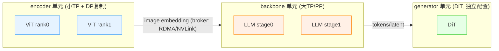

# 06 · 异构与 stage 解耦

`00`–`05` 这几篇已经说清楚了一个事实：一条多模态流水线里其实塞着四种截然不同的算力画像——encoder 是一次性的 compute-bound，prefill 追求吞吐，decode 是串行的 memory-bound，generator 则是迭代式且没有 KV（详见 [README §0](./README.md)）。本篇要讲的是这几种画像凑在一起带来的第一个、也是最根本的 infra 问题：模型异构。训练侧和推理侧面对这个问题时，不约而同地给出了同一个解法：stage 解耦（disaggregation），也就是让每一段独立配置资源和并行策略。

这一篇是全章 infra 部分的主线，看完之后应该建立起这样一个判断：只要一个系统里同时跑着算力画像差异巨大的几段，单一的并行方案或者单一的 colocation 部署就必然造成浪费，解耦几乎是唯一的出路。这个判断在训练侧（DistTrain / Optimus / BigMac）和推理侧（EPD / ModServe）里其实是同一句话的两种落地方式。

---

## 0. 模型异构与两类气泡

如果把三段流水线简单地放在一套统一的 TP/PP/DP 配置上（这是最朴素的做法，相当于把 encoder 和 generator 当成 backbone 的几个普通层来对待），就会产生两类气泡，这是 DistTrain（[arXiv:2408.04275](https://arxiv.org/abs/2408.04275)）的提法：

```
统一并行(坏):
  GPU 按 backbone 的"宽层"配置 (大 TP, 大显存)
    encoder 是"窄层"(hidden 小) ──► 放上去 SM 吃不满, 算力浪费   ← 气泡①: 多模态段欠载
    backbone 等 encoder 把 image embedding 算完才能开工 ──► 干等   ← 气泡②: backbone 被依赖卡住
  实测 production MFU 低到 ~20%
```

第一类气泡来自资源错配：encoder 和 generator 的层比较「窄」（hidden dim 较小），却被迫用为 backbone「宽层」准备的大 TP、大显存配置的 GPU 去跑，算力利用率天然上不去。第二类气泡来自依赖串行：backbone 的第一层依赖 encoder 的输出（也就是 [`04 §4`](./04_fusion_and_connectors.md) 里讲的那个 scatter 环节），只要 encoder 没算完，backbone 就只能空转；generator 又反过来依赖 backbone 的输出。数据依赖把这三段串成了一条串行链。

这些系统给出的解法思路是一致的：既然三段的算力画像不同，那就不应该让它们共享同一份资源配置。做法是把每一段切成独立的并行单元，各自选择最优的 TP/PP/DP、各自分配合适规格和数量的 GPU，段与段之间通过通信 broker 来传递那个 scatter 环节产生的张量。



之所以能够干净地把三段切开，是因为段与段之间唯一的强耦合就是 [`04 §4`](./04_fusion_and_connectors.md) 里讲的那个 scatter 步骤——encoder 的输出说到底只是一块「待 scatter 的 embedding 张量」。只要把这块张量当成一条跨单元传输的消息，三段就自然解耦成了一条由 broker 连接起来的流水线。训练场景下的 broker 通常是 RPC/RDMA 加自定义 collective，推理场景下则是 KV/embedding transfer（比如 mooncake 或者 nixl），虽然具体形式不同，但背后的思路是一致的。

---

## 1. 训练侧解耦：四个代表系统

训练侧解耦的目标是最大化 MFU 和吞吐，让每一段 GPU 都保持繁忙、把前面提到的两类气泡都消掉。下面这四个系统从不同角度切入这个问题，彼此之间是互补的关系。

### 1.1 DistTrain：解耦编排与数据重排

DistTrain（PKU 与 StepFun 合作，SIGCOMM 2025）可以看作「stage 解耦」在训练侧最完整的一次实现。

它做了解耦模型编排：encoder、backbone、generator 各自成为独立的并行单元，拥有自己的 DP/TP 配置，串成一条 pipeline，段间用 comm broker 桥接。举一个具体的例子，4 块 GPU（DP2,TP2）分给 encoder，12 块 GPU（DP3,TP4）分给每一个 backbone stage，4 块 GPU 分给 generator。

它还解决了资源分配求解的问题：目标是在 GPU 和显存约束下最小化每次迭代的耗时。这个原问题是非凸的，DistTrain 的做法是把 TP 限制在 `{1,2,4,8}` 这几个值、把 DP 限制为 batch 的因子，从而枚举出有限组合，每个组合在 `1/x,1/y,1/z` 上是凸的，用 CVX 求解——整个过程能在亚秒级出解（1296 GPU 规模下只需要 922ms）。

数据重排解决的是数据异构的问题（详见 [`07`](./07_variable_length_load_balancing.md)）：只调整梯度累积的顺序（这一步是可交换的，不会改变收敛结果），把变长样本在 DP 组之间、microbatch 之间重新分配，以此削平 straggler。

运行时层面，CPU producer 节点异步做预处理和重排，GPU consumer 节点专心训练，两者之间通过 RPC over RDMA 通信；通信用的是自研的 StepCCL，借助 GPU DMA 引擎实现通信和计算的 overlap；再配合 ZeRO-1 和异步 checkpoint。

最终的结果是：72B 规模的 MLLM 在 1172 块 GPU 上跑出了 54.7% 的 MFU、最高 2.2 倍的吞吐提升（相对 Megatron-LM 单体方案）。其中编排本身单独贡献了 1.3 到 2.7 倍的 MFU 提升，预处理把数据准备的耗时从「秒」级降到了「毫秒」级。

DistTrain 把「解耦」这个动作里的三个部分——拆分单元、求解最优配置、段间通信——全部做齐了，是理解后面所有系统的一个基线，后续的系统大多是在其中某一环上做得更精细。

### 1.2 Optimus：把 encoder 塞进 LLM 的流水线气泡

Optimus（ByteDance 与 Harvard，[arXiv:2408.03505](https://arxiv.org/abs/2408.03505)）观察到一个现象：即便做了解耦，encoder 到 LLM 之间的依赖关系仍然会在 LLM 的 PP 里留下气泡（实测超过 40% 的 GPU 周期是气泡）。它的做法是把 encoder 的计算调度进 LLM pipeline 的空隙里。

具体来说，encoder 和 LLM 各自拥有独立的并行计划（约束条件是 `PP_enc | PP_llm`、`TP_enc | TP_llm`，方便嵌套）。一个两阶段的 bubble scheduler 把 encoder 层拆解到 kernel 粒度，塞进大约 300μs 的 TP 气泡里，并且做依赖检查（确保 encoder 的 forward 必须早于它所服务的那次 LLM forward）。

最终结果是：ViT-22B 配 GPT-175B 在 3072 块 GPU 上，迭代时间下降了 21.3%，MFU 达到 34.6%（相比 Megatron 的 28.5%）。这是少数几个报告出真实生产规模 MFU 数字的系统。

### 1.3 Cornstarch：frozen-aware 流水线与 token 均衡 CP

Cornstarch（密歇根大学，[arXiv:2503.11367](https://arxiv.org/abs/2503.11367)）抓住了一个经常被忽略的事实：VLM 训练里 encoder 常常是被冻结的，只训练 projector，这一点在 [`00 §6`](./00_definitions.md) 已经提过。

它的第一个招是 frozen-aware PP：冻结层在 backward 时只需要算出「传给上游的数据梯度」，不需要算「参数梯度」，两者的计算成本并不一样。Cornstarch 把 backward 拆成「可以跳过的参数梯度」和「必须计算的数据梯度」两部分，据此重新平衡 PP stage 的边界——如果单纯按层数均分，会让冻结的 encoder stage 太闲、解冻的 LLM stage 太忙。

它的第二个招是 token workload-balanced CP：在变长且非因果的多模态 attention 上，用 ILP（以 128-token 的块为粒度，用贪心的 Longest-Processing-Time-First 方法求解）来均衡各个 CP rank 的 token 负载，具体见 [`07`](./07_variable_length_load_balancing.md)。

最终结果是：相对 SOTA 平均取得了 2.26 倍的吞吐提升（其中 frozen-aware PP 单独最高能达到 2.46 倍）。

### 1.4 BigMac：打破算力效率与显存之间的取舍

BigMac（PKU，和 DistTrain 同源）把问题归纳成了一个 Pareto 取舍：追求「算力高效」的设计（比如解耦 encoder 的 Optimus）必须保留所有 encoder 激活，激活显存是 `O(M/P)`（$M$ 是 microbatch 数，$P$ 是 PP 度），一旦 batch 变大就会 OOM；而追求「显存高效」的设计（比如把 encoder 作为首个 PP stage，类似 Megatron-DistTrain 的做法）激活是 `O(1)`，但又会回到算力互相干扰、迭代时间被最慢的一段卡住的老问题。

BigMac 给出的方案是依赖安全的嵌套流水线：encoder、LLM、generator 各自作为独立的并行域（LLM 用 PP，encoder 和 generator 用 DDP/FSDP）。它把 encoder 和 generator 的算子按照 `pp_size` 个 microbatch 分组，嵌入到 LLM 的 interleaved-1F1B 调度里而不新增气泡，放在满足跨模块依赖关系的最早时间点上。只需要预热 `W=3` 个 encoder forward 单元、每当一个 backward 就绪就配对下一个 forward，这样一来只需要保留 3 个 encoder 单元加 1 个 generator 的激活，也就是 $O(1)$ 的显存占用，同时还能逼近「无限显存」这个理想情形下的时序表现。

此外它还引入了 Decoupled Context Parallelism（各模块用不同的 CP 组，通过 all-to-all 做转换）以及 FSDP 的「单边 pull」机制（用 NVSHMEM 的 get 操作替代集合式的 all-gather，去掉在 packing 或者 MoE 负载不均时会产生气泡的同步 barrier）。

最终结果是：Qwen3-30B-A3B 配 1.3B ViT 和 20B MMDiT 在 128 块 H800 上取得了 1.08 到 1.9 倍的加速，并且显存能随着 batch 大小稳定增长（作为对比，Optimus 在 per-GPU batch 超过 8 时就会 OOM）。目前生产线上已经用它在 1536 块 H800 上训练了一个 345B 的 MLLM，超过 18000 次迭代。

### 1.5 训练侧系统对比

| 系统 | 核心手段 | 主攻气泡 | 代表数字 | 规模 |
|---|---|---|---|---|
| **DistTrain** | 解耦编排 + 凸优化配资源 + 数据重排 | ①②+数据异构 | MFU 54.7%, 2.2× | 1172 GPU |
| **Optimus** | encoder 塞进 LLM 气泡（kernel 粒度） | ② 依赖气泡 | MFU 34.6 vs 28.5 | 3072 GPU |
| **Cornstarch** | frozen-aware PP + token 均衡 CP | ②+冻结不均 | 2.26× 平均 | 24 GPU |
| **BigMac** | 依赖安全嵌套流水线 → O(1) 激活 | ①②+显存墙 | 1.08~1.9×，稳显存 | 1536 H800（生产） |
| **Spindle** | wavefront 调度（多任务+多模态 DAG） | inter+intra 异构 | 67% vs Megatron | 64 A800 |

值得补充一句，Spindle（[arXiv:2409.03365](https://arxiv.org/abs/2409.03365)）补上了「任务间加任务内」这个双重异构的维度：它把统一的任务 DAG 收缩成 MetaOps/MetaLevels，用分段的 α-β 可扩展性建模加上 malleable-project-scheduling 松弛来分配资源。当模型不只涉及多模态、还涉及多任务时，这个系统最贴合需求。

---

## 2. Megatron 代码：encoder 如何落到独立 PP stage

Megatron 的多模态 PP 切分并不是靠一个统一的 `--encoder-pp-size` 开关，而是靠 `LLaVAModel` 的两个构造标志：

```python
# llava_model.py:116-117 / examples/multimodal/model.py:19
LLaVAModel(..., add_encoder=True, add_decoder=True, pre_process=True, post_process=True)
```

其中 `add_encoder` 决定本 rank 是否构造 vision_model 和 projector（[[megatron-lm:megatron/core/models/multimodal/llava_model.py#L275]] 起）；`add_decoder` 决定本 rank 是否构造 language_model（[[megatron-lm:megatron/core/models/multimodal/llava_model.py#L222]] 起）；`pre_process` / `post_process` 则标记 LLM 这一段是不是流水线里的首个或末个 chunk（用来控制 embedding 层和输出层的构造）。

框架会按照 pipeline rank 给不同的 rank 设置不同的标志：让前面的 rank 设成 `add_encoder=True, add_decoder=False`（专门跑 ViT），后面的 rank 设成 `add_encoder=False, add_decoder=True`（专门跑 LLM），这样就实现了「encoder 独占前几个 PP stage」的效果。`_preprocess_data`（[[megatron-lm:megatron/core/models/multimodal/llava_model.py#L482]]）的 docstring 明确处理了这种切分方式下「谁负责更新 embedding、谁负责更新 label」的问题（[`04 §4.1`](./04_fusion_and_connectors.md) 已经引用过）。

这正是 §1 里各个训练系统的底层基础：`add_encoder/add_decoder` 让 encoder 和 LLM 落在不同的 rank 集合上，是「独立并行单元」这个概念在 Megatron 里的最小实现。DistTrain、Optimus 等系统都是在这个基础之上，再叠加独立的 TP/DP 配置、跨单元 broker 和调度策略。

---

## 3. 推理侧解耦：EPD（Encode-Prefill-Decode）

推理侧解耦的目标变成了最大化 goodput 和满足 SLO（TTFT、TPOT）。serving 领域早已有 P-D 分离（把 prefill 和 decode 拆开，见 [`serving`](../serving/README.md)）；多模态场景下则需要再往前拆一段——把 encode（视觉或者音频编码）也独立出来，这就是 EPD 解耦。

### 3.1 encode 和 prefill 合并的代价

如果把 encode 和 prefill 部署在一起（这是最朴素的做法），会带来两个问题（参考 EPDServe，[arXiv:2501.05460](https://arxiv.org/abs/2501.05460)）：一是串行干扰导致队头阻塞——一个 encode 很重的视频请求，会把整条 prefill 队列都堵住；二是显存争用——encoder 权重、LLM 权重、KV cache 挤在同一批 GPU 上，互相争抢资源。

而且 encode 的开销占比相当可观。ModServe（[arXiv:2502.00937](https://arxiv.org/abs/2502.00937)）的实测数据显示，encoding 占 TTFT 的比例分别是 79%（Llama3.2-11B）、65%（90B）、54%（NVLM-D-72B）；如果把 encoder 从 SigLIP-400M 换成 InternViT-6B，编码延迟还会上涨 10 倍。encode 显然是一个不容忽视的独立大头。

### 3.2 EPDServe：三个资源池与三个机制

EPDServe 把整条流水线拆成 E、P、D 三个专用资源池，各自只加载自己需要的权重（E 池：encoder + MM cache；P 池：LLM + MM cache + KV；D 池：LLM + KV）。段与段之间做异步传输：EP-migration 负责把视觉 token 传给 prefill，PD-migration 负责把 KV 和首个 token 传给 decode。它有三个关键机制：

IRP（Intra-Request Parallelism）把一条请求的图像 patch 切分到多个 encode worker 上并行编码（数据并行方式），到了 prefill 处再合并起来，用它替代了 encoder 侧的 TP。如果关掉这个机制，TTFT 最多会差 2.9 倍。资源分配方面，它在一个 goodput 模拟器上用贝叶斯优化搜索 E/P/D 的配比（这是对 DistServe 思路的扩展），关掉之后 goodput 会降低 2.2 倍。动态角色切换能够在不到 0.7 秒内把一批实例从 `5E1P2D` 切换成 `2E1P5D`，关掉之后延迟会差 2.2 倍。

最终结果（在 8×A100 上，用 MiniCPM-V 2.6、InternVL2-8B/26B 测试，对比 vLLM 单体方案和 DistServe）：峰值显存降低 15 倍、batch 提升 22 倍、单请求支持的图片数提升 10 倍、KV 容量提升 2.2 倍、TTFT 最多降低 71%。

### 3.3 ModServe：模态与阶段感知的自动扩缩

ModServe（微软）做了目前最深入的系统画像分析，并且把这些分析真正落到了调度策略上。

它把实例拆成 Image Instances（负责 CPU 预处理和 GPU encode）和 Text Instances（负责 prefill 和 decode）两类，各自独立扩缩。token 感知的自动扩缩策略是：副本数等于模态负载除以 SLO 容量向上取整，按照 token 吞吐（而不是请求率）每 5 分钟调整一次。模态感知的路由策略是：把请求路由到当前 image-token 负载最低的实例；对 decoder-only 模型按总 pending token 路由，对 cross-attn 模型按纯文本 token 路由（这呼应了 [`04`](./04_fusion_and_connectors.md) 里两种融合方式在序列长度上的差异）。

它还发现每一段最优的 TP 配置是不同的：Llama3.2-11B 实测 prefill 用 TP-8、encode 用 TP-4、decode 用 TP-1 最优；而 projector 占 TTFT 不到 0.4%，因此不需要单独解耦，直接和 LLM 放在一起就行。

最终结果是：在 128 块 GPU 上取得了 3.3 到 5.5 倍的吞吐提升，成本节省 25% 到 41.3%（在满足 P99 TTFT SLO 的前提下）；当 image:text 负载比超过 2.4 时，相比单体方案最高能有 18.4 倍的优势；比起纯粹的 P-D 分离方案，TTFT 还能再改善 2.8 倍。

### 3.4 生产系统：跨请求 embedding 复用

学术系统里的缓存大多只是单请求的传输缓冲区，而生产系统进一步做了按 image hash 跨请求复用 encoder 输出这件事（详见 [`08`](./08_caching_redundancy_memory.md)）：

| 实现 | 形态 | 亮点 |
|---|---|---|
| **vLLM 原生 EPD**（PR #25233） | vision encoder 独立服务；纯文本请求跳过 | Embedding Cache 按 image hash 组织（请求只带 hash，不带像素）；4×A100 上 Qwen3-VL-4B 四图场景 goodput 提升 2 倍 |
| **NVIDIA Dynamo** | 首个在 vLLM 上落地 EPD | embedding 经 NIXL(RDMA) 传输；支持 E/PD 与 E/P/D，跨 vLLM/SGLang/TRT-LLM |
| **SGLang EPD** | 三段 VLM 拆解，encoder server 独立水平扩缩 | 见 §4.1 的真实代码 |
| **LMSYS 异构 EPD**（2026-06） | 把 vision encode 卸载到 CPU（Dynamo + SGLang） | encode 是 compute-bound 的，正好可以吃 CPU 算力 |

---

## 4. 代码实现：两套真实系统

### 4.1 SGLang：独立的 encode server

SGLang 把 encode 解耦做成了一组真实的文件，位于 [[sglang:python/sglang/srt/disaggregation/]] 下：

`MMEncoder`（[[sglang:python/sglang/srt/disaggregation/encode_server.py#L220]]）是一个独立的多模态编码服务。它在 `__init__` 里建立 `MultiModalStaticCache`（[[sglang:python/sglang/srt/disaggregation/encode_server.py#L293]]，容量由 `SGLANG_VLM_CACHE_SIZE_MB` 控制，默认 4096MB）来缓存 embedding，再按照 `encoder_transfer_backend`（[[sglang:python/sglang/srt/disaggregation/encode_server.py#L324]]，可以是 mooncake 或者 nixl）把 embedding 传给下游的 prefill。

`EncoderBootstrapServer`（[[sglang:python/sglang/srt/disaggregation/encode_receiver.py#L52]]）负责 encoder 实例的注册、发现和健康检查（提供 `/register`、`/health` 等接口），让 prefill 端能够动态找到可用的 encoder server，这正好对应了 §3.3 里「独立水平扩缩」的说法。`encode_grpc_server.py` 则是 encode 侧的 gRPC 入口。

在前向计算这一环，`general_mm_embed_routine` 的 `enable_adaptive_dispatch_to_encoder`（[[sglang:python/sglang/srt/server_args.py#L878]]）会把「已经由 encode server 预先算好的 embedding」和「需要现算的」两种情况分流处理（[`04 §4.2`](./04_fusion_and_connectors.md) 已经引用过），decode 阶段则会直接短路——这就是 EPD 在前向计算里的具体落点。

### 4.2 vLLM：EC（Embedding-Cache）Connector

vLLM 的原生 EPD 实现（PR #25233）走的是「EC Connector」这套抽象，它和 vLLM 已有的 KV Connector（用于 P-D 分离）在结构上是同构的，只是传输的内容从 KV 变成了 encoder 的 embedding。

`ECConnectorBase`（[[vllm:vllm/distributed/ec_transfer/ec_connector/base.py#L59]]）定义了 producer 和 consumer 两种角色（`ECConnectorRole`，[[vllm:vllm/distributed/ec_transfer/ec_connector/base.py#L42]]）：producer（也就是 encoder 实例）通过 `save_caches` 把 embedding 存出去；consumer（也就是 prefill 实例）通过 `start_load_caches`（[[vllm:vllm/distributed/ec_transfer/ec_connector/base.py#L140]]，在 `_gather_mm_embeddings` 之前调用）按照 `mm_hash` 把 embedding 取回来，再用 `has_cache_item`（[[vllm:vllm/distributed/ec_transfer/ec_connector/base.py#L198]]）判断是否命中缓存。

worker 侧的 [[vllm:vllm/v1/worker/ec_connector_model_runner_mixin.py]] 把 EC connector 接进了 model runner 的前向流程，负责 embedding 的注入和导出。scheduler 侧（[[vllm:vllm/v1/core/sched/scheduler.py]]）则用 `_try_schedule_encoder_inputs`（[[vllm:vllm/v1/core/sched/scheduler.py#L1280]]）在 encoder 的计算预算（`max_num_encoder_input_tokens`，[[vllm:vllm/v1/core/sched/scheduler.py#L218]]）约束下决定这一步要编码哪些图，编码完成的结果交给 `EncoderCacheManager`（[`08 §1.2`](./08_caching_redundancy_memory.md)）处理。这实际上把「encoder 到底该跑多少」变成了一份和 prefill chunk 类似的、可调度的算力预算（[`07 §5.1`](./07_variable_length_load_balancing.md)）。

对照 §2 的内容可以看到：训练侧用 `add_encoder/add_decoder` 把 encoder 切到独立的 rank 上；推理侧 SGLang 用 `encode_server.py`、vLLM 用 `ECConnectorBase` 把 encoder 切成独立的服务或者角色。三边做的其实是同一件事：把 [`04 §4`](./04_fusion_and_connectors.md) 那个 scatter 步骤变成了一道跨进程、跨机器的消息边界。vLLM 把它和已有的 KV Connector 复用同一套抽象，也进一步说明 EPD 本质上就是「P-D 分离再往前多拆一段」。

---

## 5. 小结

| | 训练侧 | 推理侧 |
|---|---|---|
| 优化目标 | MFU / 吞吐 | goodput / SLO(TTFT,TPOT) |
| 解耦的段 | encoder / backbone / generator | encode / prefill / decode |
| 段间传什么 | image embedding（梯度也回传） | embedding（EP）、KV+首 token（PD） |
| broker | RPC/RDMA + StepCCL | mooncake / NIXL(RDMA) |
| 配资源 | 凸优化/枚举（DistTrain）、BO | 贝叶斯优化（EPDServe）、token 感知扩缩（ModServe） |
| 代表 | DistTrain/Optimus/Cornstarch/BigMac | EPDServe/ModServe/vLLM/Dynamo |
| 代码 | [[megatron-lm:megatron/core/models/multimodal/llava_model.py]] add_encoder/decoder | SGLang [[sglang:python/sglang/srt/disaggregation/encode_server.py]]、vLLM [[vllm:vllm/distributed/ec_transfer/ec_connector/base.py]] |

把这一整篇收束成一句话：模型异构意味着单一并行方案或者单一 colocation 部署必然浪费，解法是把算力画像不同的几段解耦成独立的资源单元，再用 broker 把它们连接起来。训练和推理只是同一个思路在两种场景下的具体实例。

---

接下来是 [07 · 变长输入与负载均衡](./07_variable_length_load_balancing.md)。解耦解决了模型异构的问题，但 [`02`](./02_encoders.md) 里那个逐样本剧烈波动的 token 数 $N$（也就是数据异构）依然存在。下一篇会讲 sequence packing、数据重排、OmniBal 的三方面均衡、token 均衡 CP，以及推理侧按 image-token 负载做调度和路由的做法。
