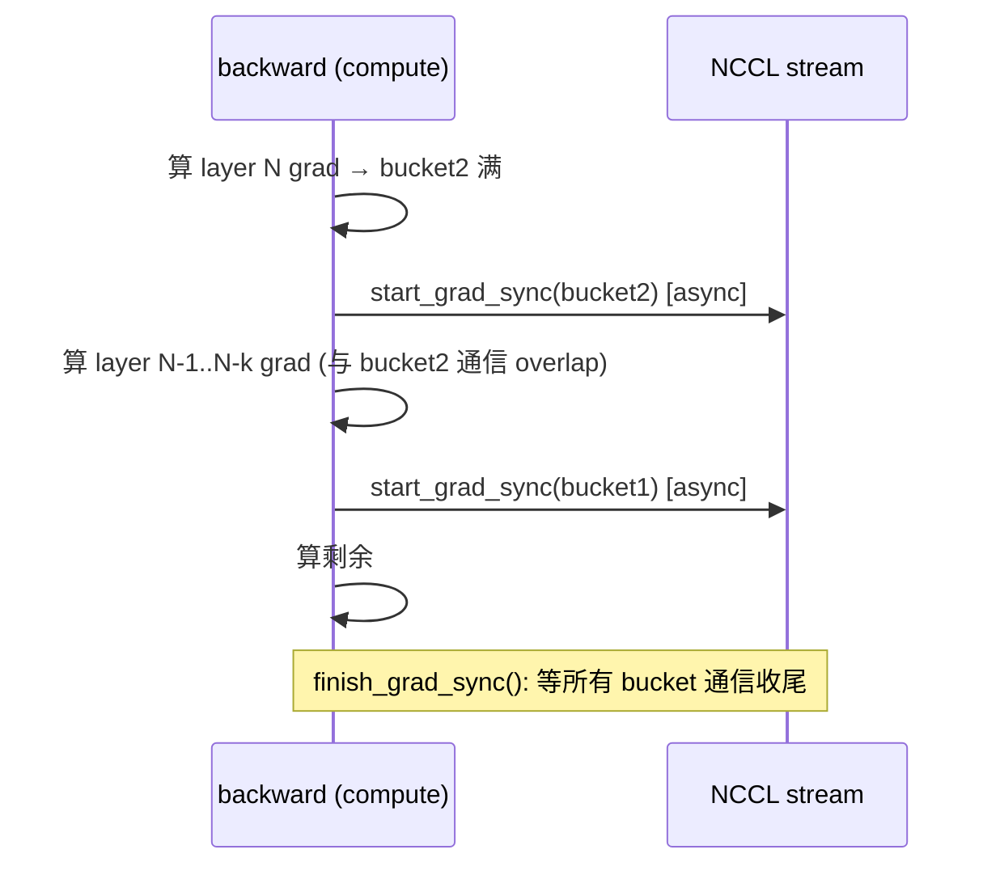
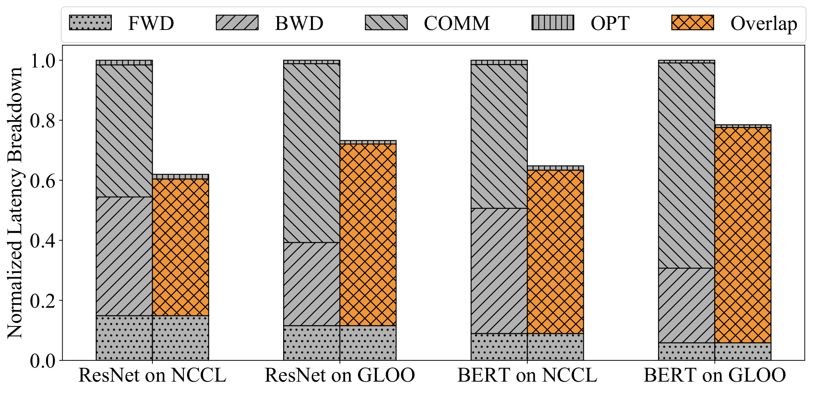

# 01 · Megatron DDP：连续 buffer 与通信 overlap

> 上一篇建立了显存账本和 ZeRO 频谱的整体框架，这一篇要把 Megatron 的 `DistributedDataParallel` 拆开看清楚。需要先说明的是，它不是 PyTorch 自带的那个 DDP，而是专门为大模型训练定制的版本，核心思路是用一块连续的 grad buffer，配合 bucket 分块，让反向传播边算梯度边发通信。这套基础设施不只是 DDP 自己用——ZeRO-1（也就是下一篇讲的 distributed optimizer）和 03 的 FSDP 都是在它之上复用的。

代码：`distributed_data_parallel.py`, `param_and_grad_buffer.py`。

---

## 1. 用一块连续 buffer 代替逐参数 `.grad`

最朴素的做法是每个参数算完梯度后就单独对它的 `.grad` 做一次 all-reduce。问题是像 70B 这样规模的模型有上千个张量，这意味着上千个小的 all-reduce kernel，每一个都要吃一遍 NCCL 的启动开销，而且互相之间也没法 overlap。Megatron 用 `_ParamAndGradBuffer` 解决了这个问题，具体做法分三步：

1. 把同 dtype 的所有梯度预先分配在一块连续的大 buffer 里（`grad_data`），每个参数的 `main_grad` 只是这块 buffer 上的一个 view，不再是独立的 tensor。
2. backward 时，wgrad 通过 `gradient_accumulation_fusion` 直接累加进对应的 view 里（详见[01 · ColumnParallelLinear / RowParallelLinear 与核心 autograd](../02_tp_sp/01_linear_layers.md)），不会再产生一份独立的 `.grad`。
3. 把这块 buffer 切成若干 bucket（默认大小是 `max(40MB, 1MB×DP)`，见 [[megatron-lm:megatron/core/distributed/distributed_data_parallel.py#L69]]），通信以 bucket 为单位来发起，这样颗粒度更大、kernel 数量更少，也能和后续层的 backward 计算 overlap 起来。

```
grad_data (连续, 按 dtype):
┌─────────────────────────────────────────────────────────────┐
│ p0.main_grad │ p1.main_grad │ ... │      │ ... │ pK.main_grad │
└──────── bucket 0 ────────┘└─── bucket 1 ───┘└── bucket 2 ────┘
         ↑填满即触发异步 reduce-scatter/all-reduce
```


> 图：PyTorch 官方 DDP 的模块构成 —— 参数分到若干 **bucket**，每个梯度就绪后经 autograd hook 通知 `Reducer`，bucket 填满即触发一次 all-reduce。Megatron DDP 的 `_ParamAndGradBuffer` 是同一思想的「连续 buffer + fp32 `main_grad`」加强版。（Li et al. 2020, Fig 1；[arXiv:2006.15704](https://arxiv.org/abs/2006.15704)）

> `main_grad` 本身是 fp32 精度的（对应配置项 `grad_reduce_in_fp32`），这样梯度的累加和规约都可以在 fp32 下进行，避免了用 bf16 直接累加带来的精度损失，这也是它能和 wgrad fusion 配合使用的原因。

## 2. grad-ready hook 与异步通信触发

每个参数都会注册一个 backward hook。梯度算好之后，这个 hook 会调用 `register_grad_ready`（见 [[megatron-lm:megatron/core/distributed/param_and_grad_buffer.py#L800]]）：

```python
def register_grad_ready(self, param, ...):
    # 标记该 param 的梯度已就绪
    ...
    if 该 bucket 内所有 param 都 ready:
        self.start_grad_sync(...)        # 触发这个 bucket 的异步通信
```

这样一来，通信和计算就自然形成了流水线：backward 是从最后一层往前算的，靠后的 bucket 会先填满、先发出 reduce-scatter，而这时前面的层还在继续算 backward，通信就这样被藏进了计算里。





> 图：DDP 的梯度规约与 backward overlap（官方论文画法）。backward 从后往前算，靠后的 bucket 先填满、先发出 all-reduce，此时前面的层还在算梯度 —— 通信被藏进计算。这正是上面时序图的官方版本。（Li et al. 2020, Fig 4；[arXiv:2006.15704](https://arxiv.org/abs/2006.15704)）

如果把 `overlap_grad_reduce` 设为 `False`（见 [[megatron-lm:megatron/core/distributed/distributed_data_parallel.py#L71]]），`bucket_size` 会被设成 `None`，相当于整块 buffer 就是一个 bucket，通信变成同步的，要等 backward 全部结束后才统一做一次。这样实现简单，但失去了 overlap 的收益。

## 3. `start_grad_sync`：all-reduce vs reduce-scatter（[[megatron-lm:megatron/core/distributed/param_and_grad_buffer.py#L556]]）

这里正是 DDP 和 ZeRO-1 分道而行的地方，两者的区别就藏在一个 `if` 分支里：

```python
async_op = self.ddp_config.overlap_grad_reduce and num_distributed_optimizer_instances == 1

with _coalescing_manager(communication_group, async_ops=async_op):   # 合并 bucket 通信 kernel
    for bucket in self.buckets:
        if self.ddp_config.use_distributed_optimizer and not force_all_reduce:
            # ZeRO-1: reduce-scatter，每 rank 只收自己负责的那 1/DP 段梯度
            local_data_view = shard_buffer(bucket.grad_data, dp_size)[dp_rank]
            grad_reduce_handle = reduce_scatter_tensor(local_data_view, bucket.grad_data,
                                                       op=reduce_op, group=..., async_op=async_op)
        else:
            # DDP: all-reduce，每 rank 拿到完整梯度
            all_reduce(bucket.grad_data, op=reduce_op, group=..., async_op=async_op)
```

- **DDP 路径**（`use_distributed_optimizer=False`，即 `no_shard`）：`all_reduce` 整个 bucket，每卡得到完整梯度，本地用完整 optimizer 更新。
- **ZeRO-1 路径**（`use_distributed_optimizer=True`）：`reduce_scatter` 把梯度求和并切片，每个 rank 只拿到自己负责的 `1/DP` 段，因为它接下来只需要更新这一段参数对应的 optimizer state，下一篇会详细展开这一点。

这里还有几个值得注意的工程细节：
- **`gradient_scaling_factor`**（见 [[megatron-lm:megatron/core/distributed/param_and_grad_buffer.py#L608]]）：梯度在发出通信之前会先按 `1/DP`（或其它系数）做一次缩放，配合 `reduce_op=SUM` 就实现了求平均；如果 `average_in_collective=True`，则直接用 `ReduceOp.AVG` 在通信过程中求平均。
- **`_coalescing_manager`**：把同一个 bucket group 里多个 bucket 的通信合并成一次 NCCL 调用，进一步减少启动开销。
- **stream 编排**（见 [[megatron-lm:megatron/core/distributed/param_and_grad_buffer.py#L619]] 的注释图）：compute stream 负责算梯度，NCCL stream 负责做 RS/AR，comm stream 负责等待 NCCL 完成，当有多个 distributed optimizer 实例时，会用独立的 stream 来显式做 overlap。

## 4. bucket group 与 PP / interleaved 的交互

- **非 first PP stage、或 interleaved 调度里后续的 model chunk**：[[megatron-lm:megatron/core/distributed/distributed_data_parallel.py#L105]] 会把 `bucket_size` 设为 `None`，也就是关掉 bucketing。原因是这些 stage 的 backward 触发时机和 first stage 不一样，bucketing 带来的 overlap 收益不稳定，索性就整块一起通信，简单可靠。
- **expert 参数单独成组**：`expert_parallel_bucket_groups`（见 [[megatron-lm:megatron/core/distributed/distributed_data_parallel.py#L275]]），这是因为 MoE 里 expert 参数的 DP 规约域是 `expert_data_parallel_group`，和普通参数的规约域不一样，需要分开处理。

## 5. 一步 DDP 训练的完整时序

```
forward (各 rank 不同 micro-batch)
  └→ backward:
       算 grad → 填 grad buffer 的 main_grad (wgrad fusion)
       bucket 满 → start_grad_sync (async RS/AR)  ← 与前面层 backward overlap
  finish_grad_sync()  ← barrier: 等所有 bucket 通信完成
  optimizer.step():
       DDP:    用完整梯度更新完整参数
       ZeRO-1: 用本 rank 的梯度分片更新本 rank 的参数分片 → all-gather 参数 (02)
```

> 把这一节串起来看，DDP 的全部工程努力都可以归结为一件事：把一次大的 all-reduce 拆成 `N` 个 bucket 各自的异步通信，塞进 backward 计算的间隙里。而从 DDP 升级到 ZeRO-1，代码上只是把 `reduce_scatter` 换掉 `all_reduce` 这一行，底层的连续 buffer、bucket、grad-ready hook 这套基础设施完全复用，不需要重新搭一遍。

---

## 参考

- Megatron `distributed_data_parallel.py`, `param_and_grad_buffer.py:{556,800}`。
- PyTorch DDP 的 gradient bucketing 论文：Li et al., *PyTorch Distributed*, 2020, [arXiv:2006.15704](https://arxiv.org/abs/2006.15704)，用的是同样的 bucket 加 overlap 思路。

`reduce_scatter` 之后，每个 rank 手里只剩下 `1/DP` 段的梯度。下一个自然的问题是：`DistributedOptimizer` 怎么依据这一段梯度，把 optimizer state 也切成 `1/DP`，更新完之后再 all-gather 回完整参数？这就是[02 · ZeRO 显存账本与 Megatron DistributedOptimizer](./02_zero_and_distributed_optimizer.md)要讲的内容。
