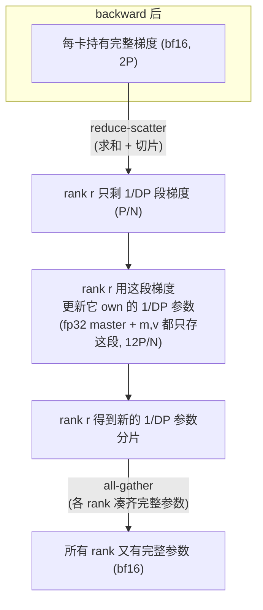

# 02 · ZeRO 显存账本与 Megatron DistributedOptimizer

> 上一篇看到，当 `use_distributed_optimizer=True` 时，梯度会走 reduce-scatter，每个 rank 只拿到 $1/\text{DP}$ 段。这一篇要说清楚的是，这一段梯度是怎么驱动 optimizer state 分片的——也就是 ZeRO-1 到底在做什么，并把 ZeRO 三级的显存账本逐项算清楚。

代码：[[megatron-lm:megatron/core/optimizer/distrib_optimizer.py]], `param_and_grad_buffer.py:351 start_param_sync`。

---

## 1. optimizer state 只需要一个 owner

先把全文用到的记账单位说清楚，下面出现的 $2P$、$4P$、$12P$、$16P$ 都是按这个单位来读的：设模型有 $P$ 个参数，$xP$ 表示「每个参数 $x$ 字节，乘以 $P$」。bf16 占 2 字节，所以参数和梯度各是 $2P$；fp32 占 4 字节，所以 fp32 master、Adam 的一阶动量 $m$、二阶动量 $v$ 各是 $4P$。混合精度训练必须留一份 fp32 master，原因是如果直接用 bf16 累加更新，会因为精度不足导致更新量被舍入掉、训练停滞不前。所以 optimizer 的三件套「master + $m$ + $v$」加起来是 $12P$，再加上 bf16 的参数和梯度 $4P$，单卡常驻显存就是 $16P$，这正是下面这张账本的起点。

DDP 下每张卡都存着全部参数的 fp32 master 加 Adam 的 $m$、$v$（合计 $12P$），但仔细想想，更新某个参数其实只需要它自己的梯度就够了，不需要别的信息。ZeRO 正是从这里切入的：让每个参数的 optimizer state 只由一个 DP rank 拥有，那个 rank 负责更新它，更新完之后再把新参数广播给其他所有 rank。



这正是上一篇里 reduce-scatter 之后发生的事情：reduce-scatter 已经把「每个 rank 该负责哪一段梯度」切分好了，optimizer 顺势就只在那一段上工作，不需要额外的协调。

## 2. 显存账本逐项推导（Adam + bf16 混合精度，DP=N）

| 状态 | DDP（全复制） | ZeRO-1 | ZeRO-2 | ZeRO-3/FSDP |
|---|---|---|---|---|
| 参数 bf16 | $2P$ | $2P$ | $2P$ | **$2P/N$** |
| 梯度 bf16 | $2P$ | $2P$ | **$2P/N$** | $2P/N$ |
| fp32 master | $4P$ | **$4P/N$** | $4P/N$ | $4P/N$ |
| Adam $m$ | $4P$ | $4P/N$ | $4P/N$ | $4P/N$ |
| Adam $v$ | $4P$ | $4P/N$ | $4P/N$ | $4P/N$ |
| **合计/卡** | **$16P$** | **$4P + 12P/N$** | **$2P + 14P/N$** | **$16P/N$** |

- **ZeRO-1**：只切「fp32 master + $m$ + $v$」这 $12P$，参数和梯度仍然是全量的。这就是 Megatron 的 `DistributedOptimizer`。
- **ZeRO-2**：在 ZeRO-1 的基础上再切梯度。其实梯度 reduce-scatter 之后本来就只需要保留 $1/N$ 段，Megatron 的连续 buffer 在 reduce-scatter 之后同样只用 $1/N$，所以 Megatron 的 distributed optimizer 在显存表现上已经很接近 ZeRO-2 的梯度行为了。
- **ZeRO-3/FSDP**：连参数也一起切开，用到的时候再 all-gather 出来，具体机制见 03。

> 举个直观的例子：当 $N=64$ 时，ZeRO-1 把 $12P$ 的冗余降到了 $12P/64$，几乎把 optimizer 的显存开销消灭掉了，而通信量和 DDP 完全一样（第 4 节会算给你看）。正因为如此，ZeRO-1 才成了 Megatron 训练大模型时的默认起手配置。

## 3. DistributedOptimizer 的分片映射

`DistributedOptimizer`（见 [[megatron-lm:megatron/core/optimizer/distrib_optimizer.py#L102]]）的关键工作，是把「连续 grad buffer 里的 $1/N$ 段」映射回「具体是哪些参数的哪些部分」：

- **shard 映射**（见 [[megatron-lm:megatron/core/optimizer/distrib_optimizer.py#L129]] 起）：每个 DP rank $r$ 拥有连续 buffer 里的第 $r$ 段（也就是 `dp_rank'th shard of each bucket`，见 [[megatron-lm:megatron/core/optimizer/distrib_optimizer.py#L241]]）。这一段可能会横跨多个参数，也可能切在某个大参数的中间，所以这里的分片是按 buffer 的字节位置切的，不是按参数边界切的，这一点和 FSDP 按参数逐个 flatten 的做法不同。
- **三组参数**（`_build_model_and_main_param_groups`，见 [[megatron-lm:megatron/core/optimizer/distrib_optimizer.py#L324]]），分别是：
  - `shard_float16_groups`：原始 bf16 参数的分片视图，用于 all-gather 回写；
  - `shard_fp32_from_float16_groups`：bf16 参数对应的 fp32 master 分片，这是 optimizer 真正要更新的对象；
  - `shard_fp32_groups`：本来就是 fp32 精度的参数分片。
- **step**：optimizer 只在这些 `shard_*` 上跑 Adam 更新，所以 $m$、$v$、master 都只需要存 $1/N$。

## 4. 通信量：reduce-scatter 梯度、all-gather 参数

一步训练的 DP 通信：

```
backward:   reduce_scatter(grad)        # 01 的 start_grad_sync, 每卡量 ≈ P
optimizer.step():  本地更新 1/N 参数分片  # 无通信
after step: all_gather(updated param)   # start_param_sync, 每卡量 ≈ P
```

- `start_param_sync`（见 [[megatron-lm:megatron/core/distributed/param_and_grad_buffer.py#L351]]）：把各个 rank 更新后的参数分片 all-gather 成完整参数，写回 bf16 参数 buffer，供下一次 forward 使用。
- **`overlap_param_gather=True`**（见 [[megatron-lm:megatron/core/distributed/param_and_grad_buffer.py#L376]]）：这次 all-gather 可以和下一个 iteration 的 forward overlap 起来——在 forward 真正用到某一层参数之前，先异步把它 all-gather 出来。这个思路和 FSDP 逐层做 all-gather 是一致的，区别只是 ZeRO-1 是一次性 all-gather 全部参数，FSDP 则是逐层 gather，按需取用。

把两步加在一起，每卡的总通信是 $2P$（reduce-scatter 与 all-gather 各约 $P$），与 DDP 一次 all-reduce 的通信量完全相同——通信守恒。

这正是 README 第 2 节强调的那件事：ZeRO-1 几乎是免费的，显存大幅下降，通信量却完全不变。

## 5. `num_distributed_optimizer_instances`：分层 ZeRO

在超大规模 DP 下，把 $12P$ 切到 $1/N$ 有可能切得太碎——每段太小，通信效率会变差，checkpoint 也会变得碎片化。`num_distributed_optimizer_instances > 1`（见 [[megatron-lm:megatron/core/distributed/distributed_data_parallel_config.py#L34]]）的做法是把整个 DP 域再分成若干个 instance：

- 在每个 instance 内部，做 reduce-scatter 加 all-gather，也就是 ZeRO-1 的切分方式；
- 在 instance 之间，再做一次 all-reduce（见 [[megatron-lm:megatron/core/distributed/param_and_grad_buffer.py#L677]]），把不同 instance 算出的梯度求和到一起。

效果是 optimizer state 只切到 $1/(N/\text{instances})$，用「instance 之间多做一次 all-reduce」的代价，换来「分片不至于太碎」的好处。这正是 hybrid sharded data parallel（HSDP）的思路：在「全切」和「全复制」之间找一个平衡点。

## 6. 与 TP/PP/EP 的分片域

- optimizer 的分片发生在 `data_parallel_group` 内（如果开了 CP，则是 `with_context_parallel=True` 对应的域）。
- TP/PP 已经把参数切到不同卡上了，DP 则是在「相同 TP/PP 位置」的多个副本之间，再对 optimizer 做分片。
- MoE 的 expert 参数用 `expert_data_parallel_group` 单独分片（见 [[megatron-lm:megatron/core/distributed/distributed_data_parallel.py#L275]]）。

---

## 参考

- Rajbhandari et al., *ZeRO: Memory Optimizations Toward Training Trillion Parameter Models*, 2019. [arXiv:1910.02054](https://arxiv.org/abs/1910.02054)
- Megatron `distrib_optimizer.py`, `param_and_grad_buffer.py:{351,556}`。

看完 ZeRO-1 怎么切 optimizer state，下一个自然的问题是：如果把参数也一起分片，会是什么样子？这就是 ZeRO-3，也就是 FSDP 的做法——forward 时逐层 all-gather 参数，用完就 reshard 释放。[03 · FSDP（ZeRO-3）：逐层 all-gather 与 reshard](./03_fsdp.md) 会对齐 PyTorch FSDP2 `fully_shard` 里 unshard/reshard/post_backward 的具体代码。
