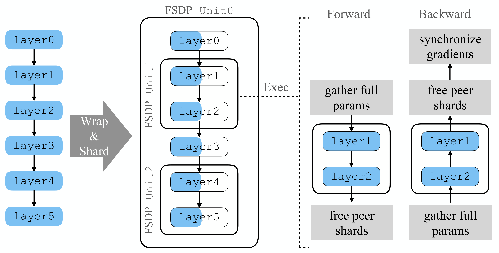
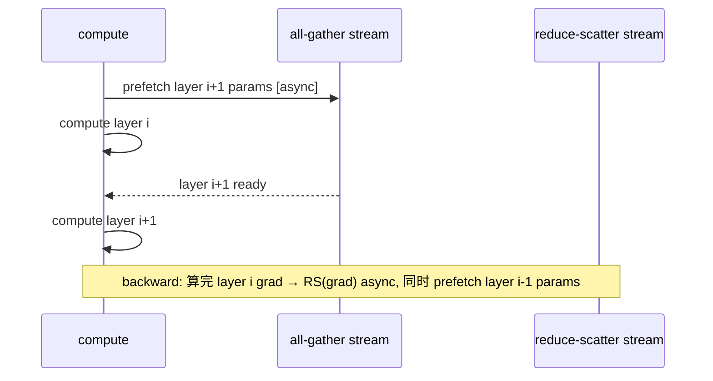
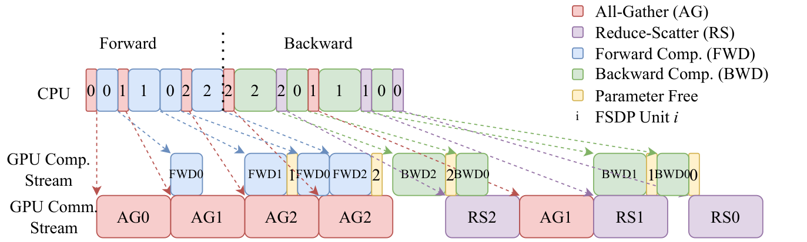

# 03 · FSDP（ZeRO-3）：逐层 all-gather 与 reshard

> 上一篇讲的 ZeRO-1 只切了 optimizer state，参数本身仍然是全量常驻在每张卡上的。FSDP（Fully Sharded Data Parallel）在此基础上更进一步，相当于 ZeRO-3：把参数本身也按 DP 维分片，每张卡平时只存 $1/N$ 的参数，等某一层真正要用到完整参数时，才临时 all-gather 出来，算完立刻 reshard 释放掉。这一篇会对齐 PyTorch FSDP2（也就是 `fully_shard`）的代码，并和 Megatron 自己的 FSDP 实现做个对比。

代码：[[pytorch:torch/distributed/fsdp/_fully_shard/_fsdp_param_group.py]]（`unshard`/`reshard`/`pre_forward`/`post_backward`），`_fsdp_collectives.py`（`foreach_all_gather`/`foreach_reduce`）；Megatron [[pytorch:torch/distributed/fsdp/]]、`distributed_data_parallel_config.py:90 use_megatron_fsdp`。

---

## 1. FSDP 的执行骨架：unshard → compute → reshard

FSDP 把模型按「FSDP unit」来组织，每个 unit 是一组参数，通常对应一层或者一个 block。每个 unit 在 forward 和 backward 时都会经历同一套生命周期：




> 图：FSDP 的 unshard→compute→reshard→reduce-scatter 生命周期。forward 前 all-gather 分片参数物化成完整参数、算完 reshard 释放；backward 再 all-gather 一次算梯度，最后 reduce-scatter 把梯度求和并切回 $1/N$。这正是把 ZeRO-3 的「参数随用随取、用完即弃」画成一张时序。（Zhao et al. 2023, Fig 1；[arXiv:2304.11277](https://arxiv.org/abs/2304.11277)）

对照 [[pytorch:torch/distributed/fsdp/_fully_shard/_fsdp_param_group.py|PyTorch v2.8.0 FSDP2 代码]]：

```python
def pre_forward(self, ...):          # :344
    self._training_state = FORWARD
    self.unshard(...)                # all-gather 参数
    self.wait_for_unshard()          # 等 all-gather + copy-out 完成
    self._register_post_backward_hook(...)

def post_forward(self, ...):         # :356
    self.reshard()                   # 释放完整参数, 回到 1/N

def unshard(self, async_op):         # :263
    self._all_gather_result = foreach_all_gather(self.fsdp_params, self._all_gather_process_group, ...)
    # foreach_all_gather → dist.all_gather_into_tensor (_fsdp_collectives.py:204)

def reshard(self):                   # :332
    self._to_sharded()               # 丢弃完整参数 buffer

def post_backward(self, ...):        # :391
    ...
    foreach_reduce(..., self._reduce_scatter_process_group, ...)   # reduce-scatter 梯度 (:457)
    # → dist.reduce_scatter_tensor (_fsdp_collectives.py:461)
```

概括起来，FSDP 把「参数常驻显存」换成了「参数随用随取、用完释放」，本质上是用通信量换显存。具体到每一层，forward 需要一次 all-gather，backward 需要一次 all-gather 加一次 reduce-scatter。

## 2. `reshard_after_forward`：显存与通信的权衡

FSDP2 有一个关键开关（`reshard()` 只在 `_training_state==FORWARD` 时才生效，见 [[pytorch:torch/distributed/fsdp/_fully_shard/_fsdp_param_group.py#L332-L335]]）：

| `reshard_after_forward` | forward 后 | backward 时 | 通信/步 | 峰值显存 |
|---|---|---|---|---|
| `True`（默认） | 释放完整参数 | **重新 all-gather** | $\mathrm{RS} + 2\,\mathrm{AG} = 3P$ | 低（只 $1/N$ 常驻）|
| `False` | 保留完整参数到 backward | 不用再 AG | $\mathrm{RS} + \mathrm{AG} = 2P$ | 高（完整参数留着）|

这正是 README 第 3 节里讲到的那个权衡。大模型的最外层 unit 通常设成 `True` 以省显存，但也可以对个别 unit 单独设成 `False`，比如最后一层，backward 紧接着 forward 发生，设成 `False` 就能省掉一次 all-gather。

## 3. overlap 与 prefetch：把 all-gather 藏进计算

FSDP 性能能不能打，关键就在于 prefetch 加多 stream 这套机制：

- **forward prefetch**：算第 `i` 层的同时，异步 all-gather 第 `i+1` 层的参数（`unshard(async_op=True)`）。[[pytorch:torch/distributed/fsdp/_fully_shard/_fsdp_param_group.py#L288-L298|wait_for_unshard]] 用 CUDA event 让「把 all-gather 结果拷出来」这一步和「下一次 all-gather」overlap 起来，源码注释里明确写着 "overlap current copy-out with next all-gather"。
- **backward prefetch**：反向算第 `i` 层的同时，异步 all-gather 第 `i-1` 层的参数（对应 `pre_backward` 里的 `default_prefetch`，:372）。
- **独立 stream**：`reduce_scatter_stream`（:69）和 all-gather stream 让 RS/AG 与 compute 分别跑在不同的 stream 上、彼此并行，用 CUDA event 来串联它们之间的依赖关系。





> 图：FSDP 把 all-gather / reduce-scatter 藏进相邻层计算的时序（原论文 Fig 5）。前向算第 `i` 层时 prefetch 第 `i+1` 层参数；反向算梯度时同时 reduce-scatter 并 prefetch 上一层 —— 理想下通信被计算完全覆盖。（Zhao et al. 2023；[arXiv:2304.11277](https://arxiv.org/abs/2304.11277)）

在理想情况下，AG 和 RS 完全被 compute 盖住，FSDP 的有效成本就约等于纯计算的成本，再加上「参数不常驻」带来的那部分额外 all-gather，而这部分额外开销在被藏住之后会趋近于零。但也有藏不住的情况：层太小导致 compute 时间小于通信时间、带宽太低（比如跨机做 FSDP）、或者 prefetch 深度不够。这些情况下 FSDP 会暴露出通信延迟，效果反而不如 ZeRO-1 加 TP/PP 的组合。

> 不过 prefetch 也不能一味激进，`limit_all_gathers` 这个 rate limiter 就是用来防止过犹不及的。如果同时 in-flight 的 all-gather 太多，还没来得及 reshard 的完整参数就会堆积在显存里，甚至触发 CUDA caching allocator 的 blocking `cudaMalloc`，把「省显存」这个初衷反过来抵消掉。FSDP 的做法是用一个 CUDA event 卡住 CPU 端的发射节奏：最多只允许固定数目（默认是 2 个 all-gather 的块）提前发出去，其余的要等前面的计算把显存消费完之后才放行（FSDP 论文 §3.4「Rate Limiter」的 Fig 6c 给出了实测收益）。这相当于把「prefetch 深度」变成了一个显式的工程旋钮，用深度去换显存峰值。

## 4. FSDP1（FlatParameter）vs FSDP2（per-parameter）

| | FSDP1（`_flat_param.py`，旧） | FSDP2（`fully_shard`，新） |
|---|---|---|
| 分片单位 | 把一个 unit 的所有参数 flatten 成一个大 `FlatParameter` 再切 | **每个参数独立**用 `DTensor` 表示分片 |
| 灵活性 | 难做 per-param 的 dtype / 冻结 / LoRA | 天然支持 per-param 操作 |
| 通信 | all-gather 整个 FlatParameter | `foreach_all_gather` 批量 gather 多个 param |
| 状态 | 维护中 | 推荐 |

FSDP2 用 `DTensor`（分布式张量）把每个参数标注成「沿 dim0 切到 DP mesh 上」的状态，unshard 相当于把这个 DTensor 物化成一份完整的 local tensor，reshard 则是把它丢回 DTensor 的本地分片。因为 TP 同样也用 `DTensor` 来表示分片，这让 FSDP 能和 TP 组合成 2D parallel（对应的 device mesh 是 `[dp, tp]`）。

## 5. Megatron-FSDP

Megatron 自己也提供了一套 FSDP 实现（对应配置项 `use_megatron_fsdp` / `use_custom_fsdp`，见 `distributed_data_parallel_config.py:90/93`；`data_parallel_sharding_strategy`，:100）：

- `data_parallel_sharding_strategy` 取值对应 ZeRO 级别：`'no_shard'`（DDP）、`'optim'`（ZeRO-1）、`'optim_grads'`（ZeRO-2）、`'optim_grads_params'`（ZeRO-3/FSDP）。
- 复用了 01 里那套连续 `_ParamAndGradBuffer` 基础设施（`start_param_sync` 逐 bucket 做 all-gather，其实就是 FSDP 的 unshard），并在此基础上加了一些优化，比如 `fsdp_double_buffer`（:135）用于显存复用、`megatron_fsdp_cuda_graph_mode`（:218）等。
- 好处是可以和 Megatron 的 TP/PP/EP、`main_grad`/wgrad fusion、distributed checkpoint 无缝集成，不需要像用 torch FSDP 那样重新适配一遍 Megatron 自己的 buffer 体系。

> 该怎么选：如果是纯 DP，或者 DP+TP 的 2D 组合，且整体生态用的是 torch，选 torch FSDP2 比较顺手；如果已经在 Megatron 里做了 TP/PP/EP，那么 Megatron-FSDP 或者 ZeRO-1 的 distributed optimizer 会更合适，多数情况下 ZeRO-1 加 TP/PP 的通信开销比纯 FSDP 更省。

## 6. FSDP 与 ZeRO-1+TP/PP 的选型

| 场景 | 推荐 |
|---|---|
| 模型能放下、只缺 optimizer 显存 | **ZeRO-1**（distributed optimizer），通信最省 |
| 模型放不下、不想要 TP/PP 的代码复杂度、单/少机高带宽 | **FSDP**（ZeRO-3）|
| 超大模型、多机、要极致 MFU | **ZeRO-1 × TP × PP × (CP/EP)**，FSDP 仅用于最外层 DP |
| RL / post-training（slime 等）、模型中等、要简单 | **FSDP** 常见 |

---

## 参考

- Zhao et al., *PyTorch FSDP: Experiences on Scaling Fully Sharded Data Parallel*, 2023. [arXiv:2304.11277](https://arxiv.org/abs/2304.11277)
- PyTorch FSDP2 源码：[[pytorch:torch/distributed/fsdp/_fully_shard/]]。
- Megatron-FSDP：[[megatron-lm:megatron/core/distributed/fsdp/]], [[megatron-lm:megatron/core/distributed/distributed_data_parallel_config.py#L90-L260]]。

把 DDP、ZeRO-1、FSDP（ZeRO-3）这三种机制都讲完之后，下一步自然是亲手实现一遍：做 [[atlas:docs/parallel/01_dp/dp_lab.ipynb]]，手写 DDP（all-reduce grad）、ZeRO-1（shard optim + RS grad + AG param）、ZeRO-3（shard param + unshard/reshard）这三种方式，逐元素验证它们都和单进程训练等价。
