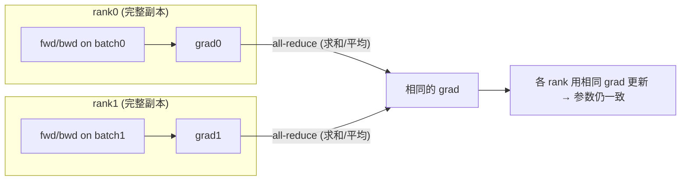
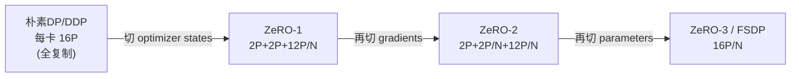

# Data Parallelism（DP）、ZeRO 与 FSDP

> DP 是最普适的一种并行：多卡各持一份完整的模型副本，各自用不同的 data shard 训练。本章顺着这个直觉往下延伸——从最朴素的 gradient all-reduce 出发，一路推到 ZeRO-1/2/3 在显存和通信之间的权衡、Megatron 的 distributed optimizer，以及 FSDP 逐层做 all-gather/reshard 的机制，并把每一步都对齐到 Megatron-LM 与 PyTorch FSDP2 的真实代码。ZeRO 到底在分片什么、通信为什么是对称的，都会先讲清楚定义，再讲工程上怎么实现。

## 前置知识

- 知道最朴素的 data parallelism 直觉：多卡各持一份完整的模型副本，各自用不同的 data shard 训练。
- 知道 `all-reduce` 的语义；不熟悉的话可以先看 [集合通信：原语、算法、NCCL 实现与拓扑映射](../../hpc/04_collectives.md)。
- 知道 autograd 的基本语义（forward 建图、backward 沿图反传梯度）；见 [03 · autograd：引擎、自定义 Function、hooks、checkpoint](../../torch/03_autograd.md)。
- 知道 Adam 与混合精度训练的基本组成（bf16 参数/梯度、fp32 master、optimizer states `m`/`v`），§1 的显存账本会直接用到这些量。

---

## 1. 朴素 DP 的显存代价

最朴素的 data parallelism 是这样运作的：每张卡持有一份完整的模型副本，各自处理自己的 micro-batch，backward 算完梯度后，对梯度做一次 **all-reduce** 求平均，再各自用这份相同的梯度去更新参数——这样一来，各卡上的参数在整个训练过程中始终保持一致。



问题在于，每张卡都要存下完整的参数、梯度和 optimizer states。对 Adam 加混合精度训练来说，按参数元素数 $P$ 来算，单个参数的显存账本是这样的：

| 项 | 精度 | 字节/参数 |
|---|---|---|
| 参数（bf16） | 2B | $2P$ |
| 梯度（bf16） | 2B | $2P$ |
| fp32 master 参数 | 4B | $4P$ |
| Adam `m`（fp32） | 4B | $4P$ |
| Adam `v`（fp32） | 4B | $4P$ |
| **合计** | | **$16P$** |

朴素 DP 下每张卡都要背下这 $16P$ 的显存开销，其中 $12P$（optimizer states 加 fp32 master）纯粹是冗余复制的结果：$N$ 张卡存了 $N$ 份完全相同的东西。ZeRO 想解决的问题正是这里，把这些冗余按 DP 维度切开，分散到各卡上。

## 2. ZeRO 频谱：三级显存分片

ZeRO（Rajbhandari et al., *ZeRO*, 2019, [arXiv:1910.02054](https://arxiv.org/abs/1910.02054)）把这件事分成三级来做，逐步把三类状态分片到 $N=\mathrm{DP}$ 张卡：




> 图：ZeRO 论文的经典显存账本图（记号 $\Psi$=参数量、$K$=optimizer state 系数，Adam 混精下 $K=12$、基线每参数 $2+2+K=16$ 字节、$N_d$=DP 度）。$P_{\mathrm{os}}$（ZeRO-1，切 optimizer states）→ $P_{\mathrm{os+g}}$（ZeRO-2，再切 gradients）→ $P_{\mathrm{os+g+p}}$（ZeRO-3/FSDP，再切 parameters），每卡显存从 $16\Psi$ 一路降到 $16\Psi/N_d$。这张图与下表逐行对应。（Rajbhandari et al. 2019, Fig 1；[arXiv:1910.02054](https://arxiv.org/abs/1910.02054)）

下面这张表把每一级切分的对象、每卡显存和通信量放在一起，方便对照：

| | 切什么 | 每卡显存（Adam 混精） | 通信/步 | 对应实现 |
|---|---|---|---|---|
| **DDP** | 无（全复制） | $16P$ | all-reduce grad = **$2P$** | torch DDP, Megatron DDP (`no_shard`) |
| **ZeRO-1** | optimizer states + master | $4P + 12P/N$ | RS grad + AG param = **$2P$** | **Megatron `DistributedOptimizer`** |
| **ZeRO-2** | + gradients | $2P + 2P/N + 12P/N$ | RS grad + AG param = **$2P$** | DeepSpeed ZeRO-2 |
| **ZeRO-3** | + parameters | **$16P/N$** | RS grad + 2× AG param = **$3P$** | **FSDP** (torch / Megatron-FSDP) |

这里有两点值得特别记住。

第一点是通信量是守恒的，这也是为什么 ZeRO-1/2 几乎是「免费午餐」。DDP 的 all-reduce 在 ring 算法下的通信量是 $2P$（拆开看就是 reduce-scatter 的 $P$ 加上 all-gather 的 $P$）。ZeRO-1/2 做的事情，其实就是把这一次 all-reduce 显式拆成两步：先 reduce-scatter 梯度（$P$），再把更新后的参数 all-gather 回来（$P$），总通信量仍然是 $2P$，一点没变，但 optimizer 的显存却降到了 $12P/N$。正因为几乎不花额外代价，ZeRO-1 几乎总是应该打开——这正是 Megatron 里 `use_distributed_optimizer=True` 的含义。

第二点是 ZeRO-3/FSDP 要多付出 50% 的通信量，来换取极致的显存节省。参数也被分片之后，forward 要 all-gather 一次参数（$P$），backward 还要再 all-gather 一次（$P$），加上梯度的 reduce-scatter（$P$），总共是 $3P$，比 DDP 多了 50%。换来的收益是每卡显存降到 $16P/N$，这是在显存实在不够用、宁愿多花通信也要把模型放下时的选择。

> DDP 和 FSDP 的核心区别在于：DDP 让参数常驻显存、只通信梯度；FSDP 则把参数也分片，需要用到时才 all-gather 出来，用完就释放。ZeRO-1（也就是 Megatron 的 distributed optimizer）介于两者之间，是一个折中的选择：参数和梯度仍然常驻显存，只把开销最重的 optimizer states 切分掉，通信量和 DDP 保持一致。

## 3. 通信量的计算

设参数总量为 $P$（按元素数计），DP 度为 $N$。在 ring 算法下，每张卡的集合通信传输量分别是：

- **all-reduce**：$\frac{2(N-1)}{N}\,P \approx 2P$
- **reduce-scatter**：$\frac{N-1}{N}\,P \approx P$
- **all-gather**：$\frac{N-1}{N}\,P \approx P$

由此可以推出：
- DDP：1 次 all-reduce(grad) = $2P$
- ZeRO-1/2：1 次 RS(grad) + 1 次 AG(updated param) = $P + P = 2P$ ✅ 与 DDP 等价
- ZeRO-3/FSDP：1 次 RS(grad) + AG(param, fwd) + AG(param, bwd) = $P + P + P = 3P$（若设 `reshard_after_forward=False`，可以省掉 backward 那次 AG、退回 $2P$，但代价是 forward 之后不释放完整参数，显存会涨上去）

这正是 FSDP 里 `reshard_after_forward` 开关要做的权衡：打开 reshard 省显存，关掉则省通信，03 会详细展开这一点。

## 4. DP 在并行体系中的位置

```
world = DP × CP × TP × PP   ;  DP 在最外层(跨机)
```

DP 不是孤立存在的，它要和 TP、PP、CP、EP 这些其它并行维度耦合在一起。下面这张表梳理了几种主要的耦合关系：

| 耦合 | 要点 |
|---|---|
| **DP × CP** | 梯度规约域是 `dp_cp`（CP 在梯度上像 DP，见 [04 · Megatron-LM 实现：切分、传参、RoPE、hybrid CP、与其它并行的协同](../04_cp/04_megatron_cp_integration.md)）。Megatron 用 `data_parallel_group(with_context_parallel=True)` |
| **DP × TP** | TP 的梯度本来就切开（每卡不同权重分片），DP 在 TP 之上对「相同分片」做规约。`CUDA_DEVICE_MAX_CONNECTIONS=1` 让 TP/DP 通信错峰（[04 · TP/SP 的通信-计算 overlap 与工程优化](../02_tp_sp/04_overlap_and_optimizations.md)） |
| **DP × PP** | PP 各 stage 是不同的 DP 副本组；DDP 的 bucketing 在非 first stage / interleaved 的后续 chunk 会调整（[[megatron-lm:megatron/core/distributed/distributed_data_parallel.py#L105]]）|
| **DP × EP** | MoE 的 expert 有独立的 `expert_data_parallel_group`；expert 参数的 DP 规约域不同于 attention（见 [EP](../05_ep/README.md)） |

## 5. Megatron 的统一抽象：连续 buffer 与 `main_grad`

Megatron 并不会把每个参数的 `.grad` 单独拿去做 all-reduce，那样会产生成百上千个小 kernel，效率很差。它的做法是用一块连续的 grad buffer（`_ParamAndGradBuffer`，定义在 `param_and_grad_buffer.py` 里）把同 dtype 的所有梯度拼接在一起，再按 bucket 分块通信。配合 TP 侧的 `gradient_accumulation_fusion`（详见[01 · ColumnParallelLinear / RowParallelLinear 与核心 autograd](../02_tp_sp/01_linear_layers.md)），wgrad 会直接累加进这块 buffer 的 fp32 视图 `main_grad` 里，不需要额外的加法 kernel。这样一来，DP 的梯度同步就变成了对这一整块连续 buffer 做 reduce-scatter 或 all-reduce：通信颗粒更大、kernel 数量更少，也更容易和计算 overlap 起来。这正是 01 要讲的内容。

```
[param0.grad][param1.grad]...[paramK.grad]   ← 一块连续 grad buffer (按 dtype)
 └────────── bucket 0 ──────────┘└─ bucket1 ─┘
   每个 bucket 填满就触发一次异步 reduce-scatter (overlap 进 backward)
```

---

## 6. 一组贯穿全文的数字（70B、DP=64）

```
P = 70e9            参数量
DP = 64
Adam 混合精度: 每参数 16 字节(全复制) → 单卡 1120 GB(!!)  ← 朴素 DP 根本放不下
```

- 朴素 DP：optimizer 与 master 合计 $12P$，约 840 GB/卡，显然放不下。
- ZeRO-1（distributed optimizer）：optimizer 部分降到 $12P/64$，约 13 GB/卡；但参数与梯度仍有 $4P$，约 280 GB，因此还需要配合 TP/PP 进一步切分。
- ZeRO-3/FSDP：全部状态合计 $16P/64$，约 17.5 GB/卡，代价是每层 forward 都要 all-gather 该层参数。

实际做 70B 规模训练时，通常是 DP(ZeRO-1) × TP × PP 的组合：先用 TP/PP 把参数量 $P$ 切小，再在此基础上用 DP 做 ZeRO-1。纯粹的 FSDP（也就是 ZeRO-3）更多出现在不想引入 TP/PP 复杂度的中等规模训练，或者 RL 场景里。

---

## 这组文档怎么读

下面这张表列出了这组文档的分工，可以按顺序对着代码路径逐篇读下去：

| 文件 | 内容 | 对应代码 |
|---|---|---|
| `README.md`（本文） | DP 全景：显存账本、ZeRO-1/2/3 频谱、通信量守恒、DDP↔ZeRO↔FSDP 对应、并行维度 | 配置类 |
| [01 · Megatron DDP：连续 buffer 与通信 overlap](./01_ddp_and_overlap.md) | Megatron DDP：连续 grad buffer、`main_grad`/fp32 累加、bucket + `register_grad_ready` hook、`overlap_grad_reduce`、all-reduce vs reduce-scatter | `distributed_data_parallel.py`, `param_and_grad_buffer.py` |
| [02 · ZeRO 显存账本与 Megatron DistributedOptimizer](./02_zero_and_distributed_optimizer.md) | ZeRO-1/2/3 显存账本推导；Megatron `DistributedOptimizer`：optimizer state 分片、grad reduce-scatter、param all-gather、`overlap_param_gather` | `distrib_optimizer.py`, `param_and_grad_buffer.py:351/556` |
| [03 · FSDP（ZeRO-3）：逐层 all-gather 与 reshard](./03_fsdp.md) | FSDP = ZeRO-3：逐层 all-gather 参数→算→reshard 释放→反向再 all-gather→reduce-scatter 梯度；PyTorch FSDP2 `fully_shard` 的 unshard/reshard/post_backward、stream prefetch；Megatron-FSDP | torch FSDP2, `fsdp/` |
| [[atlas:docs/parallel/01_dp/dp_lab.ipynb]] | 纯 torch 手写 **DDP / ZeRO-1 / ZeRO-3(FSDP)** 三种，用 gloo 本地多进程跑通 all-reduce / reduce-scatter / all-gather，逐元素对齐单进程 reference | —— |

读的顺序建议是：先读本文建立显存账本和 ZeRO 频谱的整体框架，再看 01 里 DDP 的 bucket 与 overlap 工程实现，然后是 02 的 optimizer state 分片，接着 03 讲 FSDP 如何把参数也分片，最后动手做一遍 lab，把三种方式都亲手实现一遍。

## 参考代码

参考代码（commit `e03878b5f` / torch 2.8）：

- [[megatron-lm:megatron/core/distributed/distributed_data_parallel.py]] —— Megatron DDP（grad bucketing + overlap）
- [[megatron-lm:megatron/core/distributed/param_and_grad_buffer.py]] —— 连续 grad/param buffer、`start/finish_grad_sync`、`start_param_sync`
- [[megatron-lm:megatron/core/optimizer/distrib_optimizer.py]] —— `DistributedOptimizer`（ZeRO-1：optimizer state 分片）
- [[megatron-lm:megatron/core/distributed/distributed_data_parallel_config.py]] —— `overlap_grad_reduce`/`overlap_param_gather`/`use_distributed_optimizer`/`data_parallel_sharding_strategy`
- PyTorch FSDP2：[[pytorch:torch/distributed/fsdp/_fully_shard/_fsdp_param_group.py]]（`unshard`/`reshard`/`post_backward`）、`_fsdp_collectives.py`（`foreach_all_gather`/`foreach_reduce`）

---

讲完了显存账本和 ZeRO 的整体频谱，下一个自然的问题是：Megatron DDP 具体怎么用连续 buffer、bucket 和 grad-ready hook，把梯度的 all-reduce/reduce-scatter 藏进 backward 的计算里？这就是[01 · Megatron DDP：连续 buffer 与通信 overlap](./01_ddp_and_overlap.md)要讲的内容。
