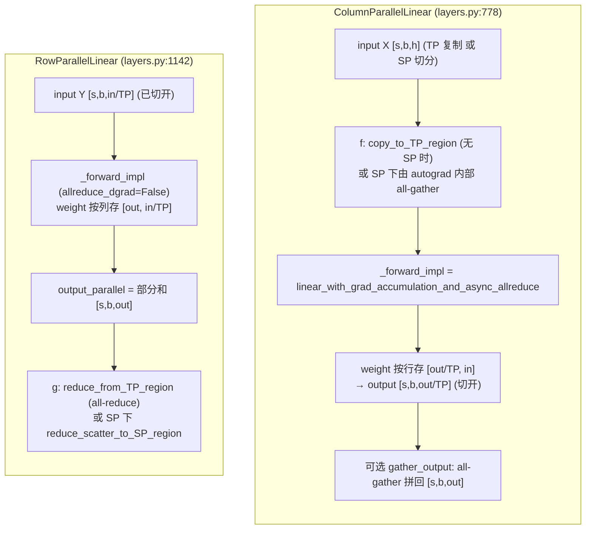

# 01 · ColumnParallelLinear / RowParallelLinear 与核心 autograd

> 这一篇把 TP 的两个 building block 逐行拆开来看，重点是那个被复用在所有 TP linear 里的核心 autograd function：`LinearWithGradAccumulationAndAsyncCommunication`。它一个人同时承担了好几件事：matmul 本身、SP 需要的 all-gather/reduce-scatter、dgrad 的 async all-reduce，以及 `gradient_accumulation_fusion`（把 wgrad 直接累加进 `main_grad` 里）。

代码：[[megatron-lm:megatron/core/tensor_parallel/layers.py]]

---

## 1. 两个 module 的职责划分



这里有一个关键的不对称之处：
- **ColumnParallelLinear 的输入需要在 backward 时做 dgrad all-reduce**（对应 `f` 的 backward），所以它把 `allreduce_dgrad` 交给了 autograd function 去处理；它的输出本身是切开的，forward 阶段不需要通信（除非显式设置了 `gather_output`）。
- **RowParallelLinear 的输出需要在 forward 时做 all-reduce**（对应 `g`），但它调用 `_forward_impl` 时传的是 `allreduce_dgrad=False`（[[megatron-lm:megatron/core/tensor_parallel/layers.py#L1343]]），原因是 row 的输入已经是切开的状态，dgrad 本身不需要规约；真正的规约发生在它之后的 `g` 那一步。

这正是 README 第 2 节讲的「column 后面接 row、整段只需一次规约」在代码里的具体落地：column 把 dgrad 的 all-reduce 推给了 autograd 去处理，row 把 forward 的 all-reduce 放在了输出端的 `g` 里，中间的 GEMM 全程都是切开状态，不需要任何通信。

---

## 2. ColumnParallelLinear.forward 逐段（[[megatron-lm:megatron/core/tensor_parallel/layers.py#L994]]）

```python
# layers.py:1033 —— 决定要不要在输入端过 f (copy_to_TP_region)
if (self.allreduce_dgrad or self.sequence_parallel
        or self.explicit_expert_comm or self.disable_grad_reduce):
    input_parallel = input_                       # 不在这里加 f：
                                                  #  - SP 时 all-gather 在 autograd 内部做
                                                  #  - allreduce_dgrad 时 dgrad 也在 autograd 内部做
else:
    input_parallel = copy_to_tensor_model_parallel_region(input_, group=self.tp_group)  # f

# layers.py:1062 —— 真正的 GEMM + 通信全在这个 autograd function 里
output_parallel = self._forward_impl(
    input=input_parallel, weight=weight, bias=bias,
    gradient_accumulation_fusion=self.gradient_accumulation_fusion,
    allreduce_dgrad=allreduce_dgrad,              # backward 是否 all-reduce dX
    sequence_parallel=self.sequence_parallel,     # forward 是否 all-gather 输入
    grad_output_buffer=...,                       # defer wgrad 用
    tp_group=self.tp_group,
)

# layers.py:1085 —— 一般不 gather（保持切开给下游 row-parallel）
if gather_output:
    output = gather_from_tensor_model_parallel_region(output_parallel, group=self.tp_group)
else:
    output = output_parallel                      # 默认：切开的 [s,b,out/TP]
```

这里有两个要点：
- `_forward_impl`（也就是下面第 4 节要讲的那个 autograd function）把「`f` 的 all-reduce」吸收进了自己的 backward 里（当 `allreduce_dgrad=True` 时）。所以在非 SP、非 expert 的路径下，`input_parallel = copy_to_...` 会显式加上 `f`；而在 SP 或者 `allreduce_dgrad` 的路径下，则交给 autograd 内部处理，避免重复通信。
- `gather_output` 默认是 `False`。只有在最后一层（比如 LM head 需要完整的 logits）、或者后面不接 row-parallel 的情况下才会设成 `True`，代价是要多做一次 all-gather。

---

## 3. RowParallelLinear.forward 逐段（[[megatron-lm:megatron/core/tensor_parallel/layers.py#L1308]]）

```python
if self.input_is_parallel:          # 上游是 column-parallel，输入已切开
    input_parallel = input_
else:                               # 输入是完整的 → 先 scatter 切开
    assert not self.sequence_parallel
    input_parallel = scatter_to_tensor_model_parallel_region(input_, group=self.tp_group)

output_parallel = self._forward_impl(
    input=input_parallel, weight=self.weight, bias=None,
    allreduce_dgrad=False,          # ← 关键：row 的 dgrad 不规约
    sequence_parallel=False,        # ← row 自己不做 SP 的 AG（AG 在上游 column）
    tp_group=None,
)

# layers.py:1349 —— 出口的 g：三选一
if self.explicit_expert_comm:       # MoE expert：通信由 dispatcher 负责，这里不通信
    output_ = output_parallel
elif self.sequence_parallel:        # SP: all-reduce 拆成 reduce-scatter
    output_ = reduce_scatter_to_sequence_parallel_region(output_parallel, group=self.tp_group)
else:                               # 普通 TP: all-reduce
    output_ = reduce_from_tensor_model_parallel_region(output_parallel, group=self.tp_group)
```

这三个分支正好对应三种部署场景：纯 TP 用 all-reduce，TP+SP 用 reduce-scatter（见 03），MoE 的 expert 则不需要通信，因为 token dispatcher 已经处理了跨 rank 的规约（见 EP 相关文档）。

---

## 4. 核心 autograd：`LinearWithGradAccumulationAndAsyncCommunication`（[[megatron-lm:megatron/core/tensor_parallel/layers.py#L464]]）

这个 autograd function 是整个 TP 性能表现的关键所在。它在一个 function 里塞进了四件事，接下来逐件来看。

### 4.1 forward（[[megatron-lm:megatron/core/tensor_parallel/layers.py#L469-L512]]）

```python
def forward(ctx, input, weight, bias, gradient_accumulation_fusion,
            allreduce_dgrad, sequence_parallel, grad_output_buffer, wgrad_deferral_limit, tp_group):
    ...
    if sequence_parallel:                          # SP: 输入按 seq 切，先 all-gather 成完整 seq
        dim_size = list(input.size()); dim_size[0] *= tp_group.size()
        all_gather_buffer = get_global_memory_buffer().get_tensor(dim_size, input.dtype, "mpu")
        dist_all_gather_func(all_gather_buffer, input, group=tp_group)   # AG over seq
        total_input = all_gather_buffer
    else:
        total_input = input
    output = torch.matmul(total_input, weight.t())  # 真·GEMM
    ...
```

- **SP 的 all-gather 发生在这里，而不是在 module 层**：column-parallel 的输入在 SP 下是按 seq 切好的 $[s/\mathrm{TP}, b, h]$，GEMM 之前必须先凑齐完整的 seq $[s, b, h]$。这里用 `get_global_memory_buffer()` 复用了一块全局 buffer，避免每一层都重新分配显存。
- forward 阶段只做 all-gather，并不保存 `total_input`（只用 `save_for_backward(input, weight)` 存下切开状态的 `input`），backward 时会再做一次 all-gather。这是用「重新做一次通信」换取显存的做法，是 SP 里的标准手法。

### 4.2 backward：dgrad、wgrad 与通信的编排（[[megatron-lm:megatron/core/tensor_parallel/layers.py#L516-L663]]）

backward 需要算两个梯度：`grad_input`（也就是 dgrad，要传给上游）和 `grad_weight`（也就是 wgrad，要累加进权重）。Megatron 的做法是把这两者和通信交错编排起来：

```python
def backward(ctx, grad_output):
    input, weight = ctx.saved_tensors
    # ① SP: 异步 all-gather 重建 total_input（和下面 dgrad 计算 overlap）
    if ctx.sequence_parallel:
        ...
        handle = dist_all_gather_func(all_gather_buffer, input, group=tp_group, async_op=True)  # 异步！
        total_input = all_gather_buffer
    else:
        total_input = input

    grad_input = grad_output.matmul(weight)        # ② dgrad（不依赖 total_input）

    if ctx.sequence_parallel and wgrad_compute:
        handle.wait()                              # 等 ① 的 AG 完成，才能算 wgrad

    # ③ dgrad 的规约（async，和后面的 wgrad overlap）
    if ctx.allreduce_dgrad:                        # 纯 TP：all-reduce dgrad
        handle = torch.distributed.all_reduce(grad_input, group=tp_group, async_op=True)
    if ctx.sequence_parallel:                      # SP：reduce-scatter dgrad（顺便切回 seq）
        assert not ctx.allreduce_dgrad
        sub_grad_input = torch.empty(dim_size, ...)
        handle = dist_reduce_scatter_func(sub_grad_input, grad_input, group=tp_group, async_op=True)

    # ④ wgrad —— 在 ③ 的通信进行时计算（这就是 overlap）
    if ctx.gradient_accumulation_fusion:
        # 直接把 wgrad 累加进 weight.main_grad（fp32），省一次 add kernel
        fused_weight_gradient_mlp_cuda.wgrad_gemm_accum_fp32(total_input, grad_output, weight.main_grad)
        grad_weight = None
    else:
        grad_weight = grad_output.t().matmul(total_input)

    handle.wait()                                  # 等 ③ 的通信收尾
    return (sub_grad_input or grad_input), grad_weight, grad_bias, ...
```

这里有四个关键的设计，每一个都值得仔细记住：

1. **dgrad 与 wgrad 相互解耦，因此可以 overlap。** `grad_input = grad_output @ weight`（dgrad）和 `grad_weight = grad_output.t() @ total_input`（wgrad）是两个互相独立的 GEMM。dgrad 的 all-reduce/reduce-scatter 一旦发出去（`async_op=True`），CPU 立刻接着去发 wgrad 的 GEMM kernel，这样通信和计算就在同一个时间窗口里跑起来了。这把 TP 通信的延迟藏在了 wgrad GEMM 的背后。

2. **`async_op=True` 还不够，还需要配合 `CUDA_DEVICE_MAX_CONNECTIONS=1` 才能真正做到 overlap。** 源码注释（`layers.py:566/579`）反复强调依赖这个环境变量。它把所有 CUDA kernel 强制压到单一硬件队列上，从而保证「先发射的通信 kernel」一定排在「后发射的 wgrad kernel」之前进 GPU，否则调度器可能会把顺序打乱，导致通信反而被计算阻塞。这是 04 要重点展开的内容。

3. **`gradient_accumulation_fusion` 配合 `main_grad`。** 梯度累加（也就是跨多个 micro-batch 累加）通常写成 `param.grad += wgrad`，这需要一个独立的 add kernel，还要额外分配一块 `grad` buffer。Megatron 用了 APEX 里的 `wgrad_gemm_accum_fp32`，把 wgrad 的 GEMM 和「累加进 fp32 `main_grad`」这两步融合成了一个 kernel（[[megatron-lm:megatron/core/tensor_parallel/layers.py#L606]]）。`main_grad` 是一块常驻的 fp32 buffer，DP 的 reduce-scatter 直接读取它（见[Data Parallelism（DP）、ZeRO 与 FSDP](../01_dp/README.md)）。这也是为什么 forward 里要判断 `hasattr(weight, "main_grad")`（[[megatron-lm:megatron/core/tensor_parallel/layers.py#L482]]）。

4. **推迟 wgrad 的计算（`grad_output_buffer` / `wgrad_deferral_limit`）**（[[megatron-lm:megatron/core/tensor_parallel/layers.py#L530-L533]]）：可以先把 `grad_output` 暂存进一块 buffer 里，把 wgrad 的计算推迟到 backward 末尾统一做（这就是 embedding 层的 `defer_embedding_wgrad_compute`），从而进一步腾出更多的 overlap 窗口。

### 4.3 SP 分支下的输入/输出 shape 流转

| 阶段 | 非 SP | SP |
|---|---|---|
| column 输入 | $[s, b, h]$（复制） | $[s/\mathrm{TP}, b, h]$（按 seq 切） |
| column GEMM 前 | 直接用 | autograd 内 **all-gather** → $[s, b, h]$ |
| column 输出 | $[s, b, 4h/\mathrm{TP}]$ | $[s, b, 4h/\mathrm{TP}]$ |
| row 输出（GEMM 后） | $[s, b, h]$ 部分和 → all-reduce | $[s, b, h]$ 部分和 → **reduce-scatter** → $[s/\mathrm{TP}, b, h]$ |
| backward dgrad 规约 | all-reduce | reduce-scatter |

值得留意的是 SP 这里的巧妙之处：reduce-scatter 同时完成了两件事——「把部分和规约起来」和「按 seq 维切回去」，输出直接就是下一层 SP 区需要的 $[s/\mathrm{TP}, b, h]$ layout。这正是 03 要讲的 AG/RS 替换 all-reduce 的核心机制。

---

## 5. 三个容易踩的点

1. **bias 的处理**：column-parallel 的 bias 也按输出维切开（`{"bias": 0}`，[[megatron-lm:megatron/core/tensor_parallel/layers.py#L1116]]）；row-parallel 的 bias 则不切（`{"weight": 1}`，但 bias 保持完整，[[megatron-lm:megatron/core/tensor_parallel/layers.py#L1379]]），并且要在 all-reduce 之后才加上去，否则 bias 会被重复加了 TP 次。`skip_bias_add` 这个选项会把 bias 透传给上层，供上层做 bias 加 dropout 的融合。

2. **`explicit_expert_comm`**：MoE 的 expert linear 复用了 `Column/RowParallelLinear`，但通信由 token dispatcher 接管，所以这些分支会直接跳过 TP 通信（`layers.py:1051, 1349`）。

3. **`LinearWithFrozenWeight`**（[[megatron-lm:megatron/core/tensor_parallel/layers.py#L351]]）：这是推理或者冻结权重场景下用的轻量版本，只在 `allreduce_dgrad=True` 时对 dgrad 做 all-reduce，不再计算 wgrad。

---

把这两个 linear 拆清楚之后，下一步是把它们拼成完整的 attention + MLP block，再看看 vocab-parallel embedding 和 cross entropy 是怎么处理的，以及为什么 TP 下的 dropout 需要一套专门的 RNG tracker。这些都在[02 · 整个 Transformer block 的切分方式](./02_transformer_block.md)里。
