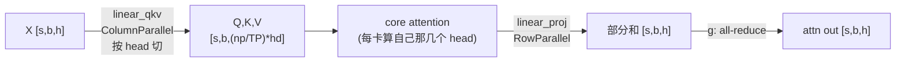

# 02 · 整个 Transformer block 的切分方式

> 上一篇看的是单个 linear，这一篇要把它们拼成完整的 Transformer layer。具体会讲清楚四件事：attention 和 MLP 各自怎么切、为什么每个 block 只需要一次 all-reduce；输入输出的 embedding（也就是 vocab）怎么按 vocab 维切开；loss 在 vocab 已经切开的情况下要怎么算，也就是 vocab-parallel cross entropy 的原理；以及为什么 TP 下的 dropout 必须用一套专门的 RNG tracker。

---

## 1. MLP block：column → row（`mlp.py`）

```
fc1: ColumnParallelLinear  [h → ffn]   按输出列切 → 每卡 [s,b,ffn/TP]
act: GELU/SwiGLU (本地，element-wise)
fc2: RowParallelLinear     [ffn → h]   按输入行切 → 部分和，出口 all-reduce
```

代码：`linear_fc1 = ColumnParallelLinear`（[[megatron-lm:megatron/core/transformer/mlp.py#L216]]），`linear_fc2 = RowParallelLinear`（[[megatron-lm:megatron/core/transformer/mlp.py#L236]]），forward `mlp.py:258→340`。

这里有一个 SwiGLU 特有的细节：fc1 的输出是 $2\,\mathrm{ffn}$（gate 和 up 两路），column-parallel 把这 $2\,\mathrm{ffn}$ 切开的时候，要保证 gate 和 up 对应的同一段落在同一张卡上（Megatron 用交错排布，或者配合 `bias_gelu_fusion` 来处理这件事），否则 $\mathrm{silu}(\mathrm{gate}) \cdot \mathrm{up}$ 这个逐元素乘法会对不上号，算出错误的结果。这是 TP 切 GLU 类激活时最容易踩的一个坑。

## 2. Attention block：按 head 切（`attention.py`）




> 图：Megatron 把 self-attention 按 **head** 切到各 TP rank。`linear_qkv` 是 column-parallel（每卡拿 `heads/TP` 个 head 的 Q/K/V），各 head 的 $\mathrm{softmax}(QK^{\top})\,V$ 完全本地；`linear_proj` 是 row-parallel，输出经 `g` 一次 all-reduce 合并。结构与 MLP 的 column→row 骨架完全一致。（Shoeybi et al. 2019, Fig 3b；[arXiv:1909.08053](https://arxiv.org/abs/1909.08053)）

- `linear_qkv` 是 ColumnParallelLinear（[[megatron-lm:megatron/core/transformer/attention.py#L1406]] 附近计算 `linear_qkv_out_dim = q_proj + 2*kv_proj`），按 attention head 来切：每张卡拿到 `num_heads/TP` 个 head 对应的 Q/K/V。因为不同 head 的 attention 计算是互相独立的，core attention（也就是 $\mathrm{softmax}(QK^{\top})\,V$）可以完全在本地算完，零通信，这正是 attention 天然适合用 TP 切分的原因。
- `linear_proj` 是 RowParallelLinear（[[megatron-lm:megatron/core/transformer/attention.py#L394]]），把各卡上不同 head 的输出投影回 $h$ 维，再用 all-reduce 求和（[[megatron-lm:megatron/core/transformer/attention.py#L1340]] 附近）。
- **GQA/MQA 场景**：当 KV head 数小于 Q head 数时，TP 切分要保证每张卡至少能分到完整的 KV head（或者索性复制 KV）。当 `num_kv_heads < TP` 时，Megatron 会复制 KV head，这会影响到 `linear_qkv` 的切分逻辑。

> 把这两部分放在一起看：一个 Transformer layer 等于 attention 的一次 all-reduce，加上 MLP 的一次 all-reduce，forward 总共 2 次、backward 总共 2 次。block 之间的 LayerNorm 和 residual 都是本地操作（没开 SP 时，激活是复制状态）。

## 3. Vocab-parallel embedding（[[megatron-lm:megatron/core/tensor_parallel/layers.py#L198]]）

输入/输出 embedding 的 $[\mathrm{vocab}, h]$ 矩阵按 **vocab 维**切到各 TP rank：

```python
# VocabParallelEmbedding.forward (layers.py:284)
#  每卡只持有 [vocab/TP, h]；
#  对落在本卡 vocab 区间外的 token id，先 mask 成 0，查表后置零，
#  最后 all-reduce 把各卡的查表结果加起来（mask 保证不重复）
if self.reduce_scatter_embeddings:        # SP: 直接 reduce-scatter 成 [s/TP,b,h]
    output = reduce_scatter_to_sequence_parallel_region(output_parallel, group=self.tp_group)
else:
    output = reduce_from_tensor_model_parallel_region(output_parallel)   # all-reduce
```

- forward 是一次 masked lookup 加上 all-reduce（或者在 SP 下是 reduce-scatter，[[megatron-lm:megatron/core/tensor_parallel/layers.py#L308-L319]]）。
- 输入和输出 embedding 通常会做 weight tying（共享同一份 $[\mathrm{vocab}, h]$），如果跨 PP 的 first stage 和 last stage，还需要额外做一次 all-reduce 来同步梯度（在 `finalize_model_grads` 里完成）。

## 4. Vocab-parallel cross entropy（[[megatron-lm:megatron/core/tensor_parallel/cross_entropy.py#L119]]）

logits $[s, b, \mathrm{vocab}]$ 按 vocab 切成了 $[s, b, \mathrm{vocab}/\mathrm{TP}]$，loss 要在不 gather 出完整 logits 的前提下算出来，因为完整的 logits 会是 $[s, b, \mathrm{vocab}]$（vocab 常常能到 128k 以上），显存会直接爆掉。这里的技巧是把 softmax 需要的两个全局量，用 all-reduce 拼出来：

```python
# forward (cross_entropy.py:121)
logits_max = vocab_parallel_logits.max(dim=-1)         # 本地最大
all_reduce(logits_max, op=MAX, group=tp)               # ① 全局 max（数值稳定）
# 减 max 后算 exp；只有 target 落在本卡 vocab 区间时 predicted_logits 才非零
all_reduce(predicted_logits, op=SUM, group=tp)         # ② 拼出 target 的 logit
all_reduce(sum_exp_logits,   op=SUM, group=tp)         # ③ 拼出分母 Σexp
loss = log(sum_exp_logits) - predicted_logits          # = -log softmax(target)
```

只需要三次标量或小向量级别的 all-reduce（是 $[s, b]$ 这个量级，而不是 $[s, b, \mathrm{vocab}]$），就完成了 vocab 切开状态下的交叉熵计算。backward（[[megatron-lm:megatron/core/tensor_parallel/cross_entropy.py#L186]]）只需要本地操作：$\mathrm{grad} = \mathrm{softmax} - \mathrm{onehot}(\mathrm{target})$，因为 softmax 已经是全局归一化过的，每张卡只需要更新自己 vocab 区间对应的那一部分梯度。

> 这是 TP 里「用几个标量的 all-reduce，换掉一次巨张量的 all-gather」的一个典型例子，思路上和 attention 的 online-softmax、FlashAttention 是相通的。

## 5. TP 专用 RNG：dropout 的一致性（`random.py`）

TP 下，激活在 TP 区内是切开的状态（每张卡拿到不同的 hidden 分片），在 TP 区外则是复制状态（每张卡都相同）。dropout 打的 mask 必须跟这个状态配合起来：

| 区域 | 激活状态 | dropout mask 要求 | 用哪个 RNG |
|---|---|---|---|
| TP 区**外**（如 attention 输出后、residual） | 各卡复制（相同） | 各卡 mask **必须相同**，否则复制的张量被打不同的洞 → 不一致 | `data-parallel` seed（同 TP group 内相同） |
| TP 区**内**（如 attention score、切开的 hidden） | 各卡不同分片 | 各卡 mask **必须不同**，否则等价于 dropout rate 缩水 | `model-parallel` seed（`seed + tp_rank`，各卡不同） |

`model_parallel_cuda_manual_seed`（见 [[megatron-lm:megatron/core/tensor_parallel/random.py#L433]]）会一次性注册三套 RNG state：

```python
data_parallel_seed         = seed                       # TP group 内相同 → 区外 dropout
tensor_model_parallel_seed = seed + 2718 + tp_rank      # 各 TP rank 不同 → 区内 dropout
expert_parallel_seed       = seed + 1024 + 100*ep_rank + etp_rank   # MoE expert
```

用法是 `with get_cuda_rng_tracker().fork():`（见 [[megatron-lm:megatron/core/tensor_parallel/random.py#L298]]）切到 model-parallel 的 state，再去做区内的 dropout。`fork()` 是一个上下文管理器：进入时先保存当前的 RNG state、切换到指定的 state，退出时再恢复回去，这样就保证了「区内用 TP-state、区外用 DP-state」能干净地来回切换，而且在 activation checkpointing 重新计算时，也能精确复现出同一个 mask（对应 `CheckpointFunction`，见 [[megatron-lm:megatron/core/tensor_parallel/random.py#L555]]）。

> 漏掉这套机制的后果非常隐蔽：训练照样能跑、loss 也在下降，但 TP 区外的 dropout 在各卡上打出了不同的洞，导致本该保持一致的复制张量变得不再一致，等价于悄悄引入了额外的噪声，破坏了 TP 原本应该具备的数学等价性。这是手写 TP 时最容易踩、也最难发现的坑之一。

---

现在我们已经清楚，TP 下的 activation 在区外是复制的、在区内是切开的。下一个自然的问题是：能不能把区外那些复制的部分也切开？这正是 SP 要做的事，按 sequence 维把它们切开，用 all-gather 加 reduce-scatter 替掉 all-reduce，进一步省下 activation 的显存。详见[03 · Sequence Parallelism：AG/RS 替换 all-reduce](./03_sequence_parallel.md)。
