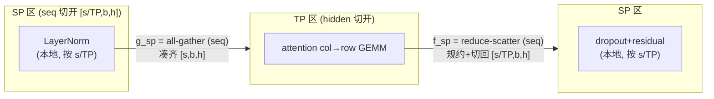
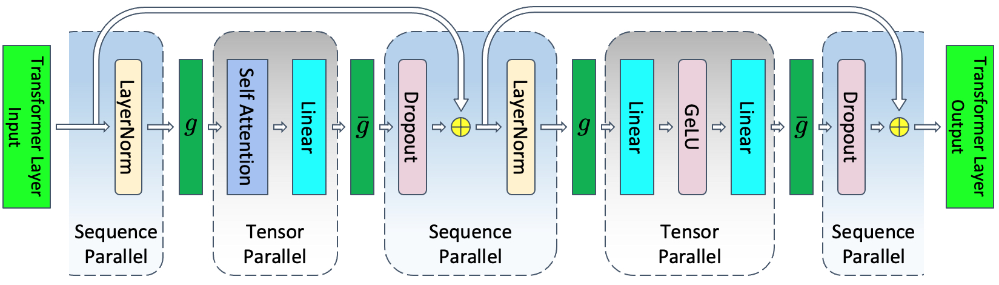

# 03 · Sequence Parallelism：AG/RS 替换 all-reduce

> SP 出自 Korthikanti et al. 2022 年发表的 *Reducing Activation Recomputation in Large Transformer Models*（[arXiv:2205.05198](https://arxiv.org/abs/2205.05198)，也就是提出 Megatron-SP 和 selective activation recomputation 的那篇论文）。它要解决的问题很直接：TP 省下了权重和算力，但没有省下 activation 的显存——TP 区外的 LayerNorm、dropout、residual 输入，在每张卡上都是完整复制的 $[s, b, h]$。SP 的做法是把这些也按 sequence 维切到 TP 各卡上，让 activation 显存随着 TP 线性下降。

---

## 1. TP 区外的 activation 被完整复制

回顾一下 02 里讲到的内容：一个 layer 里激活的状态是这样的

```
[LN] → [attention: col→row, all-reduce] → [dropout+residual] → [LN] → [MLP: col→row, all-reduce] → [dropout+residual]
 ↑复制              ↑区内切开                      ↑复制            ↑复制         ↑区内切开                  ↑复制
```

标注「复制」的地方——也就是 LayerNorm 的输入/输出、dropout、residual——在 TP 各卡上是逐元素相同的完整 $[s, b, h]$。以 TP=8 为例，这相当于把同一份 activation 存了 8 遍。而这些 activation 又都要保留到 backward 才能释放，是显存开销的大头。

这里有一个关键的观察：LayerNorm、dropout、residual add 这些操作，都是沿 hidden 维独立、沿 sequence 维也独立的操作——element-wise 计算，或者是沿 hidden 维做的归一化，跟别的 token 完全没有关系。所以完全可以把 sequence 维 $s$ 切成 $s/\mathrm{TP}$，每张卡只处理 $[s/\mathrm{TP}, b, h]$，各自算各自的，不需要任何通信。

## 2. 解法：all-reduce = reduce-scatter + all-gather，拆开来用

核心恒等式：

$$
\text{all-reduce}(x) \equiv \text{all-gather}(\text{reduce-scatter}(x))
$$

从通信量上看，all-reduce 大约是 2 倍数据量，而 RS 和 AG 各自约是 1 倍数据量。所以把一次 all-reduce 拆成「出口的 RS 加入口的 AG」，总字节数是不变的，但中间会多出一段「activation 按 seq 切开」的状态，这一段就是 SP 区，activation 在这里只需要存 $1/\mathrm{TP}$。





> 图：TP+SP 合并后的一整个 transformer layer。SP 区（LayerNorm、dropout、residual）按 sequence 维切成 `[s/TP,b,h]`；进 TP 区用 `g`（forward all-gather，凑齐 `s`），出 TP 区用 `ḡ`（forward reduce-scatter，规约+切回 `s/TP`）。`g` 与 `ḡ` 互为共轭：`g` = forward all-gather / backward reduce-scatter，`ḡ` = forward reduce-scatter / backward all-gather。注意这里论文的 `g`/`ḡ` 记号与 Megatron 源码里替换掉的 `f`/`g` 对应关系（见下表）。（Korthikanti et al. 2022, Fig 5；[arXiv:2205.05198](https://arxiv.org/abs/2205.05198)）

对照 README 里定义的 `f`/`g`：SP 把 `f` 实现成 all-gather（forward）加 reduce-scatter（backward），把 `g` 实现成 reduce-scatter（forward）加 all-gather（backward）。它们仍然互为共轭：

| 算子 | forward | backward | 代码 |
|---|---|---|---|
| 进 TP 区（替代 `f`） | **all-gather** (seq) | **reduce-scatter** (seq) | `_GatherFromSequenceParallelRegion` [[megatron-lm:megatron/core/tensor_parallel/mappings.py#L296]] |
| 出 TP 区（替代 `g`） | **reduce-scatter** (seq) | **all-gather** (seq) | `_ReduceScatterToSequenceParallelRegion` [[megatron-lm:megatron/core/tensor_parallel/mappings.py#L351]] |

## 3. AG/RS 的代码落点

SP 的这两半通信，分别落在 01 已经讲过的两个地方：

1. **进入 TP 区的 all-gather**：不在 module 层，而是在 `LinearWithGradAccumulationAndAsyncCommunication.forward` 内部（[[megatron-lm:megatron/core/tensor_parallel/layers.py#L499-L505]]）。column-parallel 收到的输入是 $[s/\mathrm{TP}, b, h]$，GEMM 之前会先 all-gather 成 $[s, b, h]$。backward 时（[[megatron-lm:megatron/core/tensor_parallel/layers.py#L569-L578]]）对 dgrad 做 reduce-scatter，输出直接就是 $[s/\mathrm{TP}, b, h]$。

2. **离开 TP 区的 reduce-scatter**：在 `RowParallelLinear.forward`（[[megatron-lm:megatron/core/tensor_parallel/layers.py#L1352]]）：
   ```python
   elif self.sequence_parallel:
       output_ = reduce_scatter_to_sequence_parallel_region(output_parallel, group=self.tp_group)
   ```
   它一步就完成了两件事——「把 row 的部分和规约起来」和「按 seq 切回去」，输出的 $[s/\mathrm{TP}, b, h]$ 正好可以直接喂给下一段 SP 区的 dropout+residual。

`_split_along_first_dim` / `_gather_along_first_dim` / `_reduce_scatter_along_first_dim`（`mappings.py:56/114/155`）都作用在第 0 维（也就是 sequence 维）上，这也是「sequence parallel」这个名字的由来。

## 4. 完整 TP+SP 数据流（一个 layer）

```
[s/TP,b,h] ──AG(seq)──► [s,b,h] ──QKV(col)──► attn(本地 head) ──proj(row)──► 部分和 ──RS(seq)──► [s/TP,b,h]
   SP:LN                  TP region                                                         SP:dropout+resid
[s/TP,b,h] ──AG(seq)──► [s,b,h] ──fc1(col)──► act ──fc2(row)──► 部分和 ──RS(seq)──► [s/TP,b,h]
   SP:LN                  TP region                                          SP:dropout+resid
```

- 每个 layer：forward 需要 2 次 AG 加 2 次 RS，用来替代纯 TP 下的 2 次 all-reduce，通信字节数和纯 TP 是相同的。
- activation 显存：LayerNorm/dropout/residual 的 activation 从 $[s, b, h]$ 降到 $[s/\mathrm{TP}, b, h]$，随着 TP 线性下降，这是 SP 存在的唯一目的。
- backward 会自动镜像：AG 和 RS 对调（见上表），这是 autograd 免费给出的，不需要额外实现。

## 5. `sp2hp` / `hp2sp`：另一种「seq↔hidden」切换（`mappings.py:562/591`）

在某些场景下（比如 MoE 的 token 在 TP 维上分布、或者某些 fused kernel），需要在这两种切分方式之间来回转换：

```
all_to_all_sp2hp: [num_tokens/TP, H]  →  [num_tokens, H/TP]   (seq-切 → hidden-切)
all_to_all_hp2sp: [num_tokens, H/TP]  →  [num_tokens/TP, H]   (hidden-切 → seq-切)
```

实现方式是 `torch.split` 加 `all_to_all` 加 `cat`（`mappings.py:578/610`）：用一次 all-to-all，把「按 seq 切」转成「按 hidden 切」。这在 SP 和某些 TP-fused 算子（或者 Ulysses 风格的 CP，见 [CP](../04_cp/README.md)）衔接的地方会用到。底层都是 `_AllToAll`（[[megatron-lm:megatron/core/tensor_parallel/mappings.py#L420]]），它的 backward 是把 split 方向对调之后的 all-to-all，和 MoE 的 dispatch 是同构的。

## 6. SP 的工程收益与代价

| 维度 | 纯 TP | TP + SP |
|---|---|---|
| 权重显存 | $1/\mathrm{TP}$ | $1/\mathrm{TP}$ |
| activation（区内） | $1/\mathrm{TP}$ | $1/\mathrm{TP}$ |
| activation（区外 LN/dropout/resid） | **×1（复制）** | **$1/\mathrm{TP}$** |
| forward 通信 | 2× all-reduce | 2× AG + 2× RS（同字节数） |
| 通信可 overlap 性 | 较难 | 更好（AG/RS 颗粒更细，易和 GEMM 流水） |
| 实现复杂度 | 低 | 中（要管 seq 维 split、和 CP/PP 的 seq 维耦合） |

> SP 几乎是免费的：通信量不变，显存却显著下降，所以在 Megatron 里只要开了 TP，基本都会顺手把 SP（`sequence_parallel=True`）也开上。唯一的约束是 $s$ 要能被 TP 整除，并且要和同样切 seq 维的 CP 协调好切分的先后顺序。

---

讲完 SP 的原理和数据流，接下来自然要问：这些通信在工程上是怎么被藏进计算里的？`CUDA_DEVICE_MAX_CONNECTIONS=1` 到底在起什么作用、async all-reduce/RS 怎么和 wgrad 做 overlap、`tp_comm_overlap`（也就是 userbuffers）又是怎么把 AG/RS 拆进 GEMM 的 tile 里做细粒度流水的，这些都在[04 · TP/SP 的通信-计算 overlap 与工程优化](./04_overlap_and_optimizations.md)里。
