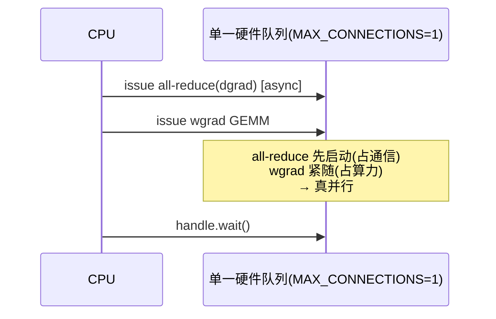

# 04 · TP/SP 的通信-计算 overlap 与工程优化

> TP 的通信发生在每一层，字节数很大，而且卡在关键路径上，这是它天生的痛点。这一篇讲 Megatron 是怎么把这些通信藏起来的，一共分三个层次：第一层是粗粒度的 async，也就是把 dgrad 的 all-reduce/RS 用 `async_op=True` 和 wgrad GEMM 做 overlap，这是纯 PyTorch 层面的手法，01 已经见过；第二层是 `CUDA_DEVICE_MAX_CONNECTIONS=1` 这个环境变量，它是让上面的 async 真正生效的硬件前提；第三层是更细粒度的 `tp_comm_overlap`（也就是 userbuffers），把 AG/RS 切成小块、和 GEMM 的 tile 流水起来，这部分依赖 TransformerEngine。

---

## 1. 粗粒度：dgrad 通信 ∥ wgrad 计算

回顾一下 01 里讲到的 backward（[[megatron-lm:megatron/core/tensor_parallel/layers.py#L516-L663]]）：一个 TP linear 的 backward 要算两个互相独立的 GEMM：

```
dgrad: grad_input  = grad_output @ weight        → 需要 all-reduce(纯TP) / reduce-scatter(SP)
wgrad: grad_weight = grad_output.t() @ total_input  → 本地，无通信
```

因为它们之间没有数据依赖，Megatron 就把 dgrad 的规约异步发出去，紧接着发出 wgrad 的 GEMM：

```python
if ctx.allreduce_dgrad:
    handle = all_reduce(grad_input, group=tp_group, async_op=True)   # 通信发出，不等
# —— 此刻 GPU 上：all-reduce kernel 在跑 ——
grad_weight = wgrad_gemm_accum_fp32(total_input, grad_output, weight.main_grad)  # 计算填满这段时间
handle.wait()                                                        # 收尾
```

在理想情况下，只要 wgrad GEMM 的耗时不小于 dgrad 通信的耗时，通信就能被完全藏住，backward 的有效成本就只剩下 GEMM 本身。

## 2. `CUDA_DEVICE_MAX_CONNECTIONS=1` 的作用

这是 Megatron 文档和源码注释里反复出现，却又最容易被忽视的一行环境变量设置（`layers.py:547, 566, 579` 的注释都在反复强调它）。

**问题在哪**：CUDA 默认会给每个 stream 分配多个硬件队列（hardware work queue，或者叫 channel）。NCCL 的通信 kernel 通常跑在自己的 stream 上，compute kernel 跑在另一个 stream 上。当我们用 `async_op=True` 发出 all-reduce、再发 wgrad GEMM 时，因为两者在不同的硬件队列上，GPU 调度器有可能先跑了 GEMM、再跑通信，或者把通信往后排，结果通信根本没被藏住，反而暴露在了关键路径上。

**解决办法**：设置 `CUDA_DEVICE_MAX_CONNECTIONS=1`，把所有 stream 压到单一硬件队列上。这样一来，kernel 就会严格按照 issue 的顺序进入 GPU：我们先 issue 通信、再 issue wgrad，通信 kernel 就一定先启动，占住通信带宽；wgrad GEMM 紧接着用算力去跑，两者才真正实现了并行。

> 这样做也是有代价的：单队列意味着失去了一些 kernel 级并发的灵活性，但对 TP 这种「通信必须先于计算启动」的模式来说，这笔账是净赚的。这也是为什么 Megatron 的训练脚本里几乎总能看到 `export CUDA_DEVICE_MAX_CONNECTIONS=1`。需要注意的是，它会和一些依赖多队列并发的优化（比如某些 DP overlap、CUDA graph）产生冲突，实际使用时需要权衡。



## 3. 细粒度：`tp_comm_overlap` / userbuffers（把 AG/RS 拆进 GEMM tile）

上面讲的粗粒度 overlap，只藏住了 backward 里 dgrad 那部分通信。forward 里的 all-gather（SP 进区）和 reduce-scatter（SP 出区）仍然是「先把通信做完、再算 GEMM」的串行方式。`tp_comm_overlap`（[[megatron-lm:megatron/core/model_parallel_config.py#L184]]，底层依赖 TransformerEngine 的 **userbuffers / CommGemmOverlap**）要解决的正是这一层。

核心想法是：GEMM 本来就是分 tile 计算的，而 all-gather 的数据也是分块到达的，第 0 块 seq 一到，就可以先算 GEMM 的第 0 个 tile，完全不必等整个 all-gather 做完。于是可以把 AG 和 GEMM 在「块」这个粒度上交错起来：

```
朴素 SP:   [===== all-gather 全部 =====][===== GEMM 全部 =====]
overlap:   [AG块0][AG块1][AG块2]...
                 \    \    \
                  [GEMM tile0][GEMM tile1][GEMM tile2]...   # 块到一个算一个
```

Megatron 暴露了一组开关（[[megatron-lm:megatron/core/model_parallel_config.py#L190-L237]]），分别对应 TransformerEngine 的不同实现：

| 配置 | 作用 |
|---|---|
| `tp_comm_overlap_ag` | forward：AG 与 GEMM 流水（pipelined all-gather + GEMM）|
| `tp_comm_overlap_rs` | forward：GEMM 与 RS 流水（GEMM + pipelined reduce-scatter）|
| `tp_comm_bulk_wgrad` | backward：AG 与 wgrad GEMM overlap |
| `tp_comm_bulk_dgrad` | backward：RS 与 dgrad GEMM overlap |
| `tp_comm_overlap_rs_dgrad` | backward：RS 与 dgrad GEMM 流水（默认关）|
| `tp_comm_{split,atomic}_{ag,rs}` | TE v1.6 前的 split/atomic 模式（已弃用）|

userbuffers 有几个关键的技术点值得了解，这部分实现在 TransformerEngine 里、不在 Megatron core 里，但对理解整体机制很重要：
- 用一块注册过的**共享显存 buffer**（P2P 可以直接读写邻卡），通信 kernel 和 GEMM kernel 直接读写同一块 buffer，省掉了 NCCL 需要的那次额外拷贝。这正是 [01 · scale-up 域：NVLink / NVSwitch 与 NVL72 rack-scale 超节点](../../hpc/01_scale_up_nvlink_nvl72.md) 里讲的 zero-copy：跳过库私有的 FIFO。
- 通信走的是 **NVLink P2P / multicast**（也就是 NVLS），而不是 NCCL 的 ring 算法，延迟更低，还能和 GEMM 共存于同一批 SM 上。地址模型用的是同一节里的 LSA / Multimem。
- 因为通信也要占用 SM，会和 GEMM 抢资源，TransformerEngine 用专门的 kernel 调度策略来平衡两者。不带算术运算的 AG，在新版 NCCL 上还可以走 CE zero-CTA（见 [01 · scale-up 域：NVLink / NVSwitch 与 NVL72 rack-scale 超节点](../../hpc/01_scale_up_nvlink_nvl72.md)），把 SM 完全让给 GEMM 用。

> 适用范围上，`tp_comm_overlap` 主要在 TP 域处于单机内、走 NVLink 的情况下才划算，因为它依赖 P2P 共享 buffer。跨机的 TP（这种情况很少见）用不上这个优化。

本节关注的是 Megatron/TransformerEngine 怎样启用这套能力。至于算子内部为什么要区分 compute tile、epilogue subtile 与 communication chunk，GEMM+RS / GEMM+AR / AG+GEMM 三类数据流怎样统一成 producer–consumer pipeline，以及 persistent worker、in-flight 和 buffer ownership 如何配合，见 [01 · 通算融合：GEMM 与 collective 的 tile 流水](../../cuda_dsl/01_fused_collective_gemm.md)。

## 4. 与其它并行的 overlap 耦合

TP 的 overlap 并不是孤立发生的，它和 DP、PP 的通信会抢同一套硬件资源：

- **TP 与 DP 的耦合**：DP 的 gradient reduce-scatter（ZeRO/DDP，见 [DP](../01_dp/README.md)）同样也想做 overlap。但因为 `CUDA_DEVICE_MAX_CONNECTIONS=1` 让硬件队列变成了单一的，TP 通信和 DP 通信实际上会被串行化。实践中的做法是让 TP 通信发生在 layer 内部，DP 通信发生在 layer 之间（也就是梯度 ready 之后），两者错峰进行。
- **TP 与 PP 的耦合**：PP 的 P2P send/recv 发生在 stage 边界，和 layer 内部的 TP 通信在时间上是分离的，冲突比较小。
- **和 FP8 的配合**：TP 通信里传输的 activation 可以用 FP8 传输，能把带宽需求减半，但 AG/RS 里的 reduce 步骤要留意精度问题——RS 的求和在低精度下会有误差，通常的做法是 dispatch/AG 用 FP8、reduce 用更高精度累加（这一点和 MoE 的 FP8 dispatch 是同一个道理，见 [05 · Grouped GEMM 与专家计算](../../moe/05_grouped_gemm.md)）。

## 5. TP 通信优化决策表

把上面几层优化放在一起，可以整理成一张决策表：

| 想优化什么 | 开关 | 前提 |
|---|---|---|
| backward dgrad 通信被藏住 | （默认就有）async all-reduce/RS + wgrad | `CUDA_DEVICE_MAX_CONNECTIONS=1` |
| forward SP 的 AG/RS 被藏住 | `tp_comm_overlap=True` | TE + userbuffers + NVLink |
| 省一次 grad add kernel | `gradient_accumulation_fusion=True` | APEX，`main_grad` 是 fp32 |
| embedding wgrad 腾出 overlap 窗口 | `defer_embedding_wgrad_compute` | last stage |
| vocab CE 不 gather 巨张量 | `vocab_parallel_cross_entropy` | 默认 |

---

## 参考文献

- Shoeybi et al., *Megatron-LM: Training Multi-Billion Parameter Language Models Using Model Parallelism*, 2019. [arXiv:1909.08053](https://arxiv.org/abs/1909.08053) —— column/row parallel、`f`/`g` 算子。
- Korthikanti et al., *Reducing Activation Recomputation in Large Transformer Models*, 2022. [arXiv:2205.05198](https://arxiv.org/abs/2205.05198) —— Sequence Parallelism + selective activation recomputation。
- NVIDIA TransformerEngine, *userbuffers / comm-gemm overlap* —— `tp_comm_overlap` 底层实现。
- Megatron-LM 源码：[[megatron-lm:megatron/core/tensor_parallel/layers.py]]、[[megatron-lm:megatron/core/tensor_parallel/mappings.py]]、[[megatron-lm:megatron/core/tensor_parallel/cross_entropy.py]]、[[megatron-lm:megatron/core/tensor_parallel/random.py]]。

把 TP 和 SP 的原理、代码、工程优化都过了一遍之后，最后一步是亲手实现一次：做 [[atlas:docs/parallel/02_tp_sp/tp_sp_lab.ipynb]]，用 gloo 在本地把 column→row 的 TP、以及 AG+RS 的 SP 都跑通，验证结果和单进程 reference 逐元素一致，并且确认反向的通信是自动镜像出来的。
