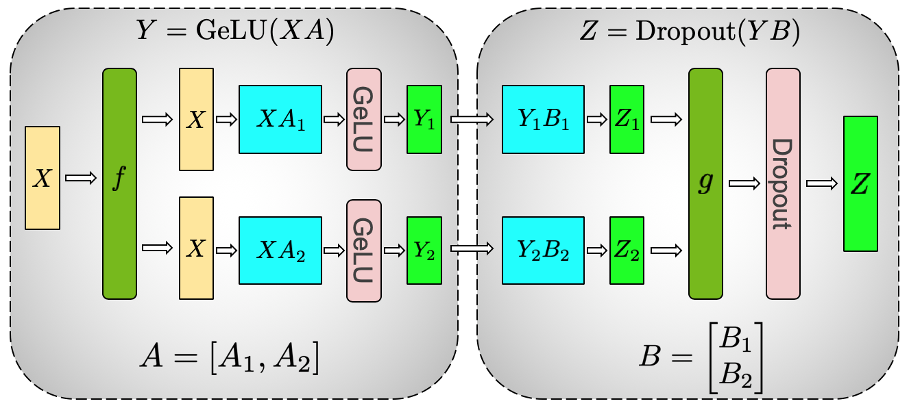
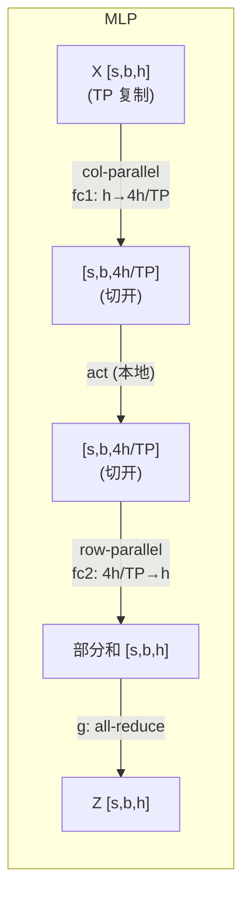

# Tensor Parallelism（TP）与 Sequence Parallelism（SP）

> 这一章要把 TP 和 SP 在 Transformer 里的每一处通信、每一个 autograd 边界，以及它们和显存、带宽之间的权衡讲清楚，并逐段对齐到 Megatron-LM 的真实代码。`f`/`g` 这两个算子会先给出定义，再一步步推导它们是怎么用起来的。

## 前置知识

- 熟悉 matmul 的基本运算；可先读 [02 · 计算 op：matmul / einsum / reduction / gather-scatter / SDPA](../../torch/02_compute_ops.md)。
- 熟悉 Transformer block（Attention 加 MLP）里数据是怎么流动的。
- 清楚集合通信的语义（all-reduce / all-gather / reduce-scatter）；不熟悉可以先看 [集合通信：原语、算法、NCCL 实现与拓扑映射](../../hpc/04_collectives.md)。

---

## 1. Activation 记号：`s`、`b`、`h` 与 sequence-first 布局

后面所有关于张量形状、显存和通信量的推导，都建立在一组固定的记号上，这里先一次性讲清楚。三个基本维度是：

| 记号 | 含义 | 在 Llama-70B 例子里（§6） |
|---|---|---|
| $s$ | **sequence length**：一条样本的 token 数 | `4096` |
| $b$ | **(micro) batch size**：一个 microbatch 里并排的样本数 | `1` |
| $h$ | **hidden size**：每个 token 的特征维（$= \mathrm{heads} \times \mathrm{head\_dim}$） | `8192` |

由 $h$ 派生出的两个量会贯穿整个 MLP 和 attention 的切分讨论：一个是 $4h$（FFN 的中间维，SwiGLU 实际算的是 $2 \times \mathrm{ffn\_hidden}$），另一个是 $a = \mathrm{heads}$ 和 $d = \mathrm{head\_dim}$（attention 按 head 切的时候用到的两个子维度，满足 $h = a \cdot d$）。

整个 Transformer 主干里流动的核心激活张量，形状始终是 **$[s, b, h]$**，注意 **$s$ 排在 $b$ 之前**。这个顺序不是随手写的，而是 Megatron 一个刻意的设计（**sequence-first layout**，也就是 `sbhd`，对应 TransformerEngine 里的同名格式）。

### sequence-first 与 batch-first 的边界

模型的输入和输出其实是 **batch-first** 的（`input_ids` 的形状是 $[b, s]$，对外输出的 logits 也是 $[b, s, \mathrm{vocab}]$），只有在进入 Transformer 主干的那一刻才会翻转成 sequence-first，主干跑完之后再翻回去：

- embedding 算完之后立刻做一次 `transpose(0,1)`：[[megatron-lm:megatron/core/models/common/embeddings/language_model_embedding.py#L119-L120]]，源码注释里直接写明了目的——「Data format change to avoid explicit tranposes : [b s h] --> [s b h]」。
- 主干跑完、算 logits 之前再转回来一次：[[megatron-lm:megatron/core/models/gpt/gpt_model.py#L764-L765]]「[s b h] => [b s h]」。

也就是说，**所有 TP/SP 的通信都发生在 $[s, b, h]$ 这段内部表示上**，后面第 3、4、6 节里写到的 $[s, b, h]$ 指的也都是这一段。

### `s` 在前的设计：通信零转置

原因直接写在通信原语的实现里：**SP 对 activation 做切分、聚合、规约，一律作用在 `dim 0` 上。**

- 切给本 rank 的部分用 `_split_along_first_dim`（[[megatron-lm:megatron/core/tensor_parallel/mappings.py#L56]]），核心操作是 `input_[dim_offset : dim_offset + local].contiguous()`（`:75`），沿着最外维取一段，恰好是一块连续的内存。
- 进入 TP 区时用 `_gather_along_first_dim`（[[megatron-lm:megatron/core/tensor_parallel/mappings.py#L114]]）沿 dim 0 拼接聚合。
- 离开 TP 区时用 `_reduce_scatter_along_first_dim`（[[megatron-lm:megatron/core/tensor_parallel/mappings.py#L155]]）做规约。

把 $s$ 放在 dim 0，这些 split/all-gather/reduce-scatter 就都能沿着张量最外、且连续的维度进行，不需要任何 transpose 或者额外的拷贝；04 里讲到的 TP comm-overlap（userbuffers 按 sequence 维分块流水）同样依赖这个前提。反过来，如果用 batch-first 的 $[b, s, h]$，按 $s$（此时是 dim 1）切就变成了 strided 访问，每次通信前都得先做一次转置，而这正是前面那句源码注释要「avoid」的开销。至于 $b$，它本来就不参与 TP/SP 的切分（属于 DP 维），放在中间反而最省事。

### `s` 需被 TP 整除，以及序列不等长的处理

既然 SP 是沿 dim 0 把 $s$ 均分到 TP 张卡上，代码里就写死了一条硬约束（[[megatron-lm:megatron/core/tensor_parallel/mappings.py#L68-L70]]）：

```python
assert dim_size % world_size == 0, \
    "First dimension of the tensor should be divisible by tensor parallel size"
```

这里的 `dim_size` 就是 $s$，`world_size` 是 TP size。所以开 SP 的时候，**$s$ 必须能被 TP 整除**，否则 reduce-scatter/all-gather 会直接报错退出。

那如果一个 batch 里的序列本来长度就不一样，要怎么塞进 `[s, b, h]` 这个形状呢？一般有两条路可走：

1. **pad 到同一长度（默认做法）**：把一个 microbatch 内的 $b$ 条序列都右 pad 到一个共同的长度 $s$，靠 attention mask 把 padding 位置屏蔽掉。开 SP 时再把这个 $s$ 向上取整到 TP 的倍数即可。代价是 padding 部分也要参与计算，序列长度的方差越大，浪费就越多。
2. **packed / `thd` 格式（变长不 pad）**：把 $b$ 条长度不同的序列首尾拼接成一条长度为 `total_tokens` 的序列，用 `cu_seqlens`（累积边界，形如 `[0, 5, 7, 11]`）记录每条序列的切点，再交给 flash/TE 的 varlen attention，靠这些边界信息阻断跨序列 attention。承载这些参数的结构是 `PackedSeqParams`（[[megatron-lm:megatron/core/packed_seq_params.py#L10-L25]]，包含 `qkv_format='thd'`、`cu_seqlens_*`、`max_seqlen_*` 等字段），在 attention 内部会被一路透传下去（[[megatron-lm:megatron/core/transformer/attention.py#L774]] 附近）。这种情况下「sequence 维」变成了 `total_tokens`，SP/CP 的整除约束也就改加在 pad 后的 `total_tokens` 上，具体由 `cu_seqlens_q_padded` 来对每条序列做对齐 padding。

记住这组记号，以及 sequence-first 布局的原因，后面讲到 `f`/`g` 把 all-reduce 拆成「沿 seq 维的 AG+RS」时就会很自然——它们拆的正是这个 dim 0。

---

## 2. column-parallel 与 row-parallel 的配合

TP 的核心想法，是把一个大的计算 $Z = f(XA) \cdot B$ 切到多张卡上分别算，再用集合通信把结果拼回逻辑上正确的张量。Megatron 巧妙的地方在于，column-parallel 和 row-parallel 这两种切法刚好互补，把它们串联起来之后，整段计算只需要一次通信：

```
column-parallel:   A = [A_1, A_2]            (按列切权重)
                   Y = X·A = [X·A_1, X·A_2]   每卡算一段输出列，无需通信即得 Y_i
row-parallel:      B = [B_1; B_2]            (按行切权重)
                   Z = Y·B = Y_1·B_1 + Y_2·B_2  每卡算一部分和，all-reduce 求和得 Z
```

把它们级联起来（column → 非线性 → row），中间的非线性函数是 element-wise 的，可以直接在切开的状态下计算，于是整段就变成了：

```
Z = f( X·A )·B        # f = GELU/SwiGLU 等
切开后:  Y_i = f(X·A_i)         (本地, 无通信)
         Z   = Σ_i Y_i·B_i      (一次 all-reduce)
```

> 一个 MLP block、或者一个 attention block，forward 只需要一次 all-reduce，backward 也只需要一次 all-reduce。这正是 Megatron TP 论文（Shoeybi et al., 2019, [arXiv:1909.08053](https://arxiv.org/abs/1909.08053)）的核心结论。代价是激活在 TP 维上处于「完整复制」状态（每张卡都持有完整的 $[s, b, h]$），这正是 SP 要解决的问题，见 03。



> 图：Megatron-LM MLP block 的 column→row 切分。`fc1`（$A = \mathrm{GeLU}(XA)$）按列切，激活天然切开、GeLU 本地算；`fc2`（$B$）按行切，输出是部分和，由 `g` 一次 all-reduce 求和。`f`/`g` 共轭：`f` forward identity / backward all-reduce，`g` forward all-reduce / backward identity。（Shoeybi et al. 2019, Fig 3a；[arXiv:1909.08053](https://arxiv.org/abs/1909.08053)）

### `f` 和 `g`：一对共轭算子

Megatron 把通信抽象成两个 autograd 算子 `f`、`g`，它们的 forward 和 backward 互为对偶（定义在 `mappings.py` 里）：

| 算子 | forward | backward | 代码 |
|---|---|---|---|
| `f` = `copy_to_tensor_model_parallel_region` | identity（复制） | **all-reduce** | `_CopyToModelParallelRegion` [[megatron-lm:megatron/core/tensor_parallel/mappings.py#L197]] |
| `g` = `reduce_from_tensor_model_parallel_region` | **all-reduce** | identity | `_ReduceFromModelParallelRegion` [[megatron-lm:megatron/core/tensor_parallel/mappings.py#L217]] |

放进 MLP 里：

```
forward:    X --[f]--> X --(col GEMM)--> Y_i --(act)--> --(row GEMM)--> Z_i --[g, all-reduce]--> Z
backward:                                                                   <--[g, identity]--
            <--[f, all-reduce]-- dX                                  dZ_i <--
```

- forward 进入 TP 区之前先经过 `f`（identity，不做任何事），离开 TP 区时经过 `g`（all-reduce，把各卡的部分和加起来）。
- backward 时角色对调：`g` 变成 identity（梯度直接原样传下去），`f` 变成 all-reduce（把各卡对输入算出的梯度加起来）。

理解了 `f`/`g` 这套对偶关系，基本就理解了 TP 全部通信的规律：只要记住 forward 在哪里通信，backward 的通信位置就自动确定了，会出现在算子的另一端。03 讲 SP 的时候，会把 `f`/`g` 各自的 all-reduce 拆成 all-gather 加 reduce-scatter 两半，逻辑完全一致，只是把通信量重新分配了一下。


> 图：一个 TP transformer layer 的全部通信点 —— attention 与 MLP 各一个 `f`（进区）+ 一个 `g`（出区），forward 共 2 次 all-reduce（两个 `g`）、backward 共 2 次（两个 `f`）。这张图把「一层 = 2 次 all-reduce」这个结论清楚地呈现了出来。（Shoeybi et al. 2019, Fig 4；[arXiv:1909.08053](https://arxiv.org/abs/1909.08053)）

---

## 3. column 与 row 的切分选择

切法不是随意选的，背后有一条明确的规则：**让一段 GEMM 链中间的张量始终保持「按 TP 维切开」的状态，只有在不得不做规约的时候才通信。**



- **fc1 用 column-parallel**：输出维 $4h$ 按 TP 切开，每张卡得到 $4h/\mathrm{TP}$ 列，中间激活天然是切开的状态，GELU 可以直接本地算，不需要通信。
- **fc2 用 row-parallel**：输入维 $4h$ 按 TP 切（正好接上 fc1 输出的切分方式），得到的输出是部分和，需要一次 all-reduce 才能合并成完整结果。

attention 的道理是一样的（详见 02）：`linear_qkv` 是 column-parallel（按 head 切），`linear_proj` 是 row-parallel。**「column 后面接 row」是 Megatron block 的通用骨架**，保证了整段计算只需要一次规约。

代码对应：
- `MLP`：`linear_fc1 = ColumnParallelLinear`（[[megatron-lm:megatron/core/transformer/mlp.py#L216]]），`linear_fc2 = RowParallelLinear`（[[megatron-lm:megatron/core/transformer/mlp.py#L236]]）。
- `SelfAttention`：`linear_qkv`（column，[[megatron-lm:megatron/core/transformer/attention.py#L1406]] 附近算 `linear_qkv_out_dim`），`linear_proj`（row，[[megatron-lm:megatron/core/transformer/attention.py#L394]]）。

---

## 4. TP 在并行体系里的位置

```
world = DP × CP × TP × PP   (× EP 在 MoE 里复用 DP×TP 的部分)
```

下面这张表梳理了 TP/SP/CP/PP/DP/EP 各自切什么、用什么通信原语、通信域是什么：

| 并行 | 切什么 | 通信原语 | 通信域 |
|---|---|---|---|
| **TP** | 单个权重矩阵的 hidden / head 维 | all-reduce（或 SP 下的 AG+RS） | `tensor_model_parallel_group` |
| **SP** | 在 TP 区**外**把 activation 按 sequence 维切 | all-gather / reduce-scatter | 复用 TP group |
| **CP** | attention 的 sequence 维（KV 跨卡） | ring / all-to-all | `context_parallel_group`（见 [CP](../04_cp/README.md)） |
| **PP** | 层（深度维） | P2P send/recv | `pipeline_model_parallel_group`（见 [PP](../03_pp/README.md)） |
| **DP** | batch | all-reduce / RS+AG（ZeRO） | `data_parallel_group`（见 [DP](../01_dp/README.md)） |
| **EP** | expert | all-to-all | 见 [EP](../05_ep/README.md) |

这里有几个关键的耦合点，会贯穿后面的内容：

- **TP 与 SP 是绑定在一起的**：SP 复用的就是 TP group，`sequence_parallel=True` 时会把 TP 的 all-reduce 拆成 AG（进区）加 RS（出区）。一个 token 的 hidden 在 TP 区内是按 hidden 维切开的，在 TP 区外则是按 seq 维切开的，两种切分方式通过 `f`/`g` 的变体来回切换。
- **TP group 通常放在最内层**（也就是 NVLink/NVSwitch 域内，比如单机 8 卡），原因是 TP 通信量大、频率高，对带宽最敏感；而 PP/DP 则放在外层，走跨机的 IB 网络。group 的构造逻辑在 `parallel_state.py` 里，TP 用连续的 rank 排布，正是为了让它落在同一个 NVLink 域内。
- **MoE 里 TP 被复用成了 ETP（Expert TP）**：expert 内部的 GEMM 也可以按 TP 切，dispatch 之后还要在 TP 维上 all-gather token。这更多是 dense 时代留下的兼容路径，生产级 MoE 更倾向于 ETP=1，具体原因见第 7 节，以及[Expert Parallelism (EP) —— Infra 视角深入](../05_ep/README.md)第 3 节。

---

## 5. forward/backward 通信对称表

和 MoE 一样，TP 的反向传播是前向的严格镜像。记住这张表会很有用，后面每一段内容都会回过头来对照它：

| forward 算子 | forward 通信 | backward 通信 | 代码锚点 |
|---|---|---|---|
| `f` (进 TP 区) | none | **all-reduce** (dX) | [[megatron-lm:megatron/core/tensor_parallel/mappings.py#L206-L214]] |
| `g` (出 TP 区) | **all-reduce** | none | [[megatron-lm:megatron/core/tensor_parallel/mappings.py#L226-L233]] |
| column GEMM (TP) | none | none（dgrad 本地） | [[megatron-lm:megatron/core/tensor_parallel/layers.py#L994]] |
| row GEMM (TP) | 在 `g` 里 | 在 `f` 里 | [[megatron-lm:megatron/core/tensor_parallel/layers.py#L1308]] |
| **SP**: `f` → AG | **all-gather** (seq) | **reduce-scatter** (seq) | `_GatherFromSequenceParallelRegion` [[megatron-lm:megatron/core/tensor_parallel/mappings.py#L296]] |
| **SP**: `g` → RS | **reduce-scatter** (seq) | **all-gather** (seq) | `_ReduceScatterToSequenceParallelRegion` [[megatron-lm:megatron/core/tensor_parallel/mappings.py#L351]] |
| vocab embedding | (RS if SP) | (AG) | [[megatron-lm:megatron/core/tensor_parallel/layers.py#L308-L319]] |
| vocab-parallel CE | all-reduce(max), all-reduce(sum) | 本地 | [[megatron-lm:megatron/core/tensor_parallel/cross_entropy.py#L130-L150]] |

> 这里有一个核心的事实：TP 的 dgrad（对输入的梯度）的 all-reduce，和 wgrad（对权重的梯度）的计算，两者互不依赖，所以完全可以 overlap 起来。这正是 04 要讲的 async communication 的物理基础。Megatron 靠设置 `CUDA_DEVICE_MAX_CONNECTIONS=1` 强制让通信 kernel 排在计算 kernel 之前发射，从而真正把延迟藏起来。

---

## 6. 一组贯穿全文的数字（Llama-70B 量级）

```
H = 8192            hidden
4H = 28672          FFN 中间维（SwiGLU 实际是 2×ffn）
heads = 64, head_dim = 128
TP = 8              单机 8 卡 NVLink
s = 4096, b = 1     per-microbatch
```

由此可以推出几个量级（都是单层、bf16 精度下）：

- **激活复制开销（没开 SP 时）**：进入 TP 区的 activation $[s, b, h]$ 大小是 `4096×8192×2B` ≈ 64 MB，而每张卡都要存一份完整副本，也就是说 TP 本身并不省 activation 的显存，它省的只是权重和算力。
- **SP 带来的收益**：开了 SP 之后，这块 activation 按 seq 切成 $[s/\mathrm{TP}, b, h]$，大小降到约 8 MB/卡；attention 和 MLP 之间的 LayerNorm 输入、dropout mask 等，都只按 $1/\mathrm{TP}$ 存了一份，activation 显存也就随着 TP 线性下降。这是 SP 存在的唯一理由。
- **通信量**：每层 forward 需要 1 次 $[s, b, h]$ 的 all-reduce（MLP）加 1 次（attention），合计约 `2 × 64MB`；开了 SP 之后这些通信被拆成 AG 加 RS，总字节数和 all-reduce 是一样的（因为 all-reduce 本质就等于 RS 加 AG），但拆开之后就能和 GEMM overlap 起来。

---

## 7. MoE 时代 TP 的式微

在 dense 时代，TP 是「单层权重装不下一张卡」问题的标准答案：把 $h \to 4h$ 这种大 GEMM 按 hidden 维或 head 维切开，再用机内 NVLink 上的 all-reduce 把结果合并回来。MoE 把这块 dense FFN 换成了「很多个更小的 expert」，于是最值得切分的轴从 hidden 维变成了 expert 维，TP 的性价比也随之下降。生产级的 MoE（比如 DeepSeek-V3、Kimi 这一类）典型的配置是**大规模 EP × DP(ZeRO) × PP，ETP=1**。Megatron 仍然保留了 ETP 这个选项，但它更多是一条兼容路径，不是推荐的做法。

具体来说，有三方面的原因：

1. **切分的对象变了。** TP 切的是「一张大权重矩阵的列/行」；EP 切的是「一堆独立的 expert」。细粒度 MoE 已经把每个 expert 的中间维切到了 `M/m`（见 [02 · 细粒度 MoE：从 Mixtral 到 DeepSeekMoE](../../moe/02_fine_grained.md)），如果再套一层 ETP，相当于把已经偏小的 GEMM 再除以 ETP，tensor core 根本填不满。相比之下，EP 把不同的 expert 分别放到不同卡上，每个 expert 的 GEMM 保持完整不被切碎，更容易把硬件跑满。
2. **要多付出一段关键路径上的通信。** 当 `ETP > 1` 时，EP 的 all-to-all 把 token 送到 expert 所在的 rank 之后，还要再做一次 TP 维的 all-gather（因为权重被切开了，每个 TP rank 都需要完整的 hidden）；combine 那一侧则对称地要做一次 reduce-scatter。这相当于在 dispatch/combine 之上又叠了一段通信，而且正好卡在 GEMM 前后的关键路径上。`ETP=1` 直接把这段 AG/RS 省掉了。具体代码落点见 [02 · Dispatch：permute、all-to-all、buffer 分配](../05_ep/02_dispatch.md)。
3. **「装不下」这个问题，已经被别的维度接手了。** 2019 年 Megatron-LM 用 TP，本质上是因为一层的权重加激活一张卡放不下。而现在的 MoE 训练栈里：expert 本身已经足够小（靠 EP 切开）、optimizer 走 ZeRO-1（见[Data Parallelism（DP）、ZeRO 与 FSDP](../01_dp/README.md)）、层数靠 PP 切、长序列靠 CP 切。TP 不再是解决显存问题时的第一选择。连带的，SP 存在的理由（也就是消化 TP 复制出来的那份 $[s, b, h]$）也随之变弱了，`TP=1` 的时候，激活本来就不会被复制。

```
dense 一层:   [===== 大 GEMM =====] --all-reduce-->   用 TP 把大矩阵切开
MoE 一层:    expert_0 | expert_1 | … | expert_{E-1}   用 EP 把专家切开
             └完整 GEMM┘                              ETP=1，不再二次切 hidden
```

| | Dense 时代（TP 主力） | MoE 时代（EP 主力） |
|---|---|---|
| 切什么 | 单层 GEMM 的 hidden / head | 一堆 expert |
| 主通信 | 每层 2× all-reduce（attn + MLP） | dispatch / combine all-to-all |
| GEMM 形状 | 大矩阵被 TP 切小 | 小 expert 保持完整（`ETP=1`） |
| 显存 | TP 省权重，激活靠 SP | EP 省 expert 权重，optimizer 靠 ZeRO |
| 典型配 | `TP=8 × PP × DP` | `EP=64 × PP × DP`，`ETP=1` |

TP 并没有完全消失，只是从「默认要切的轴」退成了「局部才用的轴」，具体还在用的地方有：

- **Attention**：MLA / GQA 权重大约比 MoE FFN 小一个数量级，有的配置只给 attention 留很小的 TP，expert 侧 `ETP=1`。
- **Dense 模型 / 专家不够多的 MoE**：没有足够 expert 可切时，TP 仍是机内扩卡的默认手段。
- **Serving**：decode 阶段 EP 的 all-to-all 延迟更刺眼，部分推理栈仍用 TP 切 dense 或小 MoE。

---

## 这组文档怎么读

下面这张表列出了这组文档的分工，可以按顺序对着代码路径逐篇读下去：

| 文件 | 内容 | 对应代码 |
|---|---|---|
| `README.md`（本文） | 全景：`f`/`g` 共轭算子、column/row 切法、通信点、并行维度、和 SP/CP/MoE 的关系；MoE 时代 TP 为何逐渐被弃用 | `layers.py`, `mappings.py` |
| [01 · ColumnParallelLinear / RowParallelLinear 与核心 autograd](./01_linear_layers.md) | `ColumnParallelLinear` / `RowParallelLinear` 逐行；核心 autograd `LinearWithGradAccumulationAndAsyncCommunication`；async dgrad all-reduce、`gradient_accumulation_fusion`、`main_grad` | `layers.py:464-663, 778-1364` |
| [02 · 整个 Transformer block 的切分方式](./02_transformer_block.md) | 整个 attention + MLP block 怎么切成 col→row 两段、为什么这样切只需 1 次 all-reduce；vocab-parallel embedding 与 cross entropy；TP RNG tracker（dropout 一致性） | `attention.py`, `mlp.py`, `cross_entropy.py`, `random.py` |
| [03 · Sequence Parallelism：AG/RS 替换 all-reduce](./03_sequence_parallel.md) | SP 的来由（activation 显存）、用 AG/RS 替换 all-reduce、TP+SP 合并数据流、`sp2hp`/`hp2sp` all-to-all | `mappings.py`, `layers.py` SP 分支 |
| [04 · TP/SP 的通信-计算 overlap 与工程优化](./04_overlap_and_optimizations.md) | `CUDA_DEVICE_MAX_CONNECTIONS=1` 的玄机、async all-reduce/RS 与 wgrad overlap、`tp_comm_overlap`/userbuffers（ring / pipelined AG-GEMM、GEMM-RS）、FP8、与 DP overlap 的耦合 | `layers.py` backward, [[megatron-lm:megatron/core/model_parallel_config.py#L184-L240]] |
| [[atlas:docs/parallel/02_tp_sp/tp_sp_lab.ipynb]] | 纯 torch 手写 TP+SP 的两层 MLP 前反向，用 `torch.distributed`（gloo、本地多进程）真实跑通 all-reduce/AG/RS，并和单进程 reference 逐元素对齐，可在 Mac CPU 上跑 | —— |

读的顺序建议是：先读本文，建立起对 `f`/`g` 这套通信抽象的理解；再看 01 把 linear layer 的实现看透；02 把它们拼成完整的 block；03 在此基础上叠加 SP；04 讲工程上怎么做 overlap 优化；最后做一遍 lab，亲手实现一次。

## 参考代码

参考代码（均为上游固定 commit，代码链接带 `#Lx-Ly`，对应 commit `e03878b5f`）：

- [[megatron-lm:megatron/core/tensor_parallel/layers.py]] —— `ColumnParallelLinear` / `RowParallelLinear` / 核心 autograd function
- [[megatron-lm:megatron/core/tensor_parallel/mappings.py]] —— `f`/`g` 通信原语（copy / all-reduce / scatter / gather / reduce-scatter / all-to-all）
- [[megatron-lm:megatron/core/tensor_parallel/cross_entropy.py]] —— vocab-parallel cross entropy
- [[megatron-lm:megatron/core/tensor_parallel/random.py]] —— TP 专用 RNG tracker
- [[megatron-lm:megatron/core/transformer/mlp.py]] / [[megatron-lm:megatron/core/transformer/attention.py]] —— Transformer block 怎么切

---

了解了整体的框架和权衡之后，下一步是把 `ColumnParallelLinear` 和 `RowParallelLinear` 逐行拆开看，尤其是那个承载了 async 通信和 grad accumulation fusion 的核心 autograd function。这就是[01 · ColumnParallelLinear / RowParallelLinear 与核心 autograd](./01_linear_layers.md)要讲的内容。
